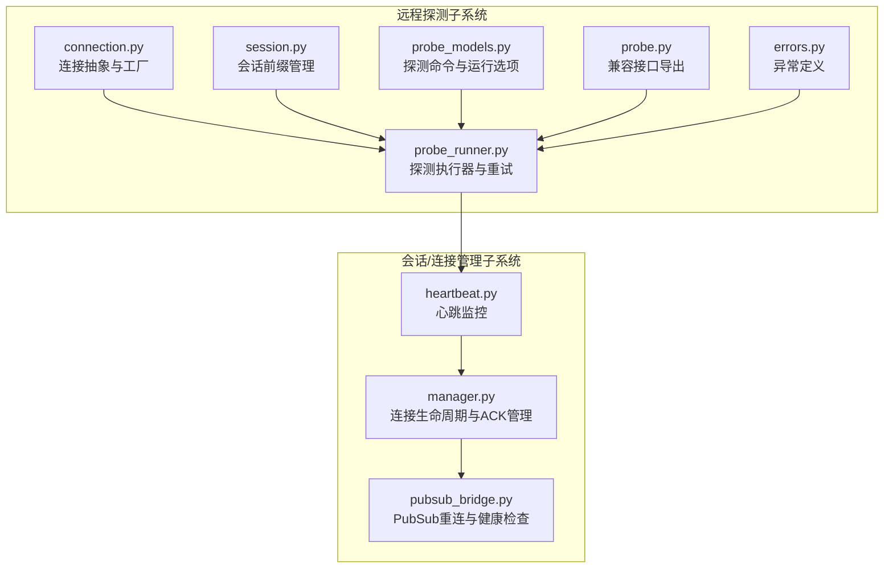
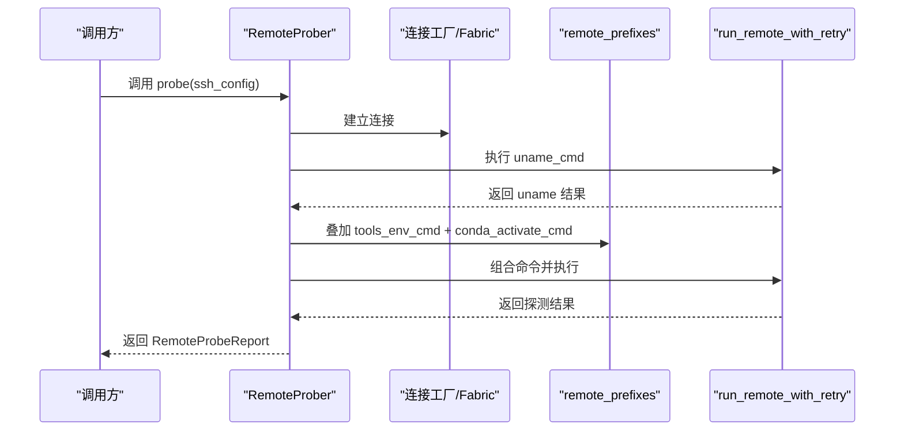
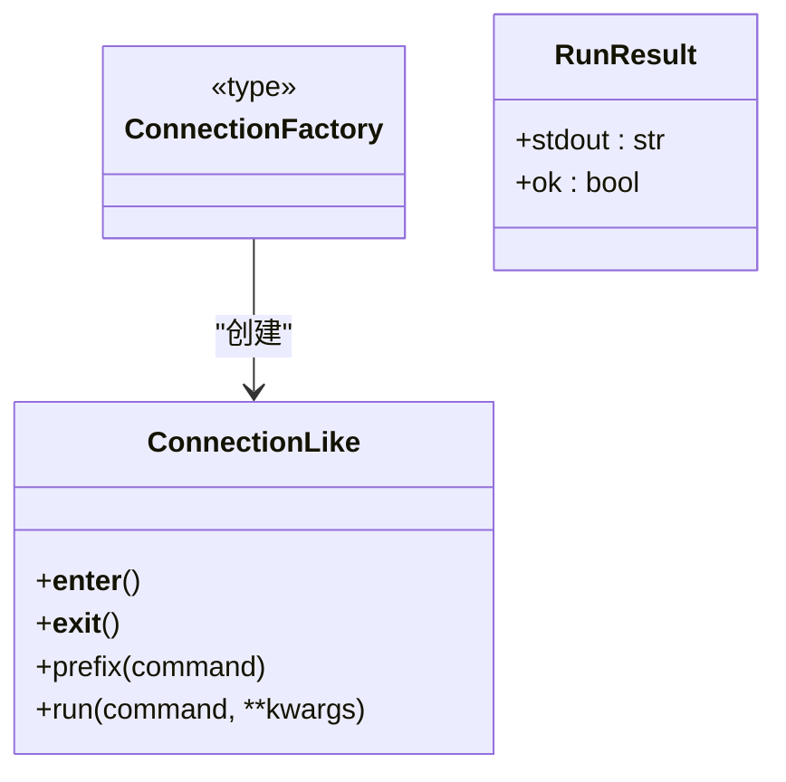
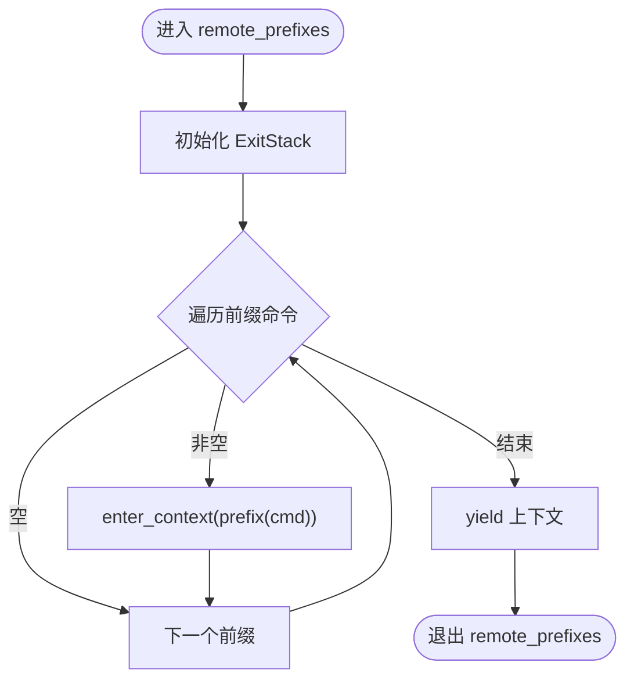
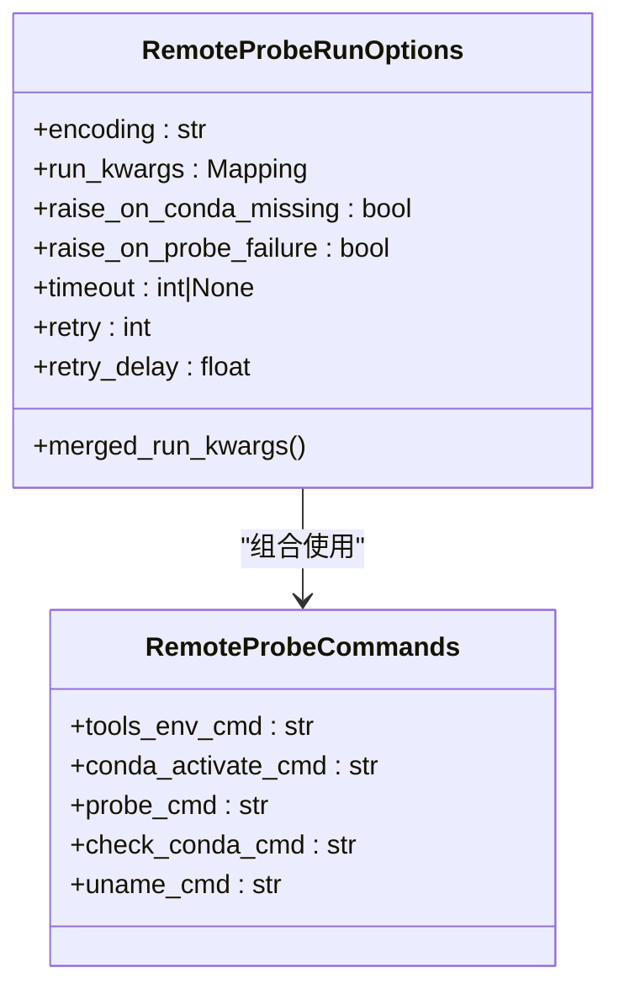
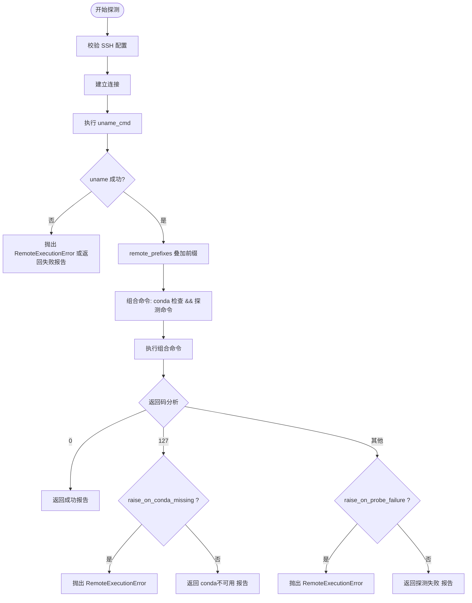
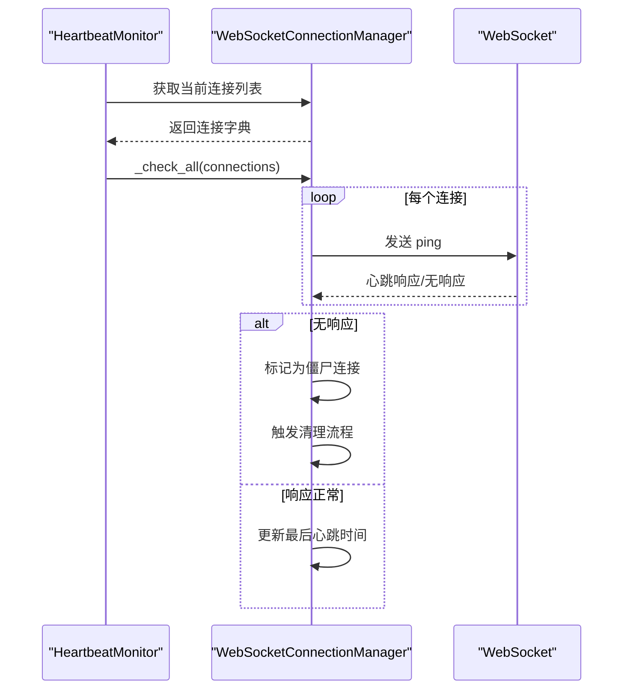
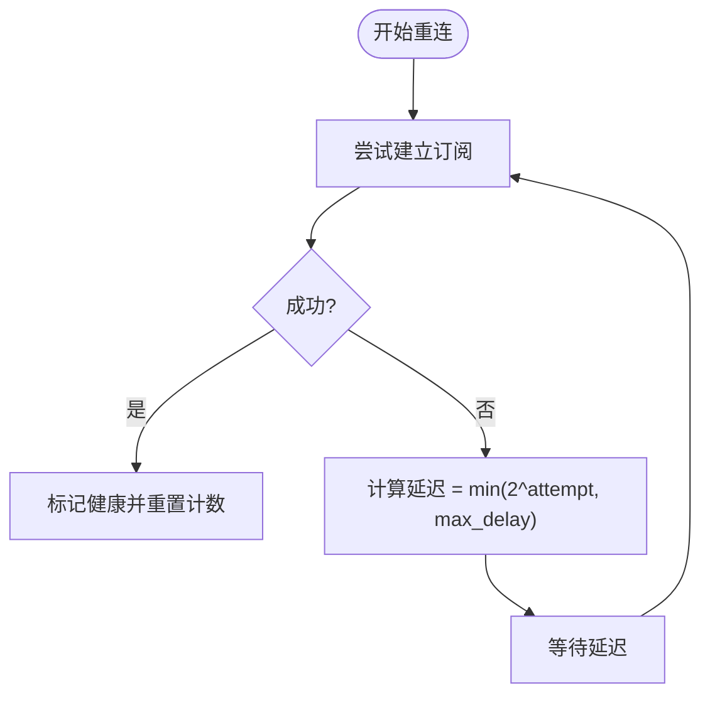
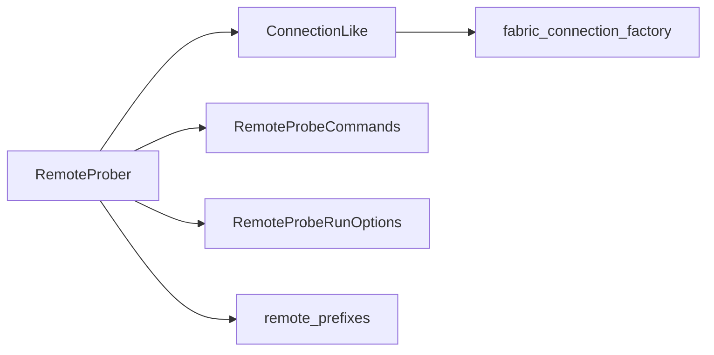

# 远程接口系统

<cite>
**本文引用的文件**
- [connection.py](file://src/taolib/testing/remote/connection.py)
- [session.py](file://src/taolib/testing/remote/session.py)
- [probe.py](file://src/taolib/testing/remote/probe.py)
- [probe_models.py](file://src/taolib/testing/remote/probe_models.py)
- [probe_runner.py](file://src/taolib/testing/remote/probe_runner.py)
- [errors.py](file://src/taolib/testing/remote/errors.py)
- [test_remote_interfaces.py](file://tests/testing/test_remote_interfaces.py)
- [perf_remote_bench.py](file://tests/testing/perf_remote_bench.py)
- [heartbeat.py](file://src/taolib/testing/config_center/server/websocket/heartbeat.py)
- [manager.py](file://src/taolib/testing/config_center/server/websocket/manager.py)
- [pubsub_bridge.py](file://src/taolib/testing/config_center/server/websocket/pubsub_bridge.py)
</cite>

## 目录
1. [简介](#简介)
2. [项目结构](#项目结构)
3. [核心组件](#核心组件)
4. [架构总览](#架构总览)
5. [详细组件分析](#详细组件分析)
6. [依赖分析](#依赖分析)
7. [性能考虑](#性能考虑)
8. [故障排查指南](#故障排查指南)
9. [结论](#结论)
10. [附录](#附录)

## 简介
本技术文档面向远程接口系统，聚焦于远程连接管理、探测机制与会话控制的设计与实现。文档覆盖连接建立、维护与断开的完整流程，详述网络探测、健康检查与状态监控的实现方法，包含会话管理、超时控制与重连机制的技术细节，并提供配置选项、性能优化与故障恢复策略。同时解释协议抽象、消息传递与错误处理机制，给出完整的API参考、使用示例与集成指南。

## 项目结构
远程接口系统位于测试模块中，围绕“远程探测”与“会话/连接管理”两条主线展开：
- 远程探测子系统：提供连接抽象、命令组合与执行、探测报告与错误处理。
- 会话/连接管理子系统：提供心跳监控、ACK确认与重传、离线缓冲与重连策略，保障长连接稳定性。

**图表来源**
- [connection.py:1-39](file://src/taolib/testing/remote/connection.py#L1-L39)
- [session.py:1-23](file://src/taolib/testing/remote/session.py#L1-L23)
- [probe_models.py:1-76](file://src/taolib/testing/remote/probe_models.py#L1-L76)
- [probe_runner.py:1-270](file://src/taolib/testing/remote/probe_runner.py#L1-L270)
- [probe.py:1-95](file://src/taolib/testing/remote/probe.py#L1-L95)
- [errors.py:1-24](file://src/taolib/testing/remote/errors.py#L1-L24)
- [heartbeat.py:45-87](file://src/taolib/testing/config_center/server/websocket/heartbeat.py#L45-L87)
- [manager.py:393-425](file://src/taolib/testing/config_center/server/websocket/manager.py#L393-L425)
- [pubsub_bridge.py:181-221](file://src/taolib/testing/config_center/server/websocket/pubsub_bridge.py#L181-L221)

**章节来源**
- [connection.py:1-39](file://src/taolib/testing/remote/connection.py#L1-L39)
- [session.py:1-23](file://src/taolib/testing/remote/session.py#L1-L23)
- [probe_models.py:1-76](file://src/taolib/testing/remote/probe_models.py#L1-L76)
- [probe_runner.py:1-270](file://src/taolib/testing/remote/probe_runner.py#L1-L270)
- [probe.py:1-95](file://src/taolib/testing/remote/probe.py#L1-L95)
- [errors.py:1-24](file://src/taolib/testing/remote/errors.py#L1-L24)
- [heartbeat.py:45-87](file://src/taolib/testing/config_center/server/websocket/heartbeat.py#L45-L87)
- [manager.py:393-425](file://src/taolib/testing/config_center/server/websocket/manager.py#L393-L425)
- [pubsub_bridge.py:181-221](file://src/taolib/testing/config_center/server/websocket/pubsub_bridge.py#L181-L221)

## 核心组件
- 连接抽象与工厂：定义统一的连接协议与Fabric工厂，支持按需导入与错误提示。
- 会话前缀管理：在单一命令执行上下文中叠加多个前缀命令，确保环境变量与激活脚本生效。
- 探测命令与运行选项：集中管理uname、conda检测与探测命令，以及编码、超时、重试等运行参数。
- 探测执行器：负责连接建立、uname验证、前缀叠加、conda可用性判断与探测命令执行，产出结构化报告。
- 兼容接口：对外提供简洁的probe_remote入口，向后兼容既有形态。
- 异常体系：统一的远程错误类型，便于上层捕获与处理。
- 心跳监控：周期性检查连接健康，清理僵尸连接。
- ACK管理与重传：对需要确认的消息进行重传与离线缓冲，提升可靠性。
- PubSub重连：指数退避重连，保障发布订阅链路稳定。

**章节来源**
- [connection.py:1-39](file://src/taolib/testing/remote/connection.py#L1-L39)
- [session.py:1-23](file://src/taolib/testing/remote/session.py#L1-L23)
- [probe_models.py:1-76](file://src/taolib/testing/remote/probe_models.py#L1-L76)
- [probe_runner.py:112-225](file://src/taolib/testing/remote/probe_runner.py#L112-L225)
- [probe.py:24-80](file://src/taolib/testing/remote/probe.py#L24-L80)
- [errors.py:4-24](file://src/taolib/testing/remote/errors.py#L4-L24)
- [heartbeat.py:45-87](file://src/taolib/testing/config_center/server/websocket/heartbeat.py#L45-L87)
- [manager.py:393-425](file://src/taolib/testing/config_center/server/websocket/manager.py#L393-L425)
- [pubsub_bridge.py:181-221](file://src/taolib/testing/config_center/server/websocket/pubsub_bridge.py#L181-L221)

## 架构总览
远程接口系统采用“探测驱动 + 会话管理”的双轨架构：
- 探测驱动：通过RemoteProber串联连接、命令组合与执行，产出RemoteProbeReport，作为后续操作的依据。
- 会话管理：基于心跳监控与ACK管理，维持长连接的健康与消息可靠投递；PubSub桥接提供跨实例的事件分发与重连能力。

**图表来源**
- [probe_runner.py:120-225](file://src/taolib/testing/remote/probe_runner.py#L120-L225)
- [session.py:12-21](file://src/taolib/testing/remote/session.py#L12-L21)
- [connection.py:27-36](file://src/taolib/testing/remote/connection.py#L27-L36)

**章节来源**
- [probe_runner.py:1-270](file://src/taolib/testing/remote/probe_runner.py#L1-L270)
- [session.py:1-23](file://src/taolib/testing/remote/session.py#L1-L23)
- [connection.py:1-39](file://src/taolib/testing/remote/connection.py#L1-L39)

## 详细组件分析

### 连接抽象与工厂
- 协议定义：ConnectionLike协议抽象了上下文进入/退出、命令前缀与执行接口，便于替换底层实现。
- 工厂函数：fabric_connection_factory提供默认的Fabric连接工厂，并在导入失败时抛出RemoteDependencyError，提示用户安装依赖。
- 缓存策略：工厂函数使用LRU缓存，避免重复导入与初始化开销。

**图表来源**
- [connection.py:12-36](file://src/taolib/testing/remote/connection.py#L12-L36)

**章节来源**
- [connection.py:1-39](file://src/taolib/testing/remote/connection.py#L1-L39)

### 会话前缀管理
- remote_prefixes：在单个命令执行上下文中叠加多个前缀命令，自动忽略空白指令，确保环境变量与激活脚本按序生效。
- 适用场景：在uname之后、探测命令之前，统一注入工具环境与conda激活上下文。

**图表来源**
- [session.py:12-21](file://src/taolib/testing/remote/session.py#L12-L21)

**章节来源**
- [session.py:1-23](file://src/taolib/testing/remote/session.py#L1-L23)

### 探测命令与运行选项
- RemoteProbeCommands：集中定义uname_cmd、check_conda_cmd、probe_cmd、tools_env_cmd、conda_activate_cmd等命令集。
- RemoteProbeRunOptions：集中定义encoding、run_kwargs、raise_on_conda_missing、raise_on_probe_failure、timeout、retry、retry_delay等运行与错误处理选项，并提供merged_run_kwargs用于与连接执行参数合并。
- 默认值：通过环境变量提供可覆盖的默认命令与编码。

**图表来源**
- [probe_models.py:17-76](file://src/taolib/testing/remote/probe_models.py#L17-L76)

**章节来源**
- [probe_models.py:1-76](file://src/taolib/testing/remote/probe_models.py#L1-L76)

### 探测执行器与重试
- RemoteProber：核心执行器，支持注入connection_factory、commands与options，负责校验SSH配置、连接远端、执行uname、叠加前缀、检测conda与探测命令，并根据选项决定异常抛出或结构化返回。
- run_remote_with_retry：统一的带重试命令执行器，支持重试次数与重试间隔，将特定平台的中断异常归一化为KeyboardInterrupt。
- 兼容接口：probe_remote保持既有API形态，内部委托RemoteProber执行。

**图表来源**
- [probe_runner.py:120-225](file://src/taolib/testing/remote/probe_runner.py#L120-L225)

**章节来源**
- [probe_runner.py:1-270](file://src/taolib/testing/remote/probe_runner.py#L1-L270)

### 兼容接口与异常体系
- 兼容接口：probe_remote提供与既有形态一致的调用方式，便于迁移与兼容。
- 异常体系：RemoteError为基类，派生出RemoteDependencyError、RemoteConfigError、RemoteExecutionError，便于上层区分处理。

**章节来源**
- [probe.py:24-80](file://src/taolib/testing/remote/probe.py#L24-L80)
- [errors.py:4-24](file://src/taolib/testing/remote/errors.py#L4-L24)

### 心跳监控与会话控制
- 心跳监控：HeartbeatMonitor周期性检查连接，超时则触发清理流程。
- 连接生命周期：WebSocketConnectionManager负责连接建立、断开、订阅管理与统计。
- ACK管理与重传：对需要确认的消息进行重传与离线缓冲，超过最大重试次数后转入离线缓冲队列。
- 僵尸连接处理：识别长时间无心跳的连接并进行清理。

**图表来源**
- [heartbeat.py:68-87](file://src/taolib/testing/config_center/server/websocket/heartbeat.py#L68-L87)
- [manager.py:423-425](file://src/taolib/testing/config_center/server/websocket/manager.py#L423-L425)

**章节来源**
- [heartbeat.py:45-87](file://src/taolib/testing/config_center/server/websocket/heartbeat.py#L45-L87)
- [manager.py:393-425](file://src/taolib/testing/config_center/server/websocket/manager.py#L393-L425)

### PubSub重连与健康检查
- 健康检查：定期检查Redis健康状态，失败时标记为不健康。
- 指数退避重连：失败后按2^attempt次幂增加延迟，最多不超过最大延迟，成功后重置计数并记录成功日志。

**图表来源**
- [pubsub_bridge.py:188-221](file://src/taolib/testing/config_center/server/websocket/pubsub_bridge.py#L188-L221)

**章节来源**
- [pubsub_bridge.py:181-221](file://src/taolib/testing/config_center/server/websocket/pubsub_bridge.py#L181-L221)

## 依赖分析
- 组件耦合：RemoteProber依赖ConnectionLike、RemoteProbeCommands与RemoteProbeRunOptions，形成清晰的职责分离；session模块为prober提供前缀叠加能力。
- 外部依赖：默认使用Fabric作为SSH客户端，若缺失则抛出RemoteDependencyError。
- 循环依赖：各模块间通过协议与数据类解耦，未见循环依赖迹象。

**图表来源**
- [probe_runner.py:16-25](file://src/taolib/testing/remote/probe_runner.py#L16-L25)
- [connection.py:27-36](file://src/taolib/testing/remote/connection.py#L27-L36)
- [session.py:12-21](file://src/taolib/testing/remote/session.py#L12-L21)

**章节来源**
- [probe_runner.py:1-270](file://src/taolib/testing/remote/probe_runner.py#L1-L270)
- [connection.py:1-39](file://src/taolib/testing/remote/connection.py#L1-L39)
- [session.py:1-23](file://src/taolib/testing/remote/session.py#L1-L23)

## 性能考虑
- 命令执行重试：run_remote_with_retry支持retry与retry_delay，减少瞬时网络抖动影响，但会增加总耗时。建议在高延迟场景下调小retry或启用超时。
- 合并运行参数：RemoteProbeRunOptions.merged_run_kwargs将encoding与timeout合并到run_kwargs，避免重复参数传递。
- 并发与高延迟：性能基准测试显示，平均每次探测涉及多次run调用，理论最小耗时约为run_count × 单次延迟；可通过减少不必要的命令或优化前缀叠加降低开销。
- 线程安全配置缓存：SSH配置加载具备线程安全保证，适合并发场景使用。

**章节来源**
- [probe_runner.py:43-90](file://src/taolib/testing/remote/probe_runner.py#L43-L90)
- [probe_models.py:67-74](file://src/taolib/testing/remote/probe_models.py#L67-L74)
- [perf_remote_bench.py:158-699](file://tests/testing/perf_remote_bench.py#L158-L699)

## 故障排查指南
- 依赖缺失：导入Fabric失败时抛出RemoteDependencyError，检查依赖安装与版本。
- 配置错误：validate_ssh_config_minimal校验host与user，缺失或为空将抛出RemoteConfigError。
- 命令执行失败：RemoteExecutionError携带command字段，便于定位具体命令；结合raise_on_conda_missing与raise_on_probe_failure选项决定是抛出异常还是返回结构化报告。
- 中断处理：run_remote_handling_interrupt将特定平台的中断异常归一化为KeyboardInterrupt，简化上层处理。
- 心跳与僵尸连接：HeartbeatMonitor异常日志与清理流程有助于发现并处理长时间无响应的连接。
- PubSub重连：重连失败会持续指数退避并记录异常，确认Redis服务可用性与网络连通性。

**章节来源**
- [errors.py:4-24](file://src/taolib/testing/remote/errors.py#L4-L24)
- [probe_runner.py:27-41](file://src/taolib/testing/remote/probe_runner.py#L27-L41)
- [probe_runner.py:92-110](file://src/taolib/testing/remote/probe_runner.py#L92-L110)
- [heartbeat.py:79-81](file://src/taolib/testing/config_center/server/websocket/heartbeat.py#L79-L81)
- [pubsub_bridge.py:188-221](file://src/taolib/testing/config_center/server/websocket/pubsub_bridge.py#L188-L221)

## 结论
远程接口系统通过协议抽象与模块化设计，实现了可靠的远程连接管理、探测机制与会话控制。探测执行器提供灵活的命令组合与错误处理策略，心跳监控与ACK管理保障长连接的稳定性，PubSub重连机制提升跨实例通信的韧性。配合性能基准测试与线程安全设计，系统在复杂网络环境下仍能保持高效与稳健。

## 附录

### API参考（远程探测）
- RemoteProbeReport
  - 字段：uname、conda_available、probe_attempted、probe_ok
  - 语义：当conda不可用时，probe_attempted为False且probe_ok为None；当探测命令退出码为0时probe_ok为True，否则为False。
- RemoteProbeCommands
  - 字段：tools_env_cmd、conda_activate_cmd、probe_cmd、check_conda_cmd、uname_cmd
  - 用途：集中定义探测命令集，支持自定义覆盖。
- RemoteProbeRunOptions
  - 字段：encoding、run_kwargs、raise_on_conda_missing、raise_on_probe_failure、timeout、retry、retry_delay
  - 方法：merged_run_kwargs()将encoding与timeout合并到run_kwargs。
- RemoteProber
  - 方法：probe(ssh_config) -> RemoteProbeReport
  - 依赖：connection_factory、commands、options
- probe_remote(ssh_config, ...) -> RemoteProbeReport
  - 兼容接口，内部委托RemoteProber执行。

**章节来源**
- [probe_models.py:17-76](file://src/taolib/testing/remote/probe_models.py#L17-L76)
- [probe_runner.py:112-225](file://src/taolib/testing/remote/probe_runner.py#L112-L225)
- [probe.py:24-80](file://src/taolib/testing/remote/probe.py#L24-L80)

### 使用示例与集成指南
- 基本探测
  - 使用probe_remote传入SSH配置，系统将自动执行uname、conda检测与探测命令，并返回结构化报告。
- 自定义命令与选项
  - 通过RemoteProbeCommands与RemoteProbeRunOptions注入自定义命令与运行参数，推荐优先使用RemoteProber而非兼容接口。
- 会话管理集成
  - 将RemoteProbeReport中的uname信息用于会话初始化与资源分配；结合心跳监控与ACK管理，确保长连接稳定。
- PubSub桥接
  - 在分布式场景中，利用PubSub桥接的健康检查与指数退避重连，保障事件分发的连续性。

**章节来源**
- [probe.py:24-80](file://src/taolib/testing/remote/probe.py#L24-L80)
- [probe_runner.py:227-267](file://src/taolib/testing/remote/probe_runner.py#L227-L267)
- [heartbeat.py:45-87](file://src/taolib/testing/config_center/server/websocket/heartbeat.py#L45-L87)
- [manager.py:393-425](file://src/taolib/testing/config_center/server/websocket/manager.py#L393-L425)
- [pubsub_bridge.py:181-221](file://src/taolib/testing/config_center/server/websocket/pubsub_bridge.py#L181-L221)