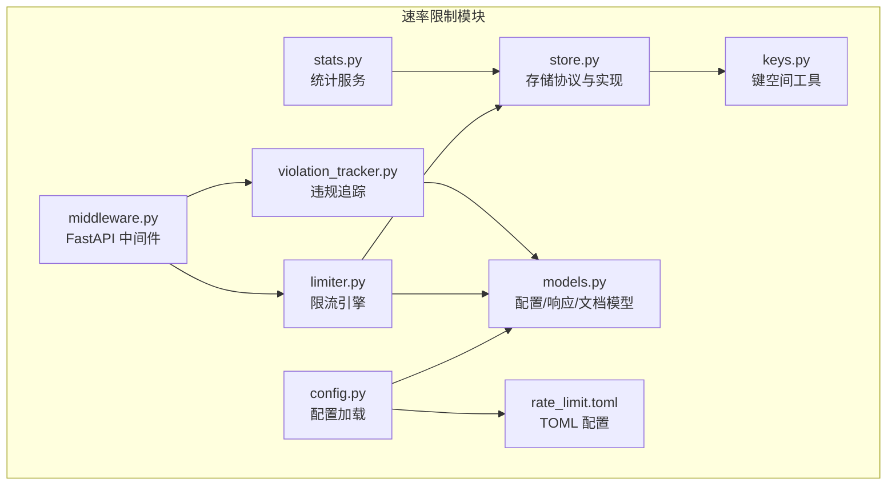
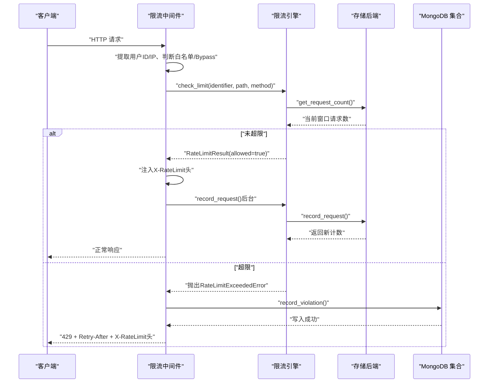
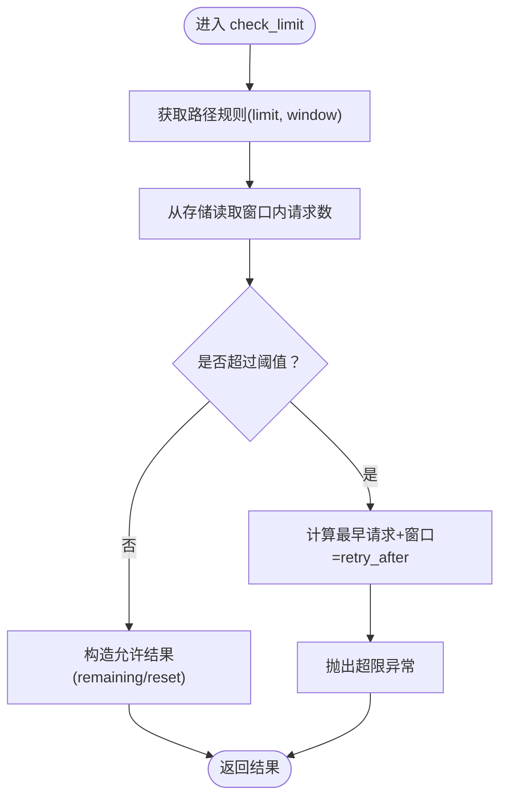
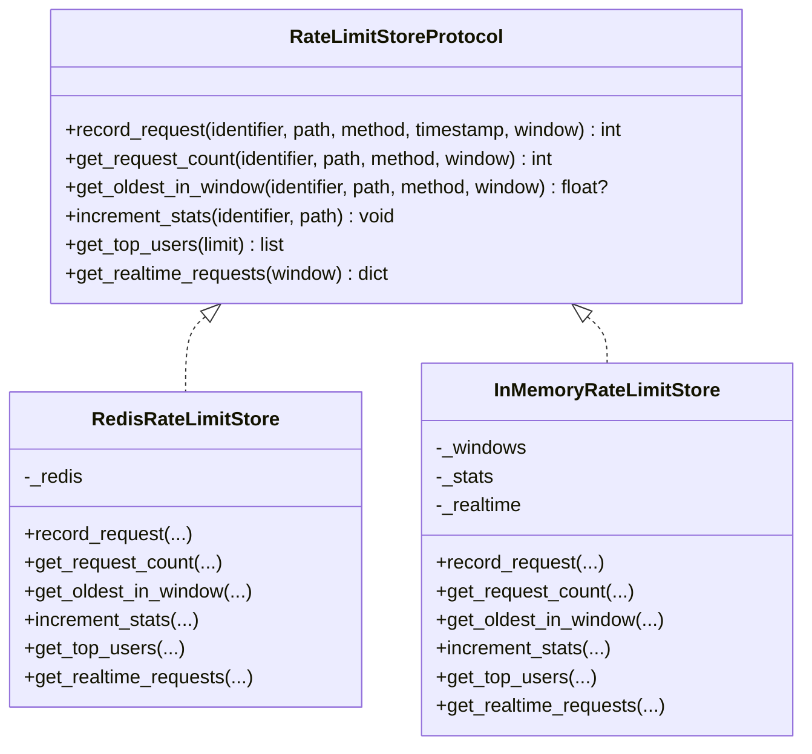
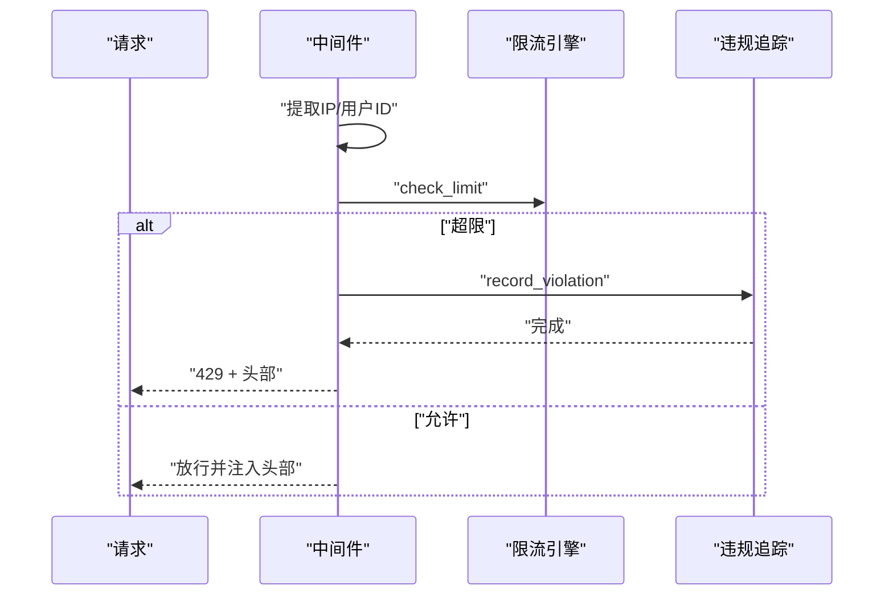
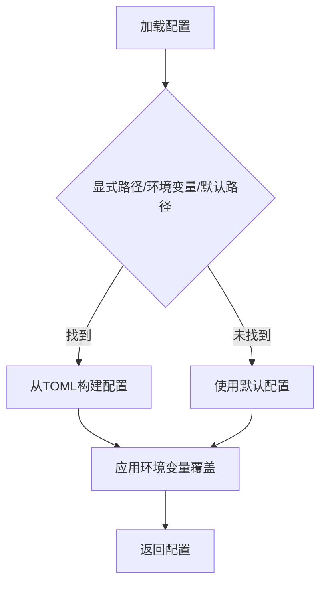
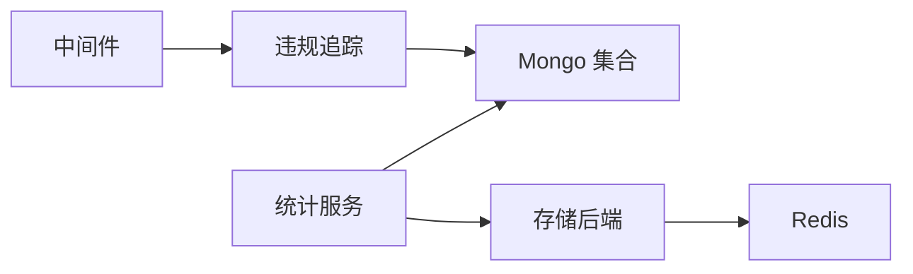
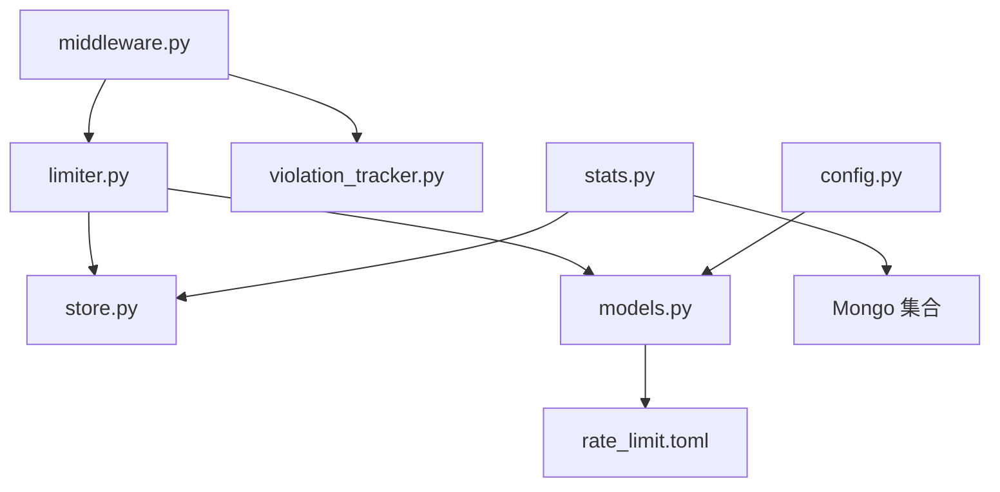

# 速率限制系统

<cite>
**本文引用的文件**
- [limiter.py](file://src/taolib/testing/rate_limiter/limiter.py)
- [store.py](file://src/taolib/testing/rate_limiter/store.py)
- [middleware.py](file://src/taolib/testing/rate_limiter/middleware.py)
- [models.py](file://src/taolib/testing/rate_limiter/models.py)
- [config.py](file://src/taolib/testing/rate_limiter/config.py)
- [violation_tracker.py](file://src/taolib/testing/rate_limiter/violation_tracker.py)
- [stats.py](file://src/taolib/testing/rate_limiter/stats.py)
- [keys.py](file://src/taolib/testing/rate_limiter/keys.py)
- [rate_limit.toml](file://src/taolib/testing/rate_limiter/rate_limit.toml)
- [router.py](file://src/taolib/testing/rate_limiter/api/router.py)
- [example_integration.py](file://src/taolib/testing/rate_limiter/example_integration.py)
</cite>

## 目录
1. [简介](#简介)
2. [项目结构](#项目结构)
3. [核心组件](#核心组件)
4. [架构总览](#架构总览)
5. [详细组件分析](#详细组件分析)
6. [依赖关系分析](#依赖关系分析)
7. [性能考虑](#性能考虑)
8. [故障排除指南](#故障排除指南)
9. [结论](#结论)
10. [附录](#附录)

## 简介
本文件为速率限制系统的技术文档，面向需要在 FastAPI 应用中集成滑动窗口限流、中间件接入、统计与违规追踪的开发者。系统采用滑动窗口算法，支持基于用户 ID 与 IP 的双维度限流，并提供 Redis 与内存两种存储后端；同时具备完善的配置管理、实时统计、违规记录与索引策略，以及可扩展的 API 接口。

## 项目结构
速率限制模块位于 `src/taolib/testing/rate_limiter/`，主要文件包括：
- 核心引擎：limiter.py
- 存储后端：store.py（Redis 与内存实现）
- 中间件：middleware.py
- 配置与模型：models.py、config.py、rate_limit.toml
- 违规追踪：violation_tracker.py
- 统计服务：stats.py
- 键空间工具：keys.py
- 示例与路由：example_integration.py、api/router.py

**图表来源**
- [limiter.py:15-202](file://src/taolib/testing/rate_limiter/limiter.py#L15-L202)
- [store.py:15-336](file://src/taolib/testing/rate_limiter/store.py#L15-L336)
- [middleware.py:68-199](file://src/taolib/testing/rate_limiter/middleware.py#L68-L199)
- [config.py:19-82](file://src/taolib/testing/rate_limiter/config.py#L19-L82)
- [models.py:31-167](file://src/taolib/testing/rate_limiter/models.py#L31-L167)
- [violation_tracker.py:7-82](file://src/taolib/testing/rate_limiter/violation_tracker.py#L7-L82)
- [stats.py:9-109](file://src/taolib/testing/rate_limiter/stats.py#L9-L109)
- [keys.py:4-57](file://src/taolib/testing/rate_limiter/keys.py#L4-L57)
- [rate_limit.toml:1-46](file://src/taolib/testing/rate_limiter/rate_limit.toml#L1-L46)

**章节来源**
- [limiter.py:15-202](file://src/taolib/testing/rate_limiter/limiter.py#L15-L202)
- [store.py:15-336](file://src/taolib/testing/rate_limiter/store.py#L15-L336)
- [middleware.py:68-199](file://src/taolib/testing/rate_limiter/middleware.py#L68-L199)
- [models.py:31-167](file://src/taolib/testing/rate_limiter/models.py#L31-L167)
- [config.py:19-82](file://src/taolib/testing/rate_limiter/config.py#L19-L82)
- [violation_tracker.py:7-82](file://src/taolib/testing/rate_limiter/violation_tracker.py#L7-L82)
- [stats.py:9-109](file://src/taolib/testing/rate_limiter/stats.py#L9-L109)
- [keys.py:4-57](file://src/taolib/testing/rate_limiter/keys.py#L4-L57)
- [rate_limit.toml:1-46](file://src/taolib/testing/rate_limiter/rate_limit.toml#L1-L46)

## 核心组件
- 限流引擎（RateLimiter）：负责白名单校验、路径规则匹配、滑动窗口计数与限流决策。
- 存储后端（RateLimitStoreProtocol）：定义统一接口，提供 Redis 与内存实现。
- FastAPI 中间件（RateLimitMiddleware）：自动提取标识符、注入响应头、处理 429。
- 配置与模型（RateLimitConfig、PathRule、WhitelistConfig 等）：定义配置结构、默认值与 TOML 加载。
- 违规追踪（ViolationTracker）：将超限事件写入 MongoDB 并建立索引。
- 统计服务（RateLimitStatsService）：聚合 Top 用户、违规统计与实时监控数据。
- 键空间工具（keys.py）：规范 Redis 键命名与解析标识符类型。

**章节来源**
- [limiter.py:15-202](file://src/taolib/testing/rate_limiter/limiter.py#L15-L202)
- [store.py:15-336](file://src/taolib/testing/rate_limiter/store.py#L15-L336)
- [middleware.py:68-199](file://src/taolib/testing/rate_limiter/middleware.py#L68-L199)
- [models.py:31-167](file://src/taolib/testing/rate_limiter/models.py#L31-L167)
- [violation_tracker.py:7-82](file://src/taolib/testing/rate_limiter/violation_tracker.py#L7-L82)
- [stats.py:9-109](file://src/taolib/testing/rate_limiter/stats.py#L9-L109)
- [keys.py:4-57](file://src/taolib/testing/rate_limiter/keys.py#L4-L57)

## 架构总览
系统以中间件为核心，拦截请求后调用限流引擎进行决策，引擎通过存储后端读写滑动窗口与统计信息。违规事件由中间件触发写入 MongoDB，统计服务从存储后端与数据库聚合指标。

**图表来源**
- [middleware.py:97-199](file://src/taolib/testing/rate_limiter/middleware.py#L97-L199)
- [limiter.py:123-200](file://src/taolib/testing/rate_limiter/limiter.py#L123-L200)
- [store.py:126-170](file://src/taolib/testing/rate_limiter/store.py#L126-L170)
- [violation_tracker.py:25-69](file://src/taolib/testing/rate_limiter/violation_tracker.py#L25-L69)

## 详细组件分析

### 限流引擎（滑动窗口）
- 算法原理：使用 Redis Sorted Set 存储每个窗口内的请求时间戳，每次操作通过管道执行清理过期、计数与设置 TTL，确保原子性与一致性。
- 关键流程：
  - 规则匹配：按路径前缀匹配，支持方法过滤；若无匹配则回退默认规则。
  - 白名单：支持用户 ID 与 IP 白名单，CIDR 支持。
  - 决策：比较当前窗口请求数与阈值，计算 retry_after 与 reset 时间。
  - 记录：成功请求后递增统计并记录请求。

**图表来源**
- [limiter.py:123-178](file://src/taolib/testing/rate_limiter/limiter.py#L123-L178)
- [store.py:153-169](file://src/taolib/testing/rate_limiter/store.py#L153-L169)

**章节来源**
- [limiter.py:15-202](file://src/taolib/testing/rate_limiter/limiter.py#L15-L202)
- [store.py:112-242](file://src/taolib/testing/rate_limiter/store.py#L112-L242)

### 存储后端（Redis 与内存）
- Redis 实现要点：
  - 使用 Sorted Set 存储时间戳，score 为时间戳，member 为 "{timestamp}:{uuid}" 保证唯一性。
  - 管道执行 zadd、zremrangebyscore、expire、zcard，减少往返。
  - TTL 设为窗口的两倍，避免并发清理导致的不一致。
  - 提供实时统计与 Top 用户聚合。
- 内存实现用于测试，行为等价但无持久化。

**图表来源**
- [store.py:15-336](file://src/taolib/testing/rate_limiter/store.py#L15-L336)

**章节来源**
- [store.py:15-336](file://src/taolib/testing/rate_limiter/store.py#L15-L336)

### FastAPI 中间件
- 身份提取：优先从 X-Forwarded-For/X-Real-IP 获取真实 IP；用户 ID 从自定义头或授权头解析。
- 白名单与 Bypass：对用户 ID/IP 白名单与特定路径直接放行。
- 响应头：注入 X-RateLimit-Limit、X-RateLimit-Remaining、X-RateLimit-Reset。
- 429 处理：记录违规、返回标准错误体与 Retry-After。

**图表来源**
- [middleware.py:97-199](file://src/taolib/testing/rate_limiter/middleware.py#L97-L199)
- [limiter.py:123-200](file://src/taolib/testing/rate_limiter/limiter.py#L123-L200)
- [violation_tracker.py:25-69](file://src/taolib/testing/rate_limiter/violation_tracker.py#L25-L69)

**章节来源**
- [middleware.py:68-199](file://src/taolib/testing/rate_limiter/middleware.py#L68-L199)

### 配置管理与动态调整
- 配置来源：支持 TOML 文件与环境变量覆盖，按优先级加载。
- 关键字段：启用开关、默认阈值与窗口、白名单、路径规则、Redis/Mongo 参数。
- 动态调整：通过环境变量即时生效，无需重启。

**图表来源**
- [config.py:19-82](file://src/taolib/testing/rate_limiter/config.py#L19-L82)
- [models.py:47-69](file://src/taolib/testing/rate_limiter/models.py#L47-L69)
- [rate_limit.toml:1-46](file://src/taolib/testing/rate_limiter/rate_limit.toml#L1-L46)

**章节来源**
- [config.py:19-82](file://src/taolib/testing/rate_limiter/config.py#L19-L82)
- [models.py:31-70](file://src/taolib/testing/rate_limiter/models.py#L31-L70)
- [rate_limit.toml:1-46](file://src/taolib/testing/rate_limiter/rate_limit.toml#L1-L46)

### 统计与违规追踪
- 违规追踪：将超限事件写入 MongoDB，含标识符、IP、路径、方法、窗口、重试建议等，自动设置 TTL 索引。
- 统计服务：提供 Top 用户、违规聚合（按标识符分组）、实时 RPS 与热门路径。
- 存储统计：Redis 中维护 Top 用户与实时请求集合，周期清理过期数据。

**图表来源**
- [violation_tracker.py:25-80](file://src/taolib/testing/rate_limiter/violation_tracker.py#L25-L80)
- [stats.py:30-106](file://src/taolib/testing/rate_limiter/stats.py#L30-L106)
- [store.py:190-241](file://src/taolib/testing/rate_limiter/store.py#L190-L241)

**章节来源**
- [violation_tracker.py:7-82](file://src/taolib/testing/rate_limiter/violation_tracker.py#L7-L82)
- [stats.py:9-109](file://src/taolib/testing/rate_limiter/stats.py#L9-L109)
- [store.py:190-241](file://src/taolib/testing/rate_limiter/store.py#L190-L241)

### API 集成与示例
- 中间件注册：在 FastAPI 应用中添加限流中间件，传入限流引擎与可选的违规追踪器。
- 示例集成：提供示例脚本展示如何初始化 Redis/内存存储、加载配置、创建中间件并挂载路由。
- 路由示例：提供基础路由文件，便于快速验证限流效果。

**章节来源**
- [example_integration.py](file://src/taolib/testing/rate_limiter/example_integration.py)
- [router.py](file://src/taolib/testing/rate_limiter/api/router.py)

## 依赖关系分析
- 组件耦合：
  - 中间件依赖限流引擎与违规追踪器。
  - 限流引擎依赖存储协议与配置模型。
  - 统计服务依赖存储协议与可选的 MongoDB 集合。
  - 配置加载模块依赖 TOML 解析与模型。
- 外部依赖：
  - Redis：异步客户端（redis.asyncio.Redis）。
  - MongoDB：Motor 异步集合。
  - FastAPI/Starlette：中间件基类与请求/响应对象。

**图表来源**
- [middleware.py:68-199](file://src/taolib/testing/rate_limiter/middleware.py#L68-L199)
- [limiter.py:15-202](file://src/taolib/testing/rate_limiter/limiter.py#L15-L202)
- [store.py:15-336](file://src/taolib/testing/rate_limiter/store.py#L15-L336)
- [models.py:31-167](file://src/taolib/testing/rate_limiter/models.py#L31-L167)
- [violation_tracker.py:7-82](file://src/taolib/testing/rate_limiter/violation_tracker.py#L7-L82)
- [stats.py:9-109](file://src/taolib/testing/rate_limiter/stats.py#L9-L109)
- [config.py:19-82](file://src/taolib/testing/rate_limiter/config.py#L19-L82)
- [rate_limit.toml:1-46](file://src/taolib/testing/rate_limiter/rate_limit.toml#L1-L46)

## 性能考虑
- Redis 管道：单次请求通过管道执行多条命令，降低网络往返与原子性保障。
- TTL 策略：窗口键设置为窗口时长的两倍，避免清理与并发竞争导致的计数波动。
- 清理策略：窗口内过期元素在读写时清理，避免无限增长。
- 内存存储：适合测试与小规模部署，不具备跨进程/跨节点共享能力。
- 统计开销：实时统计与 Top 用户聚合在高并发下需关注 Redis 写放大，建议合理设置窗口与清理频率。

[本节为通用性能建议，不直接分析具体文件]

## 故障排除指南
- 429 频繁出现：
  - 检查路径规则是否过严，确认白名单配置是否正确。
  - 查看 Redis 键空间是否存在异常增长（键名格式见键工具）。
- 中间件未生效：
  - 确认中间件已正确注册且启用标志开启。
  - 检查环境变量覆盖是否意外关闭了限流。
- 违规记录缺失：
  - 确认 MongoDB 集合可用且索引已创建。
  - 检查违规追踪器初始化参数与 TTL 天数。
- 统计异常：
  - 确认存储后端可用，Redis 键清理逻辑正常。
  - 检查统计服务的窗口参数与聚合逻辑。

**章节来源**
- [middleware.py:107-199](file://src/taolib/testing/rate_limiter/middleware.py#L107-L199)
- [violation_tracker.py:70-80](file://src/taolib/testing/rate_limiter/violation_tracker.py#L70-L80)
- [keys.py:4-57](file://src/taolib/testing/rate_limiter/keys.py#L4-L57)

## 结论
该速率限制系统以滑动窗口为核心，结合中间件、存储后端与统计/违规追踪，提供了可配置、可观测、可扩展的限流能力。通过 Redis 管道与 TTL 策略保障性能与一致性，配合 TOML 配置与环境变量实现灵活部署。建议在生产环境中优先使用 Redis 后端，并根据业务流量特征调整默认阈值与窗口大小。

[本节为总结性内容，不直接分析具体文件]

## 附录

### 配置格式与规则定义
- 基础字段：启用开关、默认阈值、窗口秒数、Redis URL、Mongo 违规 TTL 与集合名。
- 白名单：支持 IP 列表（CIDR）、用户 ID 列表、Bypass 路径列表。
- 路径规则：按路径前缀匹配，支持方法过滤，可覆盖窗口与阈值。
- 环境变量覆盖：支持启用、默认阈值、窗口秒数、Redis URL。

**章节来源**
- [models.py:31-70](file://src/taolib/testing/rate_limiter/models.py#L31-L70)
- [rate_limit.toml:5-46](file://src/taolib/testing/rate_limiter/rate_limit.toml#L5-L46)
- [config.py:51-80](file://src/taolib/testing/rate_limiter/config.py#L51-L80)

### API 集成示例
- 初始化 Redis/内存存储与配置加载。
- 创建限流引擎与中间件，注册到 FastAPI 应用。
- 可选：初始化违规追踪器与统计服务。

**章节来源**
- [example_integration.py](file://src/taolib/testing/rate_limiter/example_integration.py)
- [router.py](file://src/taolib/testing/rate_limiter/api/router.py)

### 监控指标
- 限流响应头：X-RateLimit-Limit、X-RateLimit-Remaining、X-RateLimit-Reset。
- 实时统计：活跃请求数、每秒请求数、热门路径 Top N。
- 违规统计：按标识符聚合的违规次数与最近时间。
- Top 用户：按请求量排序的用户列表。

**章节来源**
- [middleware.py:191-196](file://src/taolib/testing/rate_limiter/middleware.py#L191-L196)
- [stats.py:96-106](file://src/taolib/testing/rate_limiter/stats.py#L96-L106)
- [store.py:208-241](file://src/taolib/testing/rate_limiter/store.py#L208-L241)