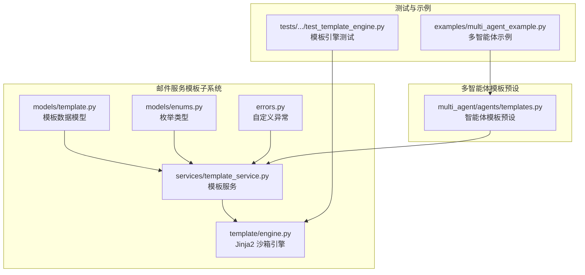
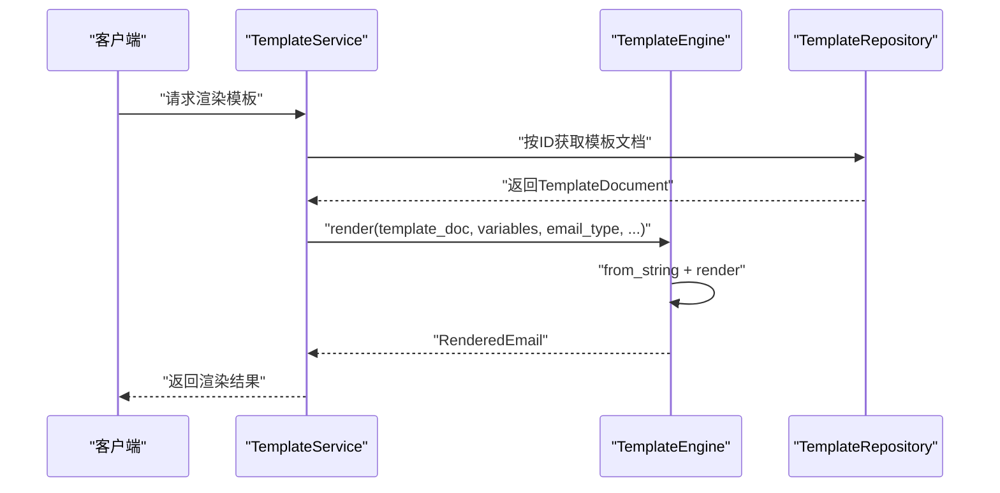
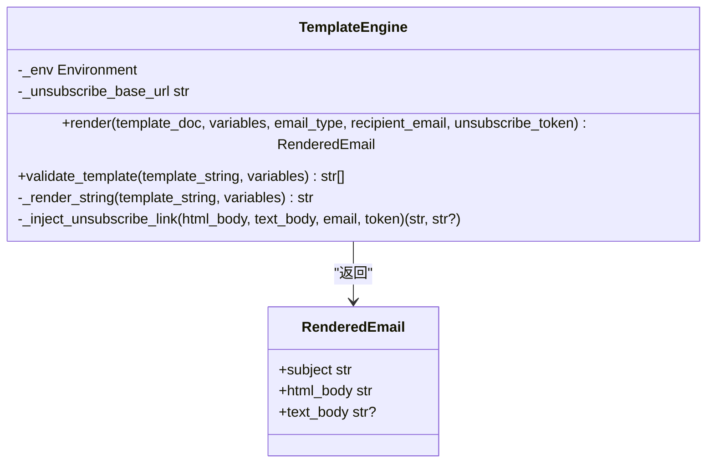
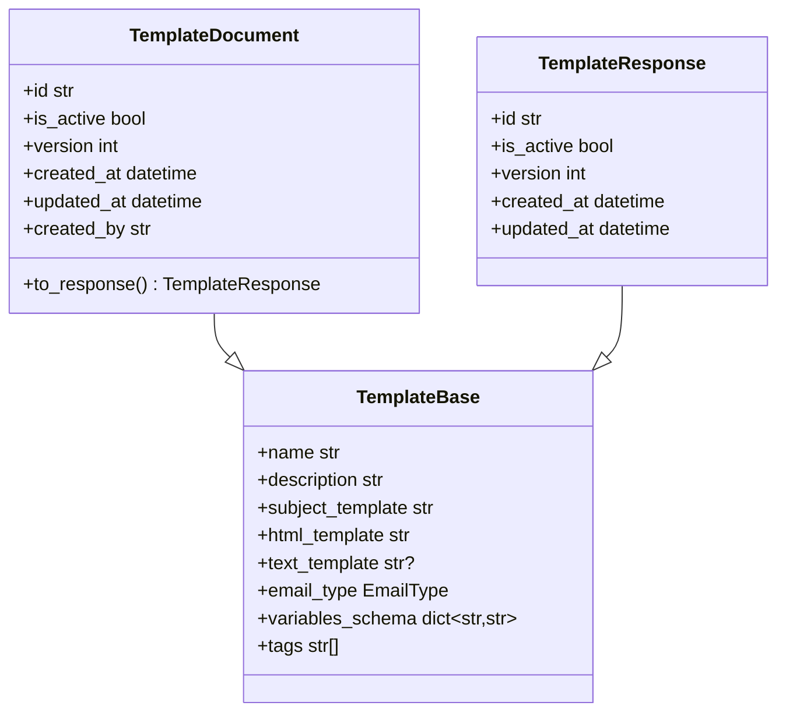
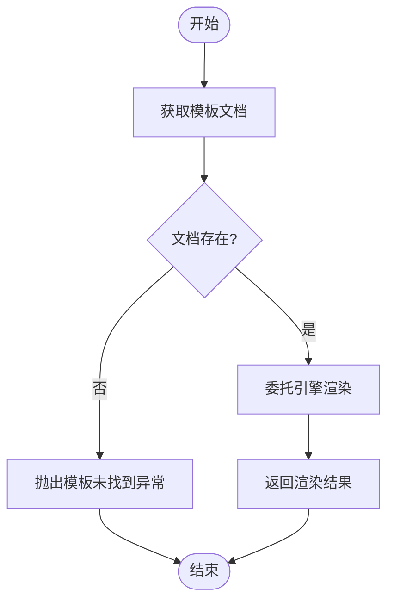
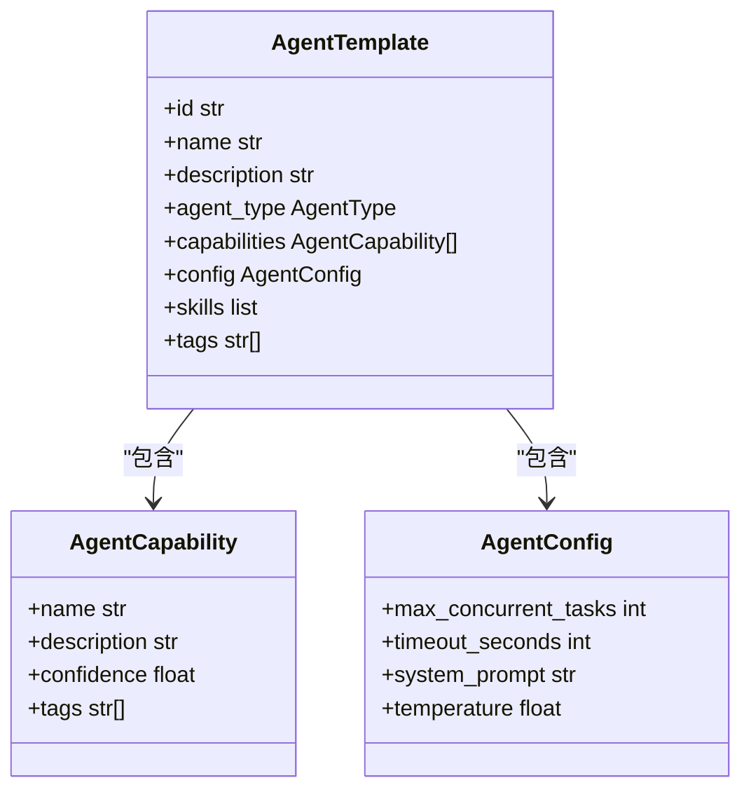
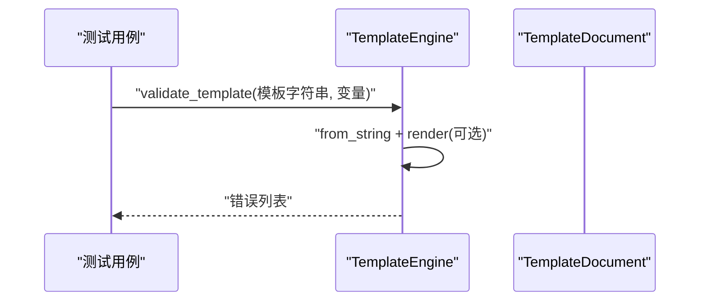
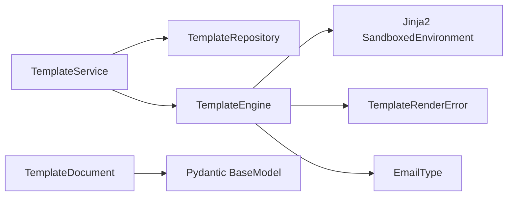
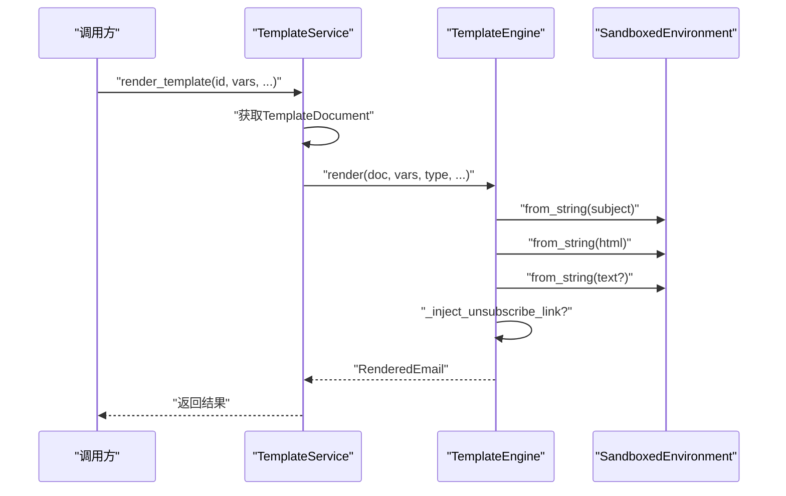
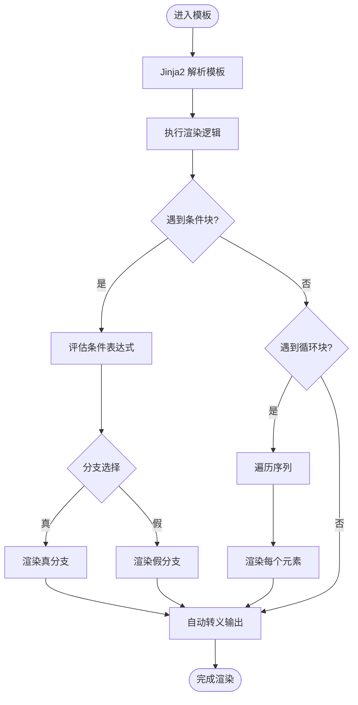

# 模板引擎系统

<cite>
**本文档引用的文件**
- [engine.py](file://src/taolib/testing/email_service/template/engine.py)
- [template.py](file://src/taolib/testing/email_service/models/template.py)
- [enums.py](file://src/taolib/testing/email_service/models/enums.py)
- [errors.py](file://src/taolib/testing/email_service/errors.py)
- [template_service.py](file://src/taolib/testing/email_service/services/template_service.py)
- [test_template_engine.py](file://tests/testing/test_email_service/test_template_engine.py)
- [templates.py](file://src/taolib/testing/multi_agent/agents/templates.py)
- [multi_agent_example.py](file://examples/multi_agent_example.py)
</cite>

## 目录
1. [简介](#简介)
2. [项目结构](#项目结构)
3. [核心组件](#核心组件)
4. [架构总览](#架构总览)
5. [详细组件分析](#详细组件分析)
6. [依赖关系分析](#依赖关系分析)
7. [性能考量](#性能考量)
8. [故障排查指南](#故障排查指南)
9. [结论](#结论)
10. [附录](#附录)

## 简介
本文件面向模板引擎系统，重点阐述基于 Jinja2 的沙箱模板引擎在邮件服务中的集成与扩展，涵盖模板渲染流程、变量绑定、条件与循环处理、模板校验与错误处理、营销邮件退订链接注入等机制。同时结合多智能体系统中的模板预设，给出模板设计最佳实践、安全考虑与性能调优建议，并提供开发示例与调试技巧。

## 项目结构
模板引擎系统主要位于邮件服务子模块中，采用分层架构：模型层（模板数据结构）、服务层（模板管理与渲染）、模板引擎层（Jinja2 沙箱环境）以及测试与示例。

**图示来源**
- [template.py:10-93](file://src/taolib/testing/email_service/models/template.py#L10-L93)
- [enums.py:20-25](file://src/taolib/testing/email_service/models/enums.py#L20-L25)
- [errors.py:25-28](file://src/taolib/testing/email_service/errors.py#L25-L28)
- [template_service.py:20-139](file://src/taolib/testing/email_service/services/template_service.py#L20-L139)
- [engine.py:46-157](file://src/taolib/testing/email_service/template/engine.py#L46-L157)
- [templates.py:14-309](file://src/taolib/testing/multi_agent/agents/templates.py#L14-L309)
- [test_template_engine.py:11-93](file://tests/testing/test_email_service/test_template_engine.py#L11-L93)
- [multi_agent_example.py:91-118](file://examples/multi_agent_example.py#L91-L118)

**章节来源**
- [engine.py:1-157](file://src/taolib/testing/email_service/template/engine.py#L1-L157)
- [template.py:1-93](file://src/taolib/testing/email_service/models/template.py#L1-L93)
- [enums.py:1-71](file://src/taolib/testing/email_service/models/enums.py#L1-L71)
- [errors.py:1-65](file://src/taolib/testing/email_service/errors.py#L1-L65)
- [template_service.py:1-139](file://src/taolib/testing/email_service/services/template_service.py#L1-L139)
- [templates.py:1-309](file://src/taolib/testing/multi_agent/agents/templates.py#L1-L309)
- [test_template_engine.py:1-93](file://tests/testing/test_email_service/test_template_engine.py#L1-L93)
- [multi_agent_example.py:1-196](file://examples/multi_agent_example.py#L1-L196)

## 核心组件
- 模板引擎 TemplateEngine：基于 Jinja2 SandboxedEnvironment，启用严格未定义变量检测与自动转义，支持模板字符串渲染与语法/变量校验，以及营销邮件退订链接注入。
- 模板数据模型 TemplateDocument：封装模板名称、主题、HTML/纯文本模板、类型、变量 Schema、标签、版本与时间戳等字段。
- 枚举 EmailType：区分交易类与营销类邮件，用于控制是否注入退订链接。
- 自定义异常 TemplateRenderError：统一模板渲染失败的异常类型。
- 模板服务 TemplateService：提供模板的创建、更新（含版本递增）、查询、渲染等业务能力。
- 多智能体模板预设：提供代码助手、写作助手、数据分析、研究助手、通用助手等预设模板，便于快速创建专用子智能体。

**章节来源**
- [engine.py:46-157](file://src/taolib/testing/email_service/template/engine.py#L46-L157)
- [template.py:62-93](file://src/taolib/testing/email_service/models/template.py#L62-L93)
- [enums.py:20-25](file://src/taolib/testing/email_service/models/enums.py#L20-L25)
- [errors.py:25-28](file://src/taolib/testing/email_service/errors.py#L25-L28)
- [template_service.py:20-139](file://src/taolib/testing/email_service/services/template_service.py#L20-L139)
- [templates.py:14-309](file://src/taolib/testing/multi_agent/agents/templates.py#L14-L309)

## 架构总览
模板引擎系统采用“服务-引擎-模型”三层结构，模板服务负责业务逻辑与版本控制，模板引擎负责安全渲染与校验，模型层定义数据结构与约束。

**图示来源**
- [template_service.py:103-136](file://src/taolib/testing/email_service/services/template_service.py#L103-L136)
- [engine.py:65-111](file://src/taolib/testing/email_service/template/engine.py#L65-L111)
- [template.py:62-93](file://src/taolib/testing/email_service/models/template.py#L62-L93)

## 详细组件分析

### 组件一：模板引擎 TemplateEngine
- 安全性
  - 使用 SandboxedEnvironment 限制模板可执行能力，防止任意代码注入。
  - 启用 StrictUndefined，缺失变量直接抛出异常，避免静默失败。
  - 启用 autoescape，自动对输出进行 HTML 转义，降低 XSS 风险。
- 渲染流程
  - 分别渲染 subject、html_body；若存在 text_template，则一并渲染。
  - 对营销邮件（MARKETING）且提供收件人邮箱时，自动注入退订链接（HTML 与纯文本）。
- 校验机制
  - validate_template 支持语法与变量检查，返回错误列表，便于模板上线前验证。
- 异常处理
  - 捕获 TemplateSyntaxError、UndefinedError 并包装为 TemplateRenderError 抛出。

**图示来源**
- [engine.py:46-157](file://src/taolib/testing/email_service/template/engine.py#L46-L157)

**章节来源**
- [engine.py:46-157](file://src/taolib/testing/email_service/template/engine.py#L46-L157)

### 组件二：模板数据模型 TemplateDocument
- 字段说明
  - name/description：模板标识与描述。
  - subject_template/html_template/text_template：主题与 HTML/纯文本模板，text_template 可选。
  - email_type：模板类别（交易/营销）。
  - variables_schema：变量名到类型的映射，用于文档化与校验。
  - tags：分类标签。
  - 版本与时间戳：version、created_at、updated_at。
  - created_by：创建者标识。
- 转换方法：to_response 将文档转换为 API 响应模型。

**图示来源**
- [template.py:10-93](file://src/taolib/testing/email_service/models/template.py#L10-L93)

**章节来源**
- [template.py:10-93](file://src/taolib/testing/email_service/models/template.py#L10-L93)

### 组件三：模板服务 TemplateService
- 能力范围
  - 创建模板：生成唯一ID、设置默认状态与版本、记录时间戳。
  - 更新模板：排除空值，自动递增版本号，更新时间戳。
  - 查询模板：按ID或名称查询，支持分页与排序。
  - 渲染模板：先获取文档，再委托引擎渲染，处理未找到场景。
- 版本控制
  - 更新模板时，version 自增，确保模板演进可追踪。

**图示来源**
- [template_service.py:103-136](file://src/taolib/testing/email_service/services/template_service.py#L103-L136)

**章节来源**
- [template_service.py:20-139](file://src/taolib/testing/email_service/services/template_service.py#L20-L139)

### 组件四：多智能体模板预设
- 提供五种预设模板：代码助手、写作助手、数据分析、研究助手、通用助手。
- 每个模板包含：ID、名称、描述、类型、能力集合、配置（最大并发、超时、系统提示词、温度）、技能与标签。
- 工具函数：按ID获取模板、获取全部模板。

**图示来源**
- [templates.py:14-309](file://src/taolib/testing/multi_agent/agents/templates.py#L14-L309)

**章节来源**
- [templates.py:14-309](file://src/taolib/testing/multi_agent/agents/templates.py#L14-L309)

### 组件五：测试与示例
- 测试覆盖
  - 变量渲染、条件渲染、循环渲染、缺失变量异常、营销邮件退订链接注入、交易邮件不注入、模板校验（语法错误、缺失变量）。
- 示例
  - 展示如何从模板创建智能体、注册技能、使用主智能体与 LLM 管理器。

**图示来源**
- [test_template_engine.py:78-90](file://tests/testing/test_email_service/test_template_engine.py#L78-L90)
- [engine.py:112-135](file://src/taolib/testing/email_service/template/engine.py#L112-L135)

**章节来源**
- [test_template_engine.py:1-93](file://tests/testing/test_email_service/test_template_engine.py#L1-L93)
- [multi_agent_example.py:91-118](file://examples/multi_agent_example.py#L91-L118)

## 依赖关系分析
- TemplateService 依赖 TemplateRepository（数据访问）与 TemplateEngine（渲染）。
- TemplateEngine 依赖 Jinja2 SandboxedEnvironment、StrictUndefined、TemplateSyntaxError、UndefinedError，以及自定义异常与枚举。
- 模型层依赖 Pydantic BaseModel，提供字段校验与序列化。
- 多智能体模板预设独立于邮件模板引擎，但共享“模板”概念，便于跨模块复用。

**图示来源**
- [template_service.py:16-35](file://src/taolib/testing/email_service/services/template_service.py#L16-L35)
- [engine.py:9-19](file://src/taolib/testing/email_service/template/engine.py#L9-L19)
- [template.py:5-7](file://src/taolib/testing/email_service/models/template.py#L5-L7)
- [enums.py:20-25](file://src/taolib/testing/email_service/models/enums.py#L20-L25)
- [errors.py:25-28](file://src/taolib/testing/email_service/errors.py#L25-L28)

**章节来源**
- [template_service.py:16-35](file://src/taolib/testing/email_service/services/template_service.py#L16-L35)
- [engine.py:9-19](file://src/taolib/testing/email_service/template/engine.py#L9-L19)
- [template.py:5-7](file://src/taolib/testing/email_service/models/template.py#L5-L7)
- [enums.py:20-25](file://src/taolib/testing/email_service/models/enums.py#L20-L25)
- [errors.py:25-28](file://src/taolib/testing/email_service/errors.py#L25-L28)

## 性能考量
- 渲染性能
  - 使用 SandboxedEnvironment 与 StrictUndefined 保证安全性的同时，尽量减少不必要的模板编译与重复解析。
  - 对高频使用的模板，可在应用层引入模板缓存（例如基于模板字符串与变量哈希的键），避免重复 from_string。
- 内存管理
  - 控制模板字符串长度与复杂度，避免过深嵌套与大数组循环。
  - 文本模板与 HTML 模板分离，仅在需要时渲染 text_template，减少冗余计算。
- 版本控制与回滚
  - 更新模板时递增版本号，便于灰度发布与回滚，降低线上风险。
- 营销邮件退订注入
  - 退订链接注入为字符串拼接，成本较低；建议集中管理退订基础 URL，避免硬编码。

[本节为通用性能指导，无需特定文件来源]

## 故障排查指南
- 模板渲染失败
  - 现象：抛出 TemplateRenderError。
  - 排查：使用 validate_template 检查语法与变量，确认变量是否传入。
- 缺失变量
  - 现象：StrictUndefined 导致立即报错。
  - 排查：检查 variables 是否包含模板所需字段，或在模板中使用默认值。
- 营销邮件未注入退订链接
  - 现象：HTML 中缺少退订区域。
  - 排查：确认 email_type 为 MARKETING，且传入了 recipient_email 与 unsubscribe_token。
- 模板未找到
  - 现象：TemplateNotFoundError。
  - 排查：确认模板ID或名称正确，检查数据库是否存在该文档。

**章节来源**
- [engine.py:107-111](file://src/taolib/testing/email_service/template/engine.py#L107-L111)
- [template_service.py:126-129](file://src/taolib/testing/email_service/services/template_service.py#L126-L129)
- [test_template_engine.py:48-57](file://tests/testing/test_email_service/test_template_engine.py#L48-L57)

## 结论
本模板引擎系统通过 Jinja2 沙箱环境实现了安全、可控的模板渲染，结合严格的变量检查与营销邮件退订注入机制，满足邮件服务的安全与合规要求。配合模板服务的版本控制与测试覆盖，能够稳定支撑模板的全生命周期管理。多智能体模板预设进一步拓展了“模板”概念的应用边界，便于快速构建专用智能体。

[本节为总结性内容，无需特定文件来源]

## 附录

### 模板渲染流程（代码级）

**图示来源**
- [template_service.py:103-136](file://src/taolib/testing/email_service/services/template_service.py#L103-L136)
- [engine.py:65-111](file://src/taolib/testing/email_service/template/engine.py#L65-L111)

### 条件渲染与循环处理（算法流程）

**图示来源**
- [test_template_engine.py:24-47](file://tests/testing/test_email_service/test_template_engine.py#L24-L47)
- [engine.py:137-140](file://src/taolib/testing/email_service/template/engine.py#L137-L140)

### 模板设计最佳实践
- 变量命名与 Schema：在 variables_schema 中明确变量类型，便于团队协作与静态校验。
- 模板拆分：将复杂页面拆分为多个子模板，提升可维护性。
- 默认值与容错：在模板中为可选变量提供默认值，避免渲染失败。
- 安全性：严禁在模板中执行外部调用或文件操作，保持沙箱环境。
- 版本管理：每次更新模板时递增版本号，保留变更记录。

[本节为通用最佳实践，无需特定文件来源]

### 安全考虑
- 沙箱环境：仅允许受限的操作集，避免任意代码执行。
- 严格未定义变量：缺失变量立即失败，防止静默错误。
- 自动转义：输出自动转义，降低 XSS 风险。
- 退订合规：营销邮件必须注入合规退订链接，遵循反垃圾邮件法规。

**章节来源**
- [engine.py:59-63](file://src/taolib/testing/email_service/template/engine.py#L59-L63)
- [engine.py:95-99](file://src/taolib/testing/email_service/template/engine.py#L95-L99)

### 性能调优建议
- 模板缓存：对热点模板与变量组合进行缓存，减少重复编译。
- 渲染批量化：批量渲染相似模板，减少上下文切换。
- 数据预处理：在服务层对变量进行预处理，避免模板内复杂计算。
- 监控与告警：对渲染耗时与失败率进行监控，及时发现异常。

[本节为通用性能建议，无需特定文件来源]

### 开发示例与调试技巧
- 快速验证模板：使用 validate_template 在开发阶段尽早发现语法与变量问题。
- 示例脚本：参考多智能体示例，了解如何从模板创建智能体并执行技能。
- 断点调试：在 TemplateEngine.render 中设置断点，检查 subject、html_body、text_body 的生成过程。
- 日志记录：捕获 TemplateRenderError，记录模板名称、变量与错误详情，便于定位问题。

**章节来源**
- [test_template_engine.py:78-90](file://tests/testing/test_email_service/test_template_engine.py#L78-L90)
- [multi_agent_example.py:91-118](file://examples/multi_agent_example.py#L91-L118)
- [engine.py:107-111](file://src/taolib/testing/email_service/template/engine.py#L107-L111)