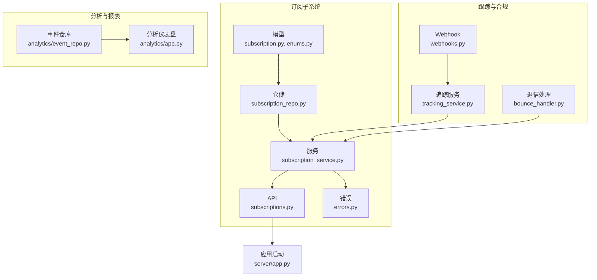
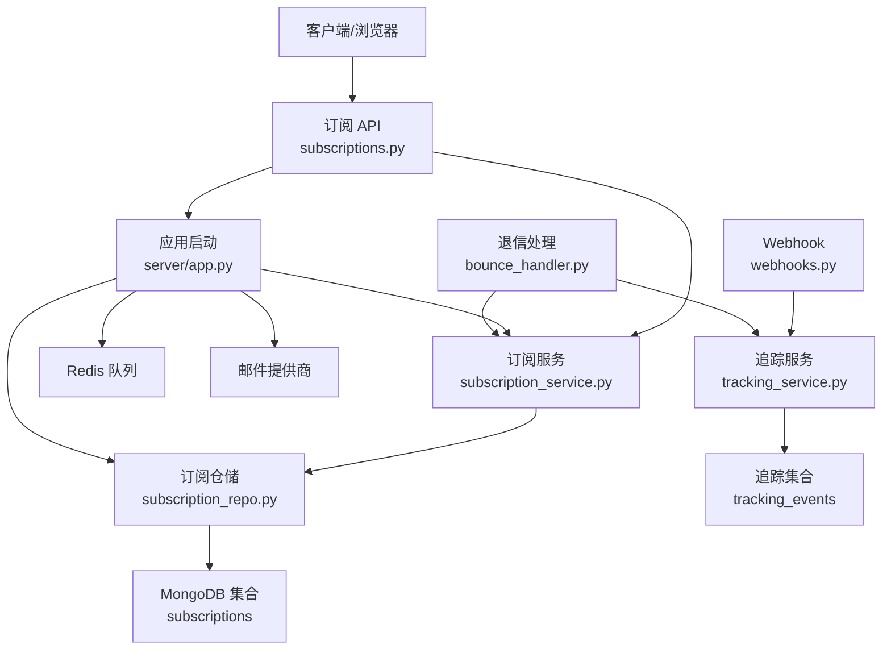
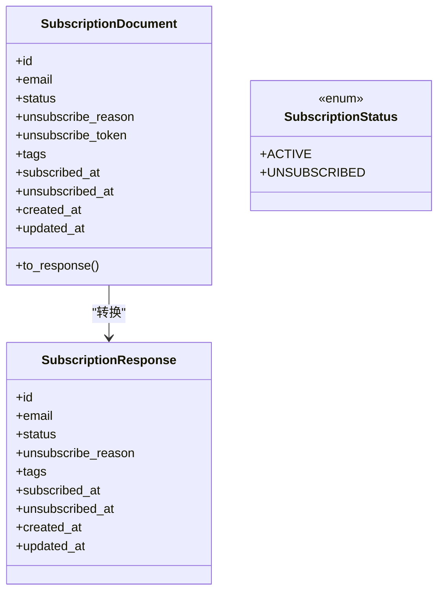
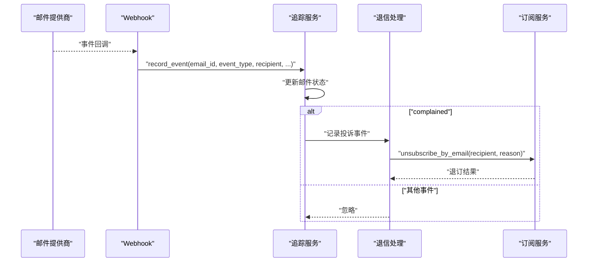
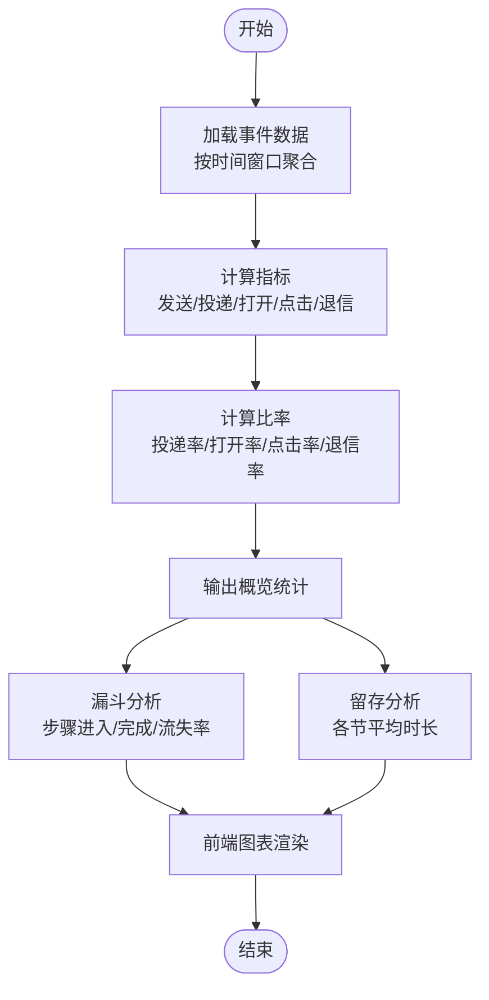
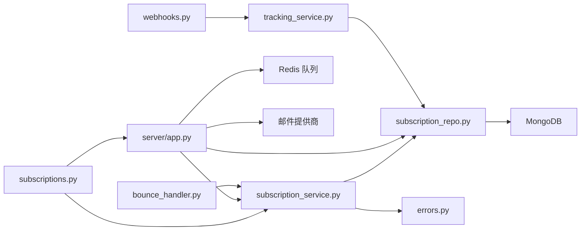

# 订阅管理系统

<cite>
**本文引用的文件**
- [src/taolib/testing/email_service/models/subscription.py](file://src/taolib/testing/email_service/models/subscription.py)
- [src/taolib/testing/email_service/models/enums.py](file://src/taolib/testing/email_service/models/enums.py)
- [src/taolib/testing/email_service/services/subscription_service.py](file://src/taolib/testing/email_service/services/subscription_service.py)
- [src/taolib/testing/email_service/repository/subscription_repo.py](file://src/taolib/testing/email_service/repository/subscription_repo.py)
- [src/taolib/testing/email_service/server/api/subscriptions.py](file://src/taolib/testing/email_service/server/api/subscriptions.py)
- [src/taolib/testing/email_service/server/api/router.py](file://src/taolib/testing/email_service/server/api/router.py)
- [src/taolib/testing/email_service/server/app.py](file://src/taolib/testing/email_service/server/app.py)
- [src/taolib/testing/email_service/errors.py](file://src/taolib/testing/email_service/errors.py)
- [src/taolib/testing/email_service/services/tracking_service.py](file://src/taolib/testing/email_service/services/tracking_service.py)
- [src/taolib/testing/email_service/services/bounce_handler.py](file://src/taolib/testing/email_service/services/bounce_handler.py)
- [src/taolib/testing/email_service/server/api/webhooks.py](file://src/taolib/testing/email_service/server/api/webhooks.py)
- [src/taolib/testing/analytics/repository/event_repo.py](file://src/taolib/testing/analytics/repository/event_repo.py)
- [src/taolib/testing/analytics/server/app.py](file://src/taolib/testing/analytics/server/app.py)
- [tests/testing/test_email_service/test_models.py](file://tests/testing/test_email_service/test_models.py)
- [tests/testing/test_email_service/test_services.py](file://tests/testing/test_email_service/test_services.py)
</cite>

## 目录
1. [简介](#简介)
2. [项目结构](#项目结构)
3. [核心组件](#核心组件)
4. [架构总览](#架构总览)
5. [详细组件分析](#详细组件分析)
6. [依赖关系分析](#依赖关系分析)
7. [性能考量](#性能考量)
8. [故障排查指南](#故障排查指南)
9. [结论](#结论)
10. [附录：API 接口与使用示例](#附录api-接口与使用示例)

## 简介
本技术文档面向“订阅管理系统”，聚焦于订阅关系的数据模型设计、状态管理与业务流程实现，涵盖激活与取消订阅、退订处理、合规性与GDPR支持、订阅统计与分析、用户行为追踪、订阅迁移与批量操作、数据同步、API 接口、错误处理与性能优化等主题。文档以代码为依据，结合类图、序列图与流程图，帮助开发者与运维人员快速理解与集成。

## 项目结构
订阅管理功能主要位于 email_service 子模块，围绕以下层次组织：
- 模型层：定义订阅文档与响应模型、枚举类型
- 仓储层：封装订阅数据访问与索引
- 服务层：订阅状态管理、退订/重新订阅、订阅检查、令牌生成
- API 层：订阅查询、退订确认页、退订处理、重新订阅
- 应用启动：注册仓储、服务、队列与处理器，创建索引
- 跟踪与合规：事件追踪、退信/投诉自动退订、Webhook 处理
- 分析与报表：邮件分析指标、漏斗与留存分析、前端可视化

图表来源
- [src/taolib/testing/email_service/models/subscription.py:12-66](file://src/taolib/testing/email_service/models/subscription.py#L12-L66)
- [src/taolib/testing/email_service/repository/subscription_repo.py:11-62](file://src/taolib/testing/email_service/repository/subscription_repo.py#L11-L62)
- [src/taolib/testing/email_service/services/subscription_service.py:18-145](file://src/taolib/testing/email_service/services/subscription_service.py#L18-L145)
- [src/taolib/testing/email_service/server/api/subscriptions.py:1-100](file://src/taolib/testing/email_service/server/api/subscriptions.py#L1-L100)
- [src/taolib/testing/email_service/server/app.py:94-178](file://src/taolib/testing/email_service/server/app.py#L94-L178)
- [src/taolib/testing/email_service/services/tracking_service.py:34-144](file://src/taolib/testing/email_service/services/tracking_service.py#L34-L144)
- [src/taolib/testing/email_service/services/bounce_handler.py:80-106](file://src/taolib/testing/email_service/services/bounce_handler.py#L80-L106)
- [src/taolib/testing/email_service/server/api/webhooks.py:174-193](file://src/taolib/testing/email_service/server/api/webhooks.py#L174-L193)
- [src/taolib/testing/analytics/repository/event_repo.py:327-366](file://src/taolib/testing/analytics/repository/event_repo.py#L327-L366)
- [src/taolib/testing/analytics/server/app.py:156-233](file://src/taolib/testing/analytics/server/app.py#L156-L233)

章节来源
- [src/taolib/testing/email_service/server/api/router.py:1-19](file://src/taolib/testing/email_service/server/api/router.py#L1-L19)
- [src/taolib/testing/email_service/server/app.py:94-178](file://src/taolib/testing/email_service/server/app.py#L94-L178)

## 核心组件
- 订阅模型与枚举
  - 订阅文档模型包含邮箱、状态、退订原因、退订令牌、标签、订阅/退订时间戳等字段，并提供到响应模型的转换
  - 枚举定义了订阅状态（活跃/退订）、邮件事件类型（投递、打开、点击、退信、投诉、退订）等
- 订阅仓储
  - 提供按邮箱/令牌查询、订阅状态检查、列出退订记录、创建索引等能力
- 订阅服务
  - 获取或创建订阅、按令牌退订、按邮箱退订（含硬退信自动退订）、重新订阅、检查订阅状态、生成退订令牌
- 订阅 API
  - 列表查询、按邮箱查询、退订确认页、退订处理、重新订阅
- 应用启动与依赖注入
  - 初始化数据库连接、Redis、仓储、服务、队列与处理器，创建索引
- 跟踪与合规
  - 追踪事件记录与邮件状态同步；投诉事件触发自动退订；Webhook 解析与事件入库
- 分析与报表
  - 邮件分析指标计算、漏斗与留存分析、前端可视化

章节来源
- [src/taolib/testing/email_service/models/subscription.py:12-66](file://src/taolib/testing/email_service/models/subscription.py#L12-L66)
- [src/taolib/testing/email_service/models/enums.py:64-71](file://src/taolib/testing/email_service/models/enums.py#L64-L71)
- [src/taolib/testing/email_service/repository/subscription_repo.py:11-62](file://src/taolib/testing/email_service/repository/subscription_repo.py#L11-L62)
- [src/taolib/testing/email_service/services/subscription_service.py:18-145](file://src/taolib/testing/email_service/services/subscription_service.py#L18-L145)
- [src/taolib/testing/email_service/server/api/subscriptions.py:1-100](file://src/taolib/testing/email_service/server/api/subscriptions.py#L1-L100)
- [src/taolib/testing/email_service/server/app.py:94-178](file://src/taolib/testing/email_service/server/app.py#L94-L178)
- [src/taolib/testing/email_service/services/tracking_service.py:34-144](file://src/taolib/testing/email_service/services/tracking_service.py#L34-L144)
- [src/taolib/testing/email_service/services/bounce_handler.py:80-106](file://src/taolib/testing/email_service/services/bounce_handler.py#L80-L106)
- [src/taolib/testing/email_service/server/api/webhooks.py:174-193](file://src/taolib/testing/email_service/server/api/webhooks.py#L174-L193)
- [src/taolib/testing/analytics/repository/event_repo.py:327-366](file://src/taolib/testing/analytics/repository/event_repo.py#L327-L366)
- [src/taolib/testing/analytics/server/app.py:156-233](file://src/taolib/testing/analytics/server/app.py#L156-L233)

## 架构总览
订阅管理采用分层架构：API 层负责路由与响应，服务层编排业务逻辑，仓储层抽象数据访问，应用启动阶段完成依赖注入与索引创建。跟踪与合规模块通过 Webhook 与退信处理实现自动化退订与事件追踪。

图表来源
- [src/taolib/testing/email_service/server/api/subscriptions.py:1-100](file://src/taolib/testing/email_service/server/api/subscriptions.py#L1-L100)
- [src/taolib/testing/email_service/services/subscription_service.py:18-145](file://src/taolib/testing/email_service/services/subscription_service.py#L18-L145)
- [src/taolib/testing/email_service/repository/subscription_repo.py:11-62](file://src/taolib/testing/email_service/repository/subscription_repo.py#L11-L62)
- [src/taolib/testing/email_service/server/app.py:94-178](file://src/taolib/testing/email_service/server/app.py#L94-L178)
- [src/taolib/testing/email_service/services/tracking_service.py:34-144](file://src/taolib/testing/email_service/services/tracking_service.py#L34-L144)
- [src/taolib/testing/email_service/server/api/webhooks.py:174-193](file://src/taolib/testing/email_service/server/api/webhooks.py#L174-L193)
- [src/taolib/testing/email_service/services/bounce_handler.py:80-106](file://src/taolib/testing/email_service/services/bounce_handler.py#L80-L106)

## 详细组件分析

### 数据模型与状态枚举
- 订阅文档模型
  - 字段：邮箱、状态、退订原因、退订令牌、标签、订阅/退订/创建/更新时间戳
  - 转换：to_response 将文档转换为 API 响应模型
- 订阅状态枚举
  - ACTIVE、UNSUBSCRIBED
- 跟踪事件类型
  - 包含 UNSUBSCRIBED，便于在分析中识别退订事件

图表来源
- [src/taolib/testing/email_service/models/subscription.py:12-66](file://src/taolib/testing/email_service/models/subscription.py#L12-L66)
- [src/taolib/testing/email_service/models/enums.py:64-71](file://src/taolib/testing/email_service/models/enums.py#L64-L71)

章节来源
- [src/taolib/testing/email_service/models/subscription.py:12-66](file://src/taolib/testing/email_service/models/subscription.py#L12-L66)
- [src/taolib/testing/email_service/models/enums.py:64-71](file://src/taolib/testing/email_service/models/enums.py#L64-L71)

### 订阅状态管理与业务流程
- 获取或创建订阅
  - 若邮箱无记录则创建新订阅，状态为 ACTIVE，生成唯一退订令牌与时间戳
- 退订流程
  - 通过退订令牌定位订阅记录；若已是退订状态直接返回；否则更新状态为退订并写入退订时间与可选原因
- 按邮箱退订（硬退信自动退订）
  - 若无记录则先创建再退订；若已退订则直接返回
- 重新订阅
  - 将状态恢复为 ACTIVE，清除退订时间与原因
- 订阅检查
  - 无记录默认视为已订阅
- 退订令牌生成
  - 自动创建订阅并返回令牌

```mermaid
sequenceDiagram
participant C as "客户端"
participant API as "订阅 API"
participant Svc as "订阅服务"
participant Repo as "订阅仓储"
participant DB as "MongoDB"
C->>API : "GET /api/v1/subscriptions/{email}"
API->>Repo : "find_by_email(email)"
Repo-->>API : "订阅文档或None"
API-->>C : "状态/订阅信息"
C->>API : "POST /api/v1/subscriptions/{email}/resubscribe"
API->>Svc : "resubscribe(email)"
Svc->>Repo : "find_by_email(email)"
Repo-->>Svc : "订阅文档"
Svc->>Repo : "update(id, 恢复ACTIVE)"
Repo-->>Svc : "更新结果"
Svc-->>API : "订阅响应"
API-->>C : "重新订阅结果"
C->>API : "GET /api/v1/subscriptions/unsubscribe?token=...&email=..."
API-->>C : "退订确认页HTML"
C->>API : "POST /api/v1/subscriptions/unsubscribe"
API->>Svc : "unsubscribe(token)"
Svc->>Repo : "find_by_token(token)"
Repo-->>Svc : "订阅文档"
Svc->>Repo : "update(id, 设置UNSUBSCRIBED)"
Repo-->>Svc : "更新结果"
Svc-->>API : "订阅响应"
API-->>C : "退订成功HTML"
```

图表来源
- [src/taolib/testing/email_service/server/api/subscriptions.py:1-100](file://src/taolib/testing/email_service/server/api/subscriptions.py#L1-L100)
- [src/taolib/testing/email_service/services/subscription_service.py:18-145](file://src/taolib/testing/email_service/services/subscription_service.py#L18-L145)
- [src/taolib/testing/email_service/repository/subscription_repo.py:11-62](file://src/taolib/testing/email_service/repository/subscription_repo.py#L11-L62)

章节来源
- [src/taolib/testing/email_service/services/subscription_service.py:18-145](file://src/taolib/testing/email_service/services/subscription_service.py#L18-L145)
- [src/taolib/testing/email_service/repository/subscription_repo.py:11-62](file://src/taolib/testing/email_service/repository/subscription_repo.py#L11-L62)
- [src/taolib/testing/email_service/server/api/subscriptions.py:1-100](file://src/taolib/testing/email_service/server/api/subscriptions.py#L1-L100)

### 退订处理、合规性与GDPR支持
- 退信/投诉自动退订
  - 投诉事件被记录为 COMPLAINED，并触发退订流程，原因标记为 Spam complaint
- Webhook 兼容
  - 支持 delivered/bounced/complained 映射，忽略未知事件类型
- GDPR 支持要点
  - 提供退订令牌与确认页，用户可随时退订
  - 记录退订原因与时间，便于审计与用户撤回同意的证明
  - 退订后不再发送营销邮件（订阅状态为 UNSUBSCRIBED）

图表来源
- [src/taolib/testing/email_service/server/api/webhooks.py:174-193](file://src/taolib/testing/email_service/server/api/webhooks.py#L174-L193)
- [src/taolib/testing/email_service/services/tracking_service.py:34-144](file://src/taolib/testing/email_service/services/tracking_service.py#L34-L144)
- [src/taolib/testing/email_service/services/bounce_handler.py:80-106](file://src/taolib/testing/email_service/services/bounce_handler.py#L80-L106)
- [src/taolib/testing/email_service/services/subscription_service.py:92-105](file://src/taolib/testing/email_service/services/subscription_service.py#L92-L105)

章节来源
- [src/taolib/testing/email_service/services/bounce_handler.py:80-106](file://src/taolib/testing/email_service/services/bounce_handler.py#L80-L106)
- [src/taolib/testing/email_service/server/api/webhooks.py:174-193](file://src/taolib/testing/email_service/server/api/webhooks.py#L174-L193)
- [src/taolib/testing/email_service/services/tracking_service.py:34-144](file://src/taolib/testing/email_service/services/tracking_service.py#L34-L144)

### 订阅分类、权限控制与个性化设置
- 订阅分类/标签
  - 订阅文档包含 tags 字段，可用于订阅分类或个性化设置
- 权限控制
  - 订阅 API 当前为公开端点（无需认证），退订确认页为 HTML 表单提交
  - 如需权限控制，可在 API 层增加认证中间件与 RBAC 策略
- 个性化设置
  - 可通过 tags 字段区分营销类别，配合模板与发送策略实现差异化内容

章节来源
- [src/taolib/testing/email_service/models/subscription.py:18-32](file://src/taolib/testing/email_service/models/subscription.py#L18-L32)
- [src/taolib/testing/email_service/server/api/subscriptions.py:50-68](file://src/taolib/testing/email_service/server/api/subscriptions.py#L50-L68)

### 统计、分析报告与用户行为追踪
- 邮件分析指标
  - 基于追踪事件统计总发送、投递、打开、点击、退信数量与各类比率
- 漏斗与留存分析
  - 通过事件仓库聚合计算步骤进入/完成人数与流失率
- 前端可视化
  - 分析仪表盘提供概览卡片、漏斗图、路径表、留存图等

图表来源
- [src/taolib/testing/email_service/services/tracking_service.py:96-123](file://src/taolib/testing/email_service/services/tracking_service.py#L96-L123)
- [src/taolib/testing/analytics/repository/event_repo.py:327-366](file://src/taolib/testing/analytics/repository/event_repo.py#L327-L366)
- [src/taolib/testing/analytics/server/app.py:156-233](file://src/taolib/testing/analytics/server/app.py#L156-L233)

章节来源
- [src/taolib/testing/email_service/services/tracking_service.py:96-123](file://src/taolib/testing/email_service/services/tracking_service.py#L96-L123)
- [src/taolib/testing/analytics/repository/event_repo.py:327-366](file://src/taolib/testing/analytics/repository/event_repo.py#L327-L366)
- [src/taolib/testing/analytics/server/app.py:156-233](file://src/taolib/testing/analytics/server/app.py#L156-L233)

### 订阅迁移、批量操作与数据同步
- 订阅迁移
  - 通过订阅仓储的 list 与 update 批量迁移状态或标签
- 批量操作
  - 使用列表查询与条件过滤，结合服务层批量更新
- 数据同步
  - 依托事件仓库与分析服务进行跨系统数据对齐与报表刷新

章节来源
- [src/taolib/testing/email_service/repository/subscription_repo.py:44-53](file://src/taolib/testing/email_service/repository/subscription_repo.py#L44-L53)
- [src/taolib/testing/email_service/services/subscription_service.py:106-134](file://src/taolib/testing/email_service/services/subscription_service.py#L106-L134)
- [src/taolib/testing/analytics/repository/event_repo.py:327-366](file://src/taolib/testing/analytics/repository/event_repo.py#L327-L366)

## 依赖关系分析
- 组件耦合
  - API 依赖服务；服务依赖仓储；应用启动负责装配与索引创建
- 外部依赖
  - MongoDB（Motor 异步驱动）、Redis（异步客户端）、邮件提供商（SendGrid/Mailgun/SES/SMTP）
- 循环依赖
  - 未发现循环依赖；模块职责清晰

图表来源
- [src/taolib/testing/email_service/server/api/subscriptions.py:1-100](file://src/taolib/testing/email_service/server/api/subscriptions.py#L1-L100)
- [src/taolib/testing/email_service/services/subscription_service.py:18-145](file://src/taolib/testing/email_service/services/subscription_service.py#L18-L145)
- [src/taolib/testing/email_service/repository/subscription_repo.py:11-62](file://src/taolib/testing/email_service/repository/subscription_repo.py#L11-L62)
- [src/taolib/testing/email_service/server/app.py:94-178](file://src/taolib/testing/email_service/server/app.py#L94-L178)
- [src/taolib/testing/email_service/server/api/webhooks.py:174-193](file://src/taolib/testing/email_service/server/api/webhooks.py#L174-L193)
- [src/taolib/testing/email_service/services/tracking_service.py:34-144](file://src/taolib/testing/email_service/services/tracking_service.py#L34-L144)
- [src/taolib/testing/email_service/services/bounce_handler.py:80-106](file://src/taolib/testing/email_service/services/bounce_handler.py#L80-L106)

章节来源
- [src/taolib/testing/email_service/server/api/router.py:1-19](file://src/taolib/testing/email_service/server/api/router.py#L1-L19)
- [src/taolib/testing/email_service/server/app.py:94-178](file://src/taolib/testing/email_service/server/app.py#L94-L178)

## 性能考量
- 索引优化
  - 订阅集合建立 email、unsubscribe_token、status 索引，提升查询与筛选性能
- 异步 I/O
  - 使用 Motor 异步 MongoDB 客户端与 aioredis 异步 Redis 客户端
- 批量处理
  - 队列处理器按批拉取与发送，降低峰值压力
- 缓存与去重
  - 可在模板引擎与追踪事件上引入缓存策略（当前实现未见显式缓存，建议按需扩展）

章节来源
- [src/taolib/testing/email_service/repository/subscription_repo.py:55-60](file://src/taolib/testing/email_service/repository/subscription_repo.py#L55-L60)
- [src/taolib/testing/email_service/server/app.py:94-178](file://src/taolib/testing/email_service/server/app.py#L94-L178)

## 故障排查指南
- 常见错误
  - 无效退订令牌：抛出订阅错误，需检查 token 是否正确
  - 订阅记录不存在：重新订阅会抛出错误，需先创建订阅
  - 退订失败：更新返回 None 时抛出订阅错误
- 日志与可观测性
  - 应用启动日志、健康检查端点、仪表盘展示运行状态
- 排查步骤
  - 确认令牌与邮箱匹配；检查订阅状态；核对索引是否存在；验证 Webhook 回调是否正确解析

章节来源
- [src/taolib/testing/email_service/errors.py:59-65](file://src/taolib/testing/email_service/errors.py#L59-L65)
- [src/taolib/testing/email_service/services/subscription_service.py:71-90](file://src/taolib/testing/email_service/services/subscription_service.py#L71-L90)
- [src/taolib/testing/email_service/server/app.py:180-204](file://src/taolib/testing/email_service/server/app.py#L180-L204)

## 结论
订阅管理系统以清晰的分层架构实现了订阅状态全生命周期管理，结合自动化退订、合规性支持与分析报表，满足营销邮件场景下的订阅治理需求。通过索引优化、异步 I/O 与队列批处理，系统具备良好的性能与可扩展性。后续可在权限控制、缓存策略与审计日志方面进一步增强。

## 附录：API 接口与使用示例

- 订阅查询
  - GET /api/v1/subscriptions?status={status}&skip={skip}&limit={limit}
  - GET /api/v1/subscriptions/{email}
- 退订
  - GET /api/v1/subscriptions/unsubscribe?token={token}&email={email}
  - POST /api/v1/subscriptions/unsubscribe
- 重新订阅
  - POST /api/v1/subscriptions/{email}/resubscribe

使用示例（路径参考）
- 获取或创建订阅：[src/taolib/testing/email_service/services/subscription_service.py:29-54](file://src/taolib/testing/email_service/services/subscription_service.py#L29-L54)
- 退订处理：[src/taolib/testing/email_service/services/subscription_service.py:56-90](file://src/taolib/testing/email_service/services/subscription_service.py#L56-L90)
- 按邮箱退订：[src/taolib/testing/email_service/services/subscription_service.py:92-104](file://src/taolib/testing/email_service/services/subscription_service.py#L92-L104)
- 重新订阅：[src/taolib/testing/email_service/services/subscription_service.py:106-134](file://src/taolib/testing/email_service/services/subscription_service.py#L106-L134)
- 订阅检查：[src/taolib/testing/email_service/services/subscription_service.py:136-138](file://src/taolib/testing/email_service/services/subscription_service.py#L136-L138)
- 退订令牌生成：[src/taolib/testing/email_service/services/subscription_service.py:140-143](file://src/taolib/testing/email_service/services/subscription_service.py#L140-L143)
- 订阅 API 实现：[src/taolib/testing/email_service/server/api/subscriptions.py:1-100](file://src/taolib/testing/email_service/server/api/subscriptions.py#L1-L100)
- 应用启动与依赖注入：[src/taolib/testing/email_service/server/app.py:94-178](file://src/taolib/testing/email_service/server/app.py#L94-L178)

章节来源
- [src/taolib/testing/email_service/server/api/subscriptions.py:1-100](file://src/taolib/testing/email_service/server/api/subscriptions.py#L1-L100)
- [src/taolib/testing/email_service/server/app.py:94-178](file://src/taolib/testing/email_service/server/app.py#L94-L178)
- [tests/testing/test_email_service/test_models.py:118-131](file://tests/testing/test_email_service/test_models.py#L118-L131)
- [tests/testing/test_email_service/test_services.py:61-77](file://tests/testing/test_email_service/test_services.py#L61-L77)