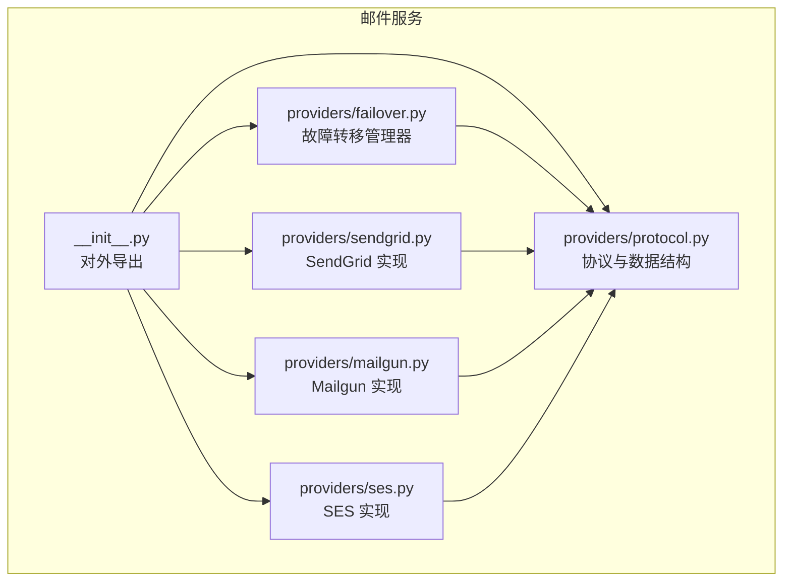
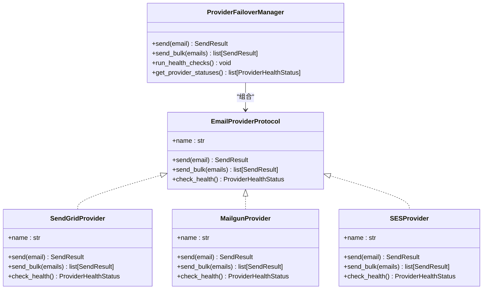
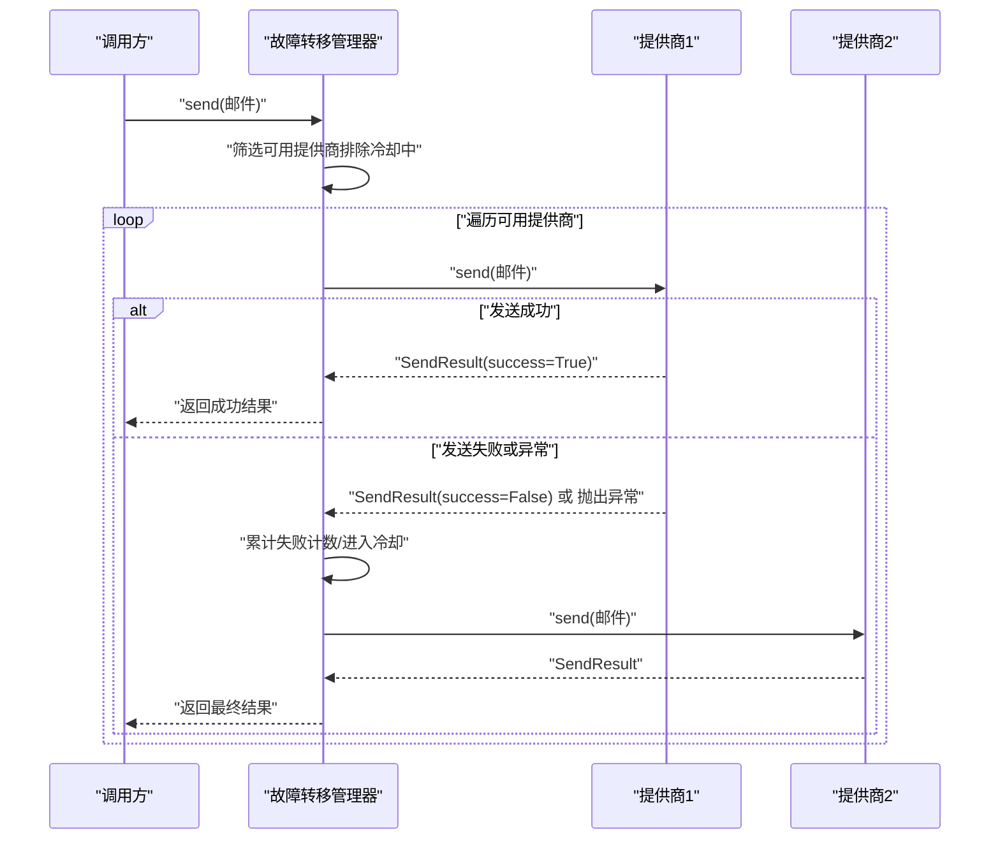
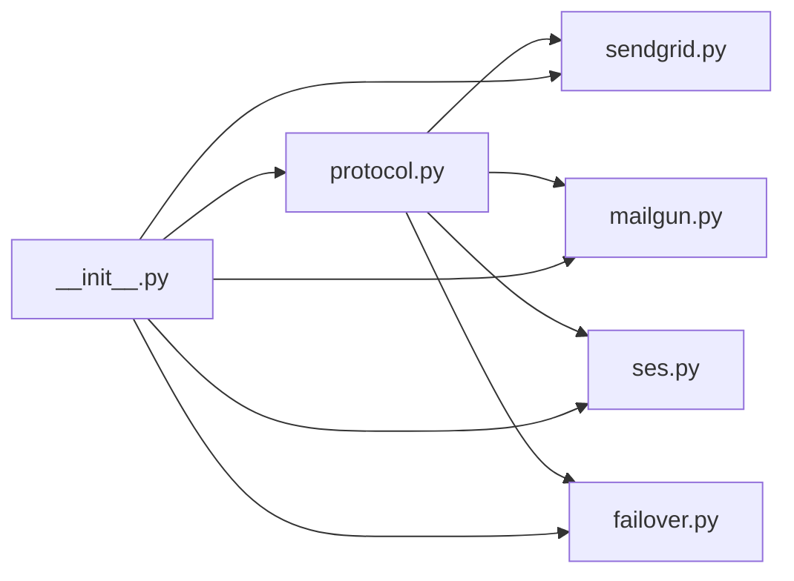

# 邮件提供商集成

<cite>
**本文引用的文件**
- [src/taolib/testing/email_service/__init__.py](file://src/taolib/testing/email_service/__init__.py)
- [src/taolib/testing/email_service/providers/protocol.py](file://src/taolib/testing/email_service/providers/protocol.py)
- [src/taolib/testing/email_service/providers/failover.py](file://src/taolib/testing/email_service/providers/failover.py)
- [src/taolib/testing/email_service/providers/sendgrid.py](file://src/taolib/testing/email_service/providers/sendgrid.py)
- [src/taolib/testing/email_service/providers/mailgun.py](file://src/taolib/testing/email_service/providers/mailgun.py)
- [src/taolib/testing/email_service/providers/ses.py](file://src/taolib/testing/email_service/providers/ses.py)
</cite>

## 目录
1. [简介](#简介)
2. [项目结构](#项目结构)
3. [核心组件](#核心组件)
4. [架构总览](#架构总览)
5. [详细组件分析](#详细组件分析)
6. [依赖分析](#依赖分析)
7. [性能考虑](#性能考虑)
8. [故障排查指南](#故障排查指南)
9. [结论](#结论)
10. [附录](#附录)

## 简介
本文件面向“邮件提供商集成”模块，系统化阐述多提供商支持架构的设计与实现，覆盖以下要点：
- 多提供商统一抽象与协议设计
- SMTP 提供商的连接管理、认证机制与传输协议（按需安装）
- SendGrid 与 Mailgun 的 API 集成、速率限制与错误重试策略
- Amazon SES 提供商的配置选项与 AWS 集成细节
- 故障转移管理器的工作原理、健康状态监控与自动切换机制
- 协议抽象层的设计思路与扩展新提供商的方法
- 完整配置示例、性能优化建议与故障排查指南

## 项目结构
邮件服务模块位于测试子包中，核心由“协议与模型 + 提供商实现 + 故障转移 + 服务与队列”构成。对外通过统一入口导出关键类型与服务。

图表来源
- [src/taolib/testing/email_service/__init__.py:1-129](file://src/taolib/testing/email_service/__init__.py#L1-L129)
- [src/taolib/testing/email_service/providers/protocol.py:1-77](file://src/taolib/testing/email_service/providers/protocol.py#L1-L77)
- [src/taolib/testing/email_service/providers/sendgrid.py:1-144](file://src/taolib/testing/email_service/providers/sendgrid.py#L1-L144)
- [src/taolib/testing/email_service/providers/mailgun.py:1-123](file://src/taolib/testing/email_service/providers/mailgun.py#L1-L123)
- [src/taolib/testing/email_service/providers/ses.py:1-140](file://src/taolib/testing/email_service/providers/ses.py#L1-L140)
- [src/taolib/testing/email_service/providers/failover.py:1-175](file://src/taolib/testing/email_service/providers/failover.py#L1-L175)

章节来源
- [src/taolib/testing/email_service/__init__.py:1-129](file://src/taolib/testing/email_service/__init__.py#L1-L129)

## 核心组件
- 协议与数据结构：定义统一的提供商接口、发送结果与健康状态数据类，确保各提供商实现一致的调用契约。
- SendGrid 提供商：基于 SendGrid v3 Mail Send API，支持默认发件人配置与请求体构建。
- Mailgun 提供商：基于 Mailgun HTTP API，支持 CC/BCC、HTML/纯文本、标签等字段映射。
- Amazon SES 提供商：基于 Amazon SES v2 HTTP API，支持区域与凭证配置，简化签名处理。
- 故障转移管理器：按优先级选择可用提供商，失败计数与冷却期控制，周期性健康检查恢复。

章节来源
- [src/taolib/testing/email_service/providers/protocol.py:13-77](file://src/taolib/testing/email_service/providers/protocol.py#L13-L77)
- [src/taolib/testing/email_service/providers/sendgrid.py:15-144](file://src/taolib/testing/email_service/providers/sendgrid.py#L15-L144)
- [src/taolib/testing/email_service/providers/mailgun.py:15-123](file://src/taolib/testing/email_service/providers/mailgun.py#L15-L123)
- [src/taolib/testing/email_service/providers/ses.py:15-140](file://src/taolib/testing/email_service/providers/ses.py#L15-L140)
- [src/taolib/testing/email_service/providers/failover.py:32-175](file://src/taolib/testing/email_service/providers/failover.py#L32-L175)

## 架构总览
多提供商架构采用“协议抽象 + 具体实现 + 故障转移”的分层设计。上层业务仅依赖协议，下层可自由替换或扩展提供商；故障转移管理器负责在多个提供商之间进行自动切换与健康恢复。

图表来源
- [src/taolib/testing/email_service/providers/protocol.py:35-77](file://src/taolib/testing/email_service/providers/protocol.py#L35-L77)
- [src/taolib/testing/email_service/providers/sendgrid.py:15-144](file://src/taolib/testing/email_service/providers/sendgrid.py#L15-L144)
- [src/taolib/testing/email_service/providers/mailgun.py:15-123](file://src/taolib/testing/email_service/providers/mailgun.py#L15-L123)
- [src/taolib/testing/email_service/providers/ses.py:15-140](file://src/taolib/testing/email_service/providers/ses.py#L15-L140)
- [src/taolib/testing/email_service/providers/failover.py:32-175](file://src/taolib/testing/email_service/providers/failover.py#L32-L175)

## 详细组件分析

### 协议与数据结构（EmailProviderProtocol）
- 设计目标：统一提供商接口，屏蔽具体实现差异，便于扩展与替换。
- 关键点：
  - name 属性用于标识提供商。
  - send/send_bulk 支持单封与批量发送，返回标准化 SendResult。
  - check_health 返回 ProviderHealthStatus，包含健康状态、连续失败次数、最近错误等。
- 数据类：
  - SendResult：包含成功标志、提供商名称、消息 ID、错误信息与耗时。
  - ProviderHealthStatus：包含提供商名称、健康状态、连续失败次数、最近检查时间与错误。

章节来源
- [src/taolib/testing/email_service/providers/protocol.py:13-77](file://src/taolib/testing/email_service/providers/protocol.py#L13-L77)

### SendGrid 提供商
- 连接与认证：
  - 使用 HTTP 客户端，设置基础 URL 与 Authorization 头（Bearer Token）。
  - 超时设置为 30 秒。
- 传输协议：
  - 通过 SendGrid v3 Mail Send API 发送邮件。
- 请求体构建：
  - 支持收件人、抄送、密送、主题、文本与 HTML 正文。
  - 支持最多 10 个分类标签。
- 错误处理：
  - 对非 2xx 状态码返回 SendResult 并记录错误信息。
  - 异常捕获统一包装为 SendResult。
- 健康检查：
  - 访问 scopes 接口判断凭据有效性。

章节来源
- [src/taolib/testing/email_service/providers/sendgrid.py:15-144](file://src/taolib/testing/email_service/providers/sendgrid.py#L15-L144)

### Mailgun 提供商
- 连接与认证：
  - 使用 HTTP 客户端，基础 URL 指向指定域名的 API。
  - 使用 HTTP Basic Auth（用户名为 api，密码为 API Key）。
  - 超时设置为 30 秒。
- 传输协议：
  - 通过 messages 接口发送邮件。
- 表单数据构建：
  - 支持发件人名称、收件人、抄送、密送、主题、HTML/纯文本正文、标签等。
- 错误处理：
  - 非 200 响应封装为 SendResult。
  - 异常捕获统一包装为 SendResult。
- 健康检查：
  - 访问指定域名资源，验证凭据与域名有效性。

章节来源
- [src/taolib/testing/email_service/providers/mailgun.py:15-123](file://src/taolib/testing/email_service/providers/mailgun.py#L15-L123)

### Amazon SES 提供商
- 连接与认证：
  - 使用 HTTP 客户端，基础 URL 为指定区域的 SES v2 端点。
  - 通过自定义头传递访问密钥（简化实现，生产建议使用 AWS SDK 进行签名）。
  - 超时设置为 30 秒。
- 传输协议：
  - 通过 v2/email/outbound-emails 接口发送邮件。
- 请求体构建：
  - 支持 From、To/Cc/Bcc、主题与 HTML/纯文本正文。
- 错误处理：
  - 非 200 响应封装为 SendResult。
  - 异常捕获统一包装为 SendResult。
- 健康检查：
  - 访问 v2/email/account 接口判断账户状态。

章节来源
- [src/taolib/testing/email_service/providers/ses.py:15-140](file://src/taolib/testing/email_service/providers/ses.py#L15-L140)

### 故障转移管理器（ProviderFailoverManager）
- 工作原理：
  - 维护提供商状态列表，按优先级排序。
  - 发送时过滤处于冷却期的提供商，依次尝试，成功则清零失败计数并更新统计。
  - 失败超过阈值进入冷却期，冷却结束后允许健康检查恢复。
- 健康监控与自动切换：
  - run_health_checks 周期性对不健康提供商执行 check_health，恢复后重置状态。
  - get_provider_statuses 返回当前所有提供商的健康状态快照。
- 错误处理：
  - 当所有提供商均失败时抛出 AllProvidersFailedError，并汇总各提供商错误。

图表来源
- [src/taolib/testing/email_service/providers/failover.py:59-113](file://src/taolib/testing/email_service/providers/failover.py#L59-L113)

章节来源
- [src/taolib/testing/email_service/providers/failover.py:32-175](file://src/taolib/testing/email_service/providers/failover.py#L32-L175)

### SMTP 提供商（按需安装）
- 说明：SMTP 提供商在导入时可能因缺少依赖而不可用。若需要，请安装相应异步 SMTP 库，模块会自动从导出中加入 SMTPProvider。
- 配置要点（通用）：主机、端口、加密方式、认证凭据、超时与重试策略等，需结合具体 SMTP 实现。

章节来源
- [src/taolib/testing/email_service/__init__.py:49-52](file://src/taolib/testing/email_service/__init__.py#L49-L52)

## 依赖分析
- 协议层：被所有提供商实现依赖，是系统稳定扩展的基础。
- 提供商实现：各自依赖协议层的数据结构与方法签名，内部封装 HTTP 客户端与 API 调用。
- 故障转移管理器：组合多个提供商实例，依赖协议层接口与错误类型。
- 导出层：统一对外暴露类型与服务，隐藏内部实现细节。

图表来源
- [src/taolib/testing/email_service/providers/protocol.py:1-77](file://src/taolib/testing/email_service/providers/protocol.py#L1-L77)
- [src/taolib/testing/email_service/providers/sendgrid.py:1-144](file://src/taolib/testing/email_service/providers/sendgrid.py#L1-L144)
- [src/taolib/testing/email_service/providers/mailgun.py:1-123](file://src/taolib/testing/email_service/providers/mailgun.py#L1-L123)
- [src/taolib/testing/email_service/providers/ses.py:1-140](file://src/taolib/testing/email_service/providers/ses.py#L1-L140)
- [src/taolib/testing/email_service/providers/failover.py:1-175](file://src/taolib/testing/email_service/providers/failover.py#L1-L175)
- [src/taolib/testing/email_service/__init__.py:1-129](file://src/taolib/testing/email_service/__init__.py#L1-L129)

## 性能考虑
- 超时与并发：
  - 各提供商客户端均设置了合理超时，避免阻塞。
  - 批量发送采用顺序逐封发送，如需提升吞吐可在上层引入限流与并发控制。
- 健康检查频率：
  - 建议在低频周期内运行健康检查，减少对第三方 API 的压力。
- 日志与指标：
  - 在故障转移管理器与提供商中已内置日志输出，建议结合外部监控系统采集延迟、成功率与错误分布。
- 缓存与预热：
  - 对于频繁使用的域名或账户，可考虑在应用启动阶段预热健康检查，降低首次调用延迟。

## 故障排查指南
- SendGrid
  - 现象：返回非 2xx 状态码或空消息 ID。
  - 排查：检查 API Key 权限范围、默认发件人配置、请求体字段是否符合规范。
- Mailgun
  - 现象：域名无效或认证失败。
  - 排查：确认 API Key 与域名匹配，检查域名状态与限额。
- Amazon SES
  - 现象：签名错误或权限不足。
  - 排查：确认区域正确、访问密钥有效；生产环境建议使用 AWS SDK 完成签名。
- 故障转移
  - 现象：持续失败或全部提供商冷却。
  - 排查：查看冷却阈值与冷却时间设置，确认健康检查是否正常执行；必要时手动重置提供商状态。

章节来源
- [src/taolib/testing/email_service/providers/sendgrid.py:51-80](file://src/taolib/testing/email_service/providers/sendgrid.py#L51-L80)
- [src/taolib/testing/email_service/providers/mailgun.py:41-74](file://src/taolib/testing/email_service/providers/mailgun.py#L41-L74)
- [src/taolib/testing/email_service/providers/ses.py:46-88](file://src/taolib/testing/email_service/providers/ses.py#L46-L88)
- [src/taolib/testing/email_service/providers/failover.py:139-155](file://src/taolib/testing/email_service/providers/failover.py#L139-L155)

## 结论
该邮件提供商集成模块通过协议抽象实现了对 SendGrid、Mailgun、Amazon SES 以及 SMTP 的统一接入，并以故障转移管理器提供高可用的自动切换能力。其设计具备良好的扩展性与可观测性，适合在多云与混合部署场景中使用。建议在生产环境中完善速率限制与重试策略、增强签名与鉴权安全，并结合监控体系持续优化性能与稳定性。

## 附录

### 扩展新提供商步骤
- 实现协议接口：在提供商类中实现 name、send、send_bulk、check_health 方法。
- 请求封装：根据第三方 API 文档构建请求体或表单数据。
- 错误处理：将异常与非成功响应统一包装为 SendResult。
- 健康检查：实现最小可行的可用性探测。
- 注册与测试：在故障转移管理器中注册提供商实例并进行端到端测试。

章节来源
- [src/taolib/testing/email_service/providers/protocol.py:35-77](file://src/taolib/testing/email_service/providers/protocol.py#L35-L77)
- [src/taolib/testing/email_service/providers/failover.py:39-57](file://src/taolib/testing/email_service/providers/failover.py#L39-L57)