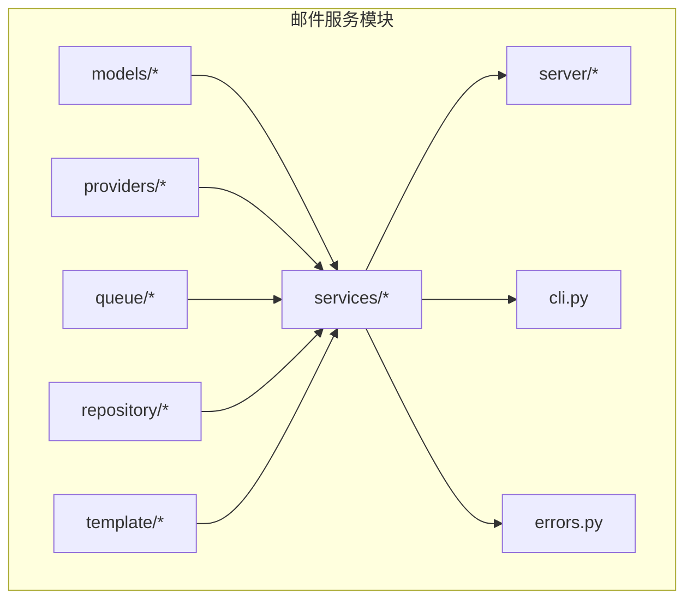
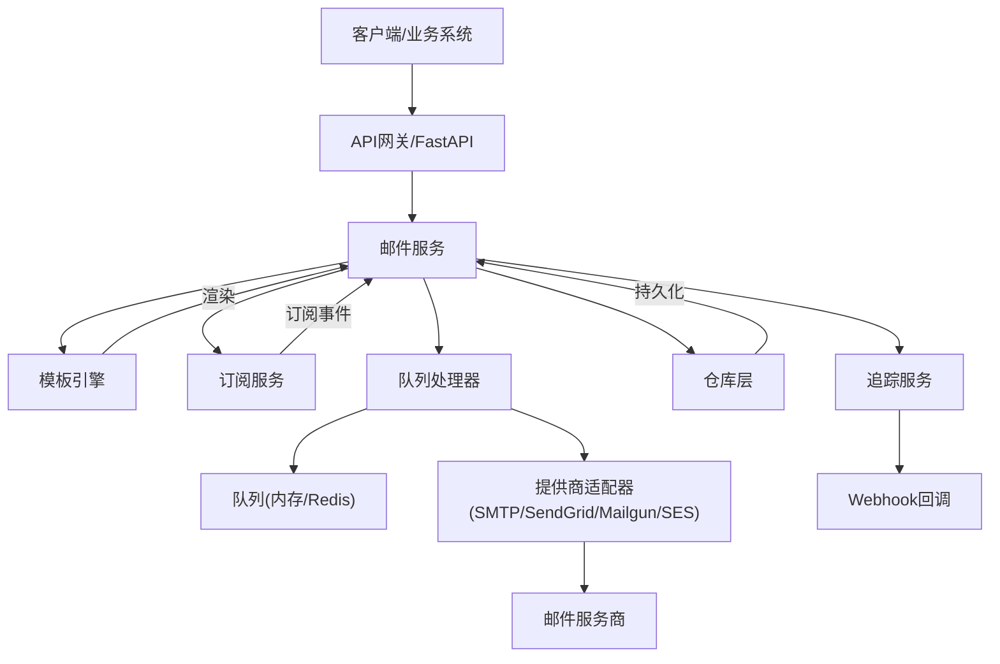
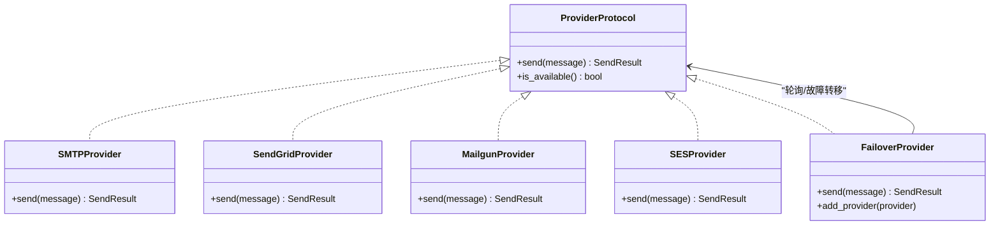
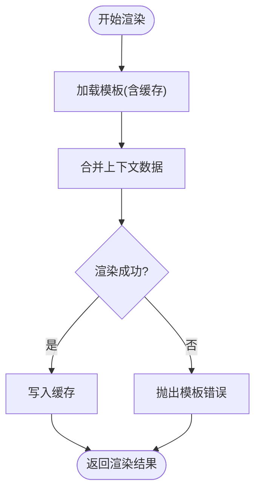
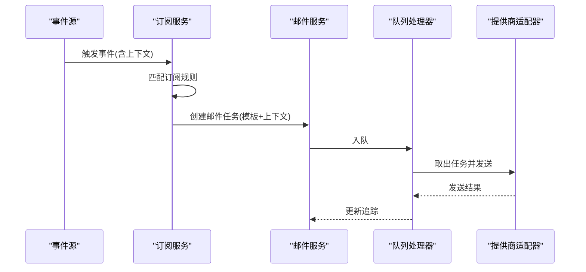
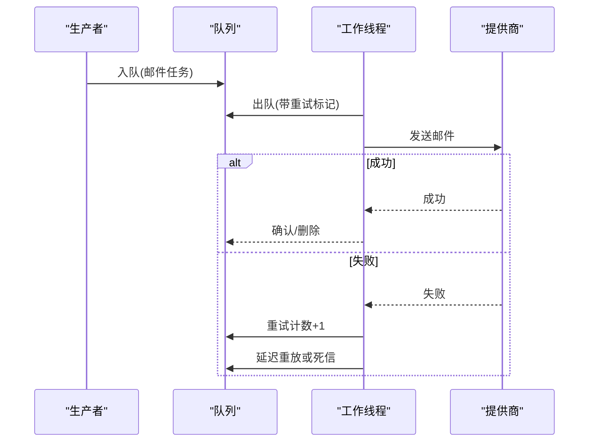
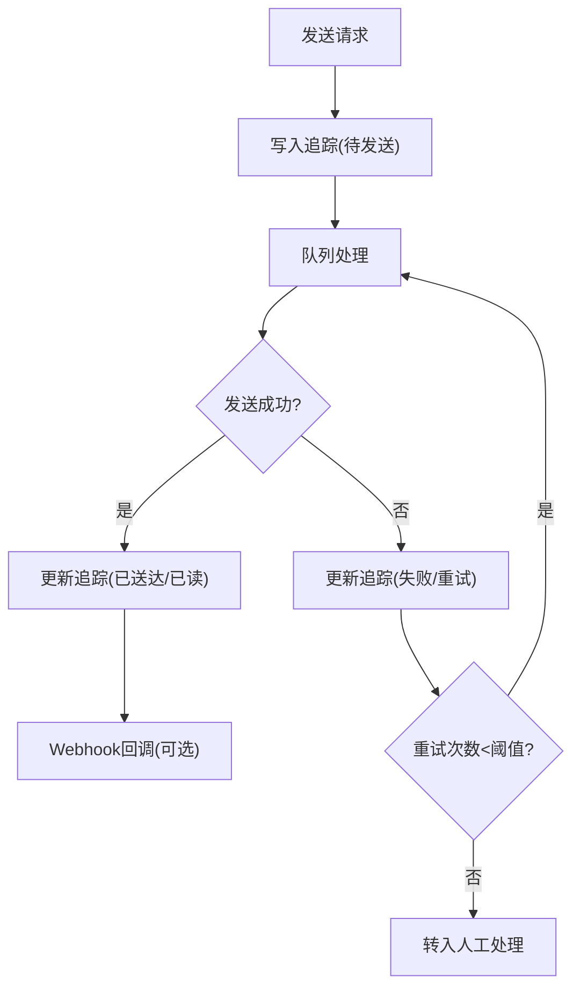
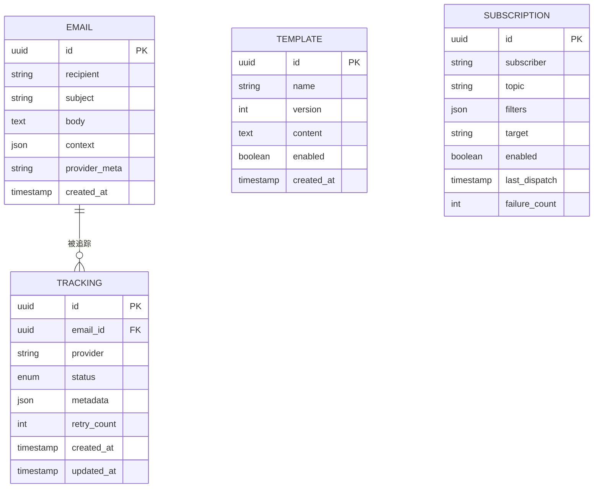
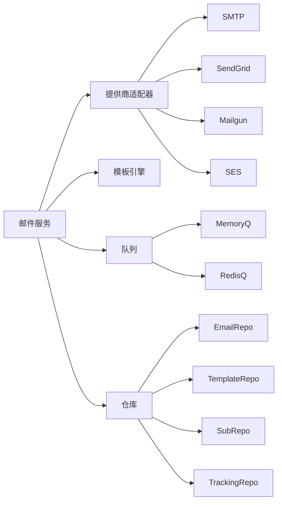

# 邮件服务系统

<cite>
**本文引用的文件**
- [README.md](file://README.md)
- [pyproject.toml](file://pyproject.toml)
- [src/taolib/email_service/__init__.py](file://src/taolib/email_service/__init__.py)
- [src/taolib/email_service/models/email.py](file://src/taolib/email_service/models/email.py)
- [src/taolib/email_service/models/template.py](file://src/taolib/email_service/models/template.py)
- [src/taolib/email_service/models/subscription.py](file://src/taolib/email_service/models/subscription.py)
- [src/taolib/email_service/models/tracking.py](file://src/taolib/email_service/models/tracking.py)
- [src/taolib/email_service/providers/protocol.py](file://src/taolib/email_service/providers/protocol.py)
- [src/taolib/email_service/providers/smtp.py](file://src/taolib/email_service/providers/smtp.py)
- [src/taolib/email_service/providers/sendgrid.py](file://src/taolib/email_service/providers/sendgrid.py)
- [src/taolib/email_service/providers/mailgun.py](file://src/taolib/email_service/providers/mailgun.py)
- [src/taolib/email_service/providers/ses.py](file://src/taolib/email_service/providers/ses.py)
- [src/taolib/email_service/providers/failover.py](file://src/taolib/email_service/providers/failover.py)
- [src/taolib/email_service/queue/protocol.py](file://src/taolib/email_service/queue/protocol.py)
- [src/taolib/email_service/queue/memory_queue.py](file://src/taolib/email_service/queue/memory_queue.py)
- [src/taolib/email_service/queue/redis_queue.py](file://src/taolib/email_service/queue/redis_queue.py)
- [src/taolib/email_service/repository/email_repo.py](file://src/taolib/email_service/repository/email_repo.py)
- [src/taolib/email_service/repository/template_repo.py](file://src/taolib/email_service/repository/template_repo.py)
- [src/taolib/email_service/repository/subscription_repo.py](file://src/taolib/email_service/repository/subscription_repo.py)
- [src/taolib/email_service/repository/tracking_repo.py](file://src/taolib/email_service/repository/tracking_repo.py)
- [src/taolib/email_service/services/email_service.py](file://src/taolib/email_service/services/email_service.py)
- [src/taolib/email_service/services/queue_processor.py](file://src/taolib/email_service/services/queue_processor.py)
- [src/taolib/email_service/services/subscription_service.py](file://src/taolib/email_service/services/subscription_service.py)
- [src/taolib/email_service/services/template_service.py](file://src/taolib/email_service/services/template_service.py)
- [src/taolib/email_service/services/tracking_service.py](file://src/taolib/email_service/services/tracking_service.py)
- [src/taolib/email_service/template/engine.py](file://src/taolib/email_service/template/engine.py)
- [src/taolib/email_service/server/app.py](file://src/taolib/email_service/server/app.py)
- [src/taolib/email_service/server/config.py](file://src/taolib/email_service/server/config.py)
- [src/taolib/email_service/server/main.py](file://src/taolib/email_service/server/main.py)
- [src/taolib/email_service/server/api/router.py](file://src/taolib/email_service/server/api/router.py)
- [src/taolib/email_service/server/api/subscriptions.py](file://src/taolib/email_service/server/api/subscriptions.py)
- [src/taolib/email_service/server/api/templates.py](file://src/taolib/email_service/server/api/templates.py)
- [src/taolib/email_service/server/api/tracking.py](file://src/taolib/email_service/server/api/tracking.py)
- [src/taolib/email_service/server/api/webhooks.py](file://src/taolib/email_service/server/api/webhooks.py)
- [src/taolib/email_service/server/api/health.py](file://src/taolib/email_service/server/api/health.py)
- [src/taolib/email_service/cli.py](file://src/taolib/email_service/cli.py)
- [src/taolib/email_service/errors.py](file://src/taolib/email_service/errors.py)
- [tests/testing/test_email_service/test_models.py](file://tests/testing/test_email_service/test_models.py)
- [tests/testing/test_email_service/test_providers.py](file://tests/testing/test_email_service/test_providers.py)
- [tests/testing/test_email_service/test_queue.py](file://tests/testing/test_email_service/test_queue.py)
- [tests/testing/test_email_service/test_services.py](file://tests/testing/test_email_service/test_services.py)
- [tests/testing/test_email_service/test_template_engine.py](file://tests/testing/test_email_service/test_template_engine.py)
</cite>

## 目录
1. [简介](#简介)
2. [项目结构](#项目结构)
3. [核心组件](#核心组件)
4. [架构总览](#架构总览)
5. [详细组件分析](#详细组件分析)
6. [依赖分析](#依赖分析)
7. [性能考虑](#性能考虑)
8. [故障排查指南](#故障排查指南)
9. [结论](#结论)
10. [附录](#附录)

## 简介
本文件为邮件服务系统的完整技术文档，覆盖多提供商支持架构（SMTP、SendGrid、Mailgun、SES）、模板引擎与订阅管理、异步队列与失败重试、发送统计与通知处理等。文档以代码为依据，提供架构图、序列图、流程图与API参考，帮助开发者快速理解与集成。

## 项目结构
邮件服务模块位于 src/taolib/email_service 下，采用分层与功能域结合的组织方式：
- models：数据模型（邮件、模板、订阅、追踪）
- providers：多提供商适配器与协议
- queue：队列抽象与实现（内存/Redis）
- repository：持久化仓库
- services：业务服务（邮件、模板、订阅、追踪、队列处理器）
- template：模板引擎（基于Jinja2）
- server：FastAPI应用、路由与API端点
- cli：命令行工具
- errors：领域错误类型

图表来源
- [src/taolib/email_service/__init__.py](file://src/taolib/email_service/__init__.py)
- [src/taolib/email_service/server/app.py](file://src/taolib/email_service/server/app.py)

章节来源
- [src/taolib/email_service/__init__.py](file://src/taolib/email_service/__init__.py)
- [src/taolib/email_service/server/app.py](file://src/taolib/email_service/server/app.py)

## 核心组件
- 多提供商适配器：SMTP、SendGrid、Mailgun、SES，统一通过协议接口调用
- 模板引擎：Jinja2驱动，支持动态内容渲染与缓存
- 订阅管理：订阅关系、状态跟踪与通知派发
- 异步队列：内存队列与Redis队列，支持并发与持久化
- 发送追踪：统计、失败重试与Webhook回推
- API服务：健康检查、订阅、模板、追踪、Webhook端点

章节来源
- [src/taolib/email_service/providers/protocol.py](file://src/taolib/email_service/providers/protocol.py)
- [src/taolib/email_service/template/engine.py](file://src/taolib/email_service/template/engine.py)
- [src/taolib/email_service/services/subscription_service.py](file://src/taolib/email_service/services/subscription_service.py)
- [src/taolib/email_service/queue/protocol.py](file://src/taolib/email_service/queue/protocol.py)
- [src/taolib/email_service/services/tracking_service.py](file://src/taolib/email_service/services/tracking_service.py)
- [src/taolib/email_service/server/api/router.py](file://src/taolib/email_service/server/api/router.py)

## 架构总览
系统采用“服务层+适配器+队列+模板引擎”的分层设计，外部通过API触发异步发送；内部通过队列解耦生产者与消费者，模板引擎负责动态内容生成，提供商适配器负责最终投递。

图表来源
- [src/taolib/email_service/server/app.py](file://src/taolib/email_service/server/app.py)
- [src/taolib/email_service/services/email_service.py](file://src/taolib/email_service/services/email_service.py)
- [src/taolib/email_service/services/queue_processor.py](file://src/taolib/email_service/services/queue_processor.py)
- [src/taolib/email_service/providers/protocol.py](file://src/taolib/email_service/providers/protocol.py)
- [src/taolib/email_service/template/engine.py](file://src/taolib/email_service/template/engine.py)
- [src/taolib/email_service/server/api/router.py](file://src/taolib/email_service/server/api/router.py)

## 详细组件分析

### 多提供商支持架构
- 协议接口：定义统一的发送契约，屏蔽具体提供商差异
- SMTP提供商：基于标准SMTP协议，支持认证与TLS
- SendGrid提供商：REST API封装，支持模板ID与动态数据
- Mailgun提供商：REST API封装，支持附件与域名域
- SES提供商：AWS SES集成，支持批量与模板
- 故障转移：在多个提供商间自动切换，提升可用性

图表来源
- [src/taolib/email_service/providers/protocol.py](file://src/taolib/email_service/providers/protocol.py)
- [src/taolib/email_service/providers/smtp.py](file://src/taolib/email_service/providers/smtp.py)
- [src/taolib/email_service/providers/sendgrid.py](file://src/taolib/email_service/providers/sendgrid.py)
- [src/taolib/email_service/providers/mailgun.py](file://src/taolib/email_service/providers/mailgun.py)
- [src/taolib/email_service/providers/ses.py](file://src/taolib/email_service/providers/ses.py)
- [src/taolib/email_service/providers/failover.py](file://src/taolib/email_service/providers/failover.py)

章节来源
- [src/taolib/email_service/providers/protocol.py](file://src/taolib/email_service/providers/protocol.py)
- [src/taolib/email_service/providers/smtp.py](file://src/taolib/email_service/providers/smtp.py)
- [src/taolib/email_service/providers/sendgrid.py](file://src/taolib/email_service/providers/sendgrid.py)
- [src/taolib/email_service/providers/mailgun.py](file://src/taolib/email_service/providers/mailgun.py)
- [src/taolib/email_service/providers/ses.py](file://src/taolib/email_service/providers/ses.py)
- [src/taolib/email_service/providers/failover.py](file://src/taolib/email_service/providers/failover.py)

### 模板引擎与动态内容生成
- 引擎：基于Jinja2，支持变量替换、条件渲染、循环与宏
- 缓存：按模板名+版本键缓存渲染结果，降低重复计算
- 动态数据：接收上下文字典，注入到模板渲染过程
- 错误处理：模板语法错误、缺失变量等异常捕获与上报

图表来源
- [src/taolib/email_service/template/engine.py](file://src/taolib/email_service/template/engine.py)
- [src/taolib/email_service/services/template_service.py](file://src/taolib/email_service/services/template_service.py)

章节来源
- [src/taolib/email_service/template/engine.py](file://src/taolib/email_service/template/engine.py)
- [src/taolib/email_service/services/template_service.py](file://src/taolib/email_service/services/template_service.py)

### 订阅管理与通知处理
- 订阅实体：包含订阅者、主题、过滤条件、状态与通知目标
- 订阅服务：创建、更新、启用/禁用订阅；匹配事件并派发通知
- 通知处理：将匹配的订阅转换为邮件任务，进入队列异步发送
- 状态跟踪：记录订阅状态变更、最近派发时间与失败次数

图表来源
- [src/taolib/email_service/services/subscription_service.py](file://src/taolib/email_service/services/subscription_service.py)
- [src/taolib/email_service/services/email_service.py](file://src/taolib/email_service/services/email_service.py)
- [src/taolib/email_service/services/queue_processor.py](file://src/taolib/email_service/services/queue_processor.py)
- [src/taolib/email_service/providers/protocol.py](file://src/taolib/email_service/providers/protocol.py)

章节来源
- [src/taolib/email_service/models/subscription.py](file://src/taolib/email_service/models/subscription.py)
- [src/taolib/email_service/services/subscription_service.py](file://src/taolib/email_service/services/subscription_service.py)
- [src/taolib/email_service/server/api/subscriptions.py](file://src/taolib/email_service/server/api/subscriptions.py)

### 异步邮件发送与失败重试
- 队列协议：抽象队列入队/出队/确认/重试
- 内存队列：单实例开发测试使用
- Redis队列：分布式生产环境，支持持久化与断电恢复
- 失败重试：指数退避或固定间隔重试，超过阈值转人工介入
- 并发控制：消费者数量与队列深度可配置，避免过载

图表来源
- [src/taolib/email_service/queue/protocol.py](file://src/taolib/email_service/queue/protocol.py)
- [src/taolib/email_service/queue/memory_queue.py](file://src/taolib/email_service/queue/memory_queue.py)
- [src/taolib/email_service/queue/redis_queue.py](file://src/taolib/email_service/queue/redis_queue.py)
- [src/taolib/email_service/services/queue_processor.py](file://src/taolib/email_service/services/queue_processor.py)

章节来源
- [src/taolib/email_service/queue/protocol.py](file://src/taolib/email_service/queue/protocol.py)
- [src/taolib/email_service/queue/memory_queue.py](file://src/taolib/email_service/queue/memory_queue.py)
- [src/taolib/email_service/queue/redis_queue.py](file://src/taolib/email_service/queue/redis_queue.py)
- [src/taolib/email_service/services/queue_processor.py](file://src/taolib/email_service/services/queue_processor.py)

### 发送统计与追踪
- 追踪模型：记录发送状态、时间戳、提供商信息、错误码与重试次数
- 追踪服务：聚合统计指标（发送量、失败率、平均耗时），支持查询与导出
- Webhook：对接提供商回执（送达、打开、退信、点击）并更新追踪

图表来源
- [src/taolib/email_service/models/tracking.py](file://src/taolib/email_service/models/tracking.py)
- [src/taolib/email_service/services/tracking_service.py](file://src/taolib/email_service/services/tracking_service.py)
- [src/taolib/email_service/server/api/tracking.py](file://src/taolib/email_service/server/api/tracking.py)

章节来源
- [src/taolib/email_service/models/tracking.py](file://src/taolib/email_service/models/tracking.py)
- [src/taolib/email_service/services/tracking_service.py](file://src/taolib/email_service/services/tracking_service.py)
- [src/taolib/email_service/server/api/tracking.py](file://src/taolib/email_service/server/api/tracking.py)

### 数据模型
- 邮件模型：收件人、主题、正文、附件、模板ID、上下文、提供商元数据
- 模板模型：名称、版本、内容、描述、启用状态
- 订阅模型：订阅者、主题、过滤规则、目标地址、状态、创建/更新时间
- 追踪模型：任务ID、提供商、状态、时间线、错误详情、重试计数

图表来源
- [src/taolib/email_service/models/email.py](file://src/taolib/email_service/models/email.py)
- [src/taolib/email_service/models/template.py](file://src/taolib/email_service/models/template.py)
- [src/taolib/email_service/models/subscription.py](file://src/taolib/email_service/models/subscription.py)
- [src/taolib/email_service/models/tracking.py](file://src/taolib/email_service/models/tracking.py)

章节来源
- [src/taolib/email_service/models/email.py](file://src/taolib/email_service/models/email.py)
- [src/taolib/email_service/models/template.py](file://src/taolib/email_service/models/template.py)
- [src/taolib/email_service/models/subscription.py](file://src/taolib/email_service/models/subscription.py)
- [src/taolib/email_service/models/tracking.py](file://src/taolib/email_service/models/tracking.py)

### API参考
- 路由与应用：注册所有API端点与中间件
- 订阅API：创建/更新/查询/启用/禁用订阅
- 模板API：创建/更新/查询/版本管理
- 追踪API：查询发送状态、统计与导出
- Webhook：提供商回执回调入口
- 健康检查：系统运行状态自检

章节来源
- [src/taolib/email_service/server/api/router.py](file://src/taolib/email_service/server/api/router.py)
- [src/taolib/email_service/server/api/subscriptions.py](file://src/taolib/email_service/server/api/subscriptions.py)
- [src/taolib/email_service/server/api/templates.py](file://src/taolib/email_service/server/api/templates.py)
- [src/taolib/email_service/server/api/tracking.py](file://src/taolib/email_service/server/api/tracking.py)
- [src/taolib/email_service/server/api/webhooks.py](file://src/taolib/email_service/server/api/webhooks.py)
- [src/taolib/email_service/server/api/health.py](file://src/taolib/email_service/server/api/health.py)

## 依赖分析
- 组件内聚：服务层聚合模型、仓库、模板与队列，职责清晰
- 组件耦合：通过协议接口与抽象队列降低对具体提供商与存储的耦合
- 外部依赖：FastAPI、Jinja2、Redis、提供商SDK
- 循环依赖：未见循环导入；各层单向依赖

图表来源
- [src/taolib/email_service/services/email_service.py](file://src/taolib/email_service/services/email_service.py)
- [src/taolib/email_service/providers/protocol.py](file://src/taolib/email_service/providers/protocol.py)
- [src/taolib/email_service/queue/protocol.py](file://src/taolib/email_service/queue/protocol.py)
- [src/taolib/email_service/repository/email_repo.py](file://src/taolib/email_service/repository/email_repo.py)

章节来源
- [src/taolib/email_service/services/email_service.py](file://src/taolib/email_service/services/email_service.py)
- [src/taolib/email_service/providers/protocol.py](file://src/taolib/email_service/providers/protocol.py)
- [src/taolib/email_service/queue/protocol.py](file://src/taolib/email_service/queue/protocol.py)
- [src/taolib/email_service/repository/email_repo.py](file://src/taolib/email_service/repository/email_repo.py)

## 性能考虑
- 模板缓存：按模板名+版本键缓存渲染结果，减少重复解析与渲染
- 队列并发：根据CPU与网络带宽调整消费者数量；Redis队列支持水平扩展
- 批量发送：提供商侧支持批量/模板ID，减少HTTP开销
- 超时与重试：合理设置发送超时与重试间隔，避免阻塞队列
- 监控与告警：追踪服务输出关键指标，结合日志与APM进行性能分析

## 故障排查指南
- 提供商不可用：检查提供商凭据、网络连通性与配额限制；使用故障转移适配器
- 模板渲染失败：核对模板语法与上下文字段；查看模板服务错误日志
- 队列堆积：检查消费者进程、Redis连接与并发配置；必要时扩容消费者
- Webhook未达：核对回调URL、签名验证与幂等处理；查看追踪记录
- 订阅不生效：检查订阅规则、过滤条件与启用状态

章节来源
- [src/taolib/email_service/errors.py](file://src/taolib/email_service/errors.py)
- [src/taolib/email_service/services/queue_processor.py](file://src/taolib/email_service/services/queue_processor.py)
- [src/taolib/email_service/services/tracking_service.py](file://src/taolib/email_service/services/tracking_service.py)

## 结论
该邮件服务系统通过多提供商适配、模板引擎与订阅管理实现了高可用、可扩展的异步邮件发送能力。配合队列与追踪机制，能够满足生产级的稳定性与可观测性需求。建议在生产中结合Redis队列与故障转移策略，并完善监控与告警体系。

## 附录
- 安装与运行：参考项目根目录的构建与运行脚本
- 配置项：提供商密钥、Redis连接、队列并发度、模板缓存参数
- 集成步骤：注册提供商、创建模板、配置订阅规则、接入Webhook

章节来源
- [README.md](file://README.md)
- [pyproject.toml](file://pyproject.toml)
- [src/taolib/email_service/server/config.py](file://src/taolib/email_service/server/config.py)