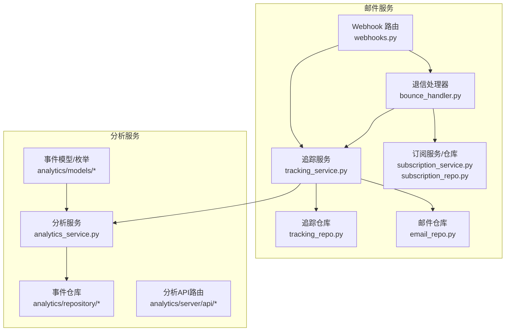
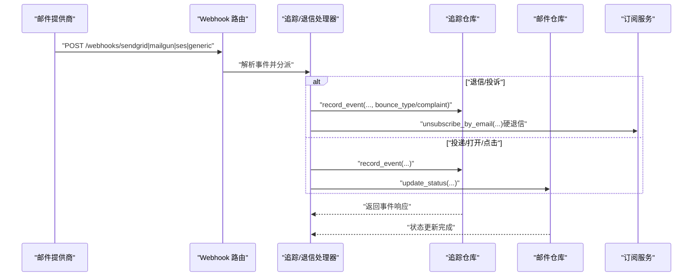
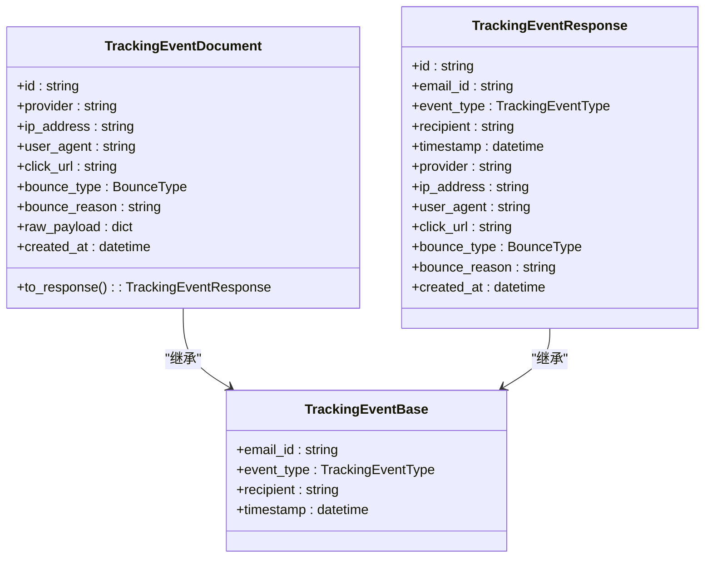
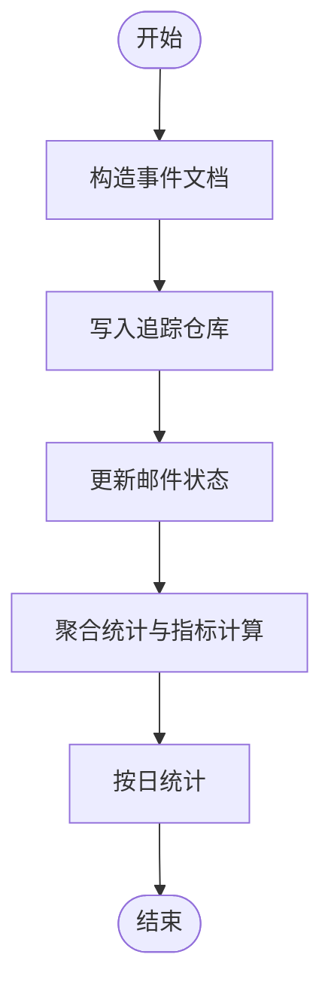
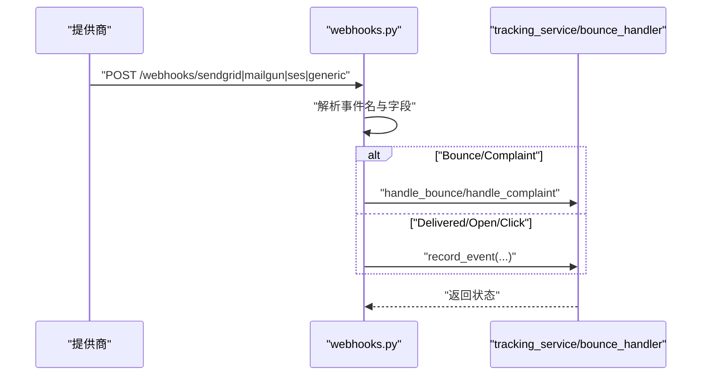
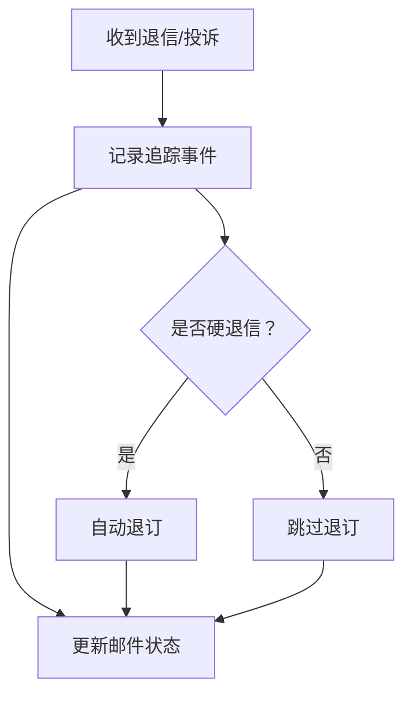
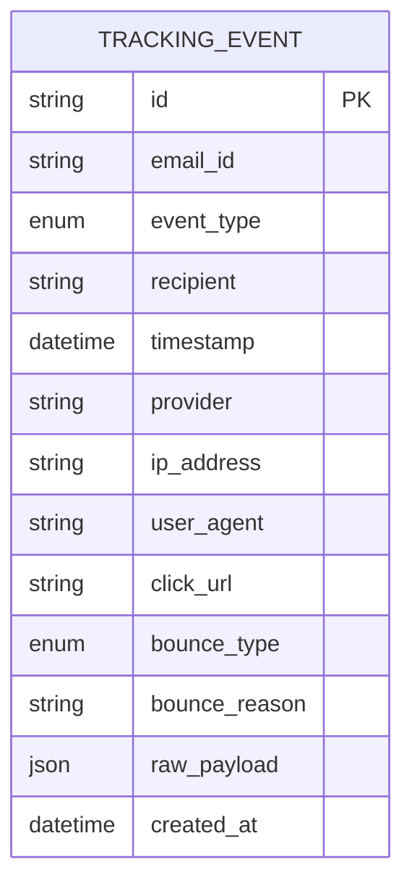
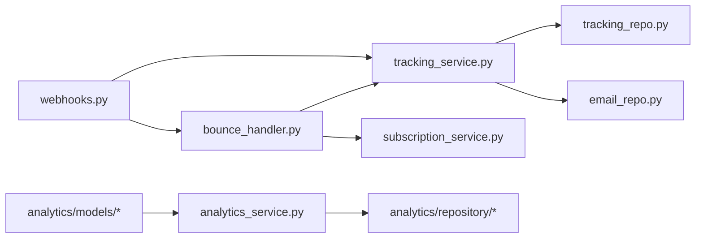

# 邮件追踪与分析

<cite>
**本文引用的文件**
- [tracking.py](file://src/taolib/testing/email_service/models/tracking.py)
- [tracking_service.py](file://src/taolib/testing/email_service/services/tracking_service.py)
- [tracking_repo.py](file://src/taolib/testing/email_service/repository/tracking_repo.py)
- [bounce_handler.py](file://src/taolib/testing/email_service/services/bounce_handler.py)
- [webhooks.py](file://src/taolib/testing/email_service/server/api/webhooks.py)
- [enums.py](file://src/taolib/testing/email_service/models/enums.py)
- [email_repo.py](file://src/taolib/testing/email_service/repository/email_repo.py)
- [subscription_repo.py](file://src/taolib/testing/email_service/repository/subscription_repo.py)
- [subscription_service.py](file://src/taolib/testing/email_service/services/subscription_service.py)
- [analytics.py](file://src/taolib/testing/analytics/server/api/analytics.py)
- [events.py](file://src/taolib/testing/analytics/server/api/events.py)
- [router.py](file://src/taolib/testing/analytics/server/api/router.py)
- [app.py](file://src/taolib/testing/analytics/server/app.py)
- [main.py](file://src/taolib/testing/analytics/server/main.py)
- [health.py](file://src/taolib/testing/analytics/server/api/health.py)
- [event_repo.py](file://src/taolib/testing/analytics/repository/event_repo.py)
- [session_repo.py](file://src/taolib/testing/analytics/repository/session_repo.py)
- [analytics_service.py](file://src/taolib/testing/analytics/services/analytics_service.py)
- [types.py](file://src/taolib/testing/analytics/events/types.py)
- [event.py](file://src/taolib/testing/analytics/models/event.py)
- [enums.py](file://src/taolib/testing/analytics/models/enums.py)
</cite>

## 目录
1. [简介](#简介)
2. [项目结构](#项目结构)
3. [核心组件](#核心组件)
4. [架构总览](#架构总览)
5. [详细组件分析](#详细组件分析)
6. [依赖关系分析](#依赖关系分析)
7. [性能考量](#性能考量)
8. [故障排查指南](#故障排查指南)
9. [结论](#结论)
10. [附录](#附录)

## 简介
本技术文档聚焦于邮件追踪与分析模块，系统阐述以下能力与实现：
- 邮件投递追踪、打开率与点击率统计
- 退信处理、bounce类型分类与自动退订
- 追踪事件的数据模型设计与存储策略（含TTL）
- 实时监控、告警机制与性能指标
- 用户行为分析、偏好建模与个性化推荐（基于现有能力的扩展建议）
- 数据可视化、报表生成与导出（基于现有能力的扩展建议）
- 隐私保护、数据脱敏与合规性要求
- 完整API接口、集成示例与最佳实践

## 项目结构
邮件追踪与分析模块位于 email_service 子系统中，围绕“Webhook 接收 → 事件解析 → 追踪记录 → 状态同步 → 退信处理”的主链路组织代码；同时在 analytics 子系统中提供通用事件采集与分析能力，可作为邮件分析的补充。

图表来源
- [webhooks.py:1-194](file://src/taolib/testing/email_service/server/api/webhooks.py#L1-L194)
- [tracking_service.py:1-144](file://src/taolib/testing/email_service/services/tracking_service.py#L1-L144)
- [tracking_repo.py:1-100](file://src/taolib/testing/email_service/repository/tracking_repo.py#L1-L100)
- [bounce_handler.py:1-107](file://src/taolib/testing/email_service/services/bounce_handler.py#L1-L107)
- [email_repo.py](file://src/taolib/testing/email_service/repository/email_repo.py)
- [subscription_service.py](file://src/taolib/testing/email_service/services/subscription_service.py)
- [subscription_repo.py](file://src/taolib/testing/email_service/repository/subscription_repo.py)
- [analytics.py](file://src/taolib/testing/analytics/server/api/analytics.py)
- [events.py](file://src/taolib/testing/analytics/server/api/events.py)
- [router.py](file://src/taolib/testing/analytics/server/api/router.py)
- [app.py](file://src/taolib/testing/analytics/server/app.py)
- [main.py](file://src/taolib/testing/analytics/server/main.py)
- [health.py](file://src/taolib/testing/analytics/server/api/health.py)
- [event_repo.py](file://src/taolib/testing/analytics/repository/event_repo.py)
- [session_repo.py](file://src/taolib/testing/analytics/repository/session_repo.py)
- [analytics_service.py](file://src/taolib/testing/analytics/services/analytics_service.py)
- [types.py](file://src/taolib/testing/analytics/events/types.py)
- [event.py](file://src/taolib/testing/analytics/models/event.py)
- [enums.py](file://src/taolib/testing/analytics/models/enums.py)

章节来源
- [webhooks.py:1-194](file://src/taolib/testing/email_service/server/api/webhooks.py#L1-L194)
- [tracking_service.py:1-144](file://src/taolib/testing/email_service/services/tracking_service.py#L1-L144)
- [tracking_repo.py:1-100](file://src/taolib/testing/email_service/repository/tracking_repo.py#L1-L100)
- [bounce_handler.py:1-107](file://src/taolib/testing/email_service/services/bounce_handler.py#L1-L107)

## 核心组件
- Webhook 接收与分发：统一入口接收来自 SendGrid、Mailgun、SES 等提供商的事件通知，并映射到内部事件类型。
- 追踪服务：记录事件、计算指标、更新邮件状态。
- 退信处理器：识别硬/软退信与投诉，执行自动退订与状态同步。
- 追踪仓库：提供事件查询、聚合统计与索引优化。
- 分析服务与API：提供通用事件采集、会话与事件聚合、健康检查等能力，可作为邮件分析的补充。

章节来源
- [webhooks.py:1-194](file://src/taolib/testing/email_service/server/api/webhooks.py#L1-L194)
- [tracking_service.py:1-144](file://src/taolib/testing/email_service/services/tracking_service.py#L1-L144)
- [tracking_repo.py:1-100](file://src/taolib/testing/email_service/repository/tracking_repo.py#L1-L100)
- [bounce_handler.py:1-107](file://src/taolib/testing/email_service/services/bounce_handler.py#L1-L107)
- [analytics.py](file://src/taolib/testing/analytics/server/api/analytics.py)
- [events.py](file://src/taolib/testing/analytics/server/api/events.py)
- [router.py](file://src/taolib/testing/analytics/server/api/router.py)
- [app.py](file://src/taolib/testing/analytics/server/app.py)
- [main.py](file://src/taolib/testing/analytics/server/main.py)
- [health.py](file://src/taolib/testing/analytics/server/api/health.py)

## 架构总览
下图展示从 Webhook 到事件落库、状态更新与退信处理的关键交互。

图表来源
- [webhooks.py:13-194](file://src/taolib/testing/email_service/server/api/webhooks.py#L13-L194)
- [tracking_service.py:51-144](file://src/taolib/testing/email_service/services/tracking_service.py#L51-L144)
- [tracking_repo.py:20-100](file://src/taolib/testing/email_service/repository/tracking_repo.py#L20-L100)
- [bounce_handler.py:39-107](file://src/taolib/testing/email_service/services/bounce_handler.py#L39-L107)
- [email_repo.py](file://src/taolib/testing/email_service/repository/email_repo.py)
- [subscription_service.py](file://src/taolib/testing/email_service/services/subscription_service.py)

## 详细组件分析

### 数据模型与事件类型
- 事件基础模型：包含邮件ID、事件类型、收件人、时间戳等通用字段。
- 文档模型：扩展提供IP、UA、点击URL、bounce类型与原因、原始payload、创建时间等。
- 响应模型：用于API输出，字段对齐文档模型。
- 事件类型与bounce类型：通过枚举定义，确保跨提供商的一致性。

图表来源
- [tracking.py:12-79](file://src/taolib/testing/email_service/models/tracking.py#L12-L79)
- [enums.py](file://src/taolib/testing/email_service/models/enums.py)

章节来源
- [tracking.py:12-79](file://src/taolib/testing/email_service/models/tracking.py#L12-L79)
- [enums.py](file://src/taolib/testing/email_service/models/enums.py)

### 追踪服务与指标计算
- 记录事件：生成唯一ID、写入追踪集合、异步更新邮件状态。
- 指标计算：按时间窗口聚合事件计数，计算投递率、打开率、点击率、退信率。
- 日统计：按日聚合事件类型计数，便于趋势分析。

图表来源
- [tracking_service.py:51-144](file://src/taolib/testing/email_service/services/tracking_service.py#L51-L144)
- [tracking_repo.py:46-86](file://src/taolib/testing/email_service/repository/tracking_repo.py#L46-L86)

章节来源
- [tracking_service.py:19-144](file://src/taolib/testing/email_service/services/tracking_service.py#L19-L144)
- [tracking_repo.py:46-86](file://src/taolib/testing/email_service/repository/tracking_repo.py#L46-L86)

### Webhook 接收与事件分派
- SendGrid：支持 delivered/opened/clicked/bounce/spamreport 映射，透传IP、UA、点击URL等上下文。
- Mailgun：支持 delivered/opened/clicked/failed/complained 映射，兼容不同payload结构。
- SES：解析 SNS 通知中的 Delivery/Bounce/Complaint，按收件人批量处理。
- 通用：基于自定义字段进行事件分派，便于SMTP等场景接入。

图表来源
- [webhooks.py:13-194](file://src/taolib/testing/email_service/server/api/webhooks.py#L13-L194)
- [tracking_service.py:51-89](file://src/taolib/testing/email_service/services/tracking_service.py#L51-L89)
- [bounce_handler.py:39-107](file://src/taolib/testing/email_service/services/bounce_handler.py#L39-L107)

章节来源
- [webhooks.py:13-194](file://src/taolib/testing/email_service/server/api/webhooks.py#L13-L194)

### 退信处理与自动退订
- 硬退信阈值控制：超过阈值自动退订，降低后续成本与风险。
- 投诉即退订：收到 spamreport/complaint 视为退订请求。
- 状态同步：退信/投诉事件入库后，同步更新邮件状态。

图表来源
- [bounce_handler.py:39-107](file://src/taolib/testing/email_service/services/bounce_handler.py#L39-L107)
- [tracking_service.py:124-142](file://src/taolib/testing/email_service/services/tracking_service.py#L124-L142)
- [subscription_service.py](file://src/taolib/testing/email_service/services/subscription_service.py)
- [subscription_repo.py](file://src/taolib/testing/email_service/repository/subscription_repo.py)

章节来源
- [bounce_handler.py:16-107](file://src/taolib/testing/email_service/services/bounce_handler.py#L16-L107)
- [subscription_service.py](file://src/taolib/testing/email_service/services/subscription_service.py)
- [subscription_repo.py](file://src/taolib/testing/email_service/repository/subscription_repo.py)

### 存储策略与索引
- 追踪集合：按 email_id、event_type、timestamp、recipient 建立索引，加速查询与聚合。
- TTL：created_at 字段设置90天TTL，自动清理历史事件，降低存储压力。
- 聚合管道：使用MongoDB聚合框架进行事件计数与按日统计。

图表来源
- [tracking_repo.py:88-98](file://src/taolib/testing/email_service/repository/tracking_repo.py#L88-L98)
- [tracking.py:23-44](file://src/taolib/testing/email_service/models/tracking.py#L23-L44)

章节来源
- [tracking_repo.py:13-100](file://src/taolib/testing/email_service/repository/tracking_repo.py#L13-L100)
- [tracking.py:23-44](file://src/taolib/testing/email_service/models/tracking.py#L23-L44)

### 通用分析能力（补充）
- 事件模型与枚举：提供通用事件类型、会话与事件聚合能力。
- 仓库层：事件与会话的持久化与查询。
- 服务层：通用分析逻辑封装。
- API层：健康检查、事件上报、分析接口路由。

章节来源
- [analytics.py](file://src/taolib/testing/analytics/server/api/analytics.py)
- [events.py](file://src/taolib/testing/analytics/server/api/events.py)
- [router.py](file://src/taolib/testing/analytics/server/api/router.py)
- [app.py](file://src/taolib/testing/analytics/server/app.py)
- [main.py](file://src/taolib/testing/analytics/server/main.py)
- [health.py](file://src/taolib/testing/analytics/server/api/health.py)
- [event_repo.py](file://src/taolib/testing/analytics/repository/event_repo.py)
- [session_repo.py](file://src/taolib/testing/analytics/repository/session_repo.py)
- [analytics_service.py](file://src/taolib/testing/analytics/services/analytics_service.py)
- [types.py](file://src/taolib/testing/analytics/events/types.py)
- [event.py](file://src/taolib/testing/analytics/models/event.py)
- [enums.py](file://src/taolib/testing/analytics/models/enums.py)

## 依赖关系分析
- Webhook 路由依赖追踪服务与退信处理器实例（通过FastAPI应用状态注入）。
- 追踪服务依赖追踪仓库与邮件仓库，负责事件落库与状态同步。
- 退信处理器依赖追踪服务、订阅服务与邮件仓库，负责退信/投诉处理与自动退订。
- 分析服务与仓库层相互独立，可作为邮件分析的补充能力。

图表来源
- [webhooks.py:13-194](file://src/taolib/testing/email_service/server/api/webhooks.py#L13-L194)
- [tracking_service.py:34-49](file://src/taolib/testing/email_service/services/tracking_service.py#L34-L49)
- [tracking_repo.py:13-18](file://src/taolib/testing/email_service/repository/tracking_repo.py#L13-L18)
- [email_repo.py](file://src/taolib/testing/email_service/repository/email_repo.py)
- [bounce_handler.py:19-37](file://src/taolib/testing/email_service/services/bounce_handler.py#L19-L37)
- [subscription_service.py](file://src/taolib/testing/email_service/services/subscription_service.py)
- [analytics_service.py](file://src/taolib/testing/analytics/services/analytics_service.py)
- [event_repo.py](file://src/taolib/testing/analytics/repository/event_repo.py)
- [session_repo.py](file://src/taolib/testing/analytics/repository/session_repo.py)
- [event.py](file://src/taolib/testing/analytics/models/event.py)

章节来源
- [webhooks.py:13-194](file://src/taolib/testing/email_service/server/api/webhooks.py#L13-L194)
- [tracking_service.py:34-49](file://src/taolib/testing/email_service/services/tracking_service.py#L34-L49)
- [tracking_repo.py:13-18](file://src/taolib/testing/email_service/repository/tracking_repo.py#L13-L18)
- [bounce_handler.py:19-37](file://src/taolib/testing/email_service/services/bounce_handler.py#L19-L37)
- [analytics_service.py](file://src/taolib/testing/analytics/services/analytics_service.py)

## 性能考量
- 查询与聚合
  - 使用 email_id、event_type、timestamp、recipient 索引，避免全表扫描。
  - 聚合统计采用MongoDB聚合管道，减少应用侧内存占用。
- TTL清理
  - created_at 设置90天TTL，自动清理历史事件，控制集合规模。
- 并发与异步
  - Webhook处理与事件落库均为异步，提升吞吐。
- 批量处理
  - SES Webhook对多个收件人逐条处理，可根据需要改为批量入库以提升效率。

章节来源
- [tracking_repo.py:88-98](file://src/taolib/testing/email_service/repository/tracking_repo.py#L88-L98)
- [webhooks.py:125-167](file://src/taolib/testing/email_service/server/api/webhooks.py#L125-L167)

## 故障排查指南
- Webhook无法接收或解析失败
  - 检查提供商回调配置与签名验证（如SendGrid签名）。
  - 查看回调payload字段映射是否正确（如sg_message_id/custom_args、message-id等）。
- 事件未入库或指标异常
  - 核对事件类型映射与过滤条件。
  - 检查聚合管道参数与时间范围。
- 退信未触发退订
  - 确认bounce类型与阈值配置。
  - 检查订阅服务的退订接口是否正常。
- 性能问题
  - 检查索引是否生效，必要时重建索引。
  - 关注TTL清理任务与集合大小。

章节来源
- [webhooks.py:13-194](file://src/taolib/testing/email_service/server/api/webhooks.py#L13-L194)
- [tracking_repo.py:46-86](file://src/taolib/testing/email_service/repository/tracking_repo.py#L46-L86)
- [bounce_handler.py:39-107](file://src/taolib/testing/email_service/services/bounce_handler.py#L39-L107)

## 结论
该模块通过标准化的Webhook接入、统一的事件模型与仓库层聚合，实现了邮件投递追踪、打开率与点击率统计、退信与投诉处理及自动退订。结合TTL清理与索引优化，具备良好的可扩展性与性能表现。通用分析能力可进一步支撑用户行为分析与个性化推荐等高级场景。

## 附录

### API 接口与集成示例
- Webhook 接口
  - SendGrid：POST /webhooks/sendgrid
  - Mailgun：POST /webhooks/mailgun
  - SES：POST /webhooks/ses
  - 通用：POST /webhooks/generic
- 集成步骤
  - 在提供商后台配置回调URL指向上述端点。
  - 确保回调请求体字段与映射一致（如email_id、event、sg_message_id等）。
  - 对于SendGrid，启用签名验证并在网关或应用层校验。
- 示例（概念性）
  - SendGrid：回调中包含事件名与自定义参数，模块据此记录事件并更新状态。
  - Mailgun：兼容两种payload结构，模块自动适配。
  - SES：解析SNS通知，按收件人批量处理。

章节来源
- [webhooks.py:13-194](file://src/taolib/testing/email_service/server/api/webhooks.py#L13-L194)

### 实时监控、告警与性能指标
- 健康检查
  - 分析服务提供健康检查端点，可用于容器编排与平台监控。
- 指标采集
  - 可基于追踪仓库的聚合结果输出关键指标（投递率、打开率、点击率、退信率）。
- 告警建议
  - 当退信率或打开率偏离阈值时触发告警。
  - 当事件入库延迟或聚合耗时异常升高时告警。

章节来源
- [health.py](file://src/taolib/testing/analytics/server/api/health.py)
- [tracking_service.py:96-118](file://src/taolib/testing/email_service/services/tracking_service.py#L96-L118)

### 用户行为分析、偏好建模与个性化推荐（扩展建议）
- 行为序列与会话
  - 基于通用分析服务的事件与会话模型，提取用户行为序列。
- 偏好建模
  - 使用事件类型分布、点击URL、打开时间等特征训练偏好模型。
- 推荐策略
  - 结合用户偏好与内容特征，采用协同过滤或内容推荐算法生成候选集。

章节来源
- [analytics_service.py](file://src/taolib/testing/analytics/services/analytics_service.py)
- [event_repo.py](file://src/taolib/testing/analytics/repository/event_repo.py)
- [session_repo.py](file://src/taolib/testing/analytics/repository/session_repo.py)
- [event.py](file://src/taolib/testing/analytics/models/event.py)
- [enums.py](file://src/taolib/testing/analytics/models/enums.py)

### 数据可视化、报表生成与导出（扩展建议）
- 可视化
  - 使用折线图展示每日事件趋势，柱状图对比不同事件类型占比。
- 报表
  - 生成投递、打开、点击、退信等维度的日报/周报/月报。
- 导出
  - 支持CSV/Excel导出原始事件与聚合结果，便于离线分析。

章节来源
- [tracking_repo.py:57-86](file://src/taolib/testing/email_service/repository/tracking_repo.py#L57-L86)

### 隐私保护、数据脱敏与合规性
- 数据脱敏
  - 对IP地址、User-Agent等敏感字段在存储前进行脱敏或最小化保留。
- 合规性
  - 遵循GDPR等法规，提供删除请求处理与数据保留期限控制（TTL已内置）。
- 最小化原则
  - 仅收集必要的追踪字段，避免采集过多个人数据。

章节来源
- [tracking.py:23-44](file://src/taolib/testing/email_service/models/tracking.py#L23-L44)
- [tracking_repo.py:94-97](file://src/taolib/testing/email_service/repository/tracking_repo.py#L94-L97)