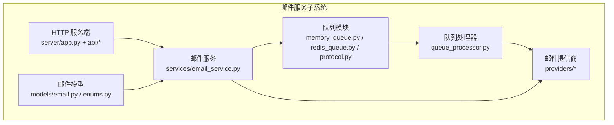
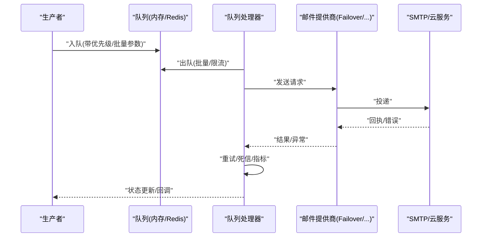
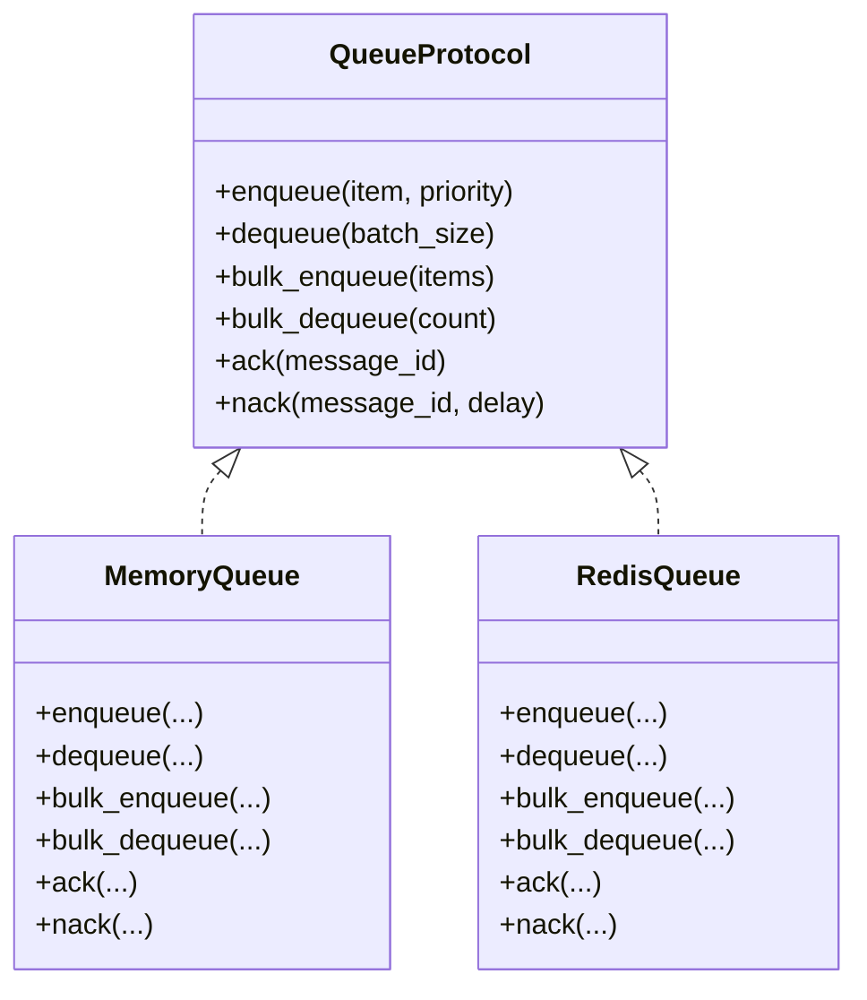
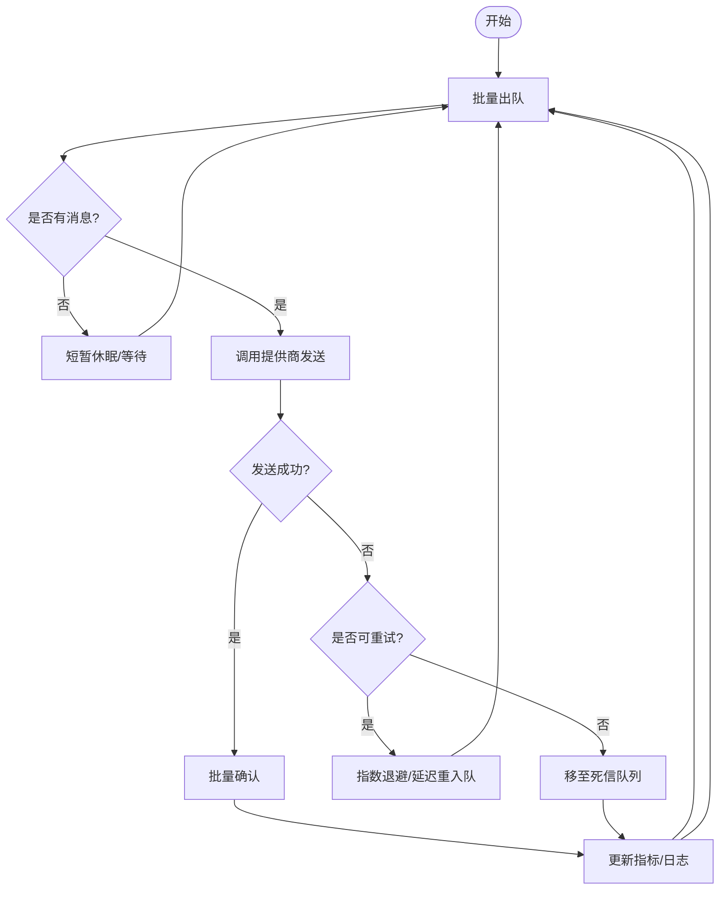
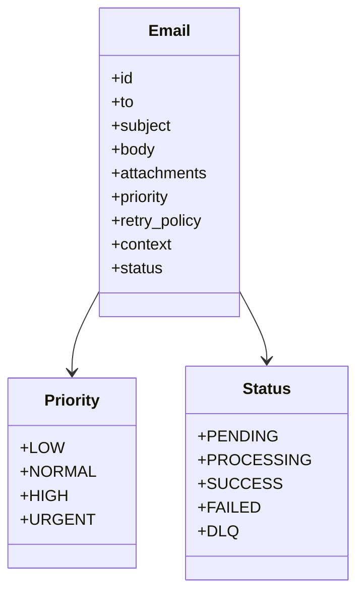
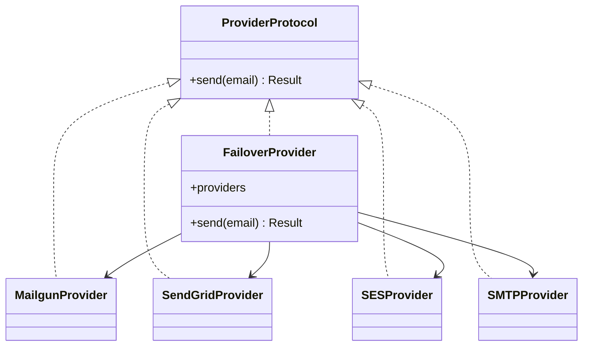
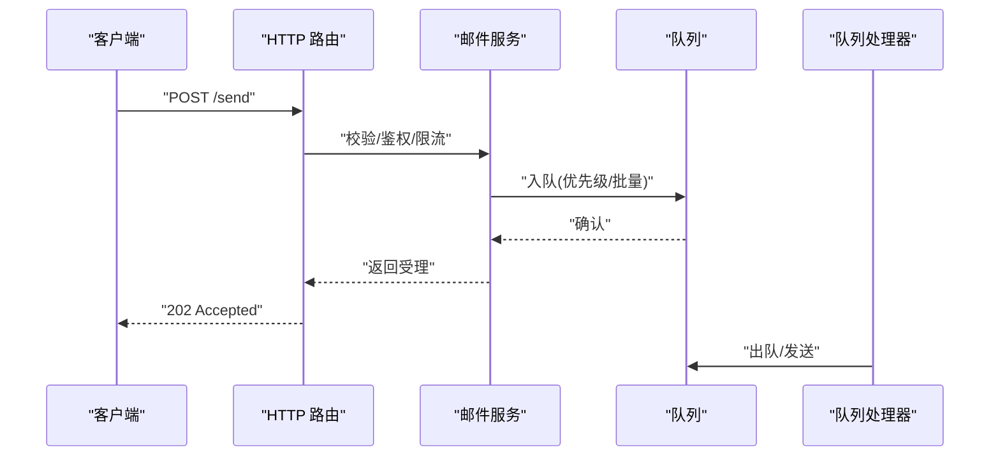
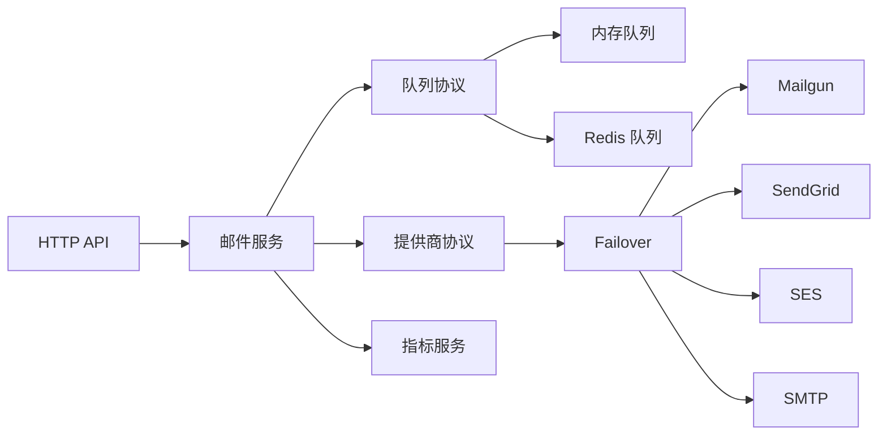

# 邮件队列处理

<cite>
**本文引用的文件**
- [README.md](file://README.md)
- [memory_queue.py](file://src/taolib/testing/email_service/queue/memory_queue.py)
- [redis_queue.py](file://src/taolib/testing/email_service/queue/redis_queue.py)
- [protocol.py](file://src/taolib/testing/email_service/queue/protocol.py)
- [queue_processor.py](file://src/taolib/testing/email_service/services/queue_processor.py)
- [email.py](file://src/taolib/testing/email_service/models/email.py)
- [enums.py](file://src/taolib/testing/email_service/models/enums.py)
- [providers_protocol.py](file://src/taolib/testing/email_service/providers/protocol.py)
- [failover.py](file://src/taolib/testing/email_service/providers/failover.py)
- [mailgun.py](file://src/taolib/testing/email_service/providers/mailgun.py)
- [sendgrid.py](file://src/taolib/testing/email_service/providers/sendgrid.py)
- [ses.py](file://src/taolib/testing/email_service/providers/ses.py)
- [smtp.py](file://src/taolib/testing/email_service/providers/smtp.py)
- [email_service.py](file://src/taolib/testing/email_service/services/email_service.py)
- [app.py](file://src/taolib/testing/email_service/server/app.py)
- [config.py](file://src/taolib/testing/email_service/server/config.py)
- [health.py](file://src/taolib/testing/email_service/server/api/health.py)
- [router.py](file://src/taolib/testing/email_service/server/api/router.py)
- [metrics_service.py](file://src/taolib/testing/data_sync/services/metrics_service.py)
- [job_service.py](file://src/taolib/testing/data_sync/services/job_service.py)
- [scheduler.py](file://src/taolib/testing/data_sync/services/orchestrator.py)
- [orchestrator.py](file://src/taolib/testing/data_sync/pipeline/utils.py)
</cite>

## 目录
1. [简介](#简介)
2. [项目结构](#项目结构)
3. [核心组件](#核心组件)
4. [架构总览](#架构总览)
5. [详细组件分析](#详细组件分析)
6. [依赖关系分析](#依赖关系分析)
7. [性能考量](#性能考量)
8. [故障排查指南](#故障排查指南)
9. [结论](#结论)
10. [附录](#附录)

## 简介
本技术文档聚焦于邮件队列处理模块，系统性阐述异步邮件发送的架构设计与实现原理，覆盖内存队列与 Redis 队列的性能对比与适用场景；说明队列数据结构、优先级管理与批量处理机制；给出失败重试策略、死信队列与异常处理的技术实现；解释并发控制、资源限制与性能监控的配置方法；并提供队列扩容、负载均衡与高可用方案，以及统计指标与故障诊断工具与方法。最后提供完整配置示例、部署指南与运维最佳实践。

## 项目结构
邮件队列处理模块位于 taolib/testing/email_service 子系统中，围绕“队列抽象 + 处理器 + 提供商 + 服务 + 接口”组织，形成清晰的分层与职责分离。

图示来源
- [memory_queue.py:1-200](file://src/taolib/testing/email_service/queue/memory_queue.py#L1-L200)
- [redis_queue.py:1-200](file://src/taolib/testing/email_service/queue/redis_queue.py#L1-L200)
- [protocol.py:1-200](file://src/taolib/testing/email_service/queue/protocol.py#L1-L200)
- [queue_processor.py:1-200](file://src/taolib/testing/email_service/services/queue_processor.py#L1-L200)
- [email.py:1-200](file://src/taolib/testing/email_service/models/email.py#L1-L200)
- [enums.py:1-200](file://src/taolib/testing/email_service/models/enums.py#L1-L200)
- [providers_protocol.py:1-200](file://src/taolib/testing/email_service/providers/protocol.py#L1-L200)
- [email_service.py:1-200](file://src/taolib/testing/email_service/services/email_service.py#L1-L200)
- [app.py:1-200](file://src/taolib/testing/email_service/server/app.py#L1-L200)
- [router.py:1-200](file://src/taolib/testing/email_service/server/api/router.py#L1-L200)

章节来源
- [README.md:1-100](file://README.md#L1-L100)

## 核心组件
- 队列抽象与实现
  - 抽象协议定义统一接口，便于替换内存队列与 Redis 队列实现。
  - 内存队列适合单实例、低延迟、开发测试场景。
  - Redis 队列适合分布式、持久化、高吞吐场景。
- 队列处理器
  - 负责从队列拉取任务、执行发送、处理异常与重试、产出结果与指标。
- 邮件模型与枚举
  - 规范邮件实体、状态、优先级等数据结构。
- 邮件提供商
  - 支持 Failover、Mailgun、SendGrid、SES、SMTP 等多种后端，具备失败切换能力。
- 邮件服务
  - 将业务请求转化为队列任务，调用提供商发送邮件。
- HTTP 服务端
  - 提供健康检查、路由与 API 入口，承载服务治理与可观测性。

章节来源
- [protocol.py:1-200](file://src/taolib/testing/email_service/queue/protocol.py#L1-L200)
- [memory_queue.py:1-200](file://src/taolib/testing/email_service/queue/memory_queue.py#L1-L200)
- [redis_queue.py:1-200](file://src/taolib/testing/email_service/queue/redis_queue.py#L1-L200)
- [queue_processor.py:1-200](file://src/taolib/testing/email_service/services/queue_processor.py#L1-L200)
- [email.py:1-200](file://src/taolib/testing/email_service/models/email.py#L1-L200)
- [enums.py:1-200](file://src/taolib/testing/email_service/models/enums.py#L1-L200)
- [providers_protocol.py:1-200](file://src/taolib/testing/email_service/providers/protocol.py#L1-L200)
- [email_service.py:1-200](file://src/taolib/testing/email_service/services/email_service.py#L1-L200)
- [app.py:1-200](file://src/taolib/testing/email_service/server/app.py#L1-L200)
- [router.py:1-200](file://src/taolib/testing/email_service/server/api/router.py#L1-L200)

## 架构总览
异步邮件发送采用“生产者 -> 队列 -> 处理器 -> 提供商 -> SMTP/云服务”的链路，支持优先级与批量处理，具备失败重试与死信处理能力。

图示来源
- [queue_processor.py:1-200](file://src/taolib/testing/email_service/services/queue_processor.py#L1-L200)
- [redis_queue.py:1-200](file://src/taolib/testing/email_service/queue/redis_queue.py#L1-L200)
- [memory_queue.py:1-200](file://src/taolib/testing/email_service/queue/memory_queue.py#L1-L200)
- [failover.py:1-200](file://src/taolib/testing/email_service/providers/failover.py#L1-L200)
- [mailgun.py:1-200](file://src/taolib/testing/email_service/providers/mailgun.py#L1-L200)
- [sendgrid.py:1-200](file://src/taolib/testing/email_service/providers/sendgrid.py#L1-L200)
- [ses.py:1-200](file://src/taolib/testing/email_service/providers/ses.py#L1-L200)
- [smtp.py:1-200](file://src/taolib/testing/email_service/providers/smtp.py#L1-L200)

## 详细组件分析

### 队列抽象与实现
- 抽象协议
  - 定义统一的队列入队、出队、批量、优先级、序列化/反序列化等接口，确保实现解耦。
- 内存队列
  - 基于内存的数据结构，适合单进程、低延迟、开发/测试场景；不跨进程共享。
- Redis 队列
  - 基于 Redis 列表/有序集合，支持持久化、分布式共享、原子操作与高吞吐；适合生产。

图示来源
- [protocol.py:1-200](file://src/taolib/testing/email_service/queue/protocol.py#L1-L200)
- [memory_queue.py:1-200](file://src/taolib/testing/email_service/queue/memory_queue.py#L1-L200)
- [redis_queue.py:1-200](file://src/taolib/testing/email_service/queue/redis_queue.py#L1-L200)

章节来源
- [protocol.py:1-200](file://src/taolib/testing/email_service/queue/protocol.py#L1-L200)
- [memory_queue.py:1-200](file://src/taolib/testing/email_service/queue/memory_queue.py#L1-L200)
- [redis_queue.py:1-200](file://src/taolib/testing/email_service/queue/redis_queue.py#L1-L200)

### 队列处理器
- 批量处理
  - 支持批量出队与批量确认，降低网络与锁开销。
- 并发与限流
  - 控制并发度与速率，避免对下游造成瞬时压力。
- 优先级调度
  - 基于优先级队列或权重调度，保障高优任务优先执行。
- 异常与重试
  - 对发送异常进行分类与指数退避重试；超过阈值进入死信处理。
- 死信队列
  - 将无法成功发送的邮件转移至死信队列，保留追踪与人工干预入口。
- 指标与日志
  - 记录发送成功率、耗时、重试次数、失败原因等指标，输出结构化日志。

图示来源
- [queue_processor.py:1-200](file://src/taolib/testing/email_service/services/queue_processor.py#L1-L200)

章节来源
- [queue_processor.py:1-200](file://src/taolib/testing/email_service/services/queue_processor.py#L1-L200)

### 邮件模型与枚举
- 邮件实体
  - 包含收件人、主题、正文、附件、优先级、重试策略、上下文等字段。
- 枚举
  - 状态枚举（待发送/发送中/成功/失败/死信）、优先级枚举、失败原因枚举等。

图示来源
- [email.py:1-200](file://src/taolib/testing/email_service/models/email.py#L1-L200)
- [enums.py:1-200](file://src/taolib/testing/email_service/models/enums.py#L1-L200)

章节来源
- [email.py:1-200](file://src/taolib/testing/email_service/models/email.py#L1-L200)
- [enums.py:1-200](file://src/taolib/testing/email_service/models/enums.py#L1-L200)

### 邮件提供商与故障切换
- 提供商协议
  - 统一发送接口，屏蔽不同提供商差异。
- Failover
  - 失败时自动切换到备用提供商，提升可用性。
- 具体提供商
  - Mailgun、SendGrid、SES、SMTP 等，按配置启用与轮换。

图示来源
- [providers_protocol.py:1-200](file://src/taolib/testing/email_service/providers/protocol.py#L1-L200)
- [failover.py:1-200](file://src/taolib/testing/email_service/providers/failover.py#L1-L200)
- [mailgun.py:1-200](file://src/taolib/testing/email_service/providers/mailgun.py#L1-L200)
- [sendgrid.py:1-200](file://src/taolib/testing/email_service/providers/sendgrid.py#L1-L200)
- [ses.py:1-200](file://src/taolib/testing/email_service/providers/ses.py#L1-L200)
- [smtp.py:1-200](file://src/taolib/testing/email_service/providers/smtp.py#L1-L200)

章节来源
- [providers_protocol.py:1-200](file://src/taolib/testing/email_service/providers/protocol.py#L1-L200)
- [failover.py:1-200](file://src/taolib/testing/email_service/providers/failover.py#L1-L200)
- [mailgun.py:1-200](file://src/taolib/testing/email_service/providers/mailgun.py#L1-L200)
- [sendgrid.py:1-200](file://src/taolib/testing/email_service/providers/sendgrid.py#L1-L200)
- [ses.py:1-200](file://src/taolib/testing/email_service/providers/ses.py#L1-L200)
- [smtp.py:1-200](file://src/taolib/testing/email_service/providers/smtp.py#L1-L200)

### 邮件服务与 HTTP 服务端
- 邮件服务
  - 将业务请求转换为邮件实体，写入队列；负责幂等与去重策略。
- HTTP 服务端
  - 提供健康检查与路由；结合配置中心与中间件实现鉴权、限流与可观测性。

图示来源
- [email_service.py:1-200](file://src/taolib/testing/email_service/services/email_service.py#L1-L200)
- [router.py:1-200](file://src/taolib/testing/email_service/server/api/router.py#L1-L200)
- [health.py:1-200](file://src/taolib/testing/email_service/server/api/health.py#L1-L200)
- [app.py:1-200](file://src/taolib/testing/email_service/server/app.py#L1-L200)

章节来源
- [email_service.py:1-200](file://src/taolib/testing/email_service/services/email_service.py#L1-L200)
- [router.py:1-200](file://src/taolib/testing/email_service/server/api/router.py#L1-L200)
- [health.py:1-200](file://src/taolib/testing/email_service/server/api/health.py#L1-L200)
- [app.py:1-200](file://src/taolib/testing/email_service/server/app.py#L1-L200)

## 依赖关系分析
- 松耦合
  - 队列通过协议抽象与处理器解耦；提供商通过协议抽象与服务解耦。
- 分层清晰
  - 表现层(HTTP) -> 服务层(邮件服务) -> 处理层(队列处理器) -> 数据层(队列实现/提供商)。
- 可观测性
  - 结合数据同步模块的指标服务与作业编排，实现统一的监控与告警。

图示来源
- [protocol.py:1-200](file://src/taolib/testing/email_service/queue/protocol.py#L1-L200)
- [memory_queue.py:1-200](file://src/taolib/testing/email_service/queue/memory_queue.py#L1-L200)
- [redis_queue.py:1-200](file://src/taolib/testing/email_service/queue/redis_queue.py#L1-L200)
- [providers_protocol.py:1-200](file://src/taolib/testing/email_service/providers/protocol.py#L1-L200)
- [failover.py:1-200](file://src/taolib/testing/email_service/providers/failover.py#L1-L200)
- [metrics_service.py:1-200](file://src/taolib/testing/data_sync/services/metrics_service.py#L1-L200)

章节来源
- [protocol.py:1-200](file://src/taolib/testing/email_service/queue/protocol.py#L1-L200)
- [redis_queue.py:1-200](file://src/taolib/testing/email_service/queue/redis_queue.py#L1-L200)
- [providers_protocol.py:1-200](file://src/taolib/testing/email_service/providers/protocol.py#L1-L200)
- [failover.py:1-200](file://src/taolib/testing/email_service/providers/failover.py#L1-L200)
- [metrics_service.py:1-200](file://src/taolib/testing/data_sync/services/metrics_service.py#L1-L200)

## 性能考量
- 内存队列 vs Redis 队列
  - 内存队列：低延迟、无外部依赖、单实例；适合开发/测试与小规模场景。
  - Redis 队列：持久化、分布式共享、高吞吐；适合生产与多实例部署。
- 批量处理
  - 出队/入队批量操作，减少网络往返与锁竞争。
- 优先级管理
  - 高优任务优先出队，保障关键业务 SLA。
- 并发与限流
  - 控制并发度与速率，避免对下游造成瞬时洪峰。
- 指标与监控
  - 发送成功率、耗时分布、重试次数、队列长度、处理器吞吐等。

章节来源
- [memory_queue.py:1-200](file://src/taolib/testing/email_service/queue/memory_queue.py#L1-L200)
- [redis_queue.py:1-200](file://src/taolib/testing/email_service/queue/redis_queue.py#L1-L200)
- [queue_processor.py:1-200](file://src/taolib/testing/email_service/services/queue_processor.py#L1-L200)
- [metrics_service.py:1-200](file://src/taolib/testing/data_sync/services/metrics_service.py#L1-L200)

## 故障排查指南
- 常见问题定位
  - 队列堆积：检查队列长度、处理器并发、下游限流策略。
  - 发送失败：查看提供商返回码、重试次数、死信队列。
  - 死信处理：核对死信队列内容，人工干预或批量重放。
- 日志与指标
  - 关注发送耗时、重试延迟、异常类型分布。
- 运维手段
  - 动态调整并发与批量大小；启用/切换提供商；扩缩容处理器实例。

章节来源
- [queue_processor.py:1-200](file://src/taolib/testing/email_service/services/queue_processor.py#L1-L200)
- [health.py:1-200](file://src/taolib/testing/email_service/server/api/health.py#L1-L200)
- [metrics_service.py:1-200](file://src/taolib/testing/data_sync/services/metrics_service.py#L1-L200)

## 结论
该邮件队列处理模块通过协议抽象实现了队列与提供商的解耦，结合批量处理、优先级调度与重试/死信机制，满足从开发到生产的多样化需求。Redis 队列提供生产级能力，Failover 提升可用性，配合完善的指标与可观测性，能够支撑高并发、高可靠的异步邮件发送场景。

## 附录

### 配置示例与部署指南
- 配置要点
  - 队列选择：开发/测试用内存队列；生产用 Redis 队列。
  - 并发与批量：根据下游限流与机器资源设置并发与批量大小。
  - 重试策略：指数退避、最大重试次数、死信队列。
  - 提供商：配置主备提供商与凭据，启用 Failover。
- 部署建议
  - 多实例部署处理器，水平扩展；使用负载均衡接入。
  - 为 Redis 配置哨兵/集群与持久化策略，确保高可用。
  - 通过健康检查与指标面板持续监控运行状态。

章节来源
- [config.py:1-200](file://src/taolib/testing/email_service/server/config.py#L1-L200)
- [redis_queue.py:1-200](file://src/taolib/testing/email_service/queue/redis_queue.py#L1-L200)
- [failover.py:1-200](file://src/taolib/testing/email_service/providers/failover.py#L1-L200)

### 运维最佳实践
- 监控与告警
  - 关键指标：队列长度、发送成功率、平均耗时、重试率、死信数。
- 应急预案
  - 下游限流：降并发/批量、增加延迟重试。
  - 提供商故障：快速切换到备用提供商。
- 版本与变更
  - 通过配置中心灰度发布，结合健康检查与指标回滚。

章节来源
- [metrics_service.py:1-200](file://src/taolib/testing/data_sync/services/metrics_service.py#L1-L200)
- [job_service.py:1-200](file://src/taolib/testing/data_sync/services/job_service.py#L1-L200)
- [scheduler.py:1-200](file://src/taolib/testing/data_sync/services/orchestrator.py#L1-L200)
- [orchestrator.py:1-200](file://src/taolib/testing/data_sync/pipeline/utils.py#L1-L200)