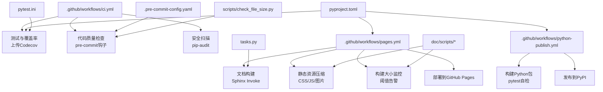
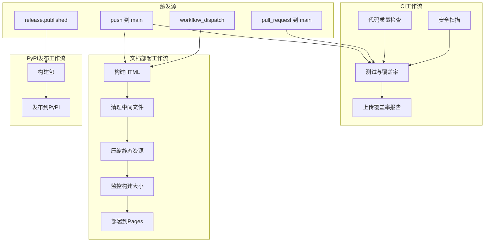
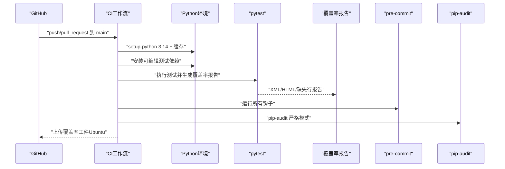
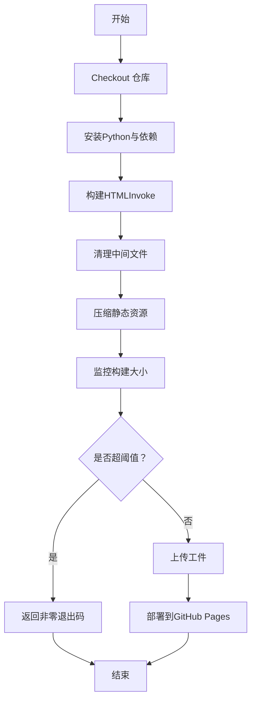
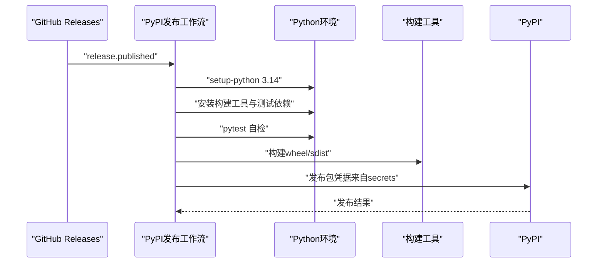
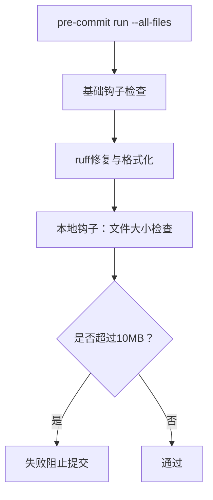
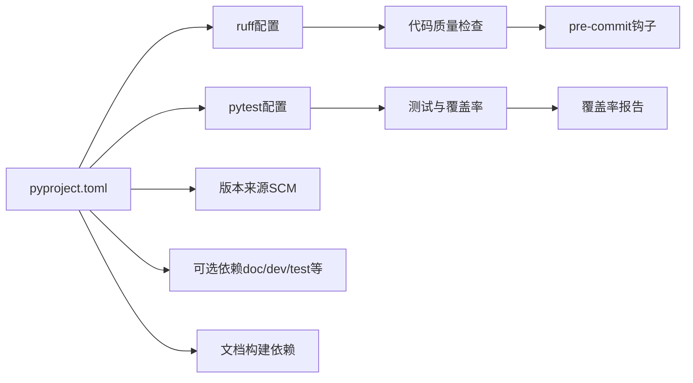

# CI/CD流水线

<cite>
**本文引用的文件**
- [ci.yml](file://.github/workflows/ci.yml)
- [pages.yml](file://.github/workflows/pages.yml)
- [python-publish.yml](file://.github/workflows/python-publish.yml)
- [pyproject.toml](file://pyproject.toml)
- [pytest.ini](file://pytest.ini)
- [.pre-commit-config.yaml](file://.pre-commit-config.yaml)
- [tasks.py](file://tasks.py)
- [check_file_size.py](file://scripts/check_file_size.py)
- [compress_static.py](file://doc/scripts/compress_static.py)
- [monitor_build_size.py](file://doc/scripts/monitor_build_size.py)
- [README.md](file://README.md)
</cite>

## 目录
1. [简介](#简介)
2. [项目结构](#项目结构)
3. [核心组件](#核心组件)
4. [架构总览](#架构总览)
5. [详细组件分析](#详细组件分析)
6. [依赖关系分析](#依赖关系分析)
7. [性能考量](#性能考量)
8. [故障排查指南](#故障排查指南)
9. [结论](#结论)
10. [附录](#附录)

## 简介
本文件面向FlexLoop项目的CI/CD流水线，系统化梳理GitHub Actions工作流配置、构建触发条件与分支策略；覆盖自动化测试、代码质量检查与安全扫描的完整流程；解释文档构建、压缩与部署到Pages的实现；并提供发布到PyPI的自动化流程。由于当前仓库未包含容器镜像构建与多环境部署配置，本文在相应章节提供概念性指导与最佳实践建议，便于后续扩展。

## 项目结构
本项目采用分层组织方式：
- 工作流定义位于 .github/workflows/，包含CI、文档部署与Python包发布三条流水线
- 项目元数据与依赖在 pyproject.toml 中集中管理，pytest.ini 提供测试框架配置
- 文档构建与优化脚本位于 doc/scripts/，预提交钩子配置在 .pre-commit-config.yaml
- 开发任务入口在 tasks.py，用于调用文档构建任务

图表来源
- [ci.yml:1-105](file://.github/workflows/ci.yml#L1-L105)
- [pages.yml:1-106](file://.github/workflows/pages.yml#L1-L106)
- [python-publish.yml:1-42](file://.github/workflows/python-publish.yml#L1-L42)
- [pyproject.toml:1-318](file://pyproject.toml#L1-L318)
- [pytest.ini:1-10](file://pytest.ini#L1-L10)
- [.pre-commit-config.yaml:1-29](file://.pre-commit-config.yaml#L1-L29)
- [tasks.py:1-4](file://tasks.py#L1-L4)
- [compress_static.py:1-191](file://doc/scripts/compress_static.py#L1-L191)
- [monitor_build_size.py:1-153](file://doc/scripts/monitor_build_size.py#L1-L153)
- [check_file_size.py:1-27](file://scripts/check_file_size.py#L1-L27)

章节来源
- [ci.yml:1-105](file://.github/workflows/ci.yml#L1-L105)
- [pages.yml:1-106](file://.github/workflows/pages.yml#L1-L106)
- [python-publish.yml:1-42](file://.github/workflows/python-publish.yml#L1-L42)
- [pyproject.toml:1-318](file://pyproject.toml#L1-L318)
- [pytest.ini:1-10](file://pytest.ini#L1-L10)
- [.pre-commit-config.yaml:1-29](file://.pre-commit-config.yaml#L1-L29)
- [tasks.py:1-4](file://tasks.py#L1-L4)
- [compress_static.py:1-191](file://doc/scripts/compress_static.py#L1-L191)
- [monitor_build_size.py:1-153](file://doc/scripts/monitor_build_size.py#L1-L153)
- [check_file_size.py:1-27](file://scripts/check_file_size.py#L1-L27)

## 核心组件
- 测试与覆盖率
  - 并行矩阵：Ubuntu与Windows双平台，Python 3.14
  - 使用pytest执行测试，覆盖率报告生成XML、终端缺失行与HTML目录
  - 覆盖率阈值80%，失败时输出提示信息
  - Ubuntu平台上传Coverage XML至Codecov，Windows平台跳过
  - 上传覆盖率HTML报告作为工件，保留14天

- 代码质量检查
  - 使用pre-commit安装与运行，覆盖尾随空白、文件结束符、YAML/ToML校验、大文件检测、格式化等
  - 本地自定义钩子检查文件大小（>10MB拒绝）

- 安全扫描
  - 安装pip-audit，执行严格模式依赖审计，发现高危漏洞即告警

- 文档构建与部署
  - 触发条件：推送到main分支或手动触发workflow_dispatch
  - 步骤：安装Python与依赖（含doc/dev），执行Invoke任务构建HTML
  - 清理中间文件、压缩静态资源（CSS/JS/图片）、监控构建大小并记录指标
  - 上传页面工件并部署到GitHub Pages

- 发布到PyPI
  - 触发条件：当创建Release并发布后触发
  - 步骤：安装构建工具，安装测试依赖，运行pytest自检，构建wheel/sdist，使用PyPI官方Action发布

章节来源
- [ci.yml:16-105](file://.github/workflows/ci.yml#L16-L105)
- [pages.yml:4-106](file://.github/workflows/pages.yml#L4-L106)
- [python-publish.yml:10-42](file://.github/workflows/python-publish.yml#L10-L42)
- [pyproject.toml:20-57](file://pyproject.toml#L20-L57)
- [pytest.ini:1-10](file://pytest.ini#L1-L10)
- [.pre-commit-config.yaml:1-29](file://.pre-commit-config.yaml#L1-L29)
- [tasks.py:1-4](file://tasks.py#L1-L4)
- [compress_static.py:1-191](file://doc/scripts/compress_static.py#L1-L191)
- [monitor_build_size.py:1-153](file://doc/scripts/monitor_build_size.py#L1-L153)
- [check_file_size.py:1-27](file://scripts/check_file_size.py#L1-L27)

## 架构总览
下图展示三条工作流的触发、步骤与产物流转：

图表来源
- [ci.yml:3-14](file://.github/workflows/ci.yml#L3-L14)
- [pages.yml:4-27](file://.github/workflows/pages.yml#L4-L27)
- [python-publish.yml:10-12](file://.github/workflows/python-publish.yml#L10-L12)
- [compress_static.py:89-187](file://doc/scripts/compress_static.py#L89-L187)
- [monitor_build_size.py:80-149](file://doc/scripts/monitor_build_size.py#L80-L149)

## 详细组件分析

### CI工作流（测试、质量、安全）
- 触发条件
  - 推送main分支
  - 对main分支发起Pull Request
- 并发控制
  - 同一流程同引用组内互斥，支持取消进行中的作业
- 测试阶段
  - 双平台矩阵：ubuntu-latest与windows-latest
  - Python版本固定为3.14，启用pip缓存
  - 安装可编辑测试依赖，执行pytest并生成覆盖率报告
  - 覆盖率阈值80%，失败时输出提示
  - Ubuntu平台上传coverage.xml到Codecov，Windows平台跳过
  - 无论成功与否均上传htmlcov目录为工件
- 质量检查阶段
  - 安装pre-commit，运行所有钩子（含本地自定义文件大小检查）
- 安全扫描阶段
  - 安装pip-audit，执行严格模式依赖审计

图表来源
- [ci.yml:16-105](file://.github/workflows/ci.yml#L16-L105)
- [pyproject.toml:20-57](file://pyproject.toml#L20-L57)

章节来源
- [ci.yml:3-14](file://.github/workflows/ci.yml#L3-L14)
- [ci.yml:16-105](file://.github/workflows/ci.yml#L16-L105)
- [pyproject.toml:20-57](file://pyproject.toml#L20-L57)

### 文档部署工作流（Pages）
- 触发条件
  - 推送main分支
  - 支持手动workflow_dispatch，可选输入控制某些行为
- 关键步骤
  - 安装Python与依赖（含doc、dev），安装Graphviz
  - 执行Invoke任务构建HTML
  - 清理中间文件（environment.pickle、.doctree、.pyc、空目录）
  - 压缩静态资源（CSS/JS/图片），替换构建目录
  - 监控构建大小，记录基线与阈值，超阈值则返回非零退出码
  - 上传工件并部署到GitHub Pages

图表来源
- [pages.yml:4-106](file://.github/workflows/pages.yml#L4-L106)
- [tasks.py:1-4](file://tasks.py#L1-L4)
- [compress_static.py:89-187](file://doc/scripts/compress_static.py#L89-L187)
- [monitor_build_size.py:80-149](file://doc/scripts/monitor_build_size.py#L80-L149)

章节来源
- [pages.yml:4-106](file://.github/workflows/pages.yml#L4-L106)
- [tasks.py:1-4](file://tasks.py#L1-L4)
- [compress_static.py:1-191](file://doc/scripts/compress_static.py#L1-L191)
- [monitor_build_size.py:1-153](file://doc/scripts/monitor_build_size.py#L1-L153)

### PyPI发布工作流
- 触发条件
  - Release事件发布后触发
- 关键步骤
  - 安装构建工具与测试依赖
  - 运行pytest自检
  - 使用build构建包
  - 使用PyPI官方Action发布，凭据来自仓库密钥

图表来源
- [python-publish.yml:10-42](file://.github/workflows/python-publish.yml#L10-L42)

章节来源
- [python-publish.yml:10-42](file://.github/workflows/python-publish.yml#L10-L42)

### 预提交与文件大小检查
- 预提交钩子
  - 基础钩子：尾随空白、文件结束符、YAML/ToML校验、大文件检测、合并冲突、调试语句
  - 格式化：ruff修复与格式化
  - 本地钩子：检查图片/压缩包等大文件（>10MB）
- 文件大小检查脚本
  - 遍历传入文件，统计大小，超过阈值则失败

图表来源
- [.pre-commit-config.yaml:1-29](file://.pre-commit-config.yaml#L1-L29)
- [check_file_size.py:7-22](file://scripts/check_file_size.py#L7-L22)

章节来源
- [.pre-commit-config.yaml:1-29](file://.pre-commit-config.yaml#L1-L29)
- [check_file_size.py:1-27](file://scripts/check_file_size.py#L1-L27)

## 依赖关系分析
- 语言与工具链
  - Python 3.14（项目要求与工作流统一）
  - PDM作为构建后端，动态版本由SCM提供
  - Sphinx + Invoke用于文档构建
- 测试与覆盖率
  - pytest + pytest-cov，覆盖率阈值80%，忽略特定模块
- 代码质量
  - ruff（lint+format），pre-commit集中管理
- 安全
  - pip-audit用于依赖漏洞扫描
- 文档构建
  - Graphviz、压缩工具（cssnano、terser、imagemin-cli）
  - 构建指标持久化与阈值告警

图表来源
- [pyproject.toml:237-318](file://pyproject.toml#L237-L318)
- [pytest.ini:1-10](file://pytest.ini#L1-L10)
- [.pre-commit-config.yaml:1-29](file://.pre-commit-config.yaml#L1-L29)

章节来源
- [pyproject.toml:1-318](file://pyproject.toml#L1-L318)
- [pytest.ini:1-10](file://pytest.ini#L1-L10)
- [.pre-commit-config.yaml:1-29](file://.pre-commit-config.yaml#L1-L29)

## 性能考量
- 并行与缓存
  - CI测试阶段使用矩阵并行于不同操作系统，提升吞吐
  - pip缓存基于依赖清单，减少重复安装时间
- 文档构建优化
  - 清理中间文件降低工件体积
  - 静态资源压缩显著减小页面传输体积
  - 构建大小监控避免无序膨胀
- 发布前置自检
  - 发布前运行pytest，提前暴露问题，减少失败重试成本

## 故障排查指南
- 测试覆盖率未达标
  - 现象：覆盖率低于80%，作业失败
  - 排查：查看覆盖率HTML报告工件，定位缺失测试的模块与行
  - 参考：覆盖率阈值与报告生成配置
- Codecov上传失败
  - 现象：Ubuntu平台上传失败但不阻塞整体
  - 排查：检查Codecov Action权限与仓库令牌配置
- 文档构建失败
  - 现象：监控脚本返回非零，部署中断
  - 排查：检查构建目录是否存在、阈值设置是否合理、压缩工具是否可用
- 发布失败
  - 现象：PyPI发布Action失败
  - 排查：确认Release已发布、凭据secrets正确、网络可达

章节来源
- [ci.yml:42-65](file://.github/workflows/ci.yml#L42-L65)
- [pages.yml:94-104](file://.github/workflows/pages.yml#L94-L104)
- [python-publish.yml:37-42](file://.github/workflows/python-publish.yml#L37-L42)

## 结论
本CI/CD体系以GitHub Actions为核心，实现了跨平台测试、代码质量与安全扫描、文档构建与部署、以及PyPI发布的自动化闭环。通过严格的覆盖率阈值、预提交钩子与依赖审计，保障了代码质量与安全性；通过静态资源压缩与构建大小监控，提升了文档交付效率与稳定性。对于容器镜像构建、多环境部署与蓝绿/金丝雀发布，可在现有工作流基础上扩展，遵循“声明式配置、最小权限、可观测性”的原则推进。

## 附录
- 分支与触发策略
  - CI：push/main、pull_request/main
  - Pages：push/main、workflow_dispatch
  - PyPI：release.published
- 最佳实践建议（概念性）
  - 容器镜像构建：在CI中新增job，使用Docker Build/Scan/Push，结合版本标签（主干使用latest，Tag使用语义化版本）
  - 多环境部署：为dev/staging/prod分别配置工作流，引入审批门禁与健康检查
  - 蓝绿/金丝雀：结合平台原生部署能力，先部署新版本流量切片，持续监控指标后全量切换
  - 回滚机制：记录部署版本与镜像标签，提供一键回滚脚本与审批流程
  - 变更管理：强制PR描述与变更日志，结合发布说明与通知渠道
  - 监控与日志：集成测试报告、覆盖率、构建大小趋势与部署成功率，建立告警与根因分析流程