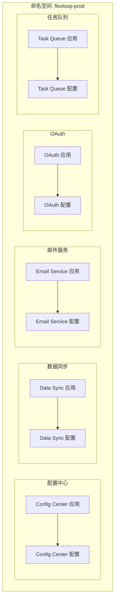
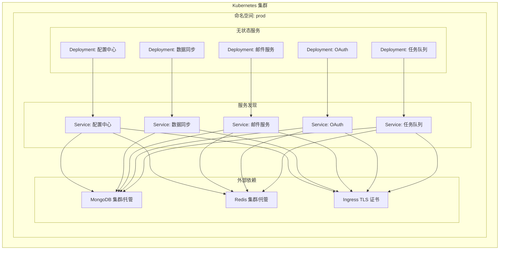
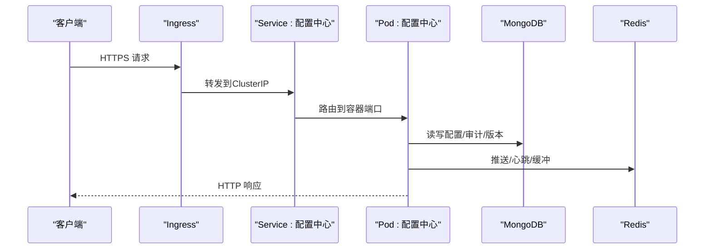
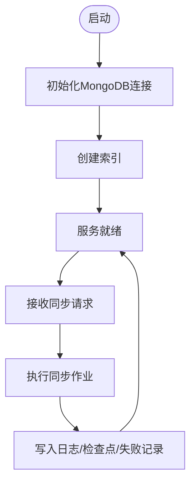
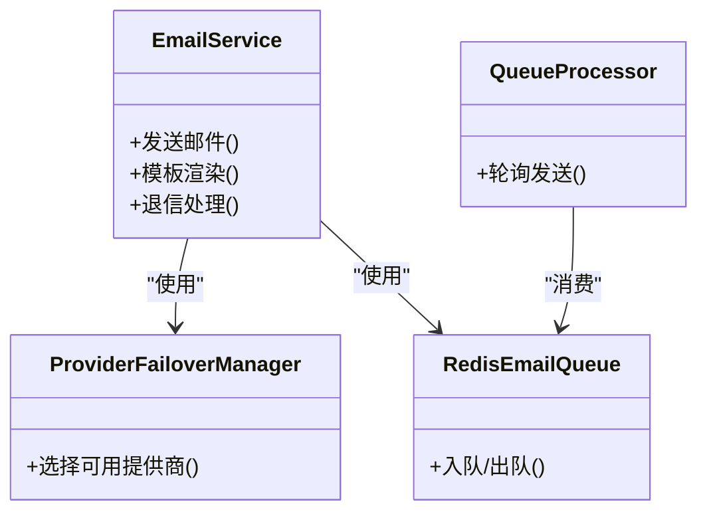
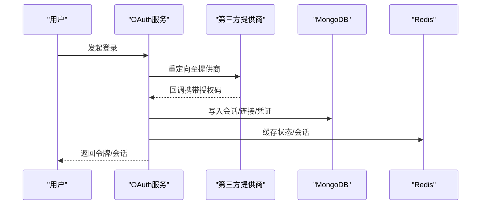
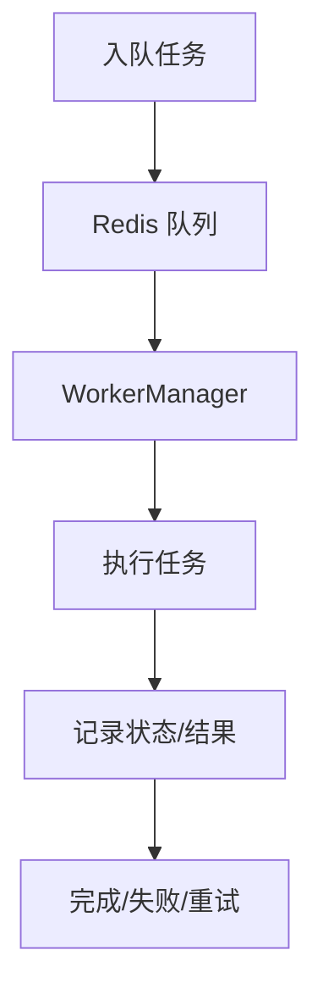
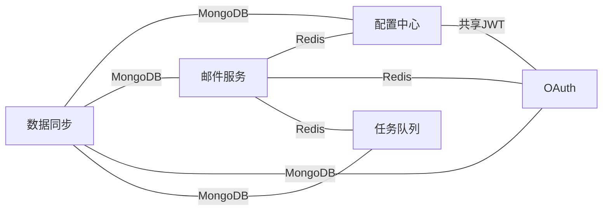

# Kubernetes部署

<cite>
**本文引用的文件**
- [README.md](file://README.md)
- [pyproject.toml](file://pyproject.toml)
- [src/taolib/testing/config_center/server/app.py](file://src/taolib/testing/config_center/server/app.py)
- [src/taolib/testing/config_center/server/config.py](file://src/taolib/testing/config_center/server/config.py)
- [src/taolib/testing/data_sync/server/app.py](file://src/taolib/testing/data_sync/server/app.py)
- [src/taolib/testing/data_sync/server/config.py](file://src/taolib/testing/data_sync/server/config.py)
- [src/taolib/testing/email_service/server/app.py](file://src/taolib/testing/email_service/server/app.py)
- [src/taolib/testing/email_service/server/config.py](file://src/taolib/testing/email_service/server/config.py)
- [src/taolib/testing/oauth/server/app.py](file://src/taolib/testing/oauth/server/app.py)
- [src/taolib/testing/oauth/server/config.py](file://src/taolib/testing/oauth/server/config.py)
- [src/taolib/testing/task_queue/server/app.py](file://src/taolib/testing/task_queue/server/app.py)
- [src/taolib/testing/task_queue/server/config.py](file://src/taolib/testing/task_queue/server/config.py)
</cite>

## 目录
1. [简介](#简介)
2. [项目结构](#项目结构)
3. [核心组件](#核心组件)
4. [架构总览](#架构总览)
5. [详细组件分析](#详细组件分析)
6. [依赖关系分析](#依赖关系分析)
7. [性能考虑](#性能考虑)
8. [故障排查指南](#故障排查指南)
9. [结论](#结论)
10. [附录](#附录)

## 简介
本文件面向FlexLoop项目在Kubernetes集群中的部署与运维，基于项目中现有的服务模块与配置体系，提供从集群架构、节点与网络策略，到核心资源（Deployment、Service、ConfigMap、Secret）的配置清单路径，再到HPA、资源配额、命名空间隔离、Ingress与TLS、持久化存储、备份恢复、监控告警与性能调优的完整方案。目标是帮助读者快速、安全、稳定地将FlexLoop服务迁移到K8s。

## 项目结构
FlexLoop项目采用多服务模块化设计，每个子系统均提供独立的FastAPI应用工厂与配置模块，便于容器化与K8s编排。主要服务包括：
- 配置中心服务（Config Center）
- 数据同步服务（Data Sync）
- 邮件服务（Email Service）
- OAuth服务（OAuth）
- 任务队列服务（Task Queue）

这些服务均通过环境变量驱动配置，并依赖MongoDB与Redis作为数据与缓存后端。

**章节来源**
- [README.md: 1-100:1-100](file://README.md#L1-L100)
- [pyproject.toml: 1-318:1-318](file://pyproject.toml#L1-L318)

## 核心组件
- 配置中心服务（Config Center）
  - 依赖：MongoDB、Redis
  - 特性：配置管理、版本控制、审计日志、WebSocket实时推送
  - 关键配置键前缀：CONFIG_CENTER_
- 数据同步服务（Data Sync）
  - 依赖：MongoDB
  - 特性：作业调度、日志、失败记录、TTL清理
  - 关键配置键前缀：DATA_SYNC_
- 邮件服务（Email Service）
  - 依赖：MongoDB、Redis
  - 特性：多提供商（SendGrid、Mailgun、SES、SMTP）、退信处理、模板引擎
  - 关键配置键前缀：EMAIL_SERVICE_
- OAuth服务（OAuth）
  - 依赖：MongoDB、Redis
  - 特性：第三方登录、会话与凭证管理、加密存储
  - 关键配置键前缀：OAUTH_
- 任务队列服务（Task Queue）
  - 依赖：MongoDB、Redis
  - 特性：任务注册、队列、工作者管理、仪表板
  - 关键配置键前缀：TASK_QUEUE_

**章节来源**
- [src/taolib/testing/config_center/server/app.py: 1-152:1-152](file://src/taolib/testing/config_center/server/app.py#L1-L152)
- [src/taolib/testing/config_center/server/config.py: 1-72:1-72](file://src/taolib/testing/config_center/server/config.py#L1-L72)
- [src/taolib/testing/data_sync/server/app.py: 1-372:1-372](file://src/taolib/testing/data_sync/server/app.py#L1-L372)
- [src/taolib/testing/data_sync/server/config.py: 1-43:1-43](file://src/taolib/testing/data_sync/server/config.py#L1-L43)
- [src/taolib/testing/email_service/server/app.py: 1-285:1-285](file://src/taolib/testing/email_service/server/app.py#L1-L285)
- [src/taolib/testing/email_service/server/config.py: 1-63:1-63](file://src/taolib/testing/email_service/server/config.py#L1-L63)
- [src/taolib/testing/oauth/server/app.py: 1-140:1-140](file://src/taolib/testing/oauth/server/app.py#L1-L140)
- [src/taolib/testing/oauth/server/config.py: 1-80:1-80](file://src/taolib/testing/oauth/server/config.py#L1-L80)
- [src/taolib/testing/task_queue/server/app.py: 1-394:1-394](file://src/taolib/testing/task_queue/server/app.py#L1-L394)
- [src/taolib/testing/task_queue/server/config.py: 1-48:1-48](file://src/taolib/testing/task_queue/server/config.py#L1-L48)

## 架构总览
FlexLoop在K8s中的推荐架构如下：
- 命名空间隔离：为不同环境（开发、测试、生产）划分命名空间，确保资源与权限隔离
- 无状态服务：各服务以Deployment运行，前端通过Ingress暴露
- 状态服务：MongoDB与Redis以StatefulSet或托管服务形式提供
- 网络策略：最小权限原则，仅开放必要的端口与服务间访问
- 存储：持久卷（PV/PVC）用于数据库与日志；对象存储用于附件（可选）
- 安全：Secret集中管理敏感配置；Ingress TLS终止；RBAC与网络策略强化安全

**图表来源**
- [src/taolib/testing/config_center/server/app.py: 128-152:128-152](file://src/taolib/testing/config_center/server/app.py#L128-L152)
- [src/taolib/testing/data_sync/server/app.py: 57-84:57-84](file://src/taolib/testing/data_sync/server/app.py#L57-L84)
- [src/taolib/testing/email_service/server/app.py: 180-204:180-204](file://src/taolib/testing/email_service/server/app.py#L180-L204)
- [src/taolib/testing/oauth/server/app.py: 116-137:116-137](file://src/taolib/testing/oauth/server/app.py#L116-L137)
- [src/taolib/testing/task_queue/server/app.py: 70-97:70-97](file://src/taolib/testing/task_queue/server/app.py#L70-L97)

## 详细组件分析

### 配置中心服务（Config Center）
- 作用：集中化配置管理、版本控制、审计日志、WebSocket实时推送
- 依赖：MongoDB、Redis
- 关键配置键前缀：CONFIG_CENTER_
- K8s部署要点：
  - Deployment副本数与探针健康检查
  - Service ClusterIP/NodePort/LoadBalancer选择
  - ConfigMap注入通用配置，Secret注入JWT密钥
  - HPA基于CPU/内存或自定义指标扩展
  - Ingress暴露REST API与WebSocket端点

**图表来源**
- [src/taolib/testing/config_center/server/app.py: 27-105:27-105](file://src/taolib/testing/config_center/server/app.py#L27-L105)
- [src/taolib/testing/config_center/server/config.py: 12-72:12-72](file://src/taolib/testing/config_center/server/config.py#L12-L72)

**章节来源**
- [src/taolib/testing/config_center/server/app.py: 1-152:1-152](file://src/taolib/testing/config_center/server/app.py#L1-L152)
- [src/taolib/testing/config_center/server/config.py: 1-72:1-72](file://src/taolib/testing/config_center/server/config.py#L1-L72)

### 数据同步服务（Data Sync）
- 作用：MongoDB数据同步作业管理、日志与失败记录
- 依赖：MongoDB
- 关键配置键前缀：DATA_SYNC_
- K8s部署要点：
  - 仪表板页面通过静态路由提供
  - 建议限制并发与批大小，避免对数据库造成压力
  - 使用资源限制防止长作业占用过多资源

**图表来源**
- [src/taolib/testing/data_sync/server/app.py: 21-54:21-54](file://src/taolib/testing/data_sync/server/app.py#L21-L54)

**章节来源**
- [src/taolib/testing/data_sync/server/app.py: 1-372:1-372](file://src/taolib/testing/data_sync/server/app.py#L1-L372)
- [src/taolib/testing/data_sync/server/config.py: 1-43:1-43](file://src/taolib/testing/data_sync/server/config.py#L1-L43)

### 邮件服务（Email Service）
- 作用：多提供商邮件发送、退信处理、模板与跟踪
- 依赖：MongoDB、Redis
- 关键配置键前缀：EMAIL_SERVICE_
- K8s部署要点：
  - 多提供商配置（SendGrid、Mailgun、SES、SMTP）通过Secret注入
  - 队列处理器异步发送，避免阻塞请求
  - 仪表板展示提供商健康与队列状态

**图表来源**
- [src/taolib/testing/email_service/server/app.py: 34-178:34-178](file://src/taolib/testing/email_service/server/app.py#L34-L178)

**章节来源**
- [src/taolib/testing/email_service/server/app.py: 1-285:1-285](file://src/taolib/testing/email_service/server/app.py#L1-L285)
- [src/taolib/testing/email_service/server/config.py: 1-63:1-63](file://src/taolib/testing/email_service/server/config.py#L1-L63)

### OAuth服务（OAuth）
- 作用：第三方登录、会话与凭证管理、加密存储
- 依赖：MongoDB、Redis
- 关键配置键前缀：OAUTH_
- K8s部署要点：
  - 与配置中心共享JWT密钥，确保单点登录一致性
  - 引导Google/GitHub凭证，自动创建加密存储
  - CORS与回调URI需与Ingress域名一致

**图表来源**
- [src/taolib/testing/oauth/server/app.py: 22-66:22-66](file://src/taolib/testing/oauth/server/app.py#L22-L66)

**章节来源**
- [src/taolib/testing/oauth/server/app.py: 1-140:1-140](file://src/taolib/testing/oauth/server/app.py#L1-L140)
- [src/taolib/testing/oauth/server/config.py: 1-80:1-80](file://src/taolib/testing/oauth/server/config.py#L1-L80)

### 任务队列服务（Task Queue）
- 作用：后台任务队列、工作者管理、仪表板
- 依赖：MongoDB、Redis
- 关键配置键前缀：TASK_QUEUE_
- K8s部署要点：
  - 工作者数量可调，结合HPA实现弹性
  - 仪表板提供队列深度与任务状态可视化

**图表来源**
- [src/taolib/testing/task_queue/server/app.py: 19-67:19-67](file://src/taolib/testing/task_queue/server/app.py#L19-L67)

**章节来源**
- [src/taolib/testing/task_queue/server/app.py: 1-394:1-394](file://src/taolib/testing/task_queue/server/app.py#L1-L394)
- [src/taolib/testing/task_queue/server/config.py: 1-48:1-48](file://src/taolib/testing/task_queue/server/config.py#L1-L48)

## 依赖关系分析
- 服务间依赖
  - 配置中心与OAuth共享JWT密钥，确保统一鉴权
  - 邮件服务、OAuth、任务队列依赖Redis进行会话与消息
  - 所有服务依赖MongoDB进行持久化
- 外部依赖
  - Ingress控制器负责入口流量与TLS终止
  - 对象存储（可选）用于附件与静态资源

**图表来源**
- [src/taolib/testing/config_center/server/config.py: 26-34:26-34](file://src/taolib/testing/config_center/server/config.py#L26-L34)
- [src/taolib/testing/oauth/server/config.py: 31-39:31-39](file://src/taolib/testing/oauth/server/config.py#L31-L39)
- [src/taolib/testing/email_service/server/config.py: 17-22:17-22](file://src/taolib/testing/email_service/server/config.py#L17-L22)
- [src/taolib/testing/task_queue/server/config.py: 20-30:20-30](file://src/taolib/testing/task_queue/server/config.py#L20-L30)
- [src/taolib/testing/data_sync/server/config.py: 20-24:20-24](file://src/taolib/testing/data_sync/server/config.py#L20-L24)

**章节来源**
- [src/taolib/testing/config_center/server/config.py: 1-72:1-72](file://src/taolib/testing/config_center/server/config.py#L1-L72)
- [src/taolib/testing/oauth/server/config.py: 1-80:1-80](file://src/taolib/testing/oauth/server/config.py#L1-L80)
- [src/taolib/testing/email_service/server/config.py: 1-63:1-63](file://src/taolib/testing/email_service/server/config.py#L1-L63)
- [src/taolib/testing/task_queue/server/config.py: 1-48:1-48](file://src/taolib/testing/task_queue/server/config.py#L1-L48)
- [src/taolib/testing/data_sync/server/config.py: 1-43:1-43](file://src/taolib/testing/data_sync/server/config.py#L1-L43)

## 性能考虑
- 资源配额与限制
  - 为各Deployment设置requests/limits，避免资源争抢
  - 为数据库与缓存服务单独预留资源池
- 水平Pod自动伸缩（HPA）
  - 基于CPU/内存利用率或自定义指标（如队列长度、请求延迟）配置HPA
  - 为高并发服务（邮件、任务队列）启用HPA
- 连接池与超时
  - 合理设置MongoDB与Redis连接池大小与超时
  - 为长任务设置合理的超时与重试策略
- 网络与存储
  - 将数据库与缓存置于高性能网络与SSD存储
  - 使用亲和性与反亲和性减少跨节点通信

[本节为通用指导，无需“章节来源”]

## 故障排查指南
- 健康检查与日志
  - 通过liveness/readiness探针定位Pod重启原因
  - 采集各服务容器标准输出日志，结合K8s事件定位问题
- 配置与密钥
  - 确认ConfigMap/Secret正确挂载，键前缀与服务期望一致
  - 特别关注JWT密钥长度与格式（≥32字符）
- 依赖连通性
  - 使用NetworkPolicy放行必需端口
  - 通过Service DNS与ClusterIP验证内部连通
- 数据库与缓存
  - 检查MongoDB/Redis连接字符串与认证信息
  - 观察慢查询与队列堆积情况

**章节来源**
- [src/taolib/testing/config_center/server/config.py: 53-58:53-58](file://src/taolib/testing/config_center/server/config.py#L53-L58)
- [src/taolib/testing/oauth/server/config.py: 68-73:68-73](file://src/taolib/testing/oauth/server/config.py#L68-L73)

## 结论
通过将FlexLoop的多服务模块映射到K8s的Deployment、Service、ConfigMap、Secret与Ingress等原生资源，并结合HPA、资源配额、命名空间隔离与网络策略，可以实现高可用、可观测、可扩展的生产级部署。建议先在预生产环境验证配置与流程，再逐步迁移至生产。

[本节为总结，无需“章节来源”]

## 附录

### A. 核心资源清单（清单路径）
- 配置中心
  - Deployment：[src/taolib/testing/config_center/server/app.py: 128-152:128-152](file://src/taolib/testing/config_center/server/app.py#L128-L152)
  - Service：[src/taolib/testing/config_center/server/app.py: 128-152:128-152](file://src/taolib/testing/config_center/server/app.py#L128-L152)
  - ConfigMap：[src/taolib/testing/config_center/server/config.py: 60-65:60-65](file://src/taolib/testing/config_center/server/config.py#L60-L65)
  - Secret：[src/taolib/testing/config_center/server/config.py: 26-34:26-34](file://src/taolib/testing/config_center/server/config.py#L26-L34)
- 数据同步
  - Deployment：[src/taolib/testing/data_sync/server/app.py: 57-84:57-84](file://src/taolib/testing/data_sync/server/app.py#L57-L84)
  - Service：[src/taolib/testing/data_sync/server/app.py: 57-84:57-84](file://src/taolib/testing/data_sync/server/app.py#L57-L84)
  - ConfigMap：[src/taolib/testing/data_sync/server/config.py: 13-18:13-18](file://src/taolib/testing/data_sync/server/config.py#L13-L18)
  - Secret：[src/taolib/testing/data_sync/server/config.py: 26-28:26-28](file://src/taolib/testing/data_sync/server/config.py#L26-L28)
- 邮件服务
  - Deployment：[src/taolib/testing/email_service/server/app.py: 180-204:180-204](file://src/taolib/testing/email_service/server/app.py#L180-L204)
  - Service：[src/taolib/testing/email_service/server/app.py: 180-204:180-204](file://src/taolib/testing/email_service/server/app.py#L180-L204)
  - ConfigMap：[src/taolib/testing/email_service/server/config.py: 13-15:13-15](file://src/taolib/testing/email_service/server/config.py#L13-L15)
  - Secret：[src/taolib/testing/email_service/server/config.py: 35-57:35-57](file://src/taolib/testing/email_service/server/config.py#L35-L57)
- OAuth
  - Deployment：[src/taolib/testing/oauth/server/app.py: 116-137:116-137](file://src/taolib/testing/oauth/server/app.py#L116-L137)
  - Service：[src/taolib/testing/oauth/server/app.py: 116-137:116-137](file://src/taolib/testing/oauth/server/app.py#L116-L137)
  - ConfigMap：[src/taolib/testing/oauth/server/config.py: 13-18:13-18](file://src/taolib/testing/oauth/server/config.py#L13-L18)
  - Secret：[src/taolib/testing/oauth/server/config.py: 42-44:42-44](file://src/taolib/testing/oauth/server/config.py#L42-L44)
- 任务队列
  - Deployment：[src/taolib/testing/task_queue/server/app.py: 70-97:70-97](file://src/taolib/testing/task_queue/server/app.py#L70-L97)
  - Service：[src/taolib/testing/task_queue/server/app.py: 70-97:70-97](file://src/taolib/testing/task_queue/server/app.py#L70-L97)
  - ConfigMap：[src/taolib/testing/task_queue/server/config.py: 13-18:13-18](file://src/taolib/testing/task_queue/server/config.py#L13-L18)
  - Secret：[src/taolib/testing/task_queue/server/config.py: 26-30:26-30](file://src/taolib/testing/task_queue/server/config.py#L26-L30)

### B. 水平Pod自动伸缩（HPA）建议
- 基于CPU/内存利用率的HPA
  - 设置minReplicas/maxReplicas与目标利用率
- 基于自定义指标的HPA
  - 如队列长度、请求延迟、错误率
- 注意事项
  - 为高并发服务开启HPA
  - 避免过度扩缩导致抖动

[本节为通用指导，无需“章节来源”]

### C. 资源配额与命名空间隔离
- 命名空间
  - 为开发、测试、生产分别创建命名空间
- ResourceQuota
  - 限定命名空间内CPU/内存与Pod数量
- LimitRange
  - 为容器设置默认requests/limits

[本节为通用指导，无需“章节来源”]

### D. Ingress控制器、TLS与域名路由
- Ingress控制器
  - 选择Nginx/Contour/Traefik等
- TLS证书
  - 使用Cert-Manager自动签发与续期
  - 将证书Secret挂载到Ingress
- 路由规则
  - 将不同服务映射到不同路径或子域名
  - 为WebSocket端点配置支持

[本节为通用指导，无需“章节来源”]

### E. 持久化存储、备份与灾难恢复
- 持久化存储
  - MongoDB/Redis使用StatefulSet或托管服务
  - 为日志与附件配置持久卷
- 备份
  - MongoDB：定期逻辑备份或快照
  - Redis：RDB/AOF持久化策略
- 灾难恢复
  - 多可用区部署
  - 定期演练恢复流程

[本节为通用指导，无需“章节来源”]

### F. 监控告警与日志收集
- 监控
  - Prometheus + Grafana采集指标
  - 自定义指标（队列深度、任务耗时）
- 日志
  - 使用Fluent Bit/Vector收集容器日志
  - 结合ELK/EFK进行检索与可视化
- 告警
  - 基于Prometheus Alertmanager
  - 关键阈值：错误率、延迟、队列堆积、资源使用

[本节为通用指导，无需“章节来源”]