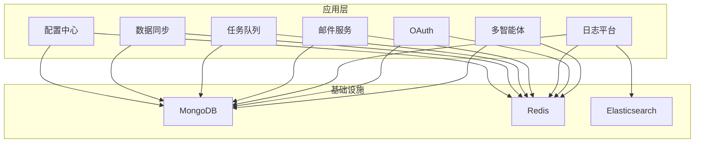
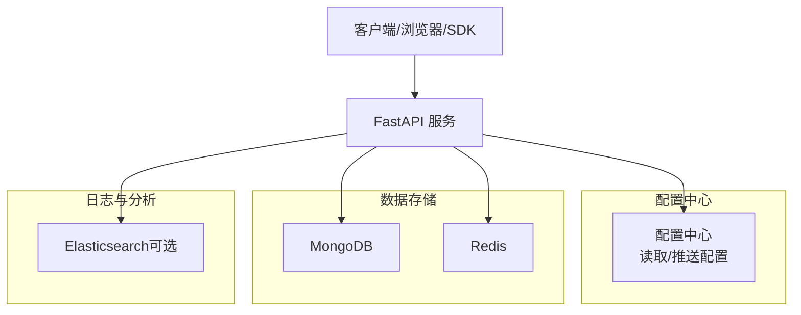
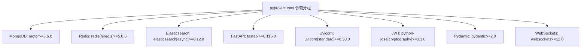

# 基础设施准备

<cite>
**本文引用的文件**
- [README.md](file://README.md)
- [pyproject.toml](file://pyproject.toml)
- [dev-environment.yml](file://tests/testing/dev-environment.yml)
- [config.py（配置中心）](file://src/taolib/testing/config_center/server/config.py)
- [config.py（数据同步）](file://src/taolib/testing/data_sync/server/config.py)
- [config.py（任务队列）](file://src/taolib/testing/task_queue/server/config.py)
- [config.py（邮件服务）](file://src/taolib/testing/email_service/server/config.py)
</cite>

## 目录
1. [简介](#简介)
2. [项目结构](#项目结构)
3. [核心组件](#核心组件)
4. [架构总览](#架构总览)
5. [详细组件分析](#详细组件分析)
6. [依赖分析](#依赖分析)
7. [性能考虑](#性能考虑)
8. [故障排查指南](#故障排查指南)
9. [结论](#结论)
10. [附录](#附录)

## 简介
本文件面向 FlexLoop 项目的基础设施准备，覆盖服务器硬件与操作系统要求、网络与防火墙配置、Python 3.14 运行时与虚拟环境、核心数据库（MongoDB、Redis、Elasticsearch）的安装与连接、Docker 环境与本地开发搭建、SSL 证书与域名解析、负载均衡器设置，以及性能基准测试、资源监控与容量规划的最佳实践。内容基于仓库中的项目元数据、依赖定义与各子系统配置文件进行整理与提炼。

## 项目结构
FlexLoop 采用 Python 包结构组织，核心能力以功能域划分（配置中心、数据同步、任务队列、邮件服务、日志平台、OAuth、多智能体等）。基础设施侧重点关注以下方面：
- Python 版本要求与可选依赖分组
- 各子系统对 MongoDB、Redis、Elasticsearch 的使用
- 开发环境与依赖安装方式
- 配置加载机制（pydantic-settings + 环境变量）

图示来源
- [pyproject.toml: 71-235 行:71-235](file://pyproject.toml#L71-L235)
- [config.py（配置中心）: 第15-24行:15-24](file://src/taolib/testing/config_center/server/config.py#L15-L24)
- [config.py（数据同步）: 第20-24行:20-24](file://src/taolib/testing/data_sync/server/config.py#L20-L24)
- [config.py（任务队列）: 第20-29行:20-29](file://src/taolib/testing/task_queue/server/config.py#L20-L29)
- [config.py（邮件服务）: 第17-22行:17-22](file://src/taolib/testing/email_service/server/config.py#L17-L22)

章节来源
- [README.md: 第47、54-66行:47-66](file://README.md#L47-L66)
- [pyproject.toml: 第14、20-235行:14-235](file://pyproject.toml#L14-L235)

## 核心组件
- Python 运行时与版本
  - 最低版本要求：Python >= 3.14
  - 支持以可编辑模式安装源码，便于本地开发与调试
  - 可选开发与文档依赖分组，满足不同角色的工具链需求
- 核心数据库
  - MongoDB：多子系统默认使用，提供配置项用于连接字符串与数据库名
  - Redis：多子系统默认使用，提供连接字符串与键空间前缀
  - Elasticsearch：日志平台模块使用，支持异步客户端
- 配置加载
  - 使用 pydantic-settings 从 .env 文件与环境变量加载配置，支持前缀区分
  - 部分组件对密钥长度与参数范围进行校验

章节来源
- [README.md: 第47、54-66行:47-66](file://README.md#L47-L66)
- [pyproject.toml: 第14、71-235行:14-235](file://pyproject.toml#L14-L235)
- [config.py（配置中心）: 第15-51行:15-51](file://src/taolib/testing/config_center/server/config.py#L15-L51)
- [config.py（数据同步）: 第20-36行:20-36](file://src/taolib/testing/data_sync/server/config.py#L20-L36)
- [config.py（任务队列）: 第20-41行:20-41](file://src/taolib/testing/task_queue/server/config.py#L20-L41)
- [config.py（邮件服务）: 第17-57行:17-57](file://src/taolib/testing/email_service/server/config.py#L17-L57)

## 架构总览
下图展示 FlexLoop 各子系统与基础设施之间的关系，以及典型请求流经 FastAPI 服务、配置中心、MongoDB、Redis 与可选的 Elasticsearch 的路径。

图示来源
- [pyproject.toml: 71-109 行:71-109](file://pyproject.toml#L71-L109)
- [config.py（配置中心）: 第15-24行:15-24](file://src/taolib/testing/config_center/server/config.py#L15-L24)
- [config.py（日志平台）: 第97-109 行:97-109](file://pyproject.toml#L97-L109)

## 详细组件分析

### Python 3.14 运行时与虚拟环境
- 版本要求
  - 项目明确要求 Python >= 3.14
- 安装方式
  - 可直接从 PyPI 安装发布包
  - 支持源码可编辑安装，便于本地开发与调试
  - 可按需安装开发与文档相关依赖分组
- 开发环境
  - 提供 conda 环境配置文件，声明 Python 与常用工具，并通过 pip 安装可选分组

章节来源
- [README.md: 第47、54-66行:47-66](file://README.md#L47-L66)
- [dev-environment.yml: 第1-15行:1-15](file://tests/testing/dev-environment.yml#L1-L15)

### MongoDB 安装与连接配置
- 默认连接字符串与数据库名
  - 配置中心：默认连接到本地 MongoDB，默认数据库名为 config_center
  - 数据同步：默认连接到本地 MongoDB，默认数据库名为 data_sync
  - 任务队列：默认连接到本地 MongoDB，默认数据库名为 task_queue
  - 邮件服务：默认连接到本地 MongoDB，默认数据库名为 email_service
- 生产建议
  - 使用独立数据库与用户权限，启用认证与加密传输
  - 配置副本集或分片集群以提升可用性与扩展性
  - 为高写入场景配置合适的索引与集合拆分策略

章节来源
- [config.py（配置中心）: 第15-19行:15-19](file://src/taolib/testing/config_center/server/config.py#L15-L19)
- [config.py（数据同步）: 第20-24行:20-24](file://src/taolib/testing/data_sync/server/config.py#L20-L24)
- [config.py（任务队列）: 第20-24行:20-24](file://src/taolib/testing/task_queue/server/config.py#L20-L24)
- [config.py（邮件服务）: 第17-19行:17-19](file://src/taolib/testing/email_service/server/config.py#L17-L19)

### Redis 安装与连接配置
- 默认连接字符串与键空间
  - 配置中心：默认连接到本地 Redis
  - 任务队列：默认连接到本地 Redis，并提供键前缀与工作进程数配置
  - 邮件服务：默认连接到本地 Redis
- 生产建议
  - 使用持久化策略（RDB/AOF）与主从复制
  - 为不同业务隔离数据库编号或键命名空间
  - 配置内存淘汰策略与慢查询日志

章节来源
- [config.py（配置中心）: 第21-24行:21-24](file://src/taolib/testing/config_center/server/config.py#L21-L24)
- [config.py（任务队列）: 第26-30行:26-30](file://src/taolib/testing/task_queue/server/config.py#L26-L30)
- [config.py（邮件服务）: 第21-22行:21-22](file://src/taolib/testing/email_service/server/config.py#L21-L22)

### Elasticsearch 安装与连接配置
- 使用场景
  - 日志平台模块使用 Elasticsearch 异步客户端
- 建议
  - 为日志索引配置生命周期策略（ILM）
  - 启用安全访问（用户认证与 TLS）
  - 规划分片与副本数量，平衡查询与写入性能

章节来源
- [pyproject.toml: 第97-109 行:97-109](file://pyproject.toml#L97-L109)

### 配置加载与环境变量
- 加载机制
  - 使用 pydantic-settings 从 .env 文件加载，支持前缀区分不同子系统
  - 部分组件对敏感参数进行校验（如 JWT 密钥长度）
- 常见前缀
  - CONFIG_CENTER_、DATA_SYNC_、TASK_QUEUE_、EMAIL_SERVICE_
- 建议
  - 将敏感配置置于受控环境（如密钥管理服务），避免硬编码
  - 对生产环境启用只读 .env 权限与最小暴露面

章节来源
- [config.py（配置中心）: 第60-65行:60-65](file://src/taolib/testing/config_center/server/config.py#L60-L65)
- [config.py（数据同步）: 第13-18行:13-18](file://src/taolib/testing/data_sync/server/config.py#L13-L18)
- [config.py（任务队列）: 第13-18行:13-18](file://src/taolib/testing/task_queue/server/config.py#L13-L18)
- [config.py（邮件服务）: 第13-15行:13-15](file://src/taolib/testing/email_service/server/config.py#L13-L15)

### Docker 环境准备与本地开发
- 本地开发
  - 使用 conda 环境文件声明 Python 与工具链，并通过 pip 安装可选分组
- 容器化建议
  - 为每个子系统构建独立镜像，复用官方基础镜像（如 python:3.14-slim）
  - 使用多阶段构建优化镜像体积
  - 将 .env 与密钥挂载为只读卷，避免硬编码
  - 通过 docker-compose 编排 MongoDB、Redis、Elasticsearch 与应用服务
- 健康检查
  - 为数据库与应用服务添加健康检查端点，确保编排一致性

章节来源
- [dev-environment.yml: 第1-15行:1-15](file://tests/testing/dev-environment.yml#L1-L15)
- [pyproject.toml: 第14、20-235行:14-235](file://pyproject.toml#L14-L235)

### SSL 证书、域名解析与负载均衡
- SSL 证书
  - 建议使用自动化证书颁发与续期（如 ACME 协议）
  - 将证书与私钥置于受控密钥管理服务中
- 域名解析
  - 通过 DNS A/AAAA 记录指向负载均衡器或反向代理
  - 为静态资源与 API 分配不同子域名
- 负载均衡
  - 使用四层/七层负载均衡器分发流量
  - 配置会话亲和与健康检查
  - 对 WebSocket 与长连接场景选择合适调度算法

[本节为通用实践说明，不直接分析具体文件，故无“章节来源”]

### 性能基准测试、资源监控与容量规划
- 基准测试
  - 使用压测工具对 API 端点进行并发与延迟测试
  - 针对数据库与缓存分别进行读写放大与命中率测试
- 资源监控
  - 应用侧：指标导出（如 Prometheus）、日志聚合（ELK/EFK）
  - 基础设施侧：数据库与缓存的慢查询日志、内存与磁盘使用率
- 容量规划
  - 基于 QPS、并发连接数与响应时间确定 CPU/内存/存储规格
  - 为数据库与缓存预留扩容余量，结合自动伸缩策略

[本节为通用实践说明，不直接分析具体文件，故无“章节来源”]

## 依赖分析
下图展示项目中与基础设施相关的依赖分组及其用途概览。

图示来源
- [pyproject.toml: 71-235 行:71-235](file://pyproject.toml#L71-L235)

章节来源
- [pyproject.toml: 71-235 行:71-235](file://pyproject.toml#L71-L235)

## 性能考虑
- 数据库
  - 为高频查询字段建立索引；定期分析慢查询日志
  - 控制单次查询返回的数据量，使用分页与投影
- 缓存
  - 合理设置过期策略与键命名空间，避免内存泄漏
  - 对热点数据预热，降低冷启动开销
- 应用
  - 使用连接池与异步客户端，减少阻塞
  - 对外部调用增加超时与重试策略

[本节提供通用指导，不直接分析具体文件，故无“章节来源”]

## 故障排查指南
- 配置加载失败
  - 检查 .env 文件是否存在、权限是否正确
  - 确认环境变量前缀与配置类定义一致
- 数据库连接异常
  - 校验连接字符串格式与可达性
  - 确认数据库用户权限与认证方式
- 缓存连接异常
  - 校验 Redis 地址、端口与认证
  - 关注慢查询日志与内存使用情况
- JWT 密钥校验失败
  - 确保密钥长度满足最小要求
  - 避免在配置中硬编码弱密钥

章节来源
- [config.py（配置中心）: 第53-58行:53-58](file://src/taolib/testing/config_center/server/config.py#L53-L58)

## 结论
FlexLoop 的基础设施以 Python 3.14 为基础，围绕 MongoDB、Redis 与可选的 Elasticsearch 构建，配合 pydantic-settings 的配置体系实现灵活部署。通过合理的容器化、证书与域名配置、负载均衡与监控告警，可在生产环境中获得稳定与可扩展的服务能力。建议在部署前完成基准测试与容量规划，并持续优化数据库与缓存策略。

[本节为总结性内容，不直接分析具体文件，故无“章节来源”]

## 附录
- 快速安装与开发
  - 从 PyPI 安装或源码可编辑安装
  - 安装开发与文档相关依赖分组
- 开发环境
  - 使用 conda 环境文件与 pip 安装可选分组

章节来源
- [README.md: 第47、54-66行:47-66](file://README.md#L47-L66)
- [dev-environment.yml: 第1-15行:1-15](file://tests/testing/dev-environment.yml#L1-L15)