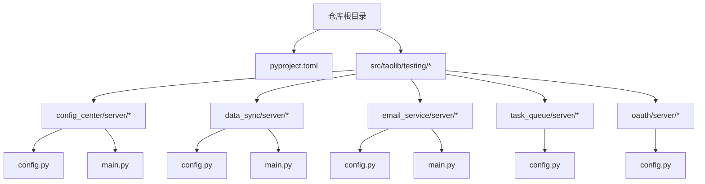
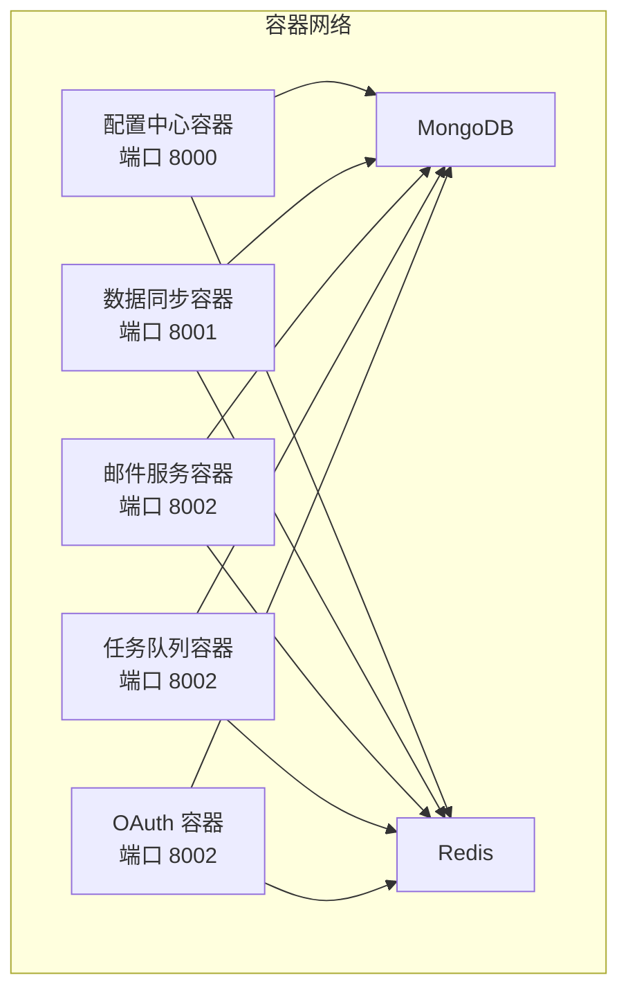
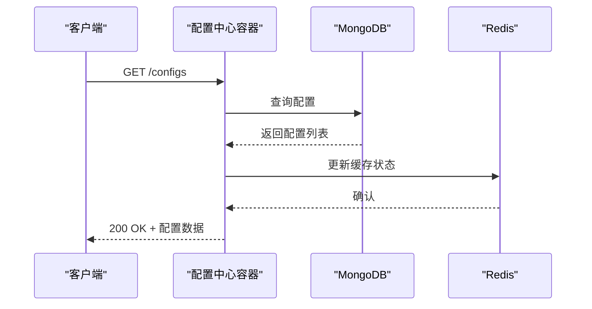
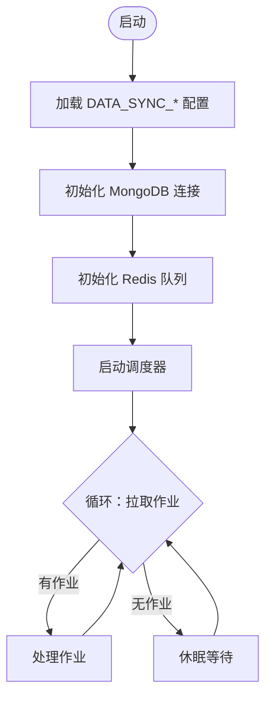
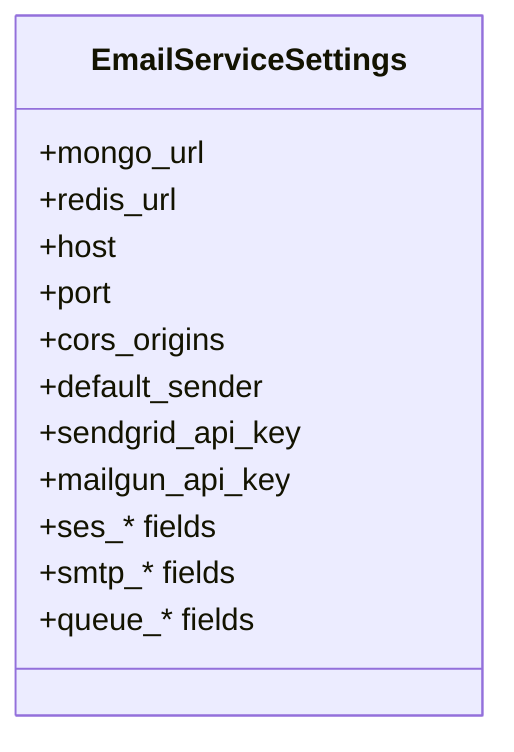
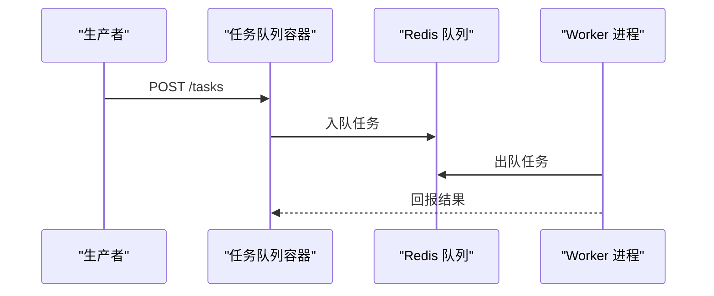
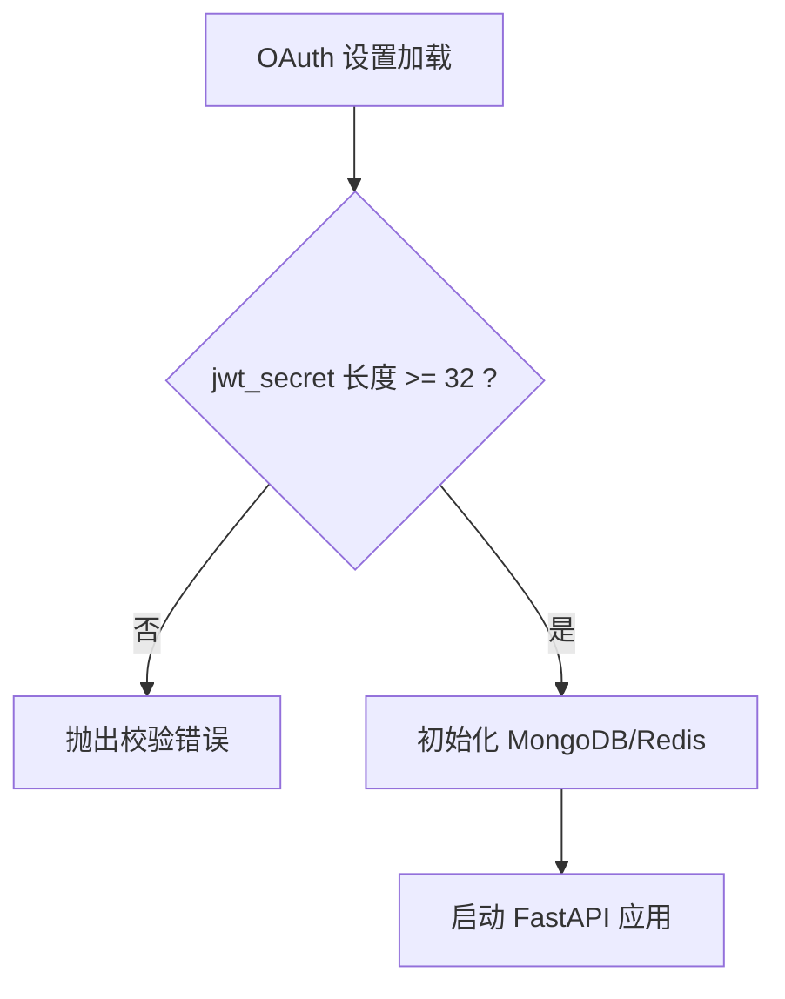
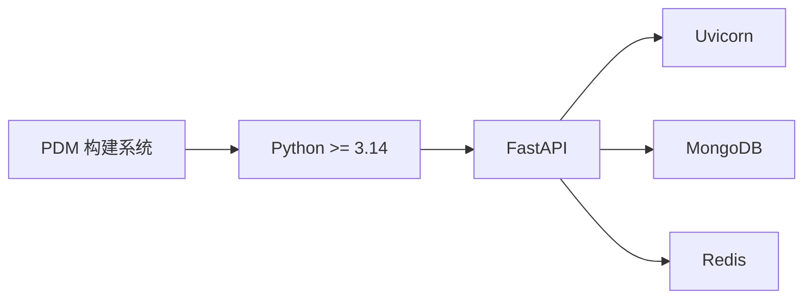

# 容器化部署

<cite>
**本文引用的文件**
- [README.md](file://README.md)
- [pyproject.toml](file://pyproject.toml)
- [.trae/specs/container_workflow_fix/tasks.md](file://.trae/specs/container_workflow_fix/tasks.md)
- [.trae/specs/container_workflow_fix/checklist.md](file://.trae/specs/container_workflow_fix/checklist.md)
- [src/taolib/testing/config_center/server/config.py](file://src/taolib/testing/config_center/server/config.py)
- [src/taolib/testing/config_center/server/main.py](file://src/taolib/testing/config_center/server/main.py)
- [src/taolib/testing/data_sync/server/config.py](file://src/taolib/testing/data_sync/server/config.py)
- [src/taolib/testing/data_sync/server/main.py](file://src/taolib/testing/data_sync/server/main.py)
- [src/taolib/testing/email_service/server/config.py](file://src/taolib/testing/email_service/server/config.py)
- [src/taolib/testing/email_service/server/main.py](file://src/taolib/testing/email_service/server/main.py)
- [src/taolib/testing/task_queue/server/config.py](file://src/taolib/testing/task_queue/server/config.py)
- [src/taolib/testing/oauth/server/config.py](file://src/taolib/testing/oauth/server/config.py)
</cite>

## 目录
1. [简介](#简介)
2. [项目结构](#项目结构)
3. [核心组件](#核心组件)
4. [架构总览](#架构总览)
5. [详细组件分析](#详细组件分析)
6. [依赖分析](#依赖分析)
7. [性能考虑](#性能考虑)
8. [故障排查指南](#故障排查指南)
9. [结论](#结论)
10. [附录](#附录)

## 简介
本指南面向 FlexLoop 项目（taolib 子模块集合）的容器化部署，目标包括：
- 明确项目当前是否需要容器化（基于现有服务形态与依赖）
- 若需要容器化，则提供 Docker 镜像构建流程、Dockerfile 规范与多阶段优化思路
- 提供 Docker Compose 编排、服务依赖与网络拓扑设计
- 解释环境变量、数据卷与持久化策略
- 给出健康检查、重启策略与资源限制配置方法
- 总结容器安全加固、镜像扫描与漏洞修复最佳实践
- 给出部署、滚动更新与回滚策略

根据仓库现状，项目为 Python 库与多个子服务（配置中心、数据同步、邮件服务、任务队列、OAuth 等），这些服务均以 FastAPI + Uvicorn 的形式提供，具备独立的配置与启动入口。因此，容器化部署是可行且推荐的。

## 项目结构
- 顶层使用 PDM 构建系统与 pyproject.toml 管理依赖与可选功能集
- 多个 testing 子模块提供独立的服务端点与配置，每个服务均包含：
  - 配置模块（pydantic-settings 读取环境变量）
  - FastAPI 应用工厂与生命周期管理
  - CLI 入口（uvicorn 启动）

图表来源
- [pyproject.toml:1-318](file://pyproject.toml#L1-L318)
- [src/taolib/testing/config_center/server/config.py:1-72](file://src/taolib/testing/config_center/server/config.py#L1-L72)
- [src/taolib/testing/config_center/server/main.py:1-48](file://src/taolib/testing/config_center/server/main.py#L1-L48)
- [src/taolib/testing/data_sync/server/config.py:1-43](file://src/taolib/testing/data_sync/server/config.py#L1-L43)
- [src/taolib/testing/data_sync/server/main.py:1-48](file://src/taolib/testing/data_sync/server/main.py#L1-L48)
- [src/taolib/testing/email_service/server/config.py:1-63](file://src/taolib/testing/email_service/server/config.py#L1-L63)
- [src/taolib/testing/email_service/server/main.py:1-35](file://src/taolib/testing/email_service/server/main.py#L1-L35)
- [src/taolib/testing/task_queue/server/config.py:1-48](file://src/taolib/testing/task_queue/server/config.py#L1-L48)
- [src/taolib/testing/oauth/server/config.py:1-80](file://src/taolib/testing/oauth/server/config.py#L1-L80)

章节来源
- [README.md:1-100](file://README.md#L1-L100)
- [pyproject.toml:1-318](file://pyproject.toml#L1-L318)

## 核心组件
- 配置中心服务（config-center）：提供配置管理、版本控制、审计与 WebSocket 实时推送
- 数据同步服务（data-sync）：负责数据抽取、转换、加载与作业调度
- 邮件服务（email-service）：统一邮件发送、模板与退订处理
- 任务队列服务（task-queue）：基于 Redis 的异步任务队列与工作进程
- OAuth 服务（oauth）：用户身份与第三方登录集成

每个服务均具备：
- 独立的配置类（Settings），通过 pydantic-settings 从环境变量加载
- CLI 入口（main.py），使用 uvicorn 启动 FastAPI 应用
- 默认监听地址与端口，便于容器暴露

章节来源
- [src/taolib/testing/config_center/server/config.py:1-72](file://src/taolib/testing/config_center/server/config.py#L1-L72)
- [src/taolib/testing/config_center/server/main.py:1-48](file://src/taolib/testing/config_center/server/main.py#L1-L48)
- [src/taolib/testing/data_sync/server/config.py:1-43](file://src/taolib/testing/data_sync/server/config.py#L1-L43)
- [src/taolib/testing/data_sync/server/main.py:1-48](file://src/taolib/testing/data_sync/server/main.py#L1-L48)
- [src/taolib/testing/email_service/server/config.py:1-63](file://src/taolib/testing/email_service/server/config.py#L1-L63)
- [src/taolib/testing/email_service/server/main.py:1-35](file://src/taolib/testing/email_service/server/main.py#L1-L35)
- [src/taolib/testing/task_queue/server/config.py:1-48](file://src/taolib/testing/task_queue/server/config.py#L1-L48)
- [src/taolib/testing/oauth/server/config.py:1-80](file://src/taolib/testing/oauth/server/config.py#L1-L80)

## 架构总览
FlexLoop 的容器化部署建议采用“单主机多服务”模式，每个服务运行在独立容器中，并通过共享网络互联。数据库与缓存（MongoDB、Redis）可作为外部服务或使用 Compose 管理的独立服务。

图表来源
- [src/taolib/testing/config_center/server/config.py:15-24](file://src/taolib/testing/config_center/server/config.py#L15-L24)
- [src/taolib/testing/data_sync/server/config.py:20-24](file://src/taolib/testing/data_sync/server/config.py#L20-L24)
- [src/taolib/testing/email_service/server/config.py:17-23](file://src/taolib/testing/email_service/server/config.py#L17-L23)
- [src/taolib/testing/task_queue/server/config.py:20-30](file://src/taolib/testing/task_queue/server/config.py#L20-L30)
- [src/taolib/testing/oauth/server/config.py:20-30](file://src/taolib/testing/oauth/server/config.py#L20-L30)

## 详细组件分析

### 配置中心服务（config-center）
- 端口：默认 8000
- 关键依赖：MongoDB、Redis、JWT 密钥
- 环境变量前缀：CONFIG_CENTER_
- 健康检查：建议实现 /health 端点并结合容器健康探针
- 数据持久化：MongoDB；Redis 用于缓存与推送

图表来源
- [src/taolib/testing/config_center/server/main.py:14-41](file://src/taolib/testing/config_center/server/main.py#L14-L41)
- [src/taolib/testing/config_center/server/config.py:15-39](file://src/taolib/testing/config_center/server/config.py#L15-L39)

章节来源
- [src/taolib/testing/config_center/server/config.py:1-72](file://src/taolib/testing/config_center/server/config.py#L1-L72)
- [src/taolib/testing/config_center/server/main.py:1-48](file://src/taolib/testing/config_center/server/main.py#L1-L48)

### 数据同步服务（data-sync）
- 端口：默认 8001
- 关键依赖：MongoDB、Redis、定时任务与作业调度
- 环境变量前缀：DATA_SYNC_

图表来源
- [src/taolib/testing/data_sync/server/config.py:10-42](file://src/taolib/testing/data_sync/server/config.py#L10-L42)
- [src/taolib/testing/data_sync/server/main.py:14-41](file://src/taolib/testing/data_sync/server/main.py#L14-L41)

章节来源
- [src/taolib/testing/data_sync/server/config.py:1-43](file://src/taolib/testing/data_sync/server/config.py#L1-L43)
- [src/taolib/testing/data_sync/server/main.py:1-48](file://src/taolib/testing/data_sync/server/main.py#L1-L48)

### 邮件服务（email-service）
- 端口：默认 8002
- 支持 SendGrid、Mailgun、SES、SMTP 等多种提供商
- 环境变量前缀：EMAIL_SERVICE_

图表来源
- [src/taolib/testing/email_service/server/config.py:7-60](file://src/taolib/testing/email_service/server/config.py#L7-L60)

章节来源
- [src/taolib/testing/email_service/server/config.py:1-63](file://src/taolib/testing/email_service/server/config.py#L1-L63)
- [src/taolib/testing/email_service/server/main.py:1-35](file://src/taolib/testing/email_service/server/main.py#L1-L35)

### 任务队列服务（task-queue）
- 端口：默认 8002
- 关键依赖：MongoDB、Redis、工作进程数量
- 环境变量前缀：TASK_QUEUE_

图表来源
- [src/taolib/testing/task_queue/server/config.py:10-47](file://src/taolib/testing/task_queue/server/config.py#L10-L47)

章节来源
- [src/taolib/testing/task_queue/server/config.py:1-48](file://src/taolib/testing/task_queue/server/config.py#L1-L48)

### OAuth 服务（oauth）
- 端口：默认 8002
- 关键依赖：MongoDB、Redis、JWT 密钥、加密密钥
- 环境变量前缀：OAUTH_

图表来源
- [src/taolib/testing/oauth/server/config.py:10-77](file://src/taolib/testing/oauth/server/config.py#L10-L77)

章节来源
- [src/taolib/testing/oauth/server/config.py:1-80](file://src/taolib/testing/oauth/server/config.py#L1-L80)

## 依赖分析
- 语言与运行时：Python >= 3.14（由项目元数据声明）
- 构建系统：PDM（pyproject.toml 中定义）
- 服务端框架：FastAPI + Uvicorn
- 数据与缓存：MongoDB、Redis（各服务均有对应配置）
- 可选功能集：通过可选依赖区分不同服务组合（如 config-server、data-sync-server、email-service-server 等）

图表来源
- [pyproject.toml:1-318](file://pyproject.toml#L1-L318)

章节来源
- [pyproject.toml:1-318](file://pyproject.toml#L1-L318)

## 性能考虑
- 进程与并发：每个服务独立容器，利用 Uvicorn 的多进程/多线程能力；任务队列服务可通过 num_workers 调整工作进程数
- 缓存与队列：Redis 用于高并发场景下的任务排队与状态缓存
- 数据库连接池：建议在生产环境配置连接池参数，避免频繁重建连接
- 日志与监控：建议将日志输出到标准输出，便于容器日志收集；可扩展指标导出（如 Prometheus）

## 故障排查指南
- 端口冲突：确认各服务端口未被占用（8000-8002），或通过环境变量覆盖
- 数据库连通性：核对 mongo_url 与 mongo_db；确保 MongoDB 服务可达
- 缓存连通性：核对 redis_url；确保 Redis 服务可达
- JWT 密钥长度：OAuth 与配置中心对 jwt_secret 长度有校验（>=32），需在生产环境设置
- CORS 与代理：如通过反向代理访问，注意跨域与路径前缀配置

章节来源
- [src/taolib/testing/config_center/server/config.py:26-34](file://src/taolib/testing/config_center/server/config.py#L26-L34)
- [src/taolib/testing/oauth/server/config.py:32-39](file://src/taolib/testing/oauth/server/config.py#L32-L39)

## 结论
FlexLoop 项目具备清晰的服务边界与配置体系，适合容器化部署。建议：
- 为每个服务构建独立镜像并运行在独立容器中
- 使用 Docker Compose 管理服务编排与网络
- 通过环境变量与数据卷实现配置与持久化
- 配置健康检查、重启策略与资源限制
- 强化安全与镜像扫描，建立滚动更新与回滚机制

## 附录

### Docker 镜像构建与 Dockerfile 规范
- 基础镜像：选择官方 Python 运行时镜像（含 Python >= 3.14）
- 依赖安装：使用 PDM 或 pip 安装项目依赖；优先使用可选功能集以减少镜像体积
- 多阶段构建建议：
  - 第一阶段：安装构建依赖与编译工具
  - 第二阶段：仅复制运行时依赖与构建产物，最小化运行时镜像
- 用户与权限：以非 root 用户运行应用，降低攻击面
- 健康检查：在容器中暴露 /health 端点并配置 HEALTHCHECK
- 环境变量：通过 .env 文件与 docker-compose 环境变量注入
- 数据卷：将日志、上传文件等持久化目录映射到宿主机或卷驱动

### Docker Compose 编排与网络拓扑
- 网络：创建自定义桥接网络，使服务间可按服务名互访
- 服务：分别为 config-center、data-sync、email-service、task-queue、oauth
- 依赖：使用 depends_on 确保数据库与缓存先于应用启动
- 端口：按服务默认端口映射至宿主机
- 数据卷：挂载日志与静态资源目录

### 环境变量、数据卷与持久化
- 环境变量前缀：
  - CONFIG_CENTER_（配置中心）
  - DATA_SYNC_（数据同步）
  - EMAIL_SERVICE_（邮件服务）
  - TASK_QUEUE_（任务队列）
  - OAUTH_（OAuth）
- 数据卷建议：
  - 日志目录：/var/log/app
  - 上传文件目录：/data/uploads
  - 配置文件：通过只读卷挂载 .env

### 健康检查、重启策略与资源限制
- 健康检查：在容器中暴露 /health，配置 interval、timeout、retries
- 重启策略：unless-stopped 或 on-failure
- 资源限制：CPU/内存配额，避免资源争抢

### 安全加固、镜像扫描与漏洞修复
- 最小化镜像：移除不必要的包与开发工具
- 镜像扫描：使用 Trivy、Clair 或 GitHub 扫描器定期扫描
- 漏洞修复：关注 CVE 并及时升级基础镜像与依赖
- 凭据管理：使用 Docker secrets 或外部密钥管理服务
- 网络隔离：限制入站端口，仅开放必需端口

### 部署、滚动更新与回滚策略
- 部署：使用 Compose 或编排平台（Kubernetes/Docker Swarm）
- 滚动更新：设置更新延迟与并发度，保证服务可用性
- 回滚：保留镜像版本标签，失败时快速回滚至上一个稳定版本
- 配置灰度：通过环境变量与特性开关进行渐进式发布