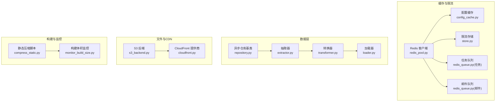
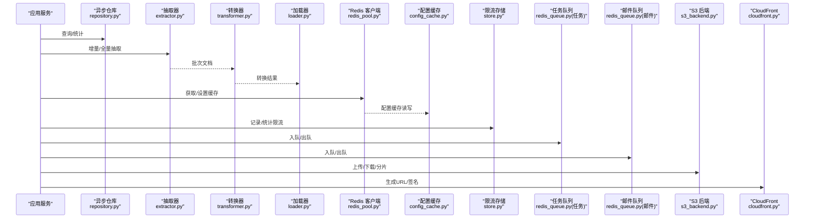
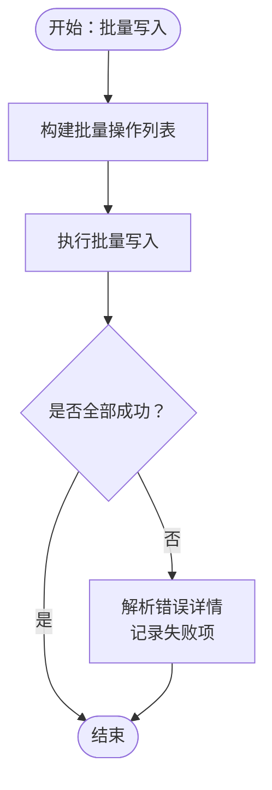
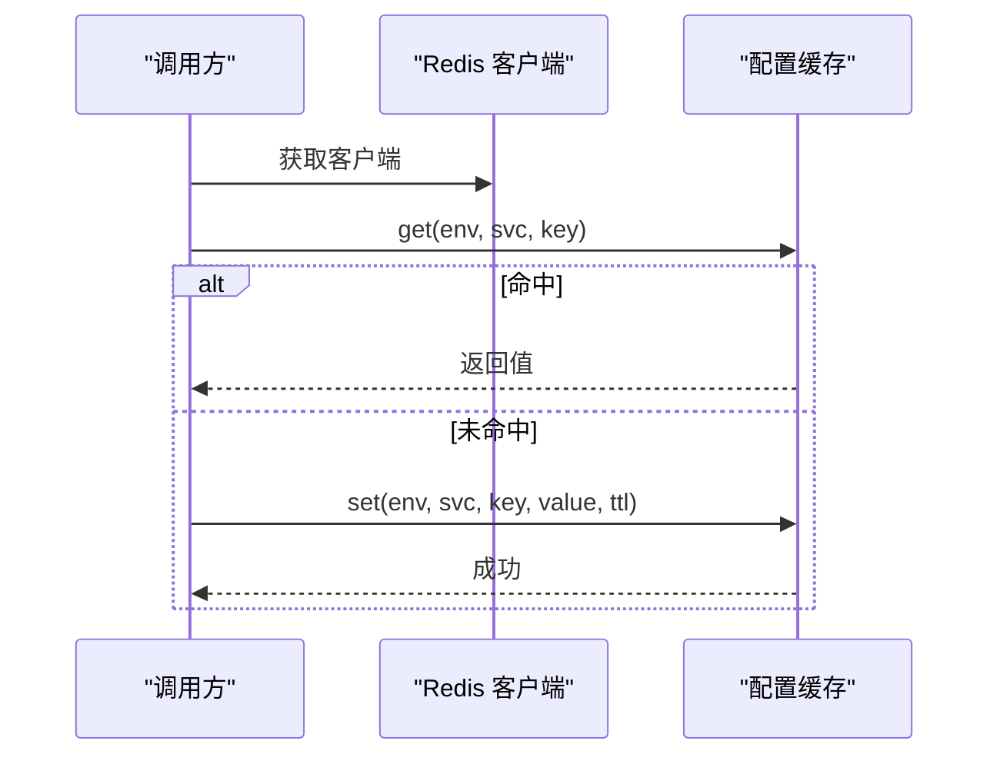
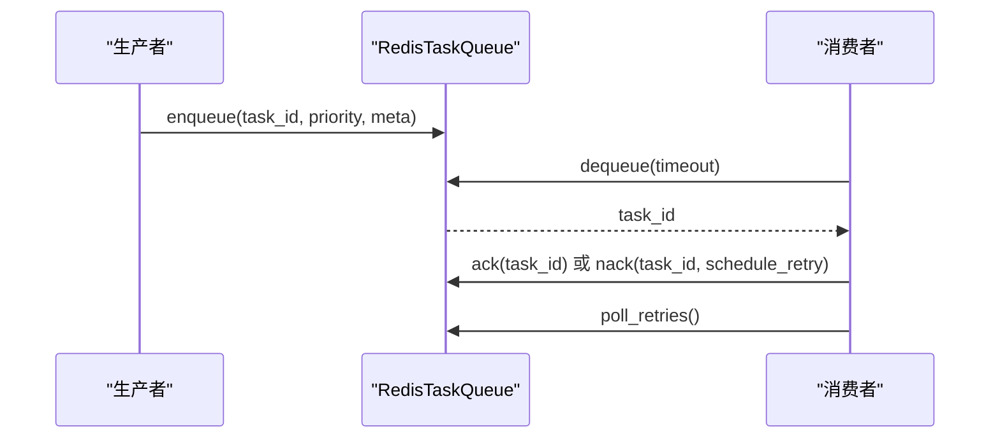
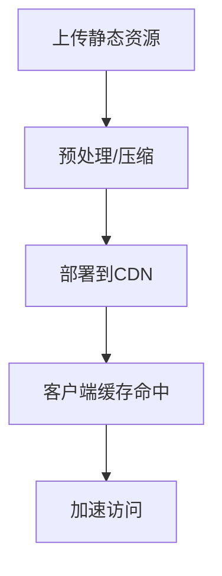
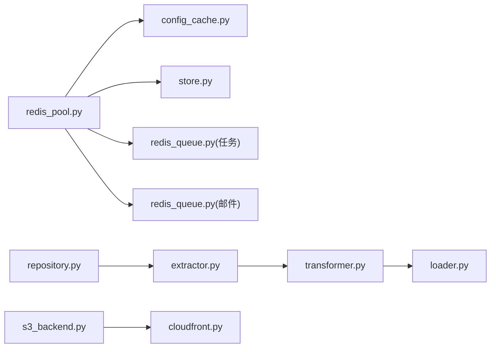

# 性能优化

<cite>
**本文引用的文件**
- [redis_pool.py](file://src/taolib/testing/_base/redis_pool.py)
- [repository.py](file://src/taolib/testing/_base/repository.py)
- [redis_client.py](file://src/taolib/testing/config_center/cache/redis_client.py)
- [config_cache.py](file://src/taolib/testing/config_center/cache/config_cache.py)
- [redis_queue.py（任务队列）](file://src/taolib/testing/task_queue/queue/redis_queue.py)
- [redis_queue.py（邮件队列）](file://src/taolib/testing/email_service/queue/redis_queue.py)
- [store.py](file://src/taolib/testing/rate_limiter/store.py)
- [extractor.py](file://src/taolib/testing/data_sync/pipeline/extractor.py)
- [transformer.py](file://src/taolib/testing/data_sync/pipeline/transformer.py)
- [loader.py](file://src/taolib/testing/data_sync/pipeline/loader.py)
- [cloudfront.py](file://src/taolib/testing/file_storage/cdn/cloudfront.py)
- [s3_backend.py](file://src/taolib/testing/file_storage/storage/s3_backend.py)
- [compress_static.py](file://doc/scripts/compress_static.py)
- [monitor_build_size.py](file://doc/scripts/monitor_build_size.py)
- [perf_remote_bench.py](file://tests/perf_remote_bench.py)
- [check_file_size.py](file://scripts/check_file_size.py)
</cite>

## 目录
1. [简介](#简介)
2. [项目结构](#项目结构)
3. [核心组件](#核心组件)
4. [架构总览](#架构总览)
5. [详细组件分析](#详细组件分析)
6. [依赖分析](#依赖分析)
7. [性能考量](#性能考量)
8. [故障排查指南](#故障排查指南)
9. [结论](#结论)
10. [附录](#附录)

## 简介
本指南面向 FlexLoop 项目的性能优化，聚焦以下方面：
- 数据库查询优化、索引设计与连接池配置最佳实践
- Redis 缓存策略、热点数据与缓存穿透防护
- 异步任务优化、并发控制与资源竞争规避
- 网络优化、CDN 配置与静态资源压缩
- 内存管理、垃圾回收与资源泄漏诊断
- 性能基准测试、瓶颈分析与容量规划流程

## 项目结构
FlexLoop 将性能相关能力分布在多个子系统中：
- 数据层：异步 MongoDB 访问基类与数据同步流水线
- 缓存与限流：Redis 客户端、配置缓存、限流存储、任务队列
- 文件与 CDN：S3 兼容存储与 CloudFront CDN
- 构建与监控：静态资源压缩脚本与构建体积监控
- 基准与检查：远程性能基准脚本与文件尺寸检查

**图表来源**
- [redis_pool.py:11-35](file://src/taolib/testing/_base/redis_pool.py#L11-L35)
- [config_cache.py:75-123](file://src/taolib/testing/config_center/cache/config_cache.py#L75-L123)
- [store.py:112-241](file://src/taolib/testing/rate_limiter/store.py#L112-L241)
- [redis_queue.py（任务队列）:14-316](file://src/taolib/testing/task_queue/queue/redis_queue.py#L14-L316)
- [redis_queue.py（邮件队列）:23-80](file://src/taolib/testing/email_service/queue/redis_queue.py#L23-L80)
- [repository.py:15-130](file://src/taolib/testing/_base/repository.py#L15-L130)
- [extractor.py:17-77](file://src/taolib/testing/data_sync/pipeline/extractor.py#L17-L77)
- [transformer.py:17-104](file://src/taolib/testing/data_sync/pipeline/transformer.py#L17-L104)
- [loader.py:18-97](file://src/taolib/testing/data_sync/pipeline/loader.py#L18-L97)
- [s3_backend.py:18-336](file://src/taolib/testing/file_storage/storage/s3_backend.py#L18-L336)
- [cloudfront.py:11-63](file://src/taolib/testing/file_storage/cdn/cloudfront.py#L11-L63)
- [compress_static.py](file://doc/scripts/compress_static.py)
- [monitor_build_size.py](file://doc/scripts/monitor_build_size.py)

**章节来源**
- [redis_pool.py:11-35](file://src/taolib/testing/_base/redis_pool.py#L11-L35)
- [repository.py:15-130](file://src/taolib/testing/_base/repository.py#L15-L130)
- [config_cache.py:75-123](file://src/taolib/testing/config_center/cache/config_cache.py#L75-L123)
- [store.py:112-241](file://src/taolib/testing/rate_limiter/store.py#L112-L241)
- [redis_queue.py（任务队列）:14-316](file://src/taolib/testing/task_queue/queue/redis_queue.py#L14-L316)
- [redis_queue.py（邮件队列）:23-80](file://src/taolib/testing/email_service/queue/redis_queue.py#L23-L80)
- [extractor.py:17-77](file://src/taolib/testing/data_sync/pipeline/extractor.py#L17-L77)
- [transformer.py:17-104](file://src/taolib/testing/data_sync/pipeline/transformer.py#L17-L104)
- [loader.py:18-97](file://src/taolib/testing/data_sync/pipeline/loader.py#L18-L97)
- [s3_backend.py:18-336](file://src/taolib/testing/file_storage/storage/s3_backend.py#L18-L336)
- [cloudfront.py:11-63](file://src/taolib/testing/file_storage/cdn/cloudfront.py#L11-L63)
- [compress_static.py](file://doc/scripts/compress_static.py)
- [monitor_build_size.py](file://doc/scripts/monitor_build_size.py)

## 核心组件
- 异步数据库访问基类：提供统一的异步 CRUD 与分页统计能力，便于在多模块复用，减少重复实现与连接开销。
- Redis 客户端与缓存：集中管理 Redis 单例客户端，配置缓存提供 JSON 序列化与 TTL 管理；限流存储采用 Redis Sorted Set 实现滑动窗口。
- 任务与邮件队列：基于 Redis List/BRPOP 的优先级队列，支持阻塞弹出、运行中跟踪与重试调度。
- 数据同步流水线：抽取器按批次与排序迭代，转换器支持字段映射与动态函数转换，加载器使用批量 upsert。
- 文件与 CDN：S3 兼容后端封装上传/下载/分片等操作；CloudFront 提供 URL 生成与签名。

**章节来源**
- [repository.py:15-130](file://src/taolib/testing/_base/repository.py#L15-L130)
- [redis_pool.py:11-35](file://src/taolib/testing/_base/redis_pool.py#L11-L35)
- [config_cache.py:75-123](file://src/taolib/testing/config_center/cache/config_cache.py#L75-L123)
- [store.py:112-241](file://src/taolib/testing/rate_limiter/store.py#L112-L241)
- [redis_queue.py（任务队列）:14-316](file://src/taolib/testing/task_queue/queue/redis_queue.py#L14-L316)
- [redis_queue.py（邮件队列）:23-80](file://src/taolib/testing/email_service/queue/redis_queue.py#L23-L80)
- [extractor.py:17-77](file://src/taolib/testing/data_sync/pipeline/extractor.py#L17-L77)
- [transformer.py:17-104](file://src/taolib/testing/data_sync/pipeline/transformer.py#L17-L104)
- [loader.py:18-97](file://src/taolib/testing/data_sync/pipeline/loader.py#L18-L97)
- [s3_backend.py:18-336](file://src/taolib/testing/file_storage/storage/s3_backend.py#L18-L336)
- [cloudfront.py:11-63](file://src/taolib/testing/file_storage/cdn/cloudfront.py#L11-L63)

## 架构总览
下图展示性能相关模块之间的交互关系与数据流：

**图表来源**
- [repository.py:15-130](file://src/taolib/testing/_base/repository.py#L15-L130)
- [extractor.py:17-77](file://src/taolib/testing/data_sync/pipeline/extractor.py#L17-L77)
- [transformer.py:17-104](file://src/taolib/testing/data_sync/pipeline/transformer.py#L17-L104)
- [loader.py:18-97](file://src/taolib/testing/data_sync/pipeline/loader.py#L18-L97)
- [redis_pool.py:11-35](file://src/taolib/testing/_base/redis_pool.py#L11-L35)
- [config_cache.py:75-123](file://src/taolib/testing/config_center/cache/config_cache.py#L75-L123)
- [store.py:112-241](file://src/taolib/testing/rate_limiter/store.py#L112-L241)
- [redis_queue.py（任务队列）:14-316](file://src/taolib/testing/task_queue/queue/redis_queue.py#L14-L316)
- [redis_queue.py（邮件队列）:23-80](file://src/taolib/testing/email_service/queue/redis_queue.py#L23-L80)
- [s3_backend.py:18-336](file://src/taolib/testing/file_storage/storage/s3_backend.py#L18-L336)
- [cloudfront.py:11-63](file://src/taolib/testing/file_storage/cdn/cloudfront.py#L11-L63)

## 详细组件分析

### 数据库查询优化与连接池配置
- 异步访问基类
  - 提供统一的插入、查询、更新、删除、分页与计数接口，避免重复连接与序列化逻辑。
  - 在多模块中复用，降低连接与事务开销。
- 数据同步流水线
  - 抽取器使用游标排序与批大小控制，确保顺序一致与内存可控。
  - 转换器支持字段映射与自定义转换函数，减少下游处理成本。
  - 加载器使用批量 upsert，显著降低写入往返次数与锁竞争。
- 索引设计建议
  - 增量同步场景：对时间字段与主键组合建立复合索引，提升排序与过滤效率。
  - 查询热点字段：为常用过滤与排序字段建立索引，结合 EXPLAIN 分析执行计划。
  - 聚合与统计：针对聚合管道的常用维度建立索引，减少回表与临时文件。
- 连接池配置建议
  - 采用连接池复用连接，避免频繁握手与认证。
  - 控制最大连接数与空闲连接数，结合监控指标动态调整。
  - 对只读查询与写入操作分离连接池，降低锁争用。

**图表来源**
- [loader.py:18-97](file://src/taolib/testing/data_sync/pipeline/loader.py#L18-L97)

**章节来源**
- [repository.py:15-130](file://src/taolib/testing/_base/repository.py#L15-L130)
- [extractor.py:17-77](file://src/taolib/testing/data_sync/pipeline/extractor.py#L17-L77)
- [transformer.py:17-104](file://src/taolib/testing/data_sync/pipeline/transformer.py#L17-L104)
- [loader.py:18-97](file://src/taolib/testing/data_sync/pipeline/loader.py#L18-L97)

### Redis 缓存策略、热点数据与缓存穿透防护
- 缓存策略
  - 使用统一的 Redis 客户端单例，避免多实例导致的连接浪费与配置不一致。
  - 配置缓存对值进行 JSON 序列化与 TTL 管理，支持按环境/服务/键粒度清理。
- 热点数据
  - 通过限流存储的实时统计接口识别热点路径与用户，结合队列优先级策略缓解峰值压力。
  - 对热点键设置更短 TTL 或本地二级缓存，降低单一节点压力。
- 缓存穿透防护
  - 对空值也进行短 TTL 缓存，避免恶意或异常请求持续穿透。
  - 使用布隆过滤器（可在上层引入）快速判断键是否存在，进一步拦截无效请求。

**图表来源**
- [redis_pool.py:11-35](file://src/taolib/testing/_base/redis_pool.py#L11-L35)
- [config_cache.py:75-123](file://src/taolib/testing/config_center/cache/config_cache.py#L75-L123)

**章节来源**
- [redis_pool.py:11-35](file://src/taolib/testing/_base/redis_pool.py#L11-L35)
- [config_cache.py:75-123](file://src/taolib/testing/config_center/cache/config_cache.py#L75-L123)
- [store.py:208-241](file://src/taolib/testing/rate_limiter/store.py#L208-L241)

### 异步任务优化、并发控制与资源竞争规避
- 任务队列
  - 使用 Redis List 实现高/中/低优先级队列，BRPOP 按优先级顺序阻塞弹出，降低 CPU 空转。
  - 通过运行中集合与统计键，实现任务生命周期可视化与可观测性。
  - 重试调度使用有序集合按到期时间轮询，避免轮询风暴。
- 并发控制
  - 工作进程数与队列消费者数应与 CPU/IO 能力匹配，避免过度并发导致上下文切换与锁竞争。
  - 对长耗时任务拆分为子任务，配合优先级与重试策略提升吞吐。
- 资源竞争规避
  - 使用管道（pipeline）原子化执行多条命令，减少网络往返与竞态。
  - 对共享资源（如全局统计键）采用无锁或细粒度锁策略。

**图表来源**
- [redis_queue.py（任务队列）:14-316](file://src/taolib/testing/task_queue/queue/redis_queue.py#L14-L316)

**章节来源**
- [redis_queue.py（任务队列）:14-316](file://src/taolib/testing/task_queue/queue/redis_queue.py#L14-L316)
- [redis_queue.py（邮件队列）:23-80](file://src/taolib/testing/email_service/queue/redis_queue.py#L23-L80)

### 网络优化、CDN 配置与静态资源压缩
- CDN 配置
  - CloudFront 提供 URL 生成与签名能力，结合私钥与 Key-Pair-Id 生成带有效期的签名链接。
  - 对热点资源启用边缘缓存，合理设置 TTL 与缓存标签。
- 静态资源压缩
  - 使用构建脚本对静态资源进行压缩与去重，降低传输体积与首屏时间。
  - 结合体积监控脚本，持续跟踪构建产物变化，防止回归。

**图表来源**
- [cloudfront.py:11-63](file://src/taolib/testing/file_storage/cdn/cloudfront.py#L11-L63)
- [compress_static.py](file://doc/scripts/compress_static.py)
- [monitor_build_size.py](file://doc/scripts/monitor_build_size.py)

**章节来源**
- [cloudfront.py:11-63](file://src/taolib/testing/file_storage/cdn/cloudfront.py#L11-L63)
- [compress_static.py](file://doc/scripts/compress_static.py)
- [monitor_build_size.py](file://doc/scripts/monitor_build_size.py)

### 内存管理、垃圾回收与资源泄漏诊断
- 内存与 GC
  - 异步代码中避免持有大对象引用过久，及时释放中间结果。
  - 对批量处理的数据流（抽取器）采用分批处理与惰性迭代，降低峰值内存。
- 资源泄漏诊断
  - 对 Redis、S3 客户端连接进行显式关闭与生命周期管理。
  - 使用脚本定期检查文件大小与构建产物，发现异常增长可能的泄漏线索。

**章节来源**
- [redis_pool.py:30-35](file://src/taolib/testing/_base/redis_pool.py#L30-L35)
- [s3_backend.py:18-336](file://src/taolib/testing/file_storage/storage/s3_backend.py#L18-L336)
- [check_file_size.py](file://scripts/check_file_size.py)

## 依赖分析
- 组件耦合
  - Redis 客户端被多模块复用，形成中心化依赖，便于统一优化与运维。
  - 数据同步流水线内部模块职责清晰，耦合度低，便于独立优化。
- 外部依赖
  - MongoDB：通过异步驱动与批量操作降低写入延迟。
  - Redis：作为缓存与队列载体，需关注持久化与内存模型。
  - S3/CloudFront：网络与存储成本与性能的关键变量。

**图表来源**
- [redis_pool.py:11-35](file://src/taolib/testing/_base/redis_pool.py#L11-L35)
- [config_cache.py:75-123](file://src/taolib/testing/config_center/cache/config_cache.py#L75-L123)
- [store.py:112-241](file://src/taolib/testing/rate_limiter/store.py#L112-L241)
- [redis_queue.py（任务队列）:14-316](file://src/taolib/testing/task_queue/queue/redis_queue.py#L14-L316)
- [redis_queue.py（邮件队列）:23-80](file://src/taolib/testing/email_service/queue/redis_queue.py#L23-L80)
- [repository.py:15-130](file://src/taolib/testing/_base/repository.py#L15-L130)
- [extractor.py:17-77](file://src/taolib/testing/data_sync/pipeline/extractor.py#L17-L77)
- [transformer.py:17-104](file://src/taolib/testing/data_sync/pipeline/transformer.py#L17-L104)
- [loader.py:18-97](file://src/taolib/testing/data_sync/pipeline/loader.py#L18-L97)
- [s3_backend.py:18-336](file://src/taolib/testing/file_storage/storage/s3_backend.py#L18-L336)
- [cloudfront.py:11-63](file://src/taolib/testing/file_storage/cdn/cloudfront.py#L11-L63)

**章节来源**
- [redis_pool.py:11-35](file://src/taolib/testing/_base/redis_pool.py#L11-L35)
- [config_cache.py:75-123](file://src/taolib/testing/config_center/cache/config_cache.py#L75-L123)
- [store.py:112-241](file://src/taolib/testing/rate_limiter/store.py#L112-L241)
- [redis_queue.py（任务队列）:14-316](file://src/taolib/testing/task_queue/queue/redis_queue.py#L14-L316)
- [redis_queue.py（邮件队列）:23-80](file://src/taolib/testing/email_service/queue/redis_queue.py#L23-L80)
- [repository.py:15-130](file://src/taolib/testing/_base/repository.py#L15-L130)
- [extractor.py:17-77](file://src/taolib/testing/data_sync/pipeline/extractor.py#L17-L77)
- [transformer.py:17-104](file://src/taolib/testing/data_sync/pipeline/transformer.py#L17-L104)
- [loader.py:18-97](file://src/taolib/testing/data_sync/pipeline/loader.py#L18-L97)
- [s3_backend.py:18-336](file://src/taolib/testing/file_storage/storage/s3_backend.py#L18-L336)
- [cloudfront.py:11-63](file://src/taolib/testing/file_storage/cdn/cloudfront.py#L11-L63)

## 性能考量
- 数据库
  - 使用批量写入与合适的批大小，避免单次写入过大导致锁竞争。
  - 对高频查询字段建立索引，并定期分析慢查询日志。
- 缓存
  - 合理设置 TTL 与冷热分层，对热点键进行本地缓存与预热。
  - 对空值与异常输入进行短 TTL 缓存，降低穿透风险。
- 队列
  - 优先级队列与重试调度结合，保障关键任务的 SLA。
  - 使用管道减少网络往返，提高吞吐。
- 存储与网络
  - 对大文件采用分片上传与 CDN 边缘缓存，缩短访问路径。
  - 静态资源压缩与版本化，提升缓存命中率。

## 故障排查指南
- Redis 连接问题
  - 检查客户端单例是否正确初始化与关闭。
  - 关注管道执行失败与键空间事件，定位异常。
- 数据同步失败
  - 查看批量写入错误详情，区分部分失败与完全失败场景。
  - 核对转换器异常快照与失败列表，定位具体文档。
- 限流与队列异常
  - 通过实时统计接口核对请求分布与队列长度。
  - 检查重试调度是否按时触发，避免任务堆积。

**章节来源**
- [redis_pool.py:30-35](file://src/taolib/testing/_base/redis_pool.py#L30-L35)
- [loader.py:57-95](file://src/taolib/testing/data_sync/pipeline/loader.py#L57-L95)
- [store.py:208-241](file://src/taolib/testing/rate_limiter/store.py#L208-L241)
- [redis_queue.py（任务队列）:158-194](file://src/taolib/testing/task_queue/queue/redis_queue.py#L158-L194)

## 结论
通过集中化的 Redis 客户端、标准化的数据同步流水线、优先级队列与 CDN 缓存策略，FlexLoop 可在异步与分布式场景下获得稳定且可扩展的性能表现。建议结合监控与基准测试持续优化索引、缓存与队列参数，以应对业务增长与流量波动。

## 附录
- 性能基准测试与容量规划流程
  - 使用远程基准脚本对关键路径进行压测，记录吞吐与延迟。
  - 基于压测结果评估数据库与缓存容量，制定扩容阈值。
  - 结合构建体积监控与静态资源压缩脚本，持续优化前端性能。

**章节来源**
- [perf_remote_bench.py](file://tests/perf_remote_bench.py)
- [monitor_build_size.py](file://doc/scripts/monitor_build_size.py)
- [compress_static.py](file://doc/scripts/compress_static.py)