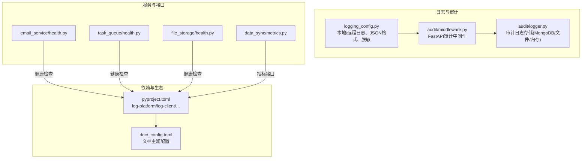
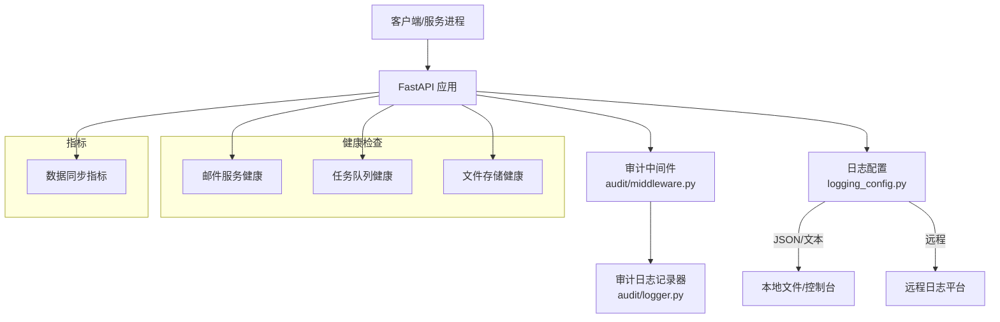
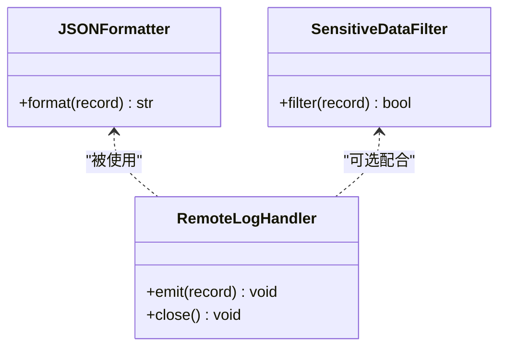
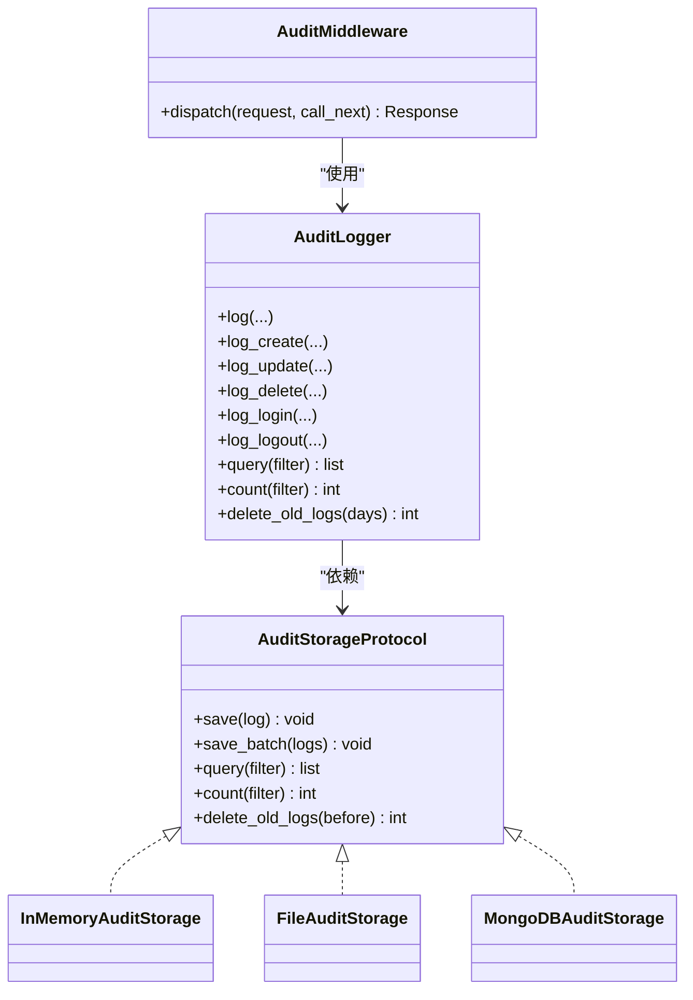
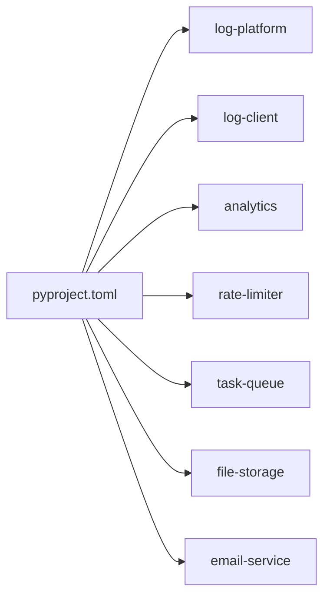

# 监控与日志

<cite>
**本文引用的文件**
- [logging_config.py](file://src/taolib/testing/logging_config.py)
- [pyproject.toml](file://pyproject.toml)
- [audit_logger.py](file://src/taolib/testing/audit/logger.py)
- [audit_middleware.py](file://src/taolib/testing/audit/middleware.py)
- [metrics.py](file://src/taolib/testing/data_sync/server/api/metrics.py)
- [health.py（邮件服务）](file://src/taolib/testing/email_service/server/api/health.py)
- [health.py（任务队列）](file://src/taolib/testing/task_queue/server/api/health.py)
- [health.py（文件存储）](file://src/taolib/testing/file_storage/server/api/health.py)
- [test_rate_limiter_api.py](file://tests/testing/test_rate_limiter/test_api.py)
- [test_analytics_api.py](file://tests/testing/test_analytics/test_api.py)
- [_config.toml](file://doc/_config.toml)
</cite>

## 目录
1. [简介](#简介)
2. [项目结构](#项目结构)
3. [核心组件](#核心组件)
4. [架构总览](#架构总览)
5. [组件详解](#组件详解)
6. [依赖关系分析](#依赖关系分析)
7. [性能考量](#性能考量)
8. [故障排查指南](#故障排查指南)
9. [结论](#结论)
10. [附录](#附录)

## 简介
本文件面向 FlexLoop 项目的监控与日志体系，围绕以下目标展开：
- Prometheus 指标采集与 Grafana 可视化、告警规则设计
- ELK/EFK 日志聚合、分析与可视化
- APM 性能监控、分布式链路追踪与错误追踪
- 自定义指标定义、业务指标监控与 SLA 告警策略
- 日志轮转、存储管理与检索优化
- 监控数据导出、报表生成与趋势分析

本项目已具备完善的日志基础设施（文本与 JSON 格式、远程日志、审计日志与中间件），并提供健康检查端点与部分指标接口，可作为监控与日志体系的起点。

## 项目结构
与监控和日志相关的关键位置如下：
- 日志配置与远程日志：src/taolib/testing/logging_config.py
- 审计日志与中间件：src/taolib/testing/audit/logger.py、src/taolib/testing/audit/middleware.py
- 健康检查端点：多模块 server/api/health.py
- 指标接口：src/taolib/testing/data_sync/server/api/metrics.py
- 依赖与可选组件：pyproject.toml 中的 log-platform、log-client、analytics、rate-limiter 等
- 文档主题配置：doc/_config.toml（用于文档站点）

图表来源
- [logging_config.py:1-540](file://src/taolib/testing/logging_config.py#L1-L540)
- [audit_logger.py:1-747](file://src/taolib/testing/audit/logger.py#L1-L747)
- [audit_middleware.py:1-275](file://src/taolib/testing/audit/middleware.py#L1-L275)
- [health.py（邮件服务）:1-56](file://src/taolib/testing/email_service/server/api/health.py#L1-L56)
- [health.py（任务队列）:1-46](file://src/taolib/testing/task_queue/server/api/health.py#L1-L46)
- [health.py（文件存储）:1-13](file://src/taolib/testing/file_storage/server/api/health.py#L1-L13)
- [metrics.py:40-58](file://src/taolib/testing/data_sync/server/api/metrics.py#L40-L58)
- [pyproject.toml:1-318](file://pyproject.toml#L1-L318)
- [_config.toml:1-46](file://doc/_config.toml#L1-L46)

章节来源
- [pyproject.toml:1-318](file://pyproject.toml#L1-L318)
- [logging_config.py:1-540](file://src/taolib/testing/logging_config.py#L1-L540)
- [audit_logger.py:1-747](file://src/taolib/testing/audit/logger.py#L1-L747)
- [audit_middleware.py:1-275](file://src/taolib/testing/audit/middleware.py#L1-L275)
- [metrics.py:40-58](file://src/taolib/testing/data_sync/server/api/metrics.py#L40-L58)
- [health.py（邮件服务）:1-56](file://src/taolib/testing/email_service/server/api/health.py#L1-L56)
- [health.py（任务队列）:1-46](file://src/taolib/testing/task_queue/server/api/health.py#L1-L46)
- [health.py（文件存储）:1-13](file://src/taolib/testing/file_storage/server/api/health.py#L1-L13)
- [_config.toml:1-46](file://doc/_config.toml#L1-L46)

## 核心组件
- 日志配置与远程日志
  - 支持文本与 JSON 两种格式，JSON 便于 ELK/Fluentd/Loki 等系统解析
  - 提供敏感数据脱敏过滤器，覆盖密码、JWT 密钥、API Key、邮箱、手机号、IP 等
  - 提供 RemoteLogHandler，支持批量发送、定时刷新、优雅降级
- 审计日志
  - 多存储后端：内存、文件、MongoDB，支持批量写入、查询、计数、清理
  - FastAPI 中间件自动记录请求审计，过滤敏感头，支持排除路径
- 健康检查端点
  - 各子系统提供 /health 或 /healthz 等端点，返回数据库、缓存、队列等状态
- 指标接口
  - 数据同步模块提供作业指标与失败统计接口，可用于 Prometheus 抓取

章节来源
- [logging_config.py:256-335](file://src/taolib/testing/logging_config.py#L256-L335)
- [logging_config.py:350-486](file://src/taolib/testing/logging_config.py#L350-L486)
- [audit_logger.py:22-77](file://src/taolib/testing/audit/logger.py#L22-L77)
- [audit_logger.py:79-184](file://src/taolib/testing/audit/logger.py#L79-L184)
- [audit_logger.py:325-468](file://src/taolib/testing/audit/logger.py#L325-L468)
- [audit_middleware.py:101-275](file://src/taolib/testing/audit/middleware.py#L101-L275)
- [metrics.py:40-58](file://src/taolib/testing/data_sync/server/api/metrics.py#L40-L58)
- [health.py（邮件服务）:8-54](file://src/taolib/testing/email_service/server/api/health.py#L8-L54)
- [health.py（任务队列）:17-44](file://src/taolib/testing/task_queue/server/api/health.py#L17-L44)
- [health.py（文件存储）:8-11](file://src/taolib/testing/file_storage/server/api/health.py#L8-L11)

## 架构总览
下图展示了监控与日志在系统中的位置与交互：

图表来源
- [audit_middleware.py:101-275](file://src/taolib/testing/audit/middleware.py#L101-L275)
- [audit_logger.py:470-747](file://src/taolib/testing/audit/logger.py#L470-L747)
- [logging_config.py:256-335](file://src/taolib/testing/logging_config.py#L256-L335)
- [health.py（邮件服务）:8-54](file://src/taolib/testing/email_service/server/api/health.py#L8-L54)
- [health.py（任务队列）:17-44](file://src/taolib/testing/task_queue/server/api/health.py#L17-L44)
- [health.py（文件存储）:8-11](file://src/taolib/testing/file_storage/server/api/health.py#L8-L11)
- [metrics.py:40-58](file://src/taolib/testing/data_sync/server/api/metrics.py#L40-L58)

## 组件详解

### 日志配置与远程日志
- JSON 格式输出
  - 采用统一字段（时间戳、级别、记录器、消息、模块、函数、行号、异常、请求ID等）
  - 适合 ELK/EFK/Loki 等日志聚合系统直接解析
- 敏感数据脱敏
  - 支持密码、JWT 密钥、API Key、邮箱、手机号、IP 等
  - 可通过配置开关与自定义规则扩展
- 远程日志
  - RemoteLogHandler 支持批量发送、定时刷新、异常时优雅降级
  - 可配置服务名、批次大小、刷新间隔、鉴权头等

图表来源
- [logging_config.py:21-53](file://src/taolib/testing/logging_config.py#L21-L53)
- [logging_config.py:56-254](file://src/taolib/testing/logging_config.py#L56-L254)
- [logging_config.py:350-486](file://src/taolib/testing/logging_config.py#L350-L486)

章节来源
- [logging_config.py:256-335](file://src/taolib/testing/logging_config.py#L256-L335)
- [logging_config.py:350-486](file://src/taolib/testing/logging_config.py#L350-L486)

### 审计日志与中间件
- 审计日志存储
  - 协议化设计，支持内存、文件、MongoDB 三种后端
  - 批量写入、查询、计数、按时间清理
  - MongoDB 后端提供常用索引以提升查询效率
- 审计中间件
  - 自动记录请求方法、路径、查询参数、头部（敏感头过滤）、响应时间、状态码
  - 可配置排除路径、是否记录请求/响应体、敏感体路径
  - 自动推断操作类型（读/写/删/登录/登出等）

图表来源
- [audit_logger.py:22-77](file://src/taolib/testing/audit/logger.py#L22-L77)
- [audit_logger.py:79-184](file://src/taolib/testing/audit/logger.py#L79-L184)
- [audit_logger.py:186-323](file://src/taolib/testing/audit/logger.py#L186-L323)
- [audit_logger.py:325-468](file://src/taolib/testing/audit/logger.py#L325-L468)
- [audit_logger.py:470-747](file://src/taolib/testing/audit/logger.py#L470-L747)
- [audit_middleware.py:101-275](file://src/taolib/testing/audit/middleware.py#L101-L275)

章节来源
- [audit_logger.py:470-747](file://src/taolib/testing/audit/logger.py#L470-L747)
- [audit_middleware.py:101-275](file://src/taolib/testing/audit/middleware.py#L101-L275)

### 健康检查端点
- 邮件服务、任务队列、文件存储等模块均提供健康检查端点
- 返回数据库、缓存、提供商、队列等关键组件状态
- 可作为 Prometheus 抓取目标，结合告警规则实现 SLA 监控

章节来源
- [health.py（邮件服务）:8-54](file://src/taolib/testing/email_service/server/api/health.py#L8-L54)
- [health.py（任务队列）:17-44](file://src/taolib/testing/task_queue/server/api/health.py#L17-L44)
- [health.py（文件存储）:8-11](file://src/taolib/testing/file_storage/server/api/health.py#L8-L11)

### 指标接口
- 数据同步模块提供作业指标与失败统计接口
- 可作为 Prometheus 指标源，结合 Grafana 做可视化与告警

章节来源
- [metrics.py:40-58](file://src/taolib/testing/data_sync/server/api/metrics.py#L40-L58)

## 依赖关系分析
- 可选依赖与监控生态
  - log-platform：包含 FastAPI、Uvicorn、Elasticsearch、Motor、Redis、Pydantic 等，适合构建日志平台服务端
  - log-client：仅客户端 SDK，便于应用侧发送日志
  - analytics：分析服务端依赖
  - rate-limiter：限流服务端依赖
- 项目整体依赖集中在 FastAPI、Uvicorn、Motor、Redis、Pydantic 等，便于统一监控与可观测性集成

图表来源
- [pyproject.toml:97-121](file://pyproject.toml#L97-L121)
- [pyproject.toml:160-166](file://pyproject.toml#L160-L166)
- [pyproject.toml:116-121](file://pyproject.toml#L116-L121)
- [pyproject.toml:136-142](file://pyproject.toml#L136-L142)
- [pyproject.toml:168-181](file://pyproject.toml#L168-L181)
- [pyproject.toml:144-158](file://pyproject.toml#L144-L158)

章节来源
- [pyproject.toml:97-121](file://pyproject.toml#L97-L121)
- [pyproject.toml:160-166](file://pyproject.toml#L160-L166)
- [pyproject.toml:116-121](file://pyproject.toml#L116-L121)
- [pyproject.toml:136-142](file://pyproject.toml#L136-L142)
- [pyproject.toml:168-181](file://pyproject.toml#L168-L181)
- [pyproject.toml:144-158](file://pyproject.toml#L144-L158)

## 性能考量
- 日志性能
  - JSON 格式利于结构化解析，建议在高吞吐场景开启批量发送与定时刷新
  - 脱敏处理在日志进入处理器前完成，避免重复计算
- 审计中间件
  - 默认排除健康检查、OpenAPI 文档等路径，减少审计噪音
  - 可配置是否记录请求/响应体，避免大体积负载影响性能
- 存储后端
  - MongoDB 后端建立常用索引，降低查询成本
  - 文件与内存后端适合小规模或临时场景，注意容量限制

## 故障排查指南
- 远程日志发送失败
  - RemoteLogHandler 已做优雅降级，异常不会中断应用
  - 检查端点可达性、鉴权头、网络超时与缓冲区大小
- 审计日志写入异常
  - MongoDB 写入失败会抛出存储错误，需检查连接与权限
  - 文件后端需确认磁盘空间与文件权限
- 健康检查异常
  - 数据库或缓存不可达会导致整体状态降级
  - 检查各组件连接串、防火墙与资源配额

章节来源
- [logging_config.py:441-450](file://src/taolib/testing/logging_config.py#L441-L450)
- [audit_logger.py:362-366](file://src/taolib/testing/audit/logger.py#L362-L366)
- [audit_logger.py:207-225](file://src/taolib/testing/audit/logger.py#L207-L225)
- [health.py（邮件服务）:19-31](file://src/taolib/testing/email_service/server/api/health.py#L19-L31)

## 结论
本项目已具备完善的日志与审计能力，并提供健康检查与基础指标接口，可作为监控与日志体系的坚实基础。建议在此基础上补充：
- Prometheus 抓取与 Grafana 可视化
- ELK/EFK 日志聚合与检索优化
- APM 与链路追踪（如 OpenTelemetry）
- 自定义业务指标与 SLA 告警
- 日志轮转与长期归档策略

## 附录

### Prometheus 监控指标采集与 Grafana 可视化
- 抓取目标
  - 健康检查端点：/health、/healthz 等
  - 指标接口：数据同步模块的作业指标与失败统计
- 指标建议
  - 健康状态：up、db_connected、redis_connected、providers_health 等
  - 指标：job_summary、failure_summary、queue_size 等
- Grafana 面板
  - 健康面板：按组件维度展示可用性
  - 指标面板：趋势、分布、TopN 等

章节来源
- [health.py（邮件服务）:8-54](file://src/taolib/testing/email_service/server/api/health.py#L8-L54)
- [health.py（任务队列）:17-44](file://src/taolib/testing/task_queue/server/api/health.py#L17-L44)
- [health.py（文件存储）:8-11](file://src/taolib/testing/file_storage/server/api/health.py#L8-L11)
- [metrics.py:40-58](file://src/taolib/testing/data_sync/server/api/metrics.py#L40-L58)

### 告警规则与 SLA 告警策略
- 健康类告警
  - 数据库/缓存不可达持续超过阈值触发
  - 队列积压超过阈值触发
- 指标类告警
  - 作业失败率、平均响应时间、吞吐量偏离基线触发
- SLA 告警
  - 95 分位延迟、可用性、错误率与 SLA 目标对比

### ELK/EFK 日志聚合与可视化
- 输入
  - JSON 格式日志（logging_config.py 的 JSONFormatter）
  - 审计日志（audit/logger.py 的多种存储后端）
- 处理
  - Elasticsearch/Opensearch 存储与索引
  - Logstash/Fluentd/Vector 进行解析与过滤
- 可视化
  - Kibana/Grafana 展示日志仪表板与趋势

章节来源
- [logging_config.py:21-53](file://src/taolib/testing/logging_config.py#L21-L53)
- [audit_logger.py:325-468](file://src/taolib/testing/audit/logger.py#L325-L468)

### APM、链路追踪与错误追踪
- 建议
  - 使用 OpenTelemetry 收集 traces、metrics、logs
  - 将 FastAPI 路由、审计中间件、远程日志与 APM 集成
  - 将日志与链路 ID 关联，实现端到端追踪

### 自定义指标定义与业务指标监控
- 指标类型
  - 计数器：请求总量、错误总量
  - 拉链：活跃用户、队列长度
  - 直方图/摘要：响应时间、序列化耗时
- 业务指标
  - 作业成功率、失败原因分布、重试次数
  - 审计事件分布（登录、读取、写入、删除）

章节来源
- [metrics.py:40-58](file://src/taolib/testing/data_sync/server/api/metrics.py#L40-L58)
- [audit_middleware.py:178-247](file://src/taolib/testing/audit/middleware.py#L178-L247)

### 日志轮转、存储管理与检索优化
- 轮转
  - 使用系统工具（如 logrotate）或应用侧滚动文件
- 存储
  - 文件后端：限制文件大小与保留周期
  - MongoDB 后端：按时间清理旧日志、建立索引
- 检索优化
  - 建立常用查询字段索引
  - 使用分页与游标，避免全表扫描

章节来源
- [audit_logger.py:186-323](file://src/taolib/testing/audit/logger.py#L186-L323)
- [audit_logger.py:325-468](file://src/taolib/testing/audit/logger.py#L325-L468)
- [audit_logger.py:729-744](file://src/taolib/testing/audit/logger.py#L729-L744)

### 监控数据导出、报表生成与趋势分析
- 导出
  - Prometheus 抓取指标，导出 CSV/JSON
  - 日志平台导出审计与错误日志
- 报表
  - Grafana 仪表板与 PDF 报告
  - 业务看板：转化漏斗、失败分布、SLA 报告
- 趋势分析
  - 基于历史数据的回归与预测模型

章节来源
- [test_rate_limiter_api.py:115-156](file://tests/testing/test_rate_limiter/test_api.py#L115-L156)
- [test_analytics_api.py:215-248](file://tests/testing/test_analytics/test_api.py#L215-L248)
- [_config.toml:1-46](file://doc/_config.toml#L1-L46)