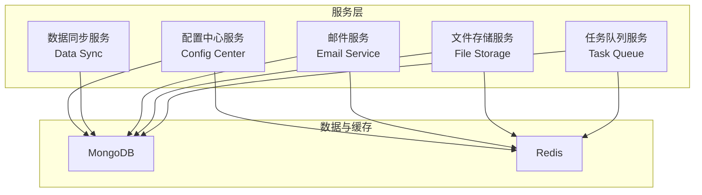
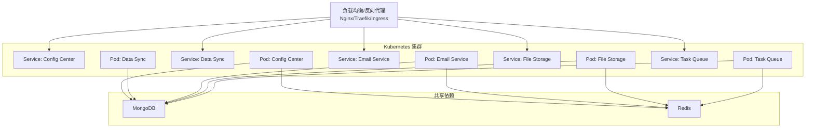
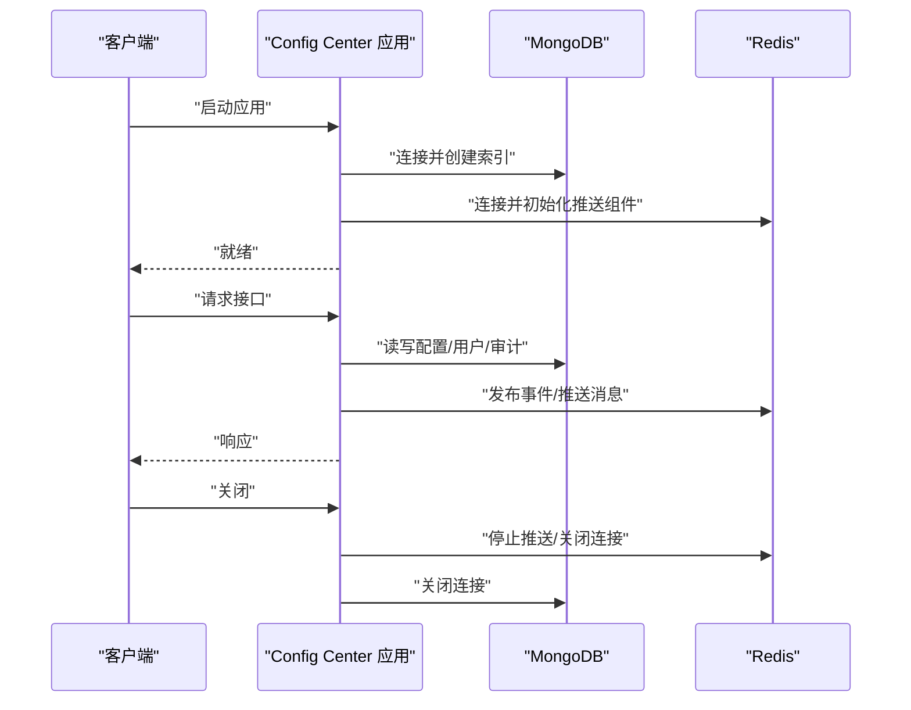
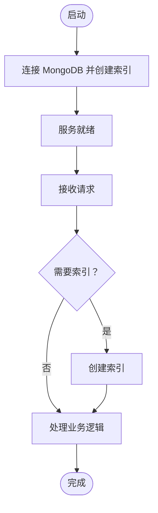
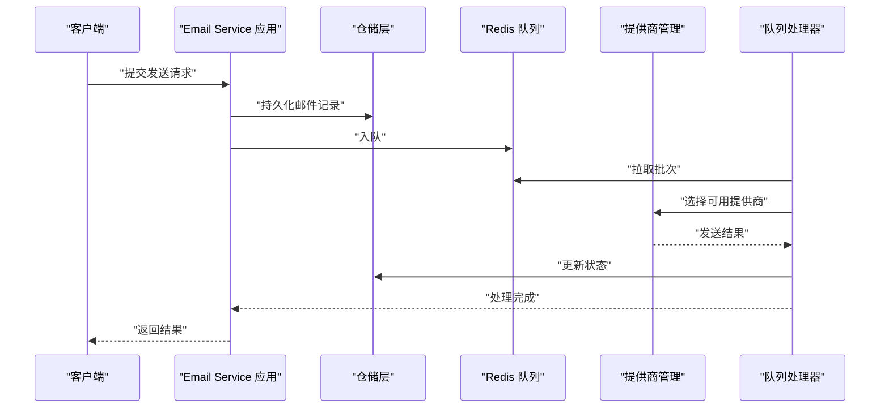
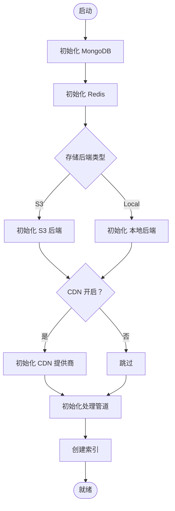

# 部署指南

<cite>
**本文引用的文件**
- [README.md](file://README.md)
- [pyproject.toml](file://pyproject.toml)
- [.github/workflows/ci.yml](file://.github/workflows/ci.yml)
- [src/taolib/testing/config_center/server/app.py](file://src/taolib/testing/config_center/server/app.py)
- [src/taolib/testing/config_center/server/config.py](file://src/taolib/testing/config_center/server/config.py)
- [src/taolib/testing/data_sync/server/app.py](file://src/taolib/testing/data_sync/server/app.py)
- [src/taolib/testing/data_sync/server/config.py](file://src/taolib/testing/data_sync/server/config.py)
- [src/taolib/testing/email_service/server/app.py](file://src/taolib/testing/email_service/server/app.py)
- [src/taolib/testing/email_service/server/config.py](file://src/taolib/testing/email_service/server/config.py)
- [src/taolib/testing/file_storage/server/app.py](file://src/taolib/testing/file_storage/server/app.py)
- [src/taolib/testing/file_storage/server/config.py](file://src/taolib/testing/file_storage/server/config.py)
- [src/taolib/testing/task_queue/server/config.py](file://src/taolib/testing/task_queue/server/config.py)
</cite>

## 目录
1. [简介](#简介)
2. [项目结构](#项目结构)
3. [核心组件](#核心组件)
4. [架构总览](#架构总览)
5. [详细组件分析](#详细组件分析)
6. [依赖分析](#依赖分析)
7. [性能考虑](#性能考虑)
8. [故障排查指南](#故障排查指南)
9. [结论](#结论)
10. [附录](#附录)

## 简介
本指南面向FlexLoop（taolib）项目，提供从单机到容器化再到Kubernetes集群的全栈部署方案，覆盖基础设施要求、环境变量配置、依赖服务设置、CI/CD流水线、自动化测试与发布、负载均衡与SSL、监控日志与告警、性能调优与故障恢复等运维主题。文档同时给出部署清单、配置示例与运维手册，帮助团队快速、安全、稳定地交付系统。

## 项目结构
FlexLoop采用多服务模块化设计，每个服务均以FastAPI为核心，结合MongoDB、Redis等外部依赖，形成独立可部署的服务单元。核心服务包括：
- 配置中心服务（Config Center）
- 数据同步服务（Data Sync）
- 邮件服务（Email Service）
- 文件存储服务（File Storage）
- 任务队列服务（Task Queue）

各服务均通过独立的配置模块加载环境变量，并在应用工厂中完成生命周期管理与中间件注册。

图表来源
- [src/taolib/testing/config_center/server/app.py:128-152](file://src/taolib/testing/config_center/server/app.py#L128-L152)
- [src/taolib/testing/data_sync/server/app.py:57-84](file://src/taolib/testing/data_sync/server/app.py#L57-L84)
- [src/taolib/testing/email_service/server/app.py:180-204](file://src/taolib/testing/email_service/server/app.py#L180-L204)
- [src/taolib/testing/file_storage/server/app.py:115-136](file://src/taolib/testing/file_storage/server/app.py#L115-L136)
- [src/taolib/testing/task_queue/server/config.py:10-48](file://src/taolib/testing/task_queue/server/config.py#L10-L48)

章节来源
- [README.md:47-66](file://README.md#L47-L66)
- [pyproject.toml:20-235](file://pyproject.toml#L20-L235)

## 核心组件
- 配置中心服务：提供统一配置管理、用户与权限、审计日志、推送通道等能力，依赖MongoDB与Redis。
- 数据同步服务：提供作业编排、日志追踪、失败记录与TTL清理，内置简单监控仪表盘。
- 邮件服务：支持多提供商（SendGrid、Mailgun、SES、SMTP）与故障转移，基于Redis队列异步发送。
- 文件存储服务：支持本地与S3兼容对象存储，提供签名URL、分片上传、缩略图生成与CDN集成。
- 任务队列服务：基于Redis的异步任务队列，支持工作进程数量配置与CORS。

章节来源
- [src/taolib/testing/config_center/server/app.py:128-152](file://src/taolib/testing/config_center/server/app.py#L128-L152)
- [src/taolib/testing/data_sync/server/app.py:57-84](file://src/taolib/testing/data_sync/server/app.py#L57-L84)
- [src/taolib/testing/email_service/server/app.py:180-204](file://src/taolib/testing/email_service/server/app.py#L180-L204)
- [src/taolib/testing/file_storage/server/app.py:115-136](file://src/taolib/testing/file_storage/server/app.py#L115-L136)
- [src/taolib/testing/task_queue/server/config.py:10-48](file://src/taolib/testing/task_queue/server/config.py#L10-L48)

## 架构总览
下图展示服务与依赖的关系，以及典型部署形态（单机、容器化、Kubernetes）的映射思路。

图表来源
- [src/taolib/testing/config_center/server/app.py:34-105](file://src/taolib/testing/config_center/server/app.py#L34-L105)
- [src/taolib/testing/data_sync/server/app.py:27-54](file://src/taolib/testing/data_sync/server/app.py#L27-L54)
- [src/taolib/testing/email_service/server/app.py:99-177](file://src/taolib/testing/email_service/server/app.py#L99-L177)
- [src/taolib/testing/file_storage/server/app.py:43-112](file://src/taolib/testing/file_storage/server/app.py#L43-L112)
- [src/taolib/testing/task_queue/server/config.py:20-30](file://src/taolib/testing/task_queue/server/config.py#L20-L30)

## 详细组件分析

### 配置中心服务（Config Center）
- 依赖：MongoDB、Redis、WebSocket推送、事件发布订阅。
- 生命周期：启动时建立MongoDB/Redis连接、创建索引、初始化系统角色；关闭时释放连接。
- 配置前缀：CONFIG_CENTER_，关键字段包括MongoDB/Redis连接串、JWT密钥、CORS、推送参数等。
- 部署要点：确保JWT密钥长度≥32字符；生产环境开启TLS与访问控制；Redis与MongoDB高可用。

图表来源
- [src/taolib/testing/config_center/server/app.py:27-105](file://src/taolib/testing/config_center/server/app.py#L27-L105)
- [src/taolib/testing/config_center/server/config.py:12-72](file://src/taolib/testing/config_center/server/config.py#L12-L72)

章节来源
- [src/taolib/testing/config_center/server/app.py:128-152](file://src/taolib/testing/config_center/server/app.py#L128-L152)
- [src/taolib/testing/config_center/server/config.py:12-72](file://src/taolib/testing/config_center/server/config.py#L12-L72)

### 数据同步服务（Data Sync）
- 依赖：MongoDB（含TTL索引）、CORS、静态仪表盘。
- 生命周期：启动时创建索引；关闭时释放连接。
- 配置前缀：DATA_SYNC_，包含MongoDB连接、JWT密钥（可选）、CORS等。
- 部署要点：为失败集合设置TTL自动清理；暴露健康检查与指标端点；前端仪表盘便于运维观察。

图表来源
- [src/taolib/testing/data_sync/server/app.py:21-54](file://src/taolib/testing/data_sync/server/app.py#L21-L54)
- [src/taolib/testing/data_sync/server/config.py:10-43](file://src/taolib/testing/data_sync/server/config.py#L10-L43)

章节来源
- [src/taolib/testing/data_sync/server/app.py:57-84](file://src/taolib/testing/data_sync/server/app.py#L57-L84)
- [src/taolib/testing/data_sync/server/config.py:10-43](file://src/taolib/testing/data_sync/server/config.py#L10-L43)

### 邮件服务（Email Service）
- 依赖：MongoDB、Redis、多种邮件提供商（SendGrid、Mailgun、SES、SMTP）、模板引擎、队列处理器。
- 生命周期：启动时初始化MongoDB/Redis、构建提供商链、启动队列处理器；关闭时停止处理器并释放连接。
- 配置前缀：EMAIL_SERVICE_，包含MongoDB/Redis、默认发件人、各提供商凭据、队列轮询与批大小等。
- 部署要点：按优先级配置多个提供商以实现故障转移；启用TLS与凭据加密；队列批大小与轮询间隔需结合吞吐调整。

图表来源
- [src/taolib/testing/email_service/server/app.py:94-177](file://src/taolib/testing/email_service/server/app.py#L94-L177)
- [src/taolib/testing/email_service/server/config.py:7-63](file://src/taolib/testing/email_service/server/config.py#L7-L63)

章节来源
- [src/taolib/testing/email_service/server/app.py:180-204](file://src/taolib/testing/email_service/server/app.py#L180-L204)
- [src/taolib/testing/email_service/server/config.py:7-63](file://src/taolib/testing/email_service/server/config.py#L7-L63)

### 文件存储服务（File Storage）
- 依赖：MongoDB、Redis、本地或S3存储后端、可选CDN与缩略图生成。
- 生命周期：启动时初始化存储后端与CDN、创建索引；关闭时释放连接。
- 配置前缀：FILE_STORAGE_，包含MongoDB/Redis、存储后端类型、S3参数、CDN开关与签名密钥、分片大小、缩略图开关等。
- 部署要点：生产环境务必设置签名URL密钥长度≥32字符；S3兼容端点需正确配置；CDN签名密钥用于安全访问。

图表来源
- [src/taolib/testing/file_storage/server/app.py:38-112](file://src/taolib/testing/file_storage/server/app.py#L38-L112)
- [src/taolib/testing/file_storage/server/config.py:12-86](file://src/taolib/testing/file_storage/server/config.py#L12-L86)

章节来源
- [src/taolib/testing/file_storage/server/app.py:115-136](file://src/taolib/testing/file_storage/server/app.py#L115-L136)
- [src/taolib/testing/file_storage/server/config.py:12-86](file://src/taolib/testing/file_storage/server/config.py#L12-L86)

### 任务队列服务（Task Queue）
- 依赖：MongoDB、Redis、工作进程管理。
- 配置前缀：TASK_QUEUE_，包含MongoDB/Redis连接、键前缀、工作进程数量、CORS等。
- 部署要点：根据业务负载调整工作进程数量；确保Redis与MongoDB高可用；暴露健康检查端点。

章节来源
- [src/taolib/testing/task_queue/server/config.py:10-48](file://src/taolib/testing/task_queue/server/config.py#L10-L48)

## 依赖分析
- 语言与运行时：Python >= 3.14。
- 可选依赖：doc、dev、test、auth、auth-redis、auth-fastapi、auth-server、config-server、config-client、data-sync、data-sync-server、log-platform、log-client、rate-limiter、site、task-queue、task-queue-server、email-service、email-service-server、analytics、analytics-server、file-storage、file-storage-server、file-storage-processing、file-storage-client、oauth、oauth-server、qrcode、qrcode-server、audit、audit-server、multi-agent、multi-agent-server。
- 测试与覆盖率：pytest、覆盖率阈值80%。

章节来源
- [README.md:47](file://README.md#L47)
- [pyproject.toml:20-318](file://pyproject.toml#L20-L318)

## 性能考虑
- 连接池与并发：为MongoDB与Redis配置合适的连接池大小与超时；限制并发请求与队列批大小。
- 缓存策略：利用Redis缓存热点配置与会话；合理设置TTL与内存淘汰策略。
- 存储优化：文件存储服务的分片大小与并发上传需与网络带宽匹配；S3端点与区域就近部署。
- 队列吞吐：邮件服务与任务队列的批大小与轮询间隔应结合实际QPS调优。
- 监控与指标：暴露健康检查与指标端点，结合外部监控系统进行容量规划。

## 故障排查指南
- 环境变量校验：配置中心与文件存储对敏感密钥长度有强制校验，需确保满足最小长度要求。
- 依赖连通性：启动阶段打印连接信息，若连接失败，优先检查MongoDB/Redis可达性与认证配置。
- 队列与推送：邮件服务的队列处理器需在启动后正常运行；推送组件需验证心跳与ACK机制。
- 日志与仪表盘：数据同步与邮件服务提供简单前端仪表盘，便于快速定位异常。

章节来源
- [src/taolib/testing/config_center/server/config.py:53-58](file://src/taolib/testing/config_center/server/config.py#L53-L58)
- [src/taolib/testing/file_storage/server/config.py:75-80](file://src/taolib/testing/file_storage/server/config.py#L75-L80)
- [src/taolib/testing/email_service/server/app.py:94-177](file://src/taolib/testing/email_service/server/app.py#L94-L177)
- [src/taolib/testing/data_sync/server/app.py:21-54](file://src/taolib/testing/data_sync/server/app.py#L21-L54)

## 结论
本指南提供了FlexLoop项目的端到端部署蓝图，涵盖单机、容器化与Kubernetes三种形态的实施要点。通过严格的环境变量配置、依赖服务治理、CI/CD与自动化测试、监控与告警体系，以及性能与故障恢复最佳实践，可确保系统在生产环境中稳定运行。

## 附录

### 基础设施要求
- 操作系统：Linux（推荐Ubuntu/CentOS）或Windows（用于开发与测试）。
- 运行时：Python >= 3.14。
- 容器化：Docker与Kubernetes（可选）。
- 依赖服务：MongoDB、Redis（建议主从或集群），对象存储（可选S3兼容）。

章节来源
- [README.md:47](file://README.md#L47)
- [pyproject.toml:20-318](file://pyproject.toml#L20-L318)

### 环境变量配置清单（按服务）
- 配置中心服务（CONFIG_CENTER_）
  - mongo_url、mongo_db、redis_url、jwt_secret（≥32字符）、jwt_algorithm、access_token_expire_minutes、refresh_token_expire_days、host、port、debug、cors_origins、push_*系列参数
  - 参考：[src/taolib/testing/config_center/server/config.py:12-72](file://src/taolib/testing/config_center/server/config.py#L12-L72)

- 数据同步服务（DATA_SYNC_）
  - mongo_url、mongo_db、jwt_secret（可选）、jwt_algorithm、host、port、debug、cors_origins
  - 参考：[src/taolib/testing/data_sync/server/config.py:10-43](file://src/taolib/testing/data_sync/server/config.py#L10-L43)

- 邮件服务（EMAIL_SERVICE_）
  - mongo_url、mongo_db、redis_url、host、port、debug、cors_origins、default_sender、default_sender_name、unsubscribe_base_url、sendgrid_api_key、mailgun_api_key、mailgun_domain、ses_region、ses_access_key_id、ses_secret_access_key、smtp_host、smtp_port、smtp_username、smtp_password、smtp_use_tls、queue_poll_interval、queue_batch_size、max_retries
  - 参考：[src/taolib/testing/email_service/server/config.py:7-63](file://src/taolib/testing/email_service/server/config.py#L7-L63)

- 文件存储服务（FILE_STORAGE_）
  - mongo_url、mongo_db、redis_url、storage_backend、s3_endpoint_url、s3_access_key、s3_secret_key、s3_region、local_storage_path、cdn_enabled、cdn_base_url、cdn_signing_key、signed_url_secret（≥32字符）、signed_url_default_expires、upload_session_ttl_hours、max_chunk_size_bytes、default_chunk_size_bytes、thumbnail_enabled、host、port、debug、cors_origins
  - 参考：[src/taolib/testing/file_storage/server/config.py:12-86](file://src/taolib/testing/file_storage/server/config.py#L12-L86)

- 任务队列服务（TASK_QUEUE_）
  - mongo_url、mongo_db、redis_url、redis_key_prefix、num_workers、host、port、debug、cors_origins
  - 参考：[src/taolib/testing/task_queue/server/config.py:10-48](file://src/taolib/testing/task_queue/server/config.py#L10-L48)

### CI/CD流水线与自动化测试
- CI流水线（GitHub Actions）
  - 测试矩阵：ubuntu-latest与windows-latest，Python 3.14；安装测试依赖并运行pytest，覆盖率阈值80%；上传覆盖率报告至Codecov（特定平台）。
  - 代码质量：安装pre-commit并运行钩子；依赖审计使用pip-audit。
  - 参考：[.github/workflows/ci.yml:1-105](file://.github/workflows/ci.yml#L1-L105)

章节来源
- [.github/workflows/ci.yml:16-105](file://.github/workflows/ci.yml#L16-L105)

### Docker容器化部署（步骤概览）
- 为每个服务编写独立Dockerfile，基于Python 3.14镜像，复制项目代码，安装可选依赖（如doc/dev/test），设置工作目录与入口命令。
- 使用docker-compose编排：定义服务、端口映射、环境变量挂载、卷挂载（如本地存储）、依赖服务链接（MongoDB/Redis）。
- 生产建议：分离配置文件与镜像；使用只读根文件系统与非root用户；启用健康检查与重启策略；使用Secrets管理敏感变量。

### Kubernetes集群部署（步骤概览）
- 资源编排：Deployment（副本数、滚动更新策略）、Service（ClusterIP/LoadBalancer）、ConfigMap（环境变量）、Secret（密钥）。
- 依赖服务：通过独立Deployment与Service提供MongoDB与Redis；使用Headless Service或StatefulSets保障稳定性。
- Ingress/网关：Traefik/Nginx Ingress暴露服务，配置TLS证书与域名绑定；为仪表盘页面提供静态路由。
- 资源配额：为Pod设置requests/limits；使用HPA根据CPU/自定义指标扩缩容。
- 健康检查：liveness/readiness探针；为数据库连接与关键依赖添加探测。

### 负载均衡、SSL与域名绑定
- 负载均衡：Nginx/Traefik/Ingress作为入口，支持HTTP/HTTPS转发与会话亲和。
- SSL证书：Let’s Encrypt（cert-manager）自动签发与续期；或手动上传证书至Ingress/网关。
- 域名绑定：DNS解析到LB/Ingress入口；在Ingress中配置host规则与路径转发。

### 监控、日志与告警
- 监控：Prometheus采集指标，Grafana可视化；为各服务暴露/metrics端点。
- 日志：集中式日志（如ELK/ECS）收集容器日志；结构化输出便于检索。
- 告警：基于阈值与异常模式触发告警（邮件/IM/Webhook）。

### 性能调优与资源优化
- 连接池：为MongoDB与Redis设置合理的最大连接数与空闲超时。
- 队列与批处理：根据吞吐量调整批大小与轮询间隔；避免过度并发导致抖动。
- 存储：S3端点就近部署；分片大小与并发上传匹配带宽；启用CDN加速静态资源。
- 缓存：Redis键空间过期策略与内存回收；热点数据预热。

### 故障恢复与备份
- 备份策略：定期导出MongoDB数据；备份Redis快照；版本化存储文件与元数据。
- 恢复演练：定期进行灾难恢复演练；验证恢复时间目标（RTO）与恢复点目标（RPO）。
- 高可用：MongoDB副本集/分片；Redis哨兵/集群；多可用区部署与跨区复制。