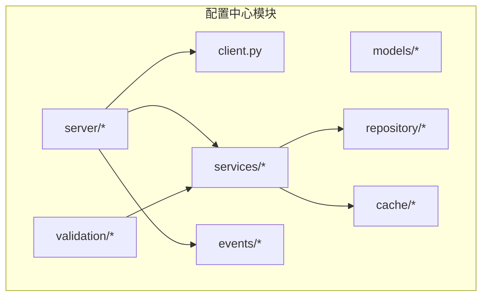
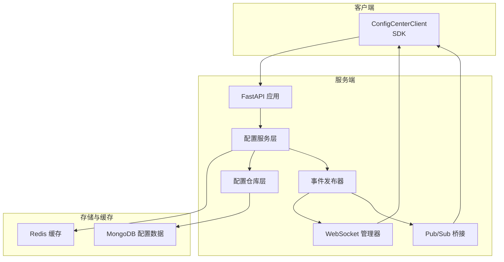
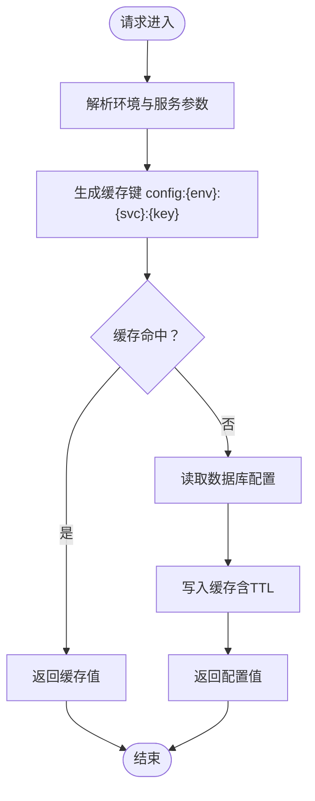
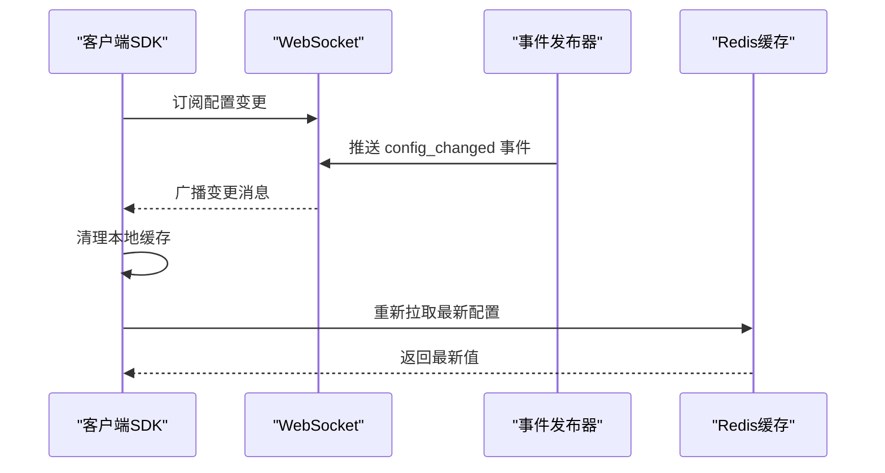
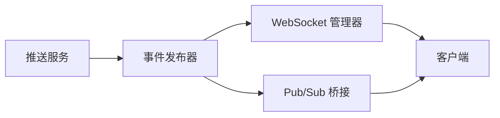
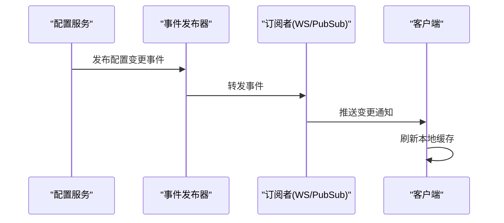
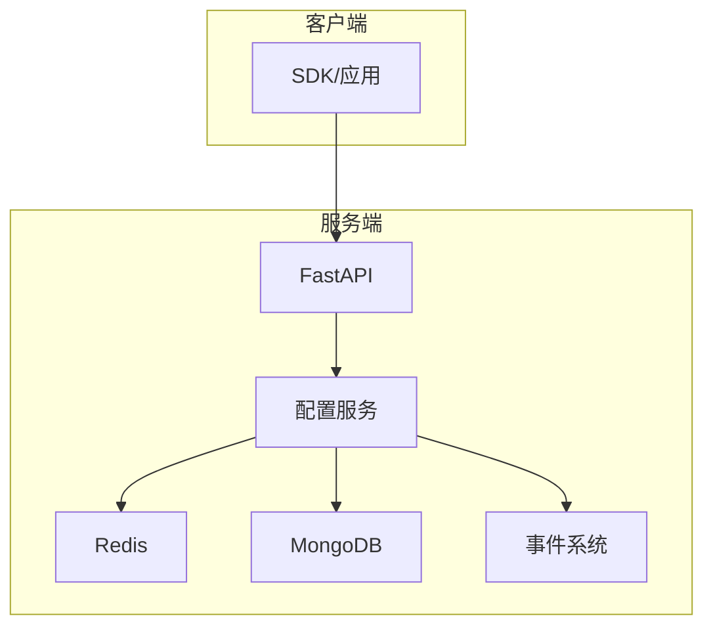
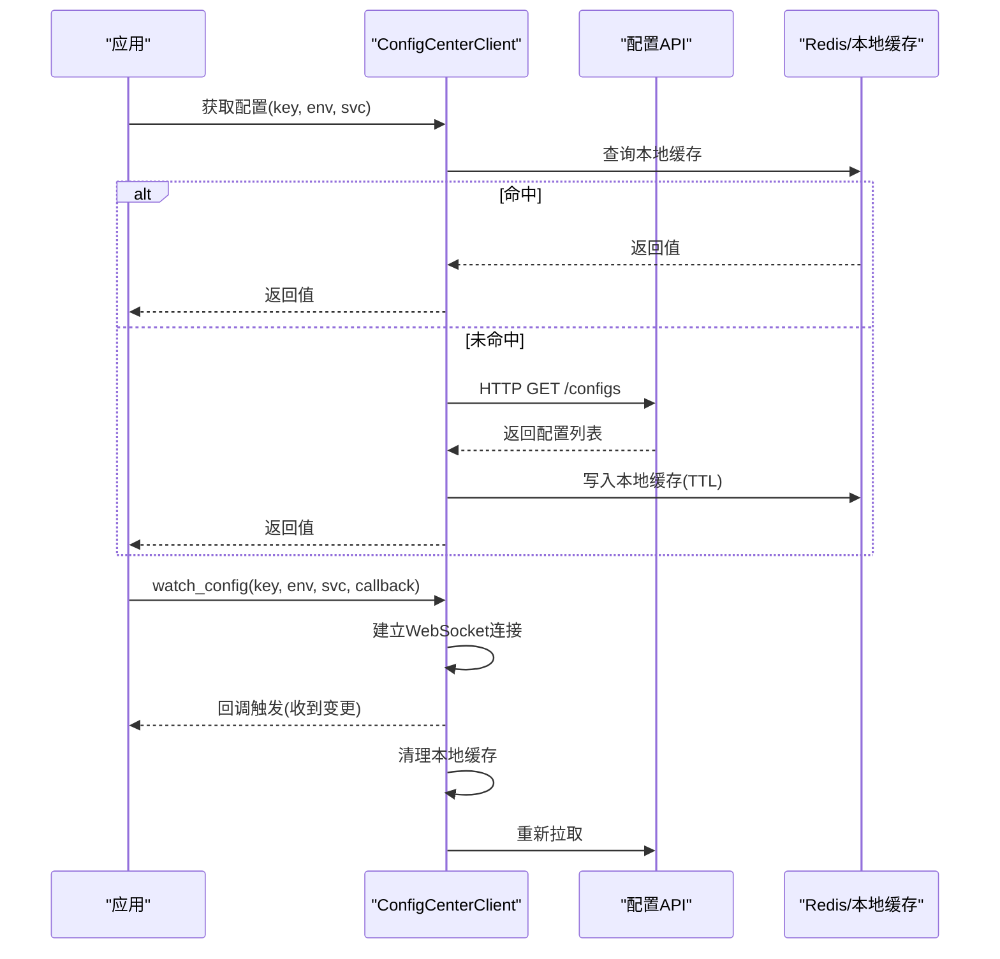
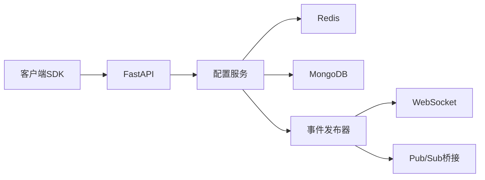

# 分布式配置

<cite>
**本文引用的文件**
- [src/taolib/testing/config_center/__init__.py](file://src/taolib/testing/config_center/__init__.py)
- [src/taolib/testing/config_center/client.py](file://src/taolib/testing/config_center/client.py)
- [src/taolib/testing/config_center/cache/config_cache.py](file://src/taolib/testing/config_center/cache/config_cache.py)
- [src/taolib/testing/config_center/cache/redis_client.py](file://src/taolib/testing/config_center/cache/redis_client.py)
- [src/taolib/testing/config_center/cache/keys.py](file://src/taolib/testing/config_center/cache/keys.py)
- [src/taolib/testing/config_center/models/enums.py](file://src/taolib/testing/config_center/models/enums.py)
- [src/taolib/testing/config_center/server/app.py](file://src/taolib/testing/config_center/server/app.py)
- [src/taolib/testing/config_center/server/config.py](file://src/taolib/testing/config_center/server/config.py)
- [src/taolib/testing/config_center/server/websocket/pubsub_bridge.py](file://src/taolib/testing/config_center/server/websocket/pubsub_bridge.py)
- [src/taolib/testing/config_center/server/websocket/manager.py](file://src/taolib/testing/config_center/server/websocket/manager.py)
- [src/taolib/testing/config_center/server/websocket/message_buffer.py](file://src/taolib/testing/config_center/server/websocket/message_buffer.py)
- [src/taolib/testing/config_center/server/websocket/protocols.py](file://src/taolib/testing/config_center/server/websocket/protocols.py)
- [src/taolib/testing/config_center/server/websocket/presence.py](file://src/taolib/testing/config_center/server/websocket/presence.py)
- [src/taolib/testing/config_center/server/websocket/heartbeat.py](file://src/taolib/testing/config_center/server/websocket/heartbeat.py)
- [src/taolib/testing/config_center/server/api/configs.py](file://src/taolib/testing/config_center/server/api/configs.py)
- [src/taolib/testing/config_center/server/api/push.py](file://src/taolib/testing/config_center/server/api/push.py)
- [src/taolib/testing/config_center/services/config_service.py](file://src/taolib/testing/config_center/services/config_service.py)
- [src/taolib/testing/config_center/repository/config_repo.py](file://src/taolib/testing/config_center/repository/config_repo.py)
- [src/taolib/testing/config_center/events/publisher.py](file://src/taolib/testing/config_center/events/publisher.py)
- [src/taolib/testing/config_center/events/handlers.py](file://src/taolib/testing/config_center/events/handlers.py)
- [src/taolib/testing/config_center/validation/base.py](file://src/taolib/testing/config_center/validation/base.py)
- [src/taolib/testing/config_center/validation/json_schema.py](file://src/taolib/testing/config_center/validation/json_schema.py)
- [src/taolib/testing/config_center/validation/registry.py](file://src/taolib/testing/config_center/validation/registry.py)
- [src/taolib/testing/_base/redis_pool.py](file://src/taolib/testing/_base/redis_pool.py)
- [src/taolib/testing/_base/cache_keys.py](file://src/taolib/testing/_base/cache_keys.py)
- [tests/testing/test_config_center/test_client.py](file://tests/testing/test_config_center/test_client.py)
- [tests/testing/test_config_center/test_cache.py](file://tests/testing/test_config_center/test_cache.py)
- [tests/testing/test_config_center/test_api_integration.py](file://tests/testing/test_config_center/test_api_integration.py)
- [tests/testing/test_config_center/test_push_service.py](file://tests/testing/test_config_center/test_push_service.py)
</cite>

## 目录
1. [简介](#简介)
2. [项目结构](#项目结构)
3. [核心组件](#核心组件)
4. [架构总览](#架构总览)
5. [详细组件分析](#详细组件分析)
6. [依赖关系分析](#依赖关系分析)
7. [性能考虑](#性能考虑)
8. [故障排查指南](#故障排查指南)
9. [结论](#结论)
10. [附录](#附录)

## 简介
本技术文档围绕分布式配置模块展开，重点阐述多环境配置管理（开发、测试、生产）的架构设计与隔离机制；配置热更新的实现原理（Redis缓存策略、失效机制与一致性保障）；配置同步策略（推送服务、WebSocket实时更新与Pub/Sub桥接）；事件驱动架构（事件发布、订阅与处理流程）；部署架构与数据流；以及配置中心与客户端SDK的集成示例与最佳实践。

## 项目结构
配置中心模块位于 testing 子包中，采用分层组织：models（数据模型）、repository（数据访问）、cache（缓存）、services（业务）、validation（校验）、server（Web服务与API）、events（事件系统）、client（客户端SDK）等。该结构清晰分离关注点，便于扩展与维护。

**图表来源**
- [src/taolib/testing/config_center/__init__.py:1-70](file://src/taolib/testing/config_center/__init__.py#L1-L70)
- [src/taolib/testing/config_center/client.py:1-210](file://src/taolib/testing/config_center/client.py#L1-L210)

**章节来源**
- [src/taolib/testing/config_center/__init__.py:1-70](file://src/taolib/testing/config_center/__init__.py#L1-L70)

## 核心组件
- 客户端SDK：提供同步/异步获取配置、全量拉取、WebSocket监听配置变更的能力，并内置本地缓存与TTL。
- 缓存层：支持Redis与内存两种实现，统一协议接口，提供键空间命名规范与批量失效能力。
- 服务层：封装配置的增删改查、版本控制、审计与推送服务。
- 事件系统：发布配置变更事件，配合WebSocket与Pub/Sub桥接实现实时通知。
- Web服务：基于FastAPI提供REST API与WebSocket端点，承载认证、路由与推送。
- 校验框架：提供通用校验器与注册表，支持JSON Schema等校验策略。
- 数据模型：定义环境、配置、版本、审计与用户/角色等实体与枚举。

**章节来源**
- [src/taolib/testing/config_center/client.py:18-210](file://src/taolib/testing/config_center/client.py#L18-L210)
- [src/taolib/testing/config_center/cache/config_cache.py:18-172](file://src/taolib/testing/config_center/cache/config_cache.py#L18-L172)
- [src/taolib/testing/config_center/models/enums.py](file://src/taolib/testing/config_center/models/enums.py)
- [src/taolib/testing/config_center/server/app.py](file://src/taolib/testing/config_center/server/app.py)
- [src/taolib/testing/config_center/server/api/configs.py](file://src/taolib/testing/config_center/server/api/configs.py)
- [src/taolib/testing/config_center/server/api/push.py](file://src/taolib/testing/config_center/server/api/push.py)
- [src/taolib/testing/config_center/services/config_service.py](file://src/taolib/testing/config_center/services/config_service.py)
- [src/taolib/testing/config_center/events/publisher.py](file://src/taolib/testing/config_center/events/publisher.py)
- [src/taolib/testing/config_center/validation/base.py](file://src/taolib/testing/config_center/validation/base.py)

## 架构总览
下图展示了从客户端到服务端、缓存与事件系统的整体交互路径，体现多环境隔离、热更新与一致性保障的关键环节。

**图表来源**
- [src/taolib/testing/config_center/client.py:18-210](file://src/taolib/testing/config_center/client.py#L18-L210)
- [src/taolib/testing/config_center/server/app.py](file://src/taolib/testing/config_center/server/app.py)
- [src/taolib/testing/config_center/server/api/configs.py](file://src/taolib/testing/config_center/server/api/configs.py)
- [src/taolib/testing/config_center/server/api/push.py](file://src/taolib/testing/config_center/server/api/push.py)
- [src/taolib/testing/config_center/services/config_service.py](file://src/taolib/testing/config_center/services/config_service.py)
- [src/taolib/testing/config_center/repository/config_repo.py](file://src/taolib/testing/config_center/repository/config_repo.py)
- [src/taolib/testing/config_center/events/publisher.py](file://src/taolib/testing/config_center/events/publisher.py)
- [src/taolib/testing/config_center/server/websocket/manager.py](file://src/taolib/testing/config_center/server/websocket/manager.py)
- [src/taolib/testing/config_center/server/websocket/pubsub_bridge.py](file://src/taolib/testing/config_center/server/websocket/pubsub_bridge.py)

## 详细组件分析

### 多环境配置管理与隔离
- 环境枚举与模型：通过环境枚举与配置模型，区分开发、测试、生产等环境，确保不同环境下的配置相互隔离。
- 键空间命名：缓存键采用“config:{environment}:{service}:{key}”规范，天然隔离不同环境与服务。
- API参数：查询接口通过环境与服务参数限定作用域，避免跨环境误读。

**图表来源**
- [src/taolib/testing/config_center/cache/keys.py:7-79](file://src/taolib/testing/config_center/cache/keys.py#L7-L79)
- [src/taolib/testing/config_center/cache/config_cache.py:86-123](file://src/taolib/testing/config_center/cache/config_cache.py#L86-L123)
- [src/taolib/testing/config_center/server/api/configs.py](file://src/taolib/testing/config_center/server/api/configs.py)

**章节来源**
- [src/taolib/testing/config_center/models/enums.py](file://src/taolib/testing/config_center/models/enums.py)
- [src/taolib/testing/config_center/cache/keys.py:7-79](file://src/taolib/testing/config_center/cache/keys.py#L7-L79)
- [src/taolib/testing/config_center/server/api/configs.py](file://src/taolib/testing/config_center/server/api/configs.py)

### 配置热更新机制与Redis缓存策略
- 缓存协议与实现：统一的ConfigCacheProtocol接口，RedisConfigCache与InMemoryConfigCache分别适配生产与测试场景。
- TTL与失效：客户端本地缓存与服务端Redis缓存均具备TTL；配置变更时通过事件触发失效或主动清除。
- 一致性保障：事件发布后，客户端收到变更通知，清理本地缓存并重新拉取，确保最终一致。

**图表来源**
- [src/taolib/testing/config_center/client.py:169-210](file://src/taolib/testing/config_center/client.py#L169-L210)
- [src/taolib/testing/config_center/events/publisher.py](file://src/taolib/testing/config_center/events/publisher.py)
- [src/taolib/testing/config_center/cache/config_cache.py:75-123](file://src/taolib/testing/config_center/cache/config_cache.py#L75-L123)

**章节来源**
- [src/taolib/testing/config_center/cache/config_cache.py:18-172](file://src/taolib/testing/config_center/cache/config_cache.py#L18-L172)
- [src/taolib/testing/config_center/client.py:18-210](file://src/taolib/testing/config_center/client.py#L18-L210)

### 配置同步策略：推送服务、WebSocket与Pub/Sub桥接
- 推送服务：服务端提供推送接口，结合事件系统与WebSocket管理器实现广播。
- WebSocket：建立长连接，支持心跳、消息缓冲与在线状态管理，提升实时性与可靠性。
- Pub/Sub桥接：将事件系统与WebSocket/外部系统桥接，实现跨实例与跨进程的一致通知。

**图表来源**
- [src/taolib/testing/config_center/server/api/push.py](file://src/taolib/testing/config_center/server/api/push.py)
- [src/taolib/testing/config_center/events/publisher.py](file://src/taolib/testing/config_center/events/publisher.py)
- [src/taolib/testing/config_center/server/websocket/manager.py](file://src/taolib/testing/config_center/server/websocket/manager.py)
- [src/taolib/testing/config_center/server/websocket/pubsub_bridge.py](file://src/taolib/testing/config_center/server/websocket/pubsub_bridge.py)

**章节来源**
- [src/taolib/testing/config_center/server/api/push.py](file://src/taolib/testing/config_center/server/api/push.py)
- [src/taolib/testing/config_center/server/websocket/manager.py](file://src/taolib/testing/config_center/server/websocket/manager.py)
- [src/taolib/testing/config_center/server/websocket/pubsub_bridge.py](file://src/taolib/testing/config_center/server/websocket/pubsub_bridge.py)

### 事件驱动架构：发布、订阅与处理
- 发布：配置变更由服务层触发，通过事件发布器统一发出。
- 订阅：WebSocket与Pub/Sub桥接负责接收并转发事件。
- 处理：客户端收到事件后清理缓存并刷新配置，形成闭环。

**图表来源**
- [src/taolib/testing/config_center/services/config_service.py](file://src/taolib/testing/config_center/services/config_service.py)
- [src/taolib/testing/config_center/events/publisher.py](file://src/taolib/testing/config_center/events/publisher.py)
- [src/taolib/testing/config_center/server/websocket/manager.py](file://src/taolib/testing/config_center/server/websocket/manager.py)
- [src/taolib/testing/config_center/server/websocket/pubsub_bridge.py](file://src/taolib/testing/config_center/server/websocket/pubsub_bridge.py)
- [src/taolib/testing/config_center/client.py:169-210](file://src/taolib/testing/config_center/client.py#L169-L210)

**章节来源**
- [src/taolib/testing/config_center/events/handlers.py](file://src/taolib/testing/config_center/events/handlers.py)
- [src/taolib/testing/config_center/events/publisher.py](file://src/taolib/testing/config_center/events/publisher.py)

### 部署架构与数据流
- 部署架构：客户端SDK通过HTTP与WebSocket接入服务端；服务端依赖Redis缓存与MongoDB持久化；事件系统贯穿全链路。
- 数据流：客户端请求—>服务端校验与鉴权—>缓存命中/回源—>事件发布—>客户端刷新—>完成。

**图表来源**
- [src/taolib/testing/config_center/server/app.py](file://src/taolib/testing/config_center/server/app.py)
- [src/taolib/testing/config_center/cache/config_cache.py:75-123](file://src/taolib/testing/config_center/cache/config_cache.py#L75-L123)
- [src/taolib/testing/config_center/repository/config_repo.py](file://src/taolib/testing/config_center/repository/config_repo.py)
- [src/taolib/testing/config_center/events/publisher.py](file://src/taolib/testing/config_center/events/publisher.py)

**章节来源**
- [src/taolib/testing/config_center/server/config.py](file://src/taolib/testing/config_center/server/config.py)
- [src/taolib/testing/config_center/server/app.py](file://src/taolib/testing/config_center/server/app.py)

### 客户端SDK集成示例与实时更新
- 同步/异步获取：支持同步与异步两种方式获取单个配置或全量配置。
- 监听变更：通过WebSocket订阅指定环境与服务的配置变更，收到事件后自动刷新缓存。
- 本地缓存：内置TTL缓存，降低对服务端与Redis的压力。

**图表来源**
- [src/taolib/testing/config_center/client.py:55-167](file://src/taolib/testing/config_center/client.py#L55-L167)
- [src/taolib/testing/config_center/client.py:169-210](file://src/taolib/testing/config_center/client.py#L169-L210)

**章节来源**
- [src/taolib/testing/config_center/client.py:18-210](file://src/taolib/testing/config_center/client.py#L18-L210)

## 依赖关系分析
- 组件耦合：服务层依赖仓库层与缓存层；事件系统独立于业务，通过发布器与订阅器解耦；客户端SDK仅依赖服务端暴露的HTTP与WebSocket接口。
- 外部依赖：Redis（缓存）、MongoDB（持久化）、websockets（WebSocket）、httpx（HTTP）、fastapi（Web框架）。
- 关键依赖链：客户端SDK → FastAPI → 配置服务 → Redis/MongoDB；事件发布 → WebSocket/Pub/Sub → 客户端。

**图表来源**
- [src/taolib/testing/config_center/client.py:18-210](file://src/taolib/testing/config_center/client.py#L18-L210)
- [src/taolib/testing/config_center/server/app.py](file://src/taolib/testing/config_center/server/app.py)
- [src/taolib/testing/config_center/services/config_service.py](file://src/taolib/testing/config_center/services/config_service.py)
- [src/taolib/testing/config_center/cache/config_cache.py:75-123](file://src/taolib/testing/config_center/cache/config_cache.py#L75-L123)
- [src/taolib/testing/config_center/repository/config_repo.py](file://src/taolib/testing/config_center/repository/config_repo.py)
- [src/taolib/testing/config_center/events/publisher.py](file://src/taolib/testing/config_center/events/publisher.py)
- [src/taolib/testing/config_center/server/websocket/manager.py](file://src/taolib/testing/config_center/server/websocket/manager.py)
- [src/taolib/testing/config_center/server/websocket/pubsub_bridge.py](file://src/taolib/testing/config_center/server/websocket/pubsub_bridge.py)

**章节来源**
- [src/taolib/testing/config_center/server/app.py](file://src/taolib/testing/config_center/server/app.py)
- [src/taolib/testing/config_center/services/config_service.py](file://src/taolib/testing/config_center/services/config_service.py)

## 性能考虑
- 缓存策略
  - 本地缓存：客户端SDK内置TTL缓存，减少重复请求与网络开销。
  - Redis缓存：服务端Redis缓存热点配置，降低数据库压力；支持批量失效与键空间隔离。
- 读写路径优化
  - 先本地缓存，再Redis，最后回源数据库；写入时同时更新缓存与数据库。
  - 批量删除：通过键模式批量清理，避免逐条删除带来的延迟。
- 实时性与可靠性
  - WebSocket长连接+心跳+消息缓冲，提升实时性与断线重连能力。
  - Pub/Sub桥接实现跨实例广播，避免单点瓶颈。
- 资源管理
  - Redis客户端池化与连接复用；HTTP客户端超时与重试策略。

[本节为通用性能建议，无需特定文件引用]

## 故障排查指南
- 客户端无法获取配置
  - 检查认证Token与基础URL；确认HTTP请求是否成功；查看日志中的错误提示。
  - 参考路径：[src/taolib/testing/config_center/client.py:71-95](file://src/taolib/testing/config_center/client.py#L71-L95)
- WebSocket监听异常
  - 确认已安装websockets依赖；检查WebSocket连接URI与心跳机制；观察连接关闭与重连行为。
  - 参考路径：[src/taolib/testing/config_center/client.py:184-207](file://src/taolib/testing/config_center/client.py#L184-L207)
- 缓存不一致或脏读
  - 确认事件发布与失效流程是否执行；检查Redis键空间命名与TTL设置；验证批量删除逻辑。
  - 参考路径：[src/taolib/testing/config_center/cache/config_cache.py:115-123](file://src/taolib/testing/config_center/cache/config_cache.py#L115-L123)
- 推送与广播问题
  - 检查事件发布器与WebSocket/Pub/Sub桥接状态；核对订阅参数与过滤条件。
  - 参考路径：[src/taolib/testing/config_center/server/api/push.py](file://src/taolib/testing/config_center/server/api/push.py)
  - 参考路径：[src/taolib/testing/config_center/server/websocket/pubsub_bridge.py](file://src/taolib/testing/config_center/server/websocket/pubsub_bridge.py)

**章节来源**
- [src/taolib/testing/config_center/client.py:71-95](file://src/taolib/testing/config_center/client.py#L71-L95)
- [src/taolib/testing/config_center/client.py:184-207](file://src/taolib/testing/config_center/client.py#L184-L207)
- [src/taolib/testing/config_center/cache/config_cache.py:115-123](file://src/taolib/testing/config_center/cache/config_cache.py#L115-L123)
- [src/taolib/testing/config_center/server/api/push.py](file://src/taolib/testing/config_center/server/api/push.py)
- [src/taolib/testing/config_center/server/websocket/pubsub_bridge.py](file://src/taolib/testing/config_center/server/websocket/pubsub_bridge.py)

## 结论
本模块通过清晰的分层设计与事件驱动机制，实现了多环境隔离、高效缓存与实时推送。客户端SDK提供简洁易用的接口，服务端通过Redis与MongoDB保障性能与一致性，WebSocket与Pub/Sub桥接确保大规模场景下的可扩展性。结合本文提供的部署与优化建议，可在生产环境中稳定运行并快速响应配置变更。

## 附录
- 测试参考
  - 客户端行为与缓存策略测试：[tests/testing/test_config_center/test_client.py](file://tests/testing/test_config_center/test_client.py)
  - 缓存实现与失效测试：[tests/testing/test_config_center/test_cache.py](file://tests/testing/test_config_center/test_cache.py)
  - API集成与推送服务测试：[tests/testing/test_config_center/test_api_integration.py](file://tests/testing/test_config_center/test_api_integration.py)
  - 推送服务专项测试：[tests/testing/test_config_center/test_push_service.py](file://tests/testing/test_config_center/test_push_service.py)