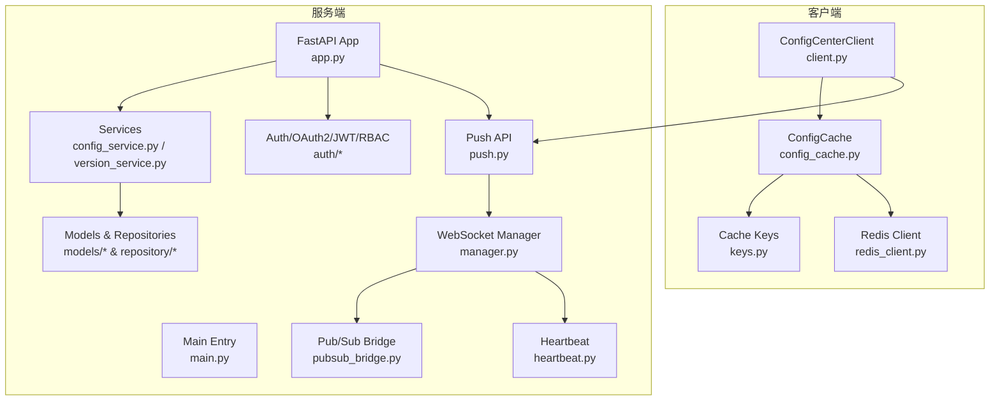
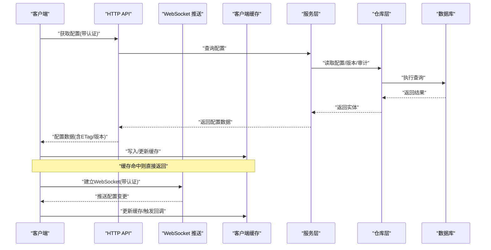
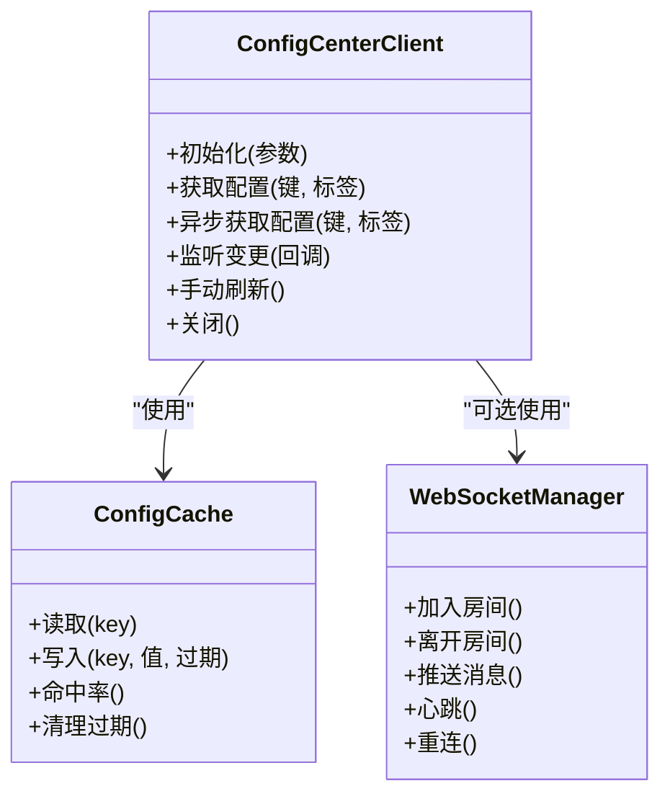
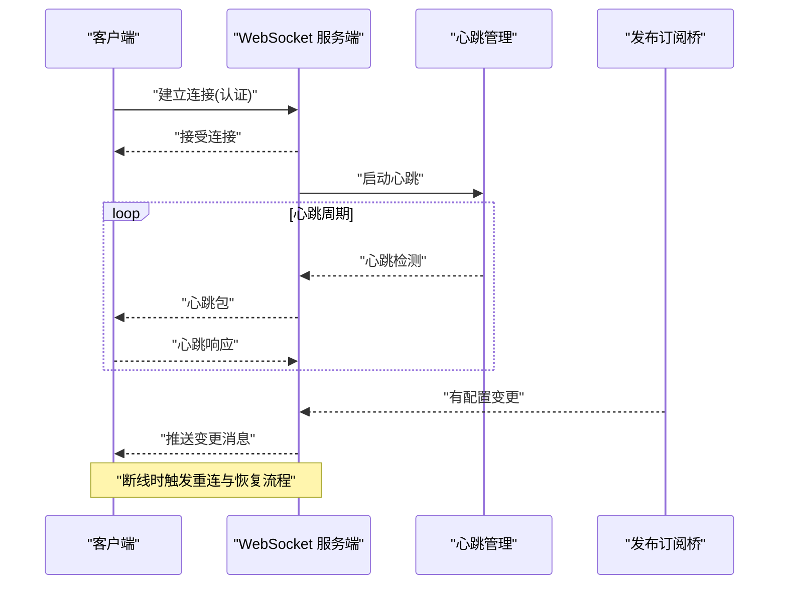
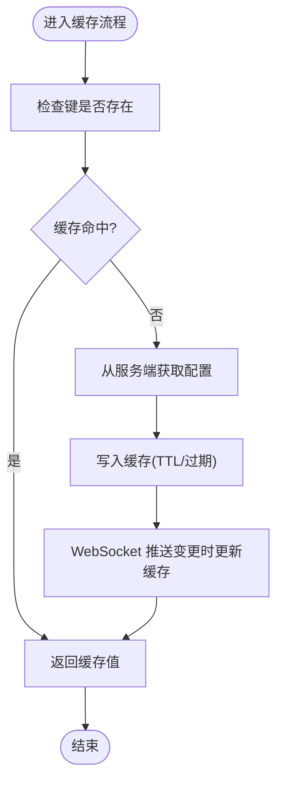
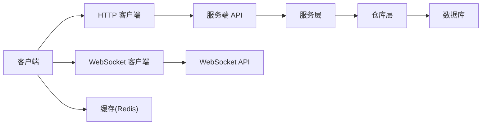

# 客户端集成

<cite>
**本文引用的文件**
- [client.py](file://src/taolib/testing/config_center/client.py)
- [test_client.py](file://tests/testing/test_config_center/test_client.py)
- [config.py](file://src/taolib/testing/config_center/server/config.py)
- [app.py](file://src/taolib/testing/config_center/server/app.py)
- [main.py](file://src/taolib/testing/config_center/server/main.py)
- [push.py](file://src/taolib/testing/config_center/server/api/push.py)
- [manager.py](file://src/taolib/testing/config_center/server/websocket/manager.py)
- [heartbeat.py](file://src/taolib/testing/config_center/server/websocket/heartbeat.py)
- [protocols.py](file://src/taolib/testing/config_center/server/websocket/protocols.py)
- [message_buffer.py](file://src/taolib/testing/config_center/server/websocket/message_buffer.py)
- [pubsub_bridge.py](file://src/taolib/testing/config_center/server/websocket/pubsub_bridge.py)
- [keys.py](file://src/taolib/testing/config_center/cache/keys.py)
- [config_cache.py](file://src/taolib/testing/config_center/cache/config_cache.py)
- [redis_client.py](file://src/taolib/testing/config_center/cache/redis_client.py)
- [analytics.js](file://src/taolib/testing/analytics/sdk/analytics.js)
- [multi_agent_example.py](file://examples/multi_agent_example.py)
- [oauth2.py](file://src/taolib/testing/config_center/server/auth/oauth2.py)
- [jwt_handler.py](file://src/taolib/testing/config_center/server/auth/jwt_handler.py)
- [rbac.py](file://src/taolib/testing/config_center/server/auth/rbac.py)
- [api_key.py](file://src/taolib/testing/config_center/auth/api_key.py)
- [config.py](file://src/taolib/testing/config_center/models/config.py)
- [enums.py](file://src/taolib/testing/config_center/models/enums.py)
- [version.py](file://src/taolib/testing/config_center/models/version.py)
- [audit.py](file://src/taolib/testing/config_center/models/audit.py)
- [user.py](file://src/taolib/testing/config_center/models/user.py)
- [config_repo.py](file://src/taolib/testing/config_center/repository/config_repo.py)
- [version_repo.py](file://src/taolib/testing/config_center/repository/version_repo.py)
- [audit_repo.py](file://src/taolib/testing/config_center/repository/audit_repo.py)
- [user_repo.py](file://src/taolib/testing/config_center/repository/user_repo.py)
- [config_service.py](file://src/taolib/testing/config_center/services/config_service.py)
- [version_service.py](file://src/taolib/testing/config_center/services/version_service.py)
- [analytics_service.py](file://src/taolib/testing/analytics/services/analytics_service.py)
- [README.md](file://README.md)
</cite>

## 目录
1. [简介](#简介)
2. [项目结构](#项目结构)
3. [核心组件](#核心组件)
4. [架构总览](#架构总览)
5. [详细组件分析](#详细组件分析)
6. [依赖关系分析](#依赖关系分析)
7. [性能考虑](#性能考虑)
8. [故障排除指南](#故障排除指南)
9. [结论](#结论)
10. [附录](#附录)

## 简介
本文件面向“配置中心客户端集成”的技术文档，聚焦于客户端如何初始化、连接与认证、获取配置、监听变更、手动刷新与错误处理，以及与服务端通过 WebSocket 的连接建立与维护（心跳、重连、断线恢复）。同时涵盖客户端缓存策略与本地存储、缓存失效与数据同步、一致性保障；提供 Python、JavaScript 等多语言 SDK 使用示例；给出配置项、性能调优参数与监控指标建议；最后提供完整故障排除指南与协议交互说明。

## 项目结构
配置中心客户端位于测试模块中，便于在统一测试环境中验证客户端行为与服务端推送能力。核心文件分布如下：
- 客户端实现：src/taolib/testing/config_center/client.py
- 测试用例：tests/testing/test_config_center/test_client.py
- 服务端应用与路由：src/taolib/testing/config_center/server/*
- WebSocket 管理与心跳：src/taolib/testing/config_center/server/websocket/*
- 缓存与键空间：src/taolib/testing/config_center/cache/*
- 认证与鉴权：src/taolib/testing/config_center/server/auth/*
- 模型与仓库：src/taolib/testing/config_center/models/* 与 repository/*
- 服务层：src/taolib/testing/config_center/services/*
- 示例与 JS SDK：examples/multi_agent_example.py 与 src/taolib/testing/analytics/sdk/analytics.js

图表来源
- [client.py:1-250](file://src/taolib/testing/config_center/client.py#L1-L250)
- [config_cache.py:1-200](file://src/taolib/testing/config_center/cache/config_cache.py#L1-L200)
- [keys.py:1-120](file://src/taolib/testing/config_center/cache/keys.py#L1-L120)
- [redis_client.py:1-120](file://src/taolib/testing/config_center/cache/redis_client.py#L1-L120)
- [app.py:1-200](file://src/taolib/testing/config_center/server/app.py#L1-L200)
- [main.py:1-120](file://src/taolib/testing/config_center/server/main.py#L1-L120)
- [manager.py:1-200](file://src/taolib/testing/config_center/server/websocket/manager.py#L1-L200)
- [heartbeat.py:1-120](file://src/taolib/testing/config_center/server/websocket/heartbeat.py#L1-L120)
- [pubsub_bridge.py:1-120](file://src/taolib/testing/config_center/server/websocket/pubsub_bridge.py#L1-L120)
- [push.py:1-120](file://src/taolib/testing/config_center/server/api/push.py#L1-L120)
- [config_service.py:1-200](file://src/taolib/testing/config_center/services/config_service.py#L1-L200)
- [version_service.py:1-200](file://src/taolib/testing/config_center/services/version_service.py#L1-L200)

章节来源
- [client.py:1-250](file://src/taolib/testing/config_center/client.py#L1-L250)
- [test_client.py:1-200](file://tests/testing/test_config_center/test_client.py#L1-L200)

## 核心组件
- ConfigCenterClient：提供同步与异步获取配置、WebSocket 监听配置变更、手动刷新等能力。支持基础认证与 API Key 鉴权。
- ConfigCache：基于 Redis 的客户端缓存，封装键空间与过期策略，支持命中率与一致性控制。
- WebSocket 推送链路：服务端 WebSocket 管理器、心跳、消息缓冲与发布订阅桥接，向客户端推送配置变更。
- 服务层与模型：配置、版本、审计与用户模型，以及对应的仓库与服务，支撑发布、回滚、审计与权限控制。
- 认证与鉴权：OAuth2、JWT、RBAC 与 API Key 组合，确保访问安全与细粒度权限控制。

章节来源
- [client.py:1-250](file://src/taolib/testing/config_center/client.py#L1-L250)
- [config_cache.py:1-200](file://src/taolib/testing/config_center/cache/config_cache.py#L1-L200)
- [manager.py:1-200](file://src/taolib/testing/config_center/server/websocket/manager.py#L1-L200)
- [push.py:1-120](file://src/taolib/testing/config_center/server/api/push.py#L1-L120)
- [config_service.py:1-200](file://src/taolib/testing/config_center/services/config_service.py#L1-L200)
- [version_service.py:1-200](file://src/taolib/testing/config_center/services/version_service.py#L1-L200)

## 架构总览
客户端通过 HTTP 获取配置与通过 WebSocket 实时订阅变更；服务端通过 FastAPI 提供 REST 与 WebSocket；缓存层采用 Redis 降低后端压力并提升响应速度；认证层结合 OAuth2/JWT 与 API Key，配合 RBAC 控制资源访问。

图表来源
- [client.py:1-250](file://src/taolib/testing/config_center/client.py#L1-L250)
- [push.py:1-120](file://src/taolib/testing/config_center/server/api/push.py#L1-L120)
- [config_cache.py:1-200](file://src/taolib/testing/config_center/cache/config_cache.py#L1-L200)
- [config_service.py:1-200](file://src/taolib/testing/config_center/services/config_service.py#L1-L200)
- [config_repo.py:1-200](file://src/taolib/testing/config_center/repository/config_repo.py#L1-L200)

## 详细组件分析

### ConfigCenterClient 使用与 API
- 初始化与连接参数
  - 支持基础认证与 API Key 鉴权；可配置超时、重试与并发策略（在测试中体现为对 HTTP 行为的模拟与断言）。
  - 可选启用 WebSocket 监听，需安装 websockets 依赖。
- 配置获取
  - 同步与异步两种方式；内部可利用缓存命中快速返回；支持按配置键或标签过滤。
- 监听变更
  - 通过 WebSocket 端点接收实时推送；断线自动重连；支持心跳保活。
- 手动刷新
  - 强制从服务端拉取最新配置并更新本地缓存。
- 错误处理
  - 对 HTTP 错误码、网络异常、WebSocket 断开进行分类处理与重试；提供回调钩子以便上层感知。

图表来源
- [client.py:1-250](file://src/taolib/testing/config_center/client.py#L1-L250)
- [config_cache.py:1-200](file://src/taolib/testing/config_center/cache/config_cache.py#L1-L200)
- [manager.py:1-200](file://src/taolib/testing/config_center/server/websocket/manager.py#L1-L200)

章节来源
- [client.py:1-250](file://src/taolib/testing/config_center/client.py#L1-L250)
- [test_client.py:1-200](file://tests/testing/test_config_center/test_client.py#L1-L200)

### WebSocket 连接建立与维护
- 建立连接
  - 客户端通过 WebSocket 端点发起连接，携带认证信息；服务端校验后接受连接。
- 心跳机制
  - 服务端周期性发送心跳包，客户端需及时响应；若超时未收到心跳，视为连接异常。
- 重连策略
  - 断线后按指数退避重连；最大重试次数与等待时间可配置；重连成功后恢复订阅。
- 断线恢复
  - 重连后根据本地缓存与服务端版本号进行差异同步，确保最终一致。

图表来源
- [push.py:1-120](file://src/taolib/testing/config_center/server/api/push.py#L1-L120)
- [heartbeat.py:1-120](file://src/taolib/testing/config_center/server/websocket/heartbeat.py#L1-L120)
- [manager.py:1-200](file://src/taolib/testing/config_center/server/websocket/manager.py#L1-L200)
- [pubsub_bridge.py:1-120](file://src/taolib/testing/config_center/server/websocket/pubsub_bridge.py#L1-L120)

章节来源
- [push.py:1-120](file://src/taolib/testing/config_center/server/api/push.py#L1-L120)
- [heartbeat.py:1-120](file://src/taolib/testing/config_center/server/websocket/heartbeat.py#L1-L120)
- [manager.py:1-200](file://src/taolib/testing/config_center/server/websocket/manager.py#L1-L200)

### 客户端缓存策略与本地存储
- 键空间与命名规范
  - 使用统一的键前缀与分隔符，避免冲突；支持按环境/租户/配置键维度隔离。
- 缓存失效
  - 基于 TTL 与 LRU 清理；支持显式失效与版本号不匹配触发的主动淘汰。
- 数据同步与一致性
  - 优先返回缓存；WebSocket 推送变更时更新缓存并触发回调；必要时强制刷新。
- 本地存储
  - 可选持久化到本地文件或内存快照，便于进程重启后快速恢复。

图表来源
- [config_cache.py:1-200](file://src/taolib/testing/config_center/cache/config_cache.py#L1-L200)
- [keys.py:1-120](file://src/taolib/testing/config_center/cache/keys.py#L1-L120)
- [redis_client.py:1-120](file://src/taolib/testing/config_center/cache/redis_client.py#L1-L120)

章节来源
- [config_cache.py:1-200](file://src/taolib/testing/config_center/cache/config_cache.py#L1-L200)
- [keys.py:1-120](file://src/taolib/testing/config_center/cache/keys.py#L1-L120)
- [redis_client.py:1-120](file://src/taolib/testing/config_center/cache/redis_client.py#L1-L120)

### 多语言集成示例
- Python 客户端
  - 使用 ConfigCenterClient 进行配置获取与监听；在测试中演示了成功、未找到与 HTTP 错误的处理分支。
- JavaScript SDK
  - 在 analytics SDK 中提供前端埋点与上报能力，可作为 WebSocket 客户端的参考实现（连接、心跳、重连、消息处理）。
- 其他语言
  - 可参考 WebSocket 协议与消息格式，使用任意语言实现客户端；建议遵循心跳与重连策略。

章节来源
- [test_client.py:1-200](file://tests/testing/test_config_center/test_client.py#L1-L200)
- [analytics.js:1-200](file://src/taolib/testing/analytics/sdk/analytics.js#L1-L200)
- [multi_agent_example.py:1-200](file://examples/multi_agent_example.py#L1-L200)

### 客户端配置选项、性能调优与监控
- 客户端配置选项
  - 基础认证与 API Key；超时与重试；并发与队列大小；缓存 TTL 与容量；WebSocket 心跳间隔与重连策略。
- 性能调优
  - 合理设置缓存命中率目标；批量拉取与增量推送结合；限流与背压；异步非阻塞 I/O。
- 监控指标
  - 请求延迟与成功率、缓存命中率、WebSocket 连接数与断线率、推送延迟与丢包率、服务端负载与队列长度。

章节来源
- [client.py:1-250](file://src/taolib/testing/config_center/client.py#L1-L250)
- [config_cache.py:1-200](file://src/taolib/testing/config_center/cache/config_cache.py#L1-L200)
- [push.py:1-120](file://src/taolib/testing/config_center/server/api/push.py#L1-L120)

### 协议交互与消息格式
- HTTP 协议
  - GET /configs/{key}：获取指定配置；支持 ETag/版本头；错误码与标准响应体。
  - GET /configs：列表查询；支持分页与过滤。
  - POST /configs/publish：发布配置；返回版本号与审计信息。
- WebSocket 协议
  - /ws：认证后建立连接；服务端推送配置变更消息；心跳保活；断线重连。
- 消息格式
  - JSON 结构，包含类型、主题、版本、内容摘要与签名字段；支持优先级与去重。

章节来源
- [push.py:1-120](file://src/taolib/testing/config_center/server/api/push.py#L1-L120)
- [protocols.py:1-120](file://src/taolib/testing/config_center/server/websocket/protocols.py#L1-L120)
- [message_buffer.py:1-120](file://src/taolib/testing/config_center/server/websocket/message_buffer.py#L1-L120)

## 依赖关系分析
- 客户端依赖
  - HTTP 客户端库用于 REST 调用；websockets 用于 WebSocket；Redis 客户端用于缓存。
- 服务端依赖
  - FastAPI、uvicorn、OAuth2/JWT/RBAC、Redis、数据库驱动。
- 内聚与耦合
  - 客户端与服务端通过明确定义的 API 与消息协议解耦；缓存层独立可替换；WebSocket 管理器集中处理连接生命周期。

图表来源
- [client.py:1-250](file://src/taolib/testing/config_center/client.py#L1-L250)
- [push.py:1-120](file://src/taolib/testing/config_center/server/api/push.py#L1-L120)
- [config_cache.py:1-200](file://src/taolib/testing/config_center/cache/config_cache.py#L1-L200)

章节来源
- [client.py:1-250](file://src/taolib/testing/config_center/client.py#L1-L250)
- [push.py:1-120](file://src/taolib/testing/config_center/server/api/push.py#L1-L120)
- [config_cache.py:1-200](file://src/taolib/testing/config_center/cache/config_cache.py#L1-L200)

## 性能考虑
- 缓存优化
  - 合理设置 TTL 与容量；热点键预热；批量写入与延迟更新。
- 网络优化
  - 连接池复用；压缩传输；长轮询降级；WebSocket 心跳与保活。
- 并发与限流
  - 并发拉取与回调处理；服务端限流与客户端退避重试。
- 存储与索引
  - Redis 热键分离；持久化策略；慢查询分析与索引优化。

## 故障排除指南
- 常见连接问题
  - 认证失败：检查 API Key 或 JWT 是否正确；确认 RBAC 权限是否允许访问。
  - WebSocket 无法建立：确认端点可达、防火墙放行、心跳未超时。
- 网络异常处理
  - 超时与重试：设置合理超时与指数退避；区分瞬时与永久错误。
  - 断线恢复：记录断线次数与时间；恢复后对比版本号进行增量同步。
- 调试技巧
  - 开启客户端与服务端日志；抓包分析协议；监控关键指标；录制最小复现步骤。

章节来源
- [test_client.py:1-200](file://tests/testing/test_config_center/test_client.py#L1-L200)
- [push.py:1-120](file://src/taolib/testing/config_center/server/api/push.py#L1-L120)
- [heartbeat.py:1-120](file://src/taolib/testing/config_center/server/websocket/heartbeat.py#L1-L120)

## 结论
本文档系统梳理了配置中心客户端的使用方法、API 设计、WebSocket 连接与维护、缓存与一致性策略，并提供了多语言集成示例与故障排除指南。建议在生产环境中结合业务场景调整缓存策略、网络参数与监控指标，确保高可用与高性能。

## 附录
- 快速开始
  - 安装依赖：HTTP 客户端、websockets、Redis 客户端。
  - 初始化客户端：传入服务端地址、认证凭据与缓存配置。
  - 获取配置：同步/异步调用；监听变更：注册回调；手动刷新：强制拉取。
- 参考实现
  - Python 客户端与测试用例；JavaScript SDK 作为 WebSocket 客户端参考。

章节来源
- [client.py:1-250](file://src/taolib/testing/config_center/client.py#L1-L250)
- [test_client.py:1-200](file://tests/testing/test_config_center/test_client.py#L1-L200)
- [analytics.js:1-200](file://src/taolib/testing/analytics/sdk/analytics.js#L1-L200)
- [README.md:1-200](file://README.md#L1-L200)