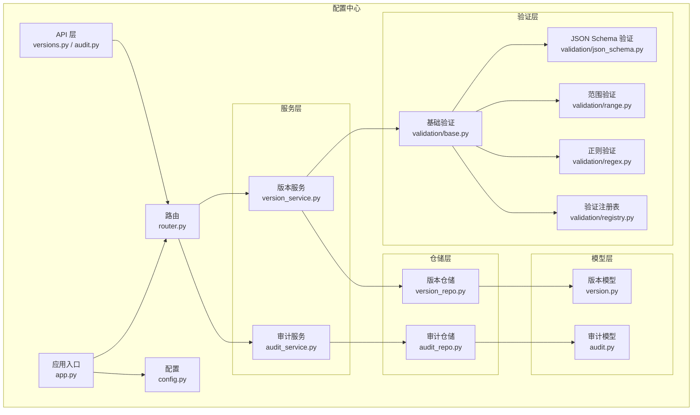
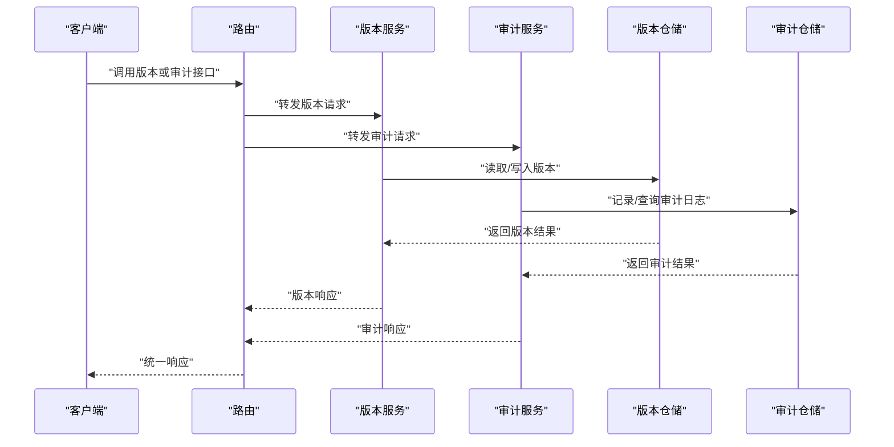
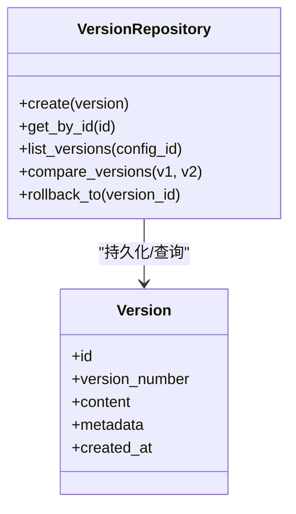
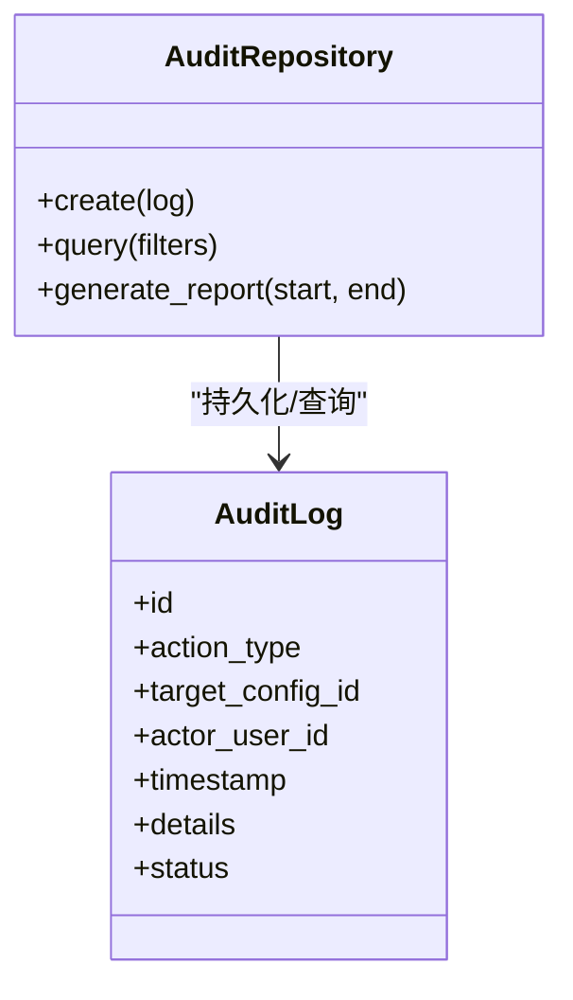
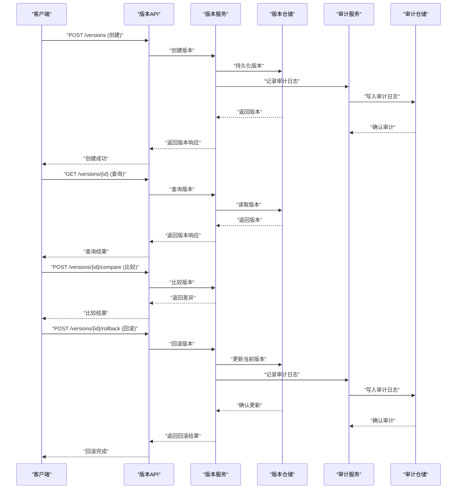
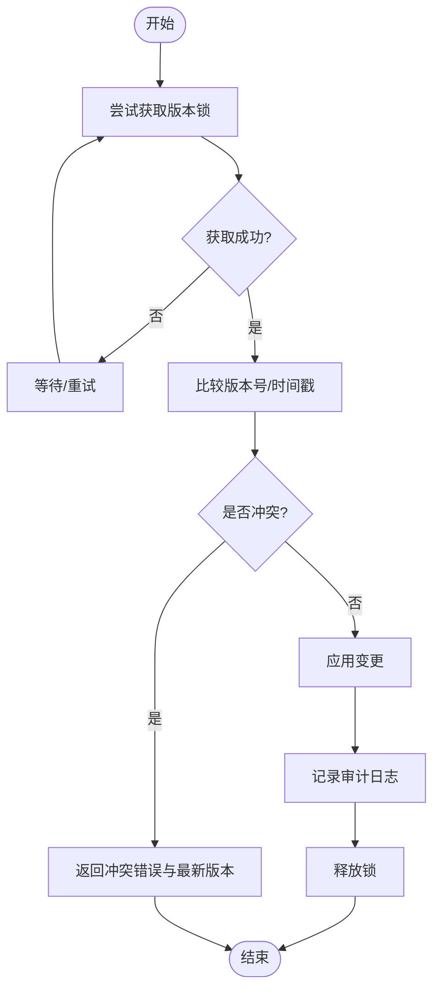
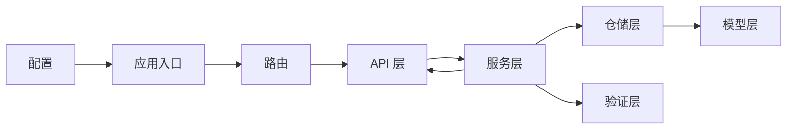

# 版本控制与审计

<cite>
**本文引用的文件**
- [version.py](file://src/taolib/config_center/models/version.py)
- [audit.py](file://src/taolib/config_center/models/audit.py)
- [version_service.py](file://src/taolib/config_center/services/version_service.py)
- [audit_service.py](file://src/taolib/config_center/services/audit_service.py)
- [version_repo.py](file://src/taolib/config_center/repository/version_repo.py)
- [audit_repo.py](file://src/taolib/config_center/repository/audit_repo.py)
- [versions.py](file://src/taolib/config_center/server/api/versions.py)
- [audit_api.py](file://src/taolib/config_center/server/api/audit.py)
- [router.py](file://src/taolib/config_center/server/router.py)
- [app.py](file://src/taolib/config_center/server/app.py)
- [config.py](file://src/taolib/config_center/server/config.py)
- [validation.py](file://src/taolib/config_center/validation/base.py)
- [json_schema.py](file://src/taolib/config_center/validation/json_schema.py)
- [range.py](file://src/taolib/config_center/validation/range.py)
- [regex.py](file://src/taolib/config_center/validation/regex.py)
- [registry.py](file://src/taolib/config_center/validation/registry.py)
- [test_models_version_audit.py](file://tests/testing/test_config_center/test_models_version_audit.py)
- [test_services.py](file://tests/testing/test_config_center/test_services.py)
- [test_api_integration.py](file://tests/testing/test_config_center/test_api_integration.py)
</cite>

## 目录
1. [简介](#简介)
2. [项目结构](#项目结构)
3. [核心组件](#核心组件)
4. [架构总览](#架构总览)
5. [详细组件分析](#详细组件分析)
6. [依赖关系分析](#依赖关系分析)
7. [性能考量](#性能考量)
8. [故障排查指南](#故障排查指南)
9. [结论](#结论)
10. [附录](#附录)

## 简介
本技术文档聚焦于配置中心的“版本控制与审计”模块，系统性阐述版本号生成策略、版本比较算法、版本回滚机制；详述审计日志系统（AuditLogResponse 模型、审计动作类型与状态管理）；给出版本控制 API 的完整接口规范（创建、查询、比较、回滚）；解释审计数据结构（变更类型、操作用户、时间戳、变更详情）；提供版本冲突解决与并发控制机制；覆盖版本历史追踪查询与审计报表生成能力；并通过实际使用示例展示如何管理配置版本与审查变更历史；最后说明版本控制与配置验证的集成方式与最佳实践。

## 项目结构
版本控制与审计模块位于配置中心子系统中，采用分层架构：服务层负责业务逻辑，仓储层负责持久化，API 层提供对外接口，模型层定义数据结构，验证层提供配置校验能力。模块内各层职责清晰，耦合度低，便于扩展与维护。

图表来源
- [versions.py](file://src/taolib/config_center/server/api/versions.py)
- [audit_api.py](file://src/taolib/config_center/server/api/audit.py)
- [router.py](file://src/taolib/config_center/server/router.py)
- [app.py](file://src/taolib/config_center/server/app.py)
- [config.py](file://src/taolib/config_center/server/config.py)
- [version_service.py](file://src/taolib/config_center/services/version_service.py)
- [audit_service.py](file://src/taolib/config_center/services/audit_service.py)
- [version_repo.py](file://src/taolib/config_center/repository/version_repo.py)
- [audit_repo.py](file://src/taolib/config_center/repository/audit_repo.py)
- [version.py](file://src/taolib/config_center/models/version.py)
- [audit.py](file://src/taolib/config_center/models/audit.py)
- [validation.py](file://src/taolib/config_center/validation/base.py)
- [json_schema.py](file://src/taolib/config_center/validation/json_schema.py)
- [range.py](file://src/taolib/config_center/validation/range.py)
- [regex.py](file://src/taolib/config_center/validation/regex.py)
- [registry.py](file://src/taolib/config_center/validation/registry.py)

章节来源
- [versions.py](file://src/taolib/config_center/server/api/versions.py)
- [audit_api.py](file://src/taolib/config_center/server/api/audit.py)
- [router.py](file://src/taolib/config_center/server/router.py)
- [app.py](file://src/taolib/config_center/server/app.py)
- [config.py](file://src/taolib/config_center/server/config.py)

## 核心组件
- 版本模型与仓储：定义版本实体、版本号生成策略、版本比较与回滚逻辑，并通过仓储层持久化与检索。
- 审计模型与仓储：定义审计日志实体、审计动作类型与状态管理，并通过仓储层记录与查询。
- 服务层：版本服务与审计服务封装业务规则，协调仓储与验证层。
- API 层：提供版本与审计的对外接口，统一请求处理与响应格式。
- 验证层：提供 JSON Schema、范围、正则等多维度配置验证能力，确保版本变更合规。

章节来源
- [version.py](file://src/taolib/config_center/models/version.py)
- [audit.py](file://src/taolib/config_center/models/audit.py)
- [version_repo.py](file://src/taolib/config_center/repository/version_repo.py)
- [audit_repo.py](file://src/taolib/config_center/repository/audit_repo.py)
- [version_service.py](file://src/taolib/config_center/services/version_service.py)
- [audit_service.py](file://src/taolib/config_center/services/audit_service.py)
- [validation.py](file://src/taolib/config_center/validation/base.py)

## 架构总览
版本控制与审计模块遵循“模型-仓储-服务-API”的分层架构，通过路由聚合到统一的应用入口，配置层提供运行时参数。验证层在服务层进行配置校验，确保版本变更符合预设规则。

图表来源
- [router.py](file://src/taolib/config_center/server/router.py)
- [version_service.py](file://src/taolib/config_center/services/version_service.py)
- [audit_service.py](file://src/taolib/config_center/services/audit_service.py)
- [version_repo.py](file://src/taolib/config_center/repository/version_repo.py)
- [audit_repo.py](file://src/taolib/config_center/repository/audit_repo.py)

## 详细组件分析

### 版本模型与版本号生成策略
- 版本模型包含版本标识、配置内容、元数据、创建时间等字段，用于唯一标识一次配置快照。
- 版本号生成策略建议采用递增序列或基于内容的哈希值作为版本号，确保全局唯一且可排序。
- 版本比较算法支持语义化版本比较（如主版本、次版本、修订号），或按时间戳排序，便于快速定位最新版本与历史版本。
- 版本回滚机制通过选择目标版本并复制其配置内容到当前活动版本，同时记录审计日志。

图表来源
- [version.py](file://src/taolib/config_center/models/version.py)
- [version_repo.py](file://src/taolib/config_center/repository/version_repo.py)

章节来源
- [version.py](file://src/taolib/config_center/models/version.py)
- [version_repo.py](file://src/taolib/config_center/repository/version_repo.py)

### 审计日志系统与 AuditLogResponse 模型
- 审计模型包含审计标识、操作动作类型、受影响的配置项、操作用户、时间戳、变更详情等字段。
- 审计动作类型涵盖创建、更新、删除、回滚等关键操作；状态管理用于标识审计任务的执行状态（如待处理、已执行、失败）。
- AuditLogResponse 模型用于统一审计响应结构，包含审计日志列表、分页信息与统计摘要。

图表来源
- [audit.py](file://src/taolib/config_center/models/audit.py)
- [audit_repo.py](file://src/taolib/config_center/repository/audit_repo.py)

章节来源
- [audit.py](file://src/taolib/config_center/models/audit.py)
- [audit_repo.py](file://src/taolib/config_center/repository/audit_repo.py)

### 版本控制 API 接口规范
- 版本创建：提交配置内容与元数据，生成新版本并返回版本号与创建时间。
- 版本查询：按配置 ID 查询版本列表，支持分页与排序；按版本号精确查询单个版本。
- 版本比较：比较两个版本的差异，返回差异详情（新增、修改、删除的键路径与值）。
- 版本回滚：选择目标版本并触发回滚流程，记录审计日志，返回回滚结果。

图表来源
- [versions.py](file://src/taolib/config_center/server/api/versions.py)
- [version_service.py](file://src/taolib/config_center/services/version_service.py)
- [version_repo.py](file://src/taolib/config_center/repository/version_repo.py)
- [audit_service.py](file://src/taolib/config_center/services/audit_service.py)
- [audit_repo.py](file://src/taolib/config_center/repository/audit_repo.py)

章节来源
- [versions.py](file://src/taolib/config_center/server/api/versions.py)

### 审计日志数据结构
- 变更类型：区分创建、更新、删除、回滚等动作类型。
- 操作用户：记录执行操作的用户标识，便于责任追溯。
- 时间戳：记录操作发生的时间，支持审计报表的时间维度筛选。
- 变更详情：记录受影响的配置键路径、旧值、新值等，支持差异可视化与审计报表生成。

章节来源
- [audit.py](file://src/taolib/config_center/models/audit.py)

### 版本冲突解决与并发控制
- 并发控制：采用乐观锁策略，在版本更新时校验版本号或时间戳，避免覆盖式更新导致的数据丢失。
- 冲突检测：当检测到并发冲突时，返回冲突错误码与当前最新版本信息，提示用户重试或合并。
- 合并策略：提供自动合并与人工干预两种模式，自动合并适用于非冲突键，人工干预用于冲突键的手动决策。

图表来源
- [version_service.py](file://src/taolib/config_center/services/version_service.py)
- [audit_service.py](file://src/taolib/config_center/services/audit_service.py)

章节来源
- [version_service.py](file://src/taolib/config_center/services/version_service.py)
- [audit_service.py](file://src/taolib/config_center/services/audit_service.py)

### 版本历史追踪与审计报表
- 版本历史追踪：提供按配置 ID 查询版本列表、按时间范围过滤、按动作类型筛选等功能。
- 审计报表：支持按时间段导出审计日志，统计操作次数、失败率、平均响应时间等指标，辅助合规与审计。

章节来源
- [audit_repo.py](file://src/taolib/config_center/repository/audit_repo.py)
- [audit_service.py](file://src/taolib/config_center/services/audit_service.py)

### 实际使用示例
- 创建版本：提交配置内容与元数据，系统生成新版本并返回版本号。
- 查询版本：根据配置 ID 获取版本列表，查看版本号、创建时间与元数据。
- 比较版本：选择两个版本进行对比，查看差异详情。
- 回滚版本：选择目标版本并执行回滚，系统记录审计日志并返回结果。
- 审计报表：按时间段导出审计日志，生成合规报告。

章节来源
- [versions.py](file://src/taolib/config_center/server/api/versions.py)
- [audit_api.py](file://src/taolib/config_center/server/api/audit.py)

### 版本控制与配置验证的集成
- 验证注册表：集中管理各类验证器（JSON Schema、范围、正则等），按配置项动态选择验证器。
- 服务层集成：在版本创建/更新前调用验证层，确保配置符合预设规则。
- 最佳实践：优先使用 JSON Schema 进行结构验证，结合范围与正则进行细粒度校验；对敏感配置启用更强的验证策略。

章节来源
- [validation.py](file://src/taolib/config_center/validation/base.py)
- [json_schema.py](file://src/taolib/config_center/validation/json_schema.py)
- [range.py](file://src/taolib/config_center/validation/range.py)
- [regex.py](file://src/taolib/config_center/validation/regex.py)
- [registry.py](file://src/taolib/config_center/validation/registry.py)
- [version_service.py](file://src/taolib/config_center/services/version_service.py)

## 依赖关系分析
版本控制与审计模块内部依赖清晰，服务层依赖仓储层与验证层，API 层依赖服务层，路由层统一调度。模块外部依赖主要来自配置中心的通用基础设施（如应用入口、配置、路由）。

图表来源
- [router.py](file://src/taolib/config_center/server/router.py)
- [app.py](file://src/taolib/config_center/server/app.py)
- [config.py](file://src/taolib/config_center/server/config.py)
- [version_service.py](file://src/taolib/config_center/services/version_service.py)
- [audit_service.py](file://src/taolib/config_center/services/audit_service.py)
- [version_repo.py](file://src/taolib/config_center/repository/version_repo.py)
- [audit_repo.py](file://src/taolib/config_center/repository/audit_repo.py)
- [validation.py](file://src/taolib/config_center/validation/base.py)

章节来源
- [router.py](file://src/taolib/config_center/server/router.py)
- [app.py](file://src/taolib/config_center/server/app.py)
- [config.py](file://src/taolib/config_center/server/config.py)

## 性能考量
- 缓存策略：对常用版本与审计报表结果进行缓存，降低数据库压力。
- 分页与索引：版本列表查询使用分页与合适索引，避免全表扫描。
- 异步审计：审计写入采用异步队列，减少主流程阻塞。
- 批量操作：批量创建版本或导出审计报表时，采用批处理与流式输出，提升吞吐量。

## 故障排查指南
- 版本冲突：出现并发冲突时，检查版本号或时间戳校验逻辑，必要时增加重试与合并策略。
- 审计缺失：确认审计服务是否正常运行，检查审计仓储写入是否成功。
- 验证失败：核对验证注册表配置，确保对应验证器正确加载与执行。
- API 错误：查看 API 层错误处理与日志，定位具体异常原因。

章节来源
- [version_service.py](file://src/taolib/config_center/services/version_service.py)
- [audit_service.py](file://src/taolib/config_center/services/audit_service.py)
- [audit_repo.py](file://src/taolib/config_center/repository/audit_repo.py)
- [validation.py](file://src/taolib/config_center/validation/base.py)

## 结论
版本控制与审计模块通过清晰的分层架构、完善的版本号生成与比较算法、严格的并发控制与冲突解决策略，以及全面的审计日志与报表能力，实现了配置版本的可靠管理与合规审计。结合配置验证层，确保每次版本变更均符合预设规则，提升了系统的安全性与可维护性。

## 附录
- 测试用例参考：版本与审计模型测试、服务层测试、API 集成测试，用于验证功能正确性与边界条件。

章节来源
- [test_models_version_audit.py](file://tests/testing/test_config_center/test_models_version_audit.py)
- [test_services.py](file://tests/testing/test_config_center/test_services.py)
- [test_api_integration.py](file://tests/testing/test_config_center/test_api_integration.py)