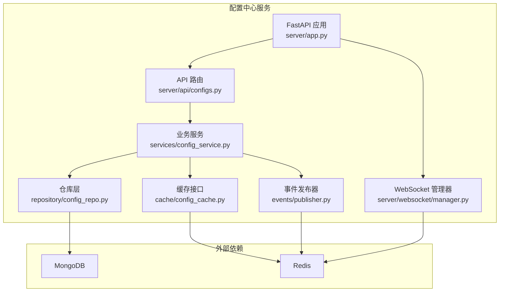
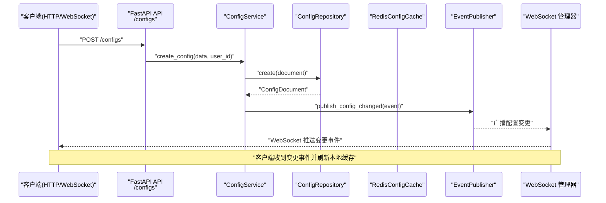
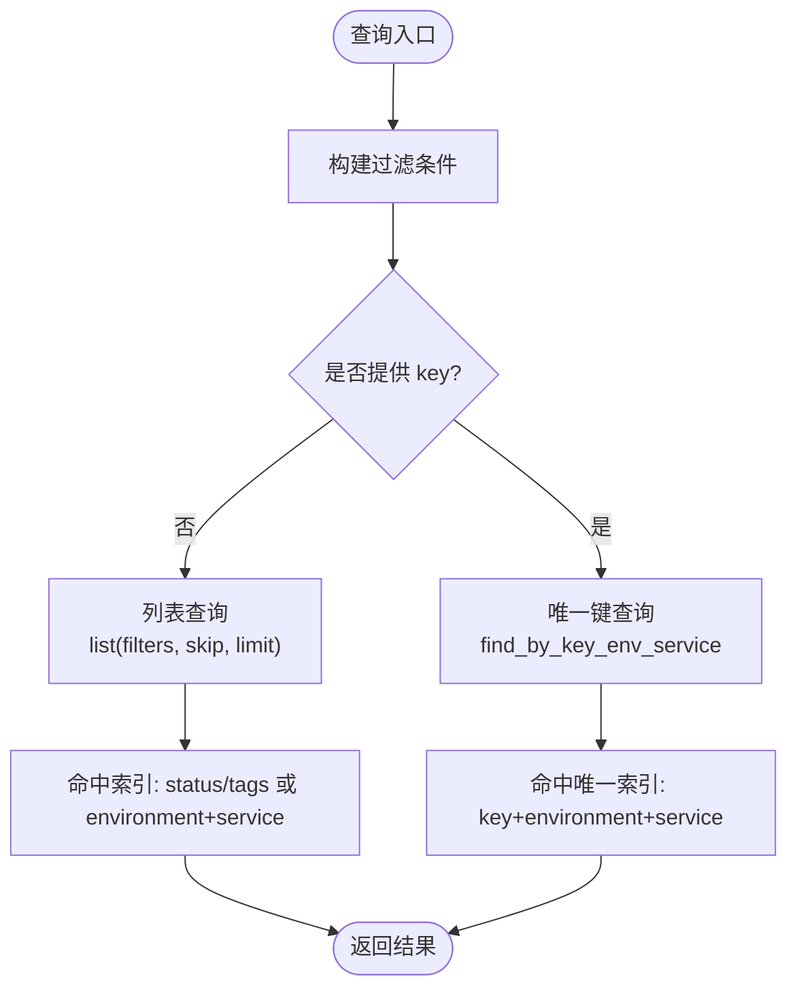
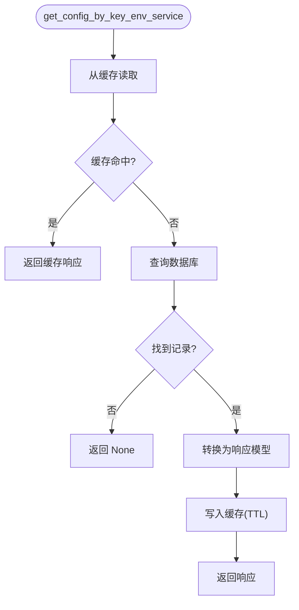
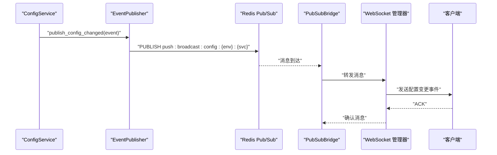
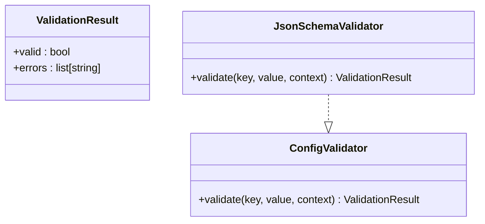
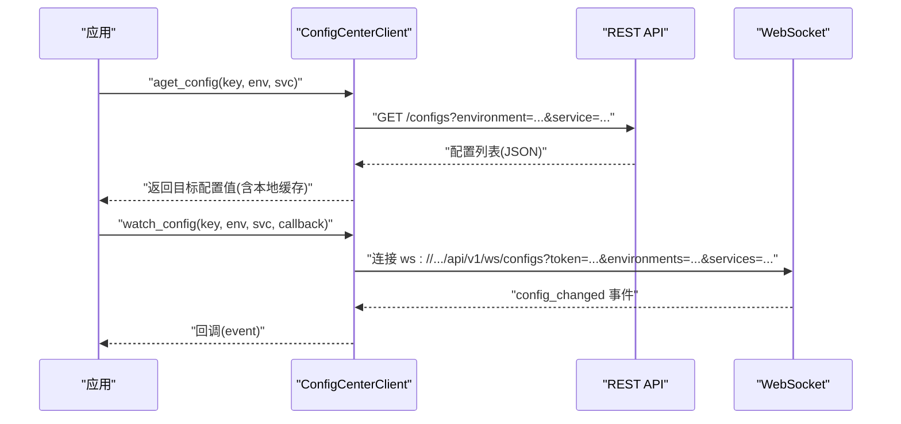
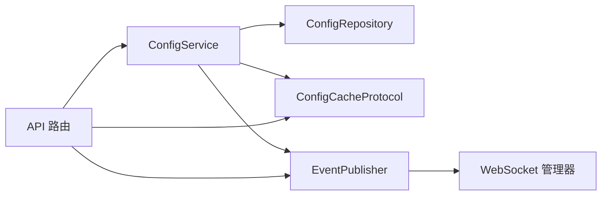

# 配置管理中心

<cite>
**本文引用的文件**
- [src/taolib/testing/config_center/__init__.py](file://src/taolib/testing/config_center/__init__.py)
- [src/taolib/testing/config_center/cache/config_cache.py](file://src/taolib/testing/config_center/cache/config_cache.py)
- [src/taolib/testing/config_center/models/config.py](file://src/taolib/testing/config_center/models/config.py)
- [src/taolib/testing/config_center/repository/config_repo.py](file://src/taolib/testing/config_center/repository/config_repo.py)
- [src/taolib/testing/config_center/services/config_service.py](file://src/taolib/testing/config_center/services/config_service.py)
- [src/taolib/testing/config_center/validation/base.py](file://src/taolib/testing/config_center/validation/base.py)
- [src/taolib/testing/config_center/validation/json_schema.py](file://src/taolib/testing/config_center/validation/json_schema.py)
- [src/taolib/testing/config_center/events/publisher.py](file://src/taolib/testing/config_center/events/publisher.py)
- [src/taolib/testing/config_center/server/api/configs.py](file://src/taolib/testing/config_center/server/api/configs.py)
- [src/taolib/testing/config_center/server/app.py](file://src/taolib/testing/config_center/server/app.py)
- [src/taolib/testing/config_center/server/main.py](file://src/taolib/testing/config_center/server/main.py)
- [src/taolib/testing/config_center/server/websocket/manager.py](file://src/taolib/testing/config_center/server/websocket/manager.py)
- [src/taolib/testing/config_center/client.py](file://src/taolib/testing/config_center/client.py)
- [src/taolib/testing/config_center/models/enums.py](file://src/taolib/testing/config_center/models/enums.py)
</cite>

## 目录
1. [简介](#简介)
2. [项目结构](#项目结构)
3. [核心组件](#核心组件)
4. [架构总览](#架构总览)
5. [详细组件分析](#详细组件分析)
6. [依赖关系分析](#依赖关系分析)
7. [性能考量](#性能考量)
8. [故障排查指南](#故障排查指南)
9. [结论](#结论)
10. [附录：API 参考与使用示例](#附录api-参考与使用示例)

## 简介
配置管理中心是一个基于 FastAPI 的分布式配置管理平台，提供多环境配置管理、版本控制、审计日志、实时推送与客户端 SDK。系统采用“缓存 + 数据库 + 事件总线”的分层设计，结合 Redis 缓存与 MongoDB 存储，实现高并发下的低延迟配置读取与强一致性的变更通知。

## 项目结构
配置中心位于 src/taolib/testing/config_center 目录下，按领域拆分为以下子模块：
- cache：缓存抽象与 Redis 实现
- models：Pydantic 数据模型与枚举
- repository：MongoDB 访问层
- services：业务逻辑（配置、版本、审计）
- validation：配置验证框架（JSON Schema 等）
- events：事件发布器（Redis Pub/Sub + 消息缓冲）
- server：Web 服务（FastAPI）、WebSocket 管理器、路由与依赖注入
- client：客户端 SDK（HTTP + WebSocket）



图表来源
- [src/taolib/testing/config_center/server/app.py:27-106](file://src/taolib/testing/config_center/server/app.py#L27-L106)
- [src/taolib/testing/config_center/server/api/configs.py:1-385](file://src/taolib/testing/config_center/server/api/configs.py#L1-L385)
- [src/taolib/testing/config_center/services/config_service.py:1-466](file://src/taolib/testing/config_center/services/config_service.py#L1-L466)
- [src/taolib/testing/config_center/repository/config_repo.py:1-145](file://src/taolib/testing/config_center/repository/config_repo.py#L1-L145)
- [src/taolib/testing/config_center/cache/config_cache.py:1-172](file://src/taolib/testing/config_center/cache/config_cache.py#L1-L172)
- [src/taolib/testing/config_center/events/publisher.py:1-194](file://src/taolib/testing/config_center/events/publisher.py#L1-L194)
- [src/taolib/testing/config_center/server/websocket/manager.py:1-467](file://src/taolib/testing/config_center/server/websocket/manager.py#L1-L467)

章节来源
- [src/taolib/testing/config_center/server/app.py:27-106](file://src/taolib/testing/config_center/server/app.py#L27-L106)
- [src/taolib/testing/config_center/server/main.py:1-48](file://src/taolib/testing/config_center/server/main.py#L1-L48)

## 核心组件
- 数据模型与枚举：定义配置、版本、审计、用户与权限等实体及状态枚举。
- 仓库层：封装 MongoDB 操作，提供按 key+environment+service 唯一定位与多维过滤查询。
- 业务服务：实现配置 CRUD、发布、回滚、缓存集成与事件发布。
- 缓存层：抽象缓存协议，提供 Redis 与内存实现；支持 TTL、批量删除与键空间。
- 事件系统：通过 Redis Pub/Sub 广播配置变更，结合消息缓冲保障 at-least-once 投递。
- WebSocket：连接管理、心跳、ACK 重传、离线缓冲与广播。
- 验证框架：基于 JSON Schema 的配置值校验。
- 客户端 SDK：HTTP 同步/异步获取配置与 WebSocket 监听变更。

章节来源
- [src/taolib/testing/config_center/models/config.py:1-106](file://src/taolib/testing/config_center/models/config.py#L1-L106)
- [src/taolib/testing/config_center/models/enums.py:1-65](file://src/taolib/testing/config_center/models/enums.py#L1-L65)
- [src/taolib/testing/config_center/repository/config_repo.py:1-145](file://src/taolib/testing/config_center/repository/config_repo.py#L1-L145)
- [src/taolib/testing/config_center/services/config_service.py:1-466](file://src/taolib/testing/config_center/services/config_service.py#L1-L466)
- [src/taolib/testing/config_center/cache/config_cache.py:1-172](file://src/taolib/testing/config_center/cache/config_cache.py#L1-L172)
- [src/taolib/testing/config_center/events/publisher.py:1-194](file://src/taolib/testing/config_center/events/publisher.py#L1-L194)
- [src/taolib/testing/config_center/server/websocket/manager.py:1-467](file://src/taolib/testing/config_center/server/websocket/manager.py#L1-L467)
- [src/taolib/testing/config_center/validation/json_schema.py:1-44](file://src/taolib/testing/config_center/validation/json_schema.py#L1-L44)
- [src/taolib/testing/config_center/client.py:1-210](file://src/taolib/testing/config_center/client.py#L1-L210)

## 架构总览
系统采用“API 层—业务层—仓储层—存储/缓存/事件”的分层架构，并通过 WebSocket 与事件发布器实现跨实例的实时推送。



图表来源
- [src/taolib/testing/config_center/server/api/configs.py:218-233](file://src/taolib/testing/config_center/server/api/configs.py#L218-L233)
- [src/taolib/testing/config_center/services/config_service.py:48-114](file://src/taolib/testing/config_center/services/config_service.py#L48-L114)
- [src/taolib/testing/config_center/events/publisher.py:46-68](file://src/taolib/testing/config_center/events/publisher.py#L46-L68)
- [src/taolib/testing/config_center/server/websocket/manager.py:235-266](file://src/taolib/testing/config_center/server/websocket/manager.py#L235-L266)

## 详细组件分析

### 数据模型与存储结构
- 配置模型：包含键、环境、服务、值、值类型、描述、标签、状态、版本号与审计字段。
- 文档模型：与 MongoDB 映射，提供 to_response 转换。
- 枚举：环境、值类型、状态、变更类型、审计动作与状态。

```mermaid
classDiagram
class ConfigBase {
+key : string
+environment : Environment
+service : string
+value : any
+value_type : ConfigValueType
+description : string
+schema_id : string?
+tags : list[string]
+status : ConfigStatus
}
class ConfigCreate
class ConfigUpdate
class ConfigResponse {
+id : string
+version : int
+created_by : string
+updated_by : string
+created_at : datetime
+updated_at : datetime
}
class ConfigDocument {
+to_response() : ConfigResponse
}
ConfigCreate --|> ConfigBase
ConfigUpdate
ConfigResponse --|<| ConfigBase
ConfigDocument --|<| ConfigBase
```

图表来源
- [src/taolib/testing/config_center/models/config.py:14-106](file://src/taolib/testing/config_center/models/config.py#L14-L106)
- [src/taolib/testing/config_center/models/enums.py:9-65](file://src/taolib/testing/config_center/models/enums.py#L9-L65)

章节来源
- [src/taolib/testing/config_center/models/config.py:1-106](file://src/taolib/testing/config_center/models/config.py#L1-L106)
- [src/taolib/testing/config_center/models/enums.py:1-65](file://src/taolib/testing/config_center/models/enums.py#L1-L65)

### 仓库层与索引设计
- 查询能力：按 key+environment+service 唯一定位；按标签、状态、环境+服务组合过滤。
- 索引策略：复合唯一索引（key, environment, service），以及按 status/tags/environment+service 的常用过滤索引。



图表来源
- [src/taolib/testing/config_center/repository/config_repo.py:26-142](file://src/taolib/testing/config_center/repository/config_repo.py#L26-L142)

章节来源
- [src/taolib/testing/config_center/repository/config_repo.py:1-145](file://src/taolib/testing/config_center/repository/config_repo.py#L1-L145)

### 业务服务与缓存策略
- 缓存优先：读取配置优先从缓存获取，缺失时回源数据库并写入缓存。
- 写入一致性：更新/删除/发布均删除对应缓存键，确保后续读取命中最新值。
- 事件发布：变更后构造事件并通过发布器广播，触发 WebSocket 推送。



图表来源
- [src/taolib/testing/config_center/services/config_service.py:129-167](file://src/taolib/testing/config_center/services/config_service.py#L129-L167)
- [src/taolib/testing/config_center/cache/config_cache.py:86-108](file://src/taolib/testing/config_center/cache/config_cache.py#L86-L108)

章节来源
- [src/taolib/testing/config_center/services/config_service.py:129-167](file://src/taolib/testing/config_center/services/config_service.py#L129-L167)
- [src/taolib/testing/config_center/cache/config_cache.py:86-108](file://src/taolib/testing/config_center/cache/config_cache.py#L86-L108)

### 事件发布与 WebSocket 实时推送
- 事件发布：按“config:{environment}:{service}”频道发布配置变更事件，携带消息 ID、优先级与 ACK 要求。
- 消息缓冲：将待投递消息写入 Redis 频道缓冲，保障离线用户可达。
- WebSocket 管理：连接池、订阅管理、心跳检测、ACK 超时重传、离线缓冲回放与统计。



图表来源
- [src/taolib/testing/config_center/events/publisher.py:46-68](file://src/taolib/testing/config_center/events/publisher.py#L46-L68)
- [src/taolib/testing/config_center/server/websocket/manager.py:235-266](file://src/taolib/testing/config_center/server/websocket/manager.py#L235-L266)

章节来源
- [src/taolib/testing/config_center/events/publisher.py:1-194](file://src/taolib/testing/config_center/events/publisher.py#L1-L194)
- [src/taolib/testing/config_center/server/websocket/manager.py:1-467](file://src/taolib/testing/config_center/server/websocket/manager.py#L1-L467)

### 验证机制
- 验证器协议：统一的 validate(key, value, context) 接口与 ValidationResult 结果。
- JSON Schema 验证器：基于 jsonschema 库对配置值进行结构与约束校验。



图表来源
- [src/taolib/testing/config_center/validation/base.py:10-43](file://src/taolib/testing/config_center/validation/base.py#L10-L43)
- [src/taolib/testing/config_center/validation/json_schema.py:13-43](file://src/taolib/testing/config_center/validation/json_schema.py#L13-L43)

章节来源
- [src/taolib/testing/config_center/validation/base.py:1-45](file://src/taolib/testing/config_center/validation/base.py#L1-L45)
- [src/taolib/testing/config_center/validation/json_schema.py:1-44](file://src/taolib/testing/config_center/validation/json_schema.py#L1-L44)

### 客户端集成
- HTTP 获取：支持同步与异步获取单个配置或服务全部配置，内置本地缓存。
- WebSocket 监听：按环境与服务订阅频道，接收配置变更事件并刷新缓存。



图表来源
- [src/taolib/testing/config_center/client.py:97-138](file://src/taolib/testing/config_center/client.py#L97-L138)
- [src/taolib/testing/config_center/client.py:169-208](file://src/taolib/testing/config_center/client.py#L169-L208)

章节来源
- [src/taolib/testing/config_center/client.py:1-210](file://src/taolib/testing/config_center/client.py#L1-L210)

## 依赖关系分析
- 组件耦合：业务服务依赖仓库、缓存、事件发布器与审计服务；API 路由通过依赖注入装配服务。
- 外部依赖：MongoDB（持久化）、Redis（缓存/事件/消息缓冲/在线状态）。
- 循环依赖：未发现直接循环；各层职责清晰，通过接口与依赖注入解耦。



图表来源
- [src/taolib/testing/config_center/server/api/configs.py:49-62](file://src/taolib/testing/config_center/server/api/configs.py#L49-L62)
- [src/taolib/testing/config_center/services/config_service.py:25-47](file://src/taolib/testing/config_center/services/config_service.py#L25-L47)
- [src/taolib/testing/config_center/cache/config_cache.py:18-75](file://src/taolib/testing/config_center/cache/config_cache.py#L18-L75)
- [src/taolib/testing/config_center/events/publisher.py:20-41](file://src/taolib/testing/config_center/events/publisher.py#L20-L41)

章节来源
- [src/taolib/testing/config_center/server/api/configs.py:1-385](file://src/taolib/testing/config_center/server/api/configs.py#L1-L385)
- [src/taolib/testing/config_center/services/config_service.py:1-466](file://src/taolib/testing/config_center/services/config_service.py#L1-L466)

## 性能考量
- 缓存命中率：通过 Redis 缓存热点配置，减少数据库压力；建议合理设置 TTL 与批量删除策略。
- 查询优化：利用复合索引与过滤条件，避免全表扫描；对高频查询场景可增加专用索引。
- 事件吞吐：Redis Pub/Sub 与消息缓冲配合，支持高并发广播；ACK 超时与重传保障可靠性。
- WebSocket：心跳与 ACK 机制降低僵尸连接影响；离线缓冲提升用户体验。
- 版本与审计：版本记录与审计日志写入独立集合，注意索引与归档策略。

## 故障排查指南
- 配置读取为空：检查缓存是否命中、键空间是否正确、数据库是否存在记录。
- 事件未推送：确认 Redis 连接正常、频道命名规范、Pub/Sub 桥接运行状态。
- WebSocket 断连：检查心跳间隔与超时配置、客户端 ACK 机制、离线缓冲回放。
- 权限问题：确认 JWT 令牌有效、RBAC 权限范围与系统角色初始化完成。
- 性能瓶颈：监控 Redis 与 MongoDB 的慢查询、连接数与内存使用情况。

章节来源
- [src/taolib/testing/config_center/server/websocket/manager.py:373-418](file://src/taolib/testing/config_center/server/websocket/manager.py#L373-L418)
- [src/taolib/testing/config_center/server/app.py:27-106](file://src/taolib/testing/config_center/server/app.py#L27-L106)

## 结论
配置管理中心通过清晰的分层设计与完善的事件驱动机制，实现了多环境、多服务的分布式配置管理。结合缓存、版本与审计能力，系统在可用性、可观测性与扩展性方面具备良好表现。建议在生产环境中完善监控与告警、优化索引与缓存策略，并持续演进验证框架与权限体系。

## 附录：API 参考与使用示例

### API 路由概览
- GET /configs：分页查询配置列表（支持按环境、服务、状态过滤）
- GET /configs/{config_id}：获取配置详情
- POST /configs：创建配置（返回草稿状态）
- PUT /configs/{config_id}：更新配置（自动创建新版本）
- DELETE /configs/{config_id}：删除配置
- POST /configs/{config_id}/publish：发布配置（从草稿转为已发布）

章节来源
- [src/taolib/testing/config_center/server/api/configs.py:64-385](file://src/taolib/testing/config_center/server/api/configs.py#L64-L385)

### 客户端使用示例
- 同步获取配置：ConfigCenterClient.get_config(key, environment, service)
- 异步获取配置：ConfigCenterClient.aget_config(key, environment, service)
- 获取服务全部配置：ConfigCenterClient.get_configs(environment, service)
- 监听配置变更：ConfigCenterClient.watch_config(key, environment, service, callback)

章节来源
- [src/taolib/testing/config_center/client.py:55-208](file://src/taolib/testing/config_center/client.py#L55-L208)

### 公开导出与版本
- 公开 API：ConfigCenterClient、配置/版本/审计/用户/角色模型、验证器与注册表
- 版本信息：通过 importlib.metadata 或环境变量获取

章节来源
- [src/taolib/testing/config_center/__init__.py:29-67](file://src/taolib/testing/config_center/__init__.py#L29-L67)