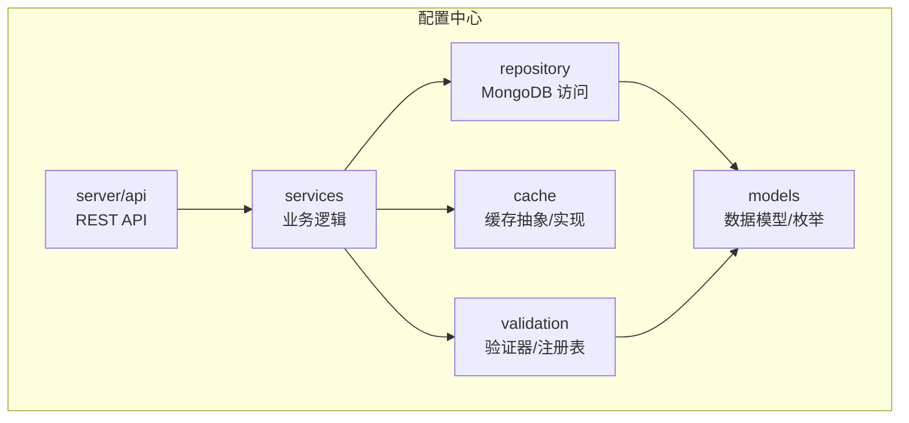
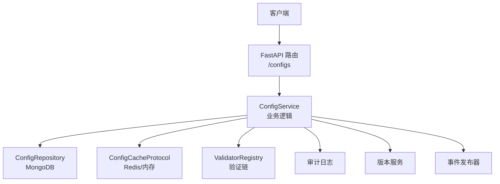
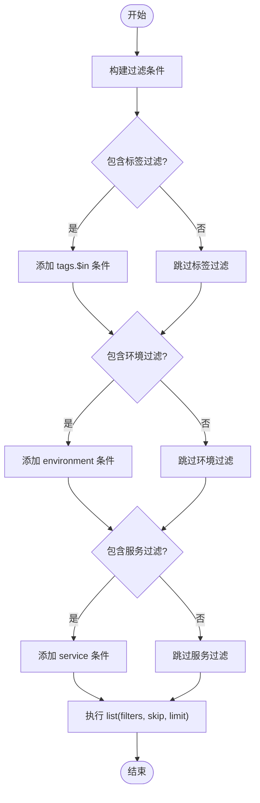
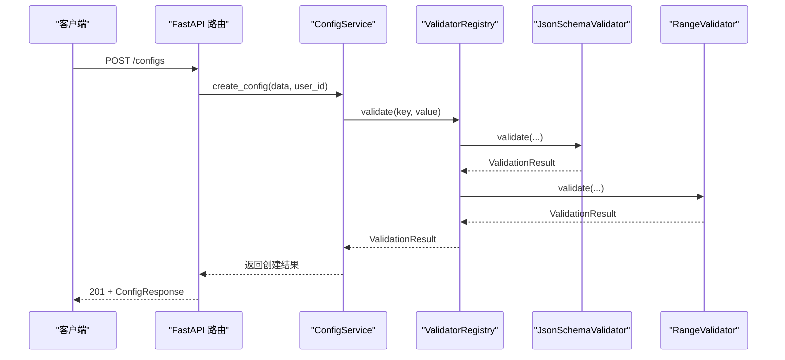
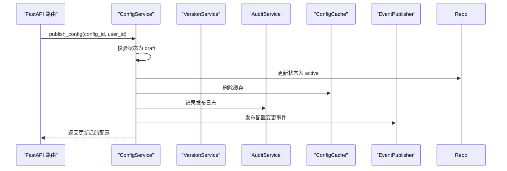
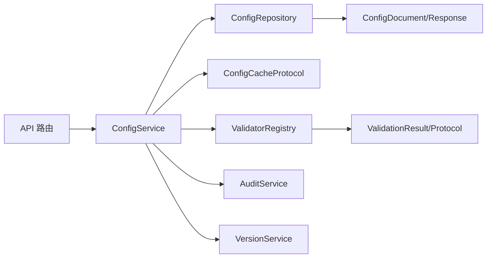

# 配置管理基础

<cite>
**本文引用的文件**
- [config.py](file://src/taolib/testing/config_center/models/config.py)
- [enums.py](file://src/taolib/testing/config_center/models/enums.py)
- [config_repo.py](file://src/taolib/testing/config_center/repository/config_repo.py)
- [base.py](file://src/taolib/testing/config_center/repository/base.py)
- [configs.py](file://src/taolib/testing/config_center/server/api/configs.py)
- [config_service.py](file://src/taolib/testing/config_center/services/config_service.py)
- [config_cache.py](file://src/taolib/testing/config_center/cache/config_cache.py)
- [json_schema.py](file://src/taolib/testing/config_center/validation/json_schema.py)
- [range.py](file://src/taolib/testing/config_center/validation/range.py)
- [regex.py](file://src/taolib/testing/config_center/validation/regex.py)
- [base.py](file://src/taolib/testing/config_center/validation/base.py)
- [registry.py](file://src/taolib/testing/config_center/validation/registry.py)
- [test_models_config.py](file://tests/testing/test_config_center/test_models_config.py)
- [test_validation.py](file://tests/testing/test_config_center/test_validation.py)
</cite>

## 目录
1. [简介](#简介)
2. [项目结构](#项目结构)
3. [核心组件](#核心组件)
4. [架构总览](#架构总览)
5. [详细组件分析](#详细组件分析)
6. [依赖分析](#依赖分析)
7. [性能考虑](#性能考虑)
8. [故障排查指南](#故障排查指南)
9. [结论](#结论)
10. [附录](#附录)

## 简介
本文件为“配置管理基础”模块的技术文档，聚焦于配置模型设计、MongoDB 数据模型与索引策略、配置验证机制（JSON Schema、范围、正则）、以及完整的 CRUD API 参考。文档还提供最佳实践、数据迁移策略与性能优化建议，并给出可直接定位到源码的路径示例，便于开发者快速上手与扩展。

## 项目结构
配置管理模块位于 src/taolib/testing/config_center 下，采用分层组织：
- models：数据模型与枚举
- repository：MongoDB 访问层
- server/api：FastAPI 路由与端点
- services：业务逻辑层
- cache：缓存抽象与实现
- validation：验证器与注册表
- tests：覆盖模型与验证器行为的测试



图表来源
- [configs.py:1-385](file://src/taolib/testing/config_center/server/api/configs.py#L1-L385)
- [config_service.py:1-466](file://src/taolib/testing/config_center/services/config_service.py#L1-L466)
- [config_repo.py:1-145](file://src/taolib/testing/config_center/repository/config_repo.py#L1-L145)
- [config_cache.py:1-172](file://src/taolib/testing/config_center/cache/config_cache.py#L1-L172)
- [json_schema.py:1-44](file://src/taolib/testing/config_center/validation/json_schema.py#L1-L44)
- [range.py:1-53](file://src/taolib/testing/config_center/validation/range.py#L1-L53)
- [regex.py:1-48](file://src/taolib/testing/config_center/validation/regex.py#L1-L48)
- [config.py:1-106](file://src/taolib/testing/config_center/models/config.py#L1-L106)

章节来源
- [configs.py:1-385](file://src/taolib/testing/config_center/server/api/configs.py#L1-L385)
- [config_service.py:1-466](file://src/taolib/testing/config_center/services/config_service.py#L1-L466)
- [config_repo.py:1-145](file://src/taolib/testing/config_center/repository/config_repo.py#L1-L145)
- [config_cache.py:1-172](file://src/taolib/testing/config_center/cache/config_cache.py#L1-L172)
- [json_schema.py:1-44](file://src/taolib/testing/config_center/validation/json_schema.py#L1-L44)
- [range.py:1-53](file://src/taolib/testing/config_center/validation/range.py#L1-L53)
- [regex.py:1-48](file://src/taolib/testing/config_center/validation/regex.py#L1-L48)
- [config.py:1-106](file://src/taolib/testing/config_center/models/config.py#L1-L106)

## 核心组件
- 配置数据模型
  - ConfigBase：通用字段集合（键、环境、服务、值、值类型、描述、schema_id、标签、状态）
  - ConfigCreate：创建请求模型（继承自 ConfigBase）
  - ConfigUpdate：更新请求模型（字段均为可选）
  - ConfigResponse：对外响应模型（包含 id、version、创建/更新人、时间戳）
  - ConfigDocument：MongoDB 文档模型（含默认值、别名、to_response 转换）
- 枚举
  - Environment：开发/预发/生产等环境
  - ConfigValueType：string/number/boolean/json/secret
  - ConfigStatus：draft/active/deprecated
- 存储与索引
  - ConfigRepository：基于 Motor 的异步访问，提供复合唯一索引与常用查询
- 缓存
  - ConfigCacheProtocol：统一缓存接口
  - RedisConfigCache：Redis 实现
  - InMemoryConfigCache：内存实现（测试用）
- 验证
  - ValidationResult：验证结果数据类
  - ConfigValidator 协议：统一验证接口
  - JsonSchemaValidator、RangeValidator、RegexValidator：内置验证器
  - ValidatorRegistry：按键模式注册与聚合验证

章节来源
- [config.py:14-106](file://src/taolib/testing/config_center/models/config.py#L14-L106)
- [enums.py:1-65](file://src/taolib/testing/config_center/models/enums.py#L1-L65)
- [config_repo.py:15-145](file://src/taolib/testing/config_center/repository/config_repo.py#L15-L145)
- [config_cache.py:18-172](file://src/taolib/testing/config_center/cache/config_cache.py#L18-L172)
- [base.py:10-45](file://src/taolib/testing/config_center/validation/base.py#L10-L45)
- [json_schema.py:13-44](file://src/taolib/testing/config_center/validation/json_schema.py#L13-L44)
- [range.py:11-53](file://src/taolib/testing/config_center/validation/range.py#L11-L53)
- [regex.py:12-48](file://src/taolib/testing/config_center/validation/regex.py#L12-L48)
- [registry.py:12-74](file://src/taolib/testing/config_center/validation/registry.py#L12-L74)

## 架构总览
配置管理采用“API → 服务 → 仓库/缓存/验证”的分层架构，结合版本与审计能力，确保配置变更可追踪、可回滚、可发布。



图表来源
- [configs.py:49-62](file://src/taolib/testing/config_center/server/api/configs.py#L49-L62)
- [config_service.py:22-47](file://src/taolib/testing/config_center/services/config_service.py#L22-L47)
- [config_repo.py:15-25](file://src/taolib/testing/config_center/repository/config_repo.py#L15-L25)
- [config_cache.py:18-73](file://src/taolib/testing/config_center/cache/config_cache.py#L18-L73)
- [registry.py:12-74](file://src/taolib/testing/config_center/validation/registry.py#L12-L74)

## 详细组件分析

### 数据模型与约束
- 字段与约束要点
  - key/service：最小/最大长度约束；唯一性由复合索引保证
  - environment/value_type：枚举约束
  - value：Any 类型，配合 value_type 与 schema_id 使用
  - description/tags/status：默认值与长度约束
  - 时间戳与用户字段：自动填充
- MongoDB 映射
  - ConfigDocument.id 映射 MongoDB 的 _id，使用别名
  - 默认值：version=1、status=draft、时间戳自动生成
- 响应模型
  - ConfigResponse 支持 from_attributes，便于从文档直接构造

```mermaid
classDiagram
class ConfigBase {
+str key
+Environment environment
+str service
+Any value
+ConfigValueType value_type
+str description
+str schema_id
+str[] tags
+ConfigStatus status
}
class ConfigCreate
class ConfigUpdate {
+Any value
+ConfigValueType value_type
+str description
+str schema_id
+str[] tags
+ConfigStatus status
}
class ConfigResponse {
+str id
+int version
+str created_by
+str updated_by
+datetime created_at
+datetime updated_at
}
class ConfigDocument {
+str id
+int version
+ConfigStatus status
+datetime created_at
+datetime updated_at
+to_response() ConfigResponse
}
ConfigCreate --|> ConfigBase
ConfigResponse --|< ConfigDocument
```

图表来源
- [config.py:14-106](file://src/taolib/testing/config_center/models/config.py#L14-L106)

章节来源
- [config.py:14-106](file://src/taolib/testing/config_center/models/config.py#L14-L106)
- [enums.py:9-34](file://src/taolib/testing/config_center/models/enums.py#L9-L34)
- [test_models_config.py:18-359](file://tests/testing/test_config_center/test_models_config.py#L18-L359)

### MongoDB 存储与索引策略
- 集合：configs
- 索引
  - 复合唯一索引：(key, environment, service)
  - 单列索引：status、tags、(environment, service)
- 查询能力
  - 按 key+环境+服务精确查找
  - 按标签、状态、环境+服务组合过滤
  - 分页查询（skip/limit）



图表来源
- [config_repo.py:54-132](file://src/taolib/testing/config_center/repository/config_repo.py#L54-L132)

章节来源
- [config_repo.py:134-143](file://src/taolib/testing/config_center/repository/config_repo.py#L134-L143)

### 配置验证机制
- 验证器协议与结果
  - ConfigValidator：统一 validate(key, value, context) 接口
  - ValidationResult：冻结数据类，包含 valid 与 errors
- 内置验证器
  - JsonSchemaValidator：使用 jsonschema 对 value 进行结构校验
  - RangeValidator：数值范围校验（支持最小/最大值）
  - RegexValidator：字符串正则匹配校验
- 注册表
  - ValidatorRegistry：按通配符模式注册验证器，聚合执行并合并错误
- 使用方式
  - 在创建/更新流程中，先按键模式获取验证器列表，再依次执行 validate 并汇总结果



图表来源
- [configs.py:218-233](file://src/taolib/testing/config_center/server/api/configs.py#L218-L233)
- [config_service.py:48-114](file://src/taolib/testing/config_center/services/config_service.py#L48-L114)
- [registry.py:42-68](file://src/taolib/testing/config_center/validation/registry.py#L42-L68)
- [json_schema.py:24-42](file://src/taolib/testing/config_center/validation/json_schema.py#L24-L42)
- [range.py:26-50](file://src/taolib/testing/config_center/validation/range.py#L26-L50)

章节来源
- [base.py:10-45](file://src/taolib/testing/config_center/validation/base.py#L10-L45)
- [json_schema.py:13-44](file://src/taolib/testing/config_center/validation/json_schema.py#L13-L44)
- [range.py:11-53](file://src/taolib/testing/config_center/validation/range.py#L11-L53)
- [regex.py:12-48](file://src/taolib/testing/config_center/validation/regex.py#L12-L48)
- [registry.py:12-74](file://src/taolib/testing/config_center/validation/registry.py#L12-L74)
- [test_validation.py:117-322](file://tests/testing/test_config_center/test_validation.py#L117-L322)

### 配置 CRUD 与发布 API 参考
- 认证与权限
  - JWT 认证；读写删、发布等操作需对应权限
- 端点概览
  - GET /configs：分页查询，支持 environment/service/status 过滤
  - GET /configs/{config_id}：按 ID 获取详情
  - POST /configs：创建配置（生成版本 1，状态 draft）
  - PUT /configs/{config_id}：更新配置（自动递增版本，写入审计日志）
  - DELETE /configs/{config_id}：删除配置（删除缓存与审计日志）
  - POST /configs/{config_id}/publish：发布配置（状态 active）
- 请求/响应格式
  - 请求体：ConfigCreate 或 ConfigUpdate
  - 响应体：ConfigResponse
- 错误处理
  - 400：请求参数错误或业务规则不满足
  - 401：未授权
  - 403：权限不足
  - 404：资源不存在
  - 204：删除成功（无内容）

章节来源
- [configs.py:64-385](file://src/taolib/testing/config_center/server/api/configs.py#L64-L385)

### 业务流程与事件发布
- 创建/更新/删除/发布均会：
  - 写入版本记录
  - 记录审计日志
  - 清理/更新缓存
  - 可选地发布配置变更事件（WebSocket 推送）
- 回滚流程
  - 通过版本服务回滚到目标版本，更新配置值并创建回滚版本记录



图表来源
- [config_service.py:264-320](file://src/taolib/testing/config_center/services/config_service.py#L264-L320)

章节来源
- [config_service.py:168-320](file://src/taolib/testing/config_center/services/config_service.py#L168-L320)

## 依赖分析
- 组件耦合
  - API 依赖服务；服务依赖仓库、缓存、验证、版本与审计
  - 仓库依赖模型与枚举
  - 验证器依赖注册表与基础协议
- 外部依赖
  - MongoDB：Motor 异步驱动
  - Redis：aioredis
  - jsonschema：结构化校验
- 循环依赖
  - 未见循环导入；分层清晰



图表来源
- [configs.py:18-27](file://src/taolib/testing/config_center/server/api/configs.py#L18-L27)
- [config_service.py:22-47](file://src/taolib/testing/config_center/services/config_service.py#L22-L47)
- [config_repo.py:15-25](file://src/taolib/testing/config_center/repository/config_repo.py#L15-L25)
- [config_cache.py:18-73](file://src/taolib/testing/config_center/cache/config_cache.py#L18-L73)
- [registry.py:12-74](file://src/taolib/testing/config_center/validation/registry.py#L12-L74)
- [base.py:10-45](file://src/taolib/testing/config_center/validation/base.py#L10-L45)
- [config.py:60-106](file://src/taolib/testing/config_center/models/config.py#L60-L106)

章节来源
- [base.py:6-8](file://src/taolib/testing/config_center/repository/base.py#L6-L8)

## 性能考虑
- 缓存策略
  - 读路径优先命中缓存，未命中再查库；更新/发布/删除后清理缓存
  - 支持按环境/服务批量清理，降低全量失效成本
- 索引优化
  - 复合唯一索引保证 key+environment+service 唯一性
  - 为高频过滤字段建立单列索引（status/tags/environment+service）
- 查询限制
  - API 层提供 skip/limit 控制，避免一次性拉取过多数据
- 异步化
  - 仓库与缓存均采用异步实现，提升并发吞吐

章节来源
- [config_cache.py:75-172](file://src/taolib/testing/config_center/cache/config_cache.py#L75-L172)
- [config_repo.py:134-143](file://src/taolib/testing/config_center/repository/config_repo.py#L134-L143)
- [configs.py:118-122](file://src/taolib/testing/config_center/server/api/configs.py#L118-L122)

## 故障排查指南
- 常见错误与定位
  - 400 参数错误：检查请求体是否符合 ConfigCreate/ConfigUpdate 字段约束
  - 404 资源不存在：确认 config_id 或 key+environment+service 是否正确
  - 403 权限不足：确认 JWT 与所需权限（config:read/write/delete/publish）
- 验证失败排查
  - 使用 ValidatorRegistry.validate(key, value) 快速复现验证链
  - JsonSchemaValidator：核对 schema_id 与 schema 定义
  - RangeValidator/RegexValidator：核对数值范围与正则表达式
- 缓存一致性
  - 更新/发布/删除后应清理缓存；若出现脏读，检查缓存 TTL 与清理逻辑
- 数据迁移
  - 新增字段：为 configs 集合添加必要索引；保持默认值与兼容性
  - 字段重命名：通过迁移脚本更新文档并重建索引

章节来源
- [configs.py:95-116](file://src/taolib/testing/config_center/server/api/configs.py#L95-L116)
- [test_validation.py:117-322](file://tests/testing/test_config_center/test_validation.py#L117-L322)
- [config_cache.py:115-123](file://src/taolib/testing/config_center/cache/config_cache.py#L115-L123)

## 结论
本模块以清晰的分层架构、完善的验证与缓存策略、以及可追溯的版本与审计能力，提供了稳定可靠的配置管理基础。通过合理的索引与异步实现，可在高并发场景下保持良好性能。建议在生产环境中结合监控与告警，持续优化验证规则与缓存策略。

## 附录

### API 参考（摘要）
- 获取配置列表
  - 方法：GET
  - 路径：/configs
  - 查询参数：environment、service、skip、limit
  - 响应：200 + ConfigResponse[]
- 获取配置详情
  - 方法：GET
  - 路径：/configs/{config_id}
  - 响应：200 + ConfigResponse
- 创建配置
  - 方法：POST
  - 路径：/configs
  - 请求体：ConfigCreate
  - 响应：201 + ConfigResponse
- 更新配置
  - 方法：PUT
  - 路径：/configs/{config_id}
  - 请求体：ConfigUpdate
  - 响应：200 + ConfigResponse
- 删除配置
  - 方法：DELETE
  - 路径：/configs/{config_id}
  - 响应：204
- 发布配置
  - 方法：POST
  - 路径：/configs/{config_id}/publish
  - 响应：200 + ConfigResponse

章节来源
- [configs.py:64-385](file://src/taolib/testing/config_center/server/api/configs.py#L64-L385)

### 示例（代码路径）
- 创建配置
  - [configs.py:218-233](file://src/taolib/testing/config_center/server/api/configs.py#L218-L233)
  - [config_service.py:48-114](file://src/taolib/testing/config_center/services/config_service.py#L48-L114)
- 更新配置
  - [configs.py:265-284](file://src/taolib/testing/config_center/server/api/configs.py#L265-L284)
  - [config_service.py:168-229](file://src/taolib/testing/config_center/services/config_service.py#L168-L229)
- 查询配置
  - [configs.py:117-134](file://src/taolib/testing/config_center/server/api/configs.py#L117-L134)
  - [config_service.py:321-354](file://src/taolib/testing/config_center/services/config_service.py#L321-L354)
- 删除配置
  - [configs.py:311-328](file://src/taolib/testing/config_center/server/api/configs.py#L311-L328)
  - [config_service.py:230-263](file://src/taolib/testing/config_center/services/config_service.py#L230-L263)
- 发布配置
  - [configs.py:365-382](file://src/taolib/testing/config_center/server/api/configs.py#L365-L382)
  - [config_service.py:264-320](file://src/taolib/testing/config_center/services/config_service.py#L264-L320)