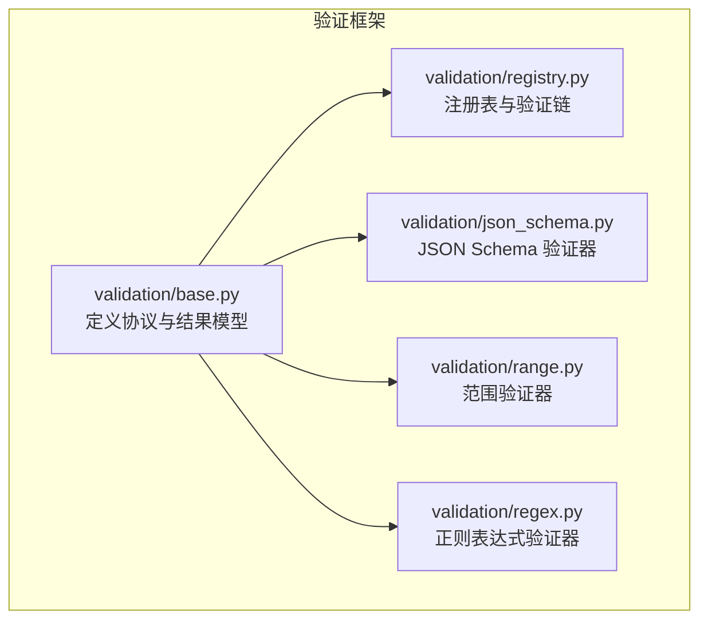
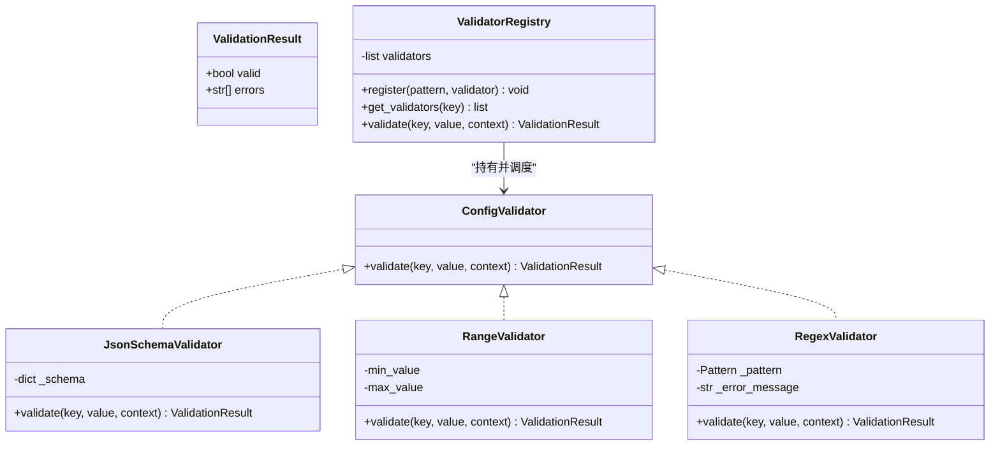
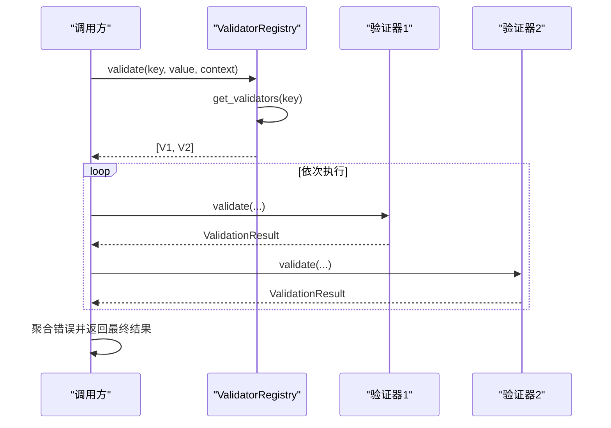
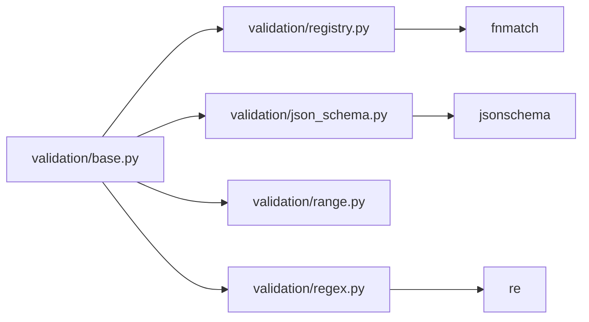

# 配置验证框架

<cite>
**本文引用的文件**
- [base.py](file://src/taolib/testing/config_center/validation/base.py)
- [registry.py](file://src/taolib/testing/config_center/validation/registry.py)
- [json_schema.py](file://src/taolib/testing/config_center/validation/json_schema.py)
- [range.py](file://src/taolib/testing/config_center/validation/range.py)
- [regex.py](file://src/taolib/testing/config_center/validation/regex.py)
- [__init__.py](file://src/taolib/testing/config_center/__init__.py)
- [test_validation.py](file://tests/testing/test_config_center/test_validation.py)
</cite>

## 目录
1. [简介](#简介)
2. [项目结构](#项目结构)
3. [核心组件](#核心组件)
4. [架构总览](#架构总览)
5. [组件详解](#组件详解)
6. [依赖关系分析](#依赖关系分析)
7. [性能考量](#性能考量)
8. [故障排查指南](#故障排查指南)
9. [结论](#结论)
10. [附录](#附录)

## 简介
本技术文档面向“配置验证框架”，系统性阐述其架构设计与实现细节，重点覆盖以下方面：
- 核心抽象：ConfigValidator 协议、ValidationResult 结果模型
- 注册与调度：ValidatorRegistry 注册表及其键模式匹配与验证链执行
- 内置验证器：JSON Schema 验证器、范围验证器、正则表达式验证器的用法与配置要点
- 自定义验证器：接口规范、错误处理与性能优化建议
- 验证规则示例：字符串、数值范围、枚举、复合验证等场景
- 性能优化：批量验证、错误聚合、缓存策略与动态加载思路
- 使用与扩展：如何注册、查找与扩展验证器的实际示例路径

## 项目结构
配置验证框架位于配置中心子模块内，采用分层清晰的文件组织：
- 抽象与协议：validation/base.py
- 注册表：validation/registry.py
- 内置验证器：validation/json_schema.py、validation/range.py、validation/regex.py
- 包导出：config_center/__init__.py
- 测试：tests/testing/test_config_center/test_validation.py

图表来源
- [base.py:1-45](file://src/taolib/testing/config_center/validation/base.py#L1-L45)
- [registry.py:1-74](file://src/taolib/testing/config_center/validation/registry.py#L1-L74)
- [json_schema.py:1-44](file://src/taolib/testing/config_center/validation/json_schema.py#L1-L44)
- [range.py:1-53](file://src/taolib/testing/config_center/validation/range.py#L1-L53)
- [regex.py:1-48](file://src/taolib/testing/config_center/validation/regex.py#L1-L48)

章节来源
- [base.py:1-45](file://src/taolib/testing/config_center/validation/base.py#L1-L45)
- [registry.py:1-74](file://src/taolib/testing/config_center/validation/registry.py#L1-L74)
- [json_schema.py:1-44](file://src/taolib/testing/config_center/validation/json_schema.py#L1-L44)
- [range.py:1-53](file://src/taolib/testing/config_center/validation/range.py#L1-L53)
- [regex.py:1-48](file://src/taolib/testing/config_center/validation/regex.py#L1-L48)
- [__init__.py:1-70](file://src/taolib/testing/config_center/__init__.py#L1-L70)

## 核心组件
- ConfigValidator 协议：统一的验证器接口，要求实现 validate 方法，接收键、值与上下文，返回 ValidationResult。
- ValidationResult 结果模型：不可变数据类，包含布尔型 valid 与错误列表 errors。
- ValidatorRegistry 注册表：按配置键模式注册验证器，支持通配符匹配；执行验证链并对错误进行聚合。

章节来源
- [base.py:10-42](file://src/taolib/testing/config_center/validation/base.py#L10-L42)
- [registry.py:12-68](file://src/taolib/testing/config_center/validation/registry.py#L12-L68)

## 架构总览
验证框架采用“协议 + 注册表 + 内置验证器”的分层设计：
- 协议层：定义统一的验证契约，确保验证器实现的一致性
- 注册表层：负责验证器的注册、模式匹配与链式调用
- 验证器层：内置多种常用验证器，亦支持自定义扩展

图表来源
- [base.py:10-42](file://src/taolib/testing/config_center/validation/base.py#L10-L42)
- [registry.py:12-68](file://src/taolib/testing/config_center/validation/registry.py#L12-L68)
- [json_schema.py:13-42](file://src/taolib/testing/config_center/validation/json_schema.py#L13-L42)
- [range.py:11-50](file://src/taolib/testing/config_center/validation/range.py#L11-L50)
- [regex.py:12-45](file://src/taolib/testing/config_center/validation/regex.py#L12-L45)

## 组件详解

### 抽象与结果模型
- ConfigValidator 协议：约定 validate(key, value, context) -> ValidationResult，便于统一调度与扩展
- ValidationResult：冻结数据类，保证结果不可变；valid 表示整体校验通过与否，errors 聚合具体错误信息

章节来源
- [base.py:10-42](file://src/taolib/testing/config_center/validation/base.py#L10-L42)

### 注册表与验证链
- 注册机制：register(pattern, validator)，以键模式（支持通配符）绑定验证器
- 查找机制：get_validators(key) 使用通配符匹配返回候选验证器列表
- 执行机制：validate(key, value, context) 依次调用匹配验证器，聚合失败错误，返回最终结果

图表来源
- [registry.py:42-67](file://src/taolib/testing/config_center/validation/registry.py#L42-L67)

章节来源
- [registry.py:18-68](file://src/taolib/testing/config_center/validation/registry.py#L18-L68)

### JSON Schema 验证器
- 用途：对任意 JSON 兼容值进行结构与类型约束校验
- 关键点：构造函数接收完整 schema；validate 在捕获 jsonschema.ValidationError 后转换为 ValidationResult
- 典型场景：对象结构、数组元素、必填字段、类型约束等

章节来源
- [json_schema.py:13-42](file://src/taolib/testing/config_center/validation/json_schema.py#L13-L42)

### 范围验证器
- 用途：对数值型配置进行上下界检查
- 关键点：支持整数与浮点数；非数值类型直接判错；分别检查下界与上界并生成对应错误信息
- 典型场景：端口范围、百分比阈值、超时时间等

章节来源
- [range.py:11-50](file://src/taolib/testing/config_center/validation/range.py#L11-L50)

### 正则表达式验证器
- 用途：对字符串型配置进行模式匹配校验
- 关键点：编译正则表达式一次；非字符串类型直接判错；支持自定义错误消息
- 典型场景：邮箱、主机名、版本号、标签等格式校验

章节来源
- [regex.py:12-45](file://src/taolib/testing/config_center/validation/regex.py#L12-L45)

### 自定义验证器开发指南
- 接口规范：实现 ConfigValidator.validate(key, value, context) 并返回 ValidationResult
- 错误处理：将底层异常转换为 ValidationResult(valid=False, errors=[...])，保持错误信息可读且聚焦
- 性能优化：
  - 对昂贵资源（如正则）进行预编译与缓存
  - 在 validate 内避免重复计算，必要时利用 context 上下文传递共享数据
  - 对可并行的验证器组合，考虑批量执行与并发调度（需结合上层业务）
- 可测试性：遵循冻结结果模型，便于断言与单元测试

章节来源
- [base.py:23-42](file://src/taolib/testing/config_center/validation/base.py#L23-L42)
- [test_validation.py:297-322](file://tests/testing/test_config_center/test_validation.py#L297-L322)

### 验证器注册与查找机制
- 动态加载：通过 register(pattern, validator) 动态注册，支持运行时扩展
- 模式匹配：基于通配符匹配键前缀，支持多模式同时生效
- 缓存策略：当前实现未内置缓存；可在上层业务中对“已匹配验证器集合”进行缓存以降低重复匹配成本

章节来源
- [registry.py:22-40](file://src/taolib/testing/config_center/validation/registry.py#L22-L40)

### 验证规则示例（示例路径）
以下示例均来自测试文件，展示典型用法与期望行为：
- JSON Schema 验证
  - 有效对象：[示例路径:120-134](file://tests/testing/test_config_center/test_validation.py#L120-L134)
  - 缺少必填字段：[示例路径:136-152](file://tests/testing/test_config_center/test_validation.py#L136-L152)
  - 类型错误：[示例路径:154-167](file://tests/testing/test_config_center/test_validation.py#L154-L167)
  - 字符串与数组：[示例路径:168-187](file://tests/testing/test_config_center/test_validation.py#L168-L187)
- 正则表达式验证
  - 邮箱格式：[示例路径:193-198](file://tests/testing/test_config_center/test_validation.py#L193-L198)
  - 主机名格式：[示例路径:218-226](file://tests/testing/test_config_center/test_validation.py#L218-L226)
  - 自定义错误消息：[示例路径:207-216](file://tests/testing/test_config_center/test_validation.py#L207-L216)
- 范围验证
  - 数字范围：[示例路径:232-237](file://tests/testing/test_config_center/test_validation.py#L232-L237)
  - 下界越界：[示例路径:239-244](file://tests/testing/test_config_center/test_validation.py#L239-L244)
  - 上界越界：[示例路径:246-251](file://tests/testing/test_config_center/test_validation.py#L246-L251)
  - 仅最小值/仅最大值/浮点范围：[示例路径:253-281](file://tests/testing/test_config_center/test_validation.py#L253-L281)
- 注册表行为
  - 通配符匹配与聚合错误：[示例路径:38-104](file://tests/testing/test_config_center/test_validation.py#L38-L104)
  - 无验证器时返回有效：[示例路径:66-72](file://tests/testing/test_config_center/test_validation.py#L66-L72)

章节来源
- [test_validation.py:117-291](file://tests/testing/test_config_center/test_validation.py#L117-L291)

## 依赖关系分析
- 组件耦合
  - 所有验证器均依赖 ConfigValidator 协议与 ValidationResult 结果模型
  - ValidatorRegistry 依赖 ConfigValidator 与 fnmatch 进行模式匹配
  - 内置验证器各自依赖标准库（re、jsonschema）与基础协议
- 外部依赖
  - jsonschema：用于 JSON Schema 验证
  - re：用于正则表达式编译与匹配
  - fnmatch：用于键模式匹配

图表来源
- [registry.py:6-9](file://src/taolib/testing/config_center/validation/registry.py#L6-L9)
- [json_schema.py:8-10](file://src/taolib/testing/config_center/validation/json_schema.py#L8-L10)
- [regex.py:6-9](file://src/taolib/testing/config_center/validation/regex.py#L6-L9)

章节来源
- [registry.py:6-9](file://src/taolib/testing/config_center/validation/registry.py#L6-L9)
- [json_schema.py:8-10](file://src/taolib/testing/config_center/validation/json_schema.py#L8-L10)
- [regex.py:6-9](file://src/taolib/testing/config_center/validation/regex.py#L6-L9)

## 性能考量
- 验证链聚合：ValidatorRegistry 顺序执行所有匹配验证器并聚合错误，适合“强约束”场景；若存在大量昂贵验证器，建议：
  - 分层验证：先轻后重，短路策略（上层可实现早停）
  - 批量验证：对同一批配置值并行执行（需结合业务线程池与锁）
- 编译与缓存：
  - 正则验证器已预编译 Pattern；可进一步在上层缓存“已编译正则集合”
  - JSON Schema 验证器可复用 schema 对象；避免重复构造
- 上下文传递：通过 context 传递共享数据（如已解析的 schema、预计算常量），减少重复计算
- 模式匹配：对高频键可缓存“已匹配验证器集合”，降低 fnmatch 调用次数

## 故障排查指南
- 常见问题
  - 验证器未生效：确认键模式是否正确匹配；检查注册顺序与通配符使用
  - 错误信息缺失：确保在异常分支返回 ValidationResult(valid=False, errors=[...])，避免静默失败
  - 性能瓶颈：识别昂贵验证器（如正则复杂度高、JSON Schema 体积大），优先优化或拆分
- 调试建议
  - 使用最小化配置与 schema 快速定位问题
  - 在 validate 内打印关键上下文（键、类型、上下文内容），便于定位
  - 通过单元测试覆盖边界条件（空值、类型不符、越界、非法格式）

章节来源
- [test_validation.py:117-291](file://tests/testing/test_config_center/test_validation.py#L117-L291)

## 结论
配置验证框架以协议驱动、注册表调度为核心，提供了可扩展、可测试、可维护的验证体系。内置验证器覆盖常见场景，配合灵活的键模式匹配与错误聚合机制，能够满足多环境、多服务下的配置治理需求。通过合理的性能优化与扩展实践，可在保证质量的同时提升系统吞吐与稳定性。

## 附录

### 使用与扩展示例（示例路径）
- 基础使用
  - 注册与验证：[示例路径:38-104](file://tests/testing/test_config_center/test_validation.py#L38-L104)
  - JSON Schema 验证：[示例路径:120-187](file://tests/testing/test_config_center/test_validation.py#L120-L187)
  - 正则表达式验证：[示例路径:193-226](file://tests/testing/test_config_center/test_validation.py#L193-L226)
  - 范围验证：[示例路径:232-281](file://tests/testing/test_config_center/test_validation.py#L232-L281)
- 自定义验证器
  - 接口实现与错误返回：[示例路径:297-322](file://tests/testing/test_config_center/test_validation.py#L297-L322)
  - 在注册表中注册与使用：[示例路径:22-67](file://src/taolib/testing/config_center/validation/registry.py#L22-L67)