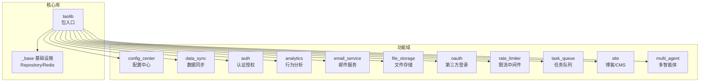
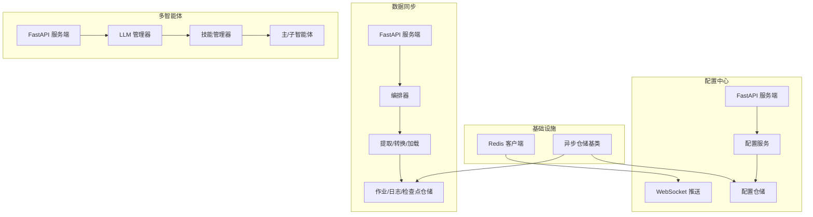
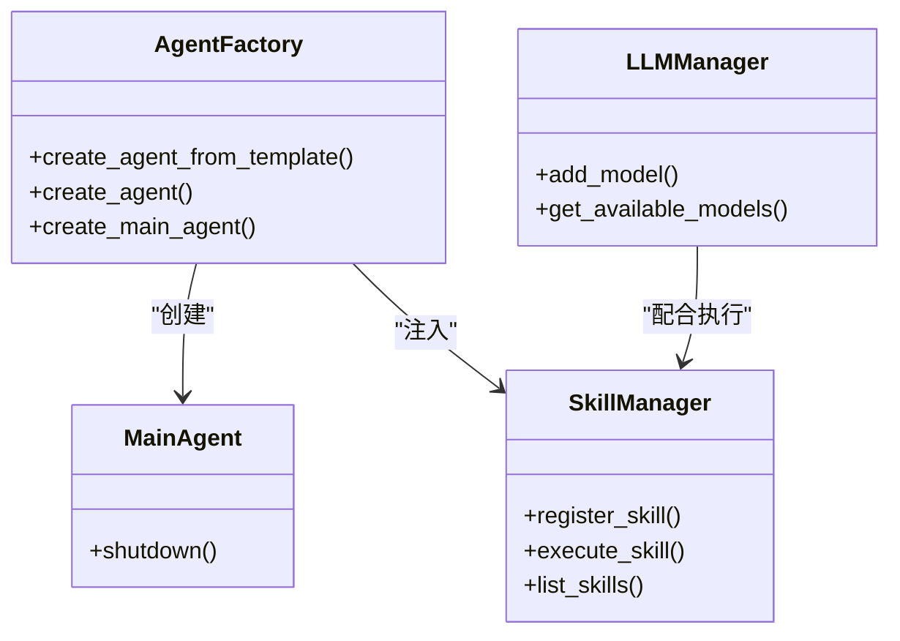
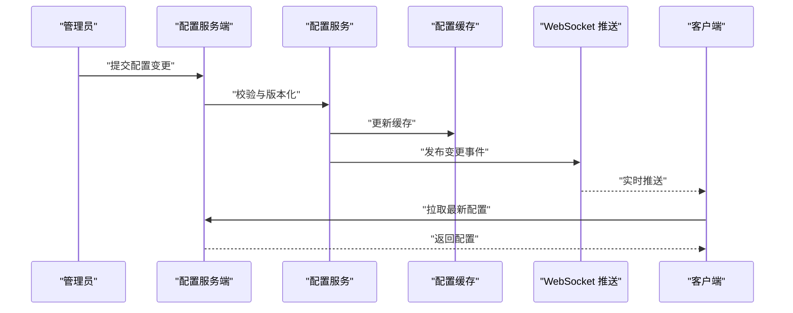
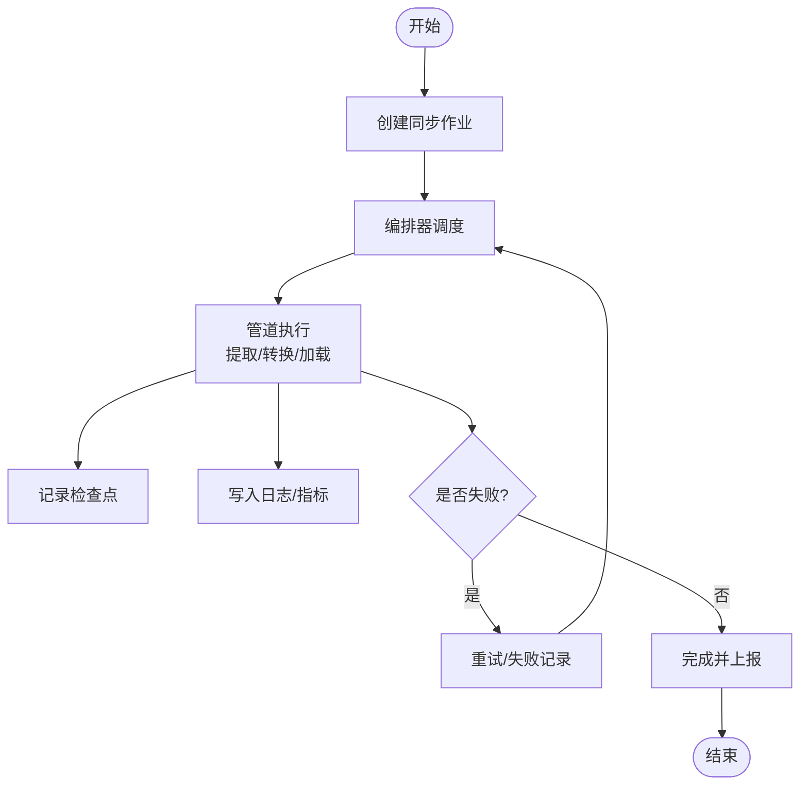
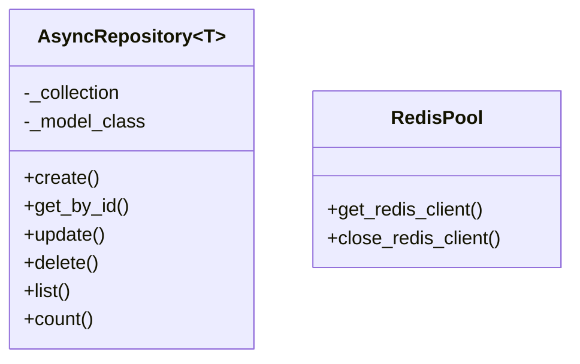
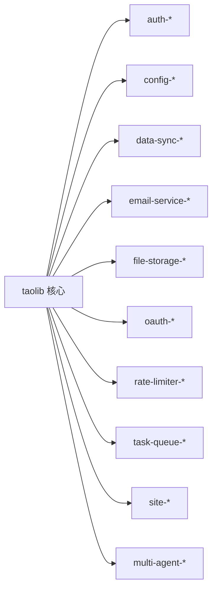

# 项目概述

<cite>
**本文引用的文件**
- [README.md](file://README.md)
- [pyproject.toml](file://pyproject.toml)
- [AGENTS.md](file://AGENTS.md)
- [src/taolib/__init__.py](file://src/taolib/__init__.py)
- [src/taolib/testing/__init__.py](file://src/taolib/testing/__init__.py)
- [src/taolib/testing/_base/repository.py](file://src/taolib/testing/_base/repository.py)
- [src/taolib/testing/_base/redis_pool.py](file://src/taolib/testing/_base/redis_pool.py)
- [src/taolib/testing/multi_agent/__init__.py](file://src/taolib/testing/multi_agent/__init__.py)
- [src/taolib/testing/config_center/__init__.py](file://src/taolib/testing/config_center/__init__.py)
- [src/taolib/testing/data_sync/__init__.py](file://src/taolib/testing/data_sync/__init__.py)
- [examples/multi_agent_example.py](file://examples/multi_agent_example.py)
- [tasks.py](file://tasks.py)
</cite>

## 目录
1. [引言](#引言)
2. [项目结构](#项目结构)
3. [核心组件](#核心组件)
4. [架构总览](#架构总览)
5. [详细组件分析](#详细组件分析)
6. [依赖分析](#依赖分析)
7. [性能考虑](#性能考虑)
8. [故障排查指南](#故障排查指南)
9. [结论](#结论)
10. [附录](#附录)

## 引言
FlexLoop（taolib）是一个以“道法自然”为设计哲学的 Python 库，强调顺应自然规律与系统演化，追求最小核心、按需扩展、模块自治与可观测性。项目通过可选依赖组（extras）将复杂能力模块化，核心保持极简，便于在不同场景下灵活组合使用。

- 核心价值主张
  - 以终为始：围绕真实业务目标构建，避免过度工程化。
  - 道法自然：尊重系统演化的自然节律，采用渐进式、可观察的迭代方式。
  - 最小核心：核心依赖为空，功能通过可选依赖按需启用，降低引入成本。
  - 可观测与可治理：提供审计、分析、限流、推送等治理能力，支撑稳定运营。

- 技术架构理念
  - 分层与自治：每个功能域自包含模型、仓储、服务、事件与服务端（可选）。
  - 异步优先：广泛采用异步 I/O，结合 Redis/Motor/HTTPX 等生态组件。
  - 可插拔与可替换：认证、存储、LLM 提供商、队列等均支持注册与切换。
  - 文档即规范：通过文档驱动的规格与实现对齐，减少重复与漂移。

- 整体设计理念
  - 以“单一真实来源”（SSOT）约束键名、配置与接口契约，避免分散维护。
  - 以“文档整合原则”串联规格、架构与实现，形成闭环。
  - 以“经验教训与最佳实践”沉淀团队共识，指导新功能接入与重构。

- 应用场景与目标用户
  - 场景：企业配置中心、数据同步与迁移、统一认证授权、用户行为分析、邮件与文件存储、多智能体编排、API 限流与可观测平台。
  - 用户：工程师、架构师、运维与平台团队；既适合快速原型与小规模部署，也适合中大型系统的可插拔能力扩展。

**章节来源**
- [README.md:1-100](file://README.md#L1-L100)
- [AGENTS.md:5-22](file://AGENTS.md#L5-L22)

## 项目结构
项目采用“功能域 + 层次化”的组织方式，核心位于 src/taolib 下，按功能域划分子包，并在每个域内遵循“models/repository/services/events/server/client”的分层结构。顶层 pyproject.toml 通过可选依赖组定义各域的完整能力集，便于按需安装。

**图表来源**
- [pyproject.toml:20-235](file://pyproject.toml#L20-L235)
- [src/taolib/testing/_base/__init__.py:1-16](file://src/taolib/testing/_base/__init__.py#L1-L16)
- [src/taolib/testing/config_center/__init__.py:1-70](file://src/taolib/testing/config_center/__init__.py#L1-L70)
- [src/taolib/testing/data_sync/__init__.py:1-87](file://src/taolib/testing/data_sync/__init__.py#L1-L87)
- [src/taolib/testing/multi_agent/__init__.py:1-181](file://src/taolib/testing/multi_agent/__init__.py#L1-L181)

**章节来源**
- [pyproject.toml:20-235](file://pyproject.toml#L20-L235)
- [AGENTS.md:71-128](file://AGENTS.md#L71-L128)

## 核心组件
- 基础设施层（_base）
  - 异步仓储基类：提供通用的 CRUD 与分页统计能力，面向 MongoDB。
  - Redis 客户端管理：提供单例式异步 Redis 客户端获取与关闭。
- 功能域组件（按需启用）
  - 配置中心：多环境配置、版本控制、审计、缓存与实时推送。
  - 数据同步：MongoDB 到 MongoDB 的增量/全量同步、检查点、失败追踪与调度。
  - 认证授权：JWT + RBAC + API Key + Token 黑名单，FastAPI 集成。
  - 行为分析：事件采集、会话追踪、聚合分析与前端 SDK。
  - 邮件服务：多提供商（SMTP/SendGrid/Mailgun/SES）与模板引擎、故障转移。
  - 文件存储：S3/本地双后端、分片上传、缩略图与 CDN。
  - OAuth2：Google/GitHub 授权码流程与 Token 加密。
  - 限流中间件：滑动窗口算法、TOML 配置与违规追踪。
  - 任务队列：Redis 优先级队列、Worker 管理与重试。
  - 博客/CMS：FastAPI + SQLAlchemy + Markdown + RSS。
  - 多智能体：LLM 管理、技能注册与编排、主从代理模式。

**章节来源**
- [src/taolib/testing/_base/repository.py:15-131](file://src/taolib/testing/_base/repository.py#L15-L131)
- [src/taolib/testing/_base/redis_pool.py:11-38](file://src/taolib/testing/_base/redis_pool.py#L11-L38)
- [AGENTS.md:81-128](file://AGENTS.md#L81-L128)

## 架构总览
整体采用“功能域自治 + 基础设施复用”的分层架构。每个域自包含模型、仓储、服务、事件与服务端（可选），通过可选依赖组按需装配。基础设施层提供统一的异步仓储与 Redis 客户端，保证跨域一致性与可移植性。

**图表来源**
- [src/taolib/testing/_base/redis_pool.py:11-38](file://src/taolib/testing/_base/redis_pool.py#L11-L38)
- [src/taolib/testing/_base/repository.py:15-131](file://src/taolib/testing/_base/repository.py#L15-L131)
- [src/taolib/testing/config_center/__init__.py:1-70](file://src/taolib/testing/config_center/__init__.py#L1-L70)
- [src/taolib/testing/data_sync/__init__.py:1-87](file://src/taolib/testing/data_sync/__init__.py#L1-L87)
- [src/taolib/testing/multi_agent/__init__.py:1-181](file://src/taolib/testing/multi_agent/__init__.py#L1-L181)

## 详细组件分析

### 多智能体系统（multi_agent）
- 设计要点
  - 模型与协议：Agent/Task/Skill/Message 等模型清晰定义，支持枚举与文档化。
  - 技能体系：技能注册表与管理器，支持预设技能与动态扩展。
  - LLM 管理：模型注册、权重与负载均衡，支持多种提供商。
  - 主从代理：主代理协调子代理，形成协作式工作流。
- 使用示例
  - 技能使用、智能体创建、主智能体生命周期与 LLM 管理均有示例演示。

**图表来源**
- [src/taolib/testing/multi_agent/__init__.py:6-89](file://src/taolib/testing/multi_agent/__init__.py#L6-L89)
- [examples/multi_agent_example.py:14-33](file://examples/multi_agent_example.py#L14-L33)

**章节来源**
- [src/taolib/testing/multi_agent/__init__.py:1-181](file://src/taolib/testing/multi_agent/__init__.py#L1-L181)
- [examples/multi_agent_example.py:36-196](file://examples/multi_agent_example.py#L36-L196)

### 配置中心（config_center）
- 设计要点
  - 多环境配置、版本控制与审计日志，支持缓存与事件推送。
  - 服务端基于 FastAPI，客户端 SDK 提供拉取与订阅能力。
- 关键流程
  - 配置变更 → 验证 → 版本化 → 缓存更新 → 推送通知 → 客户端感知。

**图表来源**
- [src/taolib/testing/config_center/__init__.py:1-70](file://src/taolib/testing/config_center/__init__.py#L1-L70)

**章节来源**
- [AGENTS.md:81-120](file://AGENTS.md#L81-L120)

### 数据同步（data_sync）
- 设计要点
  - 支持增量/全量同步、自定义转换、检查点恢复与失败追踪。
  - 服务端提供作业管理、日志与指标接口，支持定时与手动触发。
- 关键流程
  - 作业创建 → 编排器调度 → 管道执行（提取/转换/加载）→ 日志与检查点记录 → 结果上报。

**图表来源**
- [src/taolib/testing/data_sync/__init__.py:1-87](file://src/taolib/testing/data_sync/__init__.py#L1-L87)

**章节来源**
- [AGENTS.md:89-92](file://AGENTS.md#L89-L92)

### 基础设施（_base）
- 设计要点
  - 异步仓储基类：统一 CRUD、分页与统计，适配 Pydantic 模型。
  - Redis 客户端：单例式异步客户端，支持关闭与重用。
- 复杂度与性能
  - CRUD 操作为 O(1) 写入与 O(n) 查询（受索引与分页影响）。
  - Redis 操作为 O(1)，注意批量写入与连接池复用。

**图表来源**
- [src/taolib/testing/_base/repository.py:15-131](file://src/taolib/testing/_base/repository.py#L15-L131)
- [src/taolib/testing/_base/redis_pool.py:11-38](file://src/taolib/testing/_base/redis_pool.py#L11-L38)

**章节来源**
- [src/taolib/testing/_base/repository.py:1-131](file://src/taolib/testing/_base/repository.py#L1-L131)
- [src/taolib/testing/_base/redis_pool.py:1-38](file://src/taolib/testing/_base/redis_pool.py#L1-L38)

## 依赖分析
- 核心依赖策略
  - 核心包依赖为空，通过可选依赖组（extras）装配各功能域能力。
  - 每个域的依赖在 pyproject.toml 中集中声明，便于版本锁定与安全审计。
- 关键外部依赖
  - 异步数据库：Motor（MongoDB）。
  - 异步网络：HTTPX、Uvicorn、FastAPI。
  - 缓存与消息：Redis（hiredis）。
  - 文件存储：aiobotocore（S3）。
  - 类型与配置：Pydantic、Pydantic Settings。
  - 文档与构建：Sphinx、Invoke、MyST。
- 可选依赖组举例
  - auth-server、config-server、data-sync-server、email-service-server、file-storage-server、task-queue-server、qrcode-server、oauth-server 等，分别提供对应域的服务端能力。

**图表来源**
- [pyproject.toml:20-235](file://pyproject.toml#L20-L235)

**章节来源**
- [pyproject.toml:20-235](file://pyproject.toml#L20-L235)

## 性能考虑
- 异步优先：广泛使用异步 I/O，减少阻塞，提升并发吞吐。
- 缓存策略：配置中心与限流等模块利用 Redis 缓存热点数据，降低数据库压力。
- 批量操作：数据同步使用批量写入与检查点，减少往返与回滚成本。
- 资源复用：Redis 客户端单例化，避免频繁连接/断开。
- 监控与可观测：行为分析、日志平台与指标收集，辅助性能诊断与容量规划。

[本节为通用指导，无需特定文件引用]

## 故障排查指南
- 常见问题与解决方案
  - Python 2 遗留语法：统一使用现代异常捕获语法。
  - pydantic-settings v2 配置语法：使用 SettingsConfigDict。
  - Starlette TemplateResponse API 变更：遵循新签名。
  - Windows GBK 编码崩溃：包装 stdout 为 UTF-8 并设置错误处理策略。
  - SQLAlchemy 2.0 废弃 API：使用推荐的新式 API。
  - Redis Mock 数据结构：扩展 MockRedis 以支持 LIST/HASH/pipeline/scan。
  - 循环依赖类型标注：使用字符串形式的类型标注。
- 安全加固
  - 密码哈希：从 SHA-256 迁移到 bcrypt，支持存量用户平滑过渡。
  - JWT 密钥验证：确保密钥长度满足最低要求。
  - API 安全防护：实现基于 IP 与用户的限流，使用 HTTPS 加密传输。

**章节来源**
- [AGENTS.md:241-256](file://AGENTS.md#L241-L256)

## 结论
FlexLoop（taolib）以“道法自然”的理念，构建了一个最小核心、按需扩展、可观测与可治理的 Python 能力库。通过功能域自治与基础设施复用，项目既能满足快速落地的需求，也能支撑复杂系统的长期演进。建议在引入时遵循可选依赖组与文档规范，确保新增能力与既有模块在契约与可观测性上保持一致。

[本节为总结性内容，无需特定文件引用]

## 附录

### 技术栈概览
- Python：3.14 及以上，充分利用延迟注解与新特性。
- 异步生态：FastAPI、Uvicorn、HTTPX、Motor、Redis(hiredis)、aiobotocore。
- 配置与类型：Pydantic、Pydantic Settings。
- 文档与构建：Sphinx、Invoke、MyST、Mermaid。
- 测试与质量：pytest、coverage、ruff、pre-commit。

**章节来源**
- [AGENTS.md:24-36](file://AGENTS.md#L24-L36)
- [pyproject.toml:20-235](file://pyproject.toml#L20-L235)

### 核心特性列表
- 文档构建自动化（Sphinx + Invoke）
- 远程 SSH 探测与环境检测
- 中文 Matplotlib 字体配置
- 中心化配置管理（多环境、版本、审计、实时推送）
- MongoDB 数据同步（增量/全量、检查点、转换、调度）
- 统一认证授权（JWT + RBAC + API Key + Token 黑名单）
- 用户行为分析（事件采集、会话追踪、聚合分析）
- 多提供商邮件服务（SMTP/SendGrid/Mailgun/SES + 故障转移 + 模板引擎）
- 文件存储与 CDN（S3/本地 + CloudFront + 图片处理）
- OAuth2 第三方登录（Google/GitHub + Token 加密）
- API 限流中间件（滑动窗口 + TOML 配置 + 违规追踪）
- 后台任务队列（Redis 优先级队列 + Worker 管理 + 重试）
- 博客/CMS 平台（FastAPI + SQLAlchemy + Markdown + RSS）

**章节来源**
- [AGENTS.md:7-21](file://AGENTS.md#L7-L21)

### 项目发展历程（里程碑）
- Phase A：安全修复（nul 清理、JWT 验证、bcrypt 迁移）
- Phase B：Monorepo 基础设施（pnpm workspace、包重命名、QR 迁移）
- Phase C：共享前端包（@tao/shared、@tao/ui、@tao/api-client）
- Phase D：类型安全与质量提升（OpenAPI、测试、CI）

**章节来源**
- [AGENTS.md:265-273](file://AGENTS.md#L265-L273)

### 文档与构建
- 文档构建：通过 Invoke 的 Collection 封装 Sphinx，支持单项目与多项目构建。
- 示例：多智能体使用示例脚本演示技能、智能体与 LLM 管理器的典型用法。

**章节来源**
- [AGENTS.md:73-100](file://AGENTS.md#L73-L100)
- [examples/multi_agent_example.py:1-196](file://examples/multi_agent_example.py#L1-L196)
- [tasks.py:1-4](file://tasks.py#L1-L4)