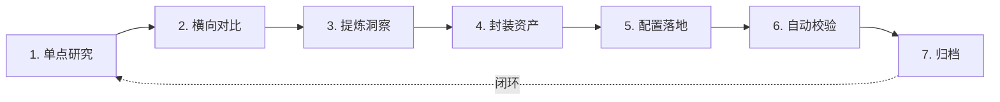

# 复盘 → 洞察 → 沉淀 工作流 Skill

> **类型**：工作流编排指令 · 非工具型 Skill
>
> **触发来源**：[`apps/chaos/docs/topics/retrospective-to-asset-workflow.md`](file:///d:/spaces/AgentForge/apps/chaos/docs/topics/retrospective-to-asset-workflow.md)
>
> **前置依赖**：`spa-content-extractor` / `defuddle` / `agent-browser`（在 `default_skills` 中已配置）

---

## 0. 执行日志格式（全局）

> 每个 Step 开始时输出 `[Sn]` 行，结束时输出 `[Sn] DONE`，中间记录关键决策节点。卡住时先查日志定位到哪个 `[Sn]` 未出现 DONE。

**日志前缀约定**：

| 前缀 | 含义 |
|------|------|
| `[Sn] START` | Step n 开始，附关键参数 |
| `[Sn] STAGE*` | 子阶段开始（Step 1 专有：STAGE1=defuddle, STAGE2=browser, STAGE3=scroll） |
| `[Sn] RESULT` | 工具/脚本执行结果 |
| `[Sn] DECISION` | 关键分支判断（附理由） |
| `[Sn] VERIFY` | 写后读校验 |
| `[Sn] TRIGGER` | 触发下一个工具/阶段 |
| `[Sn] DONE` | Step n 完成，附产物路径 |
| `[Sn] FAIL` | 卡点+原因，触发自检 |

**日志级别**：

- `INFO`：正常推进（输出）
- `WARN`：出现异常但可自愈（降级/重试）
- `FAIL`：需人工介入（报给用户）

---

## 1. 触发条件

当检测到以下任一信号时，**主动询问用户是否进入七步法**：

- 用户说"学习这个 URL"、"调研"、"研究一下"、"抓这个页面"
- 抓取过程中遇到 SPA / 反爬 / 编码等**新问题并成功解决**
- 同一类任务出现了 **≥ 2 个相似案例**
- 用户说"规律到项目"、"沉淀一下"、"封装"

> 若任务简单、且无新经验产生，停在第 3 步（写报告）即可，不需要走完七步。

---

## 1. 七步骨架



---

## 3. 每步执行指南

### Step 1 — 单点研究

**动作**：按 `spa-content-extractor` 的 SPA 三阶段抓取内容。

**产物**：`.temp/<slug>-report.md`

**原则**：静态优先（defuddle），SPA 降级（agent-browser）。

**📋 日志节点**：
```
[S1] START   slug=<任务缩写> url=<目标URL>
[S1] STAGE1  defuddle → {bytes} bytes | < 500 → 降级
[S1] STAGE2  agent-browser → loading / networkidle
[S1] STAGE2  eval innerText → {n} chars
[S1] STAGE3  scroll+wait → {n} chars (diff: +{delta})
[S1] DONE    .temp/<slug>-report.md ({n} chars)
```

> **卡点自检**：若 STAGE1 返回 < 500 字节，检查是否为 SPA；若 STAGE2 `open` 超时，检查是否为 Bolt.new 类 SSR 站。

---

### Step 2 — 横向对比

**动作**：同主题找 3-5 个案例并行抓取，输出矩阵表。

**产物**：`.temp/<slug>-benchmark.md`

**原则**：不求全，只抓与本次任务最相关的维度（如定价 / 赛事 / 社区）。

**📋 日志节点**：
```
[S2] START   topic=<主题> cases={n}
[S2] PARALLEL → [case1] {url} / [case2] {url} / ...
[S2] RESULT   ✓ n 成功 | ✗ n 失败 | → fallback n
[S2] MATRIX   {n}行 × {m}列
[S2] DONE    .temp/<slug>-benchmark.md
```

> **卡点自检**：若 > 2 个案例失败，触发 Cloudflare 或 geo 限制，立即降级到"公开资料 + 用户补充"而非重试。

---

### Step 3 — 提炼洞察

**动作**：综合 Step 1-2，输出结构化洞察报告。

**产物**：覆盖"产品 / 增长 / 市场"等维度（视主题而定），不要只堆数据。

**原则**：给出判断，不要只说"各家差不多"。

**📋 日志节点**：
```
[S3] START   sources={n} (.temp/<slug>-report.md + <n>x benchmark)
[S3] READ    读取 {n} 个源文件 → {t}ms
[S3] ANALYZE → 生成 {n} 条关键判断 in {t}s
[S3] CLAIM   生成 {n} 条关键判断
[S3] VERDICT → {一句话结论}
[S3] TOTAL   Step 3 总耗时 {t}s
[S3] DONE    洞察报告 ({n} chars, {t}s)
```

> **卡点自检**：若 3 个维度都写不出实质性判断，说明数据量不足，返回 Step 2 补充案例。

---

### Step 4 — 封装资产

**动作**：

1. 判断本次产生了什么可复用资产：
   - 新工具流程 → 创建 `.trae/skills/<name>/SKILL.md`
   - 脚本/模板 → 放 `.temp/<name>.py` 或 `.temp/<name>-template.md`
2. 用 `skill-creator` 工具生成 Skill 框架（如果创建新 Skill）

**产物**：`.trae/skills/<name>/SKILL.md`

**原则**：封装前必须已有 ≥ 2 个真实案例验证。

**📋 日志节点**：
```
[S4] START
[S4] ASSET   type={SKILL|script|template} name=<name>
[S4] VALIDATE ≥2 案例验证? → YES/NO
[S4] SKILL_CREATOR → .trae/skills/<name>/SKILL.md
[S4] DONE
```

> **卡点自检**：若不足 2 个案例，记录为"临时方案"待下次补充，不强制创建 Skill。

---

### Step 5 — 配置落地

**动作**：

1. 把新 Skill 加入 `.trae/settings.json` 的 `default_skills`
2. 立即用一次真实任务验证 Skill 可被自动加载

**产物**：`settings.json` 更新

**📋 日志节点**：
```
[S5] START   skill=<name>
[S5] READ    .trae/settings.json
[S5] WRITE   default_skills += "<name>"
[S5] VERIFY  读回 settings.json 确认写入
[S5] TRIGGER 用新 Skill 执行一次真实任务（轻量）
[S5] RESULT  ✓ 自动加载成功 | ✗ 未触发 → 检查 settings.json
[S5] DONE
```

> **卡点自检**：若写入后读回不一致，检查 JSON 格式（逗号、缩进）；若 Skill 未自动加载，检查 `name` 字段与 settings.json 中的名称是否完全一致。

---

### Step 6 — 自动校验

**动作**：根据 Skill 类型写/运行校验脚本。

| Skill 类型 | 校验重点 |
|------------|----------|
| SKILL.md | description ≤ 200 字符、H1 不在代码块内、MUST 字段完整 |
| 脚本 | `python <script>.py` 无报错 |
| 模板 | 检查占位符 `{{}}` 无悬空 |

**产物**：`.temp/check_<name>.py`

**📋 日志节点**：
```
[S6] START   type=<skill|script|template>
[S6] RUN     python .temp/check_<name>.py
[S6] RESULT  PASS ({n} checks) | FAIL {n} errors
[S6] FIX     → 逐条修复
[S6] RERUN   → PASS
[S6] DONE
```

> **卡点自检**：若校验脚本本身报错，检查 Python 环境（Windows 用 `uv run`）；若 description 超长，优先删除"triggers on"式描述。

---

### Step 7 — 归档

**动作**：把方法论归档到项目 `.agents/` 体系。

| 经验类型 | 归档位置 |
|----------|----------|
| 工具/URL 模式经验 | `apps/chaos/.agents/docs/references/`（追加到现有文件） |
| 工作流骨架规律 | `apps/chaos/docs/topics/`（新建 topic） |
| 完整任务复盘 | `apps/chaos/.agents/docs/superpowers/retrospectives/` |

**产物**：reference / topic / retrospective 文档

**原则**：优先追加到现有文件，避免创建同名新文件。

**📋 日志节点**：
```
[S7] START
[S7] TYPE    <reference|topic|retrospective>
[S7] TARGET  <文件路径>
[S7] EXISTS  YES → 追加章节 | NO → 新建
[S7] LINK    在关联文档中增加交叉引用
[S7] DONE    <文件路径> ({n} lines)
```

> **卡点自检**：若目标文件已有同名章节，追加 §N 而非覆盖；cross-link 双向检查（写入新文件时检查旧文件是否需要引用）。

---

## 3. 产出位置速查

| 产物 | 放哪 | 不放哪 |
|------|------|--------|
| 中间产物 | `.temp/` | 项目根 |
| 终稿报告 | `.temp/<slug>-report.md` | 主 README |
| Skill | `.trae/skills/<name>/SKILL.md` | `apps/chaos/.agents/` |
| 校验脚本 | `.temp/check_<name>.py` | 长期可移 `scripts/` |
| 方法论 | `apps/chaos/.agents/docs/references/` | `docs/` |
| 工作流规律 | `apps/chaos/docs/topics/` | `.agents/rules/`（需五维检验） |

---

## 5. 反模式清单

- ❌ 跳过横向对比直接封装 → Skill 无泛化能力
- ❌ 跳过洞察只说"抓到了" → 无抽象经验
- ❌ 封装后不配到 settings.json → 靠人记，不用自动加载
- ❌ 不写校验脚本 → 后续修改累积格式错误
- ❌ 经验留在 `.temp/` 不归档 → 下次找不到
- ❌ 每次都从 Step 1 开始 → 复用已有 Skill

---

*版本：v0.3 · 2026-06-21 · 新增：S2/S3 耗时统计日志*
