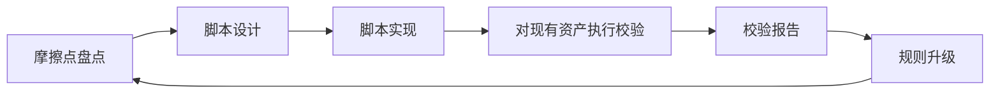

# 技能生态型基础设施校验脚本

## Goal

将三轮复盘反复出现的摩擦点（tasks/checklist 同步、引用完整性缺失、回流动作遗漏）脚本化为一组只读校验工具，验证"柔性校验"模式能否在不新增流程规则的前提下降低人工维护成本，并回流到 `.agents/scripts/` 与规则体系。

## Background

### 当前上下文

- 探索型能力底座已建立（协议页 + 4 个模板），第一轮试点 `exploration-knowledge-loop-pilot` 完成全链路验证
- 三轮复盘（knowledge-loop-pilot、reference-integrity-check、template-reuse-check）反复确认了相同的摩擦点
- 自动化延后条件（至少 2 个 WARN/MISSING 样本）已接近满足
- `skills.md` 规则中声明了 SKILL.md 7 个必填章节的校验要求，但无对应脚本
- `citations.md` 定义了引用规范，但未覆盖交叉引用完整性检查

### 已有相关资产

- `.agents/docs/references/knowledge-driven-exploration-protocol.md`：统一探索协议
- `.agents/docs/templates/knowledge-driven-exploration-workbench-template.md`：工作台模板（含已升级的 checklist 骨架）
- `.agents/docs/superpowers/retrospectives/2026-05-24-exploration-knowledge-loop-pilot.md`：第一轮试点复盘
- `.agents/docs/superpowers/retrospectives/2026-05-24-exploration-reference-integrity-check.md`：引用完整性检查复盘
- `.agents/docs/superpowers/retrospectives/2026-05-24-exploration-template-reuse-check.md`：模板复用检查复盘
- `.agents/rules/skills.md`：技能开发与校验规则
- `.agents/rules/citations.md`：引用与参考规范
- `.agents/rules/python.md`：Python 开发规范（`uv` 管理依赖）
- `.trae/specs/exploration-knowledge-loop-pilot/`：第一轮试点工作台

### 为什么现在做

- 三轮复盘的摩擦点指向同一个根因：人工校验不可靠
- 延后条件"需至少 2 个 WARN/MISSING 样本"已接近满足——第一轮试点已有明确偏差记录
- 当前技能生态仅 2 个技能，是建立校验机制的窗口期——技能数量增长后再补校验，成本会指数级上升
- 这是验证"纯粹复用协议、零新规则"能否跑通第二轮闭环的最佳机会

## Scope

- 设计并实现 4 个独立只读校验脚本：
  1. `validate-workbench.py`：检查 `.trae/specs/<topic>/` 下三文件结构完整性与 checklist 状态一致性
  2. `validate-skill-md.py`：检查 `.agents/skills/<name>/SKILL.md` 是否包含必填的 7 个章节
  3. `validate-references.py`：检查协议页、场景目录、模板、复盘之间的交叉引用有效性
  4. `validate-retro-feedback.py`：检查复盘文档是否包含至少一个可执行回流动作
- 对现有 4 轮探索工作台 + 2 个技能的 SKILL.md 执行校验
- 以校验输出为证据，升级 `.agents/rules/skills.md` 或 `.agents/rules/citations.md` 中相关约束

## Non-Goals

- 本次不实现自动化修复（只检出，不修改）
- 本次不做 Git Hook 或 CI 集成（仅产出独立可运行脚本）
- 本次不扩展校验维度到协议页以外的资产类型
- 本次不修改现有模板的字段结构（只读校验）
- 本次不新增 `.agents/rules/` 之外的规则文件

## Core Loop

- 脚本设计阶段明确每个校验项的 PASS/WARN/MISSING 语义
- 脚本实现阶段优先保证零外部依赖，纯 Python + 标准库
- 校验执行阶段以现有 `.trae/specs/` 和 `.agents/skills/` 下的真实资产为输入
- 规则升级阶段根据校验报告中的 WARN/MISSING 决定如何修订 `skills.md` 或 `citations.md`

## Layer Mapping

- 共性知识层：探索协议页、工作台模板、场景卡模板、skills.md 规则、citations.md 规则
- 场景适配层：技能生态型探索，适配字段聚焦触发条件、输入输出契约与评测口径
- 轻工作流层：`.trae/specs/skill-ecosystem-validation-scripts/` 下的 spec / tasks / checklist 三文件结构
- 回流演化层：脚本产出落位 `.agents/scripts/validation/`；校验结果回写规则文件

## Deliverables

1. 工作台三文件（spec.md、tasks.md、checklist.md）
2. `.agents/scripts/validation/validate-workbench.py`
3. `.agents/scripts/validation/validate-skill-md.py`
4. `.agents/scripts/validation/validate-references.py`
5. `.agents/scripts/validation/validate-retro-feedback.py`
6. 校验执行报告（Markdown，包含各脚本对现有资产的 PASS/WARN/MISSING 输出）
7. 升级后的规则文件（`skills.md` 或 `citations.md`，至少一处实质性修订）

## Validation

- 低摩擦：从场景卡到 spec 是否直接复用上一轮协议与模板，零新规则
- 可复用：4 个校验脚本是否独立可运行且零外部依赖
- 可回流：校验报告是否指向至少一条实质性规则升级
- 可扩展：新增一个校验维度时是否只需新增一个独立脚本，不修改现有脚本

## Risks

- 如果脚本编写过度追求覆盖率，会违背"柔性"原则——首版应只覆盖三轮复盘中明确确认的 WARN/MISSING 项
- 如果脚本与模板字段名硬编码耦合，模板微调即脚本失效——应通过模板解析而非字符串匹配来降低耦合
- 如果在脚本实现阶段发现有新的校验需求，容易导致 scope creep——严格遵循 Non-Goals，新需求记录为复盘建议
- 如果对现有资产执行校验时发现大量 WARN/MISSING，可能引发"先修复资产还是先完成脚本"的决策困境——脚本是第一优先级，WARN/MISSING 是输出而非阻塞项

## Rollback Or Adjustment

- 如果脚本实现成本超出时间盒，优先缩减校验维度：保留 `validate-workbench.py` 和 `validate-skill-md.py`，其余两个记录为复盘建议
- 如果脚本对现有资产的校验结果与人工判断偏差大，复盘时应记录为"评测口径需调整"，不在此轮中修改脚本逻辑
- 如果模板解析方案过于复杂，允许首版使用简单正则匹配，将其记录为技术债务

## Next Step

- 进入 plan 的条件：本文档（spec）边界已确认，场景卡字段已通过校验
- 进入方式：在 `tasks.md` 中拆解执行任务，按 `checklist.md` 逐项追踪
