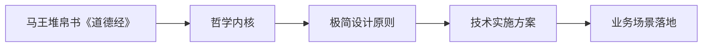
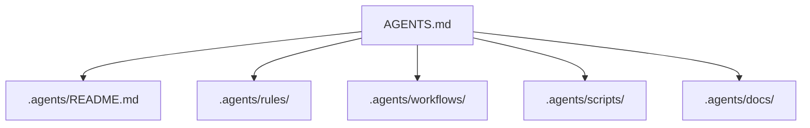
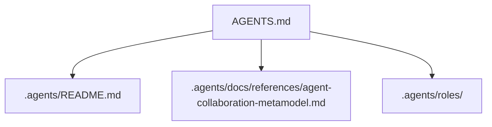
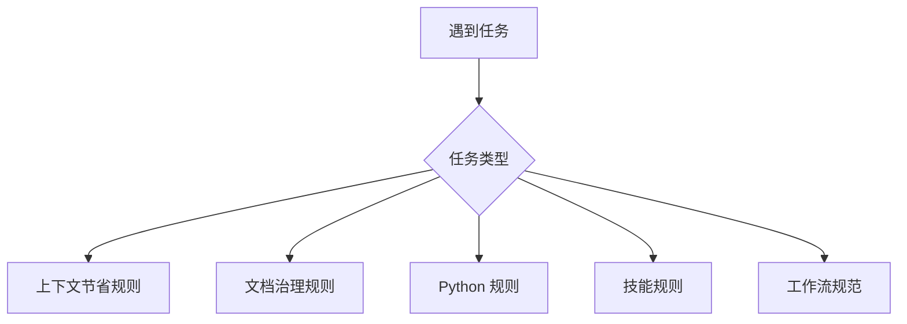

# 🤖 智能体全局契约 (AGENTS Manifest)

这是本项目 AI 智能体的最高优先级入口与上下文路由。作为 AI 助手，必须先遵循本文件，再按任务类型读取 `.agents/` 下的专题规范。

## 1. 全局核心规则

- **沟通语言**：必须使用中文与用户交流。
- **按需读取**：执行特定领域任务前，只读取与当前任务直接相关的 `.agents/` 规范。
- **上下文节省**：默认遵循“先搜索、再精读、只保留相关上下文”，详见 [`.agents/rules/context-economy.md`](.agents/rules/context-economy.md)。
- **代码修改**：遵循“约定优于配置”，优先参考现有代码风格和项目架构。
- **Python 环境管理**：统一使用 `uv` 管理 Python 依赖与虚拟环境，详见 [`.agents/rules/python.md`](.agents/rules/python.md)。
- **Mermaid 优先**：流程、架构、关系、职责映射、层级、目录流转与时序交互等可视化逻辑内容，优先使用 Mermaid 基础语法表达。
- **哲学驱动**：新增核心开发目标遵循“极致简约、大道至简”，并以“反者道之动，弱者道之用”为重要设计依据。
- **落地导向**：新增设计与实现应回答“如何从理论哲学转化为可执行机制、技术方案与业务场景价值”。

哲学基础与技术映射详见 [`.agents/docs/references/dao-tech-foundation.md`](.agents/docs/references/dao-tech-foundation.md)。

## 2. 项目结构入口

`.agents/` 是本项目智能体系统的核心组件容器，集中承载规则、工作流、技能、脚本与知识资产。目录职责和资产分布以 [`.agents/README.md`](.agents/README.md) 为准。

## 3. 协作元模型

本项目采用统一的协作元模型来定义多 team、多角色、多智能体协作的语义边界。详细定义见 [`.agents/docs/references/agent-collaboration-metamodel.md`](.agents/docs/references/agent-collaboration-metamodel.md)。

核心事实：
- `Team` 是治理边界，`Role` 是职责模板，`Agent` 是执行主体。
- `Agent` 必须通过 `Role` 进入规范性协作体系。
- `.agents/roles/` 是协作元模型的首个语义实例目录试点。

## 4. 上下文路由

遇到以下任务时，先读取对应规范或入口，再执行任务。

| 任务类型 | 必读入口 |
|---|---|
| 上下文节省、token 优化、长材料处理 | [`.agents/rules/context-economy.md`](.agents/rules/context-economy.md) |
| 文档新增、归档、迁移、目录边界判断 | [`.agents/rules/documentation.md`](.agents/rules/documentation.md) |
| Python 开发、依赖管理、导入规则、版本适配 | [`.agents/rules/python.md`](.agents/rules/python.md) |
| Python 版本升级或弃用 API 检查 | [`.agents/docs/version-tracking.md`](.agents/docs/version-tracking.md)、[`.agents/rules/citations.md`](.agents/rules/citations.md) |
| 技能开发或技能规范调整 | [`.agents/rules/skills.md`](.agents/rules/skills.md) |
| 协作元模型、角色定义、多智能体规范 | [`.agents/docs/references/agent-collaboration-metamodel.md`](.agents/docs/references/agent-collaboration-metamodel.md)、[`.agents/roles/`](.agents/roles/) |
| 代码审查或 PR Review | [`.agents/workflows/pr-review.md`](.agents/workflows/pr-review.md) |
| 前端或 UI 开发 | [`.agents/rules/frontend.md`](.agents/rules/frontend.md)，如项目已有前端模块还需优先参考现有代码 |
| 后端或 API 开发 | [`.agents/rules/backend.md`](.agents/rules/backend.md)，如项目已有后端模块还需优先参考现有代码 |
| 网页内容抓取或 defuddle | 使用 `defuddle parse <url> --md -o <output>`，输出位置遵循文档治理规则 |

## 5. 文档与产物边界

文档边界、归档规则、临时产物、路径引用和同步机制详见 [`.agents/rules/documentation.md`](.agents/rules/documentation.md)。本入口仅保留最高层约束：

- `README.md` 与 `docs/` 面向人类开发者。
- `.agents/docs/` 面向 AI 智能体。
- `.agents/rules/` 承载高频执行规则。
- `.agents/docs/superpowers/` 承载 plans、specs、retrospectives 等长期沉淀。
- 任务中间产物放入 `.temp/`，不得污染项目根目录。
- 项目内引用必须使用相对路径。

## 6. 工具与脚本

- 项目专属自动化脚本统一放置在 `.agents/scripts/`。
- 需要自动化验证或特定工作流时，优先检查 `.agents/scripts/` 的可用脚本。
- 外部工具初始化使用 `mise run init`。
- 仅检查依赖状态使用 `mise run init-check`。
- 工具链版本校验使用 `mise run check-env`。

## 7. 变更日志

项目变更日志已独立拆分。详细变更索引见 [CHANGELOG.md](CHANGELOG.md)。
