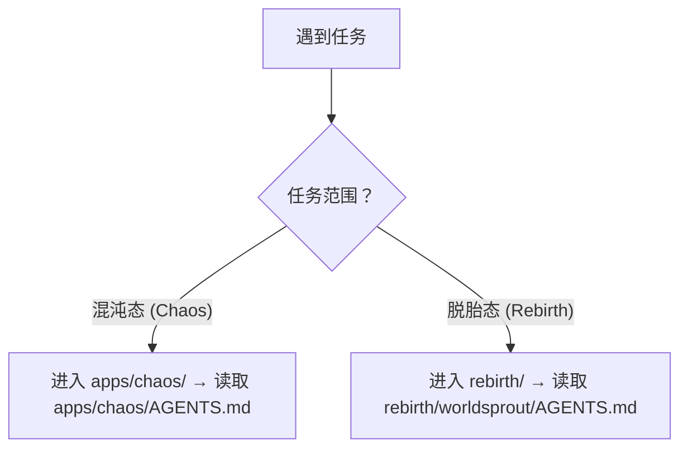

# 智能体全局契约 (AGENTS Manifest)

这是 AgentForge 仓库的 AI 智能体最高优先级入口与上下文路由。作为 AI 助手，必须先遵循本文件，再按任务类型进入子项目。

> **AGENTS.md 开放标准与 AgentForge / WorldSprout 的关系**
>
> `AGENTS.md` 是一个独立的社区开放标准，被 OpenAI Codex、Google Jules、GitHub Copilot、Cursor、Amp 等 30+ 工具原生支持。你只需在项目根目录放置一个 `AGENTS.md` 文件，这些工具就能自动读取你的项目指令——**不需要安装任何东西，不需要了解 AgentForge 或 WorldSprout**。
>
> 本仓库遵循 **混沌 → 萃取 → 脱胎** 的信息流转模型：
>
> ```mermaid
> flowchart LR
>     Chaos["apps/chaos/<br/>混沌态"] -->|"持续萃取、精炼"| Rebirth["rebirth/<br/>脱胎态"]
>     Chaos --- C1["原始探索、实验性内容<br/>个人哲学、未精炼资产<br/>自由生长、大胆试错"]
>     Rebirth --- R1["精炼后的社区标准<br/>去个人化、可独立发布<br/>WorldSprout 开放协议"]
> ```
>
> | 角色 | 路径 | 定位 |
> |------|------|------|
> | **混沌态 (Chaos)** | `apps/chaos/` | 原始孵化器——承载一切未精炼的探索：哲学内核、实验性代码、个人知识库、技能生态 |
> | **脱胎态 (Rebirth)** | `rebirth/` | 精炼后的产出——从 chaos 中萃取、去个人化、去哲学化后的社区开放标准 |
>
> 类比：AGENTS.md 标准 ≈ Markdown；AgentForge / WorldSprout ≈ CommonMark + GFM 扩展。

## 1. 仓库结构

```
AgentForge/
├── AGENTS.md                    ← 本文件：全局路由入口
├── README.md                    ← 人类开发者入口
├── docs/                        ← 人类文档（tech/ + general/ 双轨）
├── .github/workflows/           ← CI/CD 流水线
├── apps/
│   ├── .agents/                 ← 仓库级 AI 配置骨架
│   └── chaos/                   ← 混沌态：核心开发与探索区
│       ├── AGENTS.md            ← chaos 子项目路由（嵌套优先）
│       ├── .agents/             ← 规则/技能/工作流/角色/知识库（完整）
│       ├── src/taolib/          ← world CLI + 参考实现
│       └── tests/               ← 测试套件
└── rebirth/                     ← 脱胎态：社区标准（git submodule）
```

完整仓库结构说明见 [`apps/chaos/.agents/docs/repository-structure.md`](apps/chaos/.agents/docs/repository-structure.md)。

## 2. 全局核心规则

以下为不可违背的最高优先级规则。完整细则见 [`apps/chaos/.agents/rules/core-principles.md`](apps/chaos/.agents/rules/core-principles.md)。

- **沟通语言**：必须使用中文。**按需读取**：只读取与当前任务直接相关的规范。**上下文节省**：先搜索、再精读、只保留相关上下文。
- **代码修改**：约定优于配置，优先参考现有代码风格。**Python 环境**：统一使用 `uv`。
- **Mermaid 优先**：流程、架构、关系等可视化逻辑优先使用 Mermaid 表达。
- **落地导向**：新增设计应回答"如何转化为可执行机制、技术方案与业务场景价值"。

## 3. 上下文路由

根据任务类型选择工作区并读取对应规范。完整路由表见 [`apps/chaos/.agents/rules/context-routing.md`](apps/chaos/.agents/rules/context-routing.md)。



**高频任务速查**：

| 任务类型 | 必读入口 |
|---|---|
| Python 开发、依赖管理 | `apps/chaos/.agents/rules/python.md` |
| 文档新增、归档、目录边界 | `apps/chaos/.agents/rules/documentation.md` |
| 上下文节省、token 优化 | `apps/chaos/.agents/rules/context-economy.md` |
| 技能开发或规范调整 | `apps/chaos/.agents/rules/skills.md` |
| 协作元模型、角色/Team 定义 | `apps/chaos/.agents/docs/references/agent-collaboration-metamodel.md` |
| CI/CD 流水线、构建 | `.github/workflows/ci.yml`、`apps/chaos/pyproject.toml` |
| AgentForge Spec 规范查阅 | `apps/chaos/specs/agentforge-spec-v0.2.md` |
| 信息脱敏合规 | `apps/chaos/.agents/rules/information-sanitization.md` |
| 规则演化、经验准入、元规则 | `apps/chaos/.agents/rules/rule-evolution.md` |
| 路径独立性合规 | `apps/chaos/.agents/rules/project-independence.md` |

## 4. 文档边界

- `README.md` + `docs/` 面向人类；`.agents/docs/` 面向 AI 智能体；`specs/` 为人与 AI 公约数。
- 任务中间产物放入 `.temp/`。项目内引用必须使用相对路径。
- 详见 [`apps/chaos/.agents/rules/document-boundaries.md`](apps/chaos/.agents/rules/document-boundaries.md) 和 [`apps/chaos/.agents/rules/documentation.md`](apps/chaos/.agents/rules/documentation.md)。

## 5. 变更日志

项目变更日志已独立拆分，详见 [`apps/chaos/CHANGELOG.md`](apps/chaos/CHANGELOG.md)。

## 6. 子文件索引

本文件的所有详细内容已拆分至 `apps/chaos/.agents/` 下，按功能模块组织：

| 文件 | 职责 |
|---|---|
| **规则 (rules/)** | |
| [`rules/core-principles.md`](apps/chaos/.agents/rules/core-principles.md) | 全局核心原则：沟通语言、按需读取、上下文节省、代码修改、Mermaid 优先等 |
| [`rules/context-routing.md`](apps/chaos/.agents/rules/context-routing.md) | 上下文路由策略：工作区选择、详细路由表、嵌套 AGENTS.md 规则 |
| [`rules/document-boundaries.md`](apps/chaos/.agents/rules/document-boundaries.md) | 文档与产物边界：物理隔离原则、产物边界规则 |
| [`rules/information-sanitization.md`](apps/chaos/.agents/rules/information-sanitization.md) | 信息脱敏规则：脱敏类型矩阵、实施步骤、验证方法、CI/CD 门禁 |
| [`rules/project-independence.md`](apps/chaos/.agents/rules/project-independence.md) | 项目独立性规则：路径引用原则、模块间引用规范、正反例对照、验证 |
| [`rules/documentation.md`](apps/chaos/.agents/rules/documentation.md) | 文档治理细则：归档规则、临时产物、路径引用、双向同步等 |
| [`rules/context-economy.md`](apps/chaos/.agents/rules/context-economy.md) | 上下文节省策略：文件读取策略、长材料预处理、输出预算 |
| [`rules/python.md`](apps/chaos/.agents/rules/python.md) | Python 开发规则：环境管理、导入规则、路径独立性、版本适配 |
| [`rules/skills.md`](apps/chaos/.agents/rules/skills.md) | 技能开发规范 |
| [`rules/rule-evolution.md`](apps/chaos/.agents/rules/rule-evolution.md) | 规则演化机制：生长通道准入标准、三条元规则、规则生命周期状态机 |
| **文档 (docs/)** | |
| [`docs/repository-structure.md`](apps/chaos/.agents/docs/repository-structure.md) | 仓库目录结构与混沌→脱胎信息流转模型 |
| [`docs/governance-and-specs.md`](apps/chaos/.agents/docs/governance-and-specs.md) | 治理框架：Spec v0.2 三层架构、脱胎萃取管道 |
| [`docs/tech-stack.md`](apps/chaos/.agents/docs/tech-stack.md) | 技术栈速览表 |
| [`docs/cross-tool-bridging.md`](apps/chaos/.agents/docs/cross-tool-bridging.md) | 跨工具目录桥接映射 |
| [`docs/README.md`](apps/chaos/.agents/docs/README.md) | AI 知识库总导航：知识区地图、按场景导航、检索约定 |
