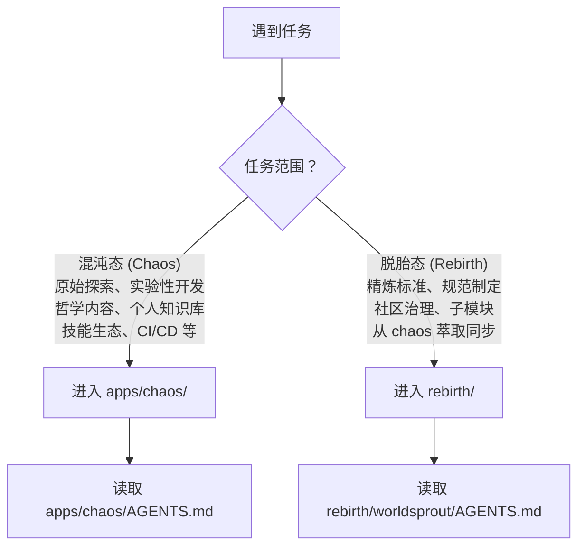
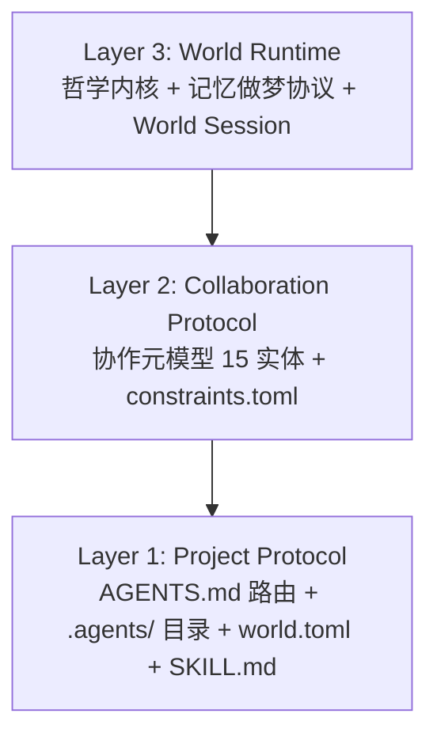
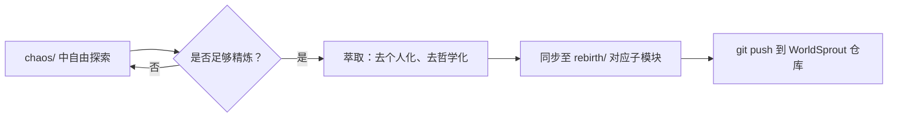

# 🤖 智能体全局契约 (AGENTS Manifest)

这是 AgentForge 仓库的 AI 智能体最高优先级入口与上下文路由。作为 AI 助手，必须先遵循本文件，再按任务类型进入子项目。

> **AGENTS.md 开放标准与 AgentForge / WorldSprout 的关系**
>
> `AGENTS.md` 是一个独立的社区开放标准，被 OpenAI Codex、Google Jules、GitHub Copilot、Cursor、Amp 等 30+ 工具原生支持。你只需在项目根目录放置一个 `AGENTS.md` 文件，这些工具就能自动读取你的项目指令——**不需要安装任何东西，不需要了解 AgentForge 或 WorldSprout**。
>
> 本仓库遵循 **混沌 → 萃取 → 脱胎** 的信息流转模型：
>
> ```mermaid
> flowchart LR
>     Chaos["apps/chaos/<br/>混沌态"] -->|"持续萃取、精炼"| Rebirth["rebirth/<br/>脱胎态"]
>     Chaos --- C1["原始探索、实验性内容<br/>个人哲学、未精炼资产<br/>自由生长、大胆试错"]
>     Rebirth --- R1["精炼后的社区标准<br/>去个人化、可独立发布<br/>WorldSprout 开放协议"]
> ```
>
> | 角色 | 路径 | 定位 |
> |------|------|------|
> | **混沌态 (Chaos)** | `apps/chaos/` | 原始孵化器——承载一切未精炼的探索：哲学内核（Ψ=Ψ(Ψ)、道德经）、实验性代码、个人知识库、技能生态。信息在此自由生长，经持续萃取后同步至 rebirth |
> | **脱胎态 (Rebirth)** | `rebirth/` | 精炼后的产出——从 chaos 中萃取、去个人化、去哲学化后的社区开放标准，以 git submodule 形式链接到 `github.com/worldsprout/*` 仓库 |
>
> **两者独立但互操作**：你可以只用 `AGENTS.md`（零依赖，30+ 工具原生支持），也可以逐步采纳 AgentForge / WorldSprout 扩展（`.agents/` 目录约定、`world.toml`、SKILL.md 规范、constraints.toml）。
>
> 类比：AGENTS.md 标准 ≈ Markdown；AgentForge / WorldSprout ≈ CommonMark + GFM 扩展。

## 1. 仓库结构

```
AgentForge/                            ← 本仓库（github.com/xinetzone/AgentForge）
├── AGENTS.md                          ← 本文件：全局路由与契约声明（最高优先级）
├── README.md                          ← 人类开发者入口
├── LICENSE                            ← Apache 2.0
├── docs/                              ← 人类文档（tech/ + general/ 双轨）
├── .github/workflows/                 ← CI/CD 流水线
├── .agents/                           ← 仓库级 AI 配置骨架（world.toml + constraints.toml + registry.toml）
│
├── apps/chaos/                        ← 混沌态：原始孵化器——自由探索、未精炼的一切
│   ├── AGENTS.md                      ← chaos 子项目路由（嵌套优先）
│   ├── .agents/                       ← 规则/技能/工作流/角色/知识库（Layer 1/2/3 完整）
│   ├── specs/                         ← AgentForge Spec v0.2 规范文档
│   ├── src/taolib/                    ← world CLI + 约束校验器 + 参考实现
│   ├── tests/                         ← 测试套件
│   └── pyproject.toml                 ← Python 项目配置（pdm-backend + SCM 动态版本）
│
└── rebirth/                           ← 脱胎态：从 chaos 萃取精炼后的社区标准（git submodule）
    ├── worldsprout/ (submodule)       → github.com/worldsprout/worldsprout（参考实现）
    ├── spec/        (submodule)       → github.com/worldsprout/spec（WorldSprout Spec v1.0）
    ├── .github/     (submodule)       → github.com/worldsprout/.github（组织首页）
    ├── README.md                      ← 脱胎说明与日常管理指南（AgentForge 跟踪）
    └── RETROSPECTIVE.md               ← AgentForge → WorldSprout 全面复盘（AgentForge 跟踪）
```

**嵌套 AGENTS.md 规则**：AGENTS.md 标准支持嵌套，"就近优先"——子项目 AGENTS.md 覆盖根级 AGENTS.md。当你在 `apps/chaos/` 内工作时，优先遵循 `apps/chaos/AGENTS.md`。

## 2. 全局核心规则

- **沟通语言**：必须使用中文与用户交流。
- **按需读取**：执行特定领域任务前，只读取与当前任务直接相关的规范文件。
- **上下文节省**：默认遵循"先搜索、再精读、只保留相关上下文"原则。
- **代码修改**：遵循"约定优于配置"，优先参考现有代码风格和项目架构。
- **Python 环境管理**：统一使用 `uv` 管理 Python 依赖与虚拟环境。
- **Mermaid 优先**：流程、架构、关系、职责映射等可视化逻辑内容，优先使用 Mermaid 基础语法表达。
- **哲学驱动**（仅 AgentForge 世界）：新增核心开发目标遵循"极致简约、大道至简"，以 Ψ=Ψ(Ψ) 为第一性原理。
- **落地导向**：新增设计与实现应回答"如何转化为可执行机制、技术方案与业务场景价值"。

## 3. 上下文路由

遇到以下任务时，先确定工作区，再读取对应的 AGENTS.md 或规范文件。

### 3.1 工作区选择



### 3.2 详细路由

| 任务类型 | 工作区 | 必读入口 |
|---|---|---|
| **chaos 内所有开发/探索任务** | `apps/chaos/` | [`apps/chaos/AGENTS.md`](apps/chaos/AGENTS.md) |
| Python 开发、依赖管理、taolib 代码 | `apps/chaos/` | [`apps/chaos/AGENTS.md`](apps/chaos/AGENTS.md) → `.agents/rules/python.md` |
| 文档新增、归档、迁移、目录边界 | `apps/chaos/` | [`apps/chaos/AGENTS.md`](apps/chaos/AGENTS.md) → `.agents/rules/documentation.md` |
| 技能开发或技能规范调整 | `apps/chaos/` | [`apps/chaos/AGENTS.md`](apps/chaos/AGENTS.md) → `.agents/rules/skills.md` |
| 协作元模型、Role/Team 定义、多智能体规范 | `apps/chaos/` | [`apps/chaos/AGENTS.md`](apps/chaos/AGENTS.md) → `.agents/docs/references/agent-collaboration-metamodel.md` |
| 上下文节省、token 优化 | `apps/chaos/` | [`apps/chaos/AGENTS.md`](apps/chaos/AGENTS.md) → `.agents/rules/context-economy.md` |
| CI/CD 流水线、构建配置 | `apps/chaos/` | `.github/workflows/ci.yml`、`apps/chaos/pyproject.toml` |
| **AgentForge Spec 规范查阅、Layer 归属判断** | `apps/chaos/` | [`apps/chaos/specs/agentforge-spec-v0.2.md`](apps/chaos/specs/agentforge-spec-v0.2.md) |
| **从 chaos 萃取内容同步至 rebirth** | 跨区 | 先确认 chaos 中内容已稳定 → 按脱胎规则处理 → 同步至对应 rebirth 子模块 |
| **WorldSprout 规范制定、脱胎迁移** | `rebirth/` | [`rebirth/README.md`](rebirth/README.md)、[`rebirth/worldsprout/AGENTS.md`](rebirth/worldsprout/AGENTS.md) |
| **WorldSprout 子模块管理** | `rebirth/` | [`rebirth/README.md`](rebirth/README.md) |
| **项目复盘、脱胎历史查阅** | `rebirth/` | [`rebirth/RETROSPECTIVE.md`](rebirth/RETROSPECTIVE.md) |
| **容器化环境、PDF 工具评估** | `apps/chaos/` | [`apps/chaos/AGENTS.md`](apps/chaos/AGENTS.md) → `.agents/rules/containerization.md` |

## 4. 文档与产物边界

### 4.1 物理隔离原则

| 目录 | 面向对象 | 职责 |
|------|----------|------|
| `README.md` + `docs/` | 人类开发者 | 项目说明、技术文档、贡献指南 |
| `.agents/docs/` | AI 智能体 | AI 专属知识库（参考、指南、沉淀） |
| `specs/` | 人类与 AI 公约数 | AgentForge Spec 规范文档，独立于人与 AI 各自的知识库 |

### 4.2 产物边界

- 任务中间产物放入 `.temp/`，不得污染项目根目录。
- 项目内引用必须使用相对路径。
- `docs/` 采用双轨分类：`docs/tech/`（技术文档）+ `docs/general/`（通用知识），两轨严禁混入。
- `rebirth/` 中仅 `README.md` 和 `RETROSPECTIVE.md` 归 AgentForge 跟踪；其余内容通过子模块管理。

## 5. 治理与规范

### 5.1 AgentForge Spec v0.2 — 三层分离架构

AgentForge Spec v0.2 定义正交三层架构：



- **Layer 1**：任何项目零前提采用——与 30+ AGENTS.md 工具生态对齐
- **Layer 2**：多智能体协作语义——Team/Role/Agent 定义 + 操作性约束
- **Layer 3**：世界特有实现——AgentForge 世界是 Layer 3 示范（Ψ=Ψ(Ψ) 哲学 + 记忆做梦协议）

详细规范见 [`apps/chaos/specs/agentforge-spec-v0.2.md`](apps/chaos/specs/agentforge-spec-v0.2.md)。

### 5.2 混沌 → 脱胎：萃取同步管道



`rebirth/` 中的内容是从 `chaos/` 持续萃取、精炼后的产物，遵循以下脱胎规则：
- **删除**：个人身份（xinetzone）、哲学内容（道德经、Ψ=Ψ(Ψ)）、私有 Token/密钥/路径
- **中性化**：保留技术架构与协议设计，去除个人叙事
- **重命名**：taolib → sproutlib（品牌对齐）
- **排除**：`src/taolib/github_app/` 等私有基础设施不迁移

脱胎规则详见 [`rebirth/README.md`](rebirth/README.md)，全面复盘见 [`rebirth/RETROSPECTIVE.md`](rebirth/RETROSPECTIVE.md)。

## 6. 技术栈速览

| 组件 | 技术 | 说明 |
|------|------|------|
| Python 包管理 | `uv` | 统一虚拟环境与依赖管理 |
| 构建后端 | `pdm-backend` + SCM 动态版本 | `pyproject.toml` 中配置 |
| 版本管理 | `mise` | 工具链版本统一管理（Python、uv、ruff 等） |
| Lint / Format | `ruff` | 统一替代 flake8/isort/black |
| 文档构建 | Sphinx | 零警告策略 |
| CI/CD | GitHub Actions + GitCode | 双平台流水线 |
| 容器化 | Podman / Docker | 评估环境与部署 |
| 子模块管理 | Git Submodule | rebirth/ 下三个 WorldSprout 仓库均跟踪 main 分支 |

## 7. 跨工具目录桥接

`.agents/` 的语义与主流 AI 工具目录存在映射关系：

| `.agents/` | `.claude/` (Claude Code) | `.github/` (Copilot) | 语义 |
|---|---|---|---|
| `rules/` | `rules/` | `agents/` | 领域规则，支持 `paths:` glob 条件加载 |
| `skills/` | `skills/` | — | 技能资产，SKILL.md 含 YAML frontmatter |
| `docs/` | — | — | AI 专属知识库 |
| `workflows/` | `commands/` | `workflows/` | 流程化任务说明 |
| `roles/` | `agents/` | — | 角色声明（TOML + Markdown 双格式） |
| `templates/` | — | — | 标准化模板文件 |
| `scripts/` | — | — | 自动化校验/执行脚本 |

规则文件支持 `paths:` YAML frontmatter 实现 glob 条件加载，与 Claude Code `.claude/rules/` 的条件加载机制对齐。

## 8. 变更日志

项目变更日志已独立拆分。详细变更索引见 [`apps/chaos/CHANGELOG.md`](apps/chaos/CHANGELOG.md)。
