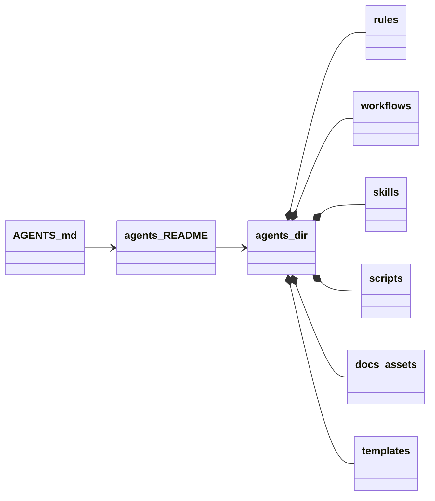
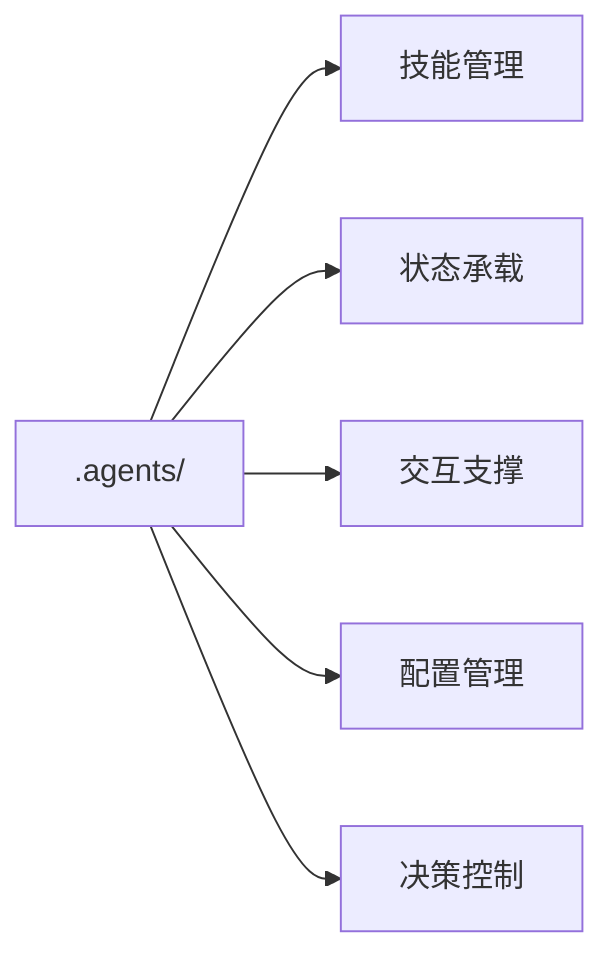
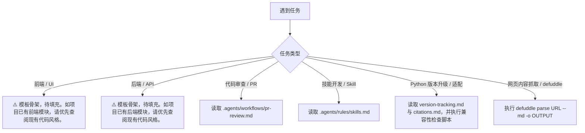
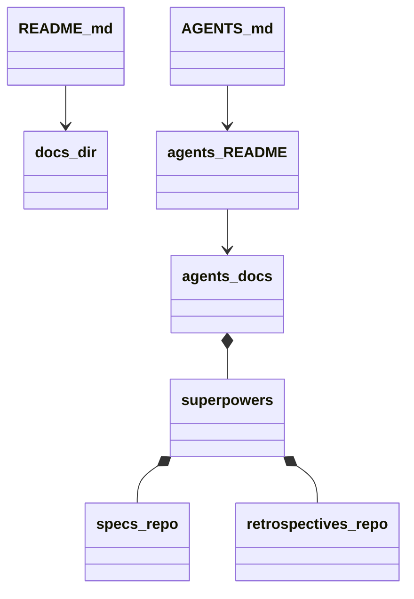
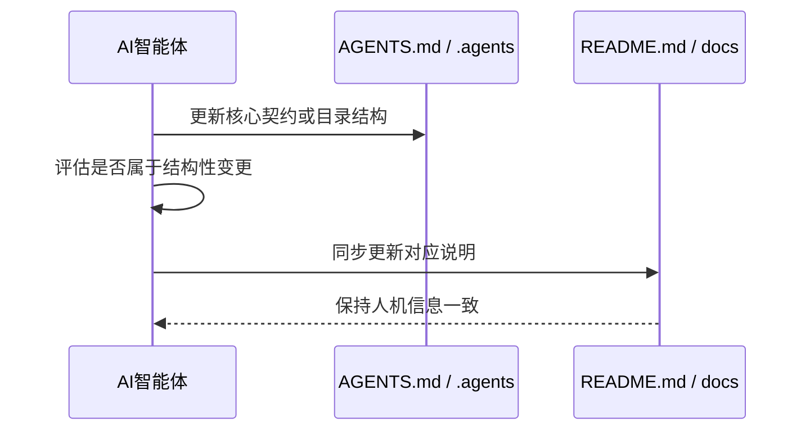
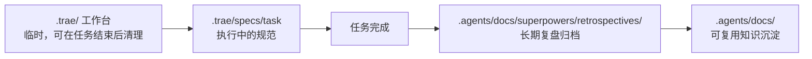

# 🤖 智能体全局契约 (AGENTS Manifest)

这是本项目 AI 智能体的最高优先级指南与导航路由。作为 AI 助手，在执行任务时必须严格遵循此文件中的约定。

## 1. 全局核心规则 (Global Rules)
- **沟通语言**：必须使用中文 (Chinese) 与用户进行交流。
- **行动原则**：在执行特定领域的复杂任务前，必须先按需读取 `.agents/` 目录下的具体规范。
- **代码修改**：遵循"约定优于配置"，优先参考现有代码风格和项目架构。
- **Python 环境管理**：统一使用 `uv` 管理 Python 依赖与虚拟环境。禁止直接使用 `pip` 或 `conda` 安装项目依赖。
- **Mermaid 优先**：凡属于流程、架构、关系、职责映射、层级、目录流转与时序交互等可视化逻辑内容，后续维护时必须优先使用 Mermaid 图表表达；仅当图中无法自解释或涉及约束细则时，才补充必要的精炼文字说明。新增 Mermaid 代码块必须使用主流 Markdown 环境兼容的基础语法子集，避免私有扩展、实验性语法与可能导致整体渲染失败的复杂写法。
- **哲学驱动**：项目新增核心开发目标遵循“极致简约、大道至简”的总原则，并将《道德经》中“反者道之动，弱者道之用”作为底层设计逻辑的重要哲学依据。
- **研究基底**：后续研究、方案设计与能力实现，应以马王堆帛书版《道德经》的原始文本内涵为基础，推动其哲学内核与现代技术栈的深度融合。
- **落地导向**：所有新增设计与实现应优先回答“如何从理论哲学转化为可执行机制、技术方案与业务场景价值”，确保成果满足“学以致用”的核心要求。

### 1.1 项目哲学驱动

该图用于表达本项目从原始文本内涵到技术与业务落地的主路径。涉及细化解释、概念映射与实施线索时，统一下沉至 [`.agents/docs/references/dao-tech-foundation.md`](.agents/docs/references/dao-tech-foundation.md)。

### 1.2 项目路径独立性规则

#### 核心原则

**禁止使用绝对路径引用项目内的任何文件、资源或配置。** 所有项目内引用必须使用相对路径，确保项目在不同开发环境、CI/CD 环境及部署环境中具有完全的可移植性。

使用绝对路径的危害：

- **环境耦合**：绝对路径绑定到特定机器的目录结构，在其他开发者或 CI 环境中必然失败
- **不可移植**：项目无法在 Windows/Linux/macOS 之间无缝切换
- **CI/CD 失败风险**：CI 环境的工作目录与本地开发环境不同，绝对路径引用会导致构建失败

#### Python 导入规则

Python 代码中的项目内导入必须使用包相对导入，禁止通过绝对文件系统路径、动态修改 `sys.path`、依赖当前工作目录等方式引用项目内部模块，确保包结构在本地开发、测试、CI/CD 与部署环境中保持一致。

Python 导入风格必须遵循以下约定：

- **包内模块导入**：同一 Python 包内的模块互相引用时，必须使用显式相对导入，例如 `from .module import name` 或 `from ..subpackage import name`
- **跨包公共接口导入**：仅允许从稳定的包级公共接口导入，避免直接跨层级引用内部实现模块
- **脚本入口导入**：需要直接执行的脚本应通过包入口、模块方式或项目定义的命令入口运行，禁止依赖脚本所在目录作为隐式导入根
- **测试代码导入**：测试代码必须通过包结构导入被测对象，禁止在测试文件中修改 `sys.path` 或依赖测试运行目录
- **`sys.path` 例外**：默认禁止在项目代码、脚本与测试中动态修改 `sys.path`；如确需例外，必须有明确的兼容性理由，并优先通过包安装、模块入口或测试配置解决

### 1.3 `.agents/` 目录定位

`.agents/` 是本项目智能体系统的核心组件容器，集中承载规则、工作流、技能、脚本与知识资产。关于目录边界、组织原则与详细说明，请以 [`.agents/README.md`](.agents/README.md) 为准。

该图用于表达 `AGENTS.md`、`.agents/README.md` 与 `.agents/` 目录资产之间的导航与承载关系，具体子目录边界仍以 [`.agents/README.md`](.agents/README.md) 为准。

### 1.4 功能定位

`.agents/` 在系统中承担技能管理、状态承载、交互支撑、配置管理与决策控制等职责。详细职责说明、目录映射与实现模式，请阅读 [`.agents/README.md`](.agents/README.md)。

该图用于强调 `.agents/` 的职责分层；详细职责展开、目录映射与实现模式继续以 [`.agents/README.md`](.agents/README.md) 为单一事实来源。

### 1.5 中间产物管理规则

任务执行过程中产生的所有中间文件、临时输出、缓存数据、调试日志等**一律**放入 `.temp/` 目录，禁止污染项目根目录及其他功能目录。

#### 适用范围

以下类型的文件**必须**放入 `.temp/` 目录：

- 🗑️ **临时脚本与中间代码**：一次性验证脚本、调试代码片段、中间转换产物
- 📊 **临时数据文件**：缓存数据、中间分析结果、测试用的临时数据集
- 📝 **调试与日志输出**：诊断日志、中间状态 dump、调试截图
- 🔧 **构建与编译中间产物**：编译缓存、临时构建输出
- 🧪 **临时测试产物**：测试运行时产生的临时文件、测试报告草稿

#### 目录生命周期

- `.temp/` 内容为**临时性质**，任务完成后可安全清理
- 仅当中间产物具有调试/排错价值时，可临时保留至问题解决后再清理
- 禁止将 `.temp/` 中的文件提交至版本控制系统（`.temp/` 应列入 `.gitignore`）

## 2. 上下文路由 (Context Router)
当你遇到以下特定任务时，**必须**先使用文件读取工具查看对应的详细规范：

- 🎨 **前端开发 / UI 任务**：⚠️ 规范当前为模板骨架（`frontend.md` 中核心技术栈待填充）。如项目尚未涉及前端开发，此路由暂不生效；如已涉及，请优先查阅现有代码风格。
- ⚙️ **后端开发 / API 任务**：⚠️ 规范当前为模板骨架（`backend.md` 中核心技术栈待填充）。如项目尚未涉及后端开发，此路由暂不生效；如已涉及，请优先查阅现有代码风格。
- 🔄 **代码审查 / PR 任务**：读取 `.agents/workflows/pr-review.md`
- 🛠️ **技能开发 / Skill 任务**：读取 `.agents/rules/skills.md`
- 🐍 **Python 版本升级 / 适配任务**：读取 `.agents/docs/version-tracking.md` + `.agents/rules/citations.md`，执行 `.agents/scripts/check_python_compat.py` + `.agents/scripts/check_python_deprecations.py`
- 📄 **网页内容抓取 / defuddle 任务**：使用 `defuddle parse <url> --md -o <output>` 命令抓取网页内容。

## 3. 工具与脚本 (Tools & Scripts)
- 项目专属的自动化脚本统一放置在 `.agents/scripts/` 目录下。
- 智能体在需要自动化验证或执行特定工作流时，可自行检查该目录下的可用脚本。
- **外部工具初始化**：运行 `mise run init` 安装项目所需的外部工具依赖（如 `defuddle` 网页抓取工具）。使用 `mise run init-check` 可仅检查依赖状态，使用 `mise run check-env` 可直接校验工具链版本。

## 4. 文档管理 (Documentation Management)

本项目严格区分面向 AI 的契约文档与面向人类开发者的说明文档。智能体在处理文档相关任务时，需遵循以下原则：

- 📄 **人类专属文档**：`README.md` 及 `docs/` 目录下的内容专门面向**人类开发者**。在执行项目常规文档的编写、更新任务前，必须查阅 `docs/` 中的对应模块结构。
- 🤖 **AI 专属文档**：[`.agents/docs/`](.agents/docs/) 目录专门用于存放供 AI 智能体读取和维护的知识库、架构图或分析产物，隔离对人类开发者的视觉干扰。
- 🦸 **Superpowers (技能增强) 资产库**：[`.agents/docs/superpowers/`](.agents/docs/superpowers/) 目录是智能体自我进化、技能设计与任务经验总结的“大脑记忆库”。
- 🚫 **Spec / 设计文档归属 (`specs/`)**：任何面向实现的设计文档（spec、技术方案、架构决策、优化设计等）**一律禁止**放入面向人类的 `docs/`。技能 spec 必须归档于 `.agents/docs/superpowers/specs/<skill-name>/`；通用技术方案归档于 `.agents/docs/` 下对应子目录。
- 📝 **复盘报告归档规则 (`retrospectives/`)**：
  - **执行范围**：所有关于项目任务、Bug 修复、技术预研、技能开发等过程的“复盘报告”（Retrospectives / Postmortems / Task Execution Summaries）及类似总结性文件。
  - **存放位置**：必须统一存放在 [`.agents/docs/superpowers/retrospectives/`](.agents/docs/superpowers/retrospectives/) 目录下。
  - **时间要求**：在生成或完成复盘报告后，必须**立即**将其移动或保存至上述指定目录，不得遗留在项目根目录或其他临时文件夹中。
  - **违规处理**：如发现复盘报告未按规定存放，AI 智能体在后续读取到相关违规文件时，必须主动将其移动至正确目录，并在后续会话中提醒用户或记录归档动作。

- 🔄 **双向同步机制**：当智能体核心契约（`AGENTS.md` 或 `.agents/` 目录）发生结构性变更时，智能体必须主动评估并同步更新 `README.md` 或 `docs/` 中的对应说明，以确保人机信息始终保持一致。

### 4.1 任务规划与知识沉淀的双目录架构

- [`.trae/`](.trae/)：TRAE IDE 任务规划工作台，生命周期为临时，负责在任务执行前创建规范与承载执行中的任务上下文。
- [`.agents/docs/`](.agents/docs/)：AI 知识库与复盘档案馆，生命周期为持久，负责接收 `.trae` 产出并沉淀为可复用知识。
- **流转关系**：`.trae/specs/task`（执行中的规范） -> 任务完成 -> `.agents/docs/superpowers/retrospectives/`（复盘归档）。

## 5. 项目变更日志 (Changelog)

为防止 `AGENTS.md` 上下文膨胀，项目变更日志已独立拆分。请查阅项目根目录下的 [CHANGELOG.md](CHANGELOG.md) 获取详细的变更记录索引。
