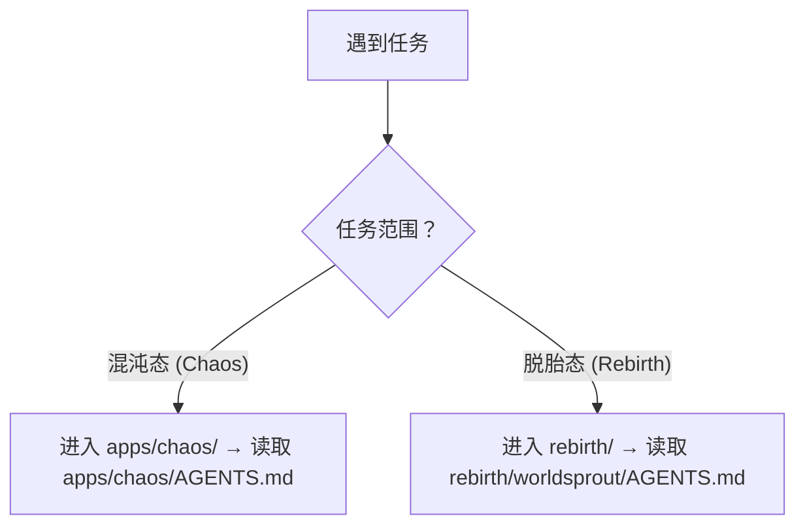

# 智能体全局契约 (AGENTS Manifest)

这是 AgentForge 仓库的 AI 智能体最高优先级入口与上下文路由。作为 AI 助手，必须先遵循本文件，再按任务类型进入子项目。

## 0. 30 秒路由

- 先判断任务范围：开发/实验内容走 `apps/chaos/`；标准化产出走 `rebirth/`
- 进入目标目录后，优先读取离当前工作目录最近的 `AGENTS.md`（嵌套优先）
- 只按任务需要读取规则：先搜索、再精读、只保留相关上下文
- Python 环境统一使用 `uv`；流程/架构优先用 Mermaid
- 任务中间产物放入 `.temp/`；项目内引用必须使用相对路径

> 背景说明（开放标准、混沌→萃取→脱胎信息流转模型）：见 [`apps/chaos/.agents/docs/agents-manifest-background.md`](apps/chaos/.agents/docs/agents-manifest-background.md)。

## 1. 仓库结构

```
AgentForge/
├── AGENTS.md                    ← 本文件：全局路由入口
├── README.md                    ← 人类开发者入口
├── docs/                        ← 人类文档（tech/ + general/ 双轨）
├── .github/workflows/           ← CI/CD 流水线
├── apps/
│   ├── .agents/                 ← 仓库级 AI 配置骨架
│   └── chaos/                   ← 混沌态：核心开发与探索区
│       ├── AGENTS.md            ← chaos 子项目路由（嵌套优先）
│       ├── .agents/             ← 规则/技能/工作流/角色/知识库（完整）
│       ├── src/taolib/          ← world CLI + 参考实现
│       └── tests/               ← 测试套件
└── rebirth/                     ← 脱胎态：社区标准（git submodule）
```

完整仓库结构说明见 [`apps/chaos/.agents/docs/repository-structure.md`](apps/chaos/.agents/docs/repository-structure.md)。

## 2. 全局核心规则

以下为不可违背的最高优先级规则。完整细则见 [`apps/chaos/.agents/rules/core-principles.md`](apps/chaos/.agents/rules/core-principles.md)。

- **沟通语言**：必须使用中文。**按需读取**：只读取与当前任务直接相关的规范。**上下文节省**：先搜索、再精读、只保留相关上下文。
- **代码修改**：约定优于配置，优先参考现有代码风格。**Python 环境**：统一使用 `uv`。
- **Mermaid 优先**：流程、架构、关系等可视化逻辑优先使用 Mermaid 表达。
- **落地导向**：新增设计应回答"如何转化为可执行机制、技术方案与业务场景价值"。

## 3. 上下文路由

根据任务类型选择工作区并读取对应规范。完整路由表见 [`apps/chaos/.agents/rules/context-routing.md`](apps/chaos/.agents/rules/context-routing.md)。



嵌套优先级与冲突处理：

- 进入任意子目录后，必须优先读取“离当前工作目录最近”的 `AGENTS.md`
- 若子项目规则与本文件冲突，以子项目为准（子项目覆盖全局）

## 4. 高频任务速查

| 任务类型 | 入口 | 你接下来做什么 |
|---|---|---|
| Python 开发、依赖管理 | `apps/chaos/.agents/rules/python.md` | 按该规则使用 `uv` 管理环境、依赖与执行方式 |
| 文档新增、归档、目录边界 | `apps/chaos/.agents/rules/documentation.md` | 按归档与边界规则放置文档/产物，并校验引用路径 |
| 上下文节省、token 优化 | `apps/chaos/.agents/rules/context-economy.md` | 先搜索再精读，控制读取范围与输出预算 |
| 技能开发或规范调整 | `apps/chaos/.agents/rules/skills.md` | 按技能目录结构与规范生成/调整技能资产 |
| 协作元模型、角色/Team 定义 | `apps/chaos/.agents/docs/references/agent-collaboration-metamodel.md` | 用元模型约束角色边界、通信与协作流程 |
| CI/CD 流水线、构建 | `.github/workflows/ci.yml`、`apps/chaos/pyproject.toml` | 以工作流与项目配置为准定位构建/测试命令与门禁 |
| AgentForge Spec 规范查阅 | `apps/chaos/specs/agentforge-spec-v0.2.md` | 以 Spec 的术语与结构为基准输出规范化产物 |
| 信息脱敏合规 | `apps/chaos/.agents/rules/information-sanitization.md` | 产出前按矩阵脱敏，并做可验证的检查步骤 |
| 规则演化、经验准入、元规则 | `apps/chaos/.agents/rules/rule-evolution.md` | 以准入标准与生命周期更新规则，不直接写“经验主义”规则 |
| 路径独立性合规 | `apps/chaos/.agents/rules/project-independence.md` | 校验引用不越界、路径可迁移，并按反例修正 |

## 5. 文档边界

- `README.md` + `docs/` 面向人类；`.agents/docs/` 面向 AI 智能体；`specs/` 为人与 AI 公约数。
- 任务中间产物放入 `.temp/`。项目内引用必须使用相对路径。
- 详见 [`apps/chaos/.agents/rules/document-boundaries.md`](apps/chaos/.agents/rules/document-boundaries.md) 和 [`apps/chaos/.agents/rules/documentation.md`](apps/chaos/.agents/rules/documentation.md)。

## 6. 变更日志

项目变更日志已独立拆分，详见 [`apps/chaos/CHANGELOG.md`](apps/chaos/CHANGELOG.md)。

## 7. 扩展索引

本文件的所有详细内容已拆分至 `apps/chaos/.agents/` 下，按功能模块组织：

- 规则（rules/）
  - [`rules/core-principles.md`](apps/chaos/.agents/rules/core-principles.md)
  - [`rules/context-routing.md`](apps/chaos/.agents/rules/context-routing.md)
  - [`rules/document-boundaries.md`](apps/chaos/.agents/rules/document-boundaries.md)
  - [`rules/information-sanitization.md`](apps/chaos/.agents/rules/information-sanitization.md)
  - [`rules/project-independence.md`](apps/chaos/.agents/rules/project-independence.md)
  - [`rules/documentation.md`](apps/chaos/.agents/rules/documentation.md)
  - [`rules/context-economy.md`](apps/chaos/.agents/rules/context-economy.md)
  - [`rules/python.md`](apps/chaos/.agents/rules/python.md)
  - [`rules/skills.md`](apps/chaos/.agents/rules/skills.md)
  - [`rules/rule-evolution.md`](apps/chaos/.agents/rules/rule-evolution.md)
- 文档（docs/）
  - [`docs/README.md`](apps/chaos/.agents/docs/README.md)
  - [`docs/repository-structure.md`](apps/chaos/.agents/docs/repository-structure.md)
  - [`docs/governance-and-specs.md`](apps/chaos/.agents/docs/governance-and-specs.md)
  - [`docs/tech-stack.md`](apps/chaos/.agents/docs/tech-stack.md)
  - [`docs/cross-tool-bridging.md`](apps/chaos/.agents/docs/cross-tool-bridging.md)
