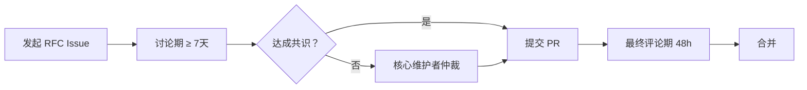

# AgentForge 标准治理章程 (GOVERNANCE)

> **版本**：v1.0.0 · 2026-05-28
>
> **适用范围**：AgentForge Spec、Registry、参考实现（taolib / world CLI）
>
> **核心承诺**：AgentForge 是一个社区驱动的开放标准。本文档定义了它的决策机制——谁有权决定什么、怎么决定、以及如何参与。

---

## 1. 项目结构

AgentForge 由三个独立但互操作的子系统组成：

| 子系统 | 路径 | 治理范围 |
|--------|------|----------|
| **AgentForge Spec** | `specs/` | Layer 1/2/3 标准规范、Schema 定义 |
| **Registry** | `registry-index/` | Fragment 索引格式、准入标准、镜像策略 |
| **参考实现** | `src/taolib/` | world CLI、约束校验器、Session 引擎 |

三者独立治理：
- Spec 的修改不强制要求参考实现跟随更新
- Registry 的策略不绑定 Spec 版本
- 参考实现是 **示范性** 的，任何合规实现都可替代

---

## 2. 角色与权限

### 2.1 核心维护者 (Core Maintainers)

- 拥有 Spec / Registry / 参考实现仓库的合并权限
- 负责任命领域维护者、仲裁 Layer 归属争议
- 至少 2 人，最多 7 人

### 2.2 领域维护者 (Domain Maintainers)

| 领域 | 职责 | 当前状态 |
|------|------|----------|
| Layer 1: Project Protocol | AGENTS.md 格式、`.agents/` 目录约定、world.toml 基础 schema、SKILL.md 规范 | 待任命 |
| Layer 2: Collaboration Protocol | 协作元模型、constraints.toml、roles/teams 声明格式 | 待任命 |
| Layer 3: World Runtime | World Session 运行时、记忆协议、哲学-工程映射 | 待任命 |
| Registry | Fragment 索引格式、准入标准、镜像策略 | 待任命 |
| Reference Implementation | world CLI、约束校验器、taolib 包 | 待任命 |

> **当前阶段**：项目由创始人（xinetzone）作为唯一核心维护者运作。领域维护者将在社区贡献者中出现后逐步任命。

### 2.3 贡献者 (Contributors)

- 任何人可以通过 RFC 流程提出修改提案
- 合并 3 个以上非平凡 RFC 的贡献者可被提名为领域维护者
- 领域维护者经 1 年以上活跃贡献 + 核心维护者全票通过可晋升为核心维护者

---

## 3. RFC 流程

### 3.1 何时需要 RFC

| 变更类型 | 是否需要 RFC | 说明 |
|----------|-------------|------|
| Spec 新增章节/字段 | **必须** | 如新增 world.toml 顶层 section |
| Spec 修改已有字段语义 | **必须** | 如修改 `[kernel]` 的必填项 |
| Spec 删除或废弃字段 | **必须** | 需提供迁移路径 |
| Layer 归属调整 | **必须** | 如将某个目录从 Layer 2 移到 Layer 1 |
| 拼写/格式修正 | 不需要 | 直接 PR |
| 参考实现 bug 修复 | 不需要 | 直接 PR（含测试） |
| Registry 新增 fragment | 不需要 | 按准入标准提 PR |

### 3.2 RFC 流程



### 3.3 RFC 模板

```markdown
## RFC: [简述]

### 动机
为什么需要这个变更？解决什么问题？

### 提案
具体的变更内容（新增/修改/删除的字段、语义、行为）。

### 影响范围
- Layer 归属：Layer 1 / 2 / 3？
- 向后兼容：是否破坏已有项目？
- 参考实现：是否需要同步更新？

### 替代方案
考虑过哪些其他方案？为什么拒绝？

### 迁移路径（如适用）
已有项目如何迁移到新版本？
```

---

## 4. 决策机制

### 4.1 共识优先

- 优先通过讨论达成共识
- RFC Issue 开放至少 7 天
- 使用 GitHub reactions（👍👎）作为非正式投票

### 4.2 仲裁

- 无法达成共识时，由核心维护者仲裁
- 仲裁决策需附书面理由
- 仲裁结果可被后续 RFC 推翻

### 4.3 Layer 归属争议

当某个功能/目录的 Layer 归属存在争议时：

1. 默认为 **较高 Layer**（Layer 3 > Layer 2 > Layer 1）
2. 核心维护者根据"零前提原则"仲裁：**如果该功能是项目零前提采用的必要条件，则归入 Layer 1**
3. 当前示例：`workflows/` 目录在 Layer 2（因为它需要协作元模型的背景知识）

---

## 5. 版本与发布

### 5.1 Spec 版本

- 遵循语义化版本（SemVer 2.0）
- **主版本号 (MAJOR)**：破坏性变更（删除字段、修改字段语义、Layer 归属大调整）
- **次版本号 (MINOR)**：新增字段/section，向后兼容
- **修订号 (PATCH)**：措辞澄清、示例修正、格式调整

### 5.2 发布周期

- 不设固定发布周期
- 每个 MINOR/MAJOR 版本发布前需至少 1 个采用者验证（真实项目试用）
- 当前阶段（v0.x）：不承诺向后兼容，MAJOR 变更以 MINOR 版本号体现

### 5.3 Registry 版本

- Registry 独立于 Spec 版本
- 每个 Fragment 自含版本号
- Registry 索引格式的变更需 RFC

---

## 6. Registry 治理

### 6.1 Registry 镜像

- 官方 Registry：`https://github.com/agentforge/registry-index`
- 任何组织/个人可以创建镜像
- 镜像需声明同步频率和延迟容忍度
- 用户在 `registry.toml` 中自由选择镜像源

### 6.2 Fragment 准入标准

向官方 Registry 提交 Fragment 需满足：

1. **命名规范**：`{category}/{fragment-name}`，如 `py/python-engineering`
2. **格式规范**：符合 `world.toml` 的 `[fragments.*]` Schema
3. **文件存在性**：`includes` 列表中的所有文件必须实际存在
4. **描述完整**：`description` 字段非空
5. **版本规范**：遵循 SemVer

### 6.3 Fragment 移除

- 维护者可以申请废弃自己的 Fragment（标记 `deprecated = true`）
- 核心维护者可以移除违反行为准则的 Fragment
- 移除后原名称保留 90 天冷却期，防止抢注

---

## 7. 行为准则

- 尊重所有参与者，无论经验水平
- 技术讨论聚焦技术，不针对个人
- RFC 讨论中使用"我不同意，因为…"而非"你错了"
- 争议无法解决时先暂停 24 小时

---

## 8. 章程修改

- 本章程的修改本身需要 RFC
- 核心维护者全票通过
- 修改后发布新版本号

---

## 9. 当前状态

| 角色 | 成员 | 任期 |
|------|------|------|
| 核心维护者 | xinetzone | 创始人 |

**待办事项**：
- [ ] 任命首批领域维护者
- [ ] 建立 RFC Issue 模板
- [ ] 发布 Spec v0.2 正式版
- [ ] 建立 Registry 镜像节点准入流程

---

*本章程自 2026-05-28 生效。第一个 RFC 将在首位外部贡献者发起提案时创建。*
