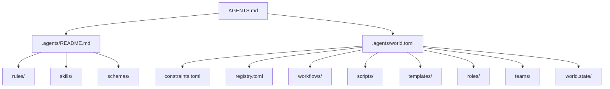

# AI 智能体配置目录 (.agents)

本目录是 AgentForge 仓库根级别的 AI 智能体配置骨架。它是根 [`AGENTS.md`](../../AGENTS.md) 全局契约的结构化落地，定义仓库级的世界身份、协作约束与目录约定。

> **与子世界的关系**：本仓库包含两个子世界——[`apps/chaos/`](../chaos/)（混沌态孵化器）和 [`rebirth/worldsprout/`](../../rebirth/worldsprout/)（脱胎态参考实现）。它们各自拥有独立的 `.agents/` 目录和 `world.toml`。本目录仅承载仓库级的全局配置骨架，不替代任何子世界的 `.agents/` 实现。

## 目录结构

| 目录 | 层级归属 | 职责 |
|------|----------|------|
| `rules/` | Layer 1 | 仓库级领域规则（按需加载） |
| `skills/` | Layer 1 | 技能资产（SKILL.md + 配套文件） |
| `schemas/` | Layer 1 | JSON Schema 定义（角色、约束校验） |
| `workflows/` | Layer 2 | 协作流程实例（PR Review、Role Review 等） |
| `scripts/` | Layer 2 | 自动化校验与执行脚本 |
| `templates/` | Layer 2 | 标准化模板（SKILL.md、starter 等） |
| `roles/` | Layer 2 | Role 实例（协作元模型语义实例） |
| `teams/` | Layer 2 | Team 实例（治理边界声明） |
| `world.state/` | Layer 3 | 运行时状态（会话索引，git 忽略） |

## 配置文件

| 文件 | 职责 |
|------|------|
| [`world.toml`](./world.toml) | 仓库根世界声明式描述——身份、子世界、跨世界路由 |
| [`constraints.toml`](./constraints.toml) | 多智能体协作操作性约束——strong/weak/parallel 三级声明 |
| [`registry.toml`](./registry.toml) | Registry 源配置——本地与远程 Registry 优先级 |

## 与 AGENTS.md 的关系

- **`AGENTS.md`**：AI 智能体的最高优先级入口与上下文路由。它是本目录的人类友好视图——路由表、文档边界、核心规则均在 AGENTS.md 中以 Markdown 表格呈现。详见根目录 [`AGENTS.md`](../../AGENTS.md)。
- **`world.toml`**：路由表的结构化声明（机器真相源）。`AGENTS.md` 中的路由表为人类友好视图，`world.toml` 的 `[routing]` 区块为机器可解析的结构化定义。
- **子目录**：`AGENTS.md` 通过路由表按任务类型引导 AI 读取对应子目录的规范文件。

## 快速导航

| 入口 | 说明 |
|------|------|
| 根 [`AGENTS.md`](../../AGENTS.md) | 全局路由与契约声明（最高优先级） |
| [`apps/chaos/.agents/`](../chaos/.agents/) | 混沌态完整实现——294 行 world.toml、11 条规则、11 个角色、21 个脚本 |
| [`rebirth/worldsprout/AGENTS.md`](../../rebirth/worldsprout/AGENTS.md) | 脱胎态参考实现——去哲学化后的社区标准 |
| [`rebirth/spec/worldsprout-spec-v1.0.md`](../../rebirth/spec/worldsprout-spec-v1.0.md) | WorldSprout Spec v1.0 规范文档 |
| [`apps/chaos/specs/agentforge-spec-v0.2.md`](../chaos/specs/agentforge-spec-v0.2.md) | AgentForge Spec v0.2 规范文档 |
