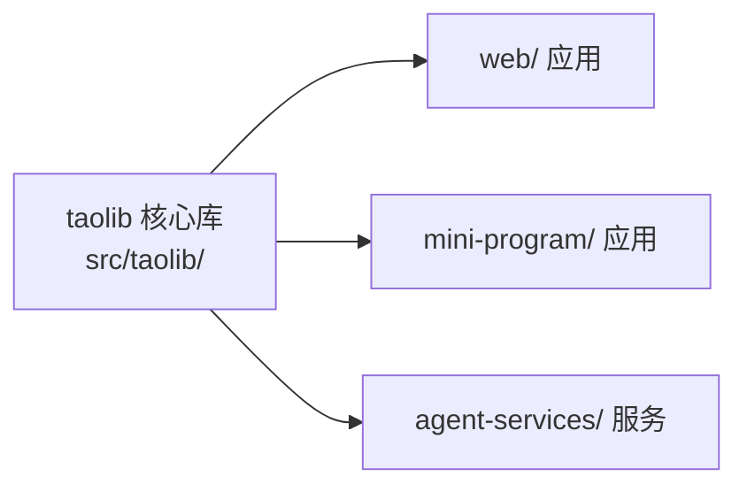

# apps/ 目录边界说明

## 定位

`apps/` 是 AgentForge 项目的**上层应用目录**，承载基于 `taolib` 核心库构建的各种应用、小程序和智能体服务。

它与 `src/taolib/` 保持清晰的**消费者边界**：`apps/` 内的项目依赖并使用 `taolib`，但不反向修改核心库源码。

## 目录结构

| 子目录 | 承载内容 | 状态 |
|--------|----------|------|
| `web/` | Web 应用（前端 / 全栈） | 预留 |
| `mini-program/` | 各类小程序 | 预留 |
| `agent-services/` | 独立运行的智能体服务或工具 | 预留 |

## 边界约定

1. **消费者关系**：`apps/` 内的项目是 `taolib` 的消费者。如需修改核心库，应在 `src/taolib/` 独立变更，而非在应用目录内直接改动。
2. **依赖独立**：各应用如需独立依赖，优先在各自目录内维护配置（如 `package.json`、`pyproject.toml`），避免与根目录 `taolib` 的依赖耦合。
3. **文档归属**：各应用的说明文档优先放在各自目录内；跨应用共性文档可放入 `docs/tech/apps/`。
4. **临时产物**：构建产物、缓存、调试输出等遵循项目规则，优先放入 `.temp/`，或在各自目录内配置 `.gitignore`。
5. **命名规范**：统一使用小写命名，优先采用连字符命名（如 `my-app/`），与仓库现有风格保持一致。
6. **目录深度**：高频开发路径不超过 3 层；应用内部结构按各自技术栈惯例组织。

## 与核心库的关系

## 新增应用流程

1. 判定应用类型，放入对应子目录（如不满足现有分类，可在本文件目录表中扩展）。
2. 在应用目录内创建独立的 `README.md`，说明应用用途、启动方式和依赖关系。
3. 如需独立依赖管理，初始化对应配置文件（`pyproject.toml`、`package.json` 等）。
4. 若应用涉及构建产物，配置本地 `.gitignore` 或在根目录 `.gitignore` 中追加规则。
