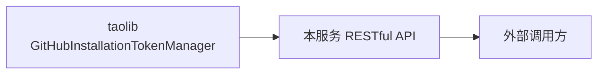

# GitHub App Token Service

基于 [taolib](../../../src/taolib/) 的 GitHub App 安装令牌管理 RESTful API 服务。

## 定位

本服务将 taolib 的 `GitHubInstallationTokenManager` 封装为 HTTP API，供外部系统通过 RESTful 接口获取、管理和监控 GitHub App 安装令牌。

## 目录结构

```
github-app-token-service/
├── pyproject.toml           # 独立依赖配置
├── .gitignore               # 本地忽略规则
├── README.md                # 本文件
└── src/
    └── github_app_token_service/
        ├── __init__.py
        ├── main.py          # FastAPI 入口与生命周期管理
        ├── config.py        # 服务配置聚合
        ├── api.py           # RESTful 路由定义
        └── models.py        # Pydantic 请求/响应模型
```

## 环境依赖

本服务依赖 [taolib](../../../src/taolib/) 核心库，安装前请确保已安装 taolib 及其 `github-app` 可选依赖。

## 安装

在项目虚拟环境中执行：

```bash
# 1. 安装 taolib（从项目根目录）
uv pip install -e "../../../[github-app]"

# 2. 安装本服务（从本目录）
cd apps/agent-services/github-app-token-service
uv pip install -e ".[dev]"
```

## 配置

通过环境变量配置服务与 GitHub App 参数：

| 环境变量 | 必填 | 默认值 | 说明 |
|----------|------|--------|------|
| `GITHUB_APP_ID` | 是 | - | GitHub App ID |
| `GITHUB_APP_INSTALLATION_ID` | 是 | - | 默认安装实例 ID |
| `GITHUB_APP_PRIVATE_KEY` | 二选一 | - | PEM 格式私钥内容 |
| `GITHUB_APP_PRIVATE_KEY_FILE` | 二选一 | - | 私钥文件路径 |
| `GITHUB_API_URL` | 否 | `https://api.github.com` | GitHub API 基地址 |
| `GITHUB_APP_TOKEN_STRATEGY` | 否 | `auto` | 默认令牌策略 |
| `GITHUB_APP_TOKEN_EAGER_REFRESH_SECONDS` | 否 | `90` | 提前刷新秒数 |
| `SERVICE_HOST` | 否 | `0.0.0.0` | 服务监听地址 |
| `SERVICE_PORT` | 否 | `8000` | 服务监听端口 |

## 启动

```bash
# 开发模式（热重载）
python -m github_app_token_service.main

# 或显式使用 uvicorn
uvicorn github_app_token_service.main:app --host 0.0.0.0 --port 8000 --reload
```

## API 概览

| 方法 | 路径 | 说明 |
|------|------|------|
| `POST` | `/api/v1/tokens` | 获取安装令牌（支持自定义权限、仓库、策略） |
| `GET` | `/api/v1/tokens/{installation_id}` | 简化获取令牌（默认权限与策略） |
| `DELETE` | `/api/v1/tokens/cache` | 强制清除令牌缓存 |
| `GET` | `/api/v1/health` | 健康检查 |

### 获取令牌示例

```bash
curl -X POST http://localhost:8000/api/v1/tokens \
  -H "Content-Type: application/json" \
  -d '{
    "installation_id": "12345678",
    "permissions": {"contents": "read", "issues": "write"},
    "repositories": ["my-repo"],
    "strategy": "auto"
  }'
```

响应：

```json
{
  "token": "ghs_xxxxxxxxxxxx",
  "expires_at": "2026-05-25T12:00:00+00:00",
  "token_kind": "stateless",
  "requested_strategy": "auto",
  "effective_strategy": "none",
  "degraded": false
}
```

## 与 taolib 的关系



本服务是 taolib 的**消费者**：依赖 taolib 完成令牌生命周期管理，自身仅负责 HTTP 协议适配与请求/响应模型转换。
