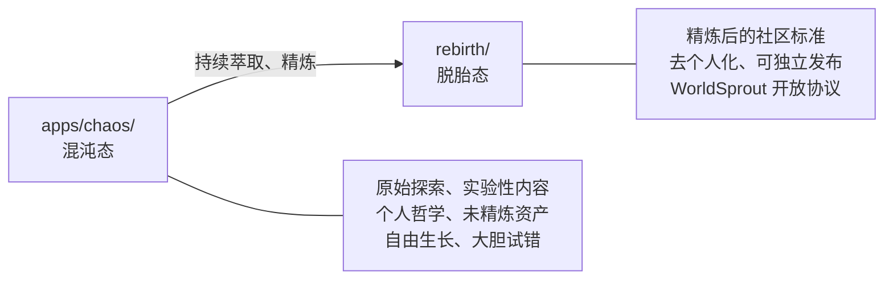

# AGENTS.md 背景说明

`AGENTS.md` 是一个独立的社区开放标准，被 OpenAI Codex、Google Jules、GitHub Copilot、Cursor、Amp 等 30+ 工具原生支持。你只需在项目根目录放置一个 `AGENTS.md` 文件，这些工具就能自动读取你的项目指令——不需要安装任何东西，也不需要了解 AgentForge 或 WorldSprout。

本仓库遵循“混沌 → 萃取 → 脱胎”的信息流转模型：

| 角色 | 路径 | 定位 |
|------|------|------|
| **混沌态 (Chaos)** | `apps/chaos/` | 原始孵化器——承载一切未精炼的探索：哲学内核、实验性代码、个人知识库、技能生态 |
| **脱胎态 (Rebirth)** | `rebirth/` | 精炼后的产出——从 chaos 中萃取、去个人化、去哲学化后的社区开放标准 |

类比：AGENTS.md 标准 ≈ Markdown；AgentForge / WorldSprout ≈ CommonMark + GFM 扩展。
