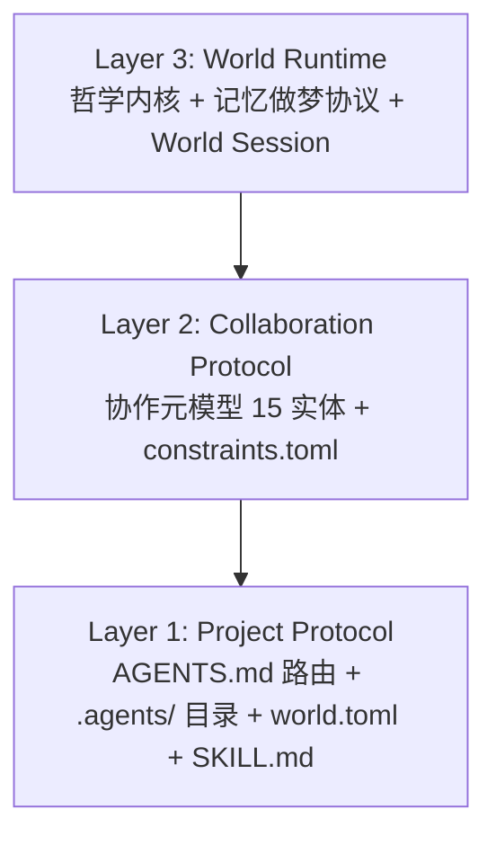
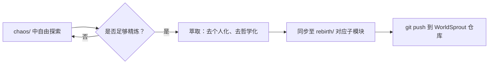

# 治理与规范

本文档描述 AgentForge 项目的核心治理框架与规范体系，包括 Spec v0.2 三层架构和混沌→脱胎萃取同步管道。

## 1. AgentForge Spec v0.2 — 三层分离架构

AgentForge Spec v0.2 定义正交三层架构：

- **Layer 1**：任何项目零前提采用——与 30+ AGENTS.md 工具生态对齐
- **Layer 2**：多智能体协作语义——Team/Role/Agent 定义 + 操作性约束
- **Layer 3**：世界特有实现——AgentForge 世界是 Layer 3 示范（Ψ=Ψ(Ψ) 哲学 + 记忆做梦协议）

详细规范见 [`apps/chaos/specs/agentforge-spec-v0.2.md`](../../specs/agentforge-spec-v0.2.md)。

## 2. 混沌 → 脱胎：萃取同步管道

`rebirth/` 中的内容是从 `chaos/` 持续萃取、精炼后的产物，遵循以下脱胎规则：

- **删除**：个人身份（xinetzone）、哲学内容（道德经、Ψ=Ψ(Ψ)）、私有 Token/密钥/路径
- **中性化**：保留技术架构与协议设计，去除个人叙事
- **重命名**：taolib → sproutlib（品牌对齐）
- **排除**：`src/taolib/github_app/` 等私有基础设施不迁移

脱胎规则详见 [`rebirth/README.md`](../../../../rebirth/README.md)，全面复盘见 [`rebirth/RETROSPECTIVE.md`](../../../../rebirth/RETROSPECTIVE.md)。

## 3. 相关文档

- 仓库结构说明见 [`.agents/docs/repository-structure.md`](repository-structure.md)
- 上下文路由规则见 [`.agents/rules/context-routing.md`](../rules/context-routing.md)
- 全局核心原则见 [`.agents/rules/core-principles.md`](../rules/core-principles.md)
