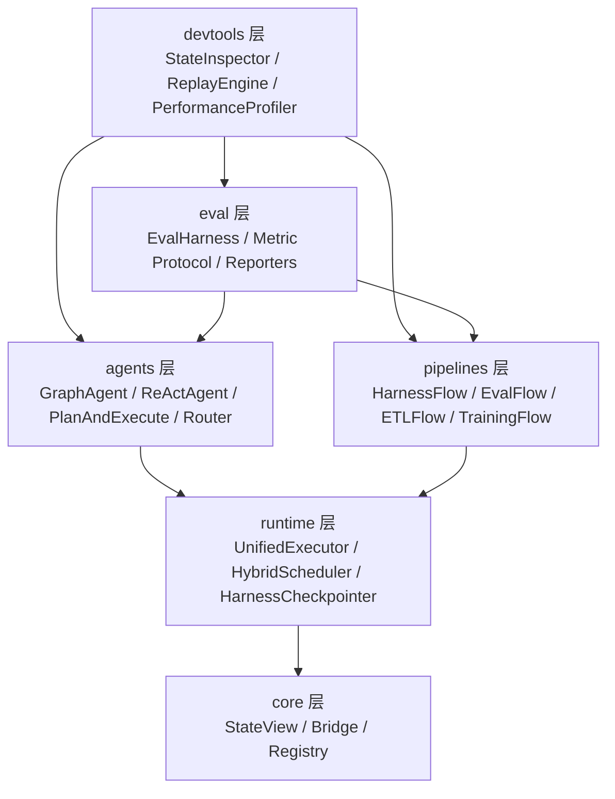
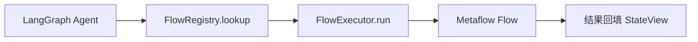
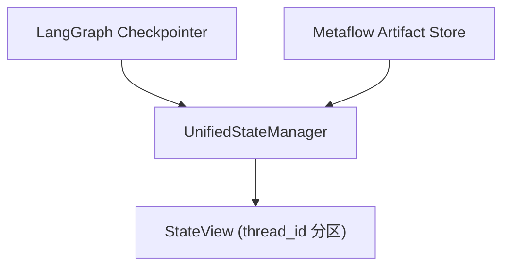

# Harness 智能体系统架构

> 本文档为 Harness 智能体系统的架构归档，沉淀分层结构、关键设计决策、依赖约束与平台限制，供后续 AI 协作者与人类开发者作为参考入口。

## 系统定位

**Harness** 是一个全栈 Agent 治具（Full-stack Agent Harness），提供从开发、编排到评估的完整 Agent 生命周期管理能力。其核心目标是实现 [LangGraph](https://github.com/langchain-ai/langgraph)（事件驱动状态机）与 [Metaflow](https://github.com/Netflix/metaflow)（批处理 DAG）的**对等深度集成**——两者在 Harness 中既可独立使用，也可经由统一的桥接、调度与状态层协同执行。

Harness 不替代 LangGraph 或 Metaflow，而是为二者提供**统一的运行时治具、状态视图与开发者工具链**，让基于 Agent 的探索性工作流与基于 DAG 的工程化流水线在同一套抽象之下互操作。

## 分层架构

Harness 采用 6 层结构，依赖方向严格自上而下：



| 层 | 职责 | 上层依赖 |
|---|---|---|
| **core** | 抽象核心：状态、桥接、注册表 | 仅依赖标准库与 Protocol |
| **runtime** | 执行编排：执行器、调度器、检查点 | core |
| **agents** | LangGraph Agent 抽象与模板 | core + runtime |
| **pipelines** | Metaflow 流水线基类与模板 | core + runtime |
| **eval** | 评估治具与指标 | agents + pipelines |
| **devtools** | 开发者工具链 | 横切所有层 |

## 关键设计决策

### Protocol 优先

所有核心接口使用 `typing.Protocol` 定义，支持 duck typing 与第三方扩展：

- `Metric`、`Checkpointer`、`StateBackend` 等均为 Protocol；
- 第三方实现无需继承基类即可参与 Harness 编排；
- 与 LangGraph、Metaflow 自身的接口风格一致，降低互操作成本。

### 延迟导入与 TYPE_CHECKING 守卫

LangGraph、Metaflow、Redis 等可选依赖通过 `TYPE_CHECKING` 守卫 + 函数体内延迟导入接入：

```python
from typing import TYPE_CHECKING

if TYPE_CHECKING:
    from metaflow import FlowSpec  # 仅类型检查时可见
```

确保 `harness.core` 在缺少外部依赖时仍可加载，跨平台启动可靠（尤其规避 Windows 下 Metaflow 因 `fcntl` 缺失导致的导入失败）。

### Bridge Adapter Pattern

采用适配器模式桥接 LangGraph（事件驱动状态机）与 Metaflow（批处理 DAG）的执行模型差异：

- **`NodeToStepAdapter`**：将 LangGraph Node 输出转化为 Metaflow Step 输入，承担批量化与序列化职责；
- **`StepToGraphAdapter`**：将 Metaflow Step 结果注入 LangGraph SubGraph，承担事件化与状态融合职责；
- 适配器仅依赖 `core/state.py` 暴露的 `StateView`，与上层执行器解耦。

### 统一状态视图

`UnifiedStateManager` 聚合 LangGraph Checkpointer 与 Metaflow Artifact Store 两侧状态源，提供按 `thread_id` 分区的一致性读取：

- 写路径保留各引擎原生持久化路径，避免一致性事务跨边界；
- 读路径在 `StateView` 中合并视图，对上层呈现单一状态对象；
- `HarnessCheckpointer` 提供 `MemoryBackend`（开发/测试）与 `RedisBackend`（生产）两种后端实现。

## 依赖版本约束

| 包 | 约束 | 说明 |
|---|---|---|
| `langgraph` | `>=1.2,<2` | v1.2.x 已支持 Python 3.14 |
| `langgraph-checkpoint` | `>=4.1,<5` | 对齐 langgraph 1.2.x 内部依赖 |
| `metaflow` | `>=2.14,<3` | 需 Linux 环境 |
| `pydantic` | `>=2.0,<3` | 数据模型层 |
| `redis` | `>=5.0,<6` | 状态同步后端 |

依赖以 `harness` 可选依赖组形式声明于 `pyproject.toml`，安装：

```bash
uv sync --extra harness
```

开发与测试附加组：

```bash
uv sync --extra harness --group harness-dev
```

## 平台限制与规避

- **Metaflow 不支持 Windows**：依赖 POSIX 专属 `fcntl` 模块，Windows 解释器导入即失败。需通过 WSL 或 Linux 容器运行 `pipelines/` 与 `runtime/` 中走 Metaflow 的代码路径。
- **架构已通过延迟导入隔离**：Windows 下 LangGraph 路径（`agents/`、`runtime/` 中的 Graph 执行链）完全可用，可独立完成 Agent 开发与本地评估。
- **CI 矩阵约束**：Metaflow 相关测试仅在 Linux runner 上执行，Windows runner 跳过对应用例并显式打印 skip reason。

## 三大跨层交互模式

### 1. Agent-as-Step

将 LangGraph Agent 包装为 Metaflow Step 可调用函数，使 Agent 能作为 DAG 中的一个节点参与批量化执行。


适用场景：在大规模评估或离线再处理中，对每条数据触发一次 Agent 推理。

### 2. Flow-as-Tool

将 Metaflow Flow 注册为 Agent 的 Tool，使 Agent 在交互过程中可按需触发完整流水线。



适用场景：Agent 在对话或编排过程中触发训练、ETL 或报告流水线。

### 3. Shared Checkpoint

跨层持久化适配器统一两侧状态视图，使 Agent 与 Flow 在同一 `thread_id` 下读写共享状态。



适用场景：人机协同长链路任务，Agent 调用 Flow 后需要在后续轮次访问 Flow 产物。

## 模块清单

| 层 | 模块 | 关键导出 |
|---|---|---|
| core | `state.py` | `StateView`、`UnifiedStateManager` |
| core | `bridge.py` | `BridgeConfig`、`NodeToStepAdapter`、`StepToGraphAdapter` |
| core | `registry.py` | `AgentRegistry`、`FlowRegistry`、`register_agent`、`register_flow` |
| runtime | `executor.py` | `GraphExecutor`、`FlowExecutor`、`UnifiedExecutor` |
| runtime | `scheduler.py` | `HybridScheduler`、`TaskPriority` |
| runtime | `checkpointer.py` | `HarnessCheckpointer`、`MemoryBackend`、`RedisBackend` |
| agents | `graph_agent.py` | `GraphAgent`、`ReActAgent` |
| agents | `templates/` | `PlanAndExecuteAgent`、`RouterAgent` |
| pipelines | `flow_base.py` | `HarnessFlow`、`EvalFlow` |
| pipelines | `templates/` | `ETLFlow`、`TrainingFlow` |
| eval | `harness.py` | `EvalHarness`、`EvalSuite` |
| eval | `metrics.py` | `Metric` Protocol、`ExactMatch`、`LatencyMetric` |
| eval | `reporters/` | `ConsoleReporter`、`JsonReporter`、`MarkdownReporter` |
| devtools | `inspector.py` | `StateInspector` |
| devtools | `replay.py` | `ReplayEngine`、`ExecutionRecording` |
| devtools | `profiler.py` | `PerformanceProfiler`、`@profiled` |

## 相关文档

- 兼容性验证脚本：[`scripts/verify_harness_compat.py`](../../scripts/verify_harness_compat.py)
- 依赖管理总则：[`.agents/docs/dependency-management.md`](dependency-management.md)
- Python 3.14 适配说明：[`.agents/docs/python-3.14-adaptation.md`](python-3.14-adaptation.md)
- 技术栈速览：[`.agents/docs/tech-stack.md`](tech-stack.md)
- 项目级变更日志：[`tests/project_changelogs/`](../../tests/project_changelogs/)
