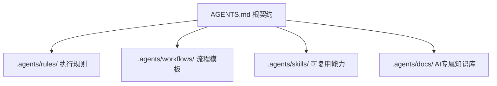

# 3. 核心架构：AGENTS.md + .agents/ 双层体系

如果说 `AGENTS.md` 是"总章程"，那么 `.agents/` 更像是 Agent 的上下文库、角色库、流程库、任务模板库。

下面是通用推荐结构：

```
AGENTS.md              # 必须存在，作为主入口

.agents/
  README.md            # 目录结构与职责说明

  rules/               # 特定领域规范
    python.md
    documentation.md
    context-economy.md
    skills.md

  workflows/           # 流程化工作流
    feature.md
    bugfix.md
    refactor.md
    code-review.md
    dependency-upgrade.md

  skills/              # 可执行技能（每个技能有独立目录 + SKILL.md）
    skill-creator/
    pdf-to-markdown/

  roles/               # 职责模板
    implementer.md
    reviewer.md
    test-writer.md
    architect.md

  teams/               # 团队治理（可选）
    core-governance/

  context/             # Agent 摘要化上下文
    architecture.md
    domain-model.md
    api-contracts.md
    testing.md

  policies/            # 硬约束
    security.md
    privacy.md
    dependencies.md
    migrations.md

  templates/           # 复用模板
    plan.md
    pr-summary.md

  docs/                # AI 专属知识库（可选，用于深度知识沉淀）

  scripts/             # 自动化校验脚本（可选）
    validation/
```

## 3.1 AGENTS.md 的角色：根契约 + 上下文路由器

`AGENTS.md` 不做"大杂烩"，而是充当根契约 + 上下文路由器。它通过清晰的映射表告诉 AI 不同任务该读什么：

```md
## Additional Agent Context

- Frontend work: read `.agents/roles/frontend.md`
- Backend work: read `.agents/roles/backend.md`
- Code review: read `.agents/workflows/code-review.md`
- Security-sensitive changes: read `.agents/policies/security.md`
```



## 3.2 .agents/ 的角色：模块化上下文库

`.agents/` 负责长文档、特定角色、特定任务、深层架构说明和复杂 policy。这种设计的优点是模块化——规则按需加载，不用一次性塞满上下文窗口。`AGENTS.md` 可以引用它们，避免 `AGENTS.md` 变成几千行的超级提示词。
