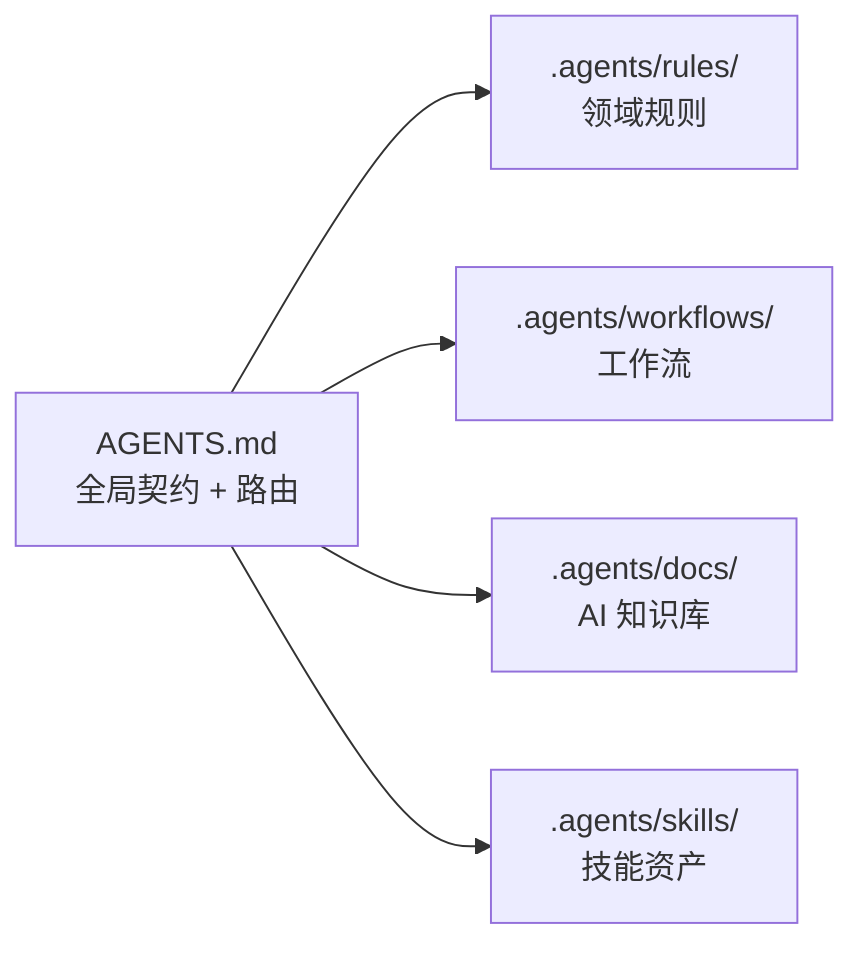

# 23. 行业格局与 AgentForge 定位分析

## 23.1 行业共识：AGENTS.md 正成为"AI 时代的 .gitignore"

目前市面上主流 AI Coding 工具和框架都在各自演化自己的"项目级 AI 契约文件"，但命名和形态正在**快速收敛**：

| 工具/平台 | 契约文件 | 特点 |
|-----------|----------|------|
| **Claude Code** | `CLAUDE.md` | 最早提出"项目级 AI 指令"概念，自由文本，无严格 Schema |
| **Cursor** | `.cursor/rules/` | 文件拆分、Glob 匹配到目录、支持 `always` / `auto-attached` / `agent-requested` 三级触发 |
| **Windsurf** | `.windsurfrules` | 单文件，类似 CLAUDE.md 的简化版 |
| **GitHub Copilot** | `.github/copilot-instructions.md` | GitHub 官方方案，放在 `.github/` 借力已有约定目录 |
| **OpenAI Agents SDK** | `instructions` + `guardrails` | 强调"指令"与"护栏"分离，面向 Agent 而非项目 |
| **Qoder** | `.qoder/` + rules 系统 | 用 `.qoder/repowiki/` 做知识库，rules 做行为约束 |

**三条主线正在浮现**：

1. **单文件派**（CLAUDE.md、AGENTS.md）：以自由文本承载全局契约，轻量但缺乏结构化。
2. **多文件规则派**（.cursor/rules/、.qoder/rules/）：按领域拆分、按触发条件匹配，更像"AI 的 lint 规则"。
3. **完整目录派**（.agents/、.github/）：将 AI 资产作为一个独立的子系统来治理，包含规则、工作流、技能、知识库。

## 23.2 AgentForge 的 AGENTS.md + .agents/ 设计的五个层次

AgentForge 在行业里是**走在"完整目录派"最前面的项目之一**。它的设计可以拆成五个层次来看：

### 第 1 层：AGENTS.md = 全局路由，而不是规则堆放处



这和 Cursor 的 `.cursor/rules/` 有本质区别：**AGENTS.md 不做规则本体，只做路由表**。遇到什么任务 → 去读哪个文件，这是 AGENTS.md 的核心职责。对比 Cursor，它把触发逻辑（Glob pattern matching）塞到了规则文件元数据里，而 AgentForge 把路由逻辑保留在顶层 AGENTS.md 的表格中——**一个人类可读的上下文路由表，而不是给工具解析的 Glob**。

### 第 2 层：.agents/ 是 AI 子系统的"物理隔离区"

这是 AgentForge 最激进也最独特的设计决策——**docs/ 与 .agents/ 的物理隔离**：

- `docs/` = 人类维度，人类开发者阅读和维护
- `.agents/` = AI 维度，AI 智能体消费和执行
- 两者通过 **双向同步机制** 保持一致性

这在行业里是独创的。绝大多数工具（Cursor、Claude Code、Copilot）都是把 AI 指令混在项目文件里，没有"人类/AI 双轨"的意识。AgentForge 意识到：**人读的东西和 AI 需要的东西，信息密度和组织方式天然不同**。人需要叙述、示例、背景；AI 需要精确、无歧义、快速索引。

### 第 3 层：world.toml = 声明式世界描述

```
[world]
name = "agentforge"
version = "3.1.0"

[kernel]  # 不可分割的最小世界——缺少任何部分则世界不成立
manifest = "world.toml"
rules = ["rules/context-economy.md", "rules/documentation.md", "rules/skills.md"]

[fragments]  # 可安装/卸载的可选能力组合
[fragments.python-engineering]  # Python 工程规范
[fragments.frontend]            # 前端规范
[fragments.pr-review]           # PR Review 工作流

[capabilities]  # 独立安装的技能和脚本
skills = "skills/"
```

这相当于把 "AI 项目配置" 做成了 **包管理器式的声明式清单**。行业里还没有第二家这么做。Cursor 的规则是零散文件，Claude Code 就一个 CLAUDE.md，GitHub Copilot 就一个 instructions.md。AgentForge 的 world.toml 给出了一个完整的依赖管理模型：kernel（必选核心）、fragments（可选能力）、capabilities（独立技能）——这和 Linux 内核的 Kconfig / package.json 的 dependencies+optionalDependencies 是同一个设计范式。

### 第 4 层：Registry 系统 + 技能生态

```
[registries.local]     # 本地 Registry
[registries.default]   # 远程 Registry
```

配合 `registry-index/` 目录和 fragments 分发机制，这实际上是 **AI 规则的 npm/pip**。行业里 Cursor 刚推出 "Rules Marketplace" 但还非常早期；AgentForge 用 `registry.toml` + `world.toml` + `fragments` 已经做出了完整的包分发模型。

### 第 5 层：协作元模型——不只是规则，是 Agent 的操作系统

```
Team → Role → Agent → Task → Workflow → Handoff
                          ↓
                  Memory / Context / Rule / Skill / Artifact
                          ↓
                  Policy / Permission / Session
```

这是 AgentForge 最深层的设计。绝大多数工具的 "Agent 配置" 只是 "给 LLM 一段 system prompt"，而 AgentForge 定义了一个**完整的协作语义模型**：
- **组织层**（Team/Role/Agent）：定义谁做什么
- **执行层**（Mission/Task/Workflow/Handoff）：定义怎么做
- **知识层**（Memory/Context/Rule/Skill/Artifact）：定义用什么
- **治理层**（Policy/Permission）：定义边界在哪
- **运行态**（Session）：定义当前状态

这个元模型的本质是：**用一个统一语义框架容纳从单 Agent 任务到多 Agent 协作的所有场景**。Cursor、Claude Code 现在都只有一个 Agent（你自己 + 一个助手），而 AgentForge 的设计已经为多 Agent 协作做好了底层语义准备。

## 23.3 AgentForge 设计与行业主流的关键差异

| 维度 | 行业主流（2024-2025） | AgentForge |
|------|----------------------|------------|
| **契约形式** | 自由文本 Markdown | 路由表 + 结构化 TOML |
| **规则组织** | 散落文件 + Glob 匹配 | kernel/fragments/capabilities 四层模型 |
| **文档边界** | 无区分 | docs/（人）↔ .agents/（AI）物理隔离 |
| **能力分发** | 几乎无 | Registry + fragments 包管理 |
| **协作模型** | 单 Agent | 完整 Team/Role/Agent 元模型 |
| **哲学根基** | 无 | Ψ=Ψ(Ψ) + 道-德经极简原则 |
| **世界抽象** | 无 | World 作为统一上下文容器，支持多端协同 |

## 23.4 领先方向与追赶空间

**AgentForge 明显领先的**：
- **物理隔离的人/AI 双轨架构**：这个概念行业里还很少有人提
- **声明式世界描述（world.toml）**：比任何竞品都结构化
- **协作元模型的完整度**：为多 Agent 协作预留了完备的语义框架
- **哲学-工程的闭环映射**：这在整个行业里是独一份的

**行业正在快速追赶、AgentForge 可能需要关注的**：
- **Cursor 的 Glob 规则触发**：自动按文件类型/目录匹配规则，减少手动路由成本
- **Copilot 的 `.github/` 借力**：放在既有约定目录中降低入驻门槛
- **Claude Code 的简约为王**：一个 `CLAUDE.md` 比一整套 `.agents/` 目录更容易传播
- **Codex/OpenAI 的 Agent SDK 标准**：如果 OpenAI 推出官方的 Agent 配置标准，可能成为行业基准
