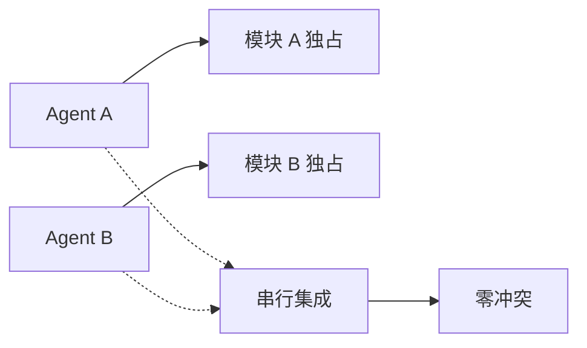

# 24. 设计洞见概览（精要版）

## 24.1 递归自指：World 即世界的一部分

传统的 `AGENTS.md` 是静态配置文件，而 AgentForge 的 `world.toml` 做到了递归自指：

```toml
[world]
name = "agentforge"
version = "3.1.0"

[kernel]
manifest = "world.toml"  # 递归自指
```

**洞见**：这不只是语法技巧，而是一种**哲学映射**——元公理 Ψ=Ψ(Ψ) 的工程表达。规范本身也是规范所描述的对象。

## 24.2 宇宙法则 vs 可选片段：不可变与可塑的辩证

```toml
[immutable_rules]
# 子世界禁止覆盖以下规则
immutable_rules = ["world-hierarchy", "context-economy"]

[fragments]
python-engineering = { optional = true }  # 可选安装
psi-philosophy = { optional = false }     # 哲学内核不可选
```

**洞见**：AgentForge 将规则分为两类：
- **不可变宇宙法则**：上下文节省等基本行为约束
- **可选片段**：按需加载的领域能力

这比单一的 AGENTS.md 更适合大型项目的渐进式治理。

## 24.3 协作元模型：超越文件组织的语义层

| 实体 | AgentForge 实现 |
|------|----------------|
| **Team** | `.agents/teams/` 治理边界 |
| **Role** | `.agents/roles/` 职责模板 |
| **Agent** | 执行主体（规划中） |
| **Workflow** | `.agents/workflows/` 协作协议 |
| **Memory** | `docs/superpowers/memories/` |

**洞见**：AgentForge 不只是组织文件，而是用目录映射了完整的语义模型。`.agents/roles/` 是试点，`teams/` 是第二批，后续还有 `agents/` 和 `policies/`。

## 24.4 物理隔离的文档架构

```
docs/          → 人类开发者（技术文档、通用知识）
.agents/docs/  → AI 智能体（规则、参考、知识库）
```

**洞见**：这种"人类/AI 双轨"设计避免了 README.md 被 AI 指令污染，也避免了 AGENTS.md 被人类文档稀释。物理隔离 > 语义区分。

## 24.5 并行 Agent 的文件级隔离模式



**洞见**：World CLI 开发中 4 Agent 并行，验证了"文件级隔离 + 串行集成"的可行性。这比粗粒度的"分目录"更安全。

## 24.6 通用标准的战略定位

> 项目战略定位是成为 AI Agent 项目约定的**通用标准**，而非仅限于 AgentForge 内部使用的治理体系。

**洞见**：AgentForge 的野心不是做一个好用的项目，而是做一套**可迁移的契约规范**。`agent-collaboration-metamodel.md` 明确标注"不绑定具体实现，是跨项目可迁移的概念内核"。

## 24.7 与其他主流方案的对比

| 维度 | AGENTS.md 标准 | AgentForge |
|------|---------------|------------|
| **格式** | Markdown 自由格式 | Markdown + TOML 声明 |
| **层级** | 嵌套单文件 | 分层世界模型 |
| **组织** | 单文件 + 目录约定 | 协作元模型驱动 |
| **状态** | 无运行时概念 | World Session 多端协同 |
| **演进** | 按需扩展 | 目录映射语义演进 |

**核心洞见**：AgentForge 把 `AGENTS.md` 从"智能体配置文件"升级为"智能体世界的声明式描述"，并通过协作元模型提供了超越文件组织的语义建模能力。
