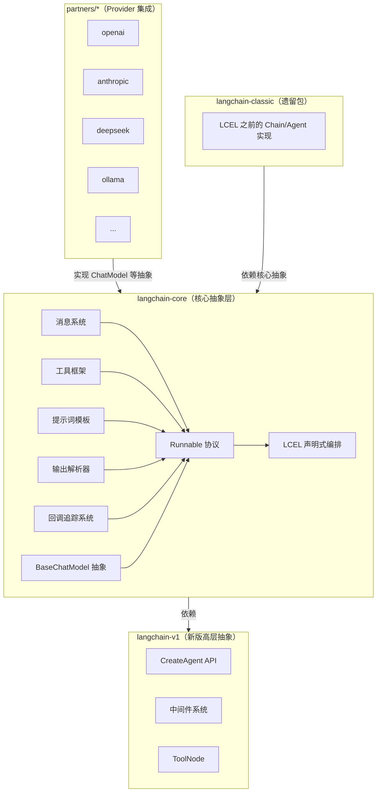
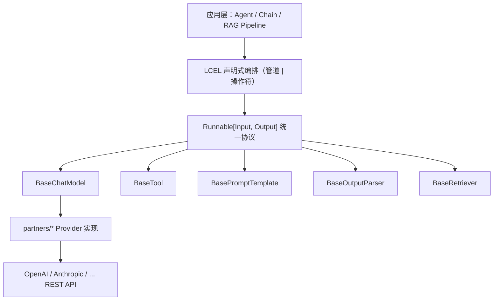
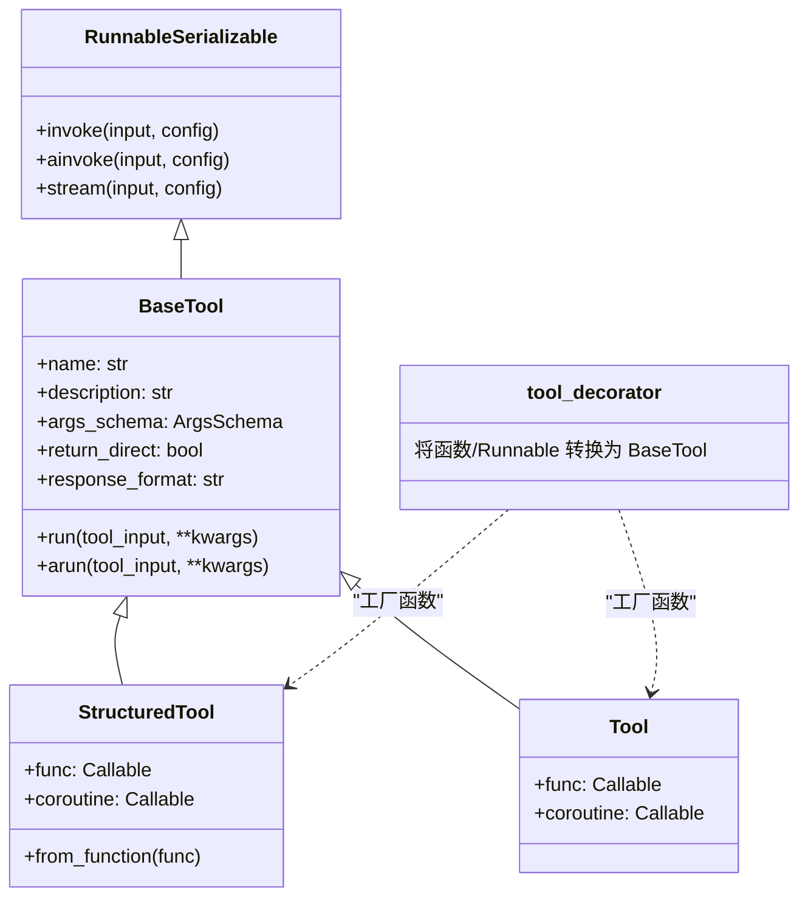
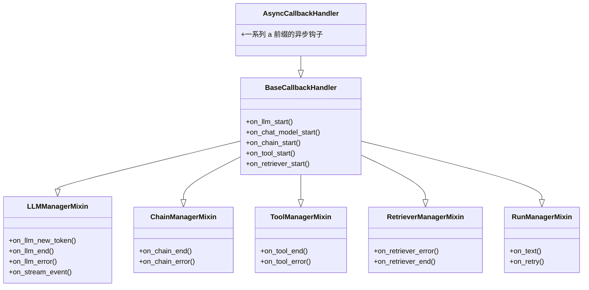
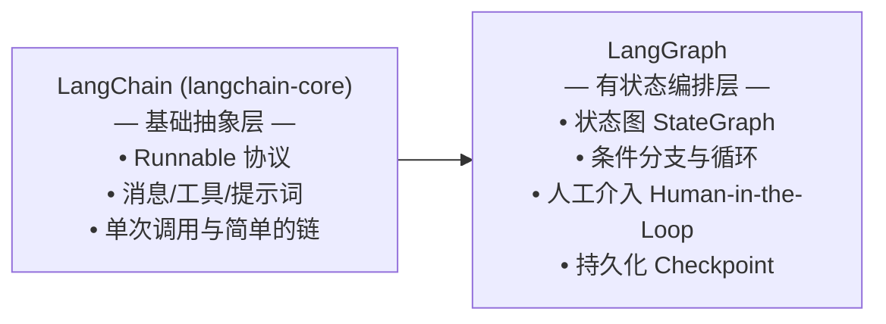

# LangChain 核心架构深度分析

> 基于 `langchain-core` 源码的架构级分析，覆盖 Runnable 协议、消息系统、工具调用框架、提示词模板、回调追踪、输出解析、大模型集成等核心模块。

---

## 1. 项目概览与定位

### 1.1 定位：LLM 应用的基础抽象层

LangChain 的核心定位是 **LLM 应用的基础抽象层**，它不直接实现与大模型 API 的通信，而是定义一套统一的接口协议，让上层应用（Agent、Chain、RAG 等）可以基于抽象编程，而不依赖于具体 Provider。

### 1.2 核心设计理念

LangChain 有两条贯穿始终的设计主线：

- **Runnable 协议统一一切组件**：所有组件（Prompt、ChatModel、Tool、OutputParser 等）都实现 `Runnable[Input, Output]` 接口，这使得任意组件都可以通过统一的 `invoke`/`stream`/`batch` 方法与 LCEL 管道组合使用。
- **LCEL (LangChain Expression Language)**：一种声明式链式编排 DSL，通过 Python 的 `|` 操作符和字典字面量，将 Runnable 组件串行或并行组合成执行图。LCEL 自动为组合后的链提供同步/异步/批处理/流式能力。

### 1.3 包结构概览

LangChain 仓库采用 monorepo 结构，关键包如下：



### 1.4 架构层级关系



---

## 2. Runnable 协议体系

### 2.1 Runnable 基类

`Runnable[Input, Output]` 是所有组件的统一抽象基类，定义在 `langchain_core/runnables/base.py`。其核心接口如下：

| 方法 | 签名 | 说明 |
|---|---|---|
| `invoke` | `(input: Input, config?) -> Output` | 同步单次调用 |
| `ainvoke` | `(input: Input, config?) -> Output` | 异步单次调用（默认委托给 `run_in_executor`） |
| `batch` | `(inputs: list[Input], config?) -> list[Output]` | 批量调用（默认线程池并发） |
| `abatch` | `(inputs: list[Input], config?) -> list[Output]` | 异步批量调用 |
| `stream` | `(input: Input, config?) -> Iterator[Output]` | 流式输出 |
| `astream` | `(input: Input, config?) -> AsyncIterator[Output]` | 异步流式输出 |
| `astream_events` | `(input: Input, config?) -> AsyncIterator[StreamEvent]` | 事件级流式（含生命周期事件） |
| `astream_log` | `(input: Input, config?) -> AsyncIterator[RunLogPatch]` | 带中间结果的流式 |

**关键特性**：
- **自动异步桥接**：如果子类未实现 async 方法，基类自动通过 `asyncio.to_thread` 将同步方法转换为异步。
- **类型推断**：通过泛型参数和 Pydantic 元数据自动推断 `InputType`、`OutputType`、`input_schema`、`output_schema`。
- **图表示**：`get_graph()` 方法可为任意 Runnable 生成 DAG 图。

### 2.2 RunnableSequence（管道 `|` 操作符）

`RunnableSequence` 通过 `__or__` 方法实现管道组合：

```python
# 源码：runnables/base.py 第 619-638 行
def __or__(self, other):
    return RunnableSequence(self, coerce_to_runnable(other))
```

**核心行为**：前一个 Runnable 的输出作为下一个 Runnable 的输入，自动处理同步/异步/流式适配。

```python
from langchain_core.runnables import RunnableLambda, RunnableSequence

# 方式一：| 操作符（最推荐）
sequence = (
    RunnableLambda(lambda x: x + 1)  # type: Runnable[int, int]
    | RunnableLambda(lambda x: x * 2)  # type: Runnable[int, int]
)
sequence.invoke(1)  # (1+1)*2 = 4

# 方式二：显式构造
seq = RunnableSequence(
    RunnableLambda(lambda x: x + 1),
    RunnableLambda(lambda x: x * 2),
)
seq.batch([1, 2, 3])  # [4, 6, 8]
```

**自动流式传递**：一个 `RunnableSequence` 如果内部所有组件都支持流式，则整个链也自动支持流式——序列中的迭代器会无缝衔接。

### 2.3 RunnableParallel

`RunnableParallel` 通过字典字面量自动构造，**并发执行**多个分支：

```python
from langchain_core.runnables import RunnableLambda

sequence = RunnableLambda(lambda x: x + 1) | {
    "mul_2": RunnableLambda(lambda x: x * 2),
    "mul_5": RunnableLambda(lambda x: x * 5),
}
sequence.invoke(1)
# {'mul_2': 4, 'mul_5': 10}
```

**关键行为**：
- 输入被**复制**到每个分支（不拆分）
- 所有分支**并发**执行（默认 `ThreadPoolExecutor`）
- `RunnableParallel` 本身也支持流式：产生一个字典流，每个字典包含各分支的最新部分结果

### 2.4 RunnableLambda 与 RunnablePassthrough

```python
from langchain_core.runnables import RunnableLambda, RunnablePassthrough

# RunnableLambda：将任意 callable 包装为 Runnable
add_one = RunnableLambda(lambda x: x + 1)

# RunnablePassthrough：直接透传输入
passthrough = RunnablePassthrough()

# 常见模式：在 RunnableParallel 中使用 RunnablePassthrough 保留原始输入
chain = RunnablePassthrough.assign(
    doubled=lambda x: x["value"] * 2
)
chain.invoke({"value": 5})
# {'value': 5, 'doubled': 10}  -- 原始字段保留，新字段 "doubled" 追加
```

### 2.5 RunnableConfig 配置传递机制

`RunnableConfig` 是一个 `TypedDict(total=False)`，定义了所有 Runnable 方法接受的统一配置：

```python
# 源码定义：runnables/config.py
class RunnableConfig(TypedDict, total=False):
    tags: list[str]              # 追踪标签
    metadata: dict[str, Any]      # 追踪元数据
    callbacks: Callbacks          # 回调处理器
    run_name: str                 # 运行名称
    max_concurrency: int | None   # 最大并发数
    recursion_limit: int          # 递归深度限制
    configurable: dict[str, Any]  # 可配置字段
```

**配置传递机制**：通过 `ContextVar` 在调用栈中自动向下传递，子组件可通过 `ensure_config()` 合并父配置。

```python
from langchain_core.runnables import RunnableConfig
from langchain_core.runnables.config import ensure_config

def my_runnable(input, config: RunnableConfig = None):
    cfg = ensure_config(config)
    # cfg 中自动包含父调用链传来的 tags/metadata/callbacks
    print(cfg.get("tags"))  # 继承父链的 tags
```

### 2.6 异常处理与重试

#### with_fallbacks：优雅降级

```python
# 源码：runnables/fallbacks.py
from langchain_core.runnables import RunnableLambda

primary = RunnableLambda(lambda x: 1 / 0)  # 总是失败
fallback = RunnableLambda(lambda x: "fallback_value")

chain = primary.with_fallbacks([fallback])
chain.invoke(42)  # 'fallback_value' — 主链路失败后自动使用备选
```

**关键机制**：
- `RunnableWithFallbacks` 包装原 Runnable 和备选列表
- 按顺序尝试，直到某个成功或全部失败
- 可配置 `exceptions_to_handle` 控制哪些异常触发降级
- 支持将异常信息作为输入传给备选链（通过 `exception_key`）

#### with_retry：自动重试

```python
import random

def buggy_double(y: int) -> int:
    if random.random() > 0.3:
        raise ValueError("随机失败")
    return y * 2

sequence = (
    RunnableLambda(lambda x: x + 1)
    | RunnableLambda(buggy_double).with_retry(
        stop_after_attempt=10,
        wait_exponential_jitter=False
    )
)
```

---

## 3. 消息系统

### 3.1 BaseMessage 及子类体系

```
BaseMessage (Serializable, pydantic BaseModel)
├── AIMessage        — 模型回复
│   └── AIMessageChunk
├── HumanMessage     — 用户输入
│   └── HumanMessageChunk
├── SystemMessage    — 系统指令
│   └── SystemMessageChunk
├── ToolMessage      — 工具执行结果
│   └── ToolMessageChunk
└── ChatMessage      — 通用消息（可自定义 role）
```

**BaseMessage 核心字段**（源码定义在 `messages/base.py`）：

| 字段 | 类型 | 说明 |
|---|---|---|
| `content` | `str \| list[str \| dict]` | 消息内容 |
| `type` | `str` | 消息类型标识（`"human"`、`"ai"`、`"system"`、`"tool"`） |
| `id` | `str \| None` | 消息唯一 ID |
| `name` | `str \| None` | 可选名称 |
| `additional_kwargs` | `dict` | Provider 特定附加数据 |
| `response_metadata` | `dict` | 响应元数据（header、logprobs、token 计数等） |

### 3.2 消息内容类型

`content` 字段支持两种形态：
- **字符串**：纯文本消息
- **列表**：多模态内容块，每块是一个 `dict`，至少包含 `"type"` 键：

```python
from langchain_core.messages import HumanMessage

# 纯文本
HumanMessage(content="Hello, world!")

# 多模态（文本 + 图片）
HumanMessage(content=[
    {"type": "text", "text": "What's in this image?"},
    {"type": "image_url", "image_url": {"url": "https://example.com/image.jpg"}},
])
```

### 3.3 AIMessage.tool_calls 与工具调用关联

`AIMessage` 包含 `tool_calls` 字段，存储模型请求调用的工具信息：

```python
from langchain_core.messages import AIMessage

ai_msg = AIMessage(
    content="",
    tool_calls=[{
        "name": "get_weather",
        "args": {"city": "Beijing"},
        "id": "call_abc123",
        "type": "tool_call",
    }],
)
```

**ToolCall 数据模型**（`messages/tool.py`）：

```python
class ToolCall(TypedDict):
    name: str           # 工具名称
    args: dict[str, Any]  # 工具参数
    id: str | None       # 调用 ID
    type: Literal["tool_call"]
```

**工具调用→执行→结果 的完整消息流**：

```python
# 1. 模型返回 tool_call
ai_msg = AIMessage(content="", tool_calls=[...])

# 2. 执行工具获得 ToolMessage
tool_result = ToolMessage(content="28°C", tool_call_id="call_abc123")

# 3. 将结果反馈给模型继续推理
next_msgs = [user_request, ai_msg, tool_result]
response = chat_model.invoke(next_msgs)
```

---

## 4. 工具调用框架

### 4.1 工具类层级结构



### 4.2 BaseTool 抽象基类

`BaseTool` 继承自 `RunnableSerializable[str | dict | ToolCall, Any]`，是所有工具的统一抽象（源码 `tools/base.py` 第 405 行）：

```python
from langchain_core.tools import BaseTool
from pydantic import BaseModel, Field

class MyToolInput(BaseModel):
    query: str = Field(description="搜索关键词")

class MyTool(BaseTool):
    name: str = "my_tool"
    description: str = "一个自定义工具"
    args_schema: type[BaseModel] = MyToolInput

    def _run(self, query: str, config, run_manager=None) -> str:
        return f"查询结果: {query}"
```

### 4.3 StructuredTool 与 @tool 装饰器

`StructuredTool` 是 `BaseTool` 的实用子类，支持**从函数自动推断 args_schema**：

```python
from langchain_core.tools import StructuredTool

def add(a: int, b: int) -> int:
    """将两个整数相加。"""
    return a + b

tool = StructuredTool.from_function(add)
# 自动推断 args_schema 为 AddInput(BaseModel)，包含 a: int, b: int
```

`@tool` 装饰器（`tools/convert.py`）是更便捷的方式：

```python
from langchain_core.tools import tool

@tool
def search_api(query: str) -> str:
    """搜索 API。"""
    return f"搜索结果: {query}"

# 支持带参数的装饰器
@tool("search", return_direct=True, parse_docstring=True)
def search_api(query: str, limit: int = 10) -> str:
    """搜索 API。

    Args:
        query: 搜索关键词。
        limit: 返回数量限制。
    """
    return f"搜索 '{query}' 的前 {limit} 条结果"
```

**`@tool` 的自动能力**：
- 从函数签名的类型注解推断 `args_schema`（Pydantic model）
- 从 docstring 解析参数描述（Google Style）
- 自动区分同步/异步函数
- 支持将 `Runnable` 转换为工具

### 4.4 ToolCall / InvalidToolCall 数据模型

```python
from langchain_core.messages.tool import ToolCall, ToolCallChunk
from langchain_core.messages.content import InvalidToolCall

# 有效的工具调用
valid_call: ToolCall = {
    "name": "get_weather",
    "args": {"city": "Beijing"},
    "id": "call_abc123",
    "type": "tool_call",
}

# 无效的工具调用（模型输出格式不正确）
invalid_call = InvalidToolCall(
    name="unknown_tool",
    args="格式错误的参数",
    id="call_bad",
    error="参数不是有效的 JSON",
    type="invalid_tool_call",
)
```

### 4.5 InjectedToolArg 与运行时注入

有些工具参数不应由模型提供，而应在运行时注入（如 `RunnableConfig`、`tool_call_id` 等）：

```python
from typing import Annotated
from langchain_core.tools import tool, InjectedToolArg, InjectedToolCallId
from langchain_core.messages import ToolMessage

@tool
def my_tool(
    x: int,
    tool_call_id: Annotated[str, InjectedToolCallId],  # 运行时注入，不出现在 schema 中
) -> ToolMessage:
    return ToolMessage(str(x), tool_call_id=tool_call_id)
```

**注入机制**：`InjectedToolArg` 标记的参数不会出现在发送给模型的 `tool_call_schema` 中，而是在工具执行时由框架注入相应值。

### 4.6 工具转换为 Provider 格式

LangChain 的工具定义与具体 Provider 的工具格式是两个层次。`langchain_core/utils/function_calling.py` 中的 `convert_to_openai_tool()` 函数负责将 `BaseTool` 的 schema 映射为 OpenAI 兼容格式：

```python
from langchain_core.utils.function_calling import convert_to_openai_tool

@tool
def get_weather(city: str) -> str: ...

# 转换后得到 OpenAI function-calling 格式：
openai_tool = convert_to_openai_tool(get_weather)
# {
#     "type": "function",
#     "function": {
#         "name": "get_weather",
#         "description": "get_weather(city: str) -> str",
#         "parameters": { ... }  # JSON Schema
#     }
# }
```

各 Provider 的 ChatModel 实现在调用底层 API 之前会根据自己的格式进行类似转换。

---

## 5. 提示词模板系统

### 5.1 类层级结构

```
RunnableSerializable[dict, PromptValue]
└── BasePromptTemplate (ABC)
    ├── StringPromptTemplate
    │   └── PromptTemplate          — 字符串模板 "Hello, {name}!"
    └── BaseChatPromptTemplate (ABC)
        └── ChatPromptTemplate      — 聊天消息列表模板
            ├── MessagesPlaceholder          — 消息列表占位符
            ├── SystemMessagePromptTemplate  — 系统消息模板
            ├── HumanMessagePromptTemplate   — 用户消息模板
            └── AIMessagePromptTemplate      — AI 消息模板
```

### 5.2 BasePromptTemplate 核心

`BasePromptTemplate` 是 `RunnableSerializable[dict, PromptValue]`：

```python
class BasePromptTemplate(RunnableSerializable[dict, PromptValue], ABC):
    input_variables: list[str]       # 必需输入变量
    optional_variables: list[str]     # 可选变量
    input_types: dict[str, Any]       # 变量类型映射
    output_parser: BaseOutputParser   # 输出解析器
    partial_variables: dict[str, Any]  # 部分变量（预填充）
```

作为 Runnable，`invoke` 接受 `dict` 输入，返回 `PromptValue`，然后 `PromptValue.to_messages()` 或 `to_string()` 转换为模型可接受的格式。

### 5.3 ChatPromptTemplate 构建管道

```python
from langchain_core.prompts import (
    ChatPromptTemplate,
    MessagesPlaceholder,
    SystemMessagePromptTemplate,
    HumanMessagePromptTemplate,
)

# from_messages() 构建方法
prompt = ChatPromptTemplate.from_messages([
    ("system", "你是一个有用的助手。"),
    MessagesPlaceholder("history"),           # 聊天历史占位符
    ("human", "{question}"),                  # 用户问题模板
])

# invoke 返回 ChatPromptValue
prompt_value = prompt.invoke({
    "history": [
        HumanMessage(content="5+2 是多少？"),
        AIMessage(content="5+2 等于 7。"),
    ],
    "question": "现在把这个结果乘以 4",
})

# ChatPromptValue.to_messages() 得到消息列表
# [
#     SystemMessage(content="你是一个有用的助手。"),
#     HumanMessage(content="5+2 是多少？"),
#     AIMessage(content="5+2 等于 7。"),
#     HumanMessage(content="现在把这个结果乘以 4"),
# ]
```

### 5.4 MessagesPlaceholder

```python
# 可选占位符：没有历史消息也不报错
MessagesPlaceholder("history", optional=True)

# 限制最大消息数：只保留最近 N 条
MessagesPlaceholder("history", n_messages=10)
```

### 5.5 PromptValue 转换

```python
from langchain_core.prompt_values import ChatPromptValue, StringPromptValue

# ChatPromptValue.to_messages() — 用于 ChatModel
# ChatPromptValue.to_string()  — 用于文本 LLM / 日志

# StringPromptValue.to_string() — 纯字符串
# StringPromptValue.to_messages() — 自动包装为 HumanMessage
```

---

## 6. 回调与追踪系统

### 6.1 BaseCallbackHandler 生命周期钩子

回调系统基于 **Mixin 模式**组织，位于 `callbacks/base.py`：



**关键生命周期钩子**：

| 钩子 | 触发时机 | 组件类型 |
|---|---|---|
| `on_llm_start` | LLM 调用开始 | LLM |
| `on_chat_model_start` | ChatModel 调用开始 | ChatModel |
| `on_llm_new_token` | 流式产生新 token | LLM/ChatModel |
| `on_llm_end` | LLM/ChatModel 调用结束 | LLM/ChatModel |
| `on_llm_error` | LLM/ChatModel 调用出错 | LLM/ChatModel |
| `on_chain_start` | Chain 开始 | Chain |
| `on_chain_end` | Chain 结束 | Chain |
| `on_tool_start` | 工具开始执行 | Tool |
| `on_tool_end` | 工具执行结束 | Tool |
| `on_retriever_end` | 检索器返回结果 | Retriever |

### 6.2 CallbackManager 管理回调链

`CallbackManager` 负责管理多个回调处理器，通过 RunnableConfig 在调用链中自动传递：

```python
from langchain_core.callbacks import StdOutCallbackHandler
from langchain_core.runnables import RunnableLambda

def main():
    # 通过 config 注入回调
    chain.invoke(
        "some input",
        config={"callbacks": [StdOutCallbackHandler()]}
    )
```

### 6.3 自定义回调示例

```python
from langchain_core.callbacks import BaseCallbackHandler
from langchain_core.messages import BaseMessage

class TokenCounter(BaseCallbackHandler):
    def __init__(self):
        self.tokens = 0

    def on_llm_new_token(self, token: str, **kwargs) -> None:
        self.tokens += 1

    def on_llm_end(self, response, **kwargs) -> None:
        print(f"本次调用共产生 {self.tokens} 个 token")
```

### 6.4 LangSmith 集成追踪

通过设置环境变量 `LANGCHAIN_TRACING_V2=true` 即可启用 LangSmith 追踪。BaseTracer 子类负责将 Run 数据持久化到 LangSmith 平台：

```python
# tracers/base.py — BaseTracer 核心
class BaseTracer(_TracerCore, BaseCallbackHandler, ABC):
    @abstractmethod
    def _persist_run(self, run: Run) -> None:
        """子类实现：将 Run 持久化到目标平台"""
```

---

## 7. 输出解析器

### 7.1 解析器层级

```
RunnableSerializable[LanguageModelOutput, T]
├── BaseLLMOutputParser (ABC)
│   ├── BaseGenerationOutputParser
│   │   └── BaseOutputParser[T]           — 基础同步解析
│   │       ├── StrOutputParser            — 提取 .content 中的纯文本
│   │       ├── JsonOutputParser           — 解析 JSON
│   │       └── PydanticOutputParser       — 解析为 Pydantic 模型
│   └── BaseCumulativeTransformOutputParser  — 支持流式累加
│       └── JsonOutputParser (继承此)
```

### 7.2 StrOutputParser

最简单的解析器：从 AIMessage 中提取文本内容：

```python
from langchain_core.output_parsers import StrOutputParser

parser = StrOutputParser()
# 输入 AIMessage(content="Hello!") → 输出 "Hello!"
```

### 7.3 JsonOutputParser

```python
from langchain_core.output_parsers import JsonOutputParser
from pydantic import BaseModel

class WeatherInfo(BaseModel):
    city: str
    temperature: float

parser = JsonOutputParser(pydantic_object=WeatherInfo)

# 输入 AIMessage(content='{"city": "Beijing", "temperature": 28.5}')
# 输出 WeatherInfo(city="Beijing", temperature=28.5)
# 在流式模式下，支持解析部分 JSON 对象
```

### 7.4 with_structured_output()

这是 LangChain 提供的**声明式结构化输出**方法（定义在 `BaseChatModel` 上），底层综合使用 Provider 原生结构化能力或 tool-calling + 解析器的降级策略：

```python
from pydantic import BaseModel

class Joke(BaseModel):
    setup: str
    punchline: str

# 方式一：传入 Pydantic 模型
structured_model = chat_model.with_structured_output(Joke)
result: Joke = structured_model.invoke("Tell me a joke")

# 方式二：传入 JSON Schema
structured_model = chat_model.with_structured_output(
    {"type": "object", "properties": {"setup": {"type": "str"}, "punchline": {"type": "str"}}}
)
```

---

## 8. 大模型集成方案

### 8.1 BaseChatModel 抽象

`BaseChatModel` 继承自 `BaseLanguageModel[AIMessage]`，是实现 ChatModel 的基类（源码 `language_models/chat_models.py`）：

```python
class BaseChatModel(BaseLanguageModel[AIMessage], ABC):
    @abstractmethod
    def _generate(
        self,
        messages: list[BaseMessage],
        stop: list[str] | None = None,
        run_manager: CallbackManagerForLLMRun | None = None,
        **kwargs: Any,
    ) -> ChatResult: ...

    def bind_tools(
        self,
        tools: Sequence[BaseTool | dict],
        **kwargs: Any,
    ) -> RunnableBinding: ...

    def with_structured_output(
        self,
        schema: dict | type[BaseModel],
        *,
        method: str = None,
        **kwargs: Any,
    ) -> RunnableBinding: ...
```

**Provider 实现者只需实现 `_generate` 和 `_stream`**，即可自动获得 `invoke`/`ainvoke`/`stream`/`astream`/`batch` 等全套能力。

### 8.2 多 Provider 支持机制

Provider 集成通过 `partners/*` 包实现，每个包是独立的 PyPI 包：

| 包名 | Provider |
|---|---|
| `langchain-openai` | OpenAI |
| `langchain-anthropic` | Anthropic |
| `langchain-deepseek` | DeepSeek |
| `langchain-ollama` | Ollama |
| `langchain-groq` | Groq |
| `langchain-mistralai` | Mistral AI |
| `langchain-fireworks` | Fireworks |
| ... | ... |

每个 Provider 包的 ChatModel 类都继承 `BaseChatModel`，只需实现 `_generate` 和 `_stream` 方法：

```python
# 简化示意：langchain-openai 中的实现骨架
from langchain_openai import ChatOpenAI

model = ChatOpenAI(model="gpt-4o")
# model._generate() → 内部调用 OpenAI REST API
# model._stream()  → 内部调用 OpenAI streaming API
```

**Provider 统一替换**：由于所有 Provider 都实现同一 `BaseChatModel` 接口，切换模型只需替换类名：

```python
# 从 OpenAI 切换到 Anthropic，其他代码不变
# model = ChatOpenAI(model="gpt-4o")
model = ChatAnthropic(model="claude-sonnet-4-5")

result = model.invoke("Hello!")
```

### 8.3 BaseLLM vs BaseChatModel

| 维度 | BaseLLM | BaseChatModel |
|---|---|---|
| 输入 | `str \| PromptValue` | `list[BaseMessage] \| PromptValue` |
| 输出 | `LLMResult` (含 `Generation`) | `ChatResult` (含 `ChatGeneration` → `AIMessage`) |
| 定位 | 文本补全模型（GPT-3 时代遗留） | 聊天模型（当前主流） |
| 消息结构 | 不支持 | 支持 System/Human/AI/Tool 多角色 |
| 工具调用 | 不支持 | 原生支持 tool_calls |

---

## 9. 适用场景与局限性

### 9.1 适用场景

| 场景 | 说明 |
|---|---|
| **快速搭建 LLM 原型** | LCEL + `@tool` 装饰器可在几十行代码内构建可用的 Agent 原型链 |
| **链式调用与组合** | Prompt → Model → Parser 的标准流水线，通过 `\|` 操作符天然组合 |
| **多 Provider 无缝切换** | 基于抽象接口编程，切换模型不需要修改逻辑代码 |
| **流式处理** | 整条链自动支持 streaming，无需为中间组件编写流式适配器 |
| **LLM API 统一抽象层** | 在自建 Agent 框架中作为底层统一接口，避免直接耦合特定 Provider |

### 9.2 局限性

| 局限 | 详细说明 |
|---|---|
| **缺少持久化状态管理** | Runnable 本质上无状态（stateless），不提供内置的会话持久化、工作记忆等机制。Agent 状态需要外部管理（如 `langgraph`）。 |
| **不适合复杂的多步骤自主代理** | 对于需要复杂推理循环、条件分支、人工介入、长期规划的 Agent 场景，LCEL 的线性管道模型力不从心。应使用 `langgraph` 构建有状态图。 |
| **抽象泄漏** | Provider 间的行为差异（token 计数、tool calling 格式、流式事件粒）仍时有泄漏，开发者需要了解底层 Provider 特性。 |
| **版本碎片化** | 仓库同时存在 `langchain-core`、`langchain-classic`、`langchain-v1` 三个主要版本，生态文档混乱，迁移路径不清晰。 |
| **依赖重** | `langchain-core` 本身依赖 Pydantic、tenacity 等，加上 Provider 包后依赖体积较大，不适合资源受限环境。 |

### 9.3 与 LangGraph 的定位分工



**总结**：LangChain（core）是 LLM 组件的"标准库"，定义接口和基础能力；LangGraph 是"运行时引擎"，处理复杂的有状态工作流。两者是互补关系而非替代关系。

---

> **参考资料**：本文档所有代码示例均基于 `langchain-core` 的实际源码模式提炼。核心源码位于 `libs/core/langchain_core/` 目录下，各模块入口文件为 `runnables/base.py`、`messages/base.py`、`tools/base.py`、`prompts/chat.py`、`callbacks/base.py`、`output_parsers/base.py`、`language_models/chat_models.py` 等。
