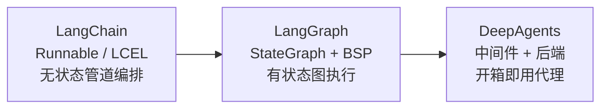
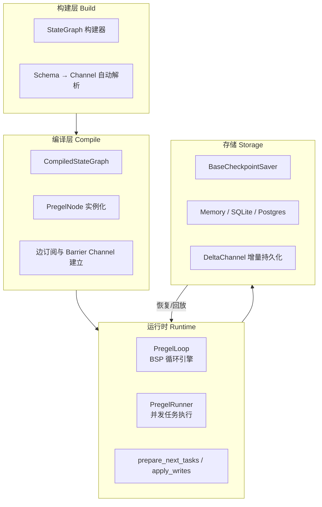
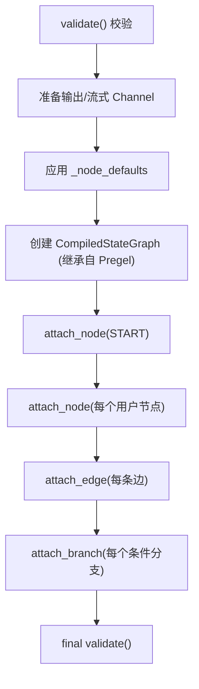
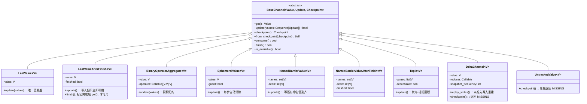
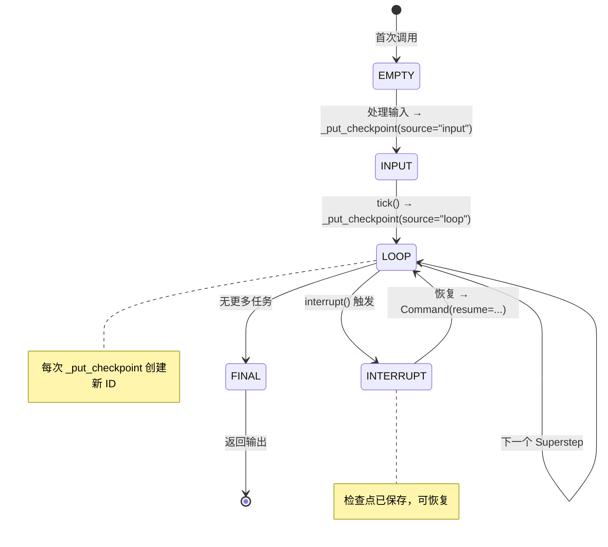

# LangGraph 核心架构深度分析

> 基于 `langgraph` (v0.6+) 源码的系统性架构萃取

## 1. 项目概览与定位

### 1.1 核心定位

LangGraph 并非 LangChain 的简单扩展，而是在 Runnable 协议之上引入的一套**完整的有状态图执行引擎**。如果说 LangChain 的 LCEL 提供了"声明式管道编排"，那么 LangGraph 则回答了"当管道需要循环、分支、持久化和人机协作时该如何表达"。



### 1.2 三大核心设计理念

**Google Pregel BSP 模型的正统实现**

LangGraph 是对 Google 2009 年提出的 [Pregel](https://research.google/pubs/pub37252/) 批量同步并行 (Bulk Synchronous Parallel) 思想的完整 Python 实现。每个 "Superstep" 内节点并发执行，节点之间通过 Channel（类比 Pregel 的 Message）通信，Superstep 边界处进行全局 Barrier 同步。

**Channel 抽象作为一等公民**

不同于传统工作流引擎以"节点"为核心组织数据流，LangGraph 将 Channel 提升为一等公民。每个状态字段对应一个具有独立生命周期的 Channel 实例，节点通过版本号（version）触发，而非通过事件名称匹配。这种设计使得数据流天然可追踪、可检查点、可回放。

**版本驱动的触发机制（Pull vs Push）**

LangGraph 的任务调度分为两类：
- **PULL 任务**：当节点订阅的 Channel 版本高于节点已处理的版本时触发（版本驱动的惰性拉取）
- **PUSH 任务**：通过 `Send` API 和 `Command` 对象主动推送至 `TASKS` Topic Channel

这种双机制确保了同一 Superstep 内不会出现同一节点因多次更新而重复执行，同时保留了跨步的动态路由能力。

### 1.3 Monorepo 包结构

```
libs/
├── langgraph/           # 核心：StateGraph, Pregel 引擎, Channel 系统, Stream
├── checkpoint/          # 检查点基础接口 + Memory 后端
├── checkpoint-sqlite/   # SQLite 检查点后端 (含 DeltaChannel 支持)
├── checkpoint-postgres/ # PostgreSQL 检查点后端
├── cli/                 # langgraph CLI: dev 服务器, deploy, docker 构建
├── sdk-py/              # LangGraph Platform SDK (Python)
└── prebuilt/            # create_react_agent 等预构建代理模式
```

### 1.4 四层架构全景



## 2. StateGraph 构建器

### 2.1 泛型签名详解

[StateGraph](file://libs/langgraph/langgraph/graph/state.py) 的泛型签名承载了四个维度的类型约束：

```python
class StateGraph(Generic[StateT, ContextT, InputT, OutputT]):
```

| 泛型参数 | 含义 | 默认值 | 示例 |
|---|---|---|---|
| `StateT` | 图的完整状态类型 | 必须显式指定 | `TypedDict` / `BaseModel` |
| `ContextT` | 运行时不可变上下文 | `None` | `{"user_id": str, "db_conn": Any}` |
| `InputT` | 图的输入 Schema | 等于 `StateT` | 部分状态字段的子集 |
| `OutputT` | 图的输出 Schema | 等于 `StateT` | 部分状态字段的子集 |

### 2.2 Schema → Channel 自动解析机制

`_get_channels` 和 `_get_channel` 是连接 Python 类型系统和 Channel 系统的桥梁。解析逻辑如下：

```python
# 简化自 _get_channel 源码
def _get_channel(name: str, annotation: Any) -> BaseChannel | ManagedValueSpec:
    # 1. 检查是否为 ManagedValue（IsLastStep 等动态计算值）
    if manager := _is_field_managed_value(name, annotation):
        return manager

    # 2. 检查 Annotated 元数据中是否有显式 Channel 类型
    #    e.g., Annotated[list, BinaryOperatorAggregate(list, operator.add)]
    if channel := _is_field_channel(annotation):
        return channel

    # 3. 检查 Annotated 末尾是否有二元归约函数
    #    e.g., Annotated[list, operator.add]
    if channel := _is_field_binop(annotation):
        return channel

    # 4. 默认回退: LastValue (每个 key 只有一个值)
    return LastValue(annotation)
```

关键点：`_is_field_binop` 通过检查 `Annotated` 的最后一个元数据元素是否为一个接受两个位置参数的 callable 来判定 BinaryOperatorAggregate，这是 `Annotated[list, operator.add]` 语法之所以能工作的原因。

### 2.3 核心构建 API

| API | 签名 | 作用 |
|---|---|---|
| `add_node` | `(name, action, *, metadata, retry_policy, ...)` | 注册节点，支持自动推断输入 Schema |
| `add_edge` | `(start, end)` | 普通边：start 完成 → 触发 end |
| `add_conditional_edges` | `(source, path_fn, path_map?)` | 条件边：source 完成的输出路由 |
| `add_sequence` | `(nodes)` | 快捷线性链：自动连边 |
| `set_entry_point` | `(key)` | 等价于 `add_edge(START, key)` |
| `set_finish_point` | `(key)` | 等价于 `add_edge(key, END)` |

### 2.4 编译过程详解

`compile()` 方法将构建器蓝图转换为可执行的 `CompiledStateGraph`：



编译过程中，每条边都被转换为 Pregel 运行时可执行的订阅/发布关系：

- **普通边** `(A → B)`：在 A 的 writers 中追加 `ChannelWrite("branch:to:B")`，B 的 triggers 已包含 `"branch:to:B"`
- **等待边** `((A1, A2) → B)`：创建 `NamedBarrierValue("join:A1+A2:B", {A1, A2})` Channel，A1 和 A2 向其写入，B 订阅它

### 2.5 CompiledStateGraph 的 Runnable 继承关系

```python
class CompiledStateGraph(
    Pregel[StateT, ContextT, InputT, OutputT],  # Pregel 继承自 Runnable
    Generic[StateT, ContextT, InputT, OutputT],
):
```

`CompiledStateGraph` 完整实现了 `Runnable` 接口，因此可以：
- `.invoke(input)` / `.ainvoke(input)` 同步/异步调用
- `.stream(input, stream_mode="updates")` 流式输出
- 作为其他图的节点嵌入（子图模式）
- 通过 `|` 管道符与其他 Runnable 组合

### 2.6 完整 Agent 图定义示例

```python
from typing_extensions import TypedDict, Annotated
from langgraph.graph import StateGraph, START, END
from langgraph.checkpoint.memory import InMemorySaver
from langgraph.graph.message import add_messages
from langchain_core.messages import BaseMessage

class AgentState(TypedDict):
    messages: Annotated[list[BaseMessage], add_messages]
    next_step: str
    final_answer: str

def router(state: AgentState) -> str:
    if state["final_answer"]:
        return "finish"
    return "call_model"

def call_model(state: AgentState) -> dict:
    # 实际中这里调用 LLM
    response = "mock response"
    return {"messages": [response], "next_step": "finish"}

def finish(state: AgentState) -> dict:
    return {"final_answer": state["messages"][-1].content}

builder = StateGraph(AgentState)

builder.add_node("call_model", call_model)
builder.add_node("finish", finish)

builder.add_edge(START, "call_model")
builder.add_conditional_edges("call_model", router, {
    "call_model": "call_model",
    "finish": "finish",
})
builder.add_edge("finish", END)

graph = builder.compile(checkpointer=InMemorySaver())

result = graph.invoke(
    {"messages": [{"role": "user", "content": "hello"}]},
    {"configurable": {"thread_id": "thread-1"}}
)
```

## 3. Channel 系统深度剖析

### 3.1 BaseChannel 抽象接口

[BaseChannel](file://libs/langgraph/langgraph/channels/base.py) 定义了所有 Channel 必须实现的契约：

```python
class BaseChannel(Generic[Value, Update, Checkpoint], ABC):
    """三个泛型参数:
    - Value:   get() 返回的值类型
    - Update:  update() 接收的更新类型
    - Checkpoint: checkpoint() 序列化形式
    """

    # 读
    @abstractmethod
    def get(self) -> Value: ...
    def is_available(self) -> bool: ...

    # 写
    @abstractmethod
    def update(self, values: Sequence[Update]) -> bool: ...

    # 生命周期
    def consume(self) -> bool: ...   # 订阅者已消费后通知
    def finish(self) -> bool: ...    # 运行结束通知

    # 持久化
    def checkpoint(self) -> Checkpoint | Any: ...
    @abstractmethod
    def from_checkpoint(self, checkpoint: Checkpoint | Any) -> Self: ...
```

### 3.2 六大核心 Channel 实现

#### 3.2.1 LastValue — 最后值覆盖（默认）

```python
class LastValue(Generic[Value], BaseChannel[Value, Value, Value]):
    """每步仅接受一个值，始终保留最新值。"""

    def update(self, values: Sequence[Value]) -> bool:
        if len(values) != 1:
            raise InvalidUpdateError(  # 多人并发写入同一 key 报错
                "Can receive only one value per step. Use an Annotated key..."
            )
        self.value = values[-1]
        return True
```

**适用场景**：图中只有一个节点写该字段（如 `next_step`、`status`）。

#### 3.2.2 BinaryOperatorAggregate — 二元归约聚合

```python
class BinaryOperatorAggregate(Generic[Value], BaseChannel[Value, Value, Value]):
    """将二元操作符累积应用于每条更新。"""

    def __init__(self, typ, operator: Callable[[Value, Value], Value]):
        self.operator = operator
        self.value = typ()  # 空初始值

    def update(self, values: Sequence[Value]) -> bool:
        for value in values:
            self.value = self.operator(self.value, value)
        return True
```

**声明方式**（无需显式使用 BinaryOperatorAggregate）：

```python
class State(TypedDict):
    messages: Annotated[list[BaseMessage], add_messages]  # 自动解析为 BinaryOperatorAggregate
    scores: Annotated[list[int], operator.add]            # 同上
```

`_is_field_binop` 检测 `Annotated` 的最后一个元数据是否为二元 callable，自动包装为 `BinaryOperatorAggregate(typ, reducer)`。

#### 3.2.3 NamedBarrierValue — 多入度同步屏障

```python
class NamedBarrierValue(Generic[Value], BaseChannel[Value, Value, set[Value]]):
    """等待所有命名节点都写入后才变为可用。"""

    def update(self, values: Sequence[Value]) -> bool:
        for value in values:
            if value in self.names and value not in self.seen:
                self.seen.add(value)
        return True

    def is_available(self) -> bool:
        return self.seen == self.names  # 所有命名值到齐
```

**编译时生成**：当 `add_edge(["A", "B"], "C")` 被调用时，编译过程自动创建 `NamedBarrierValue("join:A+B:C", {"A", "B"})`，C 订阅此 Channel。

`NamedBarrierValueAfterFinish` 扩展了此模式，支持 `defer=True` 的节点场景——仅在 `finish()` 后才使数据可用。

#### 3.2.4 EphemeralValue — 临时通道

```python
class EphemeralValue(Generic[Value], BaseChannel[Value, Value, Value]):
    """写入即消费，下个 Superstep 自动清除。"""

    def update(self, values):
        if len(values) == 0:
            self.value = MISSING  # 没有新写入则清除
        else:
            self.value = values[-1]
        return True
```

**编译时用途**：路由通道 `branch:to:{node}` 默认使用 `EphemeralValue(Any)`，确保每个节点的触发信号在一轮后自动清除，不会重复触发。

#### 3.2.5 Topic — 发布-订阅累积通道

```python
class Topic(Generic[Value], BaseChannel[Sequence[Value], Value | list[Value], list[Value]]):
    """可配置的 PubSub 通道，支持 accumulate 模式。"""

    def update(self, values):
        if not self.accumulate:
            self.values.clear()    # 非累积：每步清空
        self.values.extend(_flatten(values))
        return True
```

**关键用途**：`TASKS` Channel 是一个 `Topic[Send]`，存储通过 `Send` API 和 `Command(goto=...)` 推送的动态任务。

#### 3.2.6 DeltaChannel — 增量持久化通道

```python
class DeltaChannel(Generic[Value], BaseChannel[Any, Any, Any]):
    """仅保存哨兵到检查点，通过回放祖先写操作来重建状态。
    适用于高频更新的大列表场景（如消息历史），减少 IO 开销。"""

    def __init__(self, reducer, typ, *, snapshot_frequency=1000):
        # reducer: (state, list[writes]) -> new_state

    def checkpoint(self):
        return MISSING  # 不直接序列化值，标记为缺失

    def replay_writes(self, writes: Sequence[PendingWrite]) -> None:
        """重放祖先写入来重建值"""
```

DeltaChannel 的检查点不包含实际值，而是通过 `BaseCheckpointSaver.get_delta_channel_history()` 回放祖先写入链。每 `snapshot_frequency` 次更新强制写入一次完整快照。

### 3.3 Managed Values — 动态计算值

Managed Values 不是 Channel，而是在每次读取时动态计算的值。它们在 `_get_channel` 中被检测：

```python
class IsLastStep(ManagedValue[bool]):
    """运行时动态判断是否达到步数上限"""
```

声明方式：`Annotated[bool, IsLastStep()]`

### 3.4 Channel 类层级图



### 3.5 Channel 代码示例

```python
from langgraph.channels.last_value import LastValue
from langgraph.channels.binop import BinaryOperatorAggregate
from langgraph.channels.named_barrier_value import NamedBarrierValue
from langgraph.channels.topic import Topic
from langgraph.channels.ephemeral_value import EphemeralValue

# LastValue: 默认行为
lv = LastValue(str, key="status")
lv.update(["running"])
assert lv.get() == "running"
lv.update(["completed"])
assert lv.get() == "completed"

# BinaryOperatorAggregate: Annotated[list, operator.add] 的内部机制
import operator
bag = BinaryOperatorAggregate(list, operator.add)
bag.update([[1, 2]])
bag.update([[3]])
assert bag.get() == [1, 2, 3]

# NamedBarrierValue: 多边汇聚
barrier = NamedBarrierValue(str, {"A", "B", "C"})
barrier.update(["A"])
assert not barrier.is_available()
barrier.update(["B", "C"])
assert barrier.is_available()

# Topic: 跨步累积/非累积
topic = Topic(str, accumulate=False)
topic.update(["msg1", "msg2"])
assert list(topic.get()) == ["msg1", "msg2"]
topic.update(["msg3"])
assert list(topic.get()) == ["msg3"]  # accumulate=False，每步清空

# EphemeralValue: 临时信号
ev = EphemeralValue(str)
ev.update(["trigger"])
assert ev.get() == "trigger"
ev.update([])  # 没有新写入 → MISSING

# DeltaChannel: 增量持久化
from langgraph.channels.delta import DeltaChannel

def msg_reducer(state, writes):
    for msg in writes:
        state.append(msg)
    return state

dc = DeltaChannel(msg_reducer, list, snapshot_frequency=100)
dc.update([["msg1", "msg2"]])
assert dc.get() == ["msg1", "msg2"]
assert dc.checkpoint() is MISSING  # 不保存值，只保存哨兵
```

## 4. Pregel 运行时引擎

### 4.1 BSP 循环：Superstep → Message Passing → Barrier Sync → Termination

LangGraph 的 Pregel 循环严格遵循 BSP 范式：

```mermaid
sequenceDiagram
    participant Loop as PregelLoop
    participant Algo as _algo (调度)
    participant Runner as PregelRunner
    participant Node as 用户节点
    participant Storage as Checkpointer

    Loop->>Loop: __enter__() 加载/创建检查点
    Loop->>Loop: _first() 处理输入
    Loop->>Loop: _put_checkpoint(source="input")

    loop 每个 Superstep
        Note over Loop: tick()
        Loop->>Algo: prepare_next_tasks()
        Algo-->>Loop: {task_id → PregelExecutableTask}
        alt no tasks
            Loop-->>Loop: status="done", break
        end

        Loop->>Loop: should_interrupt (before)?
        Loop-->>Loop: raise GraphInterrupt

        Loop->>Runner: tick(tasks)
        Note over Runner: 并发执行所有任务

        par 并发任务
            Runner->>Node: 执行 task_1
            Node-->>Runner: writes_1
        and
            Runner->>Node: 执行 task_2
            Node-->>Runner: writes_2
        and
            Runner->>Node: 执行 task_N
            Node-->>Runner: writes_N
        end

        Runner-->>Loop: commit → put_writes → checkpointer.put_writes

        Note over Loop: after_tick()
        Loop->>Storage: apply_writes → channel.update()
        Loop->>Loop: _put_checkpoint(source="loop")
        Loop->>Loop: should_interrupt (after)?

        Loop->>Loop: step += 1
    end

    Loop->>Loop: _suppress_interrupt → output
```

### 4.2 PregelLoop 核心状态机

PregelLoop 维护以下核心状态：

| 状态字段 | 含义 |
|---|---|
| `status` | 生命周期：`input` → `pending` → `done` / `interrupt_before` / `interrupt_after` / `out_of_steps` |
| `step` | 当前 Superstep 编号（从 checkpoint metadata 恢复） |
| `stop` | 最大步数 = `step + recursion_limit + 1` |
| `tasks` | 当前 Superstep 待执行任务字典 `{task_id: PregelExecutableTask}` |
| `checkpoint` | 当前检查点快照 |
| `channels` | 从检查点恢复的内存 Channel 映射 |

### 4.3 prepare_next_tasks：PUSH vs PULL 双调度机制

```python
def prepare_next_tasks(
    checkpoint: Checkpoint,
    pending_writes: list[PendingWrite],
    processes: Mapping[str, PregelNode],
    channels: Mapping[str, BaseChannel],
    ...
) -> dict[str, PregelExecutableTask]:
```

**PUSH 任务（Send API / Command(goto=...)）**：
1. 从 `TASKS` Channel（Topic[Send]）读取所有待推送任务
2. 对每个 Send/Command 调用 `prepare_single_task(tuple(PUSH, idx), ...)` 创建任务
3. PUSH 任务走 `checkpoint_null_version`，确保在同一 Superstep 内立即可见

**PULL 任务（版本触发）**：
1. 遍历所有 `processes`（PregelNode），对每个节点检查其 triggers 对应的 Channel 版本
2. 版本比较逻辑：`checkpoint["versions_seen"].get(node_name, {})[chan] < checkpoint["channel_versions"][chan]`
3. 这意味着节点只有在"已处理版本 < 当前版本"时才被触发

**输出**：`PULL + PUSH` 的并集，返回 `{task_id → PregelExecutableTask}`。

### 4.4 PregelRunner 并发执行引擎

```python
class PregelRunner:
    def tick(self, tasks, *, reraise, timeout, retry_policy, ...) -> Iterator[None]:
        futures = FuturesDict(...)
        # 1. 单任务快速路径：直接执行
        if len(tasks) == 1:
            run_with_retry(t, retry_policy, ...)
            self.commit(t, None)  # 保存写到 checkpoint
        # 2. 多任务并发路径：ThreadPool（同步）/ asyncio（异步）
        else:
            for t in tasks:
                fut = submit(run_with_retry, t, ...)
                futures[fut] = t
            # FIRST_COMPLETED 等待 + 错误处理 + 动态错误处理器调度
            while len(futures) > 0:
                done, _ = concurrent.futures.wait(futures, FIRST_COMPLETED)
                for fut in done:
                    task = futures.pop(fut)
                    if exception and has_error_handler(task):
                        schedule_error_handler(task, exception)  # 动态注入处理器任务
```

**并发模型**：
- 同步：`ThreadPoolExecutor` + `FuturesDict`
- 异步：`asyncio` + `AsyncFuturesDict`（类同）

**错误处理器路由**：`commit()` 检测异常后，如果节点配置了 `error_handler_node`，追加 `ERROR_SOURCE_NODE` 写入，由 `schedule_error_handler` 创建处理器任务注入当前 Superstep。

### 4.5 apply_writes 写入流程

```python
def apply_writes(checkpoint, channels, tasks, get_next_version, trigger_to_nodes):
    # 1. 任务排序（按路径确定性排序）
    tasks = sorted(tasks, key=lambda t: task_path_str(t.path[:3]))

    # 2. 更新 versions_seen
    for task in tasks:
        checkpoint["versions_seen"][task.name].update(
            {chan: checkpoint["channel_versions"][chan]
             for chan in task.triggers if chan in channels}
        )

    # 3. 消耗已读取通道
    for chan in consumed_channels:
        channels[chan].consume()  # e.g., EphemeralValue 清除，NamedBarrierValue 重置

    # 4. 按通道分组写入 → channels[chan].update(values)
    for chan, vals in pending_writes_by_channel.items():
        if channels[chan].update(vals):
            checkpoint["channel_versions"][chan] = next_version
            updated_channels.add(chan)

    # 5. 通知未更新的可用通道（bump_step）
    for chan in channels:
        if chan not in updated_channels and channels[chan].is_available():
            channels[chan].update(EMPTY_SEQ)  # 告知"又过了一个 step"

    # 6. 若可能是最后一步，通知 finish
    if updated_channels.isdisjoint(trigger_to_nodes):
        for chan in channels:
            channels[chan].finish()
    return updated_channels
```

### 4.6 Pregel 主类的标准接口

[Pregel](file://libs/langgraph/langgraph/pregel/main.py) 是从 `Runnable` 继承而来的主类：

```python
class Pregel(Runnable[InputT, OutputT], Generic[StateT, ContextT, InputT, OutputT]):

    def invoke(input, config, *, context=None) -> OutputT:
        # SyncPregelLoop + PregelRunner.tick() 单步循环

    async def ainvoke(input, config, *, context=None) -> OutputT:
        # AsyncPregelLoop + PregelRunner.atick() 单步循环

    def stream(input, config, *, stream_mode="updates", ...) -> Iterator:
        # 逐步 yield 流式输出

    def update_state(config, values, as_node=None) -> RunnableConfig:
        # 直接注入状态更新，创建 fork 检查点

    def get_state(config) -> StateSnapshot:
        # 读取当前状态快照

    def get_state_history(config, *, limit=None, before=None, filter=None) -> Iterator:
        # 遍历历史检查点
```

## 5. 检查点/持久化系统

### 5.1 Checkpoint 数据结构

```python
class Checkpoint(TypedDict):
    v: int                              # 格式版本号 (当前 = 3)
    id: str                             # UUID6 单调递增唯一 ID
    ts: str                             # ISO 8601 时间戳
    channel_values: dict[str, Any]      # {channel_name → 序列化的 channel 值}
    channel_versions: ChannelVersions   # {channel_name → int/str version}
    versions_seen: dict[str, ChannelVersions]  # {node_name → 已处理版本}
    updated_channels: list[str] | None  # 当前步更新的通道列表
```

### 5.2 BaseCheckpointSaver 接口详解

[BaseCheckpointSaver](file://libs/checkpoint/langgraph/checkpoint/base/__init__.py) 定义了持久化层的完整契约：

| 方法 | 职责 | 必须实现 |
|---|---|---|
| `get_tuple(config)` | 通过 thread_id/checkpoint_id 获取 (checkpoint, metadata, writes) | ✅ 同步 |
| `put(config, checkpoint, metadata, new_versions)` | 保存检查点 | ✅ 同步 |
| `put_writes(config, writes, task_id)` | 保存中间写入（不改变检查点） | ✅ 同步 |
| `list(config, *, filter, before, limit)` | 列出历史检查点 | ✅ 同步 |
| `delete_thread(thread_id)` | 删除整个 thread | 可选 |
| `get_next_version(current, channel)` | 确定下个版本号（默认 increment） | 可选 |
| `get_delta_channel_history(config, channels)` | 为 DeltaChannel 回溯祖先写入链 | 可选 (Beta) |
| `aget_tuple` / `aput` / `aput_writes` / ... | 同名异步版本 | 可选 |

### 5.3 存储后端对比

| 特性 | MemorySaver | SqliteSaver | PostgresSaver |
|---|---|---|---|
| 持久化 | ❌ 进程内存 | ✅ 本地文件 | ✅ 数据库 |
| 并发 | ❌ 单线程 | ⚠️ WAL 模式 | ✅ 完整支持 |
| DeltaChannel | ❌ | ✅ | ✅ |
| 平台支持 | 仅开发 | `langgraph dev` | `langgraph up`(生产) |
| 适用场景 | 原型开发 | 单机部署 | 生产集群 |

### 5.4 检查点生命周期



### 5.5 中断与恢复机制

```python
# 中断
def approval_node(state):
    if not state.get("approved"):
        from langgraph.types import interrupt
        interrupt("等待人工审批")  # 抛出 GraphInterrupt（被 _suppress_interrupt 捕获）
    return {"status": "done"}

# 恢复
graph.invoke(
    Command(resume={"approved_by": "admin"}),
    {"configurable": {"thread_id": "thread-1"}}
)
```

底层机制：
1. `interrupt()` → 写入 `(INTERRUPT, interrupt_payload)` 到 checkpoint_pending_writes
2. 循环在 `_suppress_interrupt` 中捕获 `GraphInterrupt`，保存最终检查点后向上传播
3. 恢复时 `_first()` 检测 `Command(resume=...)` 输入 → 将 resume 值写入对应 task_id
4. 循环从上一个检查点恢复，重新计算需要执行的任务

### 5.6 Fork 与时间旅行

```python
# Fork: 在历史检查点注入状态更新
graph.update_state(
    {"configurable": {"thread_id": "t1", "checkpoint_id": "past-id"}},
    values={"status": "corrected"},
    as_node="some_node"
)
# 这将创建一个 source="update" 的新检查点分支

# 时间旅行：从历史检查点重新执行
graph.invoke(
    None,   # None 表示从已有状态继续
    {"configurable": {"thread_id": "t1", "checkpoint_id": "past-id"}}
)
# 设置 CONFIG_KEY_RESUMING，跳过当前 checkpoint 的 channel_versions
# 允许节点基于历史版本被重新触发
```

时间旅行机制的核心在于 `_first()` 方法中的 `is_time_traveling` 检测：当 `is_replaying=True` 且输入不是 `Command(resume=...)` 时，引擎会：
1. 清除从检查点加载的 `RESUME` 写入
2. 创建 `source="fork"` 检查点
3. 清除 `RESUMING` 标记，让节点基于版本比较自然触发

### 5.7 DeltaChannel 退出持久化模式

当 `durability="exit"` 时，所有检查点在运行期间仅在内存中存在，退出时一次性持久化。`PregelLoop._exit_delta_writes` 累积每个 Superstep 的 DeltaChannel 写入，在 `_suppress_interrupt` 中通过 `_put_exit_delta_writes()` 统一写入持久化层，确保退出时数据完整性。

## 6. 流式处理系统

### 6.1 StreamMode 分类

| StreamMode | 输出内容 | 粒度 |
|---|---|---|
| `values` | 每个 Superstep 后的完整状态快照 | Superstep |
| `updates` | 每个节点对状态的增量更新 `{node_name: {key: value}}` | 节点 |
| `debug` | 详细的调试信息（任务、检查点快照） | 内部步骤 |
| `messages` | 流式输出的 LLM Token（通过 `StreamMessagesHandler`） | Token |
| `custom` | 用户通过 `StreamWriter` 自定义写入 | 节点内 |
| `events` | 统一事件流（v3 协议，通过 StreamMux） | 全量事件 |

### 6.2 StreamMux 多流合并机制

`StreamMux` 是 v3 事件协议的流复用核心。它接收来自 Pregel 循环的原始 `(namespace, mode, data)` 元组，转换为统一的 `ProtocolEvent`：

```
raw (namespace, mode, data)
    → StreamMux._dispatch()
    → 多个 StreamTransformer 组成的管道
    → 最终输出为迭代器 || 将事件追加到 events 列表
```

### 6.3 Stream Transformers

| Transformer | 职责 |
|---|---|
| `LifecycleTransformer` | 将 `values` 事件转换为 `on_chain_start/end/stream` 等生命周期事件 |
| `MessagesTransformer` | 检测消息更新，产出细粒度的 `on_chat_model_stream` 事件 |
| `SubgraphTransformer` | 构建子图命名空间映射，处理嵌套子图的事件范围标记 |
| `ValuesTransformer` | 将 `values` 流模式转为标准事件 |
| `StreamToolCallHandler` | 处理工具调用的流式输出 |

自定义 `StreamTransformer` 可通过 `compile(transformers=[MyTransformer])` 注入到管道中。

## 7. 多智能体/子图支持

### 7.1 子图编译与嵌入

`CompiledStateGraph` 本身就是 `Runnable`，因此可以自然地作为另一个图的节点：

```python
subgraph = subgraph_builder.compile()
parent_builder.add_node("sub_agent", subgraph)
```

在 `attach_node` 中，如果节点是一个实现了 `PregelProtocol` 的实例，它会被包装为对子图的调用。

### 7.2 嵌套命名空间

每个子图执行时通过 `checkpoint_ns` 实现命名空间隔离：

```python
# checkpoint_ns = tuple(NS_SEP.join(parts))
# 典型的命名空间: ("sub_agent", "0", "inner_sub", "1")
```

这确保子图的检查点不会与父图冲突。父图通过 `CONFIG_KEY_CHECKPOINT_MAP`（即 `config["configurable"]["checkpoint_map"]`）跟踪每个子命名空间的最新检查点 ID。

### 7.3 Send API 跨图路由

```python
from langgraph.types import Send

def continue_to_subgraphs(state):
    return [
        Send("sub_agent", {"task": task})
        for task in state["tasks"]
    ]
```

编译过程中，`Send` 对象被发布到 `TASKS` Channel，`prepare_next_tasks` 从 `TASKS` 读取并创建 PUSH 任务。在子图场景下，`Send` 携带的参数被作为子图的 `input`。

### 7.4 Command.PARENT 向上传递

```python
from langgraph.types import Command

def sub_node(state):
    if done:
        return Command(
            update={"result": state["result"]},
            goto=Command.PARENT  # 退出当前子图，回到父图
        )
```

`_control_branch` 检测 `Command(graph=Command.PARENT)` 时抛出 `ParentCommand` 异常，被 PregelRunner 捕获并向上冒泡至父图。

### 7.5 中断传播与时间旅行传播

- **中断传播**：子图中的 `GraphInterrupt` 通过 `_panic_or_proceed` 层层冒泡，最终被根图的 `_suppress_interrupt` 捕获
- **时间旅行传播**：根图设置 `checkpoint_id` 后，通过 `CONFIG_KEY_CHECKPOINT_MAP` + `ReplayState` 将目标检查点 ID 传递至子图，各子图自行查找其命名空间下的对应检查点

## 8. 适用场景与局限性

### 8.1 适合的场景

| 场景 | 为何 LangGraph 适合 |
|---|---|
| 需要状态持久化的多步骤 Agent | Channel 系统 + 检查点提供开箱即用的状态管理和断点续传 |
| 复杂工作流编排（条件分支 + 并行） | NamedBarrierValue + Send API 支持任意 DAG/cyclic 图 |
| 人机协作（Human-in-the-Loop） | `interrupt()` + `Command(resume=...)` 提供原生中断-恢复机制 |
| 需要审计/回溯的生产系统 | 检查点链 + `get_state_history()` 提供完整的状态审计轨迹 |
| 多智能体系统 | 子图 + Send API + checkpoint_ns 提供嵌套隔离与跨图路由 |

### 8.2 局限性

| 局限 | 详情 |
|---|---|
| **学习曲线陡峭** | Channel 类型（LastValue vs BinaryOperatorAggregate）、版本触发、BSP 并发语义都需要深入理解 |
| **不提供开箱即用的高级 Agent 模式** | 仅提供基础构建块；ReAct、Plan-and-Execute 等模式需参考 `create_react_agent` 等预构建工具或自行实现 |
| **无内置中间件系统** | 与 DeepAgents 不同，LangGraph 没有 first-class 中间件概念，自定义逻辑需要通过 Channel 操作、managed values 或自定义检查点实现 |
| **调试复杂性** | 并发执行 + 版本驱动的触发机制使得调试比线性管道更复杂，需要依赖 LangSmith 或 debug mode 输出 |
| **检查点存储开销** | 每个 Superstep 都可能产生检查点，对高频更新的图可能产生显著的存储和 IO 开销（DeltaChannel 部分缓解了此问题） |
