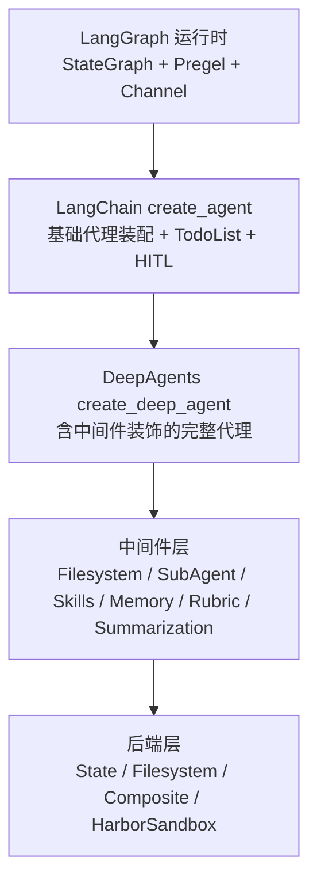
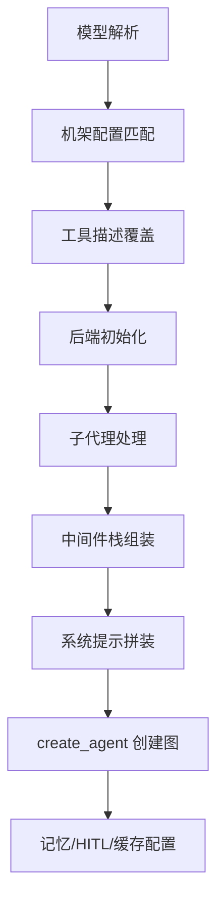
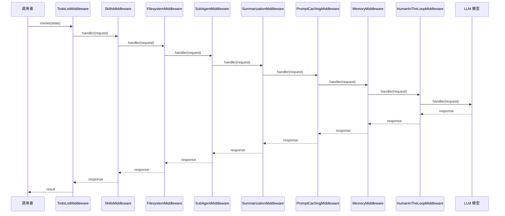
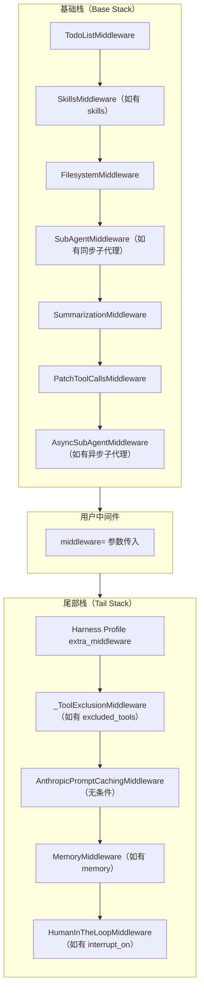
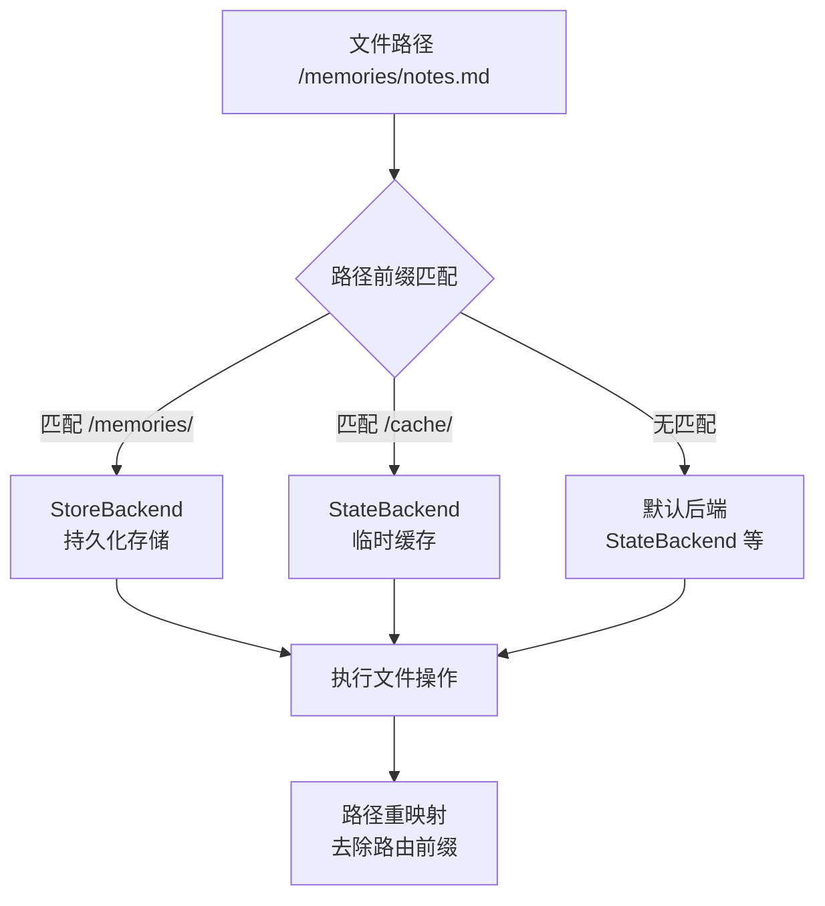
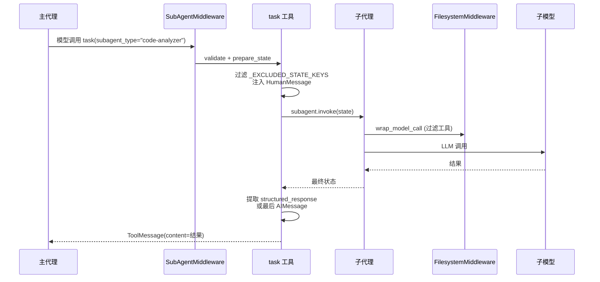
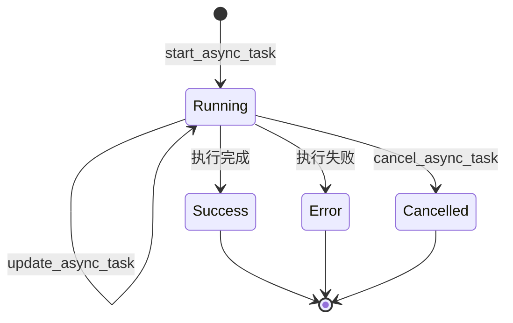
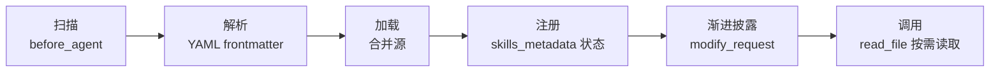

# DeepAgents 核心架构深度分析

> 基于 `deepagents` (v0.5+) 源码的系统性架构萃取

## 1. 项目概览与定位

### 1.1 核心定位

DeepAgents 是基于 LangGraph 的"厚夹具"(opinionated agent harness)。它在 LangGraph 运行时之上封装了一套完整的代理基础设施——中间件系统、后端抽象、子代理委派、技能渐进披露、人机协作审批——让开发者无需从零拼装即可构建具备文件系统交互、复杂任务拆解和自我迭代能力的通用代理。



从代码层面看，DeepAgents 对 LangChain `create_agent` 的装饰关系可直接在 [graph.py](file://libs/deepagents/deepagents/graph.py) 中观察到——`create_deep_agent` 在完成所有中间件和后端装配后，最终调用 `create_agent(model, system_prompt=..., tools=..., middleware=deepagent_middleware, ...)` 来生成底层图。

### 1.2 六大核心设计原则

1. **可替换性 (Replaceability)**：所有关键组件——模型、后端、中间件、工具——均可通过配置替换。`create_deep_agent` 的 `backend`、`tools`、`subagents` 等参数全部支持显式传入。

2. **安全在工具层 (Security at Tool Layer)**：`FilesystemMiddleware` 在工具调用前进行权限检查，后端层面的直接访问不纳入权限体系。`FilesystemPermission` 规则按声明顺序求值，首个匹配规则决定允许/拒绝。

3. **无侵入扩展 (Non-invasive Extension)**：通过 `AgentMiddleware` 的 `wrap_model_call`、`wrap_tool_call`、`before_agent`、`modify_request` 等钩子扩展行为，核心图结构无需修改。

4. **模型无关 (Model-agnostic)**：通过 `resolve_model` 将 `"provider:model"` 字符串或 `BaseChatModel` 实例解析为统一类型。`AnthropicPromptCachingMiddleware` 通过 `unsupported_model_behavior="ignore"` 安全地在非 Anthropic 模型上静默跳过。

5. **异步优先 (Async-first)**：所有中间件钩子和后端方法同时提供同步和异步实现（`wrap_model_call` / `awrap_model_call`），后端层通过 `asyncio.to_thread` 提供默认异步包装。

6. **DeltaChannel 优化**：`DeepAgentState` 使用 `DeltaChannel(_messages_delta_reducer, snapshot_frequency=50)` 作为消息的 Channel 类型，将检查点增长从 O(N²) 降为 O(N)。每 50 个 Pregel 步骤生成一次完整快照。

### 1.3 Monorepo 包结构

```
libs/
├── deepagents/          # SDK 核心：create_deep_agent、中间件、后端、子代理、技能
│   ├── backends/        # 后端协议及实现 (State/Filesystem/Composite/Sandbox)
│   ├── middleware/      # 八大中间件体系
│   └── profiles/        # HarnessProfile 和 ProviderProfile 预置配置
├── cli/                 # 部署 CLI：init/dev/deploy 命令
├── code/                # 终端 TUI（dcode）：基于 Textual 的交互式 REPL
├── acp/                 # Agent Client Protocol 集成服务器
├── evals/               # 评估框架与 Harbor 沙箱
└── partners/            # 合作伙伴扩展（Daytona、Runloop、Codex 等）
```

## 2. 核心入口：create_deep_agent

### 2.1 装配流程

`create_deep_agent` 的装配流程在 [graph.py](file://libs/deepagents/deepagents/graph.py) 中完整呈现，遵循以下严谨顺序：



**1. 模型解析** (`resolve_model`)：将 `str | BaseChatModel | None` 统一解析。`None` 回退为 `ChatAnthropic(model_name="claude-sonnet-4-6")`（已标记 deprecated）。字符串格式为 `"provider:model"`。

**2. 机架配置匹配** (`_harness_profile_for_model`)：根据模型类型匹配预注册的 `HarnessProfile`，决定工具描述覆盖、系统提示后缀和无中间件排除列表。

**3. 工具描述覆盖** (`_apply_tool_description_overrides`)：将机架配置中的自定义描述注入到工具中，支持 `{placeholder}` 占位符动态替换。

**4. 后端初始化**：默认 `StateBackend()`，支持实例或工厂函数传入。

**5. 子代理处理**：三种形态的三叉路由——`SubAgent`（声明式）被填充默认值并预编译中间件栈；`CompiledSubAgent` 直接使用；`AsyncSubAgent` 按 `graph_id` 字段识别后分组处理。自动添加 `general-purpose` 默认子代理（除非 HarnessProfile 显式禁用）。

**6. 中间件栈组装**：严格的基础栈→用户中间件→尾部栈顺序（详见第 3 章）。

**7. 系统提示拼装**：`USER → (BASE 或 CUSTOM) → SUFFIX` 三明治结构。`USER` 为调用者 `system_prompt`；`BASE` 为 `BASE_AGENT_PROMPT`（118 行深度代理行为指引）；`CUSTOM` 仅在 `HarnessProfile` 有 `base_system_prompt` 时替换；`SUFFIX` 为模型调优内容。

**8. 创建图**：最终委托给 `create_agent`，传入 `DeepAgentState`（若无自定义 `state_schema`）和 `SubagentTransformer`。

**9. 记忆/HITL/缓存**：通过尾部中间件注入。

### 2.2 输入参数体系

| 参数 | 类型 | 默认 | 用途 |
|------|------|------|------|
| `model` | `str | BaseChatModel | None` | `None`→claude-sonnet-4-6 | 主模型 |
| `tools` | `Sequence[BaseTool | Callable | dict] | None` | `None` | 附加工具（与内置合并） |
| `system_prompt` | `str | SystemMessage | None` | `None` | 用户自定义系统指令 |
| `middleware` | `Sequence[AgentMiddleware]` | `()` | 用户自定义中间件 |
| `subagents` | `Sequence[SubAgent | CompiledSubAgent | AsyncSubAgent] | None` | `None` | 子代理规范 |
| `skills` | `list[str] | None` | `None` | 技能源路径列表 |
| `memory` | `list[str] | None` | `None` | AGENTS.md 路径列表 |
| `permissions` | `list[FilesystemPermission] | None` | `None` | 文件系统权限规则 |
| `backend` | `BackendProtocol | BackendFactory | None` | `StateBackend()` | 文件存储后端 |
| `interrupt_on` | `dict[str, bool | InterruptOnConfig] | None` | `None` | HITL 中断配置 |
| `response_format` | `ResponseFormat | type | dict | None` | `None` | 结构化输出格式 |
| `state_schema` | `type[DeepAgentState] | None` | `None` | 自定义状态 Schema |
| `checkpointer` | `Checkpointer | None` | `None` | 检查点持久化 |
| `store` | `BaseStore | None` | `None` | 持久化存储（StoreBackend 使用） |
| `debug` | `bool` | `False` | 调试模式 |
| `name` | `str | None` | `None` | 代理名称 |
| `cache` | `BaseCache | None` | `None` | 图执行缓存 |

### 2.3 关键代码示例

```python
from deepagents import create_deep_agent
from deepagents.backends import CompositeBackend, StateBackend, StoreBackend
from deepagents.middleware.filesystem import FilesystemPermission
from langchain_anthropic import ChatAnthropic

agent = create_deep_agent(
    model=ChatAnthropic(model_name="claude-sonnet-4-6"),
    system_prompt="你是一个代码审查专家。",
    skills=["/skills/project/", "/skills/user/"],
    memory=["/memory/AGENTS.md"],
    permissions=[
        FilesystemPermission(
            operations=["read", "write"],
            paths=["/workspace/**"],
            mode="allow",
        ),
        FilesystemPermission(
            operations=["write"],
            paths=["/etc/**"],
            mode="deny",
        ),
    ],
    backend=CompositeBackend(
        default=StateBackend(),
        routes={"/memories/": StoreBackend()},
    ),
    interrupt_on={"edit_file": True},
)
```

## 3. 中间件系统

### 3.1 AgentMiddleware 基类与生命周期钩子

DeepAgents 的中间件遵循 LangChain 的 `AgentMiddleware` 抽象，提供四个核心钩子：

| 钩子 | 签名 | 调用时机 | 典型用途 |
|------|------|----------|----------|
| `before_agent` | `(state, runtime, config) -> StateUpdate | None` | 代理首次调用前 | 技能加载、文件初始化 |
| `modify_request` | `(request) -> request` | 每次模型调用前 | 系统提示注入 |
| `wrap_model_call` | `(request, handler) -> response` | 模型调用包装 | 工具过滤、消息驱逐 |
| `after_agent` | `(state, runtime, config) -> StateUpdate | None` | 代理完成后 | 清理、日志 |
| `wrap_tool_call` | `(request, handler) -> result` | 工具调用包装 | 大结果离线存储 |

### 3.2 中间件洋葱模型

中间件栈以**洋葱模型**组织：最外层中间件先处理请求（首次组装系统提示、加载技能），调用 `handler(request)` 后传递到内层；最内层的模型调用完成后，响应沿反向路径返回。



### 3.3 八大核心中间件详解

#### 3.3.1 TodoListMiddleware

由 LangChain 原生提供。注入 `write_todos` 工具，支持 `pending` → `in_progress` → `completed` 状态流转。`DeepAgentState` 包含专用的 `todos` 字段跟踪任务进度。系统提示引导模型在复杂多步任务中主动维护待办列表。

#### 3.3.2 FilesystemMiddleware

文件系统中间件的实现在 [filesystem.py](file://libs/deepagents/deepagents/middleware/filesystem.py) 中，是最复杂的中间件之一。提供六个核心工具：

| 工具 | 操作类型 | 功能 |
|------|----------|------|
| `ls` | `read` | 列出目录内容 |
| `read_file` | `read` | 读取文件（含分页 offset/limit） |
| `glob` | `read` | Glob 模式匹配文件 |
| `grep` | `read` | 文本内容搜索 |
| `write_file` | `write` | 创建新文件 |
| `edit_file` | `write` | 精确字符串替换编辑 |
| `execute` | — | 沙箱命令执行（需 SandboxBackendProtocol） |

**动态权限过滤**：每次工具调用前通过 `_check_fs_permission` 评估 `FilesystemPermission` 规则链，支持 wcmatch glob 模式匹配。权限支持 `allow` / `deny` 模式，首个匹配生效。

**大结果离线存储**：当工具调用结果 Token 数超过 `tool_token_limit_before_evict`（默认 20000），自动写入后端 `/large_tool_results/<tool_call_id>`，替换为截断预览和文件引用。排除 `ls` / `glob` / `grep` / `read_file` 等自带截断的工具。

**HumanMessage 驱逐**：当 HumanMessage 超过 `human_message_token_limit_before_evict`（默认 50000），写入 `/conversation_history/<uuid>.md`，消息被标记并在后续请求中替换为预览。

**Execute 工具动态显隐**：在 `wrap_model_call` 中检测后端是否实现 `SandboxBackendProtocol`，若不支持则从工具列表中过滤 `execute`。

#### 3.3.3 SkillsMiddleware

技能中间件实现了 Anthropic 的 Agent Skills 渐进披露模式（[skills.py](file://libs/deepagents/deepagents/middleware/skills.py)）。

**加载流程**：`before_agent` 钩子中扫描配置的 `sources` 路径，通过后端 `ls` 发现子目录 → `download_files` 批量下载 `SKILL.md` → 解析 YAML frontmatter → 存入 `skills_metadata` 状态。技能在源间以"后覆盖前"策略合并。

**渐进披露**：`modify_request` 钩子在系统提示中注入技能名称、描述和文件路径，模型按需通过 `read_file` 读取完整 `SKILL.md`。

**SKILL.md 格式**：
```markdown
---
name: web-research
description: 互联网结构化研究方法论
license: MIT
---

# Web Research Skill

## 何时使用
- 用户要求研究某个主题
...
```

**多源合并**：支持路径或 `(path, label)` 元组。标签自动派生或在冲突时显式指定。路径使用 POSIX 约定（`PurePosixPath`），跨平台兼容。

#### 3.3.4 SubAgentMiddleware

同步子代理中间件，负责 `task` 工具的生命周期管理（详见第 5 章）。核心实现见 [subagents.py](file://libs/deepagents/deepagents/middleware/subagents.py)。

**注入机制**：`wrap_model_call` 中通过 `append_to_system_message` 将 `TASK_SYSTEM_PROMPT` 注入系统提示，告知模型何时以及如何使用 `task` 工具。

**状态过滤**：子代理接收经过 `_EXCLUDED_STATE_KEYS` 过滤的父代理状态（排除 `messages`、`todos`、`structured_response`、`skills_metadata` 等无意义继承的字段）。

**结果提取**：优先读取 `structured_response` → JSON 序列化返回；否则反向遍历消息列表找最后一个非空 `AIMessage`。

#### 3.3.5 AsyncSubAgentMiddleware

异步远程子代理中间件（[async_subagents.py](file://libs/deepagents/deepagents/middleware/async_subagents.py)），提供五个工具：

| 工具 | 功能 |
|------|------|
| `start_async_task` | 启动远程后台任务，立即返回 task_id |
| `check_async_task` | 检查任务状态，完成时返回结果 |
| `update_async_task` | 向运行中任务发送更新指令 |
| `cancel_async_task` | 取消运行中任务 |
| `list_async_tasks` | 列出所有已追踪任务及实时状态 |

任务状态通过 `AsyncTask` TypedDict 持久化在 `async_tasks` 状态字段中，使用 `_tasks_reducer` 合并更新。客户端通过 `_ClientCache` 按 `(url, headers)` 键缓存 LangGraph SDK 客户端。

#### 3.3.6 SummarizationMiddleware

上下文摘要中间件，通过 `create_summarization_middleware` 工厂函数创建，同时为同步和异步路径提供。在对话历史超出模型上下文窗口时自动生成摘要替换历史消息，降低 Token 消耗。

#### 3.3.7 MemoryMiddleware

持久化记忆中间件，在代理启动时从后端读取 `AGENTS.md` 文件，注入系统提示。支持多源级联。HTML 注释在注入前被剥离。可选的 `add_cache_control` 参数为 Anthropic 模型添加缓存断点。

#### 3.3.8 RubricMiddleware

自评迭代中间件。允许调用者声明验收标准（rubric），代理每次产出无工具调用的响应时，触发独立的 grader 子代理对转录文本进行评估。

**三个终局裁决**：
- `satisfied`：所有标准通过，正常终止
- `needs_revision`：至少一条标准未通过，注入 `HumanMessage` 反馈并继续迭代
- `failed`：评价标准本身不可评估

支持 `max_iterations` 上限（硬上限为 20），防止无限迭代。

### 3.4 中间件装配顺序与排除策略

最终装配顺序如下（[graph.py](file://libs/deepagents/deepagents/graph.py) 中 `create_deep_agent` 的实现）：



**排除策略**：通过 `HarnessProfile.excluded_middleware` 可排除特定中间件。按类型或名称（`AgentMiddleware.name`）匹配。但 `FilesystemMiddleware` 和 `SubAgentMiddleware` 属于受保护的脚手架，不可排除（强制 `ValueError`）。

### 3.5 自定义中间件示例

```python
from langchain.agents.middleware.types import (
    AgentMiddleware, ModelRequest, ModelResponse
)
from collections.abc import Callable

class LoggingMiddleware(AgentMiddleware):
    """每次模型调用前记录消息数量。"""

    def wrap_model_call(
        self,
        request: ModelRequest,
        handler: Callable,
    ) -> ModelResponse:
        msg_count = len(request.messages) if request.messages else 0
        print(f"[LoggingMiddleware] 消息数: {msg_count}")
        return handler(request)

agent = create_deep_agent(
    model="anthropic:claude-sonnet-4-6",
    middleware=[LoggingMiddleware()],
)
```

## 4. 后端系统

### 4.1 BackendProtocol 协议抽象

后端系统基于 Python Protocol 模式，`BackendProtocol` 定义了文件操作的统一接口：

```python
class BackendProtocol(abc.ABC):
    def ls(self, path: str) -> LsResult: ...
    def read(self, file_path: str, offset: int, limit: int) -> ReadResult: ...
    def grep(self, pattern: str, path: str, glob: str) -> GrepResult: ...
    def glob(self, pattern: str, path: str) -> GlobResult: ...
    def write(self, file_path: str, content: str) -> WriteResult: ...
    def edit(self, file_path: str, old_string: str, new_string: str, replace_all: bool) -> EditResult: ...
    def upload_files(self, files: list) -> list[FileUploadResponse]: ...
    def download_files(self, paths: list) -> list[FileDownloadResponse]: ...
```

所有方法均有对应的异步版本（`als`、`aread` 等），默认通过 `asyncio.to_thread` 包装同步实现。

**SandboxBackendProtocol** 在此基础上扩展：

```python
class SandboxBackendProtocol(BackendProtocol):
    @property
    def id(self) -> str: ...
    def execute(self, command: str, *, timeout: int | None) -> ExecuteResponse: ...
```

### 4.2 四种后端实现

| 后端 | 存储位置 | 执行支持 | 适用场景 |
|------|----------|----------|----------|
| **StateBackend** | 纯内存键值存储 | 否 | 单次会话临时文件 |
| **FilesystemBackend** | 宿主机文件系统 | 是（可选） | 本地开发 |
| **CompositeBackend** | 按路径路由多后端 | 取决于默认后端 | 混合存储策略 |
| **HarborSandbox** | 容器化沙箱 | 是 | 安全隔离执行 |
| **StoreBackend** | LangGraph Store | 否 | 跨会话持久化 |
| **ContextHubBackend** | Context Hub | 否 | 部署态上下文注入 |

### 4.3 CompositeBackend 路由机制

`CompositeBackend` 按路径前缀将文件操作路由到不同子后端：



核心路由算法在 `_route_for_path` 函数中实现——按路径长度降序排列的路由前缀表，最长匹配优先。路径重映射确保子后端始终接收以 `/` 开头的规范化路径。

```python
from deepagents.backends import CompositeBackend, StateBackend, StoreBackend

composite = CompositeBackend(
    default=StateBackend(),
    routes={
        "/memories/": StoreBackend(),
        "/cache/": StateBackend(),
    },
)
result = composite.grep("TODO", path="/memories/")
```

### 4.4 安全机制

- **虚拟路径**：所有后端路径必须以 `/` 开头，拒绝相对路径和包含 `..` 的路径
- **符号链接检测**：`FilesystemBackend` 在写入时使用 `O_NOFOLLOW` 标志防止符号链接遍历
- **文件大小限制**：`MAX_SKILL_FILE_SIZE = 10MB` 防止 DoS 攻击
- **路径校验**：`validate_path` 统一校验所有工具调用的路径参数
- **Execute 超时**：`max_execute_timeout` 限制单次命令最长执行时间（默认 3600 秒）

## 5. 子代理系统

### 5.1 三大子代理类型

| 类型 | 运行方式 | 通信方式 | 适用场景 |
|------|----------|----------|----------|
| **SubAgent** | 同进程 `invoke` | 同步阻塞 | 短任务强隔离、单文件分析 |
| **CompiledSubAgent** | 复用预编译图 | 同步 `invoke` | 高频复用、成本优化 |
| **AsyncSubAgent** | 跨进程/服务器 | LangGraph SDK（Agent Protocol） | 长时运行、多服务并行 |

#### SubAgent（声明式同步）

```python
from deepagents import SubAgent

analyzer: SubAgent = {
    "name": "code-analyzer",
    "description": "分析单个源文件的代码质量",
    "system_prompt": "你是代码质量分析师。分析提供的文件并报告问题。",
    "model": "openai:gpt-5.5",
    "tools": [],
    "permissions": [
        {"operations": ["read"], "paths": ["/workspace/**"], "mode": "allow"},
    ],
}
```

#### CompiledSubAgent（预编译）

```python
from deepagents import CompiledSubAgent
from pydantic import BaseModel

class Findings(BaseModel):
    summary: str
    confidence: float

researcher: CompiledSubAgent = {
    "name": "researcher",
    "description": "研究主题并返回结构化发现",
    "runnable": create_agent("openai:gpt-5.5", response_format=Findings),
}
```

#### AsyncSubAgent（异步远程）

```python
from deepagents import AsyncSubAgent

remote_researcher: AsyncSubAgent = {
    "name": "remote-researcher",
    "description": "远程深度研究代理",
    "graph_id": "research_agent",
    "url": "https://my-deployment.langsmith.dev",
}
```

### 5.2 同步子代理序列图



### 5.3 异步子代理状态机



异步子代理的五个工具与 `AsyncTask` 状态同步运行。`check_async_task` 内部区分：`success` 状态附加从最新 messages 中提取的结果；`error` 状态附加错误详情。`list_async_tasks` 通过 LangGraph SDK 实时查询所有非终端任务的当前状态（`_fetch_live_status`），终端状态的任务跳过服务器查询。

### 5.4 SubagentTransformer 流事件转换

`SubagentTransformer` 将原始 Pregel `tasks` 事件转换为有语义的 `SubagentRunStream` / `AsyncSubagentRunStream`：

1. 父作用域：监听 `tasks` 开始事件，若 `name == "tools"` 且 input 包含 `task` 工具调用，记录 `parent_task_id → (subagent_type, tool_call_id)` 映射
2. 子作用域：检测到 `"tools:<id>"` 段，查映射表。若匹配已声明子代理名，构建带 `graph_name`（子代理类型）和 `trigger_call_id`（用户可见工具调用 ID）的流句柄

### 5.5 默认通用子代理

当未提供名为 `general-purpose` 的子代理且 HarnessProfile 未禁用它时，系统自动注入一个与主代理具有相同能力的通用子代理（`GENERAL_PURPOSE_SUBAGENT`），带有独立的中间件栈（包含 TodoList、Filesystem、Summarization、PatchToolCalls、Skills、Harness 扩展中间件、ToolExclusion）。

## 6. 技能(Skills)系统

### 6.1 SKILL.md 规范

基于 [Agent Skills](https://agentskills.io/specification) 开放标准：

| 字段 | 必填 | 约束 |
|------|------|------|
| `name` | 是 | 1-64 字符，Unicode 小写字母数字+连字符 |
| `description` | 是 | 1-1024 字符 |
| `license` | 否 | 许可名称 |
| `compatibility` | 否 | 1-500 字符 |
| `metadata` | 否 | 任意 `dict[str, str]` |
| `allowed-tools` | 否 | 空格分隔的工具名列表（实验性） |

### 6.2 技能生命周期



**扫描**：`before_agent` 钩子中，若 `skills_metadata` 尚未在状态中，遍历 `sources` 路径，通过后端 `ls` 列出所有子目录，再通过 `download_files` 批量下载 `SKILL.md` 文件。

**多源合并**：技能在源间以 dict 合并（后覆盖前）。同一技能名在不同源中的优先级由源顺序决定（最后的源优先级最高）。

**技能与子代理的协作**：子代理可通过其 `skills` 字段独立指定技能源集。通过 `PrivateStateAttr` 标注，`skills_metadata` 不会从父代理向子代理泄露。每个子代理通过自己的 `SkillsMiddleware` 实例独立加载技能。

### 6.3 关键代码示例

```python
from deepagents import create_deep_agent, SkillsMiddleware
from deepagents.backends import FilesystemBackend

backend = FilesystemBackend(root_dir="/home/project")

agent = create_deep_agent(
    model="anthropic:claude-sonnet-4-6",
    skills=[
        "/skills/base/",
        "/skills/project/",
    ],
    subagents=[{
        "name": "specialist",
        "description": "领域专家",
        "system_prompt": "你是一个领域专家。",
        "model": "openai:gpt-5.5",
        "tools": [],
        "skills": ["/skills/domain/"],  # 子代理专属技能
    }],
)
```

## 7. CLI 部署工具

### 7.1 三大核心命令

| 命令 | 功能 | 输出 |
|------|------|------|
| `deepagents init` | 初始化项目模板 | `deepagents.toml`、`AGENTS.md`、`skills/`、`mcp.json` |
| `deepagents dev` | 本地开发服务器 | LangGraph dev 服务器 |
| `deepagents deploy` | 部署到 LangSmith 平台 | 部署 URL |

### 7.2 TUI 终端应用 (dcode)

TUI 已从 `deepagents-cli` 独立为 `deepagents-code` 包，基于 Textual 框架构建。特性包括：

- **交互/非交互模式**：交互模式提供 TUI 聊天气泡、工具调用卡片、待办面板、文件面板；非交互模式用于管道/脚本集成
- **会话管理**：线程选择器、历史文件浏览
- **MCP 集成**：MCP 服务器连接/认证/工具查看
- **沙箱支持**：通过 `sandbox_factory` 集成 Daytona、LangSmith、Modal、Runloop 等沙箱提供方
- **ACP 模式**：Agent Client Protocol 互操作

### 7.3 配置示例 (deepagents.toml)

```toml
[agent]
name = "my-coding-agent"
description = "A coding assistant"
model = "anthropic:claude-sonnet-4-6"

[sandbox]
provider = "daytona"
scope = "thread"
```

项目的 `skills/` 目录和 `mcp.json` 自动检测。`AGENTS.md` 自动种子化到 `/memories/` 只读命名空间。

### 7.4 支持的沙箱与认证提供方

| 沙箱提供方 | 标识符 | 说明 |
|------------|--------|------|
| 本地执行 | `none` | 基于 `StateBackend`，非隔离 |
| Daytona | `daytona` | 容器化沙箱 |
| LangSmith | `langsmith` | 平台级沙箱 |
| Modal | `modal` | 无服务器容器 |
| Runloop | `runloop` | 远程执行环境 |

认证提供方：`supabase`、`clerk`、`anonymous`（用于开发/演示）。

## 8. ACP 协议集成

### 8.1 AgentServerACP 核心接口

`AgentServerACP` 实现了 [Agent Client Protocol](https://github.com/langchain-ai/agent-protocol) 规范，作为 Deep Agents 与任何兼容 ACP 的客户端之间的桥梁。

| 接口 | 功能 |
|------|------|
| `initialize` | 握手协商客户端/代理能力 |
| `new_session` | 创建新会话（线程） |
| `set_session_mode` | 设置会话模式（architect / agent） |
| `set_config_option` | 实时配置（模型选择等） |
| `prompt` | 接收用户输入并流式返回代理响应 |
| `cancel` | 取消运行中执行 |

### 8.2 人机协作 (HITL) 审批机制

ACP 模式下，工具调用审批通过以下流程实现：
1. 代理生成待审批的工具调用
2. 服务器检查 `command_allowlist` 和 `dangerous_patterns`
3. 通过 ACP 的 `start_tool_call` / `update_tool_call` 通知客户端
4. 客户端审批/拒绝后服务器继续执行

### 8.3 多模态内容块支持

`AgentServerACP.utils` 模块提供了内容块转换器，支持 `Text`、`Image`、`Audio`、`Resource`、`EmbeddedResource` 块类型向 LangChain 内容块的转换。

### 8.4 流式工具调用处理

工具调用通过 `start_tool_call` → `update_tool_call(start_edit)` → `tool_content` → `tool_diff_content` 序列在流中渐进呈现，允许客户端实时展示工具执行进度和后编辑内容。

## 9. 适用场景与局限性

### 9.1 适合场景

| 场景 | 原因 |
|------|------|
| 开箱即用的通用代理 | 完整内置工具集、中间件和后端，无需从零装配 |
| 文件系统交互密集型任务 | `FilesystemMiddleware` 提供六种文件操作 + 权限控制 + 大结果离线 |
| 需要子代理委派的复杂任务 | 三种子代理类型覆盖同步/异步/预编译场景 |
| 需要安全沙箱的执行环境 | HarborSandbox 提供容器化隔离 |
| 多后端混合存储 | CompositeBackend 按路径前缀路由 |
| 人机协作审批场景 | HITL 中间件 + ACP 审批流 |

### 9.2 局限性

| 局限 | 说明 |
|------|------|
| 依赖 LangChain 生态版本锁 | 紧耦合 `create_agent`、ToolRuntime 等接口，版本升级成本高 |
| 中间件装配复杂度高 | 全栈涉及 ~15 个中间件实例，自定义化需要深入中间件生命周期 |
| 不适合轻量级单次 LLM 调用 | 中间件开销对 `invoke("你好")` 类场景过于沉重 |
| 后端安全依赖于工具层 | 权限仅在 `FilesystemMiddleware` 工具层实施，直接后端访问不纳入权限体系 |
| Execute 工具与权限系统未整合 | 工具级权限对 `execute` 工具尚不支持 |
| Python-only 生态 | 核心 SDK 仅 Python，多语言调用需通过 ACP 协议 |
