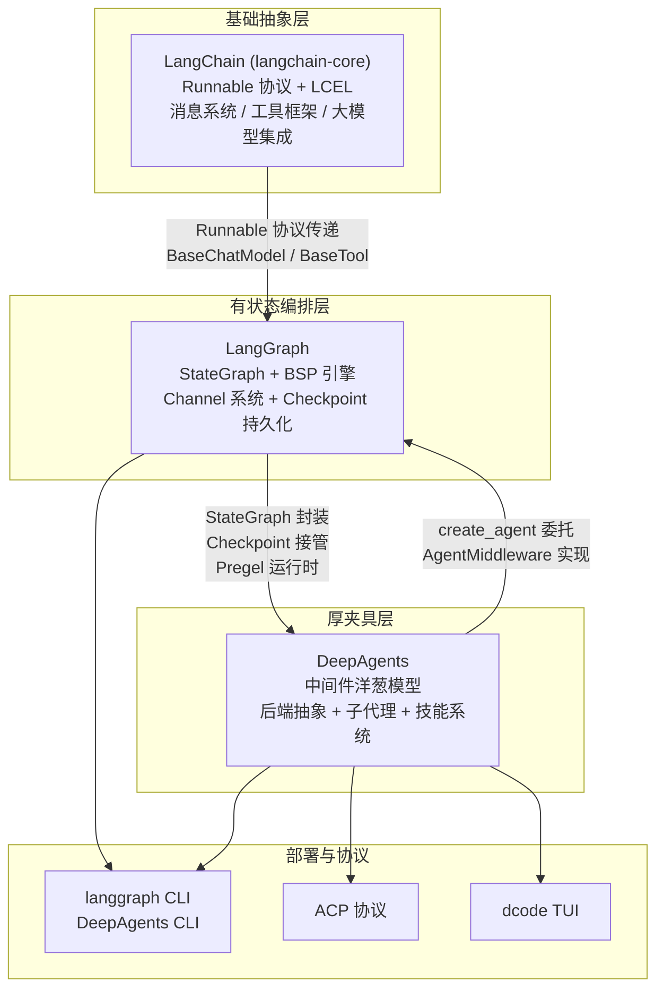
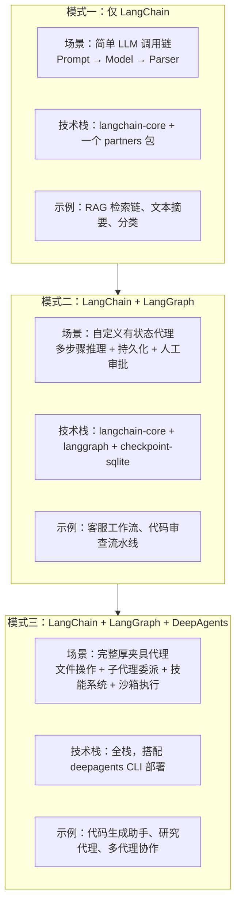
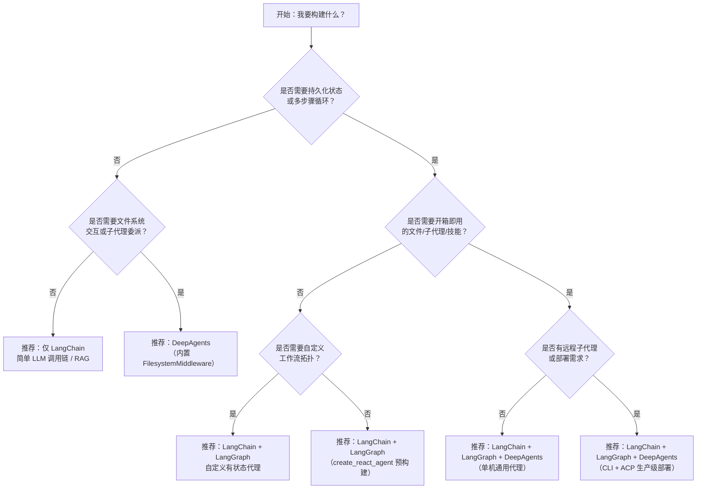

# 三库横向对比与技术关联分析

> 基于 LangChain、LangGraph、DeepAgents 三篇核心架构分析文档的对比整理

## 1. 三库技术继承关系

### 1.1 依赖拓扑图

### 1.2 关键继承点说明

**Runnable 协议传递**

LangChain 定义的 `Runnable[Input, Output]` 协议是所有上层抽象的基石。LangGraph 的 `CompiledStateGraph` 继承自 `Pregel`，而 `Pregel` 直接继承自 `Runnable`——这意味着一个编译后的图可以像普通 Runnable 一样被 `invoke`/`stream`/`batch` 调用，也可以被嵌入到另一个图中作为子图节点。DeepAgents 的 `create_deep_agent` 内部最终调用 `create_agent` 生成图，该图同样是 Runnable 的实例。

**StateGraph 封装**

LangGraph 提供的 `StateGraph` 构建器和 `compile()` 编译机制是 DeepAgents 的运行时基础。DeepAgents 在 LangGraph 的有状态图之上构建了中间件系统、后端抽象和子代理委派，将"需要开发者手动拼装的图"变成了"通过配置即可获得的代理"。

**中间件增强**

LangGraph 本身没有 first-class 中间件概念（自定义逻辑需要操作 Channel 或 `ManagedValue`）。DeepAgents 通过 LangChain 的 `AgentMiddleware` 抽象，在 `create_agent` 的基础之上注入了完整的中间件栈（洋葱模型），实现了代理行为的无侵入扩展。

### 1.3 各库在生态中的作用定位

| 库 | 定位 | 核心贡献 |
|---|---|---|
| **LangChain** | LLM 应用基础抽象层 | Runnable 协议统一一切组件；LCEL 声明式编排；消息/工具/提示词/大模型标准接口 |
| **LangGraph** | 有状态图执行引擎 | BSP 循环模型；Channel 系统；Checkpoint 不可变日志；Send API 跨图路由 |
| **DeepAgents** | 开箱即用的厚夹具代理 | 中间件洋葱模型；八大内置中间件；后端抽象 + CompositeBackend；子代理委派体系；技能渐进披露 |

---

## 2. 八大维度结构化对比表

### 2.1 核心设计理念与定位

| 维度 | LangChain | LangGraph | DeepAgents |
|------|-----------|-----------|------------|
| **核心理念** | Runnable 统一接口 + LCEL 声明式编排 | BSP 模型 + Channel 抽象 + 有状态图执行 | 厚夹具 + 中间件洋葱 + 电池已内置 |
| **目标用户** | 需要 LLM 统一抽象的开发者 | 需要自定义有状态工作流/代理的开发者 | 需要开箱即用通用代理的开发者 |
| **抽象层级** | 基础组件层（Prompt/Model/Tool/Parser） | 图编排层（StateGraph/Channel/Checkpoint） | 代理应用层（Middleware/Backend/SubAgent） |
| **设计哲学** | 接口优先：定义标准让 Provider 实现 | 图优先：一切以有向图 + Channel 表达 | 配置优先：通过参数 + 中间件装配获得完整代理 |
| **状态性** | 无状态（Stateless） | 有状态，每个 Channel 独立生命周期 | 继承 LangGraph 的有状态性 |
| **可组合性** | `|` 管道操作符 + RunnableParallel 并发 | 子图嵌套 + `Send` API 跨图路由 | 中间件栈可插拔 + 子代理三叉路由 |

### 2.2 状态管理机制

| 维度 | LangChain | LangGraph | DeepAgents |
|------|-----------|-----------|------------|
| **内置持久化** | ❌ 无 | ✅ Checkpoint 不可变日志 | ✅ 继承 LangGraph Checkpoint |
| **状态结构** | 无内置 Schema（由调用方维护） | `TypedDict`/`BaseModel` 定义的 `StateT` | `DeepAgentState`（预定义字段：messages/todos/structured_response 等） |
| **Channel 机制** | 无 | 9 种 Channel（LastValue/BinaryOperatorAggregate/NamedBarrierValue/Topic/DeltaChannel 等） | 继承 LangGraph Channel，使用 `DeltaChannel` 优化消息通道 |
| **检查点后端** | 无 | MemorySaver / SqliteSaver / PostgresSaver | 通过 `checkpointer` 参数透传 LangGraph 检查点 |
| **状态恢复** | 不适用 | Fork + 时间旅行 + `get_state_history()` | 继承 LangGraph 的中断-恢复机制 |
| **增量优化** | 无 | `DeltaChannel`（仅保存哨兵，回放祖先写入） | `DeltaChannel(_messages_delta_reducer, snapshot_frequency=50)`，检查点增长从 O(N²) 降为 O(N) |
| **动态计算值** | 无 | `ManagedValue`（如 `IsLastStep`） | 继承 LangGraph ManagedValue |

### 2.3 多智能体协作模式

| 维度 | LangChain | LangGraph | DeepAgents |
|------|-----------|-----------|------------|
| **单代理支持** | ✅ `AgentExecutor` + `create_agent`（langchain-v1） | ✅ `create_react_agent` 预构建模式 | ✅ `create_deep_agent` 单入口 |
| **多代理模型** | 无内置支持 | 子图嵌套 + `Send` API 并行扇出 | Supervisor-Worker 模式 + `task` 工具委派 |
| **子代理通信** | 不适用 | 通过 `TASKS` Channel + `Send` 对象推送 | 主代理通过 `task` 工具调用同步/异步子代理，返回 `ToolMessage` |
| **子代理类型** | 不适用 | 编译后的图作为 Runnable 节点嵌入 | 三种：`SubAgent`（同步）、`CompiledSubAgent`（预编译）、`AsyncSubAgent`（远程） |
| **命名空间隔离** | 不适用 | `checkpoint_ns` 嵌套命名空间 | 继承 LangGraph `checkpoint_ns` + 状态过滤 `_EXCLUDED_STATE_KEYS` |
| **结果提取** | 不适用 | 手动从子图输出中提取 | 优先 `structured_response` → 反向扫描最后 `AIMessage` |
| **默认子代理** | 无 | 无 | 自动注入 `general-purpose` 通用子代理（可被 HarnessProfile 禁用） |

### 2.4 工作流编排能力

| 维度 | LangChain | LangGraph | DeepAgents |
|------|-----------|-----------|------------|
| **编排范式** | 线性链式（`|` 管道）+ `RunnableParallel` 并发 | 有向图循环编排 + BSP 并发 | 中间件栈装配（装配决定行为） |
| **条件分支** | `RunnableBranch`（基于条件的路由） | `add_conditional_edges`（任意路径函数） | 通过中间件 `modify_request` 动态注入逻辑 |
| **循环支持** | ❌ 不支持（管道为 DAG） | ✅ 无限制循环 + `recursion_limit` 保护 | ✅ 继承 LangGraph 循环能力 |
| **并行执行** | `RunnableParallel`（并发调用多个分支） | BSP 模型内 Superstep 级并发 + `Send` 扇出 | 继承 LangGraph BSP 并发 |
| **等待边/汇聚** | 无 | `NamedBarrierValue`（所有命名节点完成后触发） | 继承 LangGraph 等待边 |
| **中断/恢复** | 无 | `interrupt()` + `Command(resume=...)` | 继承 + `HumanInTheLoopMiddleware` 自动注入 `interrupt_on` 配置 |
| **Fork/时间旅行** | 无 | `update_state(checkpoint_id=...)` + 重放 | 继承 LangGraph 时间旅行 |
| **自定义流程** | 通过组合 Runnable 构建 | 通过 `add_node`/`add_edge`/`add_conditional_edges` 构建 | 通过中间件 `wrap_model_call`/`before_agent` 等钩子自定义行为 |

### 2.5 工具调用框架

| 维度 | LangChain | LangGraph | DeepAgents |
|------|-----------|-----------|------------|
| **工具定义** | `BaseTool`/`StructuredTool` + `@tool` 装饰器 | 复用 LangChain 工具体系 | 继承 LangChain 工具体系 |
| **工具执行** | `BaseTool.run()` / `arun()`（单工具串行） | `ToolNode` + 并行工具执行 | `FilesystemMiddleware` 包装工具调用 + 权限检查 |
| **工具路由** | 模型决定工具调用，结果手动反馈 | 结果通过 `Send` 路由回 agent 节点 | 中间件层自动处理工具调用→执行→结果流 |
| **内置工具** | 无（按需安装） | 无（通过 `ToolNode` 管理） | 6 种文件工具（ls/read_file/glob/grep/write_file/edit_file）+ execute + todo + task 等 |
| **权限系统** | 无 | 无 | `FilesystemPermission` 规则链（allow/deny，首个匹配生效，wcmatch glob） |
| **大结果处理** | 无 | 无 | `tool_token_limit_before_evict`（默认 20000）自动离线存储大结果 |
| **HumanMessage 驱逐** | 无 | 无 | `human_message_token_limit_before_evict`（默认 50000） |
| **运行时注入** | `InjectedToolArg` / `InjectedToolCallId` | 通过 LangChain 机制 | 继承 LangChain 注入机制 |

### 2.6 大模型集成方案

| 维度 | LangChain | LangGraph | DeepAgents |
|------|-----------|-----------|------------|
| **模型抽象** | `BaseChatModel` 基类 | 无独立模型抽象，依赖 LangChain `BaseChatModel` | `resolve_model` 统一解析 `str | BaseChatModel | None` |
| **Provider 支持** | `partners/*` 包体系（OpenAI/Anthropic/DeepSeek/Ollama 等） | 通过 LangChain Provider | 通过 LangChain Provider + `provider:model` 字符串格式 |
| **结构化输出** | `with_structured_output()`（Provider 原生 + 降级策略） | 通过 LangChain 机制 | `response_format` 参数透传 |
| **模型切换** | 替换 ChatModel 类实例 | 替换节点内的 ChatModel | `resolve_model("provider:model")` → 自动匹配 `HarnessProfile` |
| **模型无关性** | 依赖 Provider 实现完整性 | 无独立机制 | `HarnessProfile` 自动适配模型行为 + `AnthropicPromptCachingMiddleware` 静默跳过非 Anthropic 模型 |
| **运行时切换** | 需手动替换实例 | 需修改节点代码 | `ConfigurableModel` 支持运行时模型切换 |
| **回退/降级** | `with_fallbacks()` 机制 | 无独立机制 | 通过 `HarnessProfile` 配置 |

### 2.7 部署与运维能力

| 维度 | LangChain | LangGraph | DeepAgents |
|------|-----------|-----------|------------|
| **独立部署工具** | ❌（依赖 LangServe / LangSmith Platform） | ✅ `langgraph CLI`（dev/build/deploy） | ✅ `deepagents CLI`（init/dev/deploy） |
| **本地开发服务器** | 无独立工具 | `langgraph dev` | `deepagents dev`（继承 langgraph dev） |
| **Docker 化** | 开发者自行处理 | ✅ 通过 CLI 生成 Dockerfile | ✅ 继承 LangGraph Docker 化 |
| **持久化后端** | 无 | SQLite（单机）/ PostgreSQL（生产） | 继承 + StoreBackend / CompositeBackend |
| **终端界面** | 无 | 无 | ✅ dcode TUI（基于 Textual 的交互式 REPL） |
| **远程协议** | 无 | LangGraph Platform SDK | ✅ ACP（Agent Client Protocol） |
| **沙箱执行** | 无 | 无 | ✅ HarborSandbox / Daytona / Modal / Runloop |
| **多模态内容** | 通过消息 content 列表支持 | 通过 LangChain 机制 | ✅ ACP 多模态内容块转换器（Text/Image/Audio/Resource） |
| **认证支持** | 无 | 无 | ✅ supabase / clerk / anonymous |
| **可观察性** | LangSmith 追踪集成 + `BaseCallbackHandler` | LangSmith + `stream_mode` 多模式流 | 继承 + SubagentTransformer 流事件转换 |

### 2.8 优势与局限性

#### 2.8.1 LangChain

| 优势 | 局限性 |
|------|--------|
| Runnable 协议统一一切，组件可自由组合 | 缺少持久化状态管理，本质无状态 |
| LCEL 声明式编排，`|` 管道直观简洁 | 不适合复杂多步骤自主代理（需 LangGraph） |
| 多 Provider 无缝切换，基于抽象接口编程 | 抽象泄漏：Provider 行为差异仍时有泄漏 |
| 整条链自动支持 streaming | 版本碎片化（core/classic/v1 三版本共存） |
| 生态最丰富（partners 包 + 社区贡献） | 依赖重，不适合资源受限环境 |

#### 2.8.2 LangGraph

| 优势 | 局限性 |
|------|--------|
| BSP 模型提供严谨的并发语义和确定性执行 | 学习曲线陡峭（Channel 类型、版本触发、BSP 语义） |
| Channel 系统 + Checkpoint 提供开箱即用的持久化和审计 | 不提供开箱即用的高级 Agent 模式（需自行实现） |
| 中断-恢复 + Fork + 时间旅行支持 | 无内置中间件系统（需操作 Channel 实现自定义） |
| 子图嵌套 + Send API 支持复杂多智能体 | 调试复杂性高（并发 + 版本触发难追踪） |
| 多存储后端（Memory/SQLite/Postgres） | 检查点存储开销大（DeltaChannel 部分缓解） |

#### 2.8.3 DeepAgents

| 优势 | 局限性 |
|------|--------|
| 开箱即用的完整代理（文件系统/子代理/技能/待办列表） | 依赖 LangChain 生态版本锁，版本升级成本高 |
| 中间件洋葱模型，扩展无需改核心图结构 | 中间件装配复杂度高（全栈约 15 个中间件实例） |
| 三种子代理类型覆盖同步/异步/预编译场景 | 不适合轻量级单次 LLM 调用（中间件开销过大） |
| 后端抽象 + CompositeBackend 混合存储策略 | 后端安全依赖于工具层，直接后端访问不纳入权限 |
| CLI + TUI + ACP 完整的部署和交互工具链 | Execute 工具与权限系统未整合 |
| DeltaChannel 优化将检查点开销降为 O(N) | Python-only，多语言需通过 ACP 协议 |

#### 2.8.4 互补性分析

| 组合 | 解决的问题 |
|------|-----------|
| LangChain + LangGraph | LangChain 提供模型/工具/消息抽象，LangGraph 补充持久化、循环、人工介入 |
| LangGraph + DeepAgents | LangGraph 提供运行时基础，DeepAgents 补充中间件、后端、子代理等开箱能力 |
| 三者全栈 | 完整的"抽象→编排→夹具"三层架构，从基础 LLM 调用到生产级代理全覆盖 |

---

## 3. 互操作性分析

### 3.1 三库组合使用的典型模式

### 3.2 各模式下的技术衔接点

**模式一（仅 LangChain）**

- 衔接点：`BaseChatModel` 抽象 + `@tool` 装饰器 + LCEL 管道
- `RunnableSequence` 将 Prompt → Model → Parser 组织为管道
- 状态管理由调用方自行维护（例如存储在 session 字典中）

**模式二（LangChain + LangGraph）**

- 衔接点：
  - `StateGraph` 接收 `TypedDict` 类型的状态 Schema
  - 节点函数中使用 LangChain 的 `BaseChatModel` 进行 LLM 调用
  - 工具定义复用 `@tool` 装饰器
  - `ToolNode` 管理工具执行，结果通过 `Send` 或边路由回 agent 节点
  - `checkpointer` 参数注入 LangGraph 检查点后端
- 版本兼容性边界：
  - `langgraph` 依赖 `langchain-core >= 0.1`
  - `checkpoint-sqlite` 依赖 `langgraph-checkpoint`
  - `create_react_agent` 在 `langgraph.prebuilt` 包中

**模式三（全栈：LangChain + LangGraph + DeepAgents）**

- 衔接点：
  - `create_deep_agent` 内部调用 `create_agent`（LangGraph）生成底层图
  - 模型通过 `resolve_model("provider:model")` 解析为 `BaseChatModel` 实例
  - 中间件栈在 LangGraph 运行时之上提供行为装饰
  - `checkpointer` 和 `store` 参数透传给底层 LangGraph 图
  - `interrupt_on` 配置通过 `HumanInTheLoopMiddleware` 注入 LangGraph 中断
- 版本兼容性边界：
  - `deepagents` 依赖 `langgraph >= 0.6` 和 `langchain-core`
  - DeltaChannel 方案需要 checkpoint 后端支持 `get_delta_channel_history`（SQLite/Postgres，MemorySaver 不支持）
  - ACP 协议需要 `langgraph SDK` 客户端

### 3.3 版本兼容性边界

| 兼容性边界 | 详情 |
|---|---|
| `langchain-core` 最低版本 | LangGraph 需 `>= 0.1`；DeepAgents 通过 LangGraph 间接依赖 |
| `langgraph` 版本 | DeepAgents 基于 v0.6+，`DeltaChannel` 在 checkpoint-sqlite/postgres 中为 Beta 能力 |
| `langchain-v1` vs `langchain-classic` | DeepAgents 使用 `langchain-v1` 的 `create_agent` 和 `AgentMiddleware`，与 `langchain-classic` 的 `AgentExecutor` 不兼容 |
| `deepagents` 版本 | v0.5+，默认模型已从 `claude-sonnet-4-6` 开始标记 deprecated |
| Checkpoint 格式 | 当前 Checkpoint 格式版本 `v=3`，不保证向前兼容 |

---

## 4. 场景选型决策指南

### 4.1 决策树

### 4.2 按场景类型推荐

| 场景 | 推荐方案 | 理由 |
|------|----------|------|
| **简单 LLM 调用/链式处理** | LangChain | LCEL 管道天然适合 Prompt→Model→Parser 线性流水线，无额外依赖 |
| **RAG 检索增强生成** | LangChain | `BaseRetriever` 抽象 + `RunnableParallel` 并发检索，生态成熟 |
| **自定义多步骤代理/工作流** | LangChain + LangGraph | StateGraph 可表达任意 DAG/cyclic 图，Checkpoint 提供持久化和断点续传 |
| **人机协作审批流程** | LangChain + LangGraph | `interrupt()` + `Command(resume=...)` 原生支持，`get_state_history()` 提供审计 |
| **开箱即用的通用代理** | 全栈（+ DeepAgents） | 内置文件操作、待办列表、上下文摘要，无需从零装配 |
| **文件密集型任务** | 全栈（+ DeepAgents） | `FilesystemMiddleware` 六种文件工具 + 权限控制 + 大结果离线存储 |
| **子代理委派（同步）** | 全栈（+ DeepAgents） | `SubAgent` + `CompiledSubAgent` 声明式配置，隔离中间件栈 |
| **子代理委派（异步/远程）** | 全栈（+ DeepAgents） | `AsyncSubAgent` + LangGraph SDK + ACP 协议 |
| **研究/多代理协作** | 全栈（+ DeepAgents） | `task` 工具 + 默认 `general-purpose` 子代理 + `SkillsMiddleware` 渐进披露 |
| **生产级部署** | 全栈（+ DeepAgents） | `deepagents CLI` + Docker 化 + ACP 协议 + 沙箱执行 |
| **安全沙箱执行** | 全栈（+ DeepAgents） | HarborSandbox + Daytona/Modal/Runloop 容器化隔离 |

---

## 5. 核心差异总结

### 5.1 一句话总结

| 库 | 一句话本质 |
|---|---|
| **LangChain** | LLM 应用组件的"标准库"——定义接口，但不规定如何编排有状态行为 |
| **LangGraph** | 有状态图的"运行时引擎"——在 Runnable 协议之上增加持久化、循环和并发语义 |
| **DeepAgents** | 厚夹具代理的"一键安装包"——把 LangGraph 的能力封装成开箱即用的通用代理 |

### 5.2 选型核心考量因素表

| 考量因素 | 仅 LangChain | + LangGraph | + DeepAgents |
|----------|-------------|-------------|--------------|
| **上手成本** | ⭐ 低 | ⭐⭐⭐ 中高 | ⭐⭐ 中 |
| **定制灵活性** | ⭐⭐⭐ 高（底层抽象） | ⭐⭐⭐ 高（图级控制） | ⭐⭐ 中（中间件级控制） |
| **持久化能力** | ❌ | ✅ 完整 | ✅ 继承 + 优化 |
| **文件系统交互** | ❌ | ❌ | ✅ 六工具 + 权限 |
| **子代理支持** | ❌ | ⭐⭐ 手写子图 | ✅ 声明式配置 |
| **部署工具** | ❌ | ✅ CLI | ✅ CLI + TUI + ACP |
| **依赖体积** | 最小 | 中等 | 最大 |
| **生态成熟度** | 最高（最广泛使用） | 高（快速成长） | 中（较新，迭代快） |
| **适合团队规模** | 个人/小团队 | 小中团队 | 中大型团队 |
| **生产就绪度** | 取决于部署方案 | ✅（SQLite/Postgres） | ✅（CLI + 沙箱 + ACP） |

---

> **参考资料**：本文档基于以下三篇核心分析文档的对比整理：
>
> - [LangChain 核心架构深度分析](01-langchain-core-analysis.md)
> - [LangGraph 核心架构深度分析](02-langgraph-core-analysis.md)
> - [DeepAgents 核心架构深度分析](03-deepagents-core-analysis.md)
