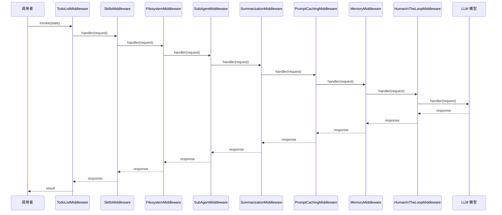
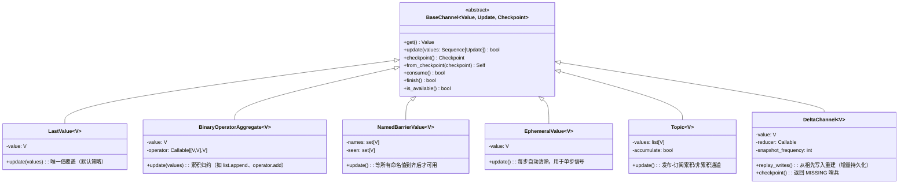
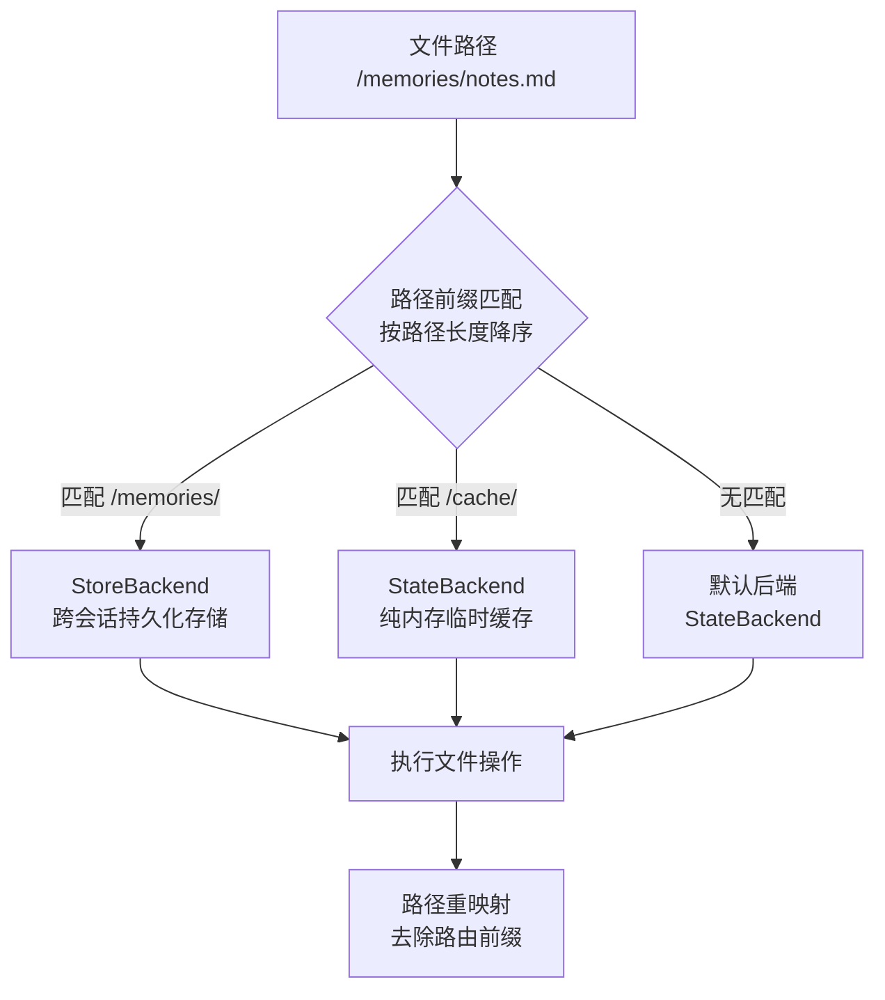
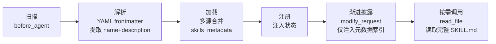
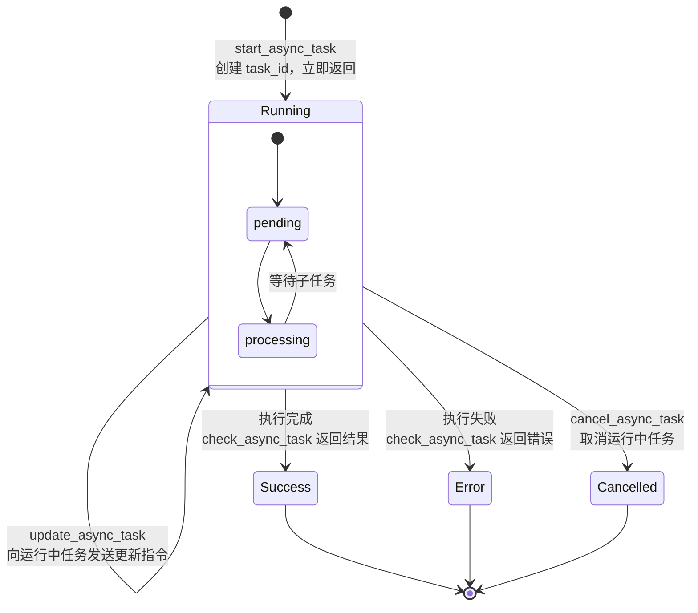

# 可复用技术组件与设计模式参考手册

> 从 LangChain、LangGraph、DeepAgents 三库中提炼的独立可复用技术组件与设计模式

## 目录

1. [序言](#序言)
2. [模式 1: 中间件洋葱模型](#模式-1-中间件洋葱模型)
3. [模式 2: Channel 更新策略多态](#模式-2-channel-更新策略多态)
4. [模式 3: BSP 超级步模型](#模式-3-bsp-超级步模型)
5. [模式 4: CompositeBackend 路由模式](#模式-4-compositebackend-路由模式)
6. [模式 5: Runnable 协议链式编排](#模式-5-runnable-协议链式编排)
7. [模式 6: 检查点不可变日志](#模式-6-检查点不可变日志)
8. [模式 7: 渐进披露模式](#模式-7-渐进披露模式)
9. [模式 8: 异步子代理任务委派](#模式-8-异步子代理任务委派)
10. [技术组件复用清单](#技术组件复用清单)

---

## 序言

本文档定位为**可复用技术组件与设计模式参考手册**，从 LangChain、LangGraph、DeepAgents 三个核心 AI 库的系统性架构分析中，提炼出八个独立于具体库实现的设计模式，以及可复用的技术组件清单。

每个模式遵循统一格式：

- **名称与来源**：模式名称及其在源库中的具体出处
- **问题描述**：该模式要解决的架构问题
- **结构说明**：通过 Mermaid 图展示模式的核心结构
- **核心代码示例**：展示模式的关键实现，使用 Python 语法
- **AgentForge 应用场景**：该模式在 AgentForge 项目中的可能应用

本文档基于以下三份分析文档编写：

- [01-langchain-core-analysis.md](./01-langchain-core-analysis.md) — LangChain 核心架构分析
- [02-langgraph-core-analysis.md](./02-langgraph-core-analysis.md) — LangGraph 核心架构分析
- [03-deepagents-core-analysis.md](./03-deepagents-core-analysis.md) — DeepAgents 核心架构分析

> 本文档中的代码示例为设计模式的概念演示，非源库中的逐行拷贝。实际使用时应参考对应库的最新 API 文档。

---

## 模式 1: 中间件洋葱模型

### 名称与来源

**中间件洋葱模型 (Middleware Onion Model)** — 来源：DeepAgents `AgentMiddleware` 基类及其生命周期钩子（[03-deepagents-core-analysis.md](./03-deepagents-core-analysis.md) 第 3.1-3.4 节）。

### 问题描述

如何在代理的请求-响应链路上叠加多个横切关注点（工具注入、日志、安全审计、上下文摘要、技能加载等），而不污染核心代理循环代码？

在复杂代理系统中，开发者的核心业务逻辑（LLM 调用 → 工具执行 → 响应处理）需要与大量基础设施关注点共存：安全权限检查、消息历史摘要、技能元数据注入、工具调用缓存、待办列表维护等。将这些关注点直接写入代理循环会导致代码难以测试、难以复用、难以按需组合。

### 结构说明

DeepAgents 的中间件栈以**洋葱模型**组织：最外层中间件最先处理请求，调用 `handler(request)` 后传递到内层；最内层的模型调用完成后，响应沿反向路径逐层返回。



四个核心钩子分布在请求-响应的不同阶段：

| 钩子 | 阶段 | 典型用途 |
|------|------|----------|
| `before_agent` | 代理首次调用前（入口最外层） | 技能扫描、文件初始化 |
| `modify_request` | 每次模型调用前（入向） | 系统提示注入、工具描述追加 |
| `wrap_model_call` | 模型调用包装（内层） | 工具过滤、消息驱逐、结果截断 |
| `after_agent` | 代理完成后（出向最外层） | 清理、日志、指标采集 |
| `wrap_tool_call` | 工具调用包装 | 大结果离线存储 |

### 核心代码示例

**基类接口**：四个核心钩子定义：

```python
from collections.abc import Callable
from typing import Any

class AgentMiddleware:
    """代理中间件抽象基类——洋葱模型的一个层。"""

    def before_agent(
        self, state: dict, runtime: Any, config: dict
    ) -> dict | None:
        """代理首次调用前。可返回 state update。"""
        return None

    def modify_request(self, request: Any) -> Any:
        """每次模型调用前修改请求（注入系统提示等）。"""
        return request

    def wrap_model_call(
        self,
        request: Any,
        handler: Callable[[Any], Any],
    ) -> Any:
        """包装模型调用。调用 handler(request) 传递到内层。"""
        return handler(request)

    def after_agent(
        self, state: dict, runtime: Any, config: dict
    ) -> dict | None:
        """代理完成后。可返回 state update。"""
        return None

    def wrap_tool_call(
        self,
        request: Any,
        handler: Callable[[Any], Any],
    ) -> Any:
        """包装工具调用。"""
        return handler(request)
```

**自定义中间件示例**：一个日志中间件，记录每次模型调用的消息数量：

```python
class LoggingMiddleware(AgentMiddleware):
    """每次模型调用前后记录消息数量。"""

    def wrap_model_call(self, request, handler):
        msg_count = len(request.messages) if request.messages else 0
        print(f"[LoggingMiddleware] 消息数: {msg_count}")
        response = handler(request)
        print(f"[LoggingMiddleware] 响应完成")
        return response
```

### AgentForge 应用场景

- **技能加载横切**：在 `before_agent` 钩子中扫描 `.agents/skills/` 目录，将 SKILL.md 元数据注入状态，让代理按需读取技能详情
- **安全审计**：在 `wrap_model_call` / `wrap_tool_call` 中注入权限校验逻辑，实现工具层安全切面
- **性能监控**：在 `wrap_model_call` 中记录每次 LLM 调用的延迟和 Token 消耗
- **上下文管理**：在 `modify_request` 中注入 AGENTS.md 路由规则和领域规范
- **合规日志**：在 `after_agent` 中记录完整会话日志用于审计

---

## 模式 2: Channel 更新策略多态

### 名称与来源

**Channel 更新策略多态 (Channel Update Strategy Polymorphism)** — 来源：LangGraph `BaseChannel` 接口及其六大实现（[02-langgraph-core-analysis.md](./02-langgraph-core-analysis.md) 第 3.1-3.6 节）。

### 问题描述

在有状态图执行中，多个节点可能并发更新同一个状态字段。不同字段需要不同的合并策略——有的只需保留最后写入值，有的需要累积所有写入，有的需要等待特定节点集合全部完成。如何在不污染业务逻辑的前提下，为每个状态字段选择正确的合并策略？

传统工作流引擎通常以"节点"为核心组织数据流，这使得字段级别的合并策略需要手动写在每个节点中。LangGraph 的创新在于将 **Channel 抽象提升为一等公民**——每个状态字段对应一个具有独立生命周期的 Channel 实例，策略通过类型声明而非命令式代码来指定。

### 结构说明

`BaseChannel` 是一个三泛型抽象类（`Value`、`Update`、`Checkpoint`），定义了所有 Channel 必须实现的契约。六种具体 Channel 类型覆盖了全部常见合并策略：



类型声明即可自动选择策略：

- 普通字段 `status: str` → 自动解析为 `LastValue(str)`
- 累加字段 `messages: Annotated[list[BaseMessage], add_messages]` → 自动解析为 `BinaryOperatorAggregate`
- 双向等待边 `add_edge(["A", "B"], "C")` → 编译时自动创建 `NamedBarrierValue`

### 核心代码示例

**声明式策略选择**——通过 Python 类型注解表达合并策略，无需显式使用 Channel 类：

```python
import operator
from typing import Annotated
from typing_extensions import TypedDict
from langgraph.graph.message import add_messages

class AgentState(TypedDict):
    # LastValue（默认）：只保留最后写入者的值
    next_step: str

    # BinaryOperatorAggregate：每次更新通过 operator.add 累积
    scores: Annotated[list[int], operator.add]

    # BinaryOperatorAggregate（内置 reducer）：消息专用累积
    messages: Annotated[list, add_messages]

    # BinaryOperatorAggregate（自定义 reducer）：用 lambda 做字符串拼接
    transcript: Annotated[str, lambda a, b: f"{a}\n{b}"]

    # EphemeralValue 风格（一步有效）：通过 consume() 自动清除
    trigger_signal: Annotated[str, "ephemeral"]
```

**Channel 运行时行为**：不同策略的实际效果：

```python
# LastValue: 每步只有一个写入者
lv = LastValue(str)
lv.update(["running"])
assert lv.get() == "running"
lv.update(["completed"])
assert lv.get() == "completed"

# BinaryOperatorAggregate: 多写入者累积
bag = BinaryOperatorAggregate(list, operator.add)
bag.update([[1, 2]])     # 节点 A 写入
bag.update([[3, 4]])     # 节点 B 写入
assert bag.get() == [1, 2, 3, 4]

# NamedBarrierValue: 所有命名源到齐才可用
barrier = NamedBarrierValue(str, {"A", "B", "C"})
barrier.update(["A"])
assert not barrier.is_available()
barrier.update(["B", "C"])
assert barrier.is_available()

# Topic: accumulate=False 时每步清空
topic = Topic(str, accumulate=False)
topic.update(["msg1", "msg2"])
assert list(topic.get()) == ["msg1", "msg2"]
topic.update(["msg3"])      # 新 Step 开始，旧值被清空
assert list(topic.get()) == ["msg3"]
```

### AgentForge 应用场景

- **消息累积**：AgentForge 的多步对话中，`messages` 字段使用 `add_messages` 归约器自动累积所有用户/AI/工具消息
- **任务结果合并**：多个子代理并行执行后的结果通过 `operator.add` 累积到统一的 `results` 列表
- **事件日志聚合**：各节点的结构化日志通过自定义 reducer 合并为聚合日志
- **多智能体同步屏障**：使用 `NamedBarrierValue` 模式在编译时自动为汇聚点创建 Barrier Channel，确保所有前置 Agent 完成后才触发下游节点
- **临时信号传递**：`EphemeralValue` 风格用于单步有效的路由信号（如 `_route` 字段）

---

## 模式 3: BSP 超级步模型

### 名称与来源

**BSP 超级步模型 (Bulk Synchronous Parallel Superstep Model)** — 来源：LangGraph `PregelLoop` 引擎（[02-langgraph-core-analysis.md](./02-langgraph-core-analysis.md) 第 4.1-4.5 节）。

### 问题描述

如何实现多节点有向图的有序并发执行，同时保证每轮所有并发节点完成后状态一致，并支持检查点持久化？

传统方案中，要么全串行（简单但无并发收益），要么全异步（复杂且难以保证一致性和可恢复性）。LangGraph 的正解是完整实现 Google Pregel 论文提出的 **BSP (Bulk Synchronous Parallel)** 范式——每个 Superstep 内节点并发执行，通过 Channel 通信，Superstep 边界处进行全局 Barrier 同步，然后一次性更新所有 Channel 状态。这类似于数据库事务的原子性保证，使得状态视图在每个 Superstep 边界始终一致。

### 结构说明

每个 Superstep 包含三个原子阶段：**任务准备** → **并发执行** → **写入应用**。所有并发任务完成后，通过 Barrier 同步，所有 Channel 更新在同一时刻生效。

```mermaid
sequenceDiagram
    participant Loop as PregelLoop
    participant Algo as _algo (调度)
    participant Runner as PregelRunner
    participant Node as 用户节点
    participant Storage as Checkpointer

    Loop->>Loop: __enter__() 加载/创建检查点
    Loop->>Loop: _first() 处理输入
    Loop->>Loop: _put_checkpoint(source="input")

    loop 每个 Superstep
        Note over Loop: tick()
        Loop->>Algo: prepare_next_tasks()
        Algo-->>Loop: {task_id → PregelExecutableTask}
        alt no tasks
            Loop-->>Loop: status="done", break
        end

        Loop->>Loop: should_interrupt (before)?

        Loop->>Runner: tick(tasks)
        Note over Runner: 并发执行所有任务

        par 并发任务
            Runner->>Node: 执行 task_1
            Node-->>Runner: writes_1
        and
            Runner->>Node: 执行 task_2
            Node-->>Runner: writes_2
        and
            Runner->>Node: 执行 task_N
            Node-->>Runner: writes_N
        end

        Runner-->>Loop: commit → put_writes → checkpointer.put_writes

        Note over Loop: after_tick() — Barrier 同步点
        Loop->>Storage: apply_writes → channel.update()
        Loop->>Loop: _put_checkpoint(source="loop")
        Loop->>Loop: should_interrupt (after)?

        Loop->>Loop: step += 1
    end

    Loop->>Loop: output
```

任务调度采用双机制：

- **PULL 任务**（版本触发）：节点订阅的 Channel 版本高于已处理版本时触发——惰性拉取
- **PUSH 任务**（显式推送）：通过 `Send` API 和 `Command` 对象主动推送至 `TASKS` Topic Channel

### 核心代码示例

**精简版 BSP 循环伪代码**——展示核心算法逻辑：

```python
def bsp_loop(graph_state, nodes, channels, max_steps, checkpointer):
    """精简版 BSP 执行循环——LangGraph PregelLoop 的算法骨架。"""
    step = 0
    checkpoint = checkpointer.get(graph_state)

    while step < max_steps:
        # ── 阶段 1: 准备待执行任务 ──
        tasks = prepare_next_tasks(checkpoint, channels)

        if not tasks:
            break  # 无更多任务，退出循环

        # ── 阶段 2: 并发执行所有任务 ──
        writes = {}
        with ThreadPoolExecutor() as executor:
            futures = {executor.submit(run_task, t): t for t in tasks}
            for future in as_completed(futures):
                task = futures[future]
                writes[task.name] = future.result()

        # ── 阶段 3: Barrier 同步 — 原子应用所有写入 ──
        # 先持久化中间写入
        checkpointer.put_writes(writes)

        # 再批量更新所有 Channel
        for chan_name, updates in writes.items():
            channels[chan_name].update(updates)
            checkpoint["channel_versions"][chan_name] += 1

        # 消费已处理的 Channel（清除 EphemeralValue 等）
        for chan in consumed_channels(checkpoint, channels):
            channels[chan].consume()

        # 保存完整检查点
        checkpointer.put(checkpoint)

        step += 1

    return channels["output"].get()


def prepare_next_tasks(checkpoint, channels):
    """从 PULL（版本触发）+ PUSH（Send API）两个来源收集待执行任务。"""
    tasks = {}

    # PULL: 版本驱动的惰性触发
    for node in nodes:
        for chan in node.triggers:
            version_seen = checkpoint["versions_seen"].get(node.name, {}).get(chan, -1)
            current_version = checkpoint["channel_versions"].get(chan, 0)
            if current_version > version_seen:
                tasks[node.name] = node
                break

    # PUSH: 从 TASKS Channel 读取显式推送的任务
    for push_task in channels.get("__tasks__", []):
        tasks[push_task.target] = push_task

    return tasks
```

**PregelRunner 并发执行引擎**：

```python
class PregelRunner:
    def tick(self, tasks, *, reraise=True, timeout=None, retry_policy=None):
        futures = {}
        # 单任务快速路径：无需线程池开销
        if len(tasks) == 1:
            t = next(iter(tasks))
            run_with_retry(t, retry_policy)
            self.commit(t, None)
            return

        # 多任务并发路径：ThreadPool / asyncio
        for t in tasks:
            fut = submit(run_with_retry, t, retry_policy)
            futures[fut] = t

        while futures:
            done, _ = concurrent.futures.wait(futures, return_when=FIRST_COMPLETED)
            for fut in done:
                task = futures.pop(fut)
                exception = fut.exception()
                if exception and has_error_handler(task):
                    schedule_error_handler(task, exception)
                else:
                    self.commit(task, exception)
            if exception and reraise:
                raise exception
```

### AgentForge 应用场景

- **多智能体轮次协作**：每轮中所有 Agent 并发处理自己的子任务，Barrier 同步后统一评估结果并决定下一轮方向
- **工作流步骤同步**：多步骤工作流中，所有并行步骤完成后统一推进状态
- **批量任务编排**：将一批独立任务（如文件分析、代码审查）并发执行，所有完成后聚合报告
- **AgentForge Spec 世界继承的图编译**：在编译世界层级关系图时，Superstep 确保每次 `compile()` 后所有节点状态一致

---

## 模式 4: CompositeBackend 路由模式

### 名称与来源

**CompositeBackend 路由模式 (Composite Backend Routing)** — 来源：DeepAgents `CompositeBackend` 类（[03-deepagents-core-analysis.md](./03-deepagents-core-analysis.md) 第 4.3 节）。

### 问题描述

如何在同一个代理系统中，让不同路径或类型的数据自动路由到不同的存储后端？

代理系统常需要同时使用多种存储策略：当前会话的临时状态放在内存中（快速但易失），用户持久化记忆存在数据库或文件系统中（持久但较慢），缓存数据可能放在 Redis 中。如果每种存储后端各自暴露不同的 API，业务代码将充满存储选择逻辑。`CompositeBackend` 通过路径前缀路由机制，让调用者只需指定文件路径，后端路由对上层完全透明。

### 结构说明

`CompositeBackend` 内部维护一张路由表——字典映射路径前缀到子后端实例。每次文件操作时，按照路径前缀最长匹配原则选择子后端，路径被重映射为子后端相对路径（去除路由前缀）。



路由算法的关键特性：

- **最长匹配优先**：路径前缀按长度降序排列，`/memories/project/` 优先于 `/memories/`
- **路径重映射**：子后端始终接收以 `/` 开头的规范化路径（如 `/memories/notes.md` 重映射为 `/notes.md`）
- **默认回退**：无匹配前缀时路由到 `default` 后端

### 核心代码示例

**CompositeBackend 路由配置**：

```python
from deepagents.backends import CompositeBackend, StateBackend, StoreBackend

composite = CompositeBackend(
    default=StateBackend(),      # 默认：纯内存，一次会话有效
    routes={
        "/memories/": StoreBackend(),   # 路径：跨会话持久化
        "/cache/": StateBackend(),      # 路径：临时缓存（同默认但隔离命名空间）
    },
)

# 读取操作自动路由：/memories/ 下的文件走 StoreBackend
result = composite.grep("TODO", path="/memories/project/tasks.md")

# 写入操作：指定路径，后端自动选择
composite.write("/cache/llm_response.json", response_data)
```

**路由算法的简化实现**：

```python
class CompositeBackend:
    """按路径前缀将文件操作路由到不同子后端。"""

    def __init__(self, default, routes):
        self._default = default
        # 按路径长度降序排列，确保最长匹配优先
        self._routes = sorted(
            routes.items(),
            key=lambda item: len(item[0]),
            reverse=True,
        )

    def _resolve(self, path):
        """根据路径解析目标后端和重映射后的路径。"""
        for prefix, backend in self._routes:
            if path.startswith(prefix):
                # 去除路由前缀，子后端看到的是相对路径
                remapped = "/" + path[len(prefix):].lstrip("/")
                return backend, remapped
        return self._default, path

    def read(self, file_path, offset=0, limit=None):
        backend, path = self._resolve(file_path)
        return backend.read(path, offset=offset, limit=limit)

    def write(self, file_path, content):
        backend, path = self._resolve(file_path)
        return backend.write(path, content)

    def ls(self, path):
        backend, remapped_path = self._resolve(path)
        return backend.ls(remapped_path)
```

### AgentForge 应用场景

- **短期记忆 vs 持久文件隔离**：`/session/` 路径路由到内存后端（对话上下文），`/world/` 路径路由到持久化后端（世界状态）
- **多租户数据路由**：不同 team/role 的文件操作通过 `/team/{name}/` 前缀路由到各自的存储空间
- **AgentForge 世界继承中的内核隔离**：`/kernel/` 路径路由到只读后端，`/fragments/{id}/` 路由到可写后端
- **缓存分层**：`/cache/llm/` 路由到 Redis 后端，`/cache/state/` 路由到内存后端

---

## 模式 5: Runnable 协议链式编排

### 名称与来源

**Runnable 协议链式编排 (Runnable Protocol Chain Composition)** — 来源：LangChain `Runnable` 协议及 LCEL 表达式语言（[01-langchain-core-analysis.md](./01-langchain-core-analysis.md) 第 2.1-2.4 节）。

### 问题描述

如何让不同组件（LLM 调用、工具、解析器、自定义函数）以统一接口组合成可执行管道，而不需要为每种组合方式编写适配代码？

在构建 AI 应用时，开发者需要将 Prompt 模板、ChatModel 调用、输出解析器、自定义后处理函数等不同组件串联在一起。传统方案需要为每种组合方式编写胶水代码。LangChain 的解决方案是让所有组件共享同一套接口——`Runnable[Input, Output]`——然后通过 Python 的 `|` 操作符将它们串行组合，通过字典字面量将它们并行组合。组合出的新链同样是 `Runnable`，可继续嵌套组合。

### 结构说明

`RunnableSequence`（管道 `|`）和 `RunnableParallel`（字典并发）是最核心的两种组合模式：

```mermaid
flowchart TD
    subgraph Sequence["管道组合 RunnableSequence (| 操作符)"]
        direction LR
        A["Runnable A<br/>Input → Intermediate"] --> B["Runnable B<br/>Intermediate → Output"]
    end

    subgraph Parallel["并发组合 RunnableParallel ({...} 字典)"]
        direction TB
        Input["输入: x"] --> B1["Runnable B1<br/>分支 1"]
        Input --> B2["Runnable B2<br/>分支 2"]
        Input --> B3["Runnable B3<br/>分支 3"]
        B1 --> Output1["输出: {key1: result1, key2: result2, key3: result3}"]
        B2 --> Output1
        B3 --> Output1
    end

    subgraph Complex["复杂组合：Sequence + Parallel 嵌套"]
        direction LR
        C1["预处理<br/>RunnableSequence"] --> C2["{并行分支}"<br/>RunnableParallel"]
        C2 --> C3["后处理<br/>RunnableSequence"]
    end
```

`RunnableSequence` 的关键行为：
- 前一个 Runnable 的输出作为下一个 Runnable 的输入
- 自动处理同步/异步/流式适配（如果内部组件支持流式，整条链也支持）
- 可通过 `with_fallbacks()` 附加备选链路实现优雅降级
- 可通过 `with_retry()` 添加自动重试

### 核心代码示例

**基础管道组合**：

```python
from langchain_core.runnables import RunnableLambda

# 方式一：| 操作符 —— 最简洁的声明式编排
sequence = (
    RunnableLambda(lambda x: x + 1)       # int → int
    | RunnableLambda(lambda x: x * 2)      # int → int
    | RunnableLambda(lambda x: f"结果: {x}")  # int → str
)
result = sequence.invoke(1)  # "结果: 4"

# 方式二：RunnableSequence 显式构造
from langchain_core.runnables import RunnableSequence
seq = RunnableSequence(
    RunnableLambda(lambda x: x + 1),
    RunnableLambda(lambda x: x * 2),
)
seq.batch([1, 2, 3])  # 批量：并发执行，返回 [4, 6, 8]
```

**并发组合**——多个分支同时执行：

```python
# 字典字面量 → 自动构造 RunnableParallel
parallel_chain = RunnableLambda(lambda x: x + 1) | {
    "mul_2": RunnableLambda(lambda x: x * 2),
    "mul_5": RunnableLambda(lambda x: x * 5),
}
result = parallel_chain.invoke(1)
# {'mul_2': 4, 'mul_5': 10}
# 输入 1 → +1 = 2 → 并行分发给两个分支
```

**典型 Agent 管道**：chat_model → prompt → output_parser：

```python
from langchain_core.prompts import ChatPromptTemplate
from langchain_core.output_parsers import StrOutputParser

prompt = ChatPromptTemplate.from_template(
    "用{language}语言回答: {question}"
)
chain = prompt | chat_model | StrOutputParser()

result = chain.invoke({
    "language": "中文",
    "question": "什么是BSP模型？"
})
```

**优雅降级与重试**：

```python
# with_fallbacks: 主链路失败后自动切换备选
primary = RunnableLambda(lambda x: risky_operation(x))
fallback = RunnableLambda(lambda x: safe_fallback(x))
chain = primary.with_fallbacks([fallback])

# with_retry: 指数退避自动重试
flaky_chain = RunnableLambda(call_external_api).with_retry(
    stop_after_attempt=5,
    wait_exponential_jitter=True
)
```

### AgentForge 应用场景

- **通用组件编排**：将 AgentForge 的各种能力单元（规则加载器、技能执行器、LLM 调用器）封装为 Runnable，通过 `|` 组合成可执行管道
- **可组合的代理管道**：`规则匹配 → Prompt 注入 → LLM 调用 → 输出校验` 作为标准管道，不同场景注入不同的规则集
- **并发技能执行**：使用 `RunnableParallel` 同时执行多个独立技能，聚合结果
- **流式适配**：AgentForge 的 `taolib` 组件实现 Runnable 协议后，自动获得流式输出能力

---

## 模式 6: 检查点不可变日志

### 名称与来源

**检查点不可变日志 (Immutable Checkpoint Log)** — 来源：LangGraph `Checkpoint` 数据结构及 `BaseCheckpointSaver` 接口（[02-langgraph-core-analysis.md](./02-langgraph-core-analysis.md) 第 5.1-5.6 节）。

### 问题描述

如何在代理执行过程中实现断点续传、时间旅行（回到历史状态重新执行）和审计追溯（查看每步的状态变化）？

代理系统的执行可能跨越数十甚至数百个步骤。中途可能因为人工审批、外部服务不可用或用户意图变更而需要暂停。系统必须能精确地从暂停点恢复执行，而不是从头再来。此外，调试和审计需要查看"在第 N 步时状态是什么"。LangGraph 的检查点系统将每次状态变更视为一个不可变的检查点记录，构成一条可回溯的时间线。

### 结构说明

每次 `_put_checkpoint()` 调用创建一个新的不可变检查点记录。检查点通过 UUID6（单调递增）标识，支持三种关键操作：

- **中断与恢复**：`interrupt()` 抛出受控中断，保存检查点后等待 `Command(resume=...)` 恢复
- **Fork 分支**：`update_state()` 在历史检查点上注入变更，创建新的分叉检查点
- **时间旅行**：`invoke(None, checkpoint_id=past_id)` 从历史检查点重新执行

```mermaid
sequenceDiagram
    participant User as 调用者
    participant Graph as CompiledStateGraph
    participant Loop as PregelLoop
    participant CP as Checkpointer

    Note over User,CP: 正常执行
    User->>Graph: invoke(input)
    Graph->>Loop: 开始执行
    Loop->>CP: _put_checkpoint(source="input")
    loop Superstep
        Loop->>CP: _put_checkpoint(source="loop")
    end
    Graph-->>User: output

    Note over User,CP: 中断与恢复
    User->>Graph: invoke(需要人工审批的input)
    Loop->>CP: _put_checkpoint(source="loop")
    Graph-->>User: GraphInterrupt("等待审批")
    User->>Graph: invoke(Command(resume={"approved": True}))
    Loop->>CP: 从上次检查点恢复，继续执行
    Graph-->>User: 审批后的output

    Note over User,CP: Fork 时间旅行
    User->>Graph: update_state(config, values, as_node="X")
    Graph->>CP: 创建 source="update" 的新分叉检查点
    User->>Graph: invoke(None, config={checkpoint_id: past_id})
    Loop->>CP: 从历史检查点重新触发
    Graph-->>User: 分支结果
```

### 核心代码示例

**中断与恢复**：

```python
from langgraph.types import interrupt, Command

def approval_node(state):
    """需要人工审批的节点。"""
    if not state.get("approved"):
        # interrupt() 抛出 GraphInterrupt，检查点被保存
        reason = interrupt("等待人工审批：请确认文件编辑操作")
    # 恢复后继续执行
    return {"status": "approved"}

# 恢复执行
graph.invoke(
    Command(resume={"approved_by": "admin"}),
    {"configurable": {"thread_id": "thread-1"}}
)
```

**Fork 分支**——在历史检查点上注入变更：

```python
# 在历史检查点上创建分支
graph.update_state(
    {"configurable": {
        "thread_id": "t1",
        "checkpoint_id": "past-checkpoint-id"
    }},
    values={"status": "corrected"},
    as_node="some_node"
)
# 这将创建一个 source="update" 的新检查点分支
# 后续的 invoke() 可以从这个分支继续
```

**时间旅行**——从历史检查点重新执行：

```python
# 从指定历史检查点重新执行（输入为 None）
graph.invoke(
    None,   # None = 不提供新输入，从已有状态继续
    {"configurable": {
        "thread_id": "t1",
        "checkpoint_id": "past-checkpoint-id"
    }}
)
# 引擎检测到 is_time_traveling=True：
# 1. 清除 RESUME 写入
# 2. 创建 source="fork" 检查点
# 3. 让节点基于版本比较自然触发
```

**DeltaChannel 增量持久化**——高频更新场景的优化：

```python
from langgraph.channels.delta import DeltaChannel

def msg_reducer(state, writes):
    for msg in writes:
        state.append(msg)
    return state

dc = DeltaChannel(msg_reducer, list, snapshot_frequency=100)
dc.update([["msg1", "msg2"]])
assert dc.get() == ["msg1", "msg2"]
assert dc.checkpoint() is MISSING  # 检查点不保存实际值，仅哨兵
# 实际值通过回放祖先写入链重建
```

### AgentForge 应用场景

- **任务断点续传**：AgentForge 的长时间任务（如代码库全面审查）通过检查点实现"暂停-恢复"
- **执行回放调试**：通过 `get_state_history()` 遍历历史检查点，逐步回放代理的执行过程
- **A/B 分支测试**：在关键决策点 Fork 分支，比较不同决策路径的执行结果
- **世界状态快照**：AgentForge 的世界状态（kernel + fragments）在每次变更后创建快照，支持回滚
- **审计追溯**：完整的检查点链条为 AgentForge 的代理行为提供合规审计能力

---

## 模式 7: 渐进披露模式

### 名称与来源

**渐进披露模式 (Progressive Disclosure)** — 来源：DeepAgents `SkillsMiddleware` 与 `SKILL.md` 标准（[03-deepagents-core-analysis.md](./03-deepagents-core-analysis.md) 第 6.1-6.3 节）。

### 问题描述

如何在大量可用技能（或知识资源）中避免上下文溢出，同时让代理按需获取技能详情？

当代理系统拥有数十甚至数百个技能时，将所有技能的完整文档一次性注入系统提示会导致两个问题：(1) Token 消耗巨大，超出上下文窗口；(2) 大量不相关的技能文档干扰代理的注意力（"大海捞针"效应）。渐进披露模式的核心思想是：只注入技能的元数据索引（名称、一句话描述），让代理在需要时主动请求完整技能文档。

### 结构说明

渐进披露分为两个阶段：

1. **元数据注入阶段**（`before_agent` + `modify_request`）：扫描所有技能源目录，解析 `SKILL.md` 的 YAML frontmatter，将技能名称和简介作为索引注入系统提示
2. **按需加载阶段**：代理根据任务需求，通过工具调用（如 `read_file`）读取具体技能的完整 `SKILL.md`



关键设计决策：

- **两阶段分离**：`before_agent` 负责扫描和加载（一次性），`modify_request` 负责注入元数据（每次模型调用前）
- **多源合并**：多个技能源目录以"后覆盖前"策略合并，支持用户覆盖系统默认技能
- **技能与子代理隔离**：通过 `PrivateStateAttr` 标注确保父代理的 `skills_metadata` 不泄露给子代理
- **基于开放标准**：`SKILL.md` 遵循 Agent Skills 开放标准，技能可跨平台复用

### 核心代码示例

**SKILL.md 格式**（Agent Skills 开放标准）：

```markdown
---
name: web-research
description: 互联网结构化研究方法论——如何高效收集、评估和组织在线信息
license: MIT
compatibility: 需要 read_file、grep 工具
---

# Web Research Skill

## 何时使用
- 用户要求研究某个主题或收集信息
- 需要对比多个来源的数据

## 工作流
1. 明确研究问题和范围
2. 从权威来源收集信息
3. 交叉验证关键事实
4. 组织结构化研究报告

## 输出格式
- 使用 Markdown 标题层级组织
- 引用来源时标注 URL 和日期
```

**SkillsMiddleware 注入逻辑**——两个阶段的核心实现：

```python
class SkillsMiddleware(AgentMiddleware):
    """渐进披露技能系统——先注入元数据索引，代理按需读取详情。"""

    def __init__(self, sources: list[str]):
        self._sources = sources

    def before_agent(self, state, runtime, config):
        """阶段 1: 扫描并加载所有技能元数据。"""
        skills = {}
        for source in self._sources:
            entries = self._scan_source(source)      # ls 子目录
            for path, name in entries:
                skill_md = self._read_skill_md(path)  # 读取 SKILL.md
                parsed = self._parse_frontmatter(skill_md)
                skills[name] = {
                    "name": name,
                    "description": parsed.get("description", ""),
                    "path": path,
                    "license": parsed.get("license"),
                }
        return {"skills_metadata": skills}

    def modify_request(self, request):
        """阶段 2: 将技能索引注入系统提示。"""
        skills = request.state.get("skills_metadata", {})
        if not skills:
            return request

        # 仅注入元数据索引——名称 + 简短描述
        index_lines = ["## 可用技能\n"]
        for name, meta in skills.items():
            index_lines.append(f"- **{name}**: {meta['description']}")
        index_lines.append(
            "\n使用 `read_file` 工具读取完整技能文档。"
        )

        request.system_prompt += "\n" + "\n".join(index_lines)
        return request
```

**代理的渐进加载流程**：

```python
# 初始调用时，系统提示仅包含技能索引：
#   ## 可用技能
#   - **web-research**: 互联网结构化研究方法论
#   - **code-review**: 自动化代码审查流程
#   - **doc-generator**: 技术文档自动生成
#   使用 read_file 工具读取完整技能文档。

# 代理判断任务需要 web-research 技能时：
#   1. 调用 read_file("/skills/web-research/SKILL.md")
#   2. 获得完整技能文档（何时使用、工作流、输出格式等）
#   3. 按技能规范执行任务
```

### AgentForge 应用场景

- **大型技能库按需加载**：AgentForge 的 `.agents/skills/` 目录可能包含数十个技能，通过渐进披露避免上下文溢出
- **知识库渐进检索**：`.agents/docs/` 中的知识文档通过元数据索引先暴露摘要，代理按需深度检索
- **AGENTS.md 路由表**：AgentForge 的 `AGENTS.md` 路由表本身就是一种渐进披露——先看到路由索引，再按任务类型加载具体规范文件
- **跨项目技能复用**：遵循 Agent Skills 开放标准的技能可以在不同项目中通过渐进披露机制自动可用

---

## 模式 8: 异步子代理任务委派

### 名称与来源

**异步子代理任务委派 (Async Sub-Agent Task Delegation)** — 来源：DeepAgents `AsyncSubAgentMiddleware` 及其五大工具（[03-deepagents-core-analysis.md](./03-deepagents-core-analysis.md) 第 5.3 节）。

### 问题描述

如何在主代理保持响应的同时，将耗时任务委派给远程子代理异步执行，并实现任务的启动、状态查询、中途更新和取消？

某些代理任务（如深度研究、代码库全量扫描）可能需要数分钟甚至数小时。如果主代理同步等待这些任务完成，用户将长时间得不到任何反馈。理想的方案是：主代理启动远程任务后立即返回任务 ID，用户可以随时查询进度，在任务完成时获取结果，或在必要时取消任务。

### 结构说明

异步子代理通过五个工具和一个持久化状态字段实现完整的任务生命周期管理：



五个工具各司其职：

| 工具 | 功能 | 阻塞性 |
|------|------|--------|
| `start_async_task` | 启动远程后台任务，立即返回 `task_id` | 非阻塞 |
| `check_async_task` | 检查任务状态，完成时返回结果 | 瞬时 |
| `update_async_task` | 向运行中任务发送更新指令 | 瞬时 |
| `cancel_async_task` | 取消运行中任务 | 瞬时 |
| `list_async_tasks` | 列出所有已追踪任务及实时状态 | 瞬时 |

### 核心代码示例

**主代理端——启动异步任务**：

```python
# 主代理调用 start_async_task 工具
# 远程研究代理立即返回 task_id，主代理继续执行
task_id = start_async_task(
    subagent_type="remote-researcher",
    description="分析 LangGraph 源码中的 Pregel 实现",
    prompt="请深入分析 PregelLoop 的 BSP 执行模型..."
)
# 主代理向用户反馈："已启动研究任务 {task_id}，预计需要 5-10 分钟"

# 主代理可以继续处理其他请求，随时查询进度
while True:
    result = check_async_task(task_id=task_id)
    if result["status"] == "success":
        final_report = result["output"]
        break
    elif result["status"] == "error":
        error_msg = result["error"]
        break
    # status == "running"，等待并轮询
    sleep(30)
```

**AsyncSubAgentMiddleware 的核心逻辑**：

```python
class AsyncSubAgentMiddleware(AgentMiddleware):
    """异步远程子代理中间件——注入了五个工具的完整生命周期管理。"""

    def __init__(self, subagents, client_cache=None):
        self._subagents = {
            sa["name"]: sa for sa in subagents
        }
        self._client_cache = client_cache or _ClientCache()

    def wrap_model_call(self, request, handler):
        """注入 async_task 工具和系统提示。"""
        request.tools.extend([
            self._build_start_async_task_tool(),
            self._build_check_async_task_tool(),
            self._build_update_async_task_tool(),
            self._build_cancel_async_task_tool(),
            self._build_list_async_tasks_tool(),
        ])
        request.system_prompt += self._build_task_system_prompt()
        return handler(request)

    def _start_async_task(self, subagent_type, description, prompt):
        """创建并启动远程任务。"""
        sa = self._subagents[subagent_type]
        client = self._client_cache.get(sa["url"], sa.get("headers"))

        task_id = client.start_run(
            graph_id=sa["graph_id"],
            input={"description": description, "prompt": prompt},
        )
        return {
            "task_id": task_id,
            "status": "running",
            "message": f"异步任务已启动: {task_id}",
        }

    def _check_async_task(self, task_id):
        """查询任务状态。"""
        client = self._client_cache.get_for_task(task_id)
        status = client.get_run_status(task_id)

        if status == "success":
            result = client.get_run_output(task_id)
            return {"task_id": task_id, "status": "success", "output": result}
        elif status == "error":
            error = client.get_run_error(task_id)
            return {"task_id": task_id, "status": "error", "error": error}
        else:
            return {"task_id": task_id, "status": "running"}
```

**状态持久化**——`async_tasks` 字段使用 `_tasks_reducer` 合并更新：

```python
def _tasks_reducer(current_tasks, new_updates):
    """将新任务状态合并到现有任务字典。"""
    merged = dict(current_tasks)
    for task_id, status in new_updates.items():
        if task_id in merged:
            merged[task_id].update(status)
        else:
            merged[task_id] = status
    return merged
```

### AgentForge 应用场景

- **长时间研究任务**：代码库深度分析、大范围安全审查等长时任务通过异步子代理执行，主代理保持响应
- **并发子任务调度**：AgentForge 分解复杂任务为多个独立子任务，通过 `start_async_task` 并发启动多个子代理
- **跨世界任务委派**：在 AgentForge 的多世界架构中，主世界的代理可将任务委派给子世界的代理异步执行
- **任务进度可观测**：通过 `list_async_tasks` 实现任务面板，让用户实时了解所有进行中任务的进度

---

## 技术组件复用清单

### 可直接复用的组件

以下组件设计模式可以直接在 AgentForge 项目中采用其思想，无需绑定具体库：

| 组件/模式 | 来源库 | 复用核心 | 适用条件 |
|-----------|--------|----------|----------|
| **中间件洋葱模型** | DeepAgents | 四个钩子接口 + 栈式装配 | 有请求-响应链路的任何代理系统 |
| **Channel 更新策略多态** | LangGraph | `Annotated[type, reducer]` 声明式策略选择 | 有状态图/工作流执行引擎 |
| **Runnable 协议** | LangChain | 统一 `invoke/stream/batch` 接口 + `\|` 管道组合 | 任何需要组件组合的系统 |
| **检查点不可变日志** | LangGraph | UUID6 单调递增 + Fork 语义 + 恢复机制 | 需要断点续传和审计的系统 |
| **渐进披露模式** | DeepAgents | 元数据索引 → 按需加载 两阶段设计 | 有大量可选资源/知识的系统 |
| **CompositeBackend 路由** | DeepAgents | 路径前缀路由 + 最长匹配 | 需要多存储后端的系统 |

### 需适配后复用的组件

以下组件需要在 AgentForge 的技术栈上下文中做适配工作后才能复用：

| 组件 | 来源库 | 适配工作 |
|------|--------|----------|
| **BSP 超级步引擎** | LangGraph `PregelLoop` | 需要与 AgentForge 的 `taolib.harness.runtime.scheduler` 混合调度器对齐，集成 Metaflow 长任务卸载能力 |
| **异步子代理任务委派** | DeepAgents `AsyncSubAgentMiddleware` | AgentForge 的跨世界绑定协议不同于 LangGraph SDK 的 Agent Protocol，需要适配 `taolib.harness.core.bridge` 的跨层通信 |
| **DeltaChannel 增量持久化** | LangGraph | AgentForge 的 `HarnessCheckpointer` 已实现基础 Checkpoint 接口，需要扩展 DeltaChannel 支持以优化高频消息写入 |
| **话题发布-订阅通道 (Topic)** | LangGraph | AgentForge 的多 Agent 场景需要广播式通信，Topic Channel 模式可直接适配 `BridgeEventBus` |
| **SKILL.md 标准** | DeepAgents / Agent Skills | AgentForge 已有自己的 [SKILL.md 规范](../../../../../specs/agentforge-spec-v0.2.md)（含 frontmatter 扩展），需要与渐进披露机制的注入逻辑对齐 |

### 建议在 AgentForge 中自研的组件

以下领域的组件在三库中不存在直接对应物，建议在 AgentForge 中自研：

| 自研领域 | 理由 | 设计参考 |
|----------|------|----------|
| **世界继承冲突解决器** | AgentForge 独有的多世界继承/覆盖语义，三库均无此概念 | 参考 DeepAgents 的"后覆盖前"技能合并策略 + LangGraph 的 Fork 检查点机制 |
| **约束校验引擎** | `constraints.toml` 的 strong/weak 两级约束运行时校验，三库无直接等价 | 参考 DeepAgents `FilesystemPermission` 的声明式规则链求值（首个匹配生效） |
| **三维上下文路由** | AgentForge 的 `intents × file_patterns × phases` 正交路由协议，超出三库的路由能力 | 参考 CompositeBackend 的最长匹配路由 + LangGraph 的条件边路由 |
| **生长通道自动沉淀** | AgentForge 的 agent → retrospective → rules 正反馈循环 | 参考 DeepAgents RubricMiddleware 的 `needs_revision` 自评迭代模式 |
| **跨世界任务委派协议** | 多世界隔离场景下的异步任务委派，不同于同进程子代理 | 参考 AsyncSubAgentMiddleware 的五工具状态机 + Bridge 层的跨层通信 |
