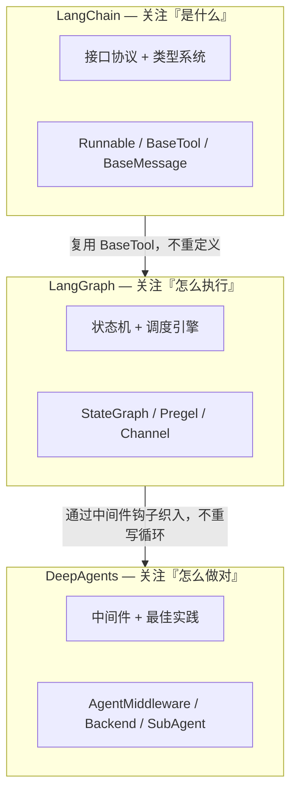
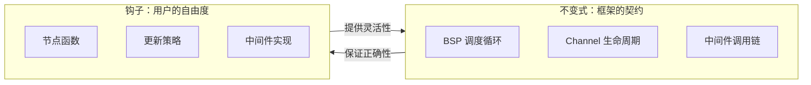

# 萃取洞察：从三库对比中提炼的架构智慧

> 基于 LangChain/LangGraph/DeepAgents 横向萃取分析后的元层级反思

## 一、架构哲学的清晰分层

三库形成了一个教科书级的"抽象→引擎→产品"阶梯：



这个分层的精妙之处：**每一层都在不破坏下层的前提下增加表达能力。** LangGraph 没有重新定义 Tool，而是直接复用 LangChain 的 `BaseTool`；DeepAgents 没有重写循环逻辑，而是通过中间件钩子在 `create_agent` 前后织入行为。

**对 AgentForge 的启示**：每一层只做一件事，通过协议而非继承扩展。

## 二、最被低估的设计：Channel 版本驱动触发

LangGraph 的 Pregel 引擎表面上在模仿 Google BSP 模型，但真正精巧的是**版本号驱动而非事件名驱动的节点触发机制**：

```python
# 不是"监听某个事件名"（脆弱、耦合）
# 而是"订阅的 Channel 版本号变了就触发"（解耦、可追踪）
def _triggers(channels, versions, seen):
    for chan in proc.triggers:
        if versions[chan] > seen.get(chan, null_version):
            return True  # 数据变了，触发执行
```

这意味着：

- 每个节点天然知道自己处理的是哪个版本的数据
- 检查点 = 版本快照，天然支持时间旅行和 Fork
- 同一 Superstep 内不会因多次更新重复执行同一节点

**对 AgentForge 的启示**：与其设计复杂的事件路由系统，不如让每个状态字段带上单调版本号，节点通过版本水线自动判断是否需要执行。这种"数据驱动"比"控制流驱动"更容易做到幂等、可恢复、可回放。

## 三、DeepAgents 的"厚夹具"策略比看起来更激进

表面上看 DeepAgents 只是给 LangGraph 加了中间件，但深入源码后发现它的真正野心是**接管整个代理生命周期的控制权**：

1. **工具不来自 LLM Provider**：`FilesystemMiddleware` 注入的 `ls/grep/read_file/write_file/edit_file` 是框架级工具，与模型无关
2. **安全边界在工具层不在模型层**：不用 System Prompt 约束行为，而是直接在工具调用时做权限检查
3. **后端协议统一了"本地文件"和"远程沙盒"**：CompositeBackend 让同一代理同时操作内存态和文件态，路径前缀决定路由

这种设计把 LLM 从"决策中心"降级为"推理组件"，框架本身掌握了执行控制权。

**对 AgentForge 的启示**：不该把 Agent 看成一个调用 LLM 的循环，而应该把 LLM 看成 Agent 循环中的一个推理步骤。框架掌握控制权，模型提供推理力。

## 四、可复用模式的共同内核

榨取 8 个设计模式后发现它们共享同一个内核——**不变式 + 钩子**：

| 模式 | 不变式（框架管） | 钩子（用户填） |
|------|-----------|-----------|
| 中间件洋葱 | 调用链拓扑与执行顺序 | before/modify/wrap/after |
| BSP 超级步 | 调度循环与 Barrier 同步 | 节点函数 |
| Channel 多态 | get/update/checkpoint 生命周期语义 | 更新策略算子 |
| Runnable 协议 | invoke/stream/batch 管道组合 | 组件实现 |

**不变式保证正确性，钩子提供灵活性。** AgentForge 的每个子系统都应该先定义不变式（框架保证的契约），再暴露钩子（用户自定义点），而不是反过来。



## 五、生态的结构性弱点与规避

三库虽然分层清晰，但存在**版本锁定扩散效应**：`deepagents` 依赖特定版本的 `langchain-core`，而 `langchain-core` 的版本更新会同时影响 `langgraph` 和所有 partner 包。当你想升级某个 Provider 集成时，可能被迫升级整个链路上的所有包。

**对 AgentForge 的启示**：

- 核心抽象层应该极度稳定，接口变更使用兼容性窗口期
- 版本约束用 `>=` 而非 `==`，给用户升级弹性
- 集成分离到可选依赖（`extras`），不在核心包中硬编码
- 每个包独立版本号，不联动发版

---

> 本文档为萃取过程的元层级洞察，与前五篇分析文档共同构成完整的技术参考体系。
