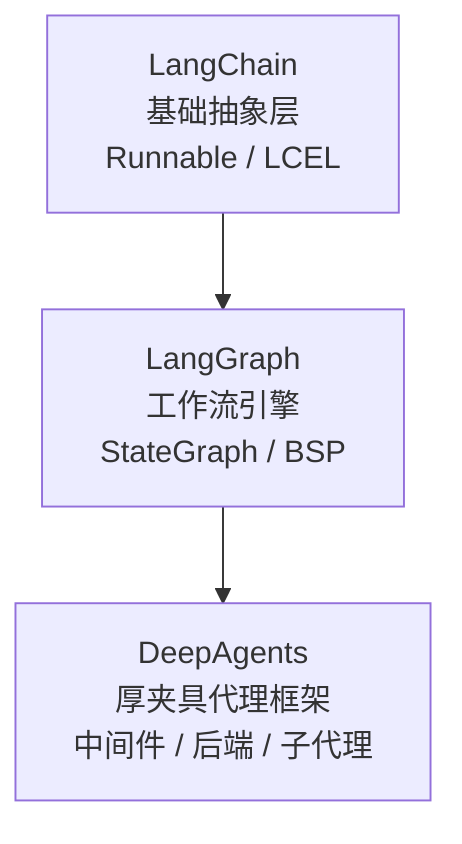

# AI 开源库技术萃取

对 LangChain 生态下三大核心 AI 开源库的系统性源码级横向对比分析。

## 文档导航

| 文档 | 说明 |
|---|---|
| [01-langchain-core-analysis.md](./01-langchain-core-analysis.md) | LangChain 核心架构分析：Runnable 协议、LCEL、消息系统、工具框架、回调追踪 |
| [02-langgraph-core-analysis.md](./02-langgraph-core-analysis.md) | LangGraph 核心架构分析：StateGraph、Channel 系统、BSP 引擎、检查点持久化 |
| [03-deepagents-core-analysis.md](./03-deepagents-core-analysis.md) | DeepAgents 核心架构分析：中间件系统、后端协议、子代理、技能系统、ACP 协议 |
| [04-cross-comparison.md](./04-cross-comparison.md) | 三库横向对比与技术关联分析：八大维度对比、互操作性、场景选型指南 |
| [05-reusable-patterns.md](./05-reusable-patterns.md) | 可复用技术组件与设计模式参考手册：8+ 核心模式的提炼与应用建议 |
| [06-insights.md](./06-insights.md) | 萃取洞察：五项架构智慧——分层哲学、版本驱动、厚夹具策略、不变式+钩子内核、生态弱点 |

## 三库定位速览

- **LangChain**：提供 LLM 应用的基础抽象（消息、工具、提示词、回调），通过 LCEL 和 Runnable 协议实现组件间的链式编排。
- **LangGraph**：在 Runnable 基础上引入有状态的图执行模型（BSP），提供 Channel 系统、检查点持久化、流式处理和多智能体子图支持。
- **DeepAgents**：在 LangGraph 之上封装了八大中间件和可插拔后端，提供开箱即用的通用代理解决方案和 CLI 部署工具链。
