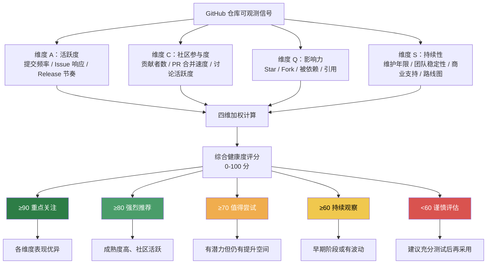
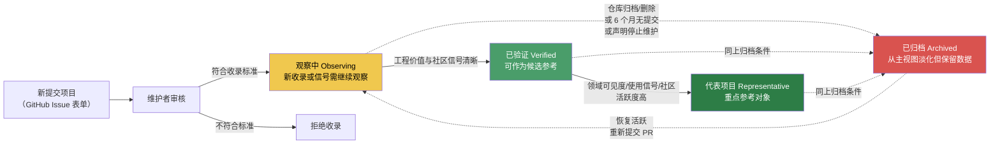
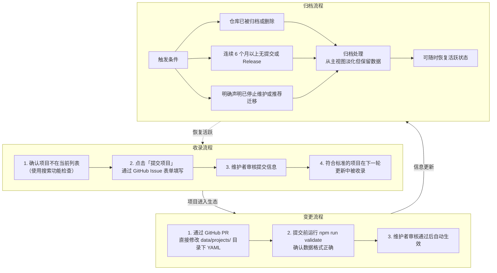
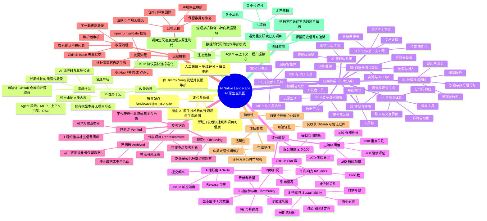

# AI Native Landscape 学习笔记

> 学习来源：[AI 原生全景图](https://landscape.jimmysong.io/zh/)（关于页 / 主页 / 评分方法页）
> 学习方法：六维度学习法（概念 → 原理 → 案例 → 结论 → 自测 → 框架）
> 撰写日期：2026-06-23

---

## 目录

- [Task 1：核心概念定义与解释](#task-1核心概念定义与解释)
- [Task 2：技术原理与工作机制](#task-2技术原理与工作机制)
- [Task 3：实践案例分析与应用场景](#task-3实践案例分析与应用场景)
- [Task 4：关键结论与个人理解](#task-4关键结论与个人理解)
- [Task 5：自测问答](#task-5自测问答)
- [Task 6：知识框架思维导图](#task-6知识框架思维导图)

---

## Task 1：核心概念定义与解释

本节提取并定义 AI Native Landscape 中的 8 个核心概念，每个概念包含名称、定义与关键特征。

### 1.1 AI Native Landscape（AI 原生全景图）

- **定义**：一个面向 AI Native 技术栈的开源项目生态地图，通过结构化分类、双语描述和透明评分，帮助开发者理解快速演进的 AI 原生技术生态。
- **关键特征**：
  - 覆盖工具、Agent、运行时、平台与基础设施五大形态
  - 人工策展 + 多维评分，而非简单罗列
  - 独立站点 `landscape.jimmysong.io`，数据开源在 GitHub 仓库 `rootsongjc/ai-native-landscape`
  - 由 Jimmy Song（jimmysong.io）发起并长期维护

### 1.2 AI 原生技术栈（AI Native Tech Stack）

- **定义**：围绕 AI 原生应用构建所需的完整技术分层，从底层模型与基础设施到上层应用与体验，构成一个可被系统化分类的技术集合。
- **关键特征**：
  - 区别于"在传统架构上叠加 AI 模块"，AI 原生强调以 Agent、上下文工程、推理运行时为核心设计起点
  - 横跨 8 大分类：开发者工具链、智能体系统、推理与运行时、知识与上下文工程、训练评测与优化、应用与体验、模型与模态、平台与基础设施
  - 关注 MCP、RAG、Agent Memory、沙箱执行等 AI 原生特有概念

### 1.3 策展式收录（Curation）

- **定义**：一种以人工审核、长期维护、可验证信号为基础的项目收录方式，区别于一次性聚合或自动抓取的目录。
- **关键特征**：
  - 仅收录 GitHub 上可验证的开源仓库
  - 分类与描述均长期维护中英双语版本
  - 收录标准明确：可访问 GitHub 仓库、中英文描述、稳定分类 key、工程可落地
  - 持续维护而非静态罗列，项目可被归档也可恢复

### 1.4 项目墓地（Tomb）

- **定义**：归档、不可访问和不活跃项目的留档区域，用于保留历史数据以供参考，同时从主视图中淡化。
- **关键特征**：
  - 当前规模：5 项目（2 不可访问 / 3 已归档 / 0 不活跃）
  - 归档项目仍保留数据，可随时恢复活跃状态
  - 触发条件：仓库被归档或删除、连续 6 个月以上无提交或 Release、明确声明停止维护
  - 价值：避免重复研究已死项目，同时保留可追溯的历史信号

### 1.5 综合健康度评分（Health Score）

- **定义**：一个 0-100 的综合评分，由活跃度（A）、社区参与度（C）、影响力（Q）、持续性（S）四个维度加权计算得出，用于快速判断项目是否值得投入时间研究。
- **关键特征**：
  - 评分每日自动更新，今日分数可能不同于明日
  - 四维加权，单一维度突出不足以保证高分
  - 划分为 5 个等级：重点关注（≥90）、强烈推荐（≥80）、值得尝试（≥70）、持续观察（≥60）、谨慎评估（<60）
  - 评分方法公开，尽量保持可理解和可解释

### 1.6 参考状态（Reference Status）

- **定义**：用于帮助社区理解项目可参考程度的标签体系，不代表孵化、认证或基金会治理，仅作为选型参考。
- **关键特征**：
  - 四种状态：观察中（Observing）、已验证（Verified）、代表项目（Representative）、已归档（Archived）
  - 观察中：新收录或信号仍需继续观察
  - 已验证：工程价值和社区信号较清晰，可作为候选参考
  - 代表项目：领域内可见度、使用信号或社区活跃度较高，可作重点参考
  - 已归档：停止维护或不再活跃，从主视图淡化但保留数据

### 1.7 收录边界（收录什么 / 不收录什么）

- **定义**：明确界定 AI Native Landscape 收录与不收录的项目类型，保证地图聚焦于"可工程落地的开源 AI 原生项目"。
- **关键特征**：
  - **收录**：Agent 系统、MCP、上下文工程、RAG、AI 运行时与基础设施；具备可验证 GitHub 仓库与基础元数据的开源项目；长期维护的策展式收录
  - **不收录**：闭源产品；仅有模型本身、没有项目形态的条目；纯学术论文类内容
  - 边界清晰，避免目录泛化为"所有 AI 相关链接集合"

### 1.8 信任要素（Trust Factors）

- **定义**：使 AI Native Landscape 值得信任的四个核心要素，构成其可信度基础。
- **关键特征**：
  - 仅收录 GitHub 上可验证的开源仓库（可验证性）
  - 分类与描述均长期维护中英双语版本（可维护性）
  - 评分方法公开，尽量保持可理解和可解释（透明性）
  - 项目目录持续维护，而不是静态罗列（持续性）

---

## Task 2：技术原理与工作机制

本节阐述评分模型、项目生命周期与三大流程的协作机制，并使用 Mermaid 流程图可视化。

### 2.1 评分模型工作机制

综合健康度评分采用四维加权模型，将 GitHub 可观测信号转化为 0-100 的单一分数。

**四维度详解**：

| 维度 | 缩写 | 中文名 | 衡量内容 | 观测信号 |
|---|---|---|---|---|
| Activity | A | 活跃度 | 近期开发活跃程度 | 提交频率、Issue 响应速度、Release 节奏 |
| Community | C | 社区参与度 | 社区活力 | 贡献者数量、PR 合并速度、讨论活跃度、生态插件/工具数量 |
| Quality/Influence | Q | 影响力 | 生态实际使用价值 | GitHub Star 数、Fork 数、被依赖关系、引用情况 |
| Sustainability | S | 持续性 | 长期健康发展能力 | 维护年限、核心团队稳定性、商业支持、长期路线图 |

> 说明：评分方法页将 Q 维度标注为"影响力 (Influence)"，字母 Q 源自早期命名 Quality，现描述侧重生态影响力。本笔记以官方评分方法页描述为准。

**评分计算流程**：

**关键机制说明**：
- 评分每日自动更新，反映项目最新状态
- 四维加权避免单一指标（如 Star 数）主导判断
- 评分等级为离散阈值，便于快速决策

### 2.2 项目生命周期与参考状态流转

项目在 AI Native Landscape 中经历从收录到归档（或恢复）的完整生命周期，参考状态随项目信号变化而流转。

**流转要点**：
- 参考状态不代表孵化、认证或基金会治理，仅作选型参考
- 归档是可逆的：项目恢复活跃后可重新进入观察中状态
- 状态升级路径：观察中 → 已验证 → 代表项目
- 状态降级路径：任意状态 → 已归档（满足归档条件）

### 2.3 收录 / 变更 / 归档三大流程协作关系

三个流程构成 AI Native Landscape 的治理闭环，分别对应项目进入、修改、退出（可恢复）。

**协作关系说明**：
- 收录流程是入口，保证项目符合收录标准
- 变更流程是日常维护，通过 PR + 校验保证数据质量
- 归档流程是退出机制，但保留数据可恢复，避免信息丢失
- 三个流程共同构成"进入 → 维护 → 退出（可恢复）"的治理闭环

---

## Task 3：实践案例分析与应用场景

本节归纳实操案例与使用场景，覆盖提交流程、变更流程、归档机制与选型应用。

### 3.1 案例一：如何提交一个新项目

**场景**：发现一个优秀的 AI 原生开源项目尚未被收录，希望将其加入 AI Native Landscape。

**操作步骤**：

1. **确认项目不在当前列表中**：使用站点搜索功能检查项目名称或 GitHub 仓库地址，避免重复提交。
2. **点击「提交项目」**：通过 GitHub Issue 表单填写项目信息，包括：
   - GitHub 仓库地址（必须可访问）
   - 项目中英文描述（支持跨语言检索）
   - 建议的分类映射（稳定分类 key）
3. **等待维护者审核**：维护者会审核提交信息，确认项目满足收录标准：
   - 可访问的 GitHub 仓库与基础项目信息
   - 具备中英文描述
   - 映射到稳定分类 key
   - 工程可落地、维护活跃、生态可验证
4. **收录生效**：符合标准的项目将在下一轮更新中被收录，初始参考状态通常为"观察中"。

### 3.2 案例二：如何变更项目信息

**场景**：项目描述需要更新、分类需要调整，或评分信号发生变化需要修正元数据。

**操作步骤**：

1. **通过 GitHub Pull Request 直接修改**：定位到仓库 `rootsongjc/ai-native-landscape` 下的 `data/projects/` 目录，找到对应项目的 YAML 文件并修改。
2. **提交前运行校验**：在本地运行 `npm run validate` 确认数据格式正确，避免因格式错误导致 PR 被拒。
3. **提交 PR 并等待审核**：维护者审核通过后会自动生效，变更会反映到站点上。

**关键点**：
- 变更走 PR 而非 Issue，保证数据修改可追溯、可审查
- `npm run validate` 是数据质量的门禁，确保 YAML 格式与字段规范一致

### 3.3 案例三：如何归档项目

**场景**：项目长期不活跃或已停止维护，需要从主视图中淡化。

**触发条件**（满足任一即触发）：
- 项目仓库已被归档或删除
- 项目连续 6 个月以上无任何提交或 Release
- 项目明确声明已停止维护或推荐用户迁移

**处理机制**：
- 归档项目从主视图淡化，但仍保留数据以供参考
- 归档是可逆的：项目恢复活跃后可随时恢复，重新进入"观察中"状态
- 归档项目进入"项目墓地"区域，标注归档原因（不可访问 / 已归档 / 不活跃）

### 3.4 使用场景案例

**场景一：按技术域浏览选型**
- 目标：为团队选型一个 Agent 编排框架
- 操作：进入"智能体系统 → 编排与工作流"子类，浏览 21 个项目，结合评分与参考状态筛选
- 建议：优先查看"代表项目"状态且评分 ≥80 的项目

**场景二：按评分等级筛选**
- 目标：寻找成熟度高的推理运行时
- 操作：进入"推理与运行时 → 推理运行时"子类，筛选评分 ≥80（强烈推荐）或 ≥90（重点关注）的项目
- 价值：快速过滤掉早期或不活跃项目，聚焦成熟方案

**场景三：按参考状态判断可信度**
- 目标：评估一个 MCP 工具是否值得在生产环境使用
- 操作：查看项目的参考状态
  - 观察中：适合进一步调研和验证，不建议直接生产使用
  - 已验证：可作为同类方案的候选参考
  - 代表项目：可作为重点参考对象，但仍需自行验证
  - 已归档：不建议采用，仅供历史参考

**场景四：避免重复研究已死项目**
- 目标：避免投入时间研究已停止维护的项目
- 操作：查看"项目墓地"区域，确认候选项目不在归档列表中
- 价值：5 个归档项目留档，避免社区重复踩坑

### 3.5 八大分类与子类生态结构

基于主页与 Jimmy Song 博客确认的完整 8 大分类（注：主页"热门技术域"展示 6 个，完整 8 个分类来自博客文章 What's Covered 表格）：

| 序号 | 分类（中文） | 分类（英文） | 项目数 | 子类 | 描述 |
|---|---|---|---|---|---|
| 01 | 开发者工具链 | Developer Tooling | ~130 | 编程智能体、IDE 与 CLI 工具、MCP 与工具协议、SDK 与框架、浏览器自动化、开发者工具 | MCP 协议、编码智能体、IDE 工具、SDK |
| 02 | 智能体系统 | Agent Systems | ~121 | 智能体框架、编排与工作流 | 框架、编排与工作流 |
| 03 | 推理与运行时 | Inference & Runtime | ~92 | 推理运行时、模型服务、沙箱与执行运行时、路由与网关 | 模型服务、推理引擎、沙箱、GPU 加速 |
| 04 | 知识与上下文工程 | Knowledge & Context | ~91 | 检索与索引、记忆与上下文、数据连接器、文档处理 | RAG、向量数据库、文档处理、知识图谱 |
| 05 | 训练、评测与优化 | Training, Evaluation & Optimization | ~81 | 训练框架、评测与基准、微调与对齐、实验与 MLOps | 框架、微调、基准、可观测性 |
| 06 | 应用与体验 | Applications & Experience | ~74 | 效率工具、聊天与交互界面、工作流自动化、低代码构建 | 聊天界面、工作流自动化、低代码平台 |
| 07 | 模型与模态 | Models & Modalities | 未在热门域展示 | 基础模型、工具包、语音与视觉生成 | 基础模型、工具包、语音与视觉生成 |
| 08 | 平台与基础设施 | Platform & Infrastructure | 未在热门域展示 | 云原生 AI、数据平台、安全与运维 | 云原生 AI、数据平台、安全与运维 |

> 注：
> - 项目数为抓取时的近似值，会随每日更新而变化
> - 07 与 08 分类未在主页"热门技术域"展示，但存在于完整分类体系中（来源：Jimmy Song 博客文章 What's Covered 表格）
> - 总数约 657 项目（分类浏览统计），与各分类项目数之和可能因归档项目统计口径不同而存在差异

---

## Task 4：关键结论与个人理解

### 4.1 关键结论

1. **站点价值主张：从"列表"到"评分地图"的跃迁**
   AI Native Landscape 不是又一个 AI 项目目录，而是通过"人工策展 + 四维评分 + 每日更新"将静态列表升级为动态评分地图。其核心价值在于帮助开发者快速判断"一个项目是否值得投入时间研究"，解决 AI 时代信息过载与项目快速生灭的痛点。

2. **收录哲学：聚焦工程可落地的开源项目**
   明确排除闭源产品、纯模型条目与学术论文，聚焦"有 GitHub 仓库、有项目形态、可工程落地"的开源项目。这一边界保证了地图的实用性与可验证性，避免泛化为"所有 AI 链接集合"。

3. **评分透明性：方法公开、每日更新、可解释**
   评分方法完全公开，四维度（活跃度/社区/影响力/持续性）均有明确观测信号，评分每日自动更新。透明性是信任的基础，也使评分可被质疑与改进。

4. **生态趋势：Agent 与上下文工程占据核心位置**
   从分类项目数看，开发者工具链（~130）、智能体系统（~121）、知识与上下文工程（~91）占据前三，反映 AI 原生生态的核心已从"模型本身"转向"Agent 系统 + 上下文工程 + 开发工具"。MCP 与工具协议（30 项目）作为新兴子类，体现协议层正在快速标准化。

5. **维护模式：开源协作 + 数据校验门禁**
   项目数据以 YAML 形式存储在 `data/projects/` 目录，通过 PR 修改 + `npm run validate` 校验保证数据质量。这种"数据即代码"的维护模式使生态地图本身成为一个可协作的开源项目。

6. **归档可逆：保留历史信号而非删除**
   项目墓地保留归档项目数据，可随时恢复。这一设计避免信息丢失，同时为社区提供"哪些项目曾经存在但已消亡"的历史信号，具有生态考古价值。

7. **双语维护：支持跨语言检索与理解**
   所有项目描述均维护中英双语版本，既支持中文开发者快速理解，也支持英文生态检索与外部集成。这是国际化生态地图的基础设施。

8. **参考状态与评分解耦：信号分层设计**
   参考状态（观察中/已验证/代表项目/已归档）与评分等级（≥90/≥80/≥70/≥60/<60）是两套独立信号：评分反映量化健康度，参考状态反映人工策展判断。两者结合提供更立体的项目画像。

### 4.2 个人理解

AI Native Landscape 的本质是一个**面向 AI 原生时代的"开源项目治理基础设施"**。它解决的不仅是"发现项目"的问题，更是"判断项目是否值得信赖"的问题。在 AI 时代，项目生灭速度远超云原生时代，一个项目可能三个月内爆火又迅速沉寂，传统的静态目录完全失效。Jimmy Song 通过"每日更新的四维评分 + 人工策展的参考状态"构建了一个动态可信度评估体系，这是对传统 landscape 模式的重要进化。

从云原生到 AI 原生的对比来看，Jimmy Song 同时关注两者，这提供了独特的对比视角：

| 维度 | 云原生生态（CNCF Landscape） | AI 原生生态（AI Native Landscape） |
|---|---|---|
| 核心抽象 | 容器、服务网格、微服务 | Agent、上下文、推理运行时 |
| 项目生命周期 | 相对稳定，孵化→毕业流程清晰 | 极快生灭，6 个月无提交即归档 |
| 评分机制 | 主观分档（Sandbox/Incubating/Graduated） | 量化四维评分（0-100，每日更新） |
| 治理主体 | 基金会主导，TOC 审核 | 个人策展 + 社区 PR 协作 |
| 分类稳定性 | 分类相对固定 | 分类快速演进（如 MCP 子类新兴） |
| 信任来源 | 基金会背书 | 数据可验证 + 方法透明 |

这一对比揭示了一个重要趋势：**AI 原生生态的治理正在从"机构背书"转向"数据驱动 + 透明方法"**。因为 AI 项目变化太快，传统的基金会孵化流程无法跟上节奏，需要更敏捷的评分与状态机制。

### 4.3 可迁移的设计模式

**模式名称：策展式生态地图的动态可信度治理方法论**

**模式结构**：
1. **收录边界**：明确"收录什么/不收录什么"，聚焦可验证的开源项目
2. **量化评分**：多维度加权计算单一健康度分数，每日自动更新
3. **人工策展**：参考状态标签作为评分的补充，反映人工判断
4. **数据即代码**：项目数据以结构化文件（YAML）存储，通过 PR + 校验门禁维护
5. **归档可逆**：退出机制保留数据，支持恢复
6. **双语维护**：支持跨语言检索与国际化

**适用场景**：
- 任何快速演进的技术生态需要构建可信项目地图
- 需要在"机构背书"与"纯算法排序"之间寻找平衡的治理场景
- 需要支持社区协作贡献的开放数据项目

**迁移要点**：
- 评分维度需根据生态特性定制（如 AI 生态重视活跃度与持续性，安全生态可能重视审计与漏洞响应）
- 归档阈值需匹配生态节奏（AI 生态用 6 个月，传统生态可能用 12-18 个月）
- 双语维护成本较高，需评估目标受众是否值得投入

---

## Task 5：自测问答

### 基础题

**Q1：AI Native Landscape 的核心定位是什么？**

**A**：AI Native Landscape 是一个面向 AI 原生技术栈的开源项目生态地图，通过结构化分类、双语描述和透明评分，帮助开发者理解快速演进的 AI 技术生态。它不是简单的项目列表，而是"人工策展 + 多维评分 + 每日更新"的动态评分地图。

**Q2：AI Native Landscape 不收录哪三类内容？**

**A**：
1. 闭源产品
2. 仅有模型本身、没有项目形态的条目
3. 纯学术论文类内容

**Q3：完整的 8 大分类是哪些？**

**A**：
1. 开发者工具链（Developer Tooling）
2. 智能体系统（Agent Systems）
3. 推理与运行时（Inference & Runtime）
4. 知识与上下文工程（Knowledge & Context）
5. 训练、评测与优化（Training, Evaluation & Optimization）
6. 应用与体验（Applications & Experience）
7. 模型与模态（Models & Modalities）
8. 平台与基础设施（Platform & Infrastructure）

**Q4：综合健康度评分的四个维度分别是什么？**

**A**：
- A 活跃度（Activity）：提交频率、Issue 响应速度、Release 节奏
- C 社区参与度（Community）：贡献者数量、PR 合并速度、讨论活跃度、生态插件/工具数量
- Q 影响力（Influence）：GitHub Star 数、Fork 数、被依赖关系、引用情况
- S 持续性（Sustainability）：维护年限、核心团队稳定性、商业支持、长期路线图

**Q5：评分的 5 个等级及阈值是什么？**

**A**：
- ≥90：重点关注（各维度表现优异）
- ≥80：强烈推荐（成熟度高、社区活跃）
- ≥70：值得尝试（有潜力但仍有提升空间）
- ≥60：持续观察（早期阶段或有波动）
- <60：谨慎评估（建议充分测试后再采用）

### 进阶题

**Q6：四种参考状态分别代表什么含义？它们与评分等级是什么关系？**

**A**：
- 观察中（Observing）：新收录或信号仍需继续观察，适合进一步调研和验证
- 已验证（Verified）：工程价值和社区信号较清晰，可作为同类方案的候选参考
- 代表项目（Representative）：领域内可见度、使用信号或社区活跃度较高，可作重点参考对象
- 已归档（Archived）：停止维护或不再活跃，从主视图淡化但保留数据

**关系**：参考状态与评分等级是两套独立信号——评分反映量化健康度（每日自动更新），参考状态反映人工策展判断（维护者审核）。两者结合提供更立体的项目画像。参考状态不代表孵化、认证或基金会治理。

**Q7：提交一个新项目的完整流程是什么？**

**A**：
1. 确认项目不在当前列表中（使用搜索功能检查）
2. 点击「提交项目」，通过 GitHub Issue 表单填写项目信息
3. 维护者审核提交信息，确认满足收录标准（可访问 GitHub 仓库、中英文描述、稳定分类 key、工程可落地）
4. 符合标准的项目将在下一轮更新中被收录，初始参考状态通常为"观察中"

**Q8：项目被归档的三个触发条件是什么？归档后能否恢复？**

**A**：
**触发条件**（满足任一即触发）：
1. 项目仓库已被归档或删除
2. 项目连续 6 个月以上无任何提交或 Release
3. 项目明确声明已停止维护或推荐用户迁移

**恢复机制**：归档是可逆的。归档项目仍保留数据，可随时恢复活跃状态。项目恢复活跃后可重新进入"观察中"状态。

**Q9：变更项目信息为什么走 PR 而非 Issue？`npm run validate` 的作用是什么？**

**A**：
- **走 PR 的原因**：变更项目信息是直接修改 `data/projects/` 目录下的 YAML 文件，属于数据修改，需要可追溯、可审查。PR 机制保证每次修改都有 diff 记录，维护者可以审查变更内容。
- **`npm run validate` 的作用**：数据格式校验门禁，确保 YAML 格式与字段规范一致，避免因格式错误导致站点数据异常。提交前必须运行此命令确认数据格式正确。

**Q10：AI Native Landscape 值得信任的四个要素是什么？**

**A**：
1. **可验证性**：仅收录 GitHub 上可验证的开源仓库
2. **可维护性**：分类与描述均长期维护中英双语版本
3. **透明性**：评分方法公开，尽量保持可理解和可解释
4. **持续性**：项目目录持续维护，而不是静态罗列

---

## Task 6：知识框架思维导图

以下 Mermaid mindmap 展示 AI Native Landscape 的完整知识体系结构，覆盖定位、收录边界、分类体系、评分模型、参考状态、流程与生态趋势。

---

## 附录：信息来源与一致性说明

| 来源 | URL | 用途 |
|---|---|---|
| 关于页 | https://landscape.jimmysong.io/zh/about/ | 站点定位、收录边界、信任要素 |
| 主页 | https://landscape.jimmysong.io/zh/ | 分类体系、项目数、项目墓地统计 |
| 评分方法页 | https://landscape.jimmysong.io/zh/methodology/ | 评分维度、等级、参考状态、流程 |
| Jimmy Song 博客 | https://jimmysong.io/blog/ai-native-landscape-launch/ | 确认完整 8 大分类（补充主页未展示的 07 模型与模态、08 平台与基础设施） |

**一致性说明**：
- 评分维度 Q 在评分方法页标注为"影响力 (Influence)"，在博客文章中标注为"Quality"，本笔记以评分方法页为准
- 项目数为主页抓取时的近似值，会随每日更新而变化
- 07 与 08 分类未在主页"热门技术域"展示，但存在于完整分类体系中，已通过博客文章交叉验证
