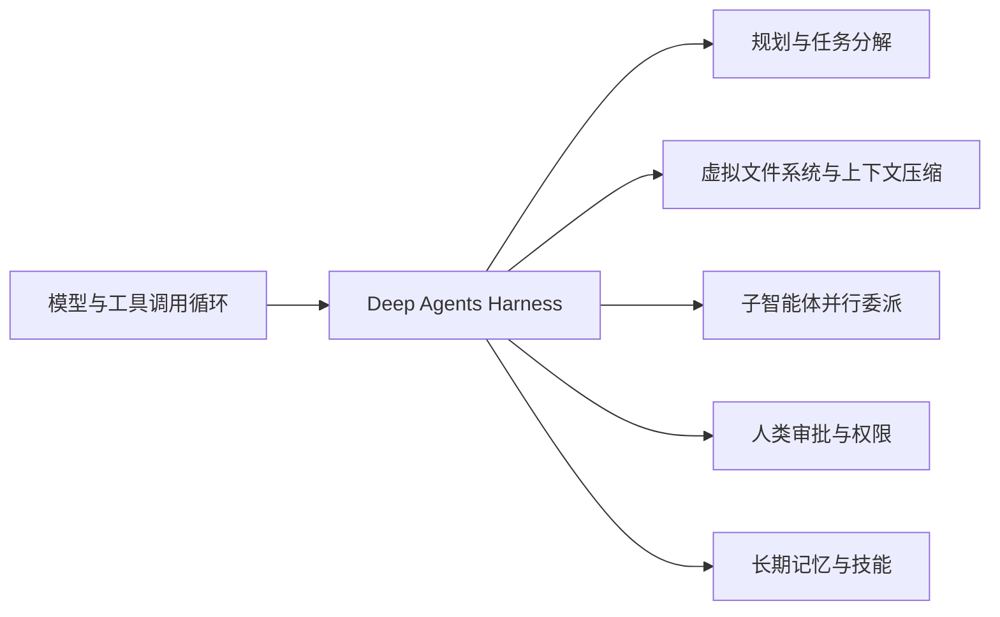
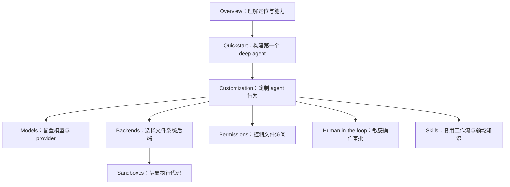

# DeepAgents Overview 结构化中文教程

## 来源与定位

- 官方来源：<https://docs.langchain.com/oss/python/deepagents/overview>
- 抓取时间：2026-06-02
- 资料类型：LangChain Deep Agents 官方 overview 页面教程萃取
- 适用对象：需要快速理解 Deep Agents 架构定位、核心能力、入门用法和后续学习路径的 AI 智能体

Deep Agents 是 LangChain 生态中的 agent harness，目标不是替代底层 agent 循环，而是在标准工具调用循环之上预置更适合真实任务的能力：规划、文件系统上下文管理、子智能体、长程记忆、人类审批和可复用技能。它适合复杂、多步骤、需要跨工具和长上下文协作的智能体应用。

## 一句话理解

Deep Agents 可以理解为“带工程化脚手架的智能体运行套件”：



它仍基于 LangChain 的核心构件，并使用 LangGraph runtime 提供 durable execution、streaming、human-in-the-loop 等运行时能力。

## 核心定位

官方页面将 Deep Agents 称为 agent harness。其含义是：

| 层级 | 角色 | Deep Agents 的关系 |
|---|---|---|
| LangChain | 提供 agent、model、tool 等核心构件 | Deep Agents 建立在这些基础构件之上 |
| LangGraph | 提供持久执行、流式输出、中断、人类介入等 runtime 能力 | Deep Agents 使用 LangGraph 作为执行运行时 |
| Deep Agents | 面向真实任务的 harness | 预置规划、文件系统、上下文管理、子智能体、记忆、权限等能力 |

如果只需要自定义一个轻量 agent，可以使用 LangChain 的 `create_agent`。如果需要完全自定义工作流，可以直接使用 LangGraph。Deep Agents 更适合希望快速得到一套完整工程能力的场景。

## 适用场景

Deep Agents 适合以下任务：

1. 复杂多步骤任务：需要先拆解任务、持续跟踪进度，并根据新信息调整计划。
2. 长时运行任务：需要压缩历史、卸载大型工具结果，避免上下文窗口被快速耗尽。
3. 文件密集型任务：需要读写文件、保存中间结果、跨步骤复用上下文。
4. 多智能体委派：需要把不同子任务交给通用或专门子智能体处理。
5. 高风险操作：需要在人类审批后才能执行敏感工具调用。
6. 可迭代应用：需要根据真实使用持续更新记忆、技能和提示词。

## 六类基础能力

官方 overview 首屏强调 Deep Agents 支持六类真实任务能力：

| 能力 | 含义 | 实践价值 |
|---|---|---|
| 在环境中行动 | 通过工具执行动作，读写文件，执行代码 | 让 agent 不只聊天，而能完成可验证工作 |
| 连接数据 | 在合适时机加载 memory、skill 和领域知识 | 避免一次性塞满上下文，提高相关性 |
| 管理增长上下文 | 对历史进行摘要，将大结果卸载到文件系统 | 支撑长会话和复杂任务链 |
| 并行化任务 | 在隔离上下文中委派给通用或专门子智能体 | 降低主上下文污染，提升复杂任务吞吐 |
| 保持人在回路中 | 在关键决策点暂停并等待人类审批 | 控制风险，适配生产级敏感操作 |
| 随使用改进 | 基于真实使用更新 memory、skill 和 prompt | 让 agent 系统持续演化 |

## 快速创建 Deep Agent

官方入门示例的核心 API 是 `create_deep_agent`。基本结构由三部分组成：

1. 选择模型提供商和模型标识。
2. 定义工具函数并传入 `tools`。
3. 设置系统提示词并调用 `agent.invoke`。

最小示例结构如下：

```python
from deepagents import create_deep_agent


def get_weather(city: str) -> str:
    """Get weather for a given city."""
    return f"It's always sunny in {city}!"


agent = create_deep_agent(
    model="openai:gpt-5.4",
    tools=[get_weather],
    system_prompt="You are a helpful assistant",
)

agent.invoke(
    {"messages": [{"role": "user", "content": "what is the weather in sf"}]}
)
```

官方页面展示了多个模型提供商的等价写法，主要差异是安装的 LangChain provider 包和 `model` 字符串：

| 提供商 | 安装包示例 | model 示例 |
|---|---|---|
| Google | `deepagents langchain-google-genai` | `google_genai:gemini-3.5-flash` |
| OpenAI | `deepagents langchain-openai` | `openai:gpt-5.4` |
| Anthropic | `deepagents langchain-anthropic` | `anthropic:claude-sonnet-4-6` |
| OpenRouter | `deepagents langchain-openrouter` | `openrouter:anthropic/claude-sonnet-4-6` |
| Fireworks | `deepagents langchain-fireworks` | `fireworks:accounts/fireworks/models/qwen3p5-397b-a17b` |
| Baseten | `deepagents langchain-baseten` | `baseten:zai-org/GLM-5` |
| Ollama | `deepagents langchain-ollama` | `ollama:devstral-2` |

实践上可以将 Deep Agents 的最小接入理解为：先用普通工具函数建立可调用动作，再用 provider 前缀选择模型，最后通过 LangChain 消息格式传入用户请求。

## 内置核心能力详解

### 规划与任务分解

Deep Agents 内置 `write_todos` 工具，让 agent 能把复杂任务拆成离散步骤，跟踪进度，并在发现新信息后调整计划。这类能力对长任务很关键，因为它把“任务状态”显式化，减少模型在长上下文中遗忘目标或遗漏步骤的概率。

### 上下文管理

Deep Agents 通过上下文压缩、虚拟文件系统和历史摘要来管理不断增长的上下文：

- 大型工具输入与结果可以卸载到虚拟文件系统。
- 旧消息可以被摘要，保留关键信息。
- 长运行任务可以继续有效工作，而不是被原始日志和长输出淹没。

这与工程实践中的“把中间产物落盘、把上下文摘要化”高度一致。

### 可插拔文件系统后端

Deep Agents 的虚拟文件系统支持可插拔后端，包括内存状态、本地磁盘、LangGraph store、组合路由和自定义后端。不同后端可以结合权限规则控制读写范围。

选择后端时可以按场景判断：

| 场景 | 后端倾向 |
|---|---|
| 教学、演示、短会话 | 内存状态 |
| 本地开发、需要真实文件操作 | 本地磁盘 |
| 跨会话持久化 | LangGraph store |
| 多目录、多介质混合读写 | 组合路由或自定义后端 |
| 高风险或隔离需求 | 带权限规则的受控后端 |

### Shell 执行

Shell-capable backend 会增加 `execute` 工具，用于测试、构建、git 操作和系统任务。官方建议本地开发可用 `LocalShellBackend`，需要隔离宿主系统时使用 sandbox backend。

这说明 Deep Agents 将“会调用工具的 agent”推进到了“能执行工程任务的 agent”，但也要求严格控制权限、审批和隔离边界。

### Interpreters

Deep Agents 支持添加 interpreter，在内存运行时中执行 JavaScript。Interpreters 可用于：

- 组合工具调用。
- 编排子智能体。
- 转换结构化数据。
- 在不启用完整 shell 环境的情况下执行轻量逻辑。

它适合处在“纯模型推理不够、完整 shell 又过重或风险更高”的中间地带。

### 子智能体生成

Deep Agents 内置 `task` 工具，可生成通用或专门子智能体，并让子智能体在隔离上下文窗口中处理子任务。对于长运行或并行工作，还支持 async subagents，具备进度检查、后续跟进和取消能力。

子智能体的关键价值不只是并行，而是上下文隔离：主智能体不必承载所有细节，子任务的噪音也不会直接污染主上下文。

### 长期记忆

Deep Agents 可使用 LangGraph Memory Store 在不同 thread 和 conversation 之间持久化 memory。这为个性化、项目长期知识、跨会话偏好和经验沉淀提供基础。

### 文件系统权限

Deep Agents 支持声明 permission rules，控制 agent 可读写哪些文件和目录。子智能体可以继承父级规则，也可以覆盖规则。

权限是生产级 agent 的关键能力，因为真实任务通常涉及私有代码、密钥、配置、构建产物和外部系统。没有权限边界的 shell 与文件访问会显著提高风险。

### Human-in-the-loop

Deep Agents 可基于 LangGraph interrupt capabilities 为敏感工具操作配置 human approval。典型需要审批的动作包括：

- 删除或覆盖文件。
- 执行高风险 shell 命令。
- 修改生产配置。
- 访问敏感目录。
- 提交、发布或部署。

### Skills

Deep Agents 可以通过 reusable skills 扩展 agent。Skill 可以提供专门工作流、领域知识和自定义指令。它适合沉淀重复任务，例如代码审查、网页抓取、文档归档、数据分析或特定业务流程。

### Smart defaults

Deep Agents 带有 opinionated system prompts，默认教模型先规划再行动、验证工作、管理上下文。使用者可以按需要定制或替换默认提示词。

这类默认值体现了 harness 的价值：把优秀 agent 行为从“每次手写提示词”变成“系统内置约定”。

## 推荐学习路径

官方 overview 的 Get started 区域给出了一组后续入口，可按以下顺序学习：



如果目标是生产应用，还应补充学习 LangSmith observability quickstart，用于追踪请求、调试 agent 行为和评估输出。

## 工程实践启示

Deep Agents overview 对智能体工程有以下启示：

1. Agent 的核心竞争力不只是模型能力，而是 harness 能否把规划、上下文、工具、权限、记忆和验证组合成稳定机制。
2. 文件系统是长任务 agent 的关键上下文层，可以承载中间产物、大结果和跨步骤状态。
3. 子智能体的第一价值是上下文隔离，第二价值才是并行化。
4. 人类审批与权限规则不是附加功能，而是让 agent 进入真实工程环境的前置条件。
5. Smart defaults 可以把最佳实践产品化，让新 agent 默认具备“先规划、再行动、再验证”的行为模式。

## 与 AgentForge 的关联理解

从 AgentForge 的视角看，Deep Agents 的 harness 思路与 `.agents/` 目录约定存在相似目标：都试图把智能体能力从临时提示词提升为可治理、可复用、可验证的工程结构。

对应关系可以这样理解：

| Deep Agents 能力 | AgentForge 可映射资产 |
|---|---|
| Planning / `write_todos` | `.trae/specs/*/tasks.md`、`.agents/docs/superpowers/plans/` |
| Skills | `.agents/skills/` 与 SKILL.md 规范 |
| Memory | `.agents/docs/superpowers/memories/` |
| Permissions | `constraints.toml`、规则文件与工作区边界 |
| Context management | `.agents/rules/context-economy.md` 与文档治理规则 |
| Subagents | `.agents/roles/`、`.agents/teams/` 与协作元模型 |

因此，Deep Agents 可以作为“运行时 harness”参考，而 AgentForge 更偏“项目内智能体资产治理与分发结构”。两者组合时，一个负责执行时能力，一个负责资产组织与长期演化。