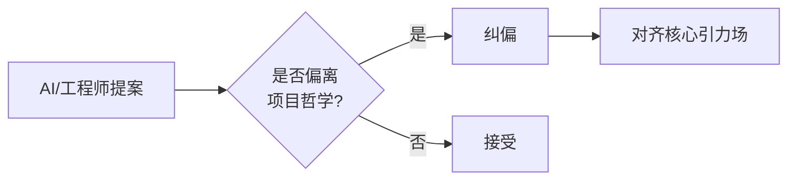
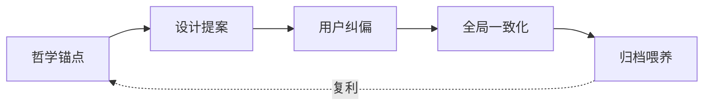

# 设计元层级洞察（Design Meta-Insights）

> **类型**：元规范参考资料 · 面向 AI Agent 与人类架构师
>
> **缘起**：2026-05-27 一次单会话设计探索（多端协同 → World Session 协议起草 → JSONL→TOML 全局一致化）后的元层级反思。沉淀为可复用的设计判断框架。
>
> **关联**：[`dao-tech-foundation.md`](./dao-tech-foundation.md) · [`agent-collaboration-metamodel.md`](./agent-collaboration-metamodel.md)

---

## 引子

这份文档不讲"做什么"，只讲"为什么这样做"。

它由 6 条相互独立、却共指同一方向的洞察组成。每一条都源自具体设计动作中浮现的元层级现象，但其适用范围远超原始场景——可作为后续设计探索的判断框架。

阅读建议：**遇到设计决策卡顿时，回查对应洞察**，而非通读。

---

## 1. 格式选择即文化选择

任何"看似纯技术"的格式选择，都在悄悄定义项目的**叙事语言**。

| 选择 | 暗示的文化 |
|---|---|
| JSONL / Protobuf / SQLite | 机器优先，工具链友好 |
| TOML / Markdown / YAML | 人类优先，**人和 AI 都能裸读** |

AgentForge 选择了 TOML 全局化（`world.toml` / `manifest.toml` / `events.toml`），本质是宣告：**这是一个"人和 AI 共同居住的世界"，不是单纯工程产物**。

### 判断规则
- 默认选**人类裸读优先**的格式
- 仅当性能/规模硬约束证明必要时，才下沉到机器优先格式
- 同一项目的同类数据（如配置、日志、状态）**必须风格一致**，否则文化分裂

---

## 2. 用户每一次纠偏都是在守门

架构师/资深用户的纠偏动作，常被误解为"修 bug"。实际上更深层的是：**强制提案与项目哲学共振**。



### 判断规则
- 收到纠偏时，**先问"我偏离了哪条核心引力？"**，再讨论方案
- 架构师的核心动作不是"做选择"，而是"**拒绝偏离**"
- 偏离常出现在"工程惯例"与"项目哲学"冲突时——前者通用，后者特异

---

## 3. 多端/多模块协同的真难点不在协议

设计任何协同系统时，事件流转、锁、schema 这些技术问题往往 200 行就讲清了。

**真正难的是边界问题**：
- 哪些事 A 该管？哪些不该管？
- X 字段算 A 的协议还是 B 的契约？
- 状态目录入不入 git？

### 判断规则
- 协议草案完成后，**留 50% 时间专门讨论边界**
- 多端系统失败大多不是协议设计错，而是**边界划得太大或太散**
- 边界默认从严（少则得），不够再扩——比从宽收难一万倍

---

## 4. 数据结构是哲学的工程显形

格式与结构选择不仅是技术问题，也是**世界观的物质投影**。

| 结构 | 隐喻的世界观 |
|---|---|
| Append-only log（JSONL） | **线性时间**：永远向前，事件是流逝 |
| Array of Tables（TOML `[[event]]`） | **循环可返**：每节自含，可被回看引用 |
| Immutable tree（Git 对象） | **历史不可改**：分歧通过 hash 区分 |
| CRDT | **多元真理共存**：每端各自正当 |

AgentForge 的事件日志选择 `[[event]]` 而非 JSONL，恰好对应**"反者道之动"**——事件不是流逝，而是循环可返回的卦象。

### 判断规则
- 选数据结构前，**先问"它隐喻什么世界观？"**
- 项目哲学冲突的结构，无论多优雅都要拒绝
- 这条洞察对 AI Agent 协议设计尤其重要——结构定义了"什么能被记得"

---

## 5. 寻找飞轮节点

任何复杂系统中都存在 **1–3 个飞轮节点**——它们一旦启动，会自动喂养系统其他部分。

### World Session 中的飞轮节点：`archive`

```
session 完成 → archive → retrospectives/ → 自动喂养项目长期记忆
```

效果：
- 每个 session 完成都在累积资产
- retrospectives 不再依赖人主动写
- AI Agent 的"记忆"从一次性变为**累积性资产**

### 判断规则
- 设计完一个系统，**主动找飞轮节点**——不一定是最显眼的命令
- 飞轮节点常在"任务收尾"处，因为它把瞬时态转为长期资产
- 没有飞轮节点的系统 = 永远靠人推动，无复利

---

## 6. 逆向开发：道→法→术→用

主流开发路径：
```
用（需求） → 术（代码） → 法（重构） → 道（事后总结）
```

AgentForge 走的路径：
```
道（哲学） → 法（协议） → 术（代码） → 用（场景）
```

风险极高（容易飘在概念）但**复利极强**——一旦某个抽象（如 World/Session）成立，**后续所有迭代都站在它的肩膀上**。

### 判断规则
- 项目早期，**允许"道→法"阶段不出代码**——这是投入而非浪费
- 但必须设硬约束：每个"道→法"阶段后必须有"术→用"验证，否则可能飘空
- 适合"长生命周期、强抽象需求"的项目；不适合"快验证、强现金流"的项目

---

## 综合应用：闭环模式

这 6 条洞察组成一个工作模式：



每一次设计探索同时在做三件事：

1. **解决眼前问题** —— 短期价值
2. **强化项目哲学** —— 中期一致性
3. **沉淀长期资产** —— 长期复利

这是 **"单次成本不变，但长期价值复利"** 的设计范式。

---

## 应用守则

| 触发场景 | 优先回查 |
|---|---|
| 选格式/结构时陷入纠结 | §1, §4 |
| 收到反对/纠偏意见 | §2 |
| 协议草案大体成型，准备交付 | §3（专门讨论边界） |
| 系统设计接近完成 | §5（找飞轮节点） |
| 在做"看不见短期 ROI 的事" | §6 |

---

## 反模式（应避免）

- ❌ 用"工程惯例"压倒"项目哲学"——惯例是均值，哲学是个性
- ❌ 协议完工即交付，跳过边界讨论
- ❌ 没找到飞轮节点就开始大规模实现
- ❌ 每次设计都从零讨论格式选择，不沉淀风格共识

---

## 关联资料

- [`dao-tech-foundation.md`](./dao-tech-foundation.md) — 道家哲学与工程映射基础
- [`agent-collaboration-metamodel.md`](./agent-collaboration-metamodel.md) — Team/Role/Agent 元模型
- [`agent-memory-dream-protocol.md`](./agent-memory-dream-protocol.md) — 记忆与梦境协议
- [`../../../../../docs/tech/world-session-spec.md`](../../../../../docs/tech/world-session-spec.md) — World Session 规约（本文档原始触发场景）
- [`../superpowers/retrospectives/task-summary-world-multi-surface-exploration-20260527.md`](../superpowers/retrospectives/task-summary-world-multi-surface-exploration-20260527.md) — 触发本文档的设计探索复盘

---

*版本：v1.0 · 2026-05-27 沉淀 · 后续遇到新洞察增量追加于此*
