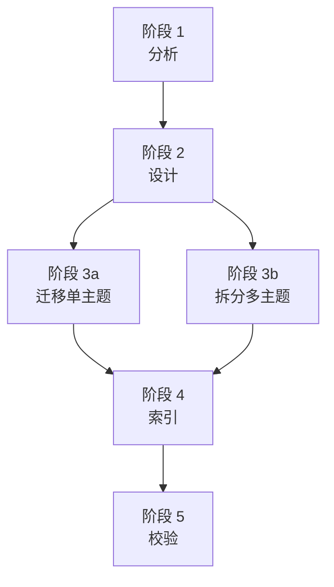

# 文档资产模块化重构方法论框架

> **维护责任人**：Leader Agent
> **创建日期**：2026-06-23
> **来源实例**：`refactor-retrospectives-modularization`（72 份文件、5 阶段 8 任务、47 个原子单元）
> **适用范围**：知识资产目录的模块化、原子化、结构化重构

## 1. 概述

本框架从一次完整的文档资产模块化重构实践中提取，泛化为可复用的标准化方法论。适用于将扁平、混杂、缺乏索引的知识资产目录重构为高内聚低耦合的模块化结构。


## 2. 标准化 5 阶段流程

### 阶段 1：分析

| 维度 | 内容 |
|------|------|
| **目标** | 盘点现状、提取元数据、建立分类映射、识别拆分对象 |
| **输入** | 目标目录路径、分类规则、拆分阈值 |
| **输出** | 分类映射表（文件名、行数、一级模块、二级主题、是否拆分、拆分方案） |
| **决策点** | ① 分类规则设计 ② 拆分阈值判定 ③ 分类边界冲突处理 |
| **关键产出** | 覆盖全部原始文件的分类映射表 |

**操作步骤**：
1. 读取全部文件头部（前 30-50 行），提取报告类型、日期、主题
2. 统计每份文件行数
3. 按分类规则分配至一级模块（按类型）与二级子模块（按主题）
4. 识别需原子化拆分的大型文档（行数超阈值或多主题）
5. 为每份需拆分的文档记录拆分方案

### 阶段 2：设计

| 维度 | 内容 |
|------|------|
| **目标** | 创建目录骨架、制定命名规范、定义拆分阈值 |
| **输入** | 阶段 1 的分类映射表 |
| **输出** | 目录骨架（一级模块 + 二级子模块 + 元数据目录）、命名规范文档 |
| **决策点** | ① 目录层级深度 ② 命名规范 ③ 元数据组织方式 |
| **关键产出** | 空目录树 + `_meta/naming-convention.md` |

**操作步骤**：
1. 创建一级模块目录（按文档类型）
2. 创建二级子模块目录（按主题，仅大型模块需要）
3. 创建 `_meta/` 元数据目录
4. 编写命名规范文档

**标准目录树结构**：
```
{target_dir}/
├── README.md                    # 总入口 + 导航索引
├── _meta/                       # 元数据与治理
│   ├── naming-convention.md     # 命名规范
│   ├── module-catalog.md        # 模块目录清单
│   ├── dependency-graph.md      # 依赖关系图谱
│   └── migration-log.md         # 迁移日志
├── {module-type-1}/             # 一级模块（按类型）
│   ├── README.md
│   └── {topic}-{date}/         # 原子化目录（如需拆分）
│       ├── index.md
│       └── {section-name}.md
├── {module-type-2}/
│   ├── README.md
│   └── {theme}/                 # 二级子模块（按主题）
│       └── README.md
└── misc/                        # 无法归类的其他文档
```

**标准命名规范**：
- 目录名：纯 ASCII 英文 kebab-case
- 文件名：`{topic}-{date}.md` 或 `{section-name}.md`（原子单元）
- 日期格式：YYYYMMDD
- 禁止：中文、emoji、空格

### 阶段 3：迁移

| 维度 | 内容 |
|------|------|
| **目标** | 迁移单主题文档、原子化拆分多主题文档 |
| **输入** | 目录骨架、分类映射表、命名规范 |
| **输出** | 全部文件迁移至目标位置、大型文档拆分为原子单元 |
| **决策点** | ① 拆分阈值判定 ② 原子单元粒度 ③ 别名声明 |
| **关键产出** | 迁移完成的目录结构（含原子化目录） |

**操作步骤**：
1. **迁移单主题文档**（可批量执行）：按分类映射表将文件移动至目标模块目录
2. **原子化拆分多主题文档**（逐份执行）：
   - 读取完整内容
   - 识别主要章节（H2 标题）
   - 创建同名目录（去掉 .md 后缀）
   - 创建 `index.md`（含元数据、别名声明、概述、原子单元索引表）
   - 将每个章节写入独立原子单元文件
   - 删除原始文件

**原子化目录的 `index.md` 标准格式**：
```markdown
# {原标题}

> **别名**：曾用名 {old-filename}.md，已原子化拆分

{头部元数据}

## 概述

{概述段落}

## 原子单元索引

| 单元名 | 主题 | 链接 |
|--------|------|------|
| {section-name}.md | {主题描述} | [链接](./{section-name}.md) |
```

### 阶段 4：索引

| 维度 | 内容 |
|------|------|
| **目标** | 编写模块 README、总入口索引、依赖图谱、迁移日志 |
| **输入** | 迁移完成的目录结构 |
| **输出** | 全部 README.md、`_meta/` 下 4 份元数据文档 |
| **决策点** | ① 模块说明内容深度 ② 依赖图谱可视化方式 ③ 迁移日志字段 |
| **关键产出** | 完整的索引与元数据体系 |

**操作步骤**：
1. 编写各模块 `README.md`（一级模块 + 二级子模块）
2. 编写根目录 `README.md`（总入口 + 导航 + 检索指南）
3. 编写 `_meta/module-catalog.md`（模块目录清单）
4. 编写 `_meta/dependency-graph.md`（依赖关系图谱）
5. 编写 `_meta/migration-log.md`（迁移日志）

**模块 README 标准格式**：
```markdown
# {模块名称}

> **维护责任人**：Leader Agent

## 模块功能

{1-2 句话描述模块用途}

## 使用方法

- **何时查阅**：{查阅场景}
- **如何引用**：使用相对路径引用

## 依赖关系

{列出引用的其他模块或文档}

## 文件清单

| 文件/目录 | 说明 |
|----------|------|
| {filename} | {简要说明} |
```

**迁移日志标准格式**：
```markdown
| # | 原始文件名 | 一级模块 | 二级主题 | 是否拆分 | 迁移去向 | 校验状态 |
|---|-----------|---------|---------|---------|---------|---------|
| 1 | {filename} | {module} | {theme} | 是/否 | {path} | 完整迁移 |
```

### 阶段 5：校验

| 维度 | 内容 |
|------|------|
| **目标** | 更新外部引用、完整性检查、命名规范验证 |
| **输入** | 完整的模块化目录结构 |
| **输出** | 外部引用更新、校验通过的报告 |
| **决策点** | ① 引用更新范围 ② 校验维度 ③ 失败处理 |
| **关键产出** | 全部校验通过的质量评估 |

**操作步骤**：
1. 搜索项目内所有引用目标目录文件的文档
2. 更新引用路径至模块化新路径
3. 在文件名变更的文档头部添加别名声明
4. 执行完整性校验（4 维度）
5. 生成校验报告

### 阶段依赖关系



- 阶段 2 依赖阶段 1
- 阶段 3 依赖阶段 2
- 阶段 3 内"迁移"与"拆分"可并行
- 阶段 4 依赖阶段 3
- 阶段 5 依赖阶段 4

## 3. 可复用提示词模板

以下 5 类提示词模板使用参数化占位符，可复用至不同目录的重构任务。

### 3.1 分类映射提示词

```
你是一个研究型子智能体。任务：对 `{base_path}` 目录下的全部 {file_count} 份 markdown 文件建立分类映射表。

具体要求：
1. 读取每份文件的前 30 行（头部元数据），提取：报告类型、日期、主题
2. 统计每份文件的行数
3. 对每份文件进行分类：
   - 一级模块：{level1_modules}
   - 二级主题：{level2_themes}
4. 识别需要原子化拆分的文件（行数 > {split_threshold} 或包含 3 个以上独立主题章节）

分类规则：
{classification_rules}

输出格式：返回一个完整的 markdown 表格，包含以下列：
| 原始文件名 | 行数 | 一级模块 | 二级主题 | 是否需原子化拆分 | 拆分建议 |

请确保覆盖全部 {file_count} 份文件。这是纯研究任务，不要修改任何文件。
```

### 3.2 原子化拆分提示词

```
你是一个文档重构子智能体。任务：对文件 `{file_path}` 进行原子化拆分。

步骤：
1. 读取该文件的完整内容
2. 识别文件中的主要章节（H2 标题），将内容按主题拆分为独立原子单元
3. 在同目录下创建目录 `{atomized_dir_name}/`（即去掉 .md 后缀的同名目录）
4. 在该目录内创建 `index.md`，内容包括：
   - 原文档的标题和头部元数据
   - 别名声明：`> **别名**：曾用名 {old_filename}，已原子化拆分`
   - 概述段落
   - 原子单元索引表（单元名、主题、链接）
5. 将每个主要章节内容写入独立的原子单元文件，文件名使用英文 kebab-case
6. 每个原子单元文件开头保留原章节标题作为 H1
7. 删除原始文件 `{old_filename}`

要求：
- 确保所有原始内容完整保留，不丢失任何信息
- 原子单元文件名必须为纯 ASCII 英文 kebab-case
- 每个原子单元专注单一主题，可独立阅读
- 使用 Write 工具创建文件，使用 DeleteFile 工具删除原文件
```

### 3.3 模块 README 提示词

```
你是一个文档编写子智能体。任务：为模块化重构后的各模块编写 README.md 文件。

基础路径：`{base_path}`

需要编写的 README 文件清单：
{readme_list_with_file_counts}

每个 README.md 的格式要求：

# {模块名称}

> **维护责任人**：Leader Agent

## 模块功能

{1-2 句话描述模块用途}

## 使用方法

- **何时查阅**：{查阅场景}
- **如何引用**：使用相对路径引用，如 `[文档名](./filename.md)`

## 依赖关系

{列出该模块引用的其他模块或外部文档，如无则写"无外部依赖"}

## 文件清单

| 文件/目录 | 说明 |
|----------|------|
| {filename} | {简要说明} |

注意：
- 使用 Write 工具创建文件
- 文件内容使用中文
- 文件名和路径使用英文
- 确保每个 README 的文件清单准确完整
```

### 3.4 依赖图谱与迁移日志提示词

```
你是一个研究型子智能体。任务：为模块化重构构建依赖关系图谱和迁移日志。

基础路径：`{base_path}`

## 任务 1：依赖关系图谱

扫描该目录下所有 markdown 文件，查找文件内的相对路径引用（如 `./xxx.md`、`../xxx.md`），构建依赖关系。

输出文件：`{base_path}/_meta/dependency-graph.md`

格式要求：
# 依赖关系图谱

> **生成日期**：{date}
> **维护责任人**：Leader Agent

## 模块间依赖关系
{使用表格列出模块间的依赖关系}

## 文档间引用关系
{使用表格列出文档间的引用关系：引用方、被引用方、引用路径}

## 关键依赖链可视化
```mermaid
flowchart TD
    {使用 Mermaid 流程图可视化关键依赖链}
```

使用 Grep 工具搜索所有 .md 文件中的引用模式（如 `\]\(.*\.md\)`）。

## 任务 2：迁移日志

基于分类映射，生成完整的迁移日志。

输出文件：`{base_path}/_meta/migration-log.md`

格式要求：
# 迁移日志

> **生成日期**：{date}
> **维护责任人**：Leader Agent
> **原始文件总数**：{count}
> **迁移完成数**：{count}

## 迁移记录

| # | 原始文件名 | 一级模块 | 二级主题 | 是否拆分 | 迁移去向 | 校验状态 |
|---|-----------|---------|---------|---------|---------|---------|

{migration_mapping}

注意：使用 Write 工具创建文件。两个文件都需要完整覆盖全部原始文件。
```

### 3.5 引用更新提示词

```
你是一个文档维护子智能体。任务：更新项目内所有对 {target_dir} 文件的引用路径，使其指向模块化重构后的新路径。

重构规则：原扁平路径 `{target_dir}/{filename}.md` 需更新为 `{target_dir}/{module}/{theme}/{filename}.md`。

以下是需要更新的文件及其引用路径映射：
{reference_mapping}

操作要求：
1. 先用 Read 工具读取每个文件，确认引用位置
2. 用 Edit 工具更新引用路径
3. 注意：markdown 链接格式为 `[链接文本](链接路径)`，需要同时更新链接文本中的文件名引用和链接路径
4. 对于纯文本引用（如 `.agents/docs/.../xxx.md`），只需更新路径
5. 不要修改文件的其他内容
```

## 4. 常见场景处理指南

### 4.1 拆分阈值判定

| 场景 | 判定 | 处理 |
|------|------|------|
| 行数 ≤ 200 行 | 单主题 | 保持单文件，不拆分 |
| 行数 200-400 行 + 标准模板章节 | 同一主题的组成部分 | 保持单文件，不拆分 |
| 行数 200-400 行 + 3+ 独立主题 | 多主题 | 执行原子化拆分 |
| 行数 > 400 行 | 大概率多主题 | 执行原子化拆分 |

**判定原则**：标准模板章节（如 10 章标准复盘模板的"执行概览/目标背景/执行过程/..."）是同一主题的组成部分，非独立主题，不触发拆分。

### 4.2 分类边界冲突

**触发条件**：一份文档同时匹配多个分类规则。

**处理方案**：
1. 按优先级匹配：一级模块 > 二级主题
2. 在迁移日志中记录分类决策理由
3. 示例：`task-summary-v0.3.0-release-and-ci-docs-hardening` 同时含 "v0.3.0"（releases）和 "ci"（ci-cd），按 releases 优先匹配

### 4.3 命名漂移处理

**触发条件**：同一目录内存在多种命名格式（如 `agentforge-project-retrospective-20260523.md`、`retrospective-agentforge-project-20260601.md`、`project-retrospective-governance-assets-20260609.md`）。

**处理方案**：
1. 统一为目标命名规范（`{topic}-{date}.md`）
2. 在文件头部添加别名声明保留旧引用入口
3. 别名声明格式：`> **别名**：曾用名 {old-filename}，已迁移至此`

### 4.4 跨模块引用处理

**触发条件**：文档 A 引用文档 B，且两者迁移至不同模块。

**处理方案**：
1. 更新 A 中的引用路径至 B 的新路径
2. 在依赖图谱中记录跨模块引用关系
3. 使用 Grep 搜索项目内所有 `.md` 文件中的引用模式 `\]\(.*{target_dir}.*\.md\)`

### 4.5 原子单元粒度判定

**触发条件**：拆分大型文档时难以确定章节是否为独立主题。

**判定标准**：
- ✅ 独立主题：该章节可独立阅读且不依赖其他章节上下文
- ✅ 独立主题：该章节描述一个完整的功能点或设计原则
- ❌ 非独立主题：该章节是标准模板的固定组成部分（如"执行概览"、"目标背景"）
- ❌ 非独立主题：该章节内容极简（< 20 行），拆分后无独立阅读价值

### 4.6 迁移中断恢复

**触发条件**：迁移过程中断（如子智能体失败、网络中断）。

**处理方案**：
1. 通过迁移日志的"校验状态"字段定位未完成项
2. 校验状态值：`完整迁移` / `待校验` / `部分丢失`
3. 对未完成项重新执行对应阶段的任务
4. 重新校验

## 5. 质量评估标准

### 5.1 评估维度

| 维度 | 指标 | 通过标准 | 验证方法 |
|------|------|---------|---------|
| **完整性** | 迁移日志覆盖率 | 100% | 迁移日志记录数 = 原始文件数 |
| **完整性** | 内容丢失率 | 0% | 抽查原子单元内容与原文对比 |
| **一致性** | 命名规范违反数 | 0 | 扫描所有文件名，检查 ASCII/kebab-case/日期格式 |
| **一致性** | 目录树结构合规率 | 100% | 对比实际目录树与设计目录树 |
| **可追溯性** | 依赖图谱覆盖率 | 100% | 图谱记录所有文档的引用关系 |
| **可追溯性** | 外部引用更新率 | 100% | Grep 搜索旧路径，应为 0 结果 |
| **可维护性** | 模块 README 覆盖率 | 100% | 每个模块目录含 README.md |
| **可维护性** | 检索指南完整性 | 含导航表+检索指南 | 根 README 含导航表与检索指南 |

### 5.2 评估通过标准

- 所有维度指标达到通过标准 → 评估为"通过"
- 任一指标未达标 → 创建修复任务并重新校验

### 5.3 自动化校验脚本

```powershell
# 校验脚本示例（PowerShell）
$base = "{target_dir}"

# 1. 根目录无散落文件（除 README.md）
$rootMd = Get-ChildItem $base -File -Filter *.md | Where-Object { $_.Name -ne "README.md" }
# 通过条件：$rootMd.Count -eq 0

# 2. 所有文件名为纯 ASCII
$allMd = Get-ChildItem $base -Recurse -File -Filter *.md
$nonAscii = $allMd | Where-Object { $_.Name -match '[^\x00-\x7F]' }
# 通过条件：$nonAscii.Count -eq 0

# 3. 所有模块含 README.md
# 通过条件：每个模块目录下存在 README.md

# 4. 元数据文件存在
# 通过条件：_meta/ 下存在 naming-convention.md、module-catalog.md、dependency-graph.md、migration-log.md

# 5. 原子化目录含 index.md
# 通过条件：每个原子化目录下存在 index.md
```

## 6. 适用性边界

### 6.1 适用场景

| # | 场景 | 触发信号 |
|---|------|---------|
| 1 | 扁平目录存放 20+ 份同类文档 | 缺乏模块化组织，检索成本高 |
| 2 | 大型文档覆盖多个独立主题 | 行数 > 400 或含 3+ 独立主题章节 |
| 3 | 命名格式漂移 | 存在多种命名变体并存 |
| 4 | 缺乏索引的知识资产目录 | 无模块说明、无依赖图谱、无迁移日志 |

### 6.2 不适用场景

| # | 场景 | 原因 |
|---|------|------|
| 1 | 文档总数少于 10 份 | 组织成本大于收益 |
| 2 | 文档均为单主题短文档 | 无原子化拆分需求 |
| 3 | 目录已具备模块化结构 | 命名规范一致，无需重构 |
| 4 | 代码文件重构 | 本框架针对文档资产，非代码 |

## 7. 参考实例

本框架提取自 `refactor-retrospectives-modularization` 重构任务，该实例的关键数据：

| 指标 | 数值 |
|------|------|
| 原始文件总数 | 72 |
| 一级模块数 | 6 |
| 二级子模块数 | 9 |
| 原子化拆分目录数 | 5 |
| 原子单元文件总数 | 47 |
| 模块 README 总数 | 15 |
| 元数据文档总数 | 4 |
| 迁移完成率 | 100% (72/72) |
| 外部引用更新文件数 | 10 |

实例文档位置：
- Spec：`.trae/specs/refactor-retrospectives-modularization/`
- 重构产出：`apps/chaos/.agents/docs/superpowers/retrospectives/`
